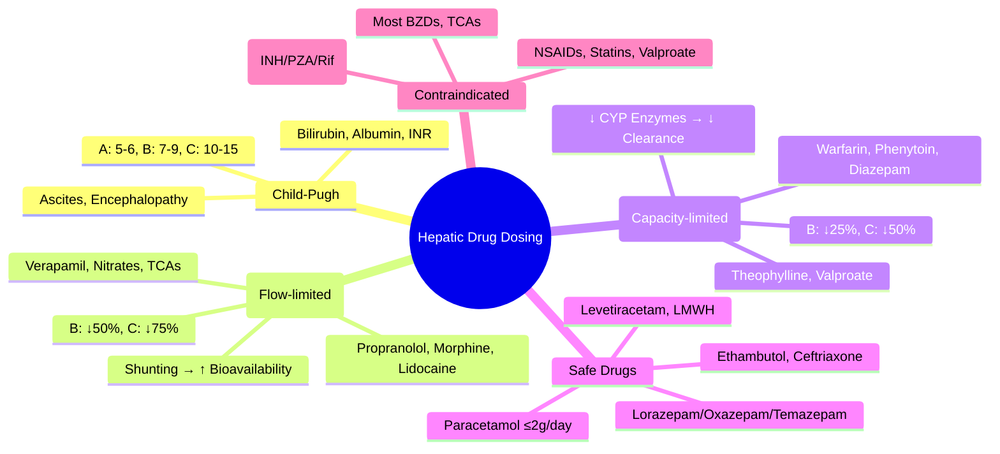

# Hepatic Drug Dosing in Liver Disease

> [!tip] **FCPS/MRCP Priority: HIGH**
> **Daily hepatology/gastro ward practice.** Child-Pugh scoring, High vs Low extraction ratio drugs, Dose adjustment by Child-Pugh class, Drugs contraindicated in liver disease.
> Viva: *"How does liver disease affect drug metabolism? Which drugs need dose reduction in Child-Pugh B?"*

---

## Learning Objectives
By the end of this note you should be able to:
- [ ] Calculate **Child-Pugh Score** and classify A/B/C
- [ ] Distinguish **High vs Low extraction ratio drugs** and their dosing implications
- [ ] Apply **hepatic dose adjustment principles** per Child-Pugh class
- [ ] Identify **drugs contraindicated** in hepatic impairment
- [ ] Choose **safer alternatives** for common indications in cirrhosis

---

## 1. Child-Pugh Classification (Scoring System)

| Parameter | 1 Point | 2 Points | 3 Points |
|-----------|---------|----------|----------|
| **Bilirubin (μmol/L)** | <34 | 34-50 | >50 |
| **Albumin (g/L)** | >35 | 28-35 | <28 |
| **INR** | <1.7 | 1.7-2.3 | >2.3 |
| **Ascites** | None | Mild/Moderate (diuretic responsive) | Tense (refractory) |
| **Encephalopathy** | None | Grade 1-2 | Grade 3-4 |

| Class | Score | 1-Year Survival | 2-Year Survival | Dosing Implication |
|-------|-------|-----------------|-----------------|-------------------|
| **A (Mild)** | 5-6 | 100% | 85% | Minor reduction for high-extraction drugs; Standard for most |
| **B (Moderate)** | 7-9 | 80% | 60% | Reduce dose 50% for high-extraction; 25% for low-extraction |
| **C (Severe)** | 10-15 | 45% | 35% | Avoid most hepatically cleared drugs; Use alternatives |

---

## 2. Hepatic Drug Metabolism Principles

### High Extraction Ratio Drugs (Flow-Limited Clearance)
> **Clearance ≈ Hepatic Blood Flow** — Dependent on liver perfusion, NOT enzyme activity
> **First-pass metabolism HIGH** — Oral bioavailability ↑ significantly in cirrhosis (shunting)

| Drug | Extraction Ratio | Clinical Implication in Cirrhosis |
|------|------------------|-----------------------------------|
| **Propranolol** | ~0.8 | ↑ Oral bioavailability 3-5x; **Reduce dose significantly** |
| **Lidocaine** | ~0.7 | ↓ Clearance; **Reduce infusion rate** |
| **Morphine** | ~0.7 | ↑ Bioavailability, ↓ Clearance; **Reduce dose, extend interval** |
| **Verapamil** | ~0.6 | ↑ Bioavailability; **Reduce dose** |
| **Nitrates (GTN, ISMN)** | High | ↑ Bioavailability; **Reduce dose** |
| **Tricyclic antidepressants** | High | ↑ Levels; **Reduce dose** |

**Dosing Rule:** **Child-Pugh B: ↓50% dose; Child-Pugh C: ↓75% or avoid**

### Low Extraction Ratio Drugs (Capacity-Limited Clearance)
> **Clearance ≈ Intrinsic Enzyme Activity** — Dependent on CYP450 function (↓ in cirrhosis)
> **First-pass LOW** — Oral bioavailability less affected

| Drug | Extraction Ratio | Clinical Implication |
|------|------------------|---------------------|
| **Warfarin** | Low | ↓ Clearance → ↑ INR; **Reduce dose, frequent INR monitoring** |
| **Phenytoin** | Low | ↓ Clearance, ↓ Protein binding → ↑ Free fraction; **Monitor free level** |
| **Diazepam** | Low | ↓ Clearance, ↑ Half-life (up to 100h); **Reduce dose, avoid accumulation** |
| **Theophylline** | Low | ↓ Clearance; **Reduce dose, monitor level** |
| **Valproate** | Low | ↓ Clearance, ↓ Protein binding; **Monitor free level** |

**Dosing Rule:** **Child-Pugh B: ↓25% dose; Child-Pugh C: ↓50% or avoid**

---

## 3. Drug-Specific Hepatic Dosing Adjustments

### Anticoagulation in Liver Disease
| Drug | Child-Pugh A | Child-Pugh B | Child-Pugh C | Notes |
|------|--------------|--------------|--------------|-------|
| **Warfarin** | Standard; INR q1-2wk | Reduce dose; INR q1wk | **Avoid if possible**; INR q3-4d | Unpredictable response; Low extraction |
| **DOACs** | **Rivaroxaban/Apixaban: OK** | **Rivaroxaban: Caution; Apixaban: OK** | **CONTRAINDICATED** (Apixaban 2.5mg off-label only) | Rivaroxaban 20% hepatic; Apixaban 25% hepatic |
| **LMWH (Enoxaparin)** | Standard; Anti-Xa if needed | Standard; Anti-Xa monitoring | Standard; Anti-Xa monitoring | Preferred in severe liver disease |
| **UFH** | Standard | Standard | Standard | Short half-life, reversible |

### Analgesia in Liver Disease
| Drug | Child-Pugh A | Child-Pugh B | Child-Pugh C | Safer Alternative |
|------|--------------|--------------|--------------|-------------------|
| **Paracetamol** | **Max 2g/day** (↓ from 4g) | **Max 2g/day** | **Max 2g/day** (or avoid) | **Preferred** — Low dose safe |
| **NSAIDs** | Avoid | **Contraindicated** | Contraindicated | — |
| **Morphine** | Reduce dose | Reduce 50% | **Avoid** | **Oxycodone, Fentanyl, Alfentanil** |
| **Tramadol** | Reduce dose | Reduce 50% | Avoid | — |
| **Codeine** | Avoid (unpredictable) | Avoid | Avoid | — |

### Sedatives/Hypnotics in Liver Disease
| Drug | Child-Pugh A | Child-Pugh B | Child-Pugh C | Notes |
|------|--------------|--------------|--------------|-------|
| **Benzodiazepines** | Reduce dose | **Avoid** (Lorazepam OK — no oxidative metabolism) | **Avoid** | **Lorazepam, Oxazepam, Temazepam** preferred (glucuronidation) |
| **Z-drugs (Zolpidem)** | Reduce | Avoid | Avoid | — |
| **Antipsychotics** | Reduce (Quetiapine preferred) | Reduce 50% | Avoid | Quetiapine, Olanzapine (lower EPSE) |

### Antibiotics in Liver Disease
| Drug | Adjustment | Notes |
|------|------------|-------|
| **Rifampicin** | Avoid (inducer + hepatotoxic) | Use alternative for TB |
| **Isoniazid** | Avoid if possible (hepatotoxic) | If essential: Monitor LFTs weekly |
| **Pyrazinamide** | Avoid (hepatotoxic) | — |
| **Ethambutol** | Safe | No hepatic metabolism |
| **Fluconazole** | Standard | Renal adjustment if needed |
| **Metronidazole** | Reduce dose in severe | Neurotoxicity risk |
| **Ceftriaxone** | Safe | Biliary excretion — No dose adj |

---

## 4. Drugs Contraindicated in Significant Hepatic Impairment

| Drug | Reason |
|------|--------|
| **Statins (Simvastatin, Atorvastatin, Rosuvastatin)** | Hepatotoxicity risk; Myopathy ↑ |
| **Methotrexate** | Hepatotoxicity; Fibrosis progression |
| **Valproate** | Hyperammonaemia, Hepatotoxicity |
| **Carbamazepine** | Enzyme induction unpredictable; Hepatotoxicity |
| **Isoniazid/Pyrazinamide/Rifampicin** | Anti-TB hepatotoxicity (Use Ethambutol/Streptomycin/Levofloxacin) |
| **Ketoconazole** | Severe hepatotoxicity |
| **Nitrofurantoin** | Hepatotoxicity |
| **Halothane** | Halothane hepatitis (Historical) |
| **Oral contraceptives** | Thrombosis risk in cirrhosis (Portal HTN) |

---

## 5. Safer Alternatives in Cirrhosis (Quick Reference)

| Indication | Avoid | Preferred Alternative |
|------------|-------|----------------------|
| **Anticoagulation (AF/VTE)** | Warfarin (unpredictable), DOACs (C) | **LMWH (Enoxaparin) — Anti-Xa monitored** |
| **Analgesia (Moderate-Severe)** | Morphine, NSAIDs | **Fentanyl/Alfentanil (IV), Oxycodone (PO, reduced), Paracetamol ≤2g/day** |
| **Sedation (ICU/Procedural)** | Midazolam, Diazepam | **Lorazepam (no oxidative metabolism), Propofol (caution hypotension)** |
| **Antihypertensive (Portal HTN)** | Propranolol (high extraction) | **Carvedilol (some hepatic, but evidence in portal HTN), ISMN** |
| **Antidepressant** | TCAs, Duloxetine | **Sertraline, Citalopram (caution QT), Mirtazapine** |
| **Antiepileptic** | Phenytoin, Carbamazepine, Valproate | **Levetiracetam (Renal), Lacosamide, Lamotrigine (slow titration)** |
| **Statin (if essential)** | All statins | **Pravastatin (Least hepatic) — Low dose, Monitor LFTs** |

---

## 6. FCPS/MRCP High-Yield Summary

| Topic | Key Points |
|-------|------------|
| **Child-Pugh Score** | Bilirubin, Albumin, INR, Ascites, Encephalopathy → Class A(5-6), B(7-9), C(10-15) |
| **High Extraction Drugs** | Propranolol, Lidocaine, Morphine, Verapamil, Nitrates, TCAs — **Flow-limited**; ↑ Bioavailability in cirrhosis |
| **Low Extraction Drugs** | Warfarin, Phenytoin, Diazepam, Theophylline, Valproate — **Capacity-limited**; ↓ Clearance in cirrhosis |
| **Child-Pugh B Dosing** | High extraction: ↓50%; Low extraction: ↓25% |
| **Child-Pugh C Dosing** | High extraction: ↓75% or avoid; Low extraction: ↓50% or avoid |
| **Paracetamol** | **Max 2g/day in ALL cirrhosis** (Standard 4g → Hepatotoxicity) |
| **NSAIDs** | **Contraindicated** in cirrhosis (Renal vasoconstriction → AKI/HRS) |
| **Benzodiazepines** | **Avoid** (except Lorazepam/Oxazepam/Temazepam — Glucuronidation) |
| **Anticoagulation** | **LMWH preferred** in severe liver disease; DOACs contraindicated in Child-Pugh C |
| **Statins** | Avoid in decompensated cirrhosis; If essential → Pravastatin low dose |

---

## 7. Viva Questions (MRCP PACES / FCPS)

| Question | Expected Answer |
|----------|-----------------|
| **How does cirrhosis affect drug metabolism? High vs Low extraction?** | **High extraction (Flow-limited):** Propranolol, Morphine, Lidocaine — Clearance depends on hepatic blood flow; Shunting → ↑ Bioavailability, ↑ Oral levels. **Low extraction (Capacity-limited):** Warfarin, Phenytoin, Diazepam — Clearance depends on CYP enzyme activity; Cirrhosis → ↓ Enzymes → ↓ Clearance, ↑ Half-life. |
| **Child-Pugh B cirrhosis: Which drugs need 50% dose reduction?** | **High extraction drugs:** Propranolol, Morphine, Lidocaine, Verapamil, Nitrates, TCAs. **Also consider:** Paracetamol max 2g/day. |
| **Patient with Child-Pugh C cirrhosis needs anticoagulation for AF. Choice?** | **LMWH (Enoxaparin) with Anti-Xa monitoring** — DOACs contraindicated in Child-Pugh C; Warfarin unpredictable. |
| **Why is paracetamol dose reduced in cirrhosis?** | **Glucuronidation/Sulfation capacity reduced** → Shunting to oxidative pathway (CYP2E1) → ↑ NAPQI → Hepatotoxicity. **Max 2g/day.** |
| **Which benzodiazepine is SAFE in liver disease?** | **Lorazepam, Oxazepam, Temazepam** — Glucuronidation (Phase II) preserved in cirrhosis; No oxidative metabolism. Avoid Diazepam, Midazolam, Clonazepam. |
| **Statin in compensated cirrhosis — which is safest?** | **Pravastatin** — Least hepatic metabolism (Not CYP3A4); Hydrophilic; Low dose, Monitor LFTs. Avoid Simvastatin/Atorvastatin/Rosuvastatin. |
| **Morphine in Child-Pugh B — alternative?** | **Fentanyl, Alfentanil, Oxycodone (reduced dose)** — Less dependent on hepatic glucuronidation; Fentanyl/Alfentanil = CYP3A4 but less active metabolites. |

---

## 8. Confusions & Mnemonics

| Confusion | Clarification |
|-----------|---------------|
| **High vs Low extraction — which has ↑ bioavailability in cirrhosis?** | **High extraction** — Shunting bypasses first-pass → ↑ Oral bioavailability (Propranolol 3-5x). Low extraction — First-pass already low; Bioavailability less affected. |
| **Child-Pugh vs MELD for dosing?** | **Child-Pugh for drug dosing** (Class A/B/C guides adjustment); **MELD for transplant allocation** |
| **Paracetamol in cirrhosis — is it safe?** | **Yes, at reduced dose (≤2g/day)** — Therapeutic dose safe; Toxic dose lower threshold |
| **DOACs in Child-Pugh B — which are OK?** | **Apixaban** (25% hepatic) — OK in B; **Rivaroxaban** (20% hepatic + P-gp) — Caution in B; **Both CONTRAINDICATED in C** |
| **Lorazepam vs Diazepam in liver disease?** | **Lorazepam = Glucuronidation (Safe); Diazepam = CYP2C19/3A4 oxidative (Avoid)** |

**Mnemonic: CHILD-LIVER**
- **C**hild-Pugh: Bilirubin, Albumin, INR, Ascites, Encephalopathy
- **H**igh extraction: Propranolol, Morphine, Lidocaine, Verapamil, Nitrates, TCAs → Flow-limited
- **I**NR unpredictable on Warfarin in cirrhosis
- **L**ow extraction: Warfarin, Phenytoin, Diazepam, Theophylline, Valproate → Capacity-limited
- **D**ose: B = High↓50%, Low↓25%; C = High↓75%, Low↓50%
- **L**orazepam/Oxazepam/Temazepam = Safe BZDs (Glucuronidation)
- **I**buprofen/NSAIDs = Contraindicated (AKI/HRS risk)
- **V**alproate = Avoid (Hyperammonaemia, Hepatotoxicity)
- **E**noxaparin (LMWH) = Preferred anticoagulant in severe liver disease
- **R**osuvastatin/Simva/Atorva = Avoid statins in decompensated cirrhosis

---

## 9. Mind Map

---

## 10. Spaced Repetition Trackers
| Review Interval | Date Completed | Confidence (1-5) | Notes |
|-----------------|----------------|------------------|-------|
| 24 hours | | | |
| 7 days | | | |
| 15 days | | | |
| 30 days | | | |
| 90 days | | | |

---

## 11. Self-Test Scorecard
| Section | Score /5 | Last Attempt |
|---------|----------|--------------|
| Child-Pugh Calculation | | |
| High vs Low Extraction | | |
| Dose Adjustments by Class | | |
| Contraindicated Drugs | | |
| Safer Alternatives | | |

---

## 12. Exam Answer Modes

### Long Answer Skeleton
1. Calculate Child-Pugh score for vignette
2. Classify drug as High/Low extraction
3. Apply dose adjustment per Child-Pugh class
4. Identify contraindications & safer alternatives

### Short Note Skeleton
- **Child-Pugh:** Bilirubin, Albumin, INR, Ascites, Encephalopathy
- **High Extraction (Flow):** Propranolol, Morphine, Lidocaine, Verapamil, Nitrates, TCAs → B↓50%, C↓75%
- **Low Extraction (Capacity):** Warfarin, Phenytoin, Diazepam, Theophylline, Valproate → B↓25%, C↓50%
- **Paracetamol:** Max 2g/day ALL cirrhosis
- **NSAIDs:** Contraindicated
- **BZDs:** Lorazepam/Oxazepam/Temazepam safe (Glucuronidation)

### Viva One-Liners
- "High extraction = Flow limited = Shunting → ↑ Bioavailability"
- "Low extraction = Capacity limited = ↓ CYP → ↓ Clearance"
- "Paracetamol max 2g/day in cirrhosis — NAPQI risk"
- "LMWH preferred anticoagulant in Child-Pugh C"
- "Lorazepam safe in liver disease — Glucuronidation preserved"

### Ward-Case Discussion Points
- Admission: Calculate Child-Pugh for ALL cirrhotics — Adjust every drug
- Paracetamol prescribing: **ALWAYS max 2g/day** in liver disease
- Avoid NSAIDs — AKI/HRS risk
- Anticoagulation: LMWH + Anti-Xa monitoring in severe disease
- Sedation: Lorazepam for procedures/ICU; Avoid midazolam/diazepam

### Last-Night-Before-Exam Sheet
- **Child-Pugh:** Bili, Alb, INR, Ascites, Enceph → A/B/C
- **High Ext (Flow):** Prop, Morph, Lido, Verap, Nitrates, TCAs → B↓50%, C↓75%
- **Low Ext (Capacity):** Warf, Pheny, Diaz, Theoph, Valp → B↓25%, C↓50%
- **Paracetamol:** 2g/day max
- **NSAIDs:** CONTRAINDICATED
- **Safe BZD:** LORazepam, Oxazepam, TEmazepam (Glucuronidation)
- **Anticoag:** LMWH (Anti-Xa) in C
- **Statin:** Avoid / Pravastatin low dose

---

## Summary
Hepatic dosing uses **Child-Pugh classification**. **High extraction (flow-limited) drugs** (Propranolol, Morphine, Lidocaine, Verapamil, Nitrates, TCAs) have **↑ bioavailability** due to portosystemic shunting — **Reduce dose 50% (B), 75% (C)**. **Low extraction (capacity-limited) drugs** (Warfarin, Phenytoin, Diazepam, Theophylline, Valproate) have **↓ clearance** due to reduced CYP activity — **Reduce dose 25% (B), 50% (C)**. **Paracetamol max 2g/day**; **NSAIDs contraindicated**; **Lorazepam/Oxazepam/Temazepam** safe BZDs; **LMWH** preferred anticoagulant in severe disease; **Avoid statins, valproate, most anti-TB drugs** in decompensated cirrhosis.

---

## MCQs (10)
1. **High extraction ratio drugs clearance depends on:**
   A. CYP enzyme activity  B. **Hepatic blood flow**  C. Protein binding  D. Renal function
2. **Which drug has HIGH extraction ratio?**
   A. Warfarin  B. Phenytoin  C. **Propranolol**  D. Diazepam
3. **Paracetamol max dose in cirrhosis:**
   A. 4g/day  B. 3g/day  C. **2g/day**  D. 1g/day
4. **Child-Pugh B dosing for HIGH extraction drugs:**
   A. No change  B. **Reduce 50%**  C. Reduce 25%  D. Avoid
5. **Safe benzodiazepine in liver disease (glucuronidation):**
   A. Diazepam  B. **Lorazepam**  C. Midazolam  D. Clonazepam
6. **Preferred anticoagulant in Child-Pugh C cirrhosis:**
   A. Warfarin  B. Rivaroxaban  C. Apixaban  D. **LMWH (Enoxaparin)**
7. **Statin SAFEST in compensated cirrhosis if essential:**
   A. Simvastatin  B. Atorvastatin  C. **Pravastatin**  D. Rosuvastatin
8. **NSAIDs in cirrhosis — risk:**
   A. GI bleed only  B. **AKI / Hepatorenal syndrome**  C. Hepatotoxicity  D. No risk
9. **DOACs in Child-Pugh C:**
   A. Safe  B. Dose reduce  C. **CONTRAINDICATED**  D. Only apixaban
10. **Valproate in liver disease — contraindicated because:**
    A. Renal toxicity  B. **Hyperammonaemia & Hepatotoxicity**  C. Neurotoxicity  D. Thrombocytopenia

---

## SBA Questions (10)
1. **60M, cirrhosis, Child-Pugh B (Score 8), on propranolol 80mg BD for portal HTN. Adjusted dose?**
   A. 80mg BD  B. **40mg BD (50% reduction)**  C. 20mg BD  D. Stop
2. **Patient with Child-Pugh C cirrhosis needs analgesia for severe pain. Best opioid?**
   A. Morphine 5mg q4h  B. **Fentanyl 25-50mcg IV q1h PRN**  C. Tramadol 50mg q6h  D. Codeine 30mg q6h
3. **Warfarin in Child-Pugh B cirrhosis — monitoring?**
   A. INR monthly  B. **INR weekly**  C. INR daily  D. No extra monitoring
4. **Which drug is LOW extraction ratio?**
   A. Propranolol  B. Morphine  C. **Warfarin**  D. Lidocaine
5. **Paracetamol mechanism of toxicity in cirrhosis?**
   A. Renal accumulation  B. **Shunting to CYP2E1 → NAPQI**  C. Protein binding displacement  D. Reduced glucuronidation only
6. **45F, Child-Pugh B, needs sedation for endoscopy. Best choice?**
   A. Midazolam 2mg IV  B. Diazepam 5mg IV  C. **Lorazepam 1-2mg IV/PO**  D. Zolpidem 10mg PO
7. **Rivaroxaban in Child-Pugh B cirrhosis for AF:**
   A. Standard 20mg  B. **Use with caution (Reduced hepatic clearance)**  C. Contraindicated  D. Switch to apixaban always
8. **Anti-TB regimen in decompensated cirrhosis — which drug AVOID?**
   A. Ethambutol  B. **Isoniazid**  C. Levofloxacin  D. Streptomycin
9. **Levetiracetam in liver disease — dose adjustment?**
   A. Reduce 50%  B. **No adjustment (Renal excretion)**  C. Reduce 25%  D. Avoid
10. **Propranolol bioavailability in cirrhosis vs healthy:**
    A. Same  B. **3-5x higher**  C. 50% lower  D. Unpredictable

---

## Flashcards
- Q: **High extraction drugs list?**
  A: **Propranolol, Morphine, Lidocaine, Verapamil, Nitrates, TCAs**
- Q: **Low extraction drugs list?**
  A: **Warfarin, Phenytoin, Diazepam, Theophylline, Valproate**
- Q: **Child-Pugh B dose adj: High extraction?**
  A: **Reduce 50%**
- Q: **Child-Pugh B dose adj: Low extraction?**
  A: **Reduce 25%**
- Q: **Paracetamol max in cirrhosis?**
  A: **2g/day**
- Q: **Safe BZD in liver disease?**
  A: **Lorazepam, Oxazepam, Temazepam (Glucuronidation)**
- Q: **Anticoag in Child-Pugh C?**
  A: **LMWH + Anti-Xa monitoring**
- Q: **NSAIDs in cirrhosis?**
  A: **Contraindicated (AKI/HRS)**

---

## Answer Key with Explanations

### MCQs
1. **B** — High extraction drugs: Clearance = Hepatic blood flow (Flow-limited)
2. **C** — Propranolol = High extraction (~0.8); Warfarin/Phenytoin/Diazepam = Low extraction
3. **C** — Max 2g/day in cirrhosis (Glucuronidation/Sulfation impaired → NAPQI risk)
4. **B** — High extraction drugs: Child-Pugh B = Reduce 50%; C = Reduce 75%
5. **B** — Lorazepam/Oxazepam/Temazepam = Glucuronidation (Preserved); Others = Oxidative CYP (Impaired)
6. **D** — LMWH with Anti-Xa monitoring preferred; DOACs contraindicated in C; Warfarin unpredictable
7. **C** — Pravastatin = Least hepatic metabolism (Not CYP3A4), Hydrophilic
8. **B** — NSAIDs → Afferent arteriolar vasoconstriction → ↓ Renal perfusion → AKI/HRS in cirrhosis
9. **C** — DOACs contraindicated in Child-Pugh C (Insufficient safety data, ↑ Bleeding risk)
10. **B** — Valproate → Hyperammonaemic encephalopathy, Hepatotoxicity (Contraindicated in liver disease)

### SBAs
1. **B** — Propranolol = High extraction; Child-Pugh B → Reduce dose **50%** (80mg → 40mg BD)
2. **B** — Fentanyl/Alfentanil preferred in liver disease (Less active metabolites, less hepatic dependence); Morphine/Tramadol/Codeine avoid
3. **B** — Warfarin in cirrhosis: Unpredictable response, ↑ Bleeding risk → **INR weekly** (or more frequent)
4. **C** — Warfarin = Low extraction (Capacity-limited); Others = High extraction
5. **B** — Cirrhosis: Glucuronidation/Sulfation ↓ → Shunting to CYP2E1 oxidative pathway → ↑ NAPQI
6. **C** — Lorazepam = Glucuronidation (Safe); Midazolam/Diazepam/Zolpidem = Oxidative CYP (Avoid)
7. **B** — Rivaroxaban 20% hepatic + P-gp; Child-Pugh B = Caution (Some guidelines say avoid); Apixaban preferred in B
8. **B** — Isoniazid = Hepatotoxic (Avoid in decompensated cirrhosis); Use Ethambutol/Levofloxacin/Streptomycin
9. **B** — Levetiracetam = Renal excretion (No hepatic metabolism) → **No dose adjustment** for liver disease
10. **B** — Propranolol high extraction → Shunting bypasses first-pass → **3-5x higher oral bioavailability**

---

## Local Navigation
- **Parent Heading**: [[Prescribing in Special Populations|Prescribing in Special Populations]]
- **Chapter Map**: [[Davidson Chapter 2 - Clinical Therapeutics Hierarchy|Chapter 2 Hierarchy]]
- **Chapter MOC**: [[Clinical Therapeutics and Good Prescribing MOC]]
- **Related**: [[Renal Drug Dosing]], [[Child-Pugh Classification]], [[Drug Metabolism]], [[Portal Hypertension]], [[Drug-Induced Liver Injury]], [[Coagulopathy in Liver Disease]]