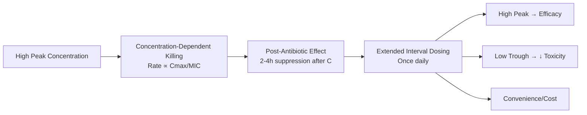
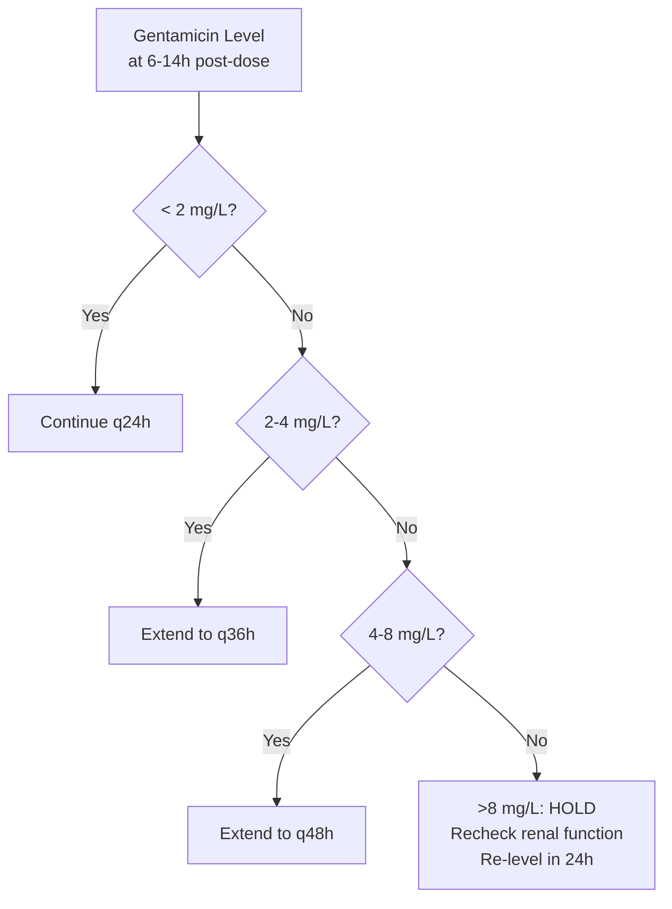
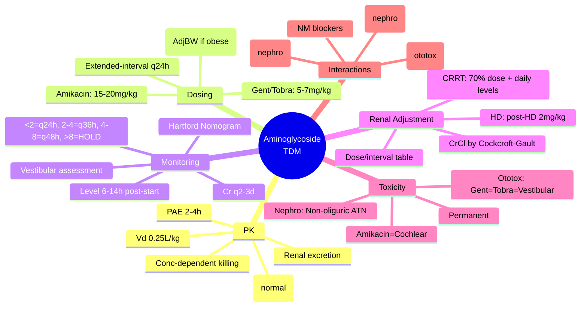

# TDM: Aminoglycosides

**Parent Topic:** [Therapeutic Drug Monitoring](../../Therapeutic%20Drug%20Monitoring.md) → [Clinical Therapeutics Overview](../../Clinical%20Therapeutics%20and%20Good%20Prescribing%20MOC.md)
**Status:** `full-fcps-mrcp-note`
**Priority:** ⭐⭐⭐ HIGHEST (FCPS/MRCP — extended-interval dosing, Hartford nomogram, nephrotoxicity/ototoxicity, renal adjustment)
**Source:** Davidson 24th Ed Ch 2; British National Formulary; NICE Guidelines; Sanford Guide; IDSA Guidelines; Pharmacokinetics textbooks (Rowland & Tozer)

---

## 🎯 Learning Objectives
- [ ] Understand **aminoglycoside PK**: concentration-dependent killing, post-antibiotic effect (PAE)
- [ ] Apply **extended-interval (once-daily) dosing** vs traditional multiple-daily dosing
- [ ] Use **Hartford Nomogram** for gentamicin/tobramycin/amikacin monitoring
- [ ] Calculate **dose adjustment in renal impairment** (CrCl-based)
- [ ] Recognise **nephrotoxicity** (non-oliguric ATN) and **ototoxicity** (vestibular > cochlear)
- [ ] Apply **therapeutic targets**: peak/MIC >8–10, trough <1mg/L (extended-interval)
- [ ] Answer viva: "How to dose gentamicin in renal impairment?" and "Hartford nomogram interpretation"

---

## 🧠 Core Concept: Aminoglycoside Pharmacokinetics

### Key PK Properties

| Property | Value | Clinical Implication |
|----------|-------|---------------------|
| **Absorption** | Negligible oral; IM/IV only | Parenteral only |
| **Distribution** | Vd ~0.25 L/kg (ECF); ↑ in sepsis, burns, ascites | Dose by **actual body weight** (AdjBW if obese) |
| **Protein binding** | <10% | Not significant |
| **Metabolism** | None (excreted unchanged) | Renal function = clearance |
| **Elimination** | **Renal glomerular filtration** | **CrCl = primary determinant of half-life** |
| **Half-life (normal renal)** | 2–3 hours | Allows once-daily dosing |
| **Half-life (anuria)** | 50–100 hours | Accumulation → toxicity |
| **Post-antibiotic effect (PAE)** | 2–4 hours (Gram-negative) | Supports **concentration-dependent dosing** |

### Concentration-Dependent Killing + PAE → Extended-Interval Dosing



> **Key Principle:** *Extended-interval (once-daily) dosing achieves higher Cmax/MIC for efficacy AND lower trough for reduced nephro/ototoxicity. Traditional TID dosing is obsolete for most indications.*

---

## 1️⃣ Extended-Interval (Once-Daily) Dosing — Standard Approach

### Initial Dosing (Normal Renal Function)

| Drug | Dose | Indication |
|------|------|------------|
| **Gentamicin / Tobramycin** | **5–7 mg/kg** (actual BW) IV q24h | Gram-negative sepsis, UTI, endocarditis (synergy) |
| **Amikacin** | **15–20 mg/kg** (actual BW) IV q24h | Resistant Gram-negative, TB, NTM |
| **Netilmicin** | **5–7 mg/kg** IV q24h | Similar to gentamicin |

### Obesity Adjustment — Adjusted Body Weight (AdjBW)
```
AdjBW = IBW + 0.4 × (Actual BW − IBW)
IBW (male) = 50 + 2.3 × (height in inches − 60)
IBW (female) = 45.5 + 2.3 × (height in inches − 60)
```
- Use **AdjBW** for dose calculation if actual BW > 20% above IBW
- Cap dose at **maximum**: Gentamicin 560mg, Amikacin 1.5g

### Monitoring — Hartford Nomogram (q24h Dosing)

#### Sampling Time
- **Single level**: 6–14 hours **after start of infusion** (not end)
- **Do NOT use** traditional peak (30min post) / trough (pre-dose) for q24h

#### Hartford Nomogram Interpretation

| Level at 6–14h | Interval | Action |
|----------------|----------|--------|
| **<2 mg/L** | q24h | Continue same dose |
| **2–4 mg/L** | q36h | Extend interval |
| **4–8 mg/L** | q48h | Extend interval |
| **>8 mg/L** | — | **Hold dose; recheck level; consider renal impairment** |



> **Viva Key:** *Hartford nomogram uses SINGLE level at 6–14h post-dose. Traditional peak/trough is for MULTIPLE daily dosing (q8h). Do not mix methods.*

---

## 2️⃣ Traditional Multiple-Daily Dosing (q8h) — Rare Now

### Targets (q8h Dosing)
| Parameter | Target |
|-----------|--------|
| **Peak** (30min post-infusion) | Gentamicin/Tobramycin: **5–10 mg/L** (severe: 8–10); Amikacin: **20–30 mg/L** |
| **Trough** (pre-dose) | **<1 mg/L** (all) — <0.5 mg/L for prolonged courses |

### When Still Used
- **Pregnancy** (altered Vd/clearance)
- **Burns** (↑ Vd, ↑ clearance)
- **Cystic fibrosis** (↑ clearance)
- **Endocarditis synergy** (gentamicin 1mg/kg q8h × 2 weeks)
- **Paediatrics** (neonates: extended interval but different nomogram)

---

## 3️⃣ Renal Impairment — Dose Adjustment

### Creatinine Clearance (CrCl) Estimation
> **Use Cockcroft-Gault (actual BW)** for aminoglycoside dosing — NOT eGFR
```
CrCl (mL/min) = (140 − Age) × Weight(kg) × (0.85 if female) / (72 × SCr)
```

### Extended-Interval Adjustment (q24h Base)

| CrCl (mL/min) | Gentamicin/Tobramycin | Amikacin | Monitoring |
|---------------|----------------------|----------|------------|
| **>60** | 5–7 mg/kg q24h | 15–20 mg/kg q24h | Hartford nomogram (6–14h) |
| **40–60** | 5–7 mg/kg q24h | 15–20 mg/kg q24h | Hartford nomogram (level at 12h) |
| **30–40** | 4–5 mg/kg q24h OR 2–2.5 mg/kg q12h | 10–15 mg/kg q24h | Check level at 12h; adjust |
| **20–30** | 3–4 mg/kg q24h OR 2 mg/kg q12h | 10–12 mg/kg q36h | Check level at 12–18h |
| **10–20** | 2–3 mg/kg q24h–q48h | 7.5–10 mg/kg q48h | Check level at 24h |
| **<10 / HD** | 2 mg/kg **post-HD** | 7.5–10 mg/kg **post-HD** | Pre-HD level; supplement post-HD |

### Haemodialysis (HD) / CRRT

| Modality | Dosing |
|----------|--------|
| **Intermittent HD** | 2 mg/kg (gentamicin) **after each HD session**; (aminoglycoses removed ~50–70%) |
| **CRRT (CVVH/D)** | 70% usual dose q24h; monitor levels daily; adjust based on effluent rate |
| **Peritoneal Dialysis** | IP route possible; systemic dose q48–72h; monitor levels |

---

## 4️⃣ Toxicity — Nephrotoxicity & Ototoxicity

### Nephrotoxicity (Type A, Dose-Related)

| Feature | Details |
|---------|---------|
| **Incidence** | 10–25% (reversible if caught early) |
| **Mechanism** | Proximal tubular accumulation → lysosomal phospholipidosis → non-oliguric ATN |
| **Risk factors** | Pre-existing CKD, age >60, dehydration, loop diuretics, amphotericin, contrast, ACEi/ARB, prolonged course >7–10 days |
| **Monitoring** | **Serum creatinine q2–3 days**; ↑ >0.5mg/dL (44μmol/L) or >50% from baseline = nephrotoxicity |
| **Management** | Hold aminoglycoside; hydrate; avoid nephrotoxins; usually reversible in 1–3 weeks |

### Ototoxicity (Type B, Idiosyncratic but Dose-Related)

| Type | Features | Monitoring |
|------|----------|------------|
| **Vestibular (Gentamicin, Tobramycin, Streptomycin)** | **Imbalance, oscillopsia, ataxia**; **NO hearing loss**; can be permanent | **Clinical**: Romberg, gait, HINTS; **No routine audiometry** |
| **Cochlear (Amikacin, Neomycin, Kanamycin)** | **High-frequency hearing loss → tinnitus → speech frequencies**; **bilateral, usually permanent** | **Baseline + serial audiometry** (high-frequency 8–20kHz) if >7 days or risk factors |

> **Viva Key:** *Gentamicin/tobramycin = VESTIBULAR toxicity (balance). Amikacin = COCHLEAR toxicity (hearing). Both can cause both but predominance differs.*

---

## 5️⃣ Drug Interactions Increasing Toxicity

| Interaction | Mechanism | Management |
|-------------|-----------|------------|
| **Loop diuretics (furosemide)** | ↑ Ototoxicity (synergistic hair cell damage); ↓ renal perfusion | Avoid concurrent if possible; monitor closely |
| **Amphotericin B** | Additive nephrotoxicity | Avoid; if essential → aggressive hydration, monitor Cr q24h |
| **Contrast media** | Additive nephrotoxicity | Hydrate; hold aminoglycoside 24–48h if possible |
| **ACEi/ARB** | ↓ GFR → ↑ aminoglycoside levels | Monitor renal function closely |
| **Vancomycin** | **Additive nephrotoxicity** (↑ risk 2–3x) | Avoid combination if possible; if essential → AUC-guided vancomycin + Hartford AG |
| **NSAIDs** | ↓ Renal perfusion | Avoid |
| **Muscle relaxants (NM blockers)** | **Potentiate neuromuscular blockade** | Caution post-op; monitor TOF |

---

## 6️⃣ Special Populations

### Neonates / Paediatrics
- **Extended-interval used** but different nomogram (e.g., Urban nomogram for neonates)
- **Gentamicin 4–5 mg/kg q24h** (term >35w); **q36h** (preterm <35w)
- **Therapeutic drug monitoring essential** — immature renal function
- **Levels**: Pre-dose (trough) + post-dose (peak) in neonates traditionally

### Pregnancy
- **Category D** (fetal ototoxicity — 8th cranial nerve)
- **Avoid if possible**; if essential: monitor fetal audiology? (limited)
- **Increased Vd and clearance** → may need higher dose, shorter interval
- **Therapeutic drug monitoring mandatory**

### Elderly
- **Reduced renal function** (even if SCr normal) → use Cockcroft-Gault
- **Reduced Vd** (less ECF) → higher peaks
- **Increased susceptibility** to nephro/ototoxicity
- **Start low, monitor closely**

### Cystic Fibrosis / Burns
- **↑ Vd, ↑ Clearance** → standard doses subtherapeutic
- **Higher doses needed**: Gentamicin 7–10 mg/kg q24h
- **More frequent monitoring** (levels at 6–8h)

---

## 7️⃣ Practical Prescribing Algorithm

```mermaid
flowchart TD
    A[Indication for Aminoglycoside] --> B{Assess Renal Function<br>Cockcroft-Gault CrCl}
    B --> C[Calculate Dose by Actual BW<br>(AdjBW if obese >20% IBW)]
    C --> D[Prescribe Extended-Interval<br>Gent/Tobra 5-7mg/kg q24h<br>Amikacin 15-20mg/kg q24h]
    D --> E[Administer IV over 30-60min<br>in 50-100mL NS/D5W]
    E --> F[Order Level at 6-14h<br>post-INFUSION START]
    F --> G[Apply Hartford Nomogram]
    G --> H{Adjust Interval}
    H -->|<2| I[Continue q24h]
    H -->|2-4| J[Extend to q36h]
    H -->|4-8| K[Extend to q48h]
    H -->|>8| L[HOLD dose<br>Recheck CrCl<br>Re-level 24h]
    I & J & K --> M[Monitor Creatinine q2-3d<br>Clinical vestibular assessment]
    M --> N{Course Duration}
    N -->|<7 days| O[Stop per protocol]
    N -->|>7 days| P[Add audiometry<br>Consider alternative]
```

---

## ⚡ FCPS/MRCP High-Yield Summary

| Topic | Key Points |
|-------|------------|
| **PK** | Conc-dependent killing, PAE 2–4h, renal excretion, Vd 0.25L/kg, t½ 2–3h (normal), 50–100h (anuria) |
| **Dosing** | **Extended-interval q24h**: Gentamicin/Tobramycin **5–7mg/kg**, Amikacin **15–20mg/kg** (actual BW, AdjBW if obese) |
| **Monitoring** | **Hartford Nomogram**: Single level **6–14h post-infusion start** → <2mg/L=q24h, 2–4=q36h, 4–8=q48h, >8=HOLD |
| **Renal adjustment** | Use **Cockcroft-Gault CrCl**; reduce dose/extend interval per table; HD: dose post-HD |
| **Nephrotoxicity** | Non-oliguric ATN; 10–25%; risk: CKD, age, loop diuretics, amphotericin, contrast, vancomycin, >7–10d; monitor Cr q2–3d |
| **Ototoxicity** | **Gentamicin/Tobramycin = vestibular** (imbalance, ataxia, permanent); **Amikacin = cochlear** (high-freq hearing loss, permanent) |
| **Interactions** | Loop diuretics, amphotericin, contrast, vancomycin, ACEi/ARB, NM blockers |
| **Special pops** | Neonates: different nomogram; Pregnancy: D (avoid); Elderly: CrCl adjust; CF/Burns: higher doses |
| **Obsolete** | Traditional q8h dosing with peak/trough — only for pregnancy, burns, CF, endocarditis synergy |

---

## 🎤 Viva Questions (Expected Answers)

| # | Question | Expected Answer |
|---|----------|-----------------|
| 1 | Why extended-interval (once-daily) dosing for aminoglycosides? | **Concentration-dependent killing** (Cmax/MIC) + **Post-antibiotic effect** (2–4h). Higher peaks → better efficacy; lower troughs → less nephro/ototoxicity. |
| 2 | Hartford nomogram — when to take level and how to interpret? | **6–14h post-infusion START** (not end). <2mg/L = q24h; 2–4 = q36h; 4–8 = q48h; >8 = HOLD, recheck renal function, re-level in 24h. |
| 3 | Gentamicin vs Amikacin ototoxicity difference? | **Gentamicin/tobramycin/streptomycin = VESTIBULAR** (imbalance, oscillopsia, ataxia). **Amikacin/neomycin/kanamycin = COCHLEAR** (high-freq hearing loss → tinnitus). |
| 4 | How to dose gentamicin in renal impairment (CrCl 25)? | **Reduce dose to 3–4mg/kg q24h OR 2mg/kg q12h**; monitor level at 12–18h; avoid Hartford nomogram (not validated). Check Cr q2–3d. |
| 5 | Aminoglycoside on haemodialysis — when to give? | **After HD session** (gentamicin 2mg/kg post-HD). Aminoglycoses dialysable (~50–70% removed). |
| 6 | What drug interaction most increases aminoglycoside nephrotoxicity? | **Vancomycin** (additive, 2–3x risk) + **Loop diuretics** (ototoxicity) + **Amphotericin/Contrast** (nephrotoxicity). |
| 7 | Monitoring for aminoglycoside nephrotoxicity? | **Serum creatinine q2–3 days**. ↑ >0.5mg/dL (44μmol/L) or >50% from baseline = nephrotoxicity. |
| 8 | Use actual or ideal body weight for dosing? | **Actual body weight** (capped). If obese (>20% IBW), use **Adjusted BW = IBW + 0.4(TBW−IBW)**. |
| 9 | Aminoglycoside in pregnancy — category and risk? | **Category D** — **fetal ototoxicity** (8th nerve damage). Avoid if possible; if essential → TDM mandatory. |
| 10 | When to use traditional q8h dosing instead of extended-interval? | **Pregnancy, burns, cystic fibrosis, endocarditis synergy (1mg/kg q8h), neonates (different nomogram)** — altered PK makes q24h unreliable. |

---

## 🧩 Confusions & Mnemonics

| Confusion | Clarification |
|-----------|---------------|
| **"Peak and trough for once-daily dosing"** | **NO.** Hartford uses **SINGLE level at 6–14h**. Peak/trough is for q8h dosing. |
| **"eGFR for aminoglycoside dosing"** | **NO.** Use **Cockcroft-Gault CrCl** (actual BW). eGFR (MDRD/CKD-EPI) underestimates in elderly/muscle loss. |
| **"All aminoglycosides cause hearing loss"** | **No.** Gentamicin/tobramycin = predominantly **vestibular**. Amikacin = predominantly **cochlear**. |
| **"Extended-interval = less monitoring"** | **No.** Still need **level at 6–14h + creatinine q2–3d + vestibular assessment**. |
| **"Nephrotoxicity = oliguric renal failure"** | **Typically NON-oliguric ATN**. Urine output preserved initially. |
| **"Ototoxicity reversible"** | **Usually PERMANENT** (vestibular or cochlear hair cell death). Early detection = stop drug. |
| **"AdjBW always for obese"** | **Only if actual BW > 20% above IBW**. Otherwise use actual BW. |

> **Mnemonic: AMINOGLYCOSIDE TDM**  
> **A**minoglycosides: **Concentration-dependent** killing + **PAE** → **Extended-interval q24h**  
> **M**onitoring: **Hartford nomogram** — **Single level 6–14h post-start**; <2=q24h, 2–4=q36h, 4–8=q48h, >8=HOLD  
> **I**deal weight? **Actual BW** (AdjBW if obese >20% IBW). **CrCl by Cockcroft-Gault** (not eGFR)  
> **N**ephrotoxicity: **Non-oliguric ATN**; risk: CKD, age, loops, ampho, contrast, vanco, >7d; **Cr q2–3d**  
> **O**tototoxicity: **Gent/Tobra = VESTIBULAR** (balance); **Amikacin = COCHLEAR** (hearing); **PERMANENT**  
> **G**entamicin dose: **5–7mg/kg q24h**; **Amikacin 15–20mg/kg q24h**; **max 560mg/1.5g**  
> **L**oop diuretics: **Additive ototoxicity** — avoid furosemide + AG if possible  
> **Y** (Why not q8h?) **Obsolete** except: pregnancy, burns, CF, endocarditis synergy, neonates  
> **C**RRT/HD: **Dose post-HD** (2mg/kg); CRRT 70% dose q24h + daily levels  
> **O**besity: **AdjBW = IBW + 0.4(TBW−IBW)**; cap dose  
> **S**ynergy: **Endocarditis** = Gent 1mg/kg q8h × 2w (not q24h)  
> **I**nteractions: **Vanco (nephro)**, Loops (ototox), Ampho/Contrast (nephro), ACEi/ARB, NM blockers  
> **D**ialysis: **HD removes 50–70%** → post-HD dosing  
> **E**lderly: **CrCl even if SCr normal**; ↓ Vd → ↑ peaks; start low, monitor q24h  
> **T**DM: **Hartford for q24h**; **Peak/Trough for q8h only** — don't mix!  
> **M**nemonic for toxicity: **GENTamicin = Gait/vestibular**; **AMIkacin = Audio/hearing**

---

## 🗺️ Mind Map



---

## 📅 Spaced Repetition Tracker

| Review | Date | Score (0–5) | Notes |
|--------|------|-------------|-------|
| Day 1 | | | |
| Day 3 | | | |
| Day 7 | | | |
| Day 14 | | | |
| Day 30 | | | |
| Day 90 | | | |

---

## 📝 Self-Test Scorecard

| Section | Max | Score | % |
|---------|-----|-------|---|
| PK & Dosing Rationale | 3 | | |
| Hartford Nomogram | 3 | | |
| Renal Adjustment | 3 | | |
| Nephrotoxicity | 2 | | |
| Ototoxicity (Vestibular vs Cochlear) | 3 | | |
| Drug Interactions | 2 | | |
| Special Populations | 2 | | |
| Practical Algorithm | 2 | | |
| **Total** | **20** | | |

---

## 💬 Exam Answer Modes

| Format | Prompt | Key Points |
|--------|--------|------------|
| **Long Essay** | "Describe aminoglycoside dosing, monitoring and toxicity." | PK (conc-dependent, PAE), extended-interval q24h, Hartford nomogram, renal adjustment (CrCl), nephrotoxicity (non-oliguric ATN), ototoxicity (vestibular vs cochlear), interactions, special pops |
| **Short Note** | "Hartford nomogram for gentamicin." | Single level 6–14h post-infusion start; interpretation zones; not for q8h dosing |
| **Viva** | "65M, CrCl 30, needs gentamicin for urosepsis. Dose and monitor?" | Dose: 4mg/kg q24h (AdjBW if obese). Level at 12–18h. Cr q2–3d. Avoid loops/contrast. Vestibular assessment. |
| **Ward Round** | "Patient on gentamicin q24h, level at 10h = 6mg/L. Action?" | **Hartford: 4–8mg/L → extend to q48h**. Check renal function. Re-level next dose. |
| **Last-Night** | "AG: q24h 5-7mg/kg. Hartford: 6-14h level. <2=q24, 2-4=q36, 4-8=q48, >8=HOLD. Nephro: non-oliguric ATN, Cr q2-3d. Oto: Gent=vestibular, Ami=cochlear. Vanco=nephro, Loop=ototox. CrCl=C-G." | Extended-interval. Hartford zones. Nephro/oto. Key interactions. Cockcroft-Gault. |

---

## 📌 Summary
- **Pharmacokinetics**: Concentration-dependent killing + PAE → **extended-interval q24h dosing**
- **Dose**: Gentamicin/Tobramycin **5–7mg/kg**, Amikacin **15–20mg/kg** (actual BW; AdjBW if obese >20% IBW)
- **Monitoring**: **Hartford Nomogram** — single level **6–14h post-infusion START**: <2mg/L=q24h, 2–4=q36h, 4–8=q48h, >8=HOLD
- **Renal adjustment**: Use **Cockcroft-Gault CrCl**; reduce dose/extend interval; HD: 2mg/kg post-HD
- **Nephrotoxicity**: Non-oliguric ATN (10–25%); risk factors: CKD, age, loops, ampho, contrast, vanco, >7d; **monitor Cr q2–3d**
- **Ototoxicity**: **Gentamicin/Tobramycin = vestibular** (imbalance, permanent); **Amikacin = cochlear** (hearing loss, permanent)
- **Interactions**: Vancomycin (additive nephro), loop diuretics (additive oto), amphotericin/contrast (nephro), NM blockers
- **Special**: Pregnancy (D, avoid), neonates (different nomogram), elderly (CrCl adjust), CF/burns (higher doses)

---

## ❓ MCQs (10)

1. **Aminoglycoside dosing exploits which PK property?**  
   A. Time-dependent killing  B. **Concentration-dependent killing + PAE**  C. First-order elimination  D. High protein binding  
   *Answer: B. Concentration-dependent killing (Cmax/MIC) + post-antibiotic effect (2–4h) → extended-interval dosing.*

2. **Hartford nomogram — correct sampling time for q24h dosing:**  
   A. 30min post-infusion (peak)  B. Pre-dose (trough)  C. **6–14h post-infusion START**  D. 1h post-infusion  
   *Answer: C. Single level 6–14h after infusion START. Peak/trough is for q8h dosing.*

3. **Hartford nomogram: level at 10h = 5mg/L. Action?**  
   A. Continue q24h  B. Extend to q36h  C. **Extend to q48h**  D. Hold dose  
   *Answer: C. 4–8mg/L zone → extend interval to q48h.*

4. **Which aminoglycoside causes predominantly COCHLEAR ototoxicity?**  
   A. Gentamicin  B. Tobramycin  C. **Amikacin**  D. Streptomycin  
   *Answer: C. Amikacin = cochlear (hearing loss). Gentamicin/tobramycin/streptomycin = vestibular (balance).*

5. **Aminoglycoside dose calculation in obesity:**  
   A. Ideal body weight  B. **Actual body weight (AdjBW if >20% over IBW)**  C. Adjusted body weight always  D. Lean body weight  
   *Answer: B. Actual BW unless obese (>20% IBW), then AdjBW = IBW + 0.4(TBW−IBW).*

6. **Renal function estimation for aminoglycoside dosing:**  
   A. eGFR (MDRD)  B. eGFR (CKD-EPI)  C. **Cockcroft-Gault CrCl (actual BW)**  D. Serum creatinine alone  
   *Answer: C. Cockcroft-Gault with actual body weight. eGFR underestimates in elderly/low muscle mass.*

7. **Most significant drug interaction increasing aminoglycoside nephrotoxicity:**  
   A. ACE inhibitor  B. **Vancomycin**  C. Oral contraceptive  D. Proton pump inhibitor  
   *Answer: B. Vancomycin + aminoglycoside = 2–3x increased nephrotoxicity risk.*

8. **Gentamicin in haemodialysis patient — when to dose?**  
   A. Before HD  B. **After HD**  C. During HD  D. Day off HD  
   *Answer: B. Aminoglycoses dialysable (~50–70%). Dose 2mg/kg AFTER HD session.*

9. **Nephrotoxicity from aminoglycosides typically presents as:**  
   A. Oliguric renal failure  B. **Non-oliguric acute tubular necrosis**  C. Interstitial nephritis  D. Glomerulonephritis  
   *Answer: B. Non-oliguric ATN — urine output preserved initially.*

10. **Traditional q8h dosing still preferred in:**  
    A. Standard sepsis  B. **Pregnancy, burns, cystic fibrosis, endocarditis synergy**  C. Elderly  D. Renal impairment  
    *Answer: B. Altered PK in these groups makes q24h unreliable; q8h with peak/trough used.*

---

## 📋 SBAs (10)

1. **70M, 85kg, CrCl 45 mL/min, gentamicin for pyelonephritis. Appropriate initial dose?**  
   A. 5mg/kg q24h (425mg)  B. **4mg/kg q24h (340mg)**  C. 7mg/kg q24h (560mg)  D. 2mg/kg q12h (170mg)  
   *Answer: B. CrCl 40–60: standard dose q24h OK but 4–5mg/kg preferred; level at 12h. 560mg is max dose.*

2. **Gentamicin level at 8h post-infusion = 1.5mg/L. Hartford interpretation?**  
   A. q24h  B. **q24h**  C. q36h  D. q48h  
   *Answer: A. <2mg/L = continue q24h.*

3. **Patient on gentamicin + furosemide for 10 days. Develops imbalance, oscillopsia. Type of ototoxicity?**  
   A. Cochlear  B. **Vestibular**  C. Both  D. Neither  
   *Answer: B. Gentamicin = vestibular; furosemide potentiates vestibular ototoxicity.*

4. **Cockcroft-Gault for 75F, 60kg, SCr 120μmol/L:**  
   A. 25 mL/min  B. **30 mL/min**  C. 35 mL/min  D. 40 mL/min  
   *Answer: B. (140−75)×60×0.85 / (72×120) = 65×60×0.85 / 8640 = 3315/8640 ≈ 30 mL/min.*

5. **Patient on gentamicin q24h for 10 days. Best nephrotoxicity monitoring?**  
   A. Urine output only  B. **Serum creatinine q2–3 days**  C. Urinalysis daily  D. eGFR weekly  
   *Answer: B. Serum creatinine every 2–3 days. ↑ >0.5mg/dL or >50% baseline = nephrotoxicity.*

---

## 🔑 Answer Keys
| MCQs | SBAs |
|------|------|
| 1-B, 2-C, 3-C, 4-C, 5-B, 6-C, 7-B, 8-B, 9-B, 10-B | 1-B, 2-A, 3-B, 4-B, 5-B |

---

## 🔗 Cross-Links
- [[Special Populations/Renal Prescribing]] — CrCl calculation, dosing in AKI/CKD/HD/CRRT
- [[Drug Interactions/Pharmacokinetic interactions/Excretion interactions]] — Renal excretion interactions
- [[Medication Safety and Errors/PINCH High-Risk Drugs]] — Aminoglycosides as high-alert (though not in PINCH)
- [[Clinical Context/Antimicrobial Stewardship]] — Aminoglycoside stewardship, de-escalation
- [[Therapeutic Drug Monitoring]] — TDM principles, other drugs
- [[Special Populations/Paediatric Prescribing]] — Neonatal/paediatric aminoglycoside dosing

## PasTest Scenario SBAs (Clinical Vignettes)

> **Auto-generated PasTest/Mediscope-style scenario SBAs** grounded in the authored source. Each scenario tests a real clinical fact (triad, specific sign, contraindication, trial, first-line Rx) extracted from the topic. *Source: Ch 2: Clinical Therapeutics — Aminoglycosides*

**Q1.** Which of the following features is most specific or characteristic of Aminoglycosides?

  - **A.** "Nephrotoxicity = oliguric renal failure"
  - **B.** A feature common to many acute inflammatory conditions
  - **C.** A non-specific sign that does not localise the diagnosis
  - **D.** An investigation finding rather than a clinical feature

  > **Answer: A** — "Nephrotoxicity = oliguric renal failure"
  >
  > *Source:* |
| **"Nephrotoxicity = oliguric renal failure"** | **Typically NON-oliguric ATN**

**Q2.** In the management of Aminoglycosides, which of the following should be avoided or is contraindicated?

  - **A.** concurrent (avoid in possible)
  - **B.** Standard guideline-directed first-line therapy
  - **C.** Routine supportive care (fluids, oxygen, monitoring)
  - **D.** Symptom-directed treatment as needed

  > **Answer: A** — concurrent (avoid in possible)
  >
  > *Source:* Interaction | Mechanism | Management |
|-------------|-----------|------------|
| **Loop diuretics (furosemide)** | ↑ Ototoxicity (synergistic hair cell damage); ↓ renal perfusion | Avoid concurrent i

