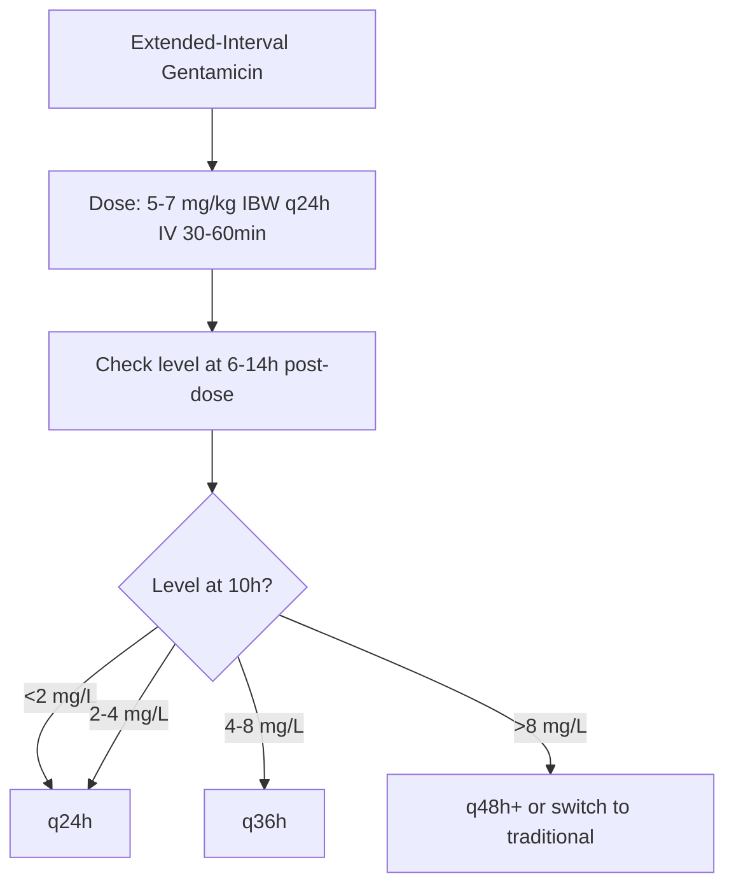

**Status**: `full-fcps-mrcp-note` | **Chapter**: 2 — Clinical Therapeutics and Good Prescribing | **Heading**: Therapeutic Drug Monitoring → Drug-Specific TDM | **Exam Priority**: ⭐⭐⭐ **HIGHEST** (Daily ward/ITU practice, FCPS/MRCP staple)

---

## 1. 1. 🎯 Learning Objectives
- [ ] Compare traditional vs extended-interval dosing (once-daily)
- [ ] Apply TDM targets: peak/trough for traditional, Hartford nomogram for extended-interval
- [ ] Calculate dose adjustments based on CrCl
- [ ] Identify nephrotoxicity + ototoxicity risk factors
- [ ] Execute monitoring protocol

---

## 2. 2. 📊 Dosing Strategies

| Parameter | **Traditional (Multiple Daily)** | **Extended-Interval (Once-Daily/Hartford)** |
|-----------|----------------------------------|---------------------------------------------|
| **Dosing** | Every 8–12h (3–4×/day) | **Once daily** (q24h) |
| **Peak Target** | **Gentamicin: 5–8 mg/L** (Amikacin: 15–25) | **Not routinely measured** |
| **Trough Target** | **Gentamicin: <1–2 mg/L** (Amikacin: <5–10) | **<1 mg/L at 18–24h post-dose** |
| **AUC Target** | — | **AUC 70–100 mg·h/L** (Gentamicin) |
| **Advantages** | Familiar stewardship | **↓ Nephrotoxicity, ↓ Ototoxicity**, convenience, cost |
| **Contraindications** | — | **Pregnancy, Burns >20%, Ascites, ARC (CrCl>150), Synergistic therapy (Endocarditis)** |
| **Nephrotoxicity Risk** | Higher (sustained trough) | **Lower** (low trough) |
| **Post-Antibiotic Effect (PAE)** | Utilised but trough limits | **Maximised** (high peak, long drug-free interval) |

---

## 3. 3. 🧮 Hartford Nomogram (Extended-Interval Gentamicin)

| Step | Action |
|------|--------|
| **1. Calculate CrCl** | Cockcroft-Gault (actual body weight unless obese → IBW + 0.4×(ABW-IBW)) |
| **2. Calculate Dose** | **5–7 mg/kg IBW** (traditional 7 mg/kg; obese use **adjusted body weight**) |
| **3. Administer** | IV infusion over **30–60 min** |
| **4. Obtain Levels** | **Single level at 6–14h post-dose** (ideally 10h) |
| **5. Plot on Hartford Nomogram** | X-axis = time post-dose (h); Y-axis = concentration (mg/L) |
| **6. Determine Interval** | **<2 mg/L at 6h** → q24h; **2–4 mg/L at 10h** → q24h; **>4 mg/L at 10h** → extend to q36h or q48h; **>8 mg/L at 14h** → q48h+ |



---

## 4. 4. 📏 Traditional Dosing TDM (If Used)

| Timing | Sample | Target |
|--------|--------|--------|
| **Trough** | Just before next dose | **Gentamicin: <1–2 mg/L**; Amikacin: <5–10 mg/L |
| **Peak** | **30 min post-IV infusion** | **Gentamicin: 5–8 mg/L**; Amikacin: 15–25 mg/L |
| **Random** | Any time | Use Sawchuk-Zaske or Bayesian for prediction |

---

## 5. 5. ⚖️ Renal Adjustment — CrCl-Based

| CrCl (mL/min) | Gentamicin Traditional | Gentamicin Extended | Amikacin Traditional |
|---------------|-----------------------|---------------------|---------------------|
| **>60** | 1.5–2 mg/kg q8h | **7 mg/kg q24h** | 15 mg/kg q8h |
| **40–60** | 1.5 mg/kg q8–12h | **5–7 mg/kg q36h** | 7.5–10 mg/kg q8–12h |
| **20–40** | 1–1.5 mg/kg q12–24h | **5 mg/kg q48h** | 7.5 mg/kg q12–24h |
| **10–20** | 1 mg/kg q24–48h | **AVOID** (use traditional) | 5–7.5 mg/kg q24–48h |
| **<10 / HD** | 1 mg/kg post-HD | **AVOID** | 5–7.5 mg/kg post-HD |

> **CrCl estimation**: Use **Cockcroft-Gault** with **IBW** for aminoglycosides (not eGFR)

---

## 6. 6. ☠️ Toxicity

| Toxicity | Mechanism | Risk Factors | Monitoring |
|----------|-----------|--------------|------------|
| **Nephrotoxicity** (ATN) | Proximal tubular phospholipidosis, ROS | **Pre-existing CKD, Age>60, Dehydration, Loop diuretics, Vancomycin, Amphotericin B, Contrast, Long duration (>7d), High trough** | **SCr, CrCl q2–3d**; ↑ SCr ≥25% or ≥26.5 μmol/L = hold |
| **Vestibular Ototoxicity** | Vestibular hair cell damage (irreversible) | **High cumulative dose, Renal impairment, Elderly, Pre-existing vestibular disease** | **Vestibular symptoms** (vertigo, imbalance, oscillopsia) — ask weekly |
| **Cochlear Ototoxicity** | Cochlear hair cell damage → high-frequency hearing loss (may be reversible early) | **High peak levels, Genetic predisposition (MT-RNR1 m.1555A>G)** | **Audiometry baseline + if prolonged** |

---

## 7. 7. 🎯 FCPS/MRCP High-Yield Summary

| Pearl | Details |
|-------|---------|
| **Dosing strategy** | **Extended-interval (once-daily) preferred** — ↓ nephrotoxicity, ↓ ototoxicity, convenience |
| **Hartford nomogram** | Single level at **6–14h post-dose** → determine q24h/q36h/q48h |
| **Trough target (extended)** | **<1 mg/L at 18–24h post-dose** |
| **Renal adjustment** | **Cockcroft-Gault with IBW** — not eGFR |
| **Nephrotoxicity monitoring** | SCr **q2–3d**; ↑ SCr ≥25% → hold |
| **Ototoxicity** | Ask about **dizziness, hearing changes** weekly; audiometry if prolonged |
| **Duration** | **Limit to 7–10 days** if possible |
| **Contraindications to extended-interval** | Pregnancy, Burns >20%, Ascites, ARC (CrCl>150), Endocarditis (synergistic) |
| **Synergy (Endocarditis)** | Traditional dosing required for sustained bactericidal levels |

---

## 8. 8. ❓ Viva Questions (10)

| Q | Answer |
|---|--------|
| 1. Extended-interval vs traditional gentamicin — advantages? | **↓ Nephrotoxicity, ↓ Ototoxicity, convenience, cost, utilises PAE**; peak-driven bactericidal |
| 2. Hartford nomogram — when to sample? | **6–14h post-dose** (ideally 10h); single level |
| 3. Extended-interval trough target? | **<1 mg/L at 18–24h post-dose** |
| 4. Extended-interval contraindications? | **Pregnancy, Burns >20%, Ascites, ARC (CrCl>150), Endocarditis (synergistic)** |
| 5. CrCl estimation for aminoglycosides? | **Cockcroft-Gault with IBW** (not eGFR) |
| 6. Nephrotoxicity — risk factors? | **CKD, Age>60, Dehydration, Loop diuretics, Vancomycin, Amphotericin, Contrast, >7d duration, High trough** |
| 7. Ototoxicity types — difference? | **Vestibular: vertigo, imbalance, irreversible**; **Cochlear: high-frequency hearing loss, may be partially reversible** |
| 8. Ototoxicity — monitoring? | **Ask weekly: dizziness, hearing changes**; Audiometry if prolonged >14d |
| 9. Extended-interval — when to extend interval per Hartford? | **Level >4 mg/L at 10h → q36h; >8 mg/L at 14h → q48h+** |
| 10. Aminoglycoside + Vancomycin — interaction? | **Synergistic nephrotoxicity** — avoid if possible; if unavoidable, close monitoring |

---

## 9. 9. 🤯 Confusions & Mnemonics

| Confusion | Clarification |
|-----------|---------------|
| **Extended-interval = always better?** | No — **contraindicated in pregnancy, burns, ascites, ARC, endocarditis** |
| **CrCl vs eGFR** | **Use Cockcroft-Gault CrCl with IBW** for aminoglycosides |
| **Trough vs Peak** | Extended = trough-driven; Traditional = peak + trough |
| **Vestibular vs Cochlear** | Vestibular = balance (irreversible); Cochlear = hearing (some reversibility) |
| **Hartford nomogram time** | Sample at **6–14h** (ideally 10h) — not immediately post-dose |

**Mnemonics:**
- **"EXTENDED = BETTER TOXICITY"** = **↓ Nephrotoxicity, ↓ Ototoxicity**
- **"HARTFORD"** = **H**artford: **H**alf-day (10h) sample, **A**djust interval (24/36/48h), **R**enal adjustment (CrCl), **T**rough <1 mg/L, **F**orbid in pregnancy/burns/ascites/ARC, **O**nce daily, **R**eview nephrotoxicity, **D**uration limit 7–10d
- **"NEPHROTOX RISK"** = **N**ephrotoxicity ↑ with: **E**lderly, **P**re-existing CKD, **H**igh trough, **R**enal drugs (loop, vanco, ampho, contrast), **O**ver 7 days, **T**oxicity
- **"OTO = VESTIBULAR + COCHLEAR"** = **V**estibular = balance/vertigo (irreversible); **C**ochlear = hearing (partial reversibility)

---

## 10. 10. 🧠 Mind Map (Mermaid)

```mermaid
mindmap
  root((Aminoglycosides TDM))
    Dosing Strategies
      Traditional
        q8-12h
        Peak 5-8 / Trough <2
      Extended (Once-Daily) PREFERRED
        q24h
        Hartford nomogram
        Trough <1 at 18-24h
        Peak NOT routine
    Hartford Nomogram
      Dose 7 mg/kg IBW
      Level at 6-14h
      <2 at 10h → q24h
      2-4 at 10h → q24h
      4-8 at 10h → q36h
      >8 at 14h → q48h+
    Contraindications (Extended)
      Pregnancy
      Burns >20%
      Ascites
      ARC (CrCl>150)
      Endocarditis (synergy)
    Renal Adjustment
      Cockcroft-Gault + IBW
      CrCl >60 → q24h
      CrCl 40-60 → q36h
      CrCl 20-40 → q48h
      CrCl <20 → traditional only
    Toxicity
      Nephrotoxicity (ATN)
        Risk: CKD, Elderly, Loops, Vanco, Ampho, Contrast, >7d
        Monitor SCr q2-3d
      Ototoxicity
        Vestibular (irreversible)
        Cochlear (hearing loss, partial rev)
        Ask weekly / Audiometry
```

---

## 11. 11. 📅 Spaced Repetition Tracker

| Review | Date | Score | Next |
|--------|------|-------|------|
| 1 | | | 1d |
| 2 | | | 3d |
| 3 | | | 1w |
| 4 | | | 2w |
| 5 | | | 1m |
| 6 | | | 3m |

---

## 12. 12. 🧪 Self-Test Scorecard

| Section | Max | Score |
|---------|-----|-------|
| Dosing comparison | 8 | |
| Hartford nomogram | 8 | |
| Contraindications | 6 | |
| Renal adjustment | 6 | |
| Toxicity | 8 | |
| Viva answers | 10 | |
| **Total** | **46** | |

**Target**: ≥37/46 (80%)

---

## 13. 13. 📝 Exam Answer Modes

### 1. Short Question (5 marks): *"Extended-interval gentamicin — advantages, monitoring, contraindications."*
- **Advantages**: ↓ Nephrotoxicity (low trough), ↓ Ototoxicity, convenience, cost, utilises PAE
- **Monitoring**: Hartford nomogram — single level at **6–14h post-dose** (ideally 10h); target **trough <1 mg/L at 18–24h**; SCr q2–3d; ask vestibular symptoms weekly
- **Contraindications**: **Pregnancy, Burns >20%, Ascites, ARC (CrCl>150), Endocarditis (synergistic)**

### 2. Viva (1 min): *"Patient on extended-interval gentamicin. Level at 10h = 6 mg/L. Action?"*
- **Level 6 mg/L at 10h → 4–8 mg/L zone → extend interval to q36h**
- Recheck level next dose at 10h
- Monitor SCr q2–3d

### 3. Ward Round (30 sec): *"Patient on gentamicin 7 days, SCr rising. Action?"*
- **Nephrotoxicity** (risk ↑ with duration >7d)
- **Hold gentamicin**, switch to non-nephrotoxic alternative
- Hydration, avoid other nephrotoxins
- If must continue → switch to traditional monitoring

### 4. Last-Night Revision (1-liners):
- Extended-interval = preferred (↓ nephro/ototoxicity); Hartford nomogram
- Hartford: dose 7 mg/kg IBW q24h, level at 10h, <2=q24h, 2-4=q24h, 4-8=q36h, >8=q48h+
- Contraindicated: Pregnancy, Burns>20%, Ascites, ARC, Endocarditis
- CrCl = Cockcroft-Gault + IBW (not eGFR)
- Nephrotoxicity: monitor SCr q2-3d, hold if ↑≥25%
- Ototoxicity: vestibular (irreversible), cochlear (hearing); ask weekly

---

## 14. 14. 📚 Summary Card

> **AMINOGLYCOSIDES TDM:**
> **EXTENDED-INTERVAL PREFERRED** — Hartford nomogram
> Dose: **7 mg/kg IBW q24h** → Level at **10h**
> <2 → q24h; 2-4 → q24h; 4-8 → q36h; >8 → q48h+
> **Trough target: <1 mg/L at 18-24h**
> Contraindicated: **Pregnancy, Burns>20%, Ascites, ARC, Endocarditis**
> Renal adjust: **Cockcroft-Gault + IBW**
> Monitor: **SCr q2-3d, Vestibular symptoms weekly**

---

## 15. 15. ❓ MCQs (12)

1. **Extended-interval gentamicin dosing — major advantage over traditional:**
   A. Lower peak levels
   B. **Lower nephrotoxicity and ototoxicity** ✓
   C. Lower cost only
   D. More convenient only
   E. Higher trough levels

2. **Hartford nomogram — when to draw level:**
   A. Immediately post-dose
   B. **6–14h post-dose (ideally 10h)** ✓
   C. Trough (pre-dose)
   D. 30 min post-dose
   E. 2h post-dose

3. **Extended-interval gentamicin trough target:**
   A. <2 mg/L
   B. **<1 mg/L at 18–24h post-dose** ✓
   C. <5 mg/L
   D. 5–8 mg/L
   E. No trough needed

4. **Extended-interval gentamicin — contraindicated in:**
   A. CKD
   B. **Pregnancy, Burns >20%, Ascites, ARC (CrCl>150), Endocarditis** ✓
   C. Elderly
   D. Sepsis
   E. Pneumonia

5. **CrCl estimation for aminoglycoside dosing:**
   A. eGFR (CKD-EPI)
   B. **Cockcroft-Gault with IBW** ✓
   C. MDRD
   D. BUN/Cr ratio
   E. 24h urine CrCl only

6. **Gentamicin level at 10h = 6 mg/L on extended-interval dosing — action:**
   A. Continue q24h
   B. **Extend to q36h** ✓
   C. Extend to q48h
   D. Switch to traditional
   E. Increase dose

7. **Gentamicin level at 14h = 10 mg/L — action:**
   A. Continue q24h
   B. Extend to q36h
   C. **Extend to ≥q48h or switch to traditional** ✓
   D. Increase dose
   E. No change

8. **Aminoglycoside nephrotoxicity — monitoring:**
   A. SCr weekly
   B. **SCr q2–3d** ✓
   C. SCr monthly
   D. BUN only
   E. UOP only

9. **Ototoxicity — vestibular vs cochlear:**
   A. Both reversible
   B. **Vestibular irreversible; Cochlear partially reversible** ✓
   C. Both irreversible
   D. Vestibular reversible; Cochlear irreversible
   E. Cochlear only

10. **Aminoglycoside + Vancomycin interaction:**
    A. Additive antibacterial
    B. **Synergistic nephrotoxicity** ✓
    C. Antagonistic
    D. No interaction
    E. Ototoxicity only

11. **Extended-interval dosing contraindicated in endocarditis because:**
    A. Poor penetration
    B. **Synergistic therapy requires sustained bactericidal levels (traditional)** ✓
    C. Higher nephrotoxicity
    D. Drug resistance
    E. Cost

12. **Aminoglycoside duration — limit if possible to:**
    A. 3–5 days
    B. **7–10 days** ✓
    C. 14–21 days
    D. 28 days
    E. No limit

---

## 16. 16. 🃏 Flashcards (Anki-ready)

| Front | Back |
|-------|------|
| Extended-interval advantages | ↓ Nepthotoxicity, ↓ Ototoxicity, convenience, cost, PAE |
| Hartford sampling time | 6–14h post-dose (ideal 10h) |
| Hartford level <2 at 10h | q24h |
| Hartford level 2-4 at 10h | q24h |
| Hartford level 4-8 at 10h | q36h |
| Hartford level >8 at 14h | q48h+ |
| Extended-interval trough target | <1 mg/L at 18-24h |
| Extended contraindications | Pregnancy, Burns>20%, Ascites, ARC (CrCl>150), Endocarditis |
| CrCl for aminoglycosides | Cockcroft-Gault + IBW |
| Nephrotoxicity monitoring | SCr q2-3d, hold if ↑≥25% |
| Ototoxicity types | Vestibular (balance, irreversible), Cochlear (hearing, partial rev) |
| Ototoxicity monitoring | Ask weekly, Audiometry if >14d |
| Vanco + Aminoglycoside | Synergistic nephrotoxicity |

---

## 17. 17. ✅ Answer Keys

### 1. MCQs
1. **B** — Lower nephrotoxicity and ototoxicity
2. **B** — 6–14h post-dose (ideally 10h)
3. **B** — <1 mg/L at 18–24h post-dose
4. **B** — Pregnancy, Burns>20%, Ascites, ARC, Endocarditis
5. **B** — Cockcroft-Gault with IBW
6. **B** — Extend to q36h (4-8 mg/L zone)
7. **C** — Extend to ≥q48h or switch to traditional
8. **B** — SCr q2–3d
9. **B** — Vestibular irreversible, Cochlear partially reversible
10. **B** — Synergistic nephrotoxicity
11. **B** — Synergistic therapy requires sustained levels
12. **B** — 7–10 days

---

*File: `/mnt/tb/Medicine/Clinical Therapeutics and Good Prescribing/TDM/Aminoglycosides.md` | Status: `full-fcps-mrcp-note`*
