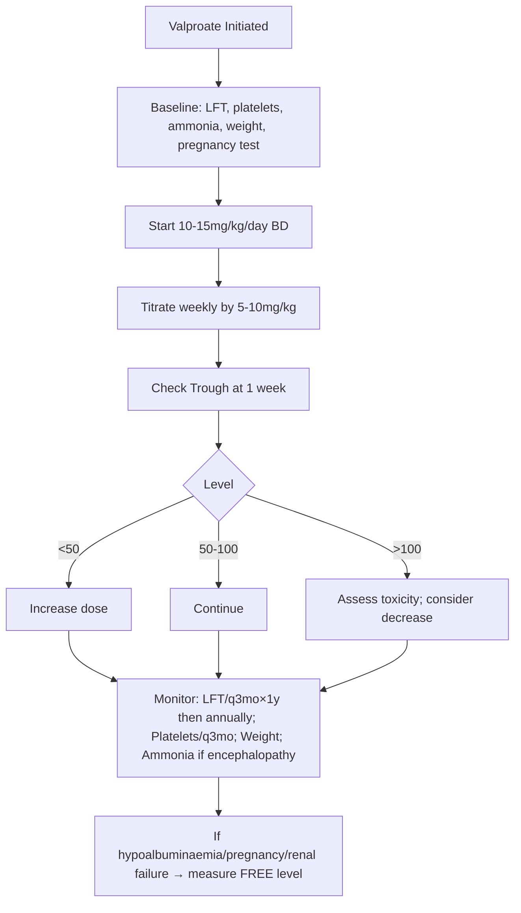
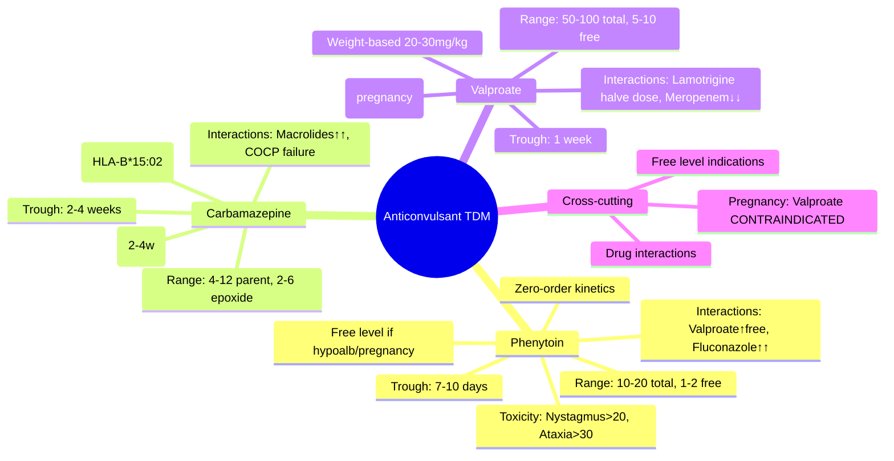

# TDM: Anticonvulsants (Phenytoin, Carbamazepine, Valproate)

**Parent Topic:** [Therapeutic Drug Monitoring](../../Therapeutic%20Drug%20Monitoring.md) → [Clinical Therapeutics Overview](../../Clinical%20Therapeutics%20and%20Good%20Prescribing%20MOC.md)
**Status:** `full-fcps-mrcp-note`
**Priority:** ⭐⭐⭐ HIGHEST (FCPS/MRCP — Phenytoin zero-order kinetics, Carbamazepine auto-induction, Valproate hepatotoxicity/weight-based dosing)
**Source:** Davidson 24th Ed Ch 2; BNF; NICE Epilepsy Guidelines; Maudsley; Sanford Guide; ILAE; Anticonvulsant TDM literature

---

## 🎯 Learning Objectives
- [ ] Understand **phenytoin zero-order (Michaelis-Menten) kinetics** and dose adjustment
- [ ] Apply **carbamazepine auto-induction** and active metabolite (epoxide) monitoring
- [ ] Use **valproate weight-based dosing** and free vs total level interpretation
- [ ] Know **therapeutic ranges** and **sampling times** for each
- [ ] Recognise **toxicity features** (phenytoin: nystagmus/ataxia; carbamazepine: hyponatraemia/SJS; valproate: hepatotoxicity/pancreatitis)
- [ ] Manage **key drug interactions** (enzyme induction/inhibition, protein binding displacement)
- [ ] Adjust for **special populations** (pregnancy, elderly, renal/hepatic impairment)
- [ ] Answer viva: "Phenytoin dose adjustment formula" and "Carbamazepine auto-induction"

---

## 🧠 Core Concept: Anticonvulsant PK Overview

| Property | Phenytoin | Carbamazepine | Valproate |
|----------|-----------|---------------|-----------|
| **Kinetics** | **Zero-order (saturable)** | First-order + **auto-induction** | First-order (dose-proportional) |
| **Therapeutic index** | Narrow | Moderate | Moderate |
| **Protein binding** | **90%** (albumin) | 75% | **90%** (albumin) |
| **Metabolism** | CYP2C9, CYP2C19 | CYP3A4 (→ epoxide) | CYP2C9, β-oxidation, UGT |
| **Active metabolite** | None | **Carbamazepine-10,11-epoxide** | Minor (glucuronides) |
| **Elimination** | Hepatic (saturable) | Hepatic (inducible) | Hepatic (multiple pathways) |
| **Half-life** | **Variable** (7–42h) | 12–17h (↓ to 8–12h with auto-induction) | 9–16h |
| **Key TDM need** | **YES (zero-order)** | **YES (auto-induction, epoxide)** | **YES (protein binding, hepatotoxicity)** |

---

## 1️⃣ Phenytoin — Zero-Order Kinetics (Michaelis-Menten)

### Why Zero-Order?
- Hepatic metabolism (CYP2C9/2C19) **saturates at therapeutic doses**
- **Small dose increase → LARGE level increase** (non-linear)
- **Km ≈ 4–6 mg/L**, **Vmax ≈ 400–700 mg/day** (highly variable)

### Therapeutic Range (Total)
| Indication | Range (mg/L) |
|------------|--------------|
| **Epilepsy** | **10–20** (some 8–20) |
| **Status epilepticus / Acute** | 15–20 |
| **Toxic** | >20 (nystagmus), >30 (ataxia/coma) |

### Free Phenytoin (Unbound)
- **Therapeutic free**: **1–2 mg/L** (10% of total)
- **Measure free if**: Hypoalbuminaemia, pregnancy, renal failure, elderly, drug interactions (valproate, aspirin)
- **Formula**: Free = Total × fu (fu = 0.1 normally; ↑ in hypoalbuminaemia)

### Dose Adjustment — Mullen Formula (Ludden)
```
New Daily Dose = (Current Dose × (Target Css - Current Css)) / (Km + Target Css) × (Km + Current Css)
```
**Simplified Clinical Approach (Sheiner-Tozer / Ludden):**
```
If Css <10: Increase dose by ~30 mg/day (or 50 mg alternate days)
If Css 10-20: Small adjustments (25-30 mg)
If Css >20: DECREASE dose significantly (50-100 mg)
```
> **Rule of Thumb:** *Near Km (4–6), small dose changes cause large level changes. **30 mg dose change ≈ 2–3 mg/L level change** at steady state.*

### Loading Dose (Status Epilepticus / Rapid Control)
```
Loading Dose (mg) = Target Css × Vd × Weight
Vd ≈ 0.65 L/kg
Target = 15–20 mg/L
→ ~15–20 mg/kg (max 1.5–2g)
```
- **IV fosphenytoin preferred** (150mg PE/min vs phenytoin 50mg/min)
- **IV phenytoin**: ≤50 mg/min, cardiac monitoring, avoid extravasation (purple glove syndrome)

### Sampling Time
- **Steady state**: **7–10 days** (5 half-lives; t½ variable 7–42h)
- **Trough**: Pre-dose (standard) — **after ≥5 days at current dose**
- **Do NOT check** before steady state (misleading)

### Toxicity

| Level | Features |
|-------|----------|
| **20–30** | **Nystagmus** (lateral gaze), sedation, diplopia |
| **30–40** | **Ataxia**, dysarthria, confusion, **vertical nystagmus** |
| **>40** | Coma, seizures (paradoxical), hypotension, **cerebellar atrophy** (chronic) |
| **Chronic** | Gingival hyperplasia, hirsutism, coarsening features, **osteomalacia** (vit D metabolism), folate deficiency |

---

## 2️⃣ Carbamazepine — Auto-Induction & Epoxide

### Auto-Induction
- **Induces own metabolism** via CYP3A4 ↑
- **Clearance increases 2–3x over 2–4 weeks**
- **Half-life drops** from 25–65h (initial) → 12–17h (steady state)
- **Dose often needs ↑ after 2–3 weeks** to maintain level

### Active Metabolite: Carbamazepine-10,11-Epoxide
- **Equipotent** anticonvulsant
- **Contributes to toxicity** (especially neuro: diplopia, ataxia)
- **Epoxide:Parent ratio** ↑ with induction, hepatic impairment
- **Monitor both** if neurotoxicity at "therapeutic" parent level

### Therapeutic Ranges
| Component | Range (mg/L) |
|-----------|--------------|
| **Carbamazepine (parent)** | **4–12** (some 6–12) |
| **Epoxide** | **2–6** (not routinely measured) |
| **Total (parent + epoxide)** | 8–18 |

### Dosing
| Phase | Dose |
|-------|------|
| **Initiation** | 100–200mg BD (low, slow titration) |
| **Titration** | Increase 100–200mg weekly |
| **Maintenance** | 400–1200mg daily (often 600–1000mg) |
| **Auto-induction** | Expect dose ↑ 30–50% by week 3–4 |

### Sampling Time
- **Steady state**: **5–7 days** (after auto-induction complete ~2–4 weeks)
- **Trough**: Pre-dose (12h post-dose if BD)

### Toxicity
| Type | Features |
|------|----------|
| **Acute Neuro** | Diplopia, ataxia, nystagmus, drowsiness, dizziness (dose-related) |
| **Hyponatraemia** | **SIADH** — 10–20% (↑ risk elderly, diuretics); Na⁺ <125 = reduce/stop |
| **Haematologic** | Leukopenia (transient), **aplastic anaemia** (rare, idiosyncratic), thrombocytopenia |
| **Cutaneous** | **SJS/TEN** (HLA-B*15:02 in Han Chinese/Thai — screen before start); DRESS, AGEP |
| **Hepatic** | Transient LFT ↑ (common); fulminant hepatitis (rare) |
| **Cardiac** | AV block (rare), arrhythmias (overdose) |

---

## 3️⃣ Valproate (Sodium Valproate / Valproic Acid)

### Pharmacokinetics
- **First-order kinetics** (dose-proportional)
- **Highly protein bound** (90%) — **displacement interactions** (aspirin, phenytoin)
- **Multiple pathways**: CYP2C9, β-oxidation, UGT glucuronidation
- **Weight-based dosing** — Vd correlates with TBW

### Therapeutic Ranges
| Indication | Total Range (mg/L) | Free Range (mg/L) |
|------------|-------------------|-------------------|
| **Epilepsy** | **50–100** (some 40–100) | **5–10** (free = ~10% total) |
| **Mania / Bipolar** | 50–125 | 5–15 |
| **Migraine prophylaxis** | 50–100 | — |

### Free Valproate — When to Measure
| Situation | Reason |
|-----------|--------|
| **Hypoalbuminaemia** (elderly, nephrotic, burns) | ↑ Free fraction (up to 20–30%) |
| **Pregnancy** | ↑ Vd, ↑ clearance, ↓ albumin → free fraction ↑ |
| **Renal failure** | ↑ Free fraction (uremia displaces) |
| **Drug interactions** (phenytoin, aspirin, warfarin) | Displacement → ↑ free |
| **Toxicity at "therapeutic" total** | Check free level |

### Dosing
| Parameter | Value |
|-----------|-------|
| **Initiation** | 10–15 mg/kg/day (divided BD) |
| **Titration** | ↑ 5–10 mg/kg/week |
| **Maintenance** | **20–30 mg/kg/day** (max 60 mg/kg or 2.5g) |
| **Extended-release** | Once daily (Depakote ER) — smoother levels |

### Sampling Time
- **Steady state**: **2–4 days** (t½ 9–16h)
- **Trough**: Pre-dose (standard); if ER — 24h post-dose

### Toxicity
| Type | Features |
|------|----------|
| **Dose-related** | Tremor, weight gain, alopecia, sedation, GI upset |
| **Hepatotoxicity** | **Most fatal** — **↑ risk <2y, polytherapy, metabolic disorders**; LFTs baseline + q3mo × 1y, then annually |
| **Pancreatitis** | Rare but fatal — abdominal pain, ↑ amylase/lipase |
| **Hyperammonaemia** | With/without encephalopathy — check NH₃ if altered mental status |
| **Reproductive** | **PCOS**, menstrual disorders, **neural tube defects** (if pregnancy) |
| **Thrombocytopenia** | Dose-related, monitor platelets |

---

## 4️⃣ Key Drug Interactions

### Phenytoin Interactions

| Drug | Effect on Phenytoin | Mechanism |
|------|---------------------|-----------|
| **Valproate** | ↑ Phenytoin (displacement + inhibition) | **Free phenytoin ↑↑**; total may ↓ |
| **Carbamazepine** | ↓ Phenytoin (induction) | CYP2C9/2C19 induction |
| **Fluconazole / Voriconazole** | **↑↑ Phenytoin** (strong inhibition) | CYP2C19 inhibition |
| **Rifampicin** | ↓↓ Phenytoin | Strong induction |
| **Amiodarone** | ↑ Phenytoin | CYP2C9 inhibition |
| **Cimetidine** | ↑ Phenytoin | CYP inhibition |
| **Sucralfate / Antacids** | ↓ Absorption | Separate by 2h |
| **Enteral feeds** | ↓ Absorption | Hold feeds 1h before/after |

### Carbamazepine Interactions

| Drug | Effect on Carbamazepine | Effect OF Carbamazepine |
|------|------------------------|-------------------------|
| **Valproate** | ↑ Carbamazepine + ↑ Epoxide | ↓ Valproate (induction) |
| **Erythromycin / Clarithromycin** | **↑↑ Carbamazepine** (toxicity) | — |
| **Rifampicin** | ↓↓ Carbamazepine | — |
| **Grapefruit juice** | ↑ Carbamazepine | — |
| **COCP** | — | **↓ Oestrogen (↑ SHBG, ↑ metabolism)** → contraceptive failure |
| **Warfarin / DOACs** | — | **↓ Levels (induction)** → thrombosis risk |
| **Protease inhibitors** | Complex (↑ or ↓) | Induces CYP3A4 → ↓ PI levels |

### Valproate Interactions

| Drug | Effect on Valproate | Effect OF Valproate |
|------|---------------------|---------------------|
| **Carbamazepine** | ↓ Valproate (induction) | ↑ Carbamazepine + epoxide |
| **Phenytoin** | ↓ Valproate (induction) | ↑ Free phenytoin (displacement) |
| **Lamotrigine** | — | **↑↑ Lamotrigine t½ (inhibits glucuronidation)** → halve lamotrigine dose |
| **Phenobarbital / Primidone** | ↓ Valproate | — |
| **Aspirin** | ↑ Free valproate (displacement) | — |
| **Meropenem / Imipenem** | **↓↓ Valproate (clears valproate)** | — |
| **Warfarin** | — | ↑ INR (displacement + inhibition) |

---

## 5️⃣ Special Populations

### Pregnancy (All Anticonvulsants)

| Drug | Teratogenicity | Folate | Monitoring |
|------|----------------|--------|------------|
| **Phenytoin** | **Fetal hydantoin syndrome** (cleft palate, cardiac, hypoplastic nails, growth restriction) — 5–10% | **5mg daily** pre-conception | Levels **monthly** (↑ Vd, ↑ clearance, ↓ albumin → free ↑); 3rd trimester ↑ dose often needed |
| **Carbamazepine** | **Neural tube defects** (spina bifida 1%), hypospadias, cardiac — 3–5% | **5mg daily** | Levels monthly; epoxide ↑; neonatal vitamin K (haemorrhagic disease risk) |
| **Valproate** | **HIGHEST RISK** — NTD 10–12%, **neurodevelopmental delay (↓ IQ), autism** — **CONTRAINDICATED in pregnancy** unless no alternative | **5mg daily** | **Avoid**; if essential → lowest dose, folate 5mg, detailed anomaly scan, **therapeutic drug monitoring** |

> **Viva Key:** *Valproate = **contraindicated in pregnancy** (neurodevelopmental risk). Phenytoin & carbamazepine = folate 5mg, monthly levels, vitamin K for carbamazepine at delivery.*

### Elderly
- **Phenytoin**: ↓ Vd, ↓ albumin → ↑ free; ↓ metabolism → **lower doses** (100–200mg daily); monitor free level
- **Carbamazepine**: ↑ Sensitivity to neurotoxicity, hyponatraemia; start low (100mg daily)
- **Valproate**: ↑ Tremor, weight gain, thrombocytopenia; monitor platelets, ammonia

### Renal Impairment
- **Phenytoin**: ↑ Free fraction (uremia displaces); **measure free level**; dose unchanged (hepatic metabolism)
- **Carbamazepine**: Minimal adjustment; monitor for hyponatraemia
- **Valproate**: ↑ Free fraction; **measure free level**; monitor ammonia

### Hepatic Impairment
- **Phenytoin**: ↓ Metabolism; **free level ↑↑**; use free level for dosing
- **Carbamazepine**: ↓ Clearance; ↑ epoxide ratio; reduce dose
- **Valproate**: **Contraindicated in severe hepatic impairment**; ↑ hepatotoxicity risk; monitor LFTs, ammonia

---

## 6️⃣ Practical Monitoring Algorithms

### Phenytoin Algorithm
```mermaid
flowchart TD
    A[Phenytoin Initiated] --> B[Load if acute: 15-20mg/kg IV fosphenytoin]
    B --> C[Maintenance: 300mg/day (4-5mg/kg)]
    C --> D[Check Trough at 7-10 days]
    D --> E{Level}
    E -->|<10| F[Increase 30-50mg/day]
    E -->|10-20| G[Continue]
    E -->|>20| H[Decrease 50-100mg/day]
    F & G & H --> I[Re-check at 7-10 days]
    I --> J[If hypoalbuminaemia/pregnancy/renal failure → measure FREE level]
```

### Carbamazepine Algorithm
```mermaid
flowchart TD
    A[Carbamazepine Initiated] --> B[Screen HLA-B*15:02 if Asian ancestry]
    B --> C[Start 100-200mg BD]
    C --> D[Titrate weekly by 100-200mg]
    D --> E[Check Trough at 2-4 weeks (post-auto-induction)]
    E --> F{Level}
    F -->|<4| G[Increase dose]
    F -->|4-12| H[Continue]
    F -->|>12| I[Decrease dose]
    G & H & I --> J[Monitor Na+ at baseline, 2w, then 3-monthly]
    J --> K[If neurotoxicity at therapeutic level → check EPOXIDE]
```

### Valproate Algorithm


---

## ⚡ FCPS/MRCP High-Yield Summary

| Drug | Therapeutic Range | Sampling | Key PK | Key Toxicity | Key Interactions |
|------|------------------|----------|--------|--------------|------------------|
| **Phenytoin** | **10–20 mg/L** (total); **Free 1–2 mg/L** | Trough at **7–10 days** | **Zero-order (Michaelis-Menten)**; Km 4–6 | **Nystagmus (20–30)**, **ataxia (>30)**, gingival hyperplasia, osteomalacia | **Valproate ↑ free phenytoin**; Fluconazole ↑↑; Rifampicin ↓↓; Carbamazepine ↓ |
| **Carbamazepine** | **4–12 mg/L** (parent); Epoxide 2–6 | Trough at **2–4 weeks** (post-auto-induction) | **Auto-induction** (CL ↑ 2–3x); Active **epoxide** | **Hyponatraemia (SIADH)**, **SJS/TEN (HLA-B*15:02)**, diplopia, aplastic anaemia | Macrolides ↑↑; Rifampicin ↓↓; COCP failure; Valproate ↑ levels + epoxide |
| **Valproate** | **50–100 mg/L** (total); **Free 5–10 mg/L** | Trough at **1 week** | **Weight-based (20–30 mg/kg)**; High protein binding | **Hepatotoxicity (<2y, polytherapy)**, **pancreatitis**, hyperammonaemia, **NTD/autism (pregnancy)** | Carbamazepine ↓; Lamotrigine ↑↑ (halve lamotrigine); Meropenem ↓↓; Aspirin ↑ free |

---

## 🎤 Viva Questions (Expected Answers)

| # | Question | Expected Answer |
|---|----------|-----------------|
| 1 | Phenytoin kinetics — what type and clinical implication? | **Zero-order (Michaelis-Menten)** — metabolism saturates at therapeutic doses. **Small dose increase → large level increase**. Dose adjustments non-linear. |
| 2 | Phenytoin level 25 mg/L, patient has nystagmus only. Action? | **Reduce dose by 50–100 mg/day**. Level >20 with nystagmus = early toxicity. Re-check level in 7–10 days. |
| 3 | How to calculate phenytoin dose adjustment? | **Mullen/Ludden formula** or **clinical rule**: ~30 mg dose change ≈ 2–3 mg/L change at steady state. Near Km (4–6), smaller changes. |
| 4 | Carbamazepine auto-induction — what happens and when? | **Induces own CYP3A4 metabolism** → clearance ↑ 2–3x over **2–4 weeks**. Half-life drops from ~35h → 12–17h. Dose often needs ↑ by week 3–4. |
| 5 | When to check carbamazepine level? | **At 2–4 weeks** (after auto-induction complete). Trough pre-dose. |
| 6 | Carbamazepine + clarithromycin — interaction? | **Clarithromycin inhibits CYP3A4** → **↑↑ carbamazepine levels** → neurotoxicity (diplopia, ataxia, drowsiness). Avoid or reduce carbamazepine dose. |
| 7 | Carbamazepine — screening before start in Asian patients? | **HLA-B*15:02** (Han Chinese, Thai, Malaysian) — **SJS/TEN risk**. Screen before initiation. |
| 8 | Valproate therapeutic range and dosing basis? | **50–100 mg/L total**; **Free 5–10 mg/L**. **Weight-based: 20–30 mg/kg/day**. |
| 9 | Valproate in pregnancy — status? | **Contraindicated** — **highest teratogenicity**: NTD 10–12%, **neurodevelopmental delay (↓ IQ), autism risk**. Avoid unless no alternative. |
| 10 | Valproate + lamotrigine — interaction and management? | **Valproate inhibits lamotrigine glucuronidation** → **↑↑ lamotrigine half-life (2–3x)**. **Halve lamotrigine dose**; titrate slowly. |
| 11 | Phenytoin + valproate — effect on phenytoin levels? | **Valproate displaces phenytoin from albumin + inhibits metabolism** → **total phenytoin may ↓, but FREE phenytoin ↑↑**. Monitor FREE level. |
| 12 | When to measure FREE anticonvulsant level? | **Hypoalbuminaemia, pregnancy, renal failure, elderly, drug interactions (valproate+phenytoin, aspirin+valproate), toxicity at "therapeutic" total**. |

---

## 🧩 Confusions & Mnemonics

| Confusion | Clarification |
|-----------|---------------|
| **"Phenytoin follows first-order kinetics"** | **NO.** **Zero-order (saturable)** at therapeutic doses. First-order only at very low doses (<5 mg/L). |
| **"Total phenytoin level is always reliable"** | **NO.** Hypoalbuminaemia, pregnancy, renal failure, valproate co-administration → **measure FREE level**. |
| **"Carbamazepine level can be checked at 1 week"** | **NO.** Wait **2–4 weeks** for auto-induction to complete. Early level overestimates steady-state. |
| **"Epoxide is inactive"** | **NO.** **Active metabolite**, equipotent, contributes to neurotoxicity. Check if toxicity at therapeutic parent level. |
| **"Valproate safe in pregnancy with folate"** | **NO.** **Contraindicated** — neurodevelopmental risk (↓ IQ, autism) NOT prevented by folate. |
| **"Free valproate = 10% of total always"** | **NO.** Free fraction ↑ in **hypoalbuminaemia, pregnancy, renal failure, elderly, aspirin co-administration** (up to 20–30%). |
| **"Lamotrigine dose same with valproate"** | **NO.** **Halve lamotrigine dose** with valproate (inhibits glucuronidation). |
| **"Carbamazepine doesn't affect contraception"** | **NO.** **Induces CYP3A4 → ↑ oestrogen metabolism + ↑ SHBG** → **COCP failure**. Use alternative/additional contraception. |

> **Mnemonic: ANTICONVULSANT TDM**  
> **A**nticonvulsants: **Phenytoin (zero-order), Carbamazepine (auto-induction), Valproate (weight-based)**  
> **N**ystagmus = phenytoin >20; Ataxia >30  
> **T**rough timing: **Phenytoin 7-10d, Carbamazepine 2-4w (post-induction), Valproate 1w**  
> **I**nduction: **Carbamazepine induces self (auto) + others** (COCP, warfarin, DOACs, PIs)  
> **C**arbamazepine: **Epoxide active**; **HLA-B*15:02 screen** Asians; **Hyponatraemia (SIADH)**  
> **O**verdose phenytoin: **IV fosphenytoin** (150mg PE/min); **Purple glove syndrome** (extravasation)  
> **N**eural tube defects: **Valproate 10-12% (highest), Carbamazepine 3-5%, Phenytoin 5-10%**  
> **V**alproate: **Weight-based 20-30mg/kg**; **Hepatotoxicity <2y/polytherapy**; **Pancreatitis**; **Hyperammonaemia**  
> **U**nbound (free): **Measure if hypoalbuminaemia, pregnancy, renal failure, elderly, interactions**  
> **L**amotrigine + valproate: **Halve lamotrigine dose** (valproate inhibits UGT)  
> **S**JS/TEN: **Carbamazepine HLA-B*15:02; Phenytoin HLA-B*15:02 (also); Valproate rare**  
> **A**spirin + valproate: **Displacement → ↑ free valproate**  
> **N**eurotoxicity: **Phenytoin (nystagmus/ataxia), Carbamazepine (diplopia/ataxia), Valproate (tremor)**  
> **T**eratogenicity: **Valproate > Phenytoin ≈ Carbamazepine**; **Folate 5mg all**; **Vit K carbamazepine delivery**  
> **D**rug interactions: **Macrolides ↑ carbamazepine; Fluconazole ↑↑ phenytoin; Rifampicin ↓ all; Meropenem ↓↓ valproate**  
> **M**onitoring: **Phenytoin (free if needed), Carbamazepine (Na+, epoxide), Valproate (LFT, platelets, ammonia, weight)**

---

## 🗺️ Mind Map



---

## 📅 Spaced Repetition Tracker

| Review | Date | Score (0–5) | Notes |
|--------|------|-------------|-------|
| Day 1 | | | |
| Day 3 | | | |
| Day 7 | | | |
| Day 14 | | | |
| Day 30 | | | |
| Day 90 | | | |

---

## 📝 Self-Test Scorecard

| Section | Max | Score | % |
|---------|-----|-------|---|
| Phenytoin (PK, Dosing, Toxicity) | 5 | | |
| Carbamazepine (Auto-induction, Epoxide) | 5 | | |
| Valproate (Weight-based, Pregnancy) | 5 | | |
| Key Interactions | 5 | | |
| **Total** | **20** | | |

---

## 💬 Exam Answer Modes

| Format | Prompt | Key Points |
|--------|--------|------------|
| **Long Essay** | "Compare TDM for phenytoin, carbamazepine and valproate." | Phenytoin: zero-order, 10-20, free level; Carbamazepine: auto-induction, epoxide, HLA screen; Valproate: weight-based, hepatotoxicity, pregnancy contraindicated; Interactions table |
| **Short Note** | "Phenytoin zero-order kinetics and dose adjustment." | Michaelis-Menten, Km 4-6, small dose change → large level change; ~30mg = 2-3mg/L; Mullen formula; free level indications |
| **Viva** | "Patient on carbamazepine 400mg BD, starts clarithromycin. Develops diplopia, ataxia. Level 14. Action?" | **Clarithromycin inhibits CYP3A4 → ↑ carbamazepine**. **Stop clarithromycin** (use alternative); reduce carbamazepine dose; monitor level. |
| **Ward Round** | "Pregnant woman on valproate 1000mg/day for epilepsy. 8 weeks gestation. Action?" | **Valproate contraindicated in pregnancy** (neurodevelopmental risk). **Switch to lamotrigine/levetiracetam** pre-conception if possible. If must continue → lowest dose, folate 5mg, detailed anomaly scan, monthly levels. |
| **Last-Night** | "Phenytoin: zero-order, 10-20, free if hypoalb. Carbamazepine: auto-induction 2-4w, epoxide, HLA-B*15:02, Na+. Valproate: 20-30mg/kg, 50-100, hepatotoxicity, pregnancy CONTRAINDICATED, lamotrigine halve." | Three drugs' key features. Phenytoin zero-order. Carbamazepine auto-induction + epoxide. Valproate weight-based + pregnancy contraindicated. |

---

## 📌 Summary

### Phenytoin
- **Zero-order kinetics** — Michaelis-Menten (Km 4–6, Vmax variable)
- **Therapeutic**: **10–20 mg/L total**; **Free 1–2 mg/L**
- **Sampling**: Trough at **7–10 days** (steady state)
- **Dose adjustment**: ~30 mg/day change ≈ 2–3 mg/L level change; use Mullen formula
- **Toxicity**: Nystagmus >20, ataxia >30, gingival hyperplasia, osteomalacia
- **Free level if**: Hypoalbuminaemia, pregnancy, renal failure, valproate co-administration
- **Key interactions**: Valproate ↑ free phenytoin; Fluconazole/voriconazole ↑↑; Rifampicin ↓↓

### Carbamazepine
- **Auto-induction** — induces own CYP3A4; clearance ↑ 2–3x over **2–4 weeks**
- **Active metabolite**: **Carbamazepine-10,11-epoxide** (equipotent, neurotoxic)
- **Therapeutic**: **Parent 4–12 mg/L**; Epoxide 2–6 mg/L
- **Sampling**: Trough at **2–4 weeks** (post-induction)
- **Screen**: **HLA-B*15:02** before start in Asian ancestry (SJS/TEN)
- **Toxicity**: **Hyponatraemia (SIADH) 10–20%**, diplopia, ataxia, SJS/TEN, aplastic anaemia
- **Interactions**: Macrolides ↑↑; Rifampicin ↓↓; **COCP failure**; Valproate ↑ levels+epoxide

### Valproate
- **Weight-based dosing**: **20–30 mg/kg/day** (max 60 mg/kg or 2.5g)
- **Therapeutic**: **50–100 mg/L total**; **Free 5–10 mg/L** (~10% free, ↑ in special situations)
- **Sampling**: Trough at **1 week** (steady state 2–4 days)
- **Free level if**: Hypoalbuminaemia, pregnancy, renal failure, elderly, aspirin co-administration
- **Toxicity**: **Hepatotoxicity (↑ risk <2y, polytherapy)**, **pancreatitis**, hyperammonaemia, thrombocytopenia, weight gain, tremor
- **Pregnancy**: **CONTRAINDICATED** — NTD 10–12%, **neurodevelopmental delay, autism**
- **Interactions**: **Lamotrigine halve dose**; Carbamazepine ↓ valproate; Meropenem ↓↓ valproate; Aspirin ↑ free

---

## ❓ MCQs (10)

1. **Phenytoin kinetics at therapeutic doses:**  
   A. First-order  B. **Zero-order (Michaelis-Menten)**  C. Mixed-order  D. Capacity-limited only at high doses  
   *Answer: B. Zero-order (saturable metabolism) at therapeutic concentrations.*

2. **Phenytoin level 28 mg/L with lateral gaze nystagmus only. Best action?**  
   A. Stop phenytoin  B. **Reduce dose by 50–100 mg/day**  C. No change  D. Increase dose  
   *Answer: B. Level >20 with nystagmus = early toxicity. Reduce dose, re-check in 7–10 days.*

3. **Carbamazepine auto-induction — typical timeline for completion?**  
   A. 3–5 days  B. 1 week  C. **2–4 weeks**  D. 6–8 weeks  
   *Answer: C. Auto-induction of CYP3A4 takes 2–4 weeks to reach steady-state clearance.*

4. **Which anticonvulsant requires HLA-B*15:02 screening in Asian patients?**  
   A. Phenytoin  B. **Carbamazepine**  C. Valproate  D. Lamotrigine  
   *Answer: B. Carbamazepine SJS/TEN strongly associated with HLA-B*15:02 in Han Chinese/Thai.*

5. **Valproate maintenance dose basis:**  
   A. Fixed dose  B. **Weight-based (20–30 mg/kg/day)**  C. Level-based only  D. Age-based  
   *Answer: B. Valproate dosing is weight-based (20–30 mg/kg/day).*

6. **Valproate in pregnancy — current recommendation:**  
   A. Safe with folate  B. Use with caution  C. **Contraindicated (neurodevelopmental risk)**  D. Preferred agent  
   *Answer: C. Contraindicated — NTD 10–12%, ↓ IQ, autism risk. Not prevented by folate.*

7. **Valproate + lamotrigine interaction — management?**  
   A. No change  B. **Halve lamotrigine dose**  C. Double lamotrigine  D. Stop valproate  
   *Answer: B. Valproate inhibits lamotrigine glucuronidation → ↑ t½ 2–3x. Halve lamotrigine dose.*

8. **Carbamazepine + combined oral contraceptive pill — effect?**  
   A. No interaction  B. **COCP failure (↑ oestrogen metabolism)**  C. ↑ COCP levels  D. ↑ Thrombosis only  
   *Answer: B. Carbamazepine induces CYP3A4 + ↑ SHBG → ↓ oestrogen levels → contraceptive failure.*

9. **When to measure FREE phenytoin level?**  
   A. Always  B. Never  C. **Hypoalbuminaemia, pregnancy, renal failure, valproate co-administration**  D. Only if toxic  
   *Answer: C. Free fraction ↑ in these conditions; total level underestimates active drug.*

10. **Carbamazepine epoxide — characteristic?**  
    A. Inactive  B. **Active, equipotent, contributes to neurotoxicity**  C. Hepatotoxic only  D. Renally excreted  
    *Answer: B. Active metabolite, contributes to diplopia/ataxia; ratio ↑ with induction/hepatic impairment.*

---

## 📋 SBAs (10)

1. **Patient on phenytoin 300mg daily, level 8 mg/L at 10 days. Action?**  
   A. No change  B. **Increase to 350mg/day**  C. Increase to 400mg/day  D. Switch drug  
   *Answer: B. Level <10 → increase ~30–50mg/day. Re-check in 7–10 days.*

2. **Carbamazepine 200mg BD, level checked at 1 week = 6 mg/L. At 4 weeks = 3 mg/L. Explanation?**  
   A. Non-adherence  B. **Auto-induction increased clearance**  C. Drug interaction  D. Lab error  
   *Answer: B. Auto-induction → clearance increases 2–3x over 2–4 weeks. Level drops despite same dose.*

3. **30F on valproate 1000mg/day, pregnant 6 weeks. Best management?**  
   A. Continue valproate, folate 5mg  B. **Switch to levetiracetam/lamotrigine; folate 5mg**  C. Reduce valproate to 500mg  D. Stop all AEDs  
   *Answer: B. Valproate contraindicated in pregnancy. Switch pre-conception if possible. Folate 5mg.*

4. **Phenytoin 300mg daily + valproate started. Phenytoin total level drops from 15 to 10, but patient develops nystagmus. Explanation?**  
   A. Valproate induces phenytoin  B. **Valproate displaces phenytoin → ↑ free fraction; total ↓ but free ↑**  C. Lab error  D. Non-adherence  
   *Answer: B. Valproate displaces phenytoin from albumin AND inhibits metabolism → total may ↓ but FREE ↑ → toxicity.*

5. **Carbamazepine patient develops Na+ 122 mmol/L asymptomatic. Action?**  
   A. Stop carbamazepine immediately  B. **Reduce dose; fluid restrict; monitor Na+; consider alternative**  C. Give hypertonic saline  D. No change  
   *Answer: B. SIADH from carbamazepine. Reduce dose, fluid restrict. If Na+ <120 or symptomatic → stop.*

---

## 🔑 Answer Keys
| MCQs | SBAs |
|------|------|
| 1-B, 2-B, 3-C, 4-B, 5-B, 6-C, 7-B, 8-B, 9-C, 10-B | 1-B, 2-B, 3-B, 4-B, 5-B |

---

## 🔗 Cross-Links
- [[Special Populations/Pregnancy and Lactation]] — Anticonvulsants in pregnancy (valproate contraindicated, folate 5mg, monitoring)
- [[Drug Interactions/Pharmacokinetic interactions/Metabolism interactions]] — CYP induction/inhibition (carbamazepine, phenytoin, valproate)
- [[Special Populations/Elderly Prescribing]] — Anticonvulsants in elderly (free levels, sensitivity)
- [[Special Populations/Renal Prescribing]] — Free levels in renal failure, dose adjustment
- [[Special Populations/Hepatic Prescribing]] — Valproate hepatotoxicity, phenytoin free levels in liver disease
- [[Clinical Context/Palliative Care]] — Anticonvulsant use in palliative care (neuropathic pain, agitation)
- [[Polypharmacy and Deprescribing/Assessment Tools]] — STOPP criteria for anticonvulsants in elderly