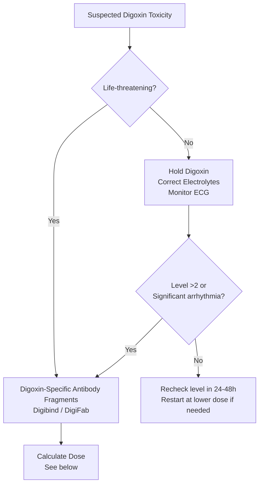

# TDM: Digoxin

**Parent Topic:** [Therapeutic Drug Monitoring](../../Therapeutic%20Drug%20Monitoring.md) → [Clinical Therapeutics Overview](../../Clinical%20Therapeutics%20and%20Good%20Prescribing%20MOC.md)
**Status:** `full-fcps-mrcp-note`
**Priority:** ⭐⭐⭐ HIGHEST (FCPS/MRCP — narrow TI, renal clearance, target 0.5–0.9/1.0–1.5, toxicity signs, Fab fragments)
**Source:** Davidson 24th Ed Ch 2; BNF; NICE; ESC Guidelines; Sanford Guide; Digoxin TDM literature

---

## 🎯 Learning Objectives
- [ ] Understand **digoxin PK**: narrow therapeutic index, renal elimination, Vd, tissue binding
- [ ] Apply **therapeutic ranges**: AF (0.5–0.9 μg/L) vs HF (0.8–1.5 μg/L) — modern lower targets
- [ ] Calculate **loading dose** (rapid digitalisation) vs **maintenance dose** (renal-adjusted)
- [ ] Time **sampling correctly**: ≥6h post-dose (ideally 8–12h) — avoid distribution phase
- [ ] Recognise **toxicity**: GI, CNS (visual), cardiac (arrhythmias), biochemical (K⁺, Ca²⁺, Mg²⁺)
- [ ] Know **drug interactions**: P-gp inhibitors (amiodarone, verapamil, quinidine, clarithromycin)
- [ ] Manage **overdose**: Digoxin-specific antibody fragments (Digibind/DigiFab)
- [ ] Answer viva: "When to check digoxin level?" and "Digoxin toxicity management"

---

## 🧠 Core Concept: Digoxin Pharmacokinetics

### Key PK Properties

| Property | Value | Clinical Implication |
|----------|-------|---------------------|
| **Therapeutic index** | **Narrow** (toxic >2 μg/L) | TDM essential |
| **Absorption (oral)** | 70–80% bioavailability | IV = 100%; switch IV→PO = same dose |
| **Distribution** | **Vd 5–8 L/kg** (large; tissue binding) | Loading dose needed; **not dialysable** |
| **Protein binding** | 20–25% | Minimal displacement interactions |
| **Elimination** | **Renal (60–80% unchanged)** | **CrCl = primary determinant of clearance** |
| **Half-life** | **36–48h (normal renal)**; **4–6 days (anuria)** | Steady state: 5–7 days (normal); 2–3 weeks (ESRD) |
| **Clearance** | ~7 L/h/70kg (parallels CrCl) | Maintenance dose ∝ CrCl |

> **Key Principle:** *Digoxin is a P-glycoprotein (P-gp) substrate. P-gp inhibitors → ↑ absorption + ↓ renal/biliary clearance → ↑ levels.*

---

## 1️⃣ Therapeutic Ranges — Modern Lower Targets

| Indication | Target Range (μg/L) | Rationale |
|------------|---------------------|-----------|
| **Atrial Fibrillation** (rate control) | **0.5–0.9** (some guidelines 0.5–1.0) | Lower levels effective for rate control; ↓ toxicity |
| **Heart Failure** (HFrEF, sinus rhythm) | **0.5–0.9** (historically 0.8–1.5; **now lower**) | **DIG trial**: no mortality benefit >0.9; ↑ toxicity |
| **Acute HF / Severe symptoms** | 0.8–1.2 (short-term) | Higher levels for inotropic effect temporarily |

> **Viva Key:** *Modern target for BOTH AF and HF is **0.5–0.9 μg/L** (some use 0.5–1.0). Historical HF target 0.8–1.5 is outdated — DIG trial showed no benefit and more toxicity above 0.9.*

### When to Check Level
| Situation | Timing |
|-----------|--------|
| **Steady state** | **≥5 half-lives** = **5–7 days** (normal renal); **2–3 weeks** (ESRD) |
| **After dose change** | Wait 5 half-lives from change |
| **Suspected toxicity** | **Any time** (interpret with clinical picture) |
| **Drug interaction started** | 3–5 days after interacting drug |
| **Renal function change** | When new steady state reached |

### Sampling Time — CRITICAL
| Dose Timing | When to Sample |
|-------------|----------------|
| **Oral** | **≥6h post-dose** (ideally **8–12h**, or pre-next dose) |
| **IV** | **≥6h post-infusion** |
| **Why wait?** | **Distribution phase** (first 6h): levels falsely high (tissue not equilibrated) |

> **Never** check level <6h post-dose — **falsely elevated** (distribution phase). If drawn early, **repeat at correct time**.

---

## 2️⃣ Dosing — Loading & Maintenance

### Loading Dose (Rapid Digitalisation) — AF with Rapid Ventricular Rate

| Route | Regimen |
|-------|---------|
| **IV** | **0.5–0.75 mg stat**, then 0.25 mg q6h × 2–3 doses (total 1–1.5 mg over 24h) |
| **Oral** | **0.5–0.75 mg stat**, then 0.25 mg q6h × 2–3 doses (total 1–1.5 mg over 24h) |
| **Max total load** | **1.5 mg** (rarely >2 mg) |
| **Monitor** | ECG, HR, BP, K⁺ during loading |

> **Contraindicated for loading**: WPW + AF, significant AV block, recent MI, severe electrolyte imbalance

### Maintenance Dose — Renal Function Based

| CrCl (mL/min) | Typical Daily Dose (μg) | Regimen |
|---------------|------------------------|---------|
| **>60** | **125–250** | 125–250 μg daily |
| **40–60** | **125** | 125 μg daily |
| **30–40** | **125** q48h or 62.5 daily | Alternate days or half-dose |
| **20–30** | **62.5–125** q48h | 62.5–125 μg q48h |
| **10–20** | **62.5** q48–72h | 62.5 μg q48–72h |
| **<10 / HD** | **62.5** q72h or weekly | Post-HD if on HD |

### Calculation Formula (Jelliffe / Koda-Kimble)
```
Maintenance Dose (μg/day) = (Target Css × Cl) / F
Cl (L/h) ≈ 0.8 × CrCl (mL/min) + 20 (non-renal)
F (bioavailability) = 0.7–0.8 (oral); 1.0 (IV)
Target Css = 0.7–0.9 μg/L (mid-range)
```
**Simplified**: Daily dose (μg) ≈ **Target × CrCl × 0.8** (rough approximation)

### Obesity & Elderly
- **Obesity**: Use **ideal body weight** for Vd calculation (digoxin distributes in lean tissue)
- **Elderly**: ↓ Vd, ↓ CrCl → **lower doses** (often 62.5–125 μg daily)

---

## 3️⃣ Drug Interactions — P-gp Inhibitors (Major)

| Drug | Effect on Digoxin | Magnitude | Management |
|------|-------------------|-----------|------------|
| **Amiodarone** | ↑ Level **2–3x** (↓ renal & non-renal clearance, ↑ Vd) | **Major** (most common serious interaction) | **Halve digoxin dose**; monitor level at 3–7 days |
| **Verapamil** | ↑ Level **1.5–2x** | **Major** | Reduce digoxin dose 50%; monitor |
| **Quinidine** | ↑ Level **2–3x** | **Major** | Avoid combination; if essential → halve dose |
| **Clarithromycin / Erythromycin** | ↑ Level **1.5–2x** (gut P-gp inhibition) | Moderate | Monitor level; reduce dose if needed |
| **Azithromycin** | Minimal effect | Minor | Preferred macrolide |
| **Dronedarone** | ↑ Level **2x** | Major | Halve dose |
| **Spironolactone / Eplerenone** | ↑ Level mild (P-gp + renal) | Moderate | Monitor K⁺ and digoxin level |
| **P-gp inducers** (Rifampicin, St John's Wort) | ↓ Level | Moderate | May need dose increase |

> **Viva Key:** *Amiodarone + digoxin = classic interaction. **Halve digoxin dose** when starting amiodarone. Check level at 1 week.*

---

## 4️⃣ Toxicity — Recognition & Management

### Clinical Features

| System | Features |
|--------|----------|
| **GI** (most common, early) | Anorexia, nausea, vomiting, abdominal pain |
| **CNS** (characteristic) | **Visual disturbances**: yellow-green halos (xanthopsia), blurred vision, photophobia; Confusion, delirium, headache |
| **Cardiac** (life-threatening) | **Arrhythmias**: **PAT with block** (paroxysmal atrial tachycardia with AV block) — **pathognomonic**; Bradycardia, AV block, VF, VT, bigeminy, bidirectional VT |
| **Biochemical** | **Hyperkalaemia** (acute toxicity → K⁺ release from cells); Hypokalaemia (diuretics → ↑ toxicity); Hypomagnesaemia |

### Toxicity Risk Factors
| Factor | Mechanism |
|--------|-----------|
| **Renal impairment** | ↓ Clearance |
| **Hypokalaemia** (diuretics) | ↓ K⁺ → ↑ Na⁺/K⁺-ATPase binding → ↑ toxicity |
| **Hypomagnesaemia** | Similar to hypokalaemia |
| **Hypercalcaemia** | ↑ Toxicity (Ca²⁺ potentiates) |
| **Hypothyroidism** | ↓ Clearance, ↑ sensitivity |
| **Elderly** | ↓ Vd, ↓ CrCl, polypharmacy |
| **P-gp inhibitors** | ↑ Levels (see above) |

---

## 5️⃣ Management of Toxicity / Overdose



### Digoxin-Specific Antibody Fragments (Digibind® / DigiFab®)

| Product | Binding Capacity | Dosing |
|---------|------------------|--------|
| **Digibind** (ovine Fab) | 1 vial binds **0.5 mg** digoxin | **Empirical**: 10–20 vials (acute overdose) |
| **DigiFab** (ovine Fab, newer) | 1 vial binds **0.4 mg** digoxin | **Calculated**: see below |

#### Calculated Dosing Formulas

**1. Based on Steady-State Level (preferred for chronic toxicity):**
```
Number of vials = (Serum digoxin μg/L × Vd L/kg × Weight kg) / 0.4 mg per vial (DigiFab)
                  = (Level × 6 × Weight) / 0.4  (Vd ≈ 6 L/kg)
```
*Example: 80kg, level 4 μg/L → (4 × 6 × 80) / 0.4 = 480 vials → **impractical** → use empirical*

**2. Based on Amount Ingested (acute overdose):**
```
Number of vials = Amount ingested (mg) / 0.4 mg per vial (DigiFab)
```
*Example: 30 tablets × 250μg = 7.5mg → 19 vials*

**3. Empirical (if unknown):**
- **Chronic toxicity**: 10–15 vials DigiFab (or 20 vials Digibind)
- **Acute massive overdose**: 20–30 vials DigiFab
- **Paediatric**: Same calculation

#### Administration
- **IV infusion** over 30 min (can be 15 min if critical)
- **Effect**: Free digoxin ↓ within minutes; total digoxin ↑ (bound to Fab)
- **Monitoring**: K⁺ (falls as digoxin redistributes), ECG, renal function
- **Lab interference**: **Total digoxin assay falsely elevated** post-Fab; use **free digoxin** if available

---

## 6️⃣ Special Populations

### Renal Impairment
| CrCl | Action |
|------|--------|
| **30–60** | Standard dose, monitor level |
| **15–30** | **Halve dose** (62.5–125 μg q48h) |
| **<15 / HD** | **Minimal dose** (62.5 μg q72h or weekly); **not dialysable** (large Vd, tissue binding) |
| **CRRT** | Similar to CrCl 15–30; monitor levels |

### Pregnancy
- **Category C** (crosses placenta)
- **Vd ↑, Cl ↑** in pregnancy → may need higher dose
- **Monitor levels** (target same)
- **Safe in breastfeeding** (minimal milk transfer)

### Paediatrics
- **Higher Vd** (neonates 10–15 L/kg) → higher loading dose per kg
- **Renal function immature** → longer half-life in neonates
- **Therapeutic range same** (0.5–0.9 μg/L AF; 0.8–1.5 HF — but modern lower)

---

## 7️⃣ Practical Monitoring Algorithm

```mermaid
flowchart TD
    A[Digoxin Prescribed] --> B{Indication?}
    B -->|AF| C[Target 0.5-0.9 μg/L]
    B -->|HF| D[Target 0.5-0.9 μg/L]
    C & D --> E[Check Baseline: U&E, Mg, Ca, TFT, ECG, CrCl]
    E --> F[Initiate Dose by CrCl<br>Load if AF with RVR]
    F --> G[Check Level at Steady State<br>≥6h post-dose (ideally 8-12h)]
    G --> H{Level in Target?}
    H -->|Yes| I[Continue; Monitor Cr q3-6mo<br>Level if dose change/interaction]
    H -->|Low| J[Increase dose; Re-level steady state]
    H -->|High| K[Reduce/hold dose; Check K+/Mg/Ca<br>Re-level 2-3 days]
    K --> L{Toxicity symptoms?}
    L -->|Yes| M[Hold digoxin; Correct electrolytes;<br>Digibind/DigiFab if life-threatening]
    L -->|No| N[Re-level at steady state]
```

---

## ⚡ FCPS/MRCP High-Yield Summary

| Topic | Key Points |
|-------|------------|
| **Therapeutic Range** | **AF: 0.5–0.9 μg/L**; **HF: 0.5–0.9 μg/L** (modern, DIG trial); Historical HF 0.8–1.5 outdated |
| **Sampling Time** | **≥6h post-dose** (ideally 8–12h/pre-dose); <6h = falsely high (distribution phase) |
| **Steady State** | 5–7 days (normal renal); 2–3 weeks (ESRD) |
| **Loading Dose** | 0.5–0.75mg then 0.25mg q6h × 2–3 doses (total 1–1.5mg) for AF with RVR |
| **Maintenance** | Renal-adjusted: >60=125–250μg/d; 40–60=125μg/d; 30–40=125μg q48h; <15=62.5μg q72h |
| **Key Interaction** | **Amiodarone → 2–3x level ↑ → HALVE digoxin dose**; Verapamil, quinidine, clarithromycin similar |
| **Toxicity** | GI (nausea), CNS (yellow halos/xanthopsia), Cardiac (PAT with block = pathognomonic), Hyperkalaemia |
| **Risk Factors** | Renal impairment, hypokalaemia, hypomagnesaemia, hypercalcaemia, hypothyroidism, elderly, P-gp inhibitors |
| **Overdose** | **Digibind/DigiFab** (Fab fragments); Dose by amount ingested or empirical 10–20 vials |
| **Pregnancy** | Category C; Vd↑, Cl↑; monitor levels; safe in breastfeeding |

---

## 🎤 Viva Questions (Expected Answers)

| # | Question | Expected Answer |
|---|----------|-----------------|
| 1 | What is the modern therapeutic range for digoxin in AF and HF? | **Both 0.5–0.9 μg/L** (some use 0.5–1.0). DIG trial: no mortality benefit >0.9 in HF; more toxicity. Historical HF 0.8–1.5 is outdated. |
| 2 | When should digoxin level be checked? | **≥6h post-dose** (ideally 8–12h or pre-dose). **NOT <6h** — distribution phase gives falsely high levels. |
| 3 | Steady state for digoxin in normal renal function? | **5–7 days** (5 half-lives; t½ 36–48h). In ESRD: 2–3 weeks. |
| 4 | Amiodarone started on digoxin — action? | **Halve digoxin dose immediately**. Amiodarone ↑ digoxin 2–3x (P-gp inhibition + ↓ clearance). Check level at 1 week. |
| 5 | Pathognomonic arrhythmia of digoxin toxicity? | **Paroxysmal Atrial Tachycardia with AV Block (PAT with block)**. Also: bidirectional VT, AV block, VF. |
| 6 | Visual disturbance characteristic of digoxin toxicity? | **Xanthopsia** — yellow-green halos, blurred vision, photophobia. |
| 7 | Electrolyte abnormalities increasing digoxin toxicity? | **Hypokalaemia** (diuretics), **Hypomagnesaemia**, **Hypercalcaemia**. Hypokalaemia = most common. |
| 8 | Digoxin overdose management? | **Digoxin-specific antibody fragments (Digibind/DigiFab)**. Empirical 10–20 vials or calculated by amount ingested. Total digoxin assay falsely elevated post-Fab. |
| 9 | Digoxin in end-stage renal disease on HD — dosing? | **62.5 μg q72h or weekly** (post-HD). **Not dialysable** (large Vd, tissue binding). Monitor levels. |
| 10 | Patient on digoxin 125μg daily, started clarithromycin for pneumonia. Action? | Clarithromycin ↑ digoxin 1.5–2x (P-gp inhibition). **Reduce digoxin to 62.5μg daily**; monitor level at 3–5 days. |

---

## 🧩 Confusions & Mnemonics

| Confusion | Clarification |
|-----------|---------------|
| **"Digoxin level at 2h post-dose is fine"** | **NO.** <6h = distribution phase. Level falsely HIGH. Must wait **≥6h** (ideally 8–12h). |
| **"HF target is 0.8–1.5 μg/L"** | **OUTDATED.** DIG trial (1997): no mortality benefit >0.9; more toxicity. **Modern target 0.5–0.9 for both AF and HF.** |
| **"Digoxin cleared by dialysis"** | **NO.** Large Vd (6 L/kg), tissue binding → **not dialysable**. Dose post-HD weekly. |
| **"Any visual change = digoxin toxicity"** | **Xanthopsia (yellow halos)** is characteristic. But check level + electrolytes + clinical context. |
| **"Amiodarone + digoxin = just monitor"** | **NO.** Interaction is **major, predictable, 2–3x level increase**. **Halve dose at amiodarone initiation**. |
| **"Hyperkalaemia = always present in toxicity"** | **Acute massive overdose → hyperkalaemia** (K⁺ release from cells). **Chronic toxicity → often normal or low K⁺** (diuretics). |

> **Mnemonic: DIGOXIN TDM**  
> **D**igoxin target: **0.5-0.9 μg/L** (both AF & HF modern)  
> **I**nteractions: **Amiodarone #1** (halve dose); Verapamil, Quinidine, Clarithromycin, Dronedarone (P-gp inhibitors)  
> **G**I/CNS/Cardiac toxicity: Nausea, **Xanthopsia** (yellow halos), **PAT with block** (pathognomonic)  
> **O**verdose: **Digibind/DigiFab** (Fab fragments); empirical 10-20 vials or by ingested amount  
> **X** (Sampling time): **≥6h post-dose** (8-12h ideal); <6h = falsely high (distribution)  
> **I**ndex of toxicity risk: **HypoK, HypoMg, HyperCa, Hypothyroid, Renal failure, Elderly, P-gp inhibitors**  
> **N**ephron: **Renal clearance** = main route; Dose by CrCl: >60=125-250μg/d, <15=62.5μg q72h/weekly  
> **T**herapeutic range: **Historical HF 0.8-1.5 = OLD**; DIG trial → **0.5-0.9 for both**  
> **M**aintenance: **No loading for HF**; Load only AF with RVR (0.5-0.75mg then 0.25mg q6h×2-3)  
> **M**onitor: **Level at steady state** (5-7d normal; 2-3w ESRD); K+/Mg/Ca/TFT baseline  
> **U**ricaria/dermatitis: rare hypersensitivity  
> **S**teady state: **5 half-lives**; t½ 36-48h normal; 4-6 days ESRD  
> **P**regnancy: Category C; crosses placenta; Vd↑, Cl↑; safe in breastfeeding  
> **E**lderly: ↓ Vd, ↓ CrCl → lower doses (62.5-125μg); polypharmacy risk  

---

## 🗺️ Mind Map

```mermaid
mindmap
  root((Digoxin TDM))
    Target
      AF: 0.5-0.9
      HF: 0.5-0.9 (modern)
      Old HF 0.8-1.5 outdated
    Sampling
      ≥6h post-dose (8-12h ideal)
      NOT <6h (distribution phase)
      Steady state: 5-7d normal
    Dosing
      Load: AF RVR only (1-1.5mg/24h)
      Maint: by CrCl
      >60: 125-250μg/d
      <15: 62.5μg q72h
    Interactions
      Amiodarone: 2-3x ↑ → halve dose
      Verapamil, Quinidine, Clarithro
      P-gp inhibitors
    Toxicity
      GI: Nausea
      CNS: Xanthopsia (yellow halos)
      Cardiac: PAT with block
      K+: Hyper (acute), Hypo (chronic)
    Overdose
      Digibind/DigiFab
      Empirical 10-20 vials
      Total assay falsely high
```

---

## 📅 Spaced Repetition Tracker

| Review | Date | Score (0–5) | Notes |
|--------|------|-------------|-------|
| Day 1 | | | |
| Day 3 | | | |
| Day 7 | | | |
| Day 14 | | | |
| Day 30 | | | |
| Day 90 | | | |

---

## 📝 Self-Test Scorecard

| Section | Max | Score | % |
|---------|-----|-------|---|
| Therapeutic Range | 2 | | |
| Sampling Time | 2 | | |
| Dosing (Load/Maint) | 3 | | |
| Interactions (P-gp) | 3 | | |
| Toxicity Features | 3 | | |
| Overdose Management | 2 | | |
| Special Populations | 2 | | |
| Monitoring Algorithm | 3 | | |
| **Total** | **20** | | |

---

## 💬 Exam Answer Modes

| Format | Prompt | Key Points |
|--------|--------|------------|
| **Long Essay** | "Describe digoxin therapeutic drug monitoring including dosing, sampling, toxicity and interactions." | Target 0.5-0.9, sampling ≥6h, renal dosing, loading for AF, P-gp interactions (amiodarone), toxicity (GI, xanthopsia, PAT with block), Fab fragments |
| **Short Note** | "Digoxin toxicity management." | Hold digoxin, correct K+/Mg/Ca++, Digibind/DigiFab for life-threatening, monitor ECG, total assay falsely elevated post-Fab |
| **Viva** | "Patient on digoxin 125μg daily, starts amiodarone for AF. Action?" | **Halve digoxin to 62.5μg daily immediately**. Amiodarone ↑ level 2-3x. Check level at 1 week. Monitor electrolytes. |
| **Ward Round** | "Digoxin level drawn 3h post-dose = 2.2 μg/L. Patient asymptomatic. Action?" | **Ignore level** — drawn in distribution phase (<6h). **Repeat at 8–12h post-dose**. If still >1.5 → reduce dose. |
| **Last-Night** | "Target 0.5-0.9. Sample ≥6h (8-12h). Load AF only. Maint by CrCl. Amiodarone halve dose. Toxicity: nausea, yellow halos, PAT+block, hyperK. Fab for overdose." | Target range. Sampling. Loading. Renal dosing. Key interaction. Toxicity triad. Antidote. |

---

## 📌 Summary
- **Therapeutic range**: **0.5–0.9 μg/L** for both AF and HF (modern, DIG trial)
- **Sampling**: **≥6h post-dose** (ideally 8–12h/pre-dose); <6h = falsely high (distribution phase)
- **Steady state**: 5–7 days (normal renal); 2–3 weeks (ESRD)
- **Dosing**: Loading only for AF with RVR (1–1.5mg/24h); Maintenance by CrCl: >60=125–250μg/d, <15=62.5μg q72h
- **Key interaction**: **Amiodarone → 2–3x level ↑ → HALVE dose**; Verapamil, quinidine, clarithromycin similar (P-gp)
- **Toxicity**: GI (nausea), CNS (**xanthopsia** = yellow halos), Cardiac (**PAT with block** = pathognomonic), Hyperkalaemia (acute)
- **Risk factors**: Renal impairment, hypokalaemia, hypomagnesaemia, hypercalcaemia, hypothyroidism, elderly, P-gp inhibitors
- **Overdose**: **Digoxin-specific Fab fragments (Digibind/DigiFab)**; empirical 10–20 vials or calculated by ingested amount
- **ESRD/HD**: Not dialysable; minimal dose weekly post-HD; monitor levels

---

## ❓ MCQs (10)

1. **Modern digoxin therapeutic range for heart failure:**  
   A. 0.8–1.5 μg/L  B. 1.0–2.0 μg/L  C. **0.5–0.9 μg/L**  D. 1.5–2.5 μg/L  
   *Answer: C. DIG trial: no benefit >0.9; more toxicity. Target 0.5–0.9 for both AF and HF.*

2. **Correct sampling time for digoxin level:**  
   A. 1h post-dose  B. 3h post-dose  C. **≥6h post-dose (ideally 8–12h)**  D. Any time  
   *Answer: C. <6h = distribution phase → falsely elevated. Wait ≥6h (8–12h ideal).*

3. **Drug interaction requiring digoxin dose halving:**  
   A. Furosemide  B. **Amiodarone**  C. Aspirin  D. Atorvastatin  
   *Answer: B. Amiodarone ↑ digoxin 2–3x (P-gp inhibition). Halve dose at initiation.*

4. **Pathognomonic arrhythmia of digoxin toxicity:**  
   A. Atrial fibrillation  B. **PAT with AV block**  C. SVT  D. Ventricular fibrillation  
   *Answer: B. Paroxysmal Atrial Tachycardia with AV Block = pathognomonic.*

5. **Visual disturbance in digoxin toxicity:**  
   A. Blue vision  B. **Yellow-green halos (xanthopsia)**  C. Double vision  D. Tunnel vision  
   *Answer: B. Xanthopsia — yellow-green halos, blurred vision, photophobia.*

6. **Digoxin overdose antidote:**  
   A. N-acetylcysteine  B. Flumazenil  C. **Digoxin-specific antibody fragments (Digibind/DigiFab)**  D. Physostigmine  
   *Answer: C. Digibind/DigiFab = ovine Fab fragments binding digoxin.*

7. **Digoxin in ESRD on haemodialysis — dosing:**  
   A. 125μg daily  B. 125μg post-HD  C. **62.5μg q72h or weekly post-HD**  D. 250μg q48h  
   *Answer: C. Not dialysable (large Vd). Minimal dose 62.5μg q72h or weekly post-HD.*

8. **Electrolyte abnormality MOST increasing digoxin toxicity:**  
   A. Hyperkalaemia  B. **Hypokalaemia**  C. Hypernatraemia  D. Hypophosphataemia  
   *Answer: B. Hypokalaemia (from diuretics) → ↑ Na⁺/K⁺-ATPase binding → ↑ toxicity.*

9. **Steady state for digoxin in normal renal function:**  
   A. 24h  B. 48h  C. **5–7 days**  D. 2 weeks  
   *Answer: C. t½ 36–48h → 5 half-lives = 5–7 days.*

10. **Digoxin level drawn 3h post-dose = 2.2 μg/L. Interpreation?**  
    A. Toxic — stop digoxin  B. **Falsely high — ignore, repeat at 8–12h**  C. Therapeutic  D. Subtherapeutic  
    *Answer: B. <6h = distribution phase. Level not at steady state. Repeat at correct time.*

---

## 📋 SBAs (10)

1. **75M, AF, digoxin 125μg daily, CrCl 45. Starts amiodarone. Best action?**  
   A. Continue same dose, monitor level  B. **Reduce digoxin to 62.5μg daily**  C. Stop digoxin  D. Increase digoxin  
   *Answer: B. Amiodarone ↑ digoxin 2–3x. Halve dose immediately. Check level at 1 week.*

2. **Patient on digoxin, presents with nausea, yellow halos, HR 40, irregular. ECG: atrial tachycardia with 2:1 block. K+ 5.2. Diagnosis?**  
   A. Beta-blocker toxicity  B. **Digoxin toxicity**  C. Calcium channel blocker toxicity  D. Myocardial infarction  
   *Answer: B. Triad: GI (nausea), CNS (xanthopsia), Cardiac (PAT with block). Hyperkalaemia in acute toxicity.*

3. **80M, digoxin 250μg daily for 10 years, CrCl 20. Presents confused. Level 3.5 μg/L. Management?**  
   A. **Hold digoxin; correct electrolytes; consider Digibind if arrhythmia**  B. Reduce dose to 125μg  C. Continue, monitor  D. Switch to beta-blocker  
   *Answer: A. Level >2 = toxicity. Hold digoxin. Correct K+/Mg. Digibind if life-threatening arrhythmia.*

4. **Digoxin overdose: 50 tablets of 250μg ingested 2h ago. DigiFab dose?**  
   A. 5 vials  B. **20 vials**  C. 10 vials  D. 30 vials  
   *Answer: B. 50 × 0.25mg = 12.5mg. DigiFab 1 vial = 0.4mg. 12.5/0.4 = 31 vials. Empirical 20–30 vials for acute overdose.*

5. **Digoxin level timing — which is CORRECT?**  
   A. 2h post-IV = therapeutic  B. Pre-dose oral = peak  C. **≥6h post-dose oral = valid**  D. Any time if steady state  
   *Answer: C. Must wait ≥6h post-dose (8–12h ideal) for valid trough level.*

---

## 🔑 Answer Keys
| MCQs | SBAs |
|------|------|
| 1-C, 2-C, 3-B, 4-B, 5-B, 6-C, 7-C, 8-B, 9-C, 10-B | 1-B, 2-B, 3-A, 4-B, 5-C |

---

## 🔗 Cross-Links
- [[Special Populations/Renal Prescribing]] — CrCl calculation, dosing in CKD/ESRD/HD
- [[Drug Interactions/Pharmacokinetic interactions/Excretion interactions]] — P-gp interactions, renal clearance
- [[Medication Safety and Errors/PINCH High-Risk Drugs]] — Digoxin as high-alert (narrow TI)
- [[Special Populations/Elderly Prescribing]] — Digoxin in elderly (↓ dose, ↑ toxicity risk)
- [[Clinical Context/Perioperative Prescribing]] — Digoxin perioperative management
- [[Therapeutic Drug Monitoring/Lithium]] — Another narrow TI drug with renal clearance