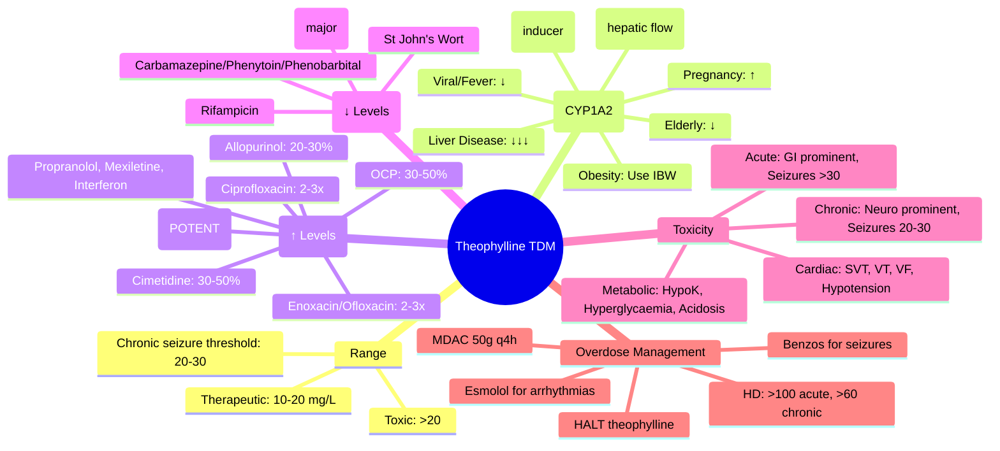

**Status**: `full-fcps-mrcp-note` | **Chapter**: 2 — Clinical Therapeutics and Good Prescribing | **Heading**: Therapeutic Drug Monitoring → Drug-Specific TDM | **Exam Priority**: ⭐⭐ **MODERATE** (COPD/Asthma, narrow TI, CYP1A2 interactions, declining use but still examined)

---

## 1. 1. 🎯 Learning Objectives
- [ ] State therapeutic and toxic ranges for theophylline
- [ ] Apply CYP1A2 interaction management (smoking, fluvoxamine, ciprofloxacin, etc.)
- [ ] Recognise toxicity: cardiac, neurological, GI, metabolic
- [ ] Manage overdose: HALT algorithm, charcoal, dialysis indications
- [ ] Apply dosing in special populations (heart failure, liver disease, elderly)

---

## 2. 2. 📊 Therapeutic Range & Sampling

| Indication | **Therapeutic Range (mg/L or µg/mL)** | **Toxic Threshold** |
|------------|--------------------------------------|---------------------|
| **Chronic Asthma / COPD** | **10–20** | **>20** |
| **Acute Severe Asthma (IV Aminophylline)** | **10–20** | **>20** |

> **Target 10–20 mg/L** — **↑ Efficacy above 10, ↑ Toxicity above 20**

### 1. Sampling Timing
| Route | **Sampling Time** |
|-------|------------------|
| **Oral (Sustained-Release)** | **Trough (pre-dose)** at steady state (48h) |
| **IV Aminophylline** | **4–6h after infusion start** (or pre-next dose if intermittent) |
| **Loading Dose** | **30 min post-infusion** |

> **Steady state**: **~48h** (t½ ~8h in non-smokers; ~3–5h in smokers)

---

## 3. 3. ⚖️ Factors Affecting Clearance (CYP1A2)

| Factor | **Effect on Clearance** | **Dose Adjustment** |
|--------|------------------------|---------------------|
| **Cigarette Smoking** | **↑↑ Clearance (induces CYP1A2) — 2–3x faster** | **Smokers need 2–3x higher dose** |
| **Marijuana** | ↑ Clearance (induces CYP1A2) | ↑ Dose |
| **Age (Elderly >65)** | ↓ Clearance (↓ CYP activity, ↓ Vd) | **↓ Dose 25–50%** |
| **Heart Failure** | ↓ Clearance (↓ hepatic blood flow) | **↓ Dose 25–50%** |
| **Liver Disease (Cirrhosis)** | ↓↓ Clearance | **↓ Dose 50–75%** |
| **Viral Infection / Fever** | ↓ Clearance | ↓ Dose |
| **Pregnancy (3rd Trimester)** | ↑ Clearance | ↑ Dose |
| **Obesity** | **Use Ideal Body Weight (IBW)** for dosing | IBW-based |

---

## 4. 4. 🔄 Key CYP1A2 Interactions

### 1. Inhibitors (↑ Theophylline Levels → Toxicity Risk)
| Inhibitor | **Effect** | **Management** |
|-----------|------------|----------------|
| **Fluvoxamine** | **↑ Levels 3–5x** (potent CYP1A2 inhibitor) | **AVOID**; if essential: ↓ theophylline **75–90%**, monitor levels |
| **Ciprofloxacin** | **↑ Levels 2–3x** | **AVOID**; use alternative; if essential: ↓ theophylline **50%**, monitor |
| **Enoxacin / Ofloxacin / Norfloxacin** | ↑ Levels 2–3x | Similar to ciprofloxacin |
| **Moxifloxacin / Levofloxacin** | ↑ Levels (weak/mod) | Monitor; ↓ dose if needed |
| **Cimetidine** | ↑ Levels 30–50% | **AVOID**; use famotidine/ranitidine (no CYP inhibition) |
| **Allopurinol** | ↑ Levels 20–30% | Monitor levels |
| **Oral Contraceptives** | ↑ Levels 30–50% | Monitor levels |
| **Interferon-α** | ↑ Levels | Monitor |
| **Propranolol** | ↑ Levels (mod) | Monitor |
| **Mexiletine** | ↑ Levels | Monitor |

### 2. Inducers (↓ Theophylline Levels → Subtherapeutic)
| Inducer | **Effect** | **Management** |
|---------|------------|----------------|
| **Cigarette Smoking** | **↑ Clearance 2–3x** (major) | **Smokers need 2–3x dose**; check level 1 week after quitting |
| **Marijuana** | ↑ Clearance | ↑ Dose |
| **Rifampicin** | **↑ Clearance 2–3x** | ↑ Dose; monitor |
| **Carbamazepine / Phenytoin / Phenobarbital** | ↑ Clearance (CYP1A2 + 3A4) | ↑ Dose; monitor |
| **St John's Wort** | ↑ Clearance | ↑ Dose; monitor |
| **High Protein / Low Carb Diet** | ↑ Clearance | Monitor |

---

## 5. 5. ☠️ Theophylline Toxicity

### 1. Acute vs Chronic
| Feature | **Acute Overdose** | **Chronic Toxicity** |
|---------|-------------------|----------------------|
| **Context** | Intentional / accidental massive ingestion | **Therapeutic dosing + precipitant** (inhibitor, HF, liver disease, elderly) |
| **Level Correlation** | **Good** — level predicts severity | **Poor** — **level may be only mildly elevated (20–30)** but severe toxicity |
| **GI** | **Prominent** (N/V, haematemesis) | **Mild** |
| **Cardiac** | **Prominent** (arrhythmias, hypotension) | **Prominent** (arrhythmias) |
| **Neurological** | Seizures (late) | **Seizures (often refractory)** |
| **Metabolic** | Hypokalaemia, Hyperglycaemia, Metabolic acidosis | Similar |

### 2. Clinical Features by Level
| Level (mg/L) | Features |
|--------------|----------|
| **10–20** | Therapeutic |
| **20–30** | N/V, Tremor, Tachycardia, Palpitations, Hypokalaemia, Hyperglycaemia |
| **30–50** | **Seizures (often refractory)**, **Arrhythmias (SVT, VT, VF)**, Hypotension, Rhabdomyolysis, Metabolic acidosis |
| **>50** | **Life-threatening** — Status epilepticus, VF, Multi-organ failure |

> **Chronic toxicity**: **Seizures can occur at levels 20–30 mg/L** (unlike acute where seizures >30)

### 3. Key Toxicity Mechanisms
| System | Mechanism |
|--------|-----------|
| **Cardiac** | Adenosine receptor antagonism → ↑ cAMP → ↑ Ca²⁺ influx → **① Tachyarrhythmias (SVT, VT)**, **② Hypotension (β2 vasodilation)** |
| **Neurological** | Adenosine A1 antagonism → **Seizures**; Phosphodiesterase inhibition → ↑ cAMP/cGMP |
| **GI** | Phosphodiesterase inhibition → ↑ Gastric acid, ↓ LES tone → **N/V, Reflux, Haematemesis** |
| **Metabolic** | β2 agonism → **Hypokalaemia** (K⁺ shift into cells), **Hyperglycaemia** (glycogenolysis), Lipolysis |

---

## 6. 6. 💊 Management of Toxicity / Overdose

### 1. HALT Algorithm (Acute Overdose)
| Step | Action |
|------|--------|
| **H** | **HALT theophylline** (stop immediately) |
| **A** | **Activated Charcoal** — **Multiple-dose (MDAC) 50g q4h** (enhances elimination via gut dialysis); **Whole bowel irrigation** if sustained-release |
| **L** | **Laxative** (sorbitol) with first charcoal dose only |
| **T** | **Treat** complications |

### 2. Specific Treatments
| Complication | Treatment |
|--------------|-----------|
| **Seizures** | **IV Benzodiazepines** (Lorazepam 4mg / Diazepam 10mg); **Refractory: Propofol / Phenobarbital / Midazolam infusion**; **Phenytoin LESS effective** (may ↓ seizure threshold) |
| **Arrhythmias** | **β-blockers (Esmolol, Metoprolol)** for SVT/VT; **Amiodarone** for VF/VT; **Avoid verapamil/diltiazem** (↑ theophylline) |
| **Hypotension** | IV Fluids; **Noradrenaline** (avoid dopamine — β1 may worsen arrhythmias) |
| **Hypokalaemia** | **IV KCl** replacement (target K⁺ >4.0) |
| **Metabolic Acidosis** | **IV Sodium Bicarbonate** (if pH <7.2) |

### 3. Dialysis Indications (Extracorporeal Removal)
| Indication | Threshold |
|------------|-----------|
| **Haemodialysis / Haemoperfusion** | **Level >100 mg/L (acute)** OR **Level >60 mg/L (chronic)** |
| **Severe toxicity** | **Refractory seizures, Life-threatening arrhythmias, Haemodynamic instability** |
| **Renal failure** | If concurrent AKI — dialysis for both |

> **Theophylline dialyzable** (low protein binding, low Vd, MW 180) — **HD is highly effective**

---

## 7. 7. 🎯 FCPS/MRCP High-Yield Summary

| Pearl | Details |
|-------|---------|
| **Therapeutic range** | **10–20 mg/L** |
| **Toxic** | **>20 mg/L**; **Chonic toxicity seizures at 20–30** |
| **Smoking** | **Induces CYP1A2 → 2–3x clearance** → smokers need **2–3x dose** |
| **Fluvoxamine** | **Potent inhibitor** → ↑ levels **3–5x** — **AVOID** |
| **Ciprofloxacin** | ↑ Levels **2–3x** — **AVOID** |
| **Cimetidine** | ↑ Levels **30–50%** — **AVOID** (use famotidine) |
| **HF / Liver disease / Elderly** | **↓ Clearance** → **↓ Dose 25–50%** |
| **Chronic toxicity** | **Seizures at 20–30 mg/L** (lower than acute) |
| **Overdose** | **MDAC 50g q4h** (enhanced elimination); **HD if >100 acute / >60 chronic** |
| **Seizure treatment** | **Benzodiazepines first**; Phenytoin LESS effective |

---

## 8. 8. ❓ Viva Questions (10)

| Q | Answer |
|---|--------|
| 1. Theophylline therapeutic range? | **10–20 mg/L** |
| 2. Smoking effect on theophylline? | **Induces CYP1A2 → ↑ clearance 2–3x** → smokers need **2–3x higher dose**; check level 1 week after quitting |
| 3. Fluvoxamine + theophylline — effect? | **Potent CYP1A2 inhibitor → ↑ levels 3–5x** — **AVOID** |
| 4. Ciprofloxacin + theophylline — effect? | **↑ Levels 2–3x** — **AVOID**; if essential: ↓ theophylline 50%, monitor |
| 5. Cimetidine + theophylline — effect? | **↑ Levels 30–50%** — **AVOID** (use famotidine) |
| 6. Chronic vs acute theophylline toxicity — seizure threshold? | **Chronic: seizures at 20–30 mg/L**; **Acute: seizures >30 mg/L** |
| 7. Theophylline overdose — enhanced elimination? | **Multiple-dose activated charcoal (MDAC) 50g q4h**; Whole bowel irrigation if SR |
| 8. Theophylline overdose — dialysis indications? | **Acute >100 mg/L; Chronic >60 mg/L; Refractory seizures; Life-threatening arrhythmias** |
| 9. Theophylline seizure treatment — first line? | **IV Benzodiazepines (Lorazepam/Diazepam)**; **Phenytoin LESS effective** |
| 10. Heart failure + theophylline — dose adjustment? | **↓ Clearance (↓ hepatic blood flow)** → **↓ Dose 25–50%**; monitor levels |

---

## 9. 9. 🤯 Confusions & Mnemonics

| Confusion | Clarification |
|-----------|---------------|
| **Acute vs Chronic seizures** | **Chronic toxicity = seizures at LOWER levels (20–30)**; Acute = seizures >30 |
| **Fluvoxamine = strongest inhibitor** | **Fluvoxamine > Ciprofloxacin > Cimetidine > OCP** |
| **Phenytoin for theophylline seizures** | **LESS effective** — may even ↓ seizure threshold; **Benzodiazepines first** |
| **Smoking cessation** | **Clearance ↓ 2–3x** after quitting → **check level 1 week post-quit**; ↓ dose |
| **Dialysis** | **Highly effective** (low protein binding, low Vd, small MW) |
| **Esmolol for arrhythmias** | **β-blocker of choice** (short-acting, cardioselective); **Avoid verapamil/diltiazem** (↑ theophylline) |

**Mnemonics:**
- **"THEOPHYLLINE 10-20"** = Therapeutic range 10-20 mg/L
- **"SMOKER = 2-3X DOSE"** = CYP1A2 induction → 2-3x clearance
- **"FLUVOXAMINE = 3-5X TOXIC"** = Potent CYP1A2 inhibitor
- **"CIPRO = 2-3X TOXIC"** = Avoid with theophylline
- **"CIMETIDINE = AVOID"** = ↑ 30-50% (use famotidine)
- **"CHRONIC SEIZURES = 20-30"** = Lower threshold than acute
- **"MDAC = 50G Q4H"** = Multiple-dose activated charcoal
- **"DIALYSIS >100 ACUTE / >60 CHRONIC"**
- **"BENZOS FOR SEIZURES"** = Phenytoin less effective
- **"HF/LIVER/ELDERLY = ↓ DOSE 25-50%"**

---

## 10. 10. 🧠 Mind Map (Mermaid)

---

## 11. 11. 📅 Spaced Repetition Tracker

| Review | Date | Score | Next |
|--------|------|-------|------|
| 1 | | | 1d |
| 2 | | | 3d |
| 3 | | | 1w |
| 4 | | | 2w |
| 5 | | | 1m |
| 6 | | | 3m |

---

## 12. 12. 🧪 Self-Test Scorecard

| Section | Max | Score |
|---------|-----|-------|
| Range & factors | 8 | |
| Interactions | 8 | |
| Toxicity (acute vs chronic) | 8 | |
| Overdose management | 8 | |
| Viva answers | 10 | |
| **Total** | **42** | |

**Target**: ≥34/42 (80%)

---

## 13. 13. 📝 Exam Answer Modes

### 1. Short Question (5 marks): *"Theophylline therapeutic range, key interactions, and overdose management."*
- **Range**: **10–20 mg/L**; Toxic >20; Chronic seizures 20–30
- **Inhibitors**: Fluvoxamine (3–5x), Ciprofloxacin (2–3x), Cimetidine (30–50%), OCP (30–50%)
- **Inducers**: Smoking (2–3x clearance), Rifampicin, Carbamazepine/Phenytoin
- **Overdose**: **HALT + MDAC 50g q4h + Benzos for seizures + Esmolol for arrhythmias + HD if >100 acute / >60 chronic**

### 2. Viva (1 min): *"COPD patient on theophylline, started ciprofloxacin for exacerbation. 2 days later: N/V, tachycardia, tremor. Level 28. Management?"*
- **Ciprofloxacin inhibits CYP1A2 → ↑ theophylline 2–3x → toxicity**
- **STOP theophylline**; **STOP ciprofloxacin** (switch to azithromycin/doxycycline)
- **Activated charcoal** if recent ingestion
- **IV Benzodiazepines** if seizures; **Esmolol** for tachycardia/arrhythmias
- **K⁺ replacement** (hypokalaemia)
- **HD if level >60 (chronic) or refractory toxicity**
- Monitor level q6h

### 3. Ward Round (30 sec): *"Smoker on theophylline 400mg BD, quits smoking. 1 week later: N/V, tremor. Why?"*
- **Smoking cessation → CYP1A2 induction stops → clearance ↓ 2–3x → theophylline accumulation → toxicity**
- **Check level 1 week after quitting**; ↓ theophylline dose **50–66%**

### 4. Last-Night Revision (1-liners):
- Theophylline range = 10–20; Toxic >20; Chronic seizures 20–30
- Smoking = CYP1A2 inducer → 2–3× clearance → smokers need 2–3× dose
- Fluvoxamine = potent inhibitor (3–5×) — AVOID
- Ciprofloxacin = 2–3× inhibitor — AVOID
- Cimetidine = 30–50% inhibitor — use famotidine
- HF/Liver/Elderly = ↓ clearance → ↓ dose 25–50%
- Chronic toxicity seizures at 20–30 (lower than acute)
- Overdose: HALT + MDAC 50g q4h + Benzos + Esmolol
- HD if >100 acute / >60 chronic
- Smoking cessation = check level 1 week, ↓ dose

---

## 14. 14. 📚 Summary Card

> **THEOPHYLLINE TDM:**
> **RANGE 10-20 mg/L**
> **SMOKING = CYP1A2 INDUCER → 2-3x CLEARANCE → 2-3x DOSE**
> **FLUVOXAMINE = 3-5x TOXIC (AVOID)**
> **CIPRO = 2-3x TOXIC (AVOID)**
> **CIMETIDINE = ↑ 30-50% (USE FAMOTIDINE)**
> **CHRONIC TOXICITY SEIZURES = 20-30** (lower than acute)
> **HF/LIVER/ELDERLY = ↓ DOSE 25-50%**
> **OVERDOSE** = HALT + **MDAC 50g q4h** + **BENZOS** + **ESMOLOL**
> **DIALYSIS** = >100 acute / >60 chronic

---

## 15. 15. ❓ MCQs (12)

1. **Theophylline therapeutic range:**
   A. 5–10 mg/L
   B. **10–20 mg/L** ✓
   C. 20–30 mg/L
   D. 30–40 mg/L
   E. 40–50 mg/L

2. **Cigarette smoking effect on theophylline clearance:**
   A. ↓ Clearance 50%
   B. No effect
   C. **↑ Clearance 2–3x (CYP1A2 induction)** ✓
   D. ↑ Clearance 10x
   E. Unpredictable

3. **Fluvoxamine + Theophylline — effect on theophylline levels:**
   A. No change
   B. ↑ 20–30%
   C. ↑ 2–3x
   D. **↑ 3–5x** ✓
   E. ↓ 50%

4. **Ciprofloxacin + Theophylline — effect:**
   A. No interaction
   B. **↑ Levels 2–3x** ✓
   C. ↓ Levels 50%
   D. ↑ 3–5x
   E. ↓ 2–3x

5. **Cimetidine + Theophylline — preferred H2 blocker alternative:**
   A. Ranitidine
   B. **Famotidine** ✓
   C. Nizatidine
   D. Omeprazole
   E. No alternative needed

6. **Chronic theophylline toxicity — seizures can occur at level:**
   A. >10 mg/L
   B. **20–30 mg/L** ✓
   C. >30 mg/L
   D. >40 mg/L
   E. >50 mg/L

7. **Acute theophylline overdose — seizures typically at level:**
   A. 15–20 mg/L
   B. 20–30 mg/L
   C. **>30 mg/L** ✓
   D. >50 mg/L
   E. >100 mg/L

8. **Theophylline overdose — enhanced elimination method:**
   A. Forced alkaline diuresis
   B. **Multiple-dose activated charcoal (MDAC) 50g q4h** ✓
   C. Haemoperfusion only
   D. Haemodialysis only (no charcoal)
   E. Whole bowel irrigation only

9. **Theophylline seizure — first-line treatment:**
   A. Phenytoin
   B. **IV Benzodiazepines (Lorazepam/Diazepam)** ✓
   C. Phenobarbital
   D. Propofol
   E. Levetiracetam

10. **Theophylline arrhythmia — preferred β-blocker:**
    A. Propranolol
    B. Metoprolol
    C. **Esmolol** ✓
    D. Atenolol
    E. Bisoprolol

11. **Theophylline dialysis indications — chronic toxicity:**
    A. Level >30 mg/L
    B. **Level >60 mg/L** ✓
    C. Level >80 mg/L
    D. Level >100 mg/L
    E. Any level with seizure

12. **Smoking cessation — theophylline dose adjustment:**
    A. No change
    B. **↓ Dose 50–66%; check level 1 week post-quit** ✓
    C. ↑ Dose
    D. Check level only
    E. Switch to alternative

---

## 16. 16. 🃏 Flashcards (Anki-ready)

| Front | Back |
|-------|------|
| Theophylline range | 10–20 mg/L |
| Smoking effect | CYP1A2 induction → 2-3x clearance → 2-3x dose needed |
| Fluvoxamine | Potent CYP1A2 inhibitor → 3-5x theophylline (AVOID) |
| Ciprofloxacin | 2-3x theophylline (AVOID) |
| Cimetidine | ↑ 30-50% (use famotidine) |
| Chronic toxicity seizures | 20-30 mg/L |
| Acute toxicity seizures | >30 mg/L |
| Overdose: enhanced elimination | MDAC 50g q4h |
| Overdose: seizure Rx | IV Benzodiazepines (phenytoin less effective) |
| Overdose: arrhythmia Rx | Esmolol (avoid verapamil/diltiazem) |
| Dialysis indication | >100 acute / >60 chronic / refractory seizure / life-threatening arrhythmia |
| Smoking cessation | Clearance ↓ 2-3x → check level 1 week, ↓ dose 50-66% |
| HF/Liver/Elderly | ↓ clearance → ↓ dose 25-50% |

---

## 17. 17. ✅ Answer Keys

### 1. MCQs
1. **B** — 10–20 mg/L
2. **C** — ↑ Clearance 2–3x (CYP1A2 induction)
3. **D** — ↑ 3–5x
4. **B** — ↑ Levels 2–3x
5. **B** — Famotidine
6. **B** — 20–30 mg/L
7. **C** — >30 mg/L
8. **B** — MDAC 50g q4h
9. **B** — IV Benzodiazepines
10. **C** — Esmolol
11. **B** — Level >60 mg/L (chronic)
12. **B** — ↓ Dose 50–66%; check level 1 week post-quit

---

*File: `/mnt/tb/Medicine/Clinical Therapeutics and Good Prescribing/TDM/Theophylline.md` | Status: `full-fcps-mrcp-note`*
