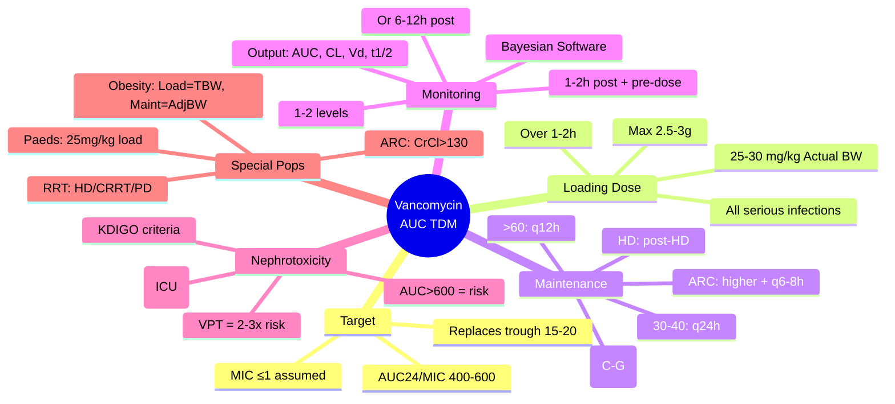

# TDM: Vancomycin (AUC-Guided)

**Parent Topic:** [Therapeutic Drug Monitoring](../../Therapeutic%20Drug%20Monitoring.md) → [Clinical Therapeutics Overview](../../Clinical%20Therapeutics%20and%20Good%20Prescribing%20MOC.md)
**Status:** `full-fcps-mrcp-note`
**Priority:** ⭐⭐⭐ HIGHEST (FCPS/MRCP — **AUC/MIC 400–600** target, Bayesian software, nephrotoxicity, loading doses)
**Source:** Davidson 24th Ed Ch 2; ASHP/IDSA/PIDS/SIDP 2020 Guidelines (AUC-guided); British National Formulary; NICE; Sanford Guide; vancomycin TDM literature

---

## 🎯 Learning Objectives
- [ ] Understand **vancomycin PK**: time-dependent killing, AUC/MIC target
- [ ] Apply **2020 ASHP/IDSA Guidelines**: **AUC 400–600 mg·h/L** (replaces trough-only)
- [ ] Calculate **loading dose** (25–30 mg/kg) for rapid target attainment
- [ ] Use **Bayesian software** (AUC estimation from 1–2 levels) vs traditional trough-only
- [ ] Adjust dosing for **renal impairment** (CrCl-based) and **augmented renal clearance (ARC)**
- [ ] Monitor for **nephrotoxicity** (AKI risk with AUC >600–700, combo with AG/piperacillin-tazobactam)
- [ ] Answer viva: "Why AUC-guided vancomycin?" and "Loading dose calculation"

---

## 🧠 Core Concept: Vancomycin Pharmacodynamics

### Time-Dependent Killing + AUC/MIC

| Property | Value | Clinical Implication |
|----------|-------|---------------------|
| **Killing type** | **Time-dependent** (but AUC/MIC correlates better than %T>MIC) | **AUC/MIC** is primary PD index |
| **Target** | **AUC₂₄/MIC 400–600** (ASHP/IDSA 2020) | For MIC ≤1 mg/L → AUC 400–600 |
| **MIC susceptibility** | S ≤2 mg/L (but MIC >1 = higher AUC needed) | If MIC=2 → AUC 800–1200 (often unachievable) |
| **Post-antibiotic effect** | Minimal (~1h) | No benefit from extended intervals for efficacy |
| **Distribution** | Vd 0.4–1 L/kg (↑ in sepsis, obesity, burns) | Loading dose based on actual BW |
| **Clearance** | Primarily renal (glomerular filtration) | CrCl = main determinant |
| **Half-life** | 4–6h (normal); 3–4h (ARC); 20–100h (ESRD) | Dosing interval varies widely |

> **Paradigm Shift (2020):** *Trough 15–20 mg/L was surrogate for AUC >400. Now **AUC 400–600 directly targeted** using Bayesian software with 1–2 levels. Trough-only monitoring is no longer recommended for serious infections.*

---

## 1️⃣ Loading Dose — Critical for Rapid Target Attainment

### Indication
- **All serious infections** (bacteraemia, endocarditis, pneumonia, meningitis, osteomyelitis, complicated SSTI)
- **Goal**: Achieve target AUC by **end of first dose** (avoid 24–48h delay with standard dosing)

### Calculation
```
Loading Dose (mg) = 25–30 mg/kg × Actual Body Weight
```
- **Max dose**: 2.5–3 g (some protocols cap at 2g, others 3g)
- **Administer**: Over 1–2 hours (rate ≤10 mg/min to reduce Red Man Syndrome)
- **Follow with**: Maintenance dose based on CrCl

### When NOT to Load
- **Mild infections** (cellulitis, non-purulent)
- **Renal impairment** with planned extended intervals (risk of accumulation)
- **Oral vancomycin** (C. difficile) — not IV

---

## 2️⃣ Maintenance Dosing — CrCl-Based

### Initial Maintenance Dose (After Loading Dose)

| CrCl (mL/min) | Dose | Interval | Typical Dose (70kg) |
|---------------|------|----------|---------------------|
| **>60** | 15–20 mg/kg | q8–12h | 1g q12h |
| **40–60** | 15–20 mg/kg | q12h | 1g q12h |
| **30–40** | 15–20 mg/kg | q24h | 1g q24h |
| **20–30** | 15–20 mg/kg | q24–48h | 750mg–1g q24–48h |
| **10–20** | 10–15 mg/kg | q48–72h | 500–750mg q48h |
| **<10 / HD** | 10–15 mg/kg | **Post-HD** | 1g post-HD × 3/week |
| **CRRT** | 15–20 mg/kg | q24–48h | 1g q24h (adjust by effluent) |

### Augmented Renal Clearance (ARC)
- **Definition**: CrCl >130 mL/min (measured or estimated)
- **Population**: Young trauma, burns, sepsis, pregnancy, cystic fibrosis
- **Problem**: Standard doses → **subtherapeutic AUC**
- **Solution**: **Higher dose (25–30 mg/kg) + shorter interval (q6–8h)** + **early TDM (6–12h)**
- **Bayesian software essential** — standard nomograms fail

---

## 3️⃣ AUC-Guided Monitoring — 2020 Guidelines

### Target
| Infection Type | AUC₂₄/MIC Target | Typical MIC Assumption |
|----------------|------------------|------------------------|
| **Serious MRSA** (bacteraemia, endocarditis, pneumonia, osteomyelitis) | **400–600** | MIC ≤1 mg/L |
| **Less severe** (cellulitis, uncomplicated) | 400–600 | MIC ≤1 mg/L |
| **MIC = 2 mg/L** | 800–1200 (often not feasible) | Consider alternative agent |

> **Key:** *If MIC >1, vancomycin often inadequate → consider daptomycin, linezolid, ceftaroline.*

### Bayesian Software — Standard of Care

| Feature | Traditional Trough | Bayesian AUC |
|---------|-------------------|--------------|
| **Levels needed** | Trough only (pre-dose) | **1–2 levels** (any time post-dose) |
| **PK model** | Population average | **Patient-specific** (population prior + patient data) |
| **Output** | Trough concentration | **AUC₂₄, Cmax, Ctrough, half-life, CL, Vd** |
| **Accuracy** | Poor (R² ~0.4–0.6) | **High (R² >0.9)** |
| **Dose adjustment** | Empirical | **Precise (simulate scenarios)** |

#### Recommended Sampling Strategy (Bayesian)
```
Option A: 2 levels (most accurate)
  Level 1: 1–2h post-infusion END (near Cmax)
  Level 2: Pre-next dose (trough)

Option B: 1 level (practical)
  Level: 6–12h post-dose (mid-interval)
  *Less accurate for AUC but usable with good prior*
```

#### Common Bayesian Tools
- **InsightRX, BestDose, MWPharm, DoseMe, TDMx, VancoPK**
- **Online**: www.vancopk.com, www.tdm.stanford.edu
- **Integrated in EMR**: Epic, Cerner, System C

---

## 4️⃣ Traditional Trough-Only Monitoring (If AUC Not Available)

> **Only if Bayesian AUC unavailable** — document limitation

### Targets (Serious Infections)
| Parameter | Target |
|-----------|--------|
| **Trough** (pre-dose) | **15–20 mg/L** (for MIC ≤1) |
| **Trough** (if MIC = 2) | 20+ mg/L (often not achievable safely) |

### When to Check Trough
- **Steady state**: After **3–4 doses** (or 24–48h without loading dose)
- **With loading dose**: Can check **after 1st maintenance dose** (if Bayesian used)
- **Timing**: **30–60 min before next dose** (true trough)

### Limitations
- Trough 15–20 ≠ AUC 400–600 in many patients (especially ARC, obesity, CKD)
- **False reassurance** or **unnecessary dose reduction**

---

## 5️⃣ Nephrotoxicity — Definition, Risk Factors, Monitoring

### Definition (ASHP/IDSA 2020)
| Criteria | KDIGO Stage |
|----------|-------------|
| **SCr ↑ ≥0.3 mg/dL (26.5 μmol/L) within 48h** | Stage 1 |
| **SCr ↑ ≥1.5× baseline within 7 days** | Stage 1 |
| **Urine output <0.5 mL/kg/h for 6h** | Stage 1 |

### Incidence
- **AUC-guided (400–600)**: ~5–10%
- **Trough-guided (15–20)**: ~10–15%
- **Trough >20 / AUC >700**: **20–30%+**

### Major Risk Factors
| Factor | Risk Increase |
|--------|---------------|
| **AUC >600–700** | Dose-dependent |
| **Concomitant nephrotoxins** | **Piperacillin-tazobactam (2–3x)**, Aminoglycosides, Amphotericin, Contrast, ACEi/ARB, Diuretics |
| **Critically ill / ICU** | Hypoperfusion, sepsis |
| **Prolonged course >7–10 days** | Cumulative |
| **Pre-existing CKD** | Less reserve |
| **Elderly** | ↓ Renal reserve |

### Monitoring
| Parameter | Frequency |
|-----------|-----------|
| **Serum creatinine** | **Daily** (ICU) or **every 2–3 days** (ward) |
| **Vancomycin level (AUC)** | Per protocol (see below) |
| **Urine output** | In ICU |

---

## 6️⃣ Vancomycin + Piperacillin-Tazobactam (VPT) — Synergistic Nephrotoxicity

| Combination | AKI Risk vs Vancomycin Alone |
|-------------|------------------------------|
| **Vancomycin + Pip-Tazo** | **2–3x higher** (OR 2.5–3.5) |
| **Vancomycin + Cefepime** | Similar to vancomycin alone |
| **Vancomycin + Meropenem** | Lower risk |

### Mechanism
- **Oxidative stress** in proximal tubule
- **Tubular uptake** of both drugs via megalin/cubilin
- **Mitochondrial dysfunction**

### Clinical Approach
- **Avoid combination if possible** (use cefepime/meropenem instead of pip-tazo with vancomycin)
- **If essential**: Strict AUC 400–500 (lower end); daily Cr; limit duration; ASV protocol

---

## 7️⃣ Special Populations

### Obesity (BMI ≥30)
| Parameter | Recommendation |
|-----------|----------------|
| **Loading dose** | **Actual body weight** (25–30 mg/kg) — Vd ↑ with TBW |
| **Maintenance dose** | **Adjusted body weight** (AdjBW = IBW + 0.4×(TBW−IBW)) |
| **CrCl estimation** | **Cockcroft-Gault with AdjBW** (not TBW) |
| **TDM** | Essential — PK highly variable |

### Renal Replacement Therapy

| Modality | Dosing |
|----------|--------|
| **Intermittent HD** | 15–20 mg/kg **post-HD** (3x/week); pre-HD level to guide supplemental dose |
| **SLED** | 15–20 mg/kg **post-SLED**; q24–48h |
| **CRRT (CVVH/D)** | 15–20 mg/kg q24h; adjust by effluent rate (25–35 mL/kg/h); daily levels |
| **Peritoneal Dialysis** | Loading dose then 15–20 mg/kg q5–7d; IP route possible |

### Paediatrics / Neonates
- **Loading dose**: 25 mg/kg (actual BW)
- **Maintenance**: 15 mg/kg q6h (neonates); 15 mg/kg q6–8h (children)
- **AUC target**: Same 400–600
- **Bayesian software**: Paediatric-specific models required

---

## 8️⃣ Practical Prescribing Algorithm

```mermaid
flowchart TD
    A[Indication for IV Vancomycin] --> B{Serious Infection?}
    B -->|Yes| C[LOADING DOSE<br>25-30 mg/kg Actual BW<br>Max 2.5-3g<br>Over 1-2h]
    B -->|No| D[Standard Maintenance Dosing]
    C --> E[Calculate Maintenance by CrCl<br>(Cockcroft-Gault, AdjBW if obese)]
    D --> E
    E --> F[Order Bayesian TDM<br>Levels: 1-2h post + pre-dose<br>OR 6-12h post-dose]
    F --> G[Input into Bayesian Software<br>Get AUC24, CL, Vd, t1/2]
    G --> H{AUC 400-600?}
    H -->|Yes| I[Continue Current Regimen<br>Monitor Cr q2-3d]
    H -->|<400| J[Increase Dose or<br>Shorten Interval]
    H -->|>600| K[Decrease Dose or<br>Extend Interval<br>Assess Nephrotoxicity Risk]
    J & K --> F[Re-level after 1-2 doses]
    I --> L{Course Complete?}
    L -->|No| M[Check Cr Daily/ICU<br>q2-3d Ward<br>Re-level if CrCl changes]
    L -->|Yes| N[Stop]
```

---

## ⚡ FCPS/MRCP High-Yield Summary

| Topic | Key Points |
|-------|------------|
| **PD Target** | **AUC₂₄/MIC 400–600** (ASHP/IDSA 2020) — replaces trough 15–20 |
| **Loading Dose** | **25–30 mg/kg actual BW** (max 2.5–3g) for ALL serious infections |
| **Maintenance** | CrCl-based: >60=1g q12h, 40–60=1g q12h, 30–40=1g q24h, HD=post-HD |
| **Monitoring** | **Bayesian software** (1–2 levels) → AUC, CL, Vd, t½; trough-only if no Bayesian |
| **Sampling** | 2 levels: 1–2h post + pre-dose; OR 1 level: 6–12h post-dose |
| **Nephrotoxicity** | KDIGO criteria; risk: AUC>600, pip-tazo combo (2–3x), AG, contrast, >7d, CKD |
| **VPT combo** | Avoid if possible; if essential → AUC 400–500, daily Cr, limit duration |
| **Obesity** | Loading = actual BW; Maintenance = AdjBW; CrCl = C-G with AdjBW |
| **ARC** | CrCl>130 → higher doses q6–8h + early Bayesian TDM |
| **RRT** | HD: post-HD; CRRT: q24h + daily levels; PD: q5–7d |

---

## 🎤 Viva Questions (Expected Answers)

| # | Question | Expected Answer |
|---|----------|-----------------|
| 1 | What is the 2020 ASHP/IDSA target for vancomycin? | **AUC₂₄/MIC 400–600** (for MIC ≤1 mg/L). Replaces trough 15–20 mg/L. |
| 2 | Why AUC-guided instead of trough-only? | **Trough poorly correlates with AUC** (R² 0.4–0.6). Bayesian AUC uses patient-specific PK (R² >0.9). More precise dosing, less toxicity. |
| 3 | Loading dose for vancomycin — when and how much? | **All serious infections**: **25–30 mg/kg actual BW** (max 2.5–3g) over 1–2h. Achieves target by end of first dose. |
| 4 | How to monitor vancomycin with Bayesian software? | **1–2 levels**: (1) 1–2h post-infusion end, (2) pre-next dose. Input into software (InsightRX, BestDose, etc.) → get AUC₂₄, CL, Vd. Adjust dose to hit 400–600. |
| 5 | Vancomycin + piperacillin-tazobactam — nephrotoxicity risk? | **2–3x higher AKI risk** vs vancomycin alone. Avoid combination if possible. If essential: AUC 400–500, daily Cr, limit duration. |
| 6 | Obese patient (BMI 35) — loading vs maintenance dose weight? | **Loading = actual BW** (Vd correlates with TBW). **Maintenance = AdjBW** (IBW + 0.4×(TBW−IBW)). CrCl = C-G with AdjBW. |
| 7 | Augmented renal clearance (ARC) — definition and dosing? | **CrCl >130 mL/min** (young, trauma, burns, sepsis). **Higher dose (25–30 mg/kg) + shorter interval (q6–8h) + early Bayesian TDM (6–12h)**. |
| 8 | Vancomycin on haemodialysis — dosing? | **15–20 mg/kg post-HD** (3x/week). Check pre-HD level to guide supplemental dose. |
| 9 | When to check vancomycin level after loading dose? | **With Bayesian**: after 1st maintenance dose (1–2h post + pre-dose). **With trough-only**: after 3–4 doses (steady state), pre-dose. |
| 10 | Definition of vancomycin-associated AKI (KDIGO)? | **SCr ↑ ≥0.3 mg/dL (26.5 μmol/L) in 48h** OR **SCr ↑ ≥1.5× baseline in 7 days** OR **UOP <0.5 mL/kg/h × 6h**. |

---

## 🧩 Confusions & Mnemonics

| Confusion | Clarification |
|-----------|---------------|
| **"Trough 15–20 is still the target"** | **No.** 2020 guidelines: **AUC 400–600** is target. Trough 15–20 was surrogate; poor correlation. Use Bayesian AUC. |
| **"One trough level is enough for AUC"** | **No.** Bayesian needs **1–2 levels at known times**. Single random level ≠ AUC. |
| **"Loading dose only for sepsis"** | **Loading dose for ALL serious infections**: bacteraemia, endocarditis, pneumonia, meningitis, osteomyelitis, complicated SSTI. |
| **"Vancomycin nephrotoxicity is dose-independent"** | **No.** **AUC >600–700 = dose-dependent risk**. Trough >20 = higher risk. |
| **"Pip-tazo + vancomycin = standard for sepsis"** | **No.** **Avoid if possible** — 2–3x AKI risk. Use cefepime/meropenem + vancomycin instead. |
| **"Use total body weight for everything in obesity"** | **No.** Loading = TBW (Vd ↑). Maintenance = AdjBW. CrCl = C-G with AdjBW. |
| **"Bayesian software not needed if trough 15–20"** | **Trough 15–20 ≠ AUC 400–600** in ARC, obesity, CKD. Bayesian prevents under/over-dosing. |

> **Mnemonic: VANCOMYCIN AUC**  
> **V**ancomycin target: **AUC₂₄/MIC 400–600** (2020 guidelines)  
> **A**UC replaces trough 15–20 — better PK/PD correlation  
> **N**ephrotoxicity: **AUC>600 = risk**; **Pip-tazo combo = 2–3x AKI**; avoid if possible  
> **C**ockcroft-Gault CrCl for dosing (AdjBW if obese)  
> **O**besity: **Loading = TBW** (25–30mg/kg); **Maintenance = AdjBW**  
> **M**aintenance by CrCl: >60 q12h, 40-60 q12h, 30-40 q24h, 20-30 q24-48h, HD post-HD  
> **Y** (Why Bayesian?) **Patient-specific AUC** from 1-2 levels; R²>0.9 vs trough R²<0.6  
> **C**ombination warning: **VPT = avoid**; use cefepime/meropenem + vanco  
> **I**ndication for loading: **ALL serious infections** (bacteraemia, endocarditis, pneumonia, osteo, meningitis)  
> **N**eonates/Paeds: Loading 25mg/kg; maintenance 15mg/kg q6-8h; AUC target same  
> **A**RC (Augmented Renal Clearance): CrCl>130 → higher dose q6-8h + early TDM  
> **R**RT: HD post-HD; CRRT q24h + daily levels; PD q5-7d  
> **D**ose adjustment: Bayesian simulates scenarios → precise new regimen  
> **U**rine output + SCr daily (ICU) / q2-3d (ward) for AKI detection  
> **G**uidelines: ASHP/IDSA/PIDS/SIDP 2020 — AUC 400-600  
> **T**rough-only: only if Bayesian unavailable; steady state (3-4 doses); pre-dose  
> **I**nfuse over 1-2h (≤10mg/min) — Red Man Syndrome prevention  
> **N**o loading for: mild infections, oral vanco (C. diff), planned extended intervals in CKD

---

## 🗺️ Mind Map



---

## 📅 Spaced Repetition Tracker

| Review | Date | Score (0–5) | Notes |
|--------|------|-------------|-------|
| Day 1 | | | |
| Day 3 | | | |
| Day 7 | | | |
| Day 14 | | | |
| Day 30 | | | |
| Day 90 | | | |

---

## 📝 Self-Test Scorecard

| Section | Max | Score | % |
|---------|-----|-------|---|
| AUC Target & Rationale | 3 | | |
| Loading Dose | 2 | | |
| Maintenance Dosing (CrCl) | 3 | | |
| Bayesian Monitoring | 3 | | |
| Nephrotoxicity & VPT | 2 | | |
| Special Populations (Obesity, ARC, RRT) | 3 | | |
| Practical Algorithm | 2 | | |
| Trough-Only Limitations | 2 | | |
| **Total** | **20** | | |

---

## 💬 Exam Answer Modes

| Format | Prompt | Key Points |
|--------|--------|------------|
| **Long Essay** | "Discuss vancomycin TDM with focus on 2020 AUC-guided guidelines." | AUC 400–600 target, loading dose, Bayesian vs trough, CrCl dosing, nephrotoxicity, VPT, obesity, ARC, RRT |
| **Short Note** | "Vancomycin loading dose." | 25–30 mg/kg actual BW, max 2.5–3g, over 1–2h, for all serious infections, achieves target by end of first dose |
| **Viva** | "70kg man, CrCl 80, MRSA bacteraemia. Vancomycin regimen?" | **Load 25mg/kg = 1750mg (round 1750/2000mg) over 1–2h**. Maintenance: 1g q12h. **Bayesian TDM**: levels 1–2h post + pre-dose 2nd dose. Target AUC 400–600. Monitor Cr daily. |
| **Ward Round** | "Patient on vancomycin 1g q12h, trough 18mg/L, creatinine rising 90→130. Action?" | **AKI likely** (SCr ↑1.45×). Check AUC via Bayesian if possible. **Reduce dose/extend interval** (target AUC 400–500). Review nephrotoxins (pip-tazo?). Hydrate. |
| **Last-Night** | "AUC 400-600. Load 25-30mg/kg TBW. Maint by CrCl. Bayesian 1-2 levels. Nephro: AUC>600, VPT 2-3x, KDIGO. Obesity: Load TBW, Maint AdjBW. ARC CrCl>130." | AUC target. Loading. CrCl dosing. Bayesian. Nephro risks. Obesity. ARC. |

---

## 📌 Summary
- **Target**: **AUC₂₄/MIC 400–600** (ASHP/IDSA 2020) — replaces trough 15–20 mg/L
- **Loading dose**: **25–30 mg/kg actual BW** (max 2.5–3g) over 1–2h for **all serious infections**
- **Maintenance**: CrCl-based (Cockcroft-Gault): >60=1g q12h, 30–40=1g q24h, HD=post-HD
- **Monitoring**: **Bayesian software** (1–2 levels: 1–2h post + pre-dose, or 6–12h post) → precise AUC
- **Nephrotoxicity**: KDIGO criteria; risk factors: AUC>600, **pip-tazo 2–3x**, AG, contrast, >7d, CKD
- **VPT combination**: **Avoid if possible** (use cefepime/meropenem); if essential → AUC 400–500, daily Cr
- **Obesity**: Loading = TBW; Maintenance = AdjBW; CrCl = C-G with AdjBW
- **ARC**: CrCl >130 → higher dose q6–8h + early Bayesian TDM
- **RRT**: HD post-HD; CRRT q24h + daily levels; PD q5–7d

---

## ❓ MCQs (10)

1. **2020 ASHP/IDSA vancomycin target for serious MRSA infections:**  
   A. Trough 10–15 mg/L  B. Trough 15–20 mg/L  C. **AUC₂₄/MIC 400–600**  D. AUC₂₄/MIC 200–300  
   *Answer: C. AUC₂₄/MIC 400–600 is the primary target (for MIC ≤1).*

2. **Loading dose for vancomycin in serious infections:**  
   A. 10 mg/kg  B. 15 mg/kg  C. **25–30 mg/kg actual BW**  D. 40 mg/kg  
   *Answer: C. 25–30 mg/kg actual body weight (max 2.5–3g) over 1–2h.*

3. **Best monitoring method per 2020 guidelines:**  
   A. Trough only  B. Peak and trough  C. **Bayesian AUC with 1–2 levels**  D. Single random level  
   *Answer: C. Bayesian software with 1–2 timed levels gives patient-specific AUC (R²>0.9).*

4. **Vancomycin + piperacillin-tazobactam nephrotoxicity risk vs vancomycin alone:**  
   A. Same  B. 1.5x  C. **2–3x higher**  D. 5x  
   *Answer: C. VPT combination increases AKI risk 2–3 fold (OR 2.5–3.5).*

5. **Obese patient (BMI 35) — maintenance dosing weight:**  
   A. Total body weight  B. Ideal body weight  C. **Adjusted body weight**  D. Lean body weight  
   *Answer: C. AdjBW = IBW + 0.4×(TBW−IBW) for maintenance. Loading = TBW.*

6. **Augmented renal clearance (ARC) definition:**  
   A. CrCl >100  B. **CrCl >130 mL/min**  C. CrCl >150  D. eGFR >120  
   *Answer: B. ARC = measured/estimated CrCl >130 mL/min (young, trauma, burns, sepsis).*

7. **Vancomycin on intermittent haemodialysis — dosing:**  
   A. 1g q24h  B. **15–20 mg/kg post-HD (3x/week)**  C. 500mg q12h  D. 1g pre-HD  
   *Answer: B. 15–20 mg/kg after each HD session (3x/week).*

8. **KDIGO Stage 1 AKI definition (vancomycin context):**  
   A. SCr ↑ 0.5 mg/dL  B. **SCr ↑ ≥0.3 mg/dL (26.5 μmol/L) in 48h**  C. SCr ↑ 2× baseline  D. UOP <0.3 mL/kg/h  
   *Answer: B. SCr ↑ ≥0.3 mg/dL in 48h OR ≥1.5× baseline in 7 days OR UOP <0.5 mL/kg/h × 6h.*

9. **When to check vancomycin level after loading dose (Bayesian)?**  
   A. Immediately  B. **After 1st maintenance dose (1–2h post + pre-dose)**  C. 24h later  D. At steady state (3–4 doses)  
   *Answer: B. With loading + Bayesian, levels after 1st maintenance dose give rapid AUC estimate.*

10. **Patient with CrCl 25 mL/min — vancomycin maintenance interval:**  
    A. q8h  B. q12h  C. **q24–48h**  D. q72h  
    *Answer: C. CrCl 20–30: q24–48h (10–15 mg/kg).*

---

## 📋 SBAs (10)

1. **65M, 80kg, CrCl 55, MRSA pneumonia. Appropriate vancomycin regimen?**  
   A. Load 2000mg, then 1g q24h  B. **Load 2000mg, then 1g q12h**  C. No load, 1g q12h  D. Load 1500mg, then 750mg q12h  
   *Answer: B. Load 25mg/kg = 2000mg. CrCl 40–60: 1g q12h maintenance.*

2. **Bayesian AUC software outputs AUC₂₄ = 350. Target 400–600. Best adjustment?**  
   A. Extend interval  B. **Increase dose or shorten interval**  C. No change  D. Switch to linezolid  
   *Answer: B. AUC <400 → increase dose (e.g., 1.5g q12h) or shorten interval (q8h). Re-level.*

3. **Patient on vancomycin + pip-tazo for 5 days. SCr 80→140. Action?**  
   A. Continue both  B. **Stop pip-tazo; switch to cefepime/meropenem; adjust vanco dose**  C. Stop vancomycin  D. Add NAC  
   *Answer: B. VPT = 2–3x AKI risk. Stop pip-tazo, switch to non-nephrotoxic β-lactam. Re-assess vanco AUC.*

4. **ARC patient (CrCl 150), 70kg, serious infection. Dosing strategy?**  
   A. Standard 1g q12h  B. **Load 25–30mg/kg, then 25–30mg/kg q6–8h + early Bayesian TDM**  C. Load 15mg/kg, 1g q12h  D. Continuous infusion  
   *Answer: B. ARC clears vanco rapidly → higher doses, shorter intervals, early TDM essential.*

5. **Vancomycin trough 22 mg/L (target 15–20), SCr stable. Bayesian AUC = 550. Action?**  
   A. Reduce dose  B. **No change (AUC in target)**  C. Increase interval  D. Stop  
   *Answer: B. Trough >20 but AUC 400–600 = therapeutic. Trough is poor surrogate. Trust AUC.*

---

## 🔑 Answer Keys
| MCQs | SBAs |
|------|------|
| 1-C, 2-C, 3-C, 4-C, 5-C, 6-B, 7-B, 8-B, 9-B, 10-C | 1-B, 2-B, 3-B, 4-B, 5-B |

---

## 🔗 Cross-Links
- [[Special Populations/Renal Prescribing]] — CrCl calculation, dosing in AKI/CKD/HD/CRRT
- [[Drug Interactions/Pharmacokinetic interactions/Excretion interactions]] — Renal tubular interactions
- [[Medication Safety and Errors/PINCH High-Risk Drugs]] — Vancomycin as high-alert (nephrotoxicity)
- [[Therapeutic Drug Monitoring/Aminoglycosides]] — Aminoglycoside + vancomycin nephrotoxicity
- [[Clinical Context/Antimicrobial Stewardship]] — Vancomycin stewardship, de-escalation, AUC-guided optimisation
- [[Special Populations/Obesity Prescribing]] — AdjBW, loading doses in obesity