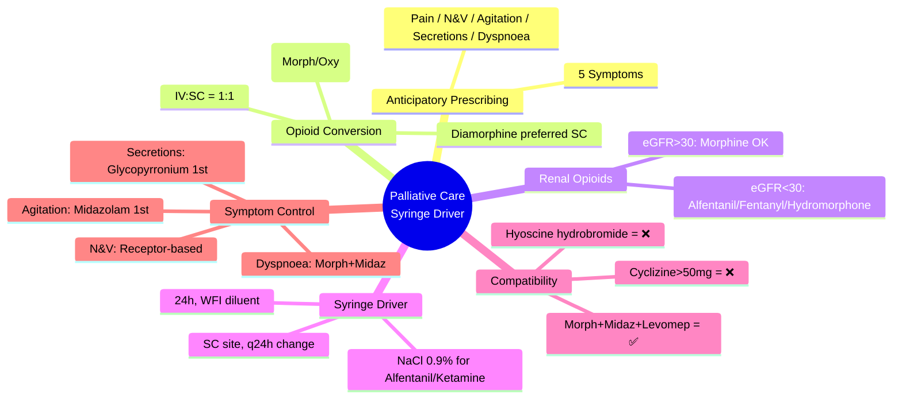

**Parent Topic:** [Clinical Therapeutics Overview](../../Clinical%20Therapeutics%20and%20Good%20Prescribing%20MOC.md)
**Status:** `full-fcps-mrcp-note`
**Priority:** ⭐⭐⭐ HIGHEST (FCPS/MRCP — symptom control, syringe driver compatibility, opioid conversion, anticipatory prescribing)
**Source:** Davidson 24th Ed Ch 2; Palliative Care Formulary; NICE NG31; BNF; GSF; Syringe Driver Compatibility Charts (Dickman)

---

## 1. 1. 🎯 Learning Objectives
- [ ] Apply **anticipatory prescribing** for last days of life (5 key symptoms)
- [ ] Calculate **SC opioid conversions** from oral/IV
- [ ] Select **syringe driver drugs** and check **compatibility**
- [ ] Manage **common palliative symptoms**: Pain, N&V, Agitation, Secretions, Dyspnoea
- [ ] Understand **syringe driver setup**: Diluent, rate, duration, monitoring
- [ ] Apply **renal/hepatic adjustments** in palliative care
- [ ] Answer viva: "Syringe driver contents for dying patient" and "Opioid conversion SC vs PO"

---

## 2. 2. 🧠 Core Concept: Anticipatory Prescribing (Last Days of Life)

### 1. 5 Key Symptoms → 5 Drug Classes (GSF/NHS Standard)

| Symptom | First-Line Drug | Route | Syringe Driver (24h) |
|---------|-----------------|-------|----------------------|
| **Pain** | Morphine / Oxycodone / Hydromorphone | SC | Yes |
| **Nausea / Vomiting** | Levomepromazine / Haloperidol / Cyclizine / Ondansetron | SC | Yes |
| **Agitation / Delirium** | Midazolam / Levomepromazine / Haloperidol | SC | Yes |
| **Respiratory Secretions** | Glycopyrronium / Hyoscine butylbromide / Hyoscine hydrobromide | SC | Yes |
| **Dyspnoea** | Morphine + Midazolam | SC | Yes |

> **Principle:** *Prescribe **PRN SC** for all 5 symptoms **in advance**. If ≥2 doses needed/24h → **start syringe driver** with regular dose + PRN breakthrough.*

---

## 3. 3. ️⃣ Opioid Conversion — Oral / IV → Subcutaneous

### 1. Conversion Ratios (Approximate)

| Drug | PO : SC | IV : SC | Notes |
|------|---------|---------|-------|
| **Morphine** | **2 : 1** (10mg PO = 5mg SC) | **1 : 1** (5mg IV = 5mg SC) | Standard |
| **Oxycodone** | **2 : 1** (10mg PO = 5mg SC) | **1 : 1** (5mg IV = 5mg SC) | More lipophilic |
| **Hydromorphone** | **5 : 1** (10mg PO = 2mg SC) | **2 : 1** (2mg IV = 1mg SC) | High potency |
| **Alfentanil** | — | **1 : 1** (SC = IV) | Short-acting; syringe driver favourite |
| **Fentanyl** | — | **1 : 1** (SC = IV) | TD patch preferred; SC for driver |
| **Diamorphine** | — | **1 : 1** (SC = IV) | **UK preferred** (more soluble than morphine) |
| **Buprenorphine** | — | Complex | TD patch; SC rarely used |

### 2. Calculation Algorithm
```
Step 1: Calculate total 24h oral opioid dose (OME)
Step 2: Convert to SC equivalent using ratio
Step 3: Divide by 24 = hourly syringe driver rate
Step 4: Prescribe breakthrough = 1/6 to 1/10 of 24h SC dose (SC PRN Q1-2H)
Step 5: If opioid-naïve → start low (morphine 5-10mg/24h SC)
```

### 3. Example Conversions
| Current Regimen | 24h OME | SC Morphine Equiv | Syringe Driver (24h) | Breakthrough SC |
|-----------------|---------|-------------------|----------------------|-----------------|
| Morphine PO 60mg BD (120mg) | 120mg | **60mg** | Morphine 60mg/24h | Morphine 5-10mg SC PRN |
| Oxycodone PO 20mg BD (40mg) | 60mg | **30mg** | Morphine 30mg/24h | Morphine 3-5mg SC PRN |
| Fentanyl TD 50mcg/h | ~120mg | **60mg** | Morphine 60mg/24h | Morphine 5-10mg SC PRN |

> **Key:** *Diamorphine **more soluble** (200mg/mL) vs Morphine (30-50mg/mL) → **smaller volumes** for high doses.*

---

## 4. 4. ️⃣ Syringe Driver Setup

### 1. Standard Parameters
| Parameter | Standard |
|-----------|----------|
| **Duration** | **24 hours** (some 12h for unstable) |
| **Diluent** | **Water for Injection (WFI)** — standard for most |
| **Alternative diluents** | NaCl 0.9% (Alfentanil, Ketamine, Octreotide) |
| **Line** | Standard giving set (change q24h) |
| **Site** | SC (abdomen, thigh, upper arm) — rotate q3-5 days |
| **Rate** | mL/hr = Total volume / 24 |

### 2. Syringe Sizes & Concentrations
| Syringe | Max Volume | Typical Drug Concentrations |
|---------|------------|-----------------------------|
| **20mL** | 18-19mL | Morphine 30mg/20mL (1.5mg/mL), Diamorphine 100mg/20mL (5mg/mL) |
| **30mL** | 28-29mL | Higher doses |
| **50mL** | 48-49mL | Very high doses (diamorphine 200-300mg) |

---

## 5. 5. ️⃣ Drug Compatibility — Syringe Driver (Dickman / PCF)

### 1. ✅ COMPATIBLE Combinations (Common Palliative Mixes)

| Mix | Drugs | Diluent | Notes |
|-----|-------|---------|-------|
| **Standard Analgesic/Sedative** | Morphine/Diamorphine + Midazolam (+/- Levomepromazine/Haloperidol) | WFI | **Most common** |
| **Analgesic + Antiemetic** | Morphine + Cyclizine | WFI | Cyclizine precipitates >50mg/24h — use Levomepromazine if >50mg |
| **Analgesic + Antisecretory** | Morphine + Glycopyrronium / Hyoscine butylbromide | WFI | |
| **Triple Mix** | Morphine + Midazolam + Levomepromazine | WFI | Common for agitation + N&V |
| **Alfentanil-based** | Alfentanil + Midazolam (+/- Ketamine) | **NaCl 0.9%** | Alfentanil unstable in WFI |

### 2. ❌ INCOMPATIBLE / PRECIPITATION RISK

| Drug Pair | Issue | Alternative |
|-----------|-------|-------------|
| **Cyclizine + Opioid** | Precipitation >50mg cyclizine/24h | **Levomepromazine** (compatible) |
| **Cyclizine + Midazolam** | Precipitation | Avoid |
| **Hyoscine hydrobromide + Opioid** | Precipitation risk | **Hyoscine butylbromide** or **Glycopyrronium** |
| **Ketamine + Opioid (WFI)** | Precipitation | Use **NaCl 0.9%** or separate line |
| **Octreotide + Opioid (WFI)** | Precipitation | Use **NaCl 0.9%** or separate line |
| **Dexamethasone + Opioid** | Precipitation | Avoid in driver (give PO/SC separate) |

### 3. 🔄 SEPARATE LINE REQUIRED
| Drug | Reason |
|------|--------|
| **Ketamine** | Incompatible in WFI; use NaCl 0.9% separate line |
| **Octreotide** | Incompatible in WFI; use NaCl 0.9% separate line |
| **Furosemide** | Incompatible; separate |
| **Metoclopamide** | Incompatible with many; usually PO/SC separate |

> **Rule:** *If unsure → **check compatibility chart (Dickman/PCF)**. **WFI = standard diluent**. **NaCl 0.9% for Alfentanil/Ketamine/Octreotide**. **Separate line if incompatible**.*

---

## 6. 6. ️⃣ Symptom-Specific Management

### 1. Pain — Opioid Choice by Renal Function
| eGFR | Preferred SC Opioid | Avoid |
|------|---------------------|-------|
| **>30** | Morphine / Diamorphine / Oxycodone | — |
| **15–30** | **Oxycodone / Hydromorphone / Alfentanil / Fentanyl / Buprenorphine** | Morphine/Diamorphine (M6G accumulation) |
| **<15 / Dialysis** | **Alfentanil / Fentanyl / Buprenorphine / Hydromorphone** | Morphine, Diamorphine, Oxycodone (caution) |

### 2. Nausea & Vomiting — Receptor-Based Choice
| Cause | Receptor | First-Line SC | Alternative |
|-------|----------|---------------|-------------|
| **Chemical (opioids, toxins, uraemia)** | **D₂ (CTZ)** | **Haloperidol 0.5-1.5mg/24h** | **Levomepromazine 6.25-25mg/24h** |
| **Vestibular / Motion** | **H₁ / Muscarinic** | **Cyclizine 50-150mg/24h** (if <50mg) | **Levomepromazine** |
| **Raised ICP / Meningeal** | **5-HT₃ / D₂** | **Ondansetron 8mg/24h** | Dexamethasone (PO/SC separate) |
| **Gastric stasis** | **D₂ (gut)** | **Metoclopramide 10-30mg/24h** (separate line) | Domperidone (PO) |
| **Multifactorial / Refractory** | Broad | **Levomepromazine 6.25-25mg/24h** | **Broad spectrum** (D₂, 5-HT, H₁, Muscarinic) |

> **Levomepromazine** = **broad-spectrum antiemetic + sedative** → useful for N&V + agitation combined.

### 3. Agitation / Delirium / Terminal Restlessness
| Drug | Dose (24h SC) | Notes |
|------|---------------|-------|
| **Midazolam** | **10-60mg** (start 10-20mg) | **First-line**; anxiolytic, sedative, anticonvulsant |
| **Levomepromazine** | **6.25-25mg** | Antipsychotic + antiemetic + sedative |
| **Haloperidol** | **1-10mg** | Antipsychotic; less sedating; **QTc caution** |
| **Clonazepam** | 0.5-2mg (separate) | Myoclonus, seizure prophylaxis |

### 4. Respiratory Secretions (Death Rattle)
| Drug | Dose (24h SC) | Notes |
|------|---------------|-------|
| **Glycopyrronium** | **0.6-2.4mg** | **First-line**; **does not cross BBB** (less CNS SE) |
| **Hyoscine butylbromide** | **40-120mg** | Peripheral antimuscarinic; less CNS SE |
| **Hyoscine hydrobromide** | **0.4-2.4mg** | Crosses BBB → sedation, confusion; **less preferred** |
| **Atropine eye drops (SL)** | 1-2 drops SL Q4H | Alternative if no SC access |

### 5. Dyspnoea
| Drug | Approach |
|------|----------|
| **Morphine** | Low-dose (2.5-5mg SC PRN) → reduces respiratory drive/anxiety |
| **Midazolam** | Add if anxiety/panic component (2.5-5mg SC PRN) |
| **Oxygen** | Only if hypoxic (not routine for dyspnoea) |
| **Fan / Positioning** | Non-pharmacologicalfirst |

---

## 7. 7. ️⃣ Renal & Hepatic Adjustments in Palliative Care

### 1. Opioids (SC)
| Drug | eGFR >30 | eGFR 15–30 | eGFR <15 | Hepatic Impairment |
|------|----------|------------|----------|-------------------|
| **Morphine** | ✅ | ❌ Avoid | ❌ Avoid | Reduce dose |
| **Diamorphine** | ✅ | ❌ Avoid | ❌ Avoid | Reduce dose |
| **Oxycodone** | ✅ | ⚠️ 50% dose | ❌ Avoid | Reduce dose |
| **Hydromorphone** | ✅ | ✅ Preferred | ✅ Preferred | Reduce dose |
| **Alfentanil** | ✅ | ✅ Preferred | ✅ Preferred | Reduce dose |
| **Fentanyl** | ✅ | ✅ Preferred | ✅ Preferred | Minimal change |
| **Buprenorphine** | ✅ | ✅ Preferred | ✅ Preferred | Minimal change |

### 2. Antiemetics / Sedatives
| Drug | Renal Adjustment | Hepatic Adjustment |
|------|------------------|-------------------|
| **Midazolam** | No change (↑ sensitivity) | Reduce dose 50% |
| **Levomepromazine** | Reduce dose (↑ SE) | Reduce dose |
| **Haloperidol** | No change | No change |
| **Cyclizine** | Reduce dose | Reduce dose |
| **Glycopyrronium** | No change | No change |
| **Hyoscine butylbromide** | No change | No change |

---

## 8. 8. ️⃣ Anticipatory Prescribing Chart (Standard UK)

| Symptom | Drug | SC PRN Dose | Frequency | Syringe Driver (24h) |
|---------|------|-------------|-----------|----------------------|
| **Pain** | Morphine / Oxycodone / Hydromorphone | 1/6-1/10 24h dose | Q1-2H | Yes (if ≥2 PRN/24h) |
| **N&V** | Levomepromazine / Haloperidol / Cyclizine | Per protocol | Q4-6H | Yes |
| **Agitation** | Midazolam / Levomepromazine / Haloperidol | 2.5-5mg / 6.25-12.5mg / 0.5-1.5mg | Q1-2H | Yes |
| **Secretions** | Glycopyrronium / Hyoscine butylbromide | 0.2-0.4mg / 20mg | Q4-6H | Yes |
| **Dyspnoea** | Morphine + Midazolam | 2.5-5mg + 2.5-5mg | Q1-2H | Yes |

---

## 9. 9. ️⃣ Common Syringe Driver Recipes (24h, WFI)

| Clinical Scenario | Syringe Driver Contents (24h) |
|-------------------|------------------------------|
| **Standard (Pain + Agitation)** | Morphine 30mg + Midazolam 20mg |
| **Pain + N&V + Agitation** | Morphine 30mg + Midazolam 20mg + Levomepromazine 12.5mg |
| **Renal Failure (eGFR<30)** | Alfentanil 2mg + Midazolam 20mg (in **NaCl 0.9%**) |
| **High Dose Opioid** | Diamorphine 150mg + Midazolam 30mg |
| **Severe Agitation** | Midazolam 40mg + Levomepromazine 25mg |
| **Secretions + Agitation** | Glycopyrronium 1.2mg + Midazolam 20mg |

> **Volume check:** Ensure total volume ≤ syringe capacity (e.g., 20mL syringe = max 18-19mL). **Concentration limits**: Morphine ≤30mg/mL, Diamorphine ≤100mg/mL, Midazolam ≤5mg/mL.

---

## 10. 10. ️⃣ Practical Algorithm

```mermaid
flowchart TD
    A[Patient Approaching Last Days of Life] --> B[Prescribe Anticipatory PRN SC for 5 Symptoms]
    B --> B1[Pain: Morphine 2.5-5mg SC Q1-2H PRN]
    B --> B2[N&V: Levomepromazine 6.25mg SC Q4-6H PRN]
    B --> B3[Agitation: Midazolam 2.5-5mg SC Q1-2H PRN]
    B --> B4[Secretions: Glycopyrronium 0.2mg SC Q4-6H PRN]
    B --> B5[Dyspnoea: Morphine 2.5mg + Midazolam 2.5mg SC Q1-2H PRN]
    B1 & B2 & B3 & B4 & B5 --> C{≥2 PRN doses / 24h for any symptom?}
    C -->|Yes| D[Start Syringe Driver
Regular 24h dose = PRN usage × 3-4
Keep PRN breakthrough = 1/6-1/10 24h dose]
    C -->|No| E[Continue PRN; Review 4-12h]
    D --> F[Check Compatibility (Dickman)
WFI diluent (NaCl 0.9% for Alfentanil/Ketamine)
Volume ≤ syringe capacity]
    F --> G[Site SC; Rate mL/hr; Change q24h;
Monitor: Pain, Sedation, RR, Site]
```

---

## 11. 11. ⚡ FCPS/MRCP High-Yield Summary

| Topic | Key Points |
|-------|------------|
| **Anticipatory Prescribing** | **5 symptoms, 5 drug classes**: Pain (opioid), N&V (levomepromazine/haloperidol), Agitation (midazolam), Secretions (glycopyrronium), Dyspnoea (morphine+midazolam) |
| **Opioid Conversion PO:SC** | **Morphine/Oxycodone 2:1** (10mg PO = 5mg SC); **Hydromorphone 5:1**; IV:SC = 1:1 |
| **Diamorphine** | **UK preferred SC opioid**; more soluble (200mg/mL) → smaller volumes |
| **Renal Failure Opioids** | eGFR<30: **Avoid morphine/diamorphine**; Use **alfentanil, fentanyl, hydromorphone, buprenorphine** |
| **Syringe Driver** | **24h, WFI diluent** (NaCl 0.9% for alfentanil/ketamine/octreotide), SC site, q24h change |
| **Compatibility** | **Morphine + Midazolam + Levomepromazine = ✅**; **Cyclizine >50mg = ❌** (use levomepromazine); **Hyoscine hydrobromide = ❌** (use butylbromide/glycopyrronium) |
| **N&V Receptor-Based** | Chemical → Haloperidol/Levomepromazine (D₂); Vestibular → Cyclizine (H₁); Raised ICP → Ondansetron (5-HT₃) |
| **Agitation** | **Midazolam first-line** (10-60mg/24h); Levomepromazine alternative |
| **Secretions** | **Glycopyrronium first-line** (0.6-2.4mg/24h); no BBB cross |
| **Breakthrough** | **1/6-1/10 of 24h dose** SC Q1-2H PRN |

---

## 12. 12. 🎤 Viva Questions (Expected Answers)

| # | Question | Expected Answer |
|---|----------|-----------------|
| 1 | What are the 5 anticipatory medications for last days of life? | **Pain** (morphine), **N&V** (levomepromazine/haloperidol), **Agitation** (midazolam), **Secretions** (glycopyrronium), **Dyspnoea** (morphine+midazolam). |
| 2 | Oral morphine to SC morphine conversion? | **2:1** (10mg PO = 5mg SC). IV:SC = 1:1. |
| 3 | Patient on morphine PO 60mg BD, now dying, needs SC syringe driver. Dose? | 24h PO = 120mg → SC = **60mg/24h**. Breakthrough = 5-10mg SC Q1-2H PRN. |
| 4 | Renal failure (eGFR 20) — which opioid for syringe driver? | **Avoid morphine/diamorphine** (M6G). **Use alfentanil, fentanyl, hydromorphone, buprenorphine**. |
| 5 | Syringe driver diluent for morphine + midazolam? | **Water for Injection (WFI)**. |
| 6 | Cyclizine in syringe driver — maximum dose? | **50mg/24h** (precipitates above). If >50mg needed → **use levomepromazine**. |
| 7 | First-line antiemetic for opioid-induced nausea? | **Haloperidol 0.5-1.5mg/24h** or **Levomepromazine 6.25-25mg/24h** (D₂ antagonist at CTZ). |
| 8 | First-line for respiratory secretions? | **Glycopyrronium 0.6-2.4mg/24h SC** (peripheral, no BBB cross). Hyoscine butylbromide alternative. |
| 9 | Midazolam dose in syringe driver for terminal agitation? | **10-60mg/24h** (start 10-20mg, titrate). |
| 10 | Ketamine in syringe driver — diluent and compatibility? | **NaCl 0.9%** (not WFI); **incompatible with opioids in WFI** → separate line. |

---

## 13. 13. 🧩 Confusions & Mnemonics

| Confusion | Clarification |
|-----------|---------------|
| **"Morphine safe in all renal failure"** | **NO.** **eGFR<30: avoid morphine/diamorphine** (M6G accumulation → neurotoxicity). Use alfentanil/fentanyl/hydromorphone. |
| **"Cyclizine can be used at any dose in syringe driver"** | **NO.** **>50mg/24h precipitates**. Use levomepromazine for higher doses. |
| **"Hyoscine hydrobromide = first-line for secretions"** | **NO.** **Glycopyrronium preferred** (no BBB cross → less sedation/confusion). Hyoscine butylbromide alternative. |
| **"All drugs in WFI"** | **NO.** **Alfentanil, Ketamine, Octreotide → NaCl 0.9%**. Check Dickman chart. |
| **"Breakthrough dose = same as syringe driver hourly rate"** | **NO.** Breakthrough = **1/6 to 1/10 of 24h dose** (not hourly rate). |
| **"Ondansetron first-line for all N&V"** | **NO.** Receptor-based: **Chemical → Haloperidol/Levomepromazine**; **Vestibular → Cyclizine**; **Raised ICP → Ondansetron**. |
| **"Syringe driver = 48 hours"** | **Standard = 24 hours**. Some units use 12h for unstable patients. |
| **"Diamorphine = heroin = illegal"** | **NO.** **Diamorphine = pharmaceutical heroin**; **legal for medical use in UK**; preferred SC opioid (solubility). |

> **Mnemonic: PALLIATIVE SYRINGE**  
> **P**ain: **Morphine/Diamorphine** (PO:SC 2:1; renal<30 → Alfentanil/Fentanyl/Hydromorphone)  
> **A**gitation: **Midazolam** (10-60mg/24h) ± Levomepromazine  
> **L**ast days: **5 anticipatory PRN** (Pain, N&V, Agitation, Secretions, Dyspnoea)  
> **L**evomepromazine: **Broad antiemetic + sedative** (D₂, 5-HT, H₁, Muscarinic)  
> **I**njectable route: **SC preferred**; IV if line in situ; PO if able  
> **A**ntiemetics: **Receptor-based** (Chemical=Haloperidol; Vestibular=Cyclizine; ICP=Ondansetron)  
> **T**itration: **≥2 PRN/24h → Syringe driver** (24h, WFI, breakthrough 1/6-1/10)  
> **I**ncompatibility: **Cyclizine>50mg=❌; Hyoscine hydrobromide=❌; Alfentanil/Ketamine=NaCl 0.9%**  
> **V**olume: **20mL syringe ≤19mL**; Morphine ≤30mg/mL; Diamorphine ≤100mg/mL  
> **E**uvolaemia: **Hydration review** (SC fluids if benefit > burden)  
> **S**ecretions: **Glycopyrronium 1st line** (0.6-2.4mg/24h; no BBB cross)  
> **Y** (Why Diamorphine?) **Solubility 200mg/mL** vs Morphine 30mg/mL → smaller volumes  
> **R**enal: **eGFR<30 avoid Morphine/Diamorphine** → Alfentanil/Fentanyl/Hydromorphone/Buprenorphine  
> **I**mmediate release: **Breakthrough = 1/6-1/10 24h dose** SC Q1-2H PRN  
> **N**&V chemical: **Haloperidol/Leveromep (D₂)**; Vestibular: **Cyclizine (H₁)**; ICP: **Ondansetron (5-HT₃)**  
> **G**lycopyrronium: **Antisecretory 1st line** (peripheral, no sedation)  
> **E**nd of life: **Anticipatory prescribing = standard of care** (NICE NG31)

---

## 14. 14. 🗺️ Mind Map



---

## 15. 15. 📅 Spaced Repetition Tracker

| Review | Date | Score (0–5) | Notes |
|--------|------|-------------|-------|
| Day 1 | | | |
| Day 3 | | | |
| Day 7 | | | |
| Day 14 | | | |
| Day 30 | | | |
| Day 90 | | | |

---

## 16. 16. 📝 Self-Test Scorecard

| Section | Max | Score | % |
|---------|-----|-------|---|
| Anticipatory Prescribing | 3 | | |
| Opioid Conversion | 3 | | |
| Syringe Driver Setup | 3 | | |
| Compatibility | 3 | | |
| Symptom-Specific Management | 4 | | |
| Renal/Hepatic Adjustments | 2 | | |
| Practical Algorithm | 2 | | |
| **Total** | **20** | | |

---

## 17. 17. 💬 Exam Answer Modes

| Format | Prompt | Key Points |
|--------|--------|------------|
| **Long Essay** | "Describe the management of common symptoms in the last days of life using a syringe driver." | 5 anticipatory drugs, opioid conversion, syringe driver setup, compatibility, symptom-specific management, renal adjustments |
| **Short Note** | "Syringe driver drug compatibility." | WFI standard; Morph+Midaz+Levomep compatible; Cyclizine>50mg precipitates; Alfentanil/Ketamine need NaCl 0.9%; Hyoscine hydrobromide incompatible |
| **Viva** | "Renal failure patient (eGFR 15) on morphine PO, now needs SC syringe driver. Opioid choice?" | **Avoid morphine** (M6G accumulation). **Use alfentanil** (short t½, hepatic clearance, NaCl 0.9% diluent) **or fentanyl/hydromorphone**. Convert dose. |
| **Ward Round** | "Patient on syringe driver: morphine 40mg + midazolam 20mg/24h. Family reports increased secretions. Add to driver?" | **Add Glycopyrronium 0.6-1.2mg/24h** (compatible with morphine+midazolam in WFI). Do NOT add hyoscine hydrobromide (incompatible). |
| **Last-Night** | "5 anticipatory: Pain(Morph), N&V(Levo), Agit(Midaz), Secret(Glyco), Dysp(Morph+Midaz). PO:SC 2:1. Renal<30:avoid Morph. Driver:24h,WFI,NaCl for Alfent. Compat:Morph+Midaz+Levo✅; Cycliz>50❌; Glyco 1st secret. Breakthrough 1/6-1/10." | 5 drugs. Conversion. Renal. Driver setup. Compatibility. Symptom-specific. Breakthrough. |

---

## 18. 18. 📌 Summary
- **Anticipatory Prescribing**: 5 symptoms → Pain (morphine), N&V (levomepromazine/haloperidol), Agitation (midazolam), Secretions (glycopyrronium), Dyspnoea (morphine+midazolam)
- **Opioid Conversion**: PO:SC = **2:1** (morphine, oxycodone); IV:SC = **1:1**; **Diamorphine preferred** (solubility)
- **Renal Failure**: eGFR<30 → **avoid morphine/diamorphine**; use **alfentanil, fentanyl, hydromorphone, buprenorphine**
- **Syringe Driver**: **24h, WFI diluent** (NaCl 0.9% for alfentanil/ketamine/octreotide); SC site; change q24h
- **Compatibility**: **Morphine + Midazolam + Levomepromazine = ✅**; **Cyclizine >50mg = ❌**; **Hyoscine hydrobromide = ❌** (use butylbromide/glycopyrronium); **Alfentanil/Ketamine = NaCl 0.9% separate if needed**
- **N&V**: Receptor-based — Chemical (opioids) → Haloperidol/Levomepromazine (D₂); Vestibular → Cyclizine (H₁); Raised ICP → Ondansetron (5-HT₃)
- **Agitation**: **Midazolam first-line** (10-60mg/24h)
- **Secretions**: **Glycopyrronium first-line** (0.6-2.4mg/24h; no BBB cross)
- **Breakthrough**: **1/6-1/10 of 24h dose** SC Q1-2H PRN

---

## 19. 19. ❓ MCQs (10)

1. **Oral morphine to SC morphine conversion ratio:**  
   A. 1:1  B. **2:1**  C. 1:2  D. 5:1  
   *Answer: B. 10mg PO = 5mg SC (2:1).*

2. **Preferred SC opioid in UK palliative care:**  
   A. Morphine  B. **Diamorphine**  C. Oxycodone  D. Hydromorphone  
   *Answer: B. Diamorphine — higher solubility (200mg/mL) → smaller volumes.*

3. **Maximum cyclizine dose in 24h syringe driver (WFI):**  
   A. 25mg  B. **50mg**  C. 100mg  D. 150mg  
   *Answer: B. >50mg/24h precipitates in WFI. Use levomepromazine if higher dose needed.*

4. **First-line antisecretory for death rattle:**  
   A. Hyoscine hydrobromide  B. **Glycopyrronium**  C. Atropine  D. Hyoscine butylbromide  
   *Answer: B. Glycopyrronium — peripheral, no BBB cross → less sedation/confusion.*

5. **Syringe driver diluent for alfentanil:**  
   A. Water for Injection  B. **Sodium Chloride 0.9%**  C. Glucose 5%  D. Hartmann's  
   *Answer: B. Alfentanil unstable in WFI → use NaCl 0.9%.*

6. **Opioid AVOIDED in eGFR <30:**  
   A. Alfentanil  B. **Morphine**  C. Fentanyl  D. Hydromorphone  
   *Answer: B. Morphine → M6G accumulation → neurotoxicity. Diamorphine also avoided.*

7. **First-line for terminal agitation in syringe driver:**  
   A. Haloperidol  B. **Midazolam**  C. Levomepromazine  D. Clonazepam  
   *Answer: B. Midazolam 10-60mg/24h SC — anxiolytic, sedative, anticonvulsant.*

8. **Breakthrough dose for patient on morphine 60mg/24h SC syringe driver:**  
   A. 2mg  B. **5-10mg**  C. 20mg  D. 30mg  
   *Answer: B. 1/6-1/10 of 24h dose = 6-10mg (use 5-10mg SC Q1-2H PRN).*

9. **Cyclizine incompatible with which antiemetic in syringe driver?**  
   A. Levomepromazine  B. **Midazolam**  C. Haloperidol  D. Ondansetron  
   *Answer: B. Cyclizine + Midazolam → precipitation. Also cyclizine >50mg alone precipitates.*

10. **Patient on fentanyl TD 75mcg/h needs SC syringe driver for breakthrough. 24h OME ≈ ?**  
    A. 90mg  B. **135mg**  C. 180mg  D. 225mg  
    *Answer: B. Fentanyl 25mcg/h ≈ Morphine 60mg/24h PO. 75mcg/h = 3 × 60 = 180mg OME. SC morphine = 90mg/24h.*

---

## 20. 20. 📋 SBAs (10)

1. **75M, metastatic lung cancer, eGFR 18, on morphine PO 30mg BD. Now unable to swallow. SC opioid choice?**  
   A. Morphine 15mg/24h SC  B. **Alfentanil 1-2mg/24h SC (NaCl 0.9%)**  C. Diamorphine 15mg/24h SC  D. Oxycodone 10mg/24h SC  
   *Answer: B. eGFR<30 → avoid morphine/diamorphine. Alfentanil preferred (hepatic clearance, short t½).*

2. **Syringe driver: morphine 40mg + midazolam 20mg/24h (WFI). Add antiemetic for chemical N&V.**  
   A. Cyclizine 100mg  B. **Levomepromazine 12.5mg**  C. Ondansetron 8mg  D. Metoclopramide 20mg  
   *Answer: B. Levomepromazine compatible with morphine+midazolam. Cyclizine >50mg precipitates. Ondansetron/metoclopramide incompatible.*

3. **Patient on syringe driver develops respiratory secretions. Current driver: diamorphine 80mg + midazolam 30mg/24h. Add?**  
   A. Hyoscine hydrobromide 1.2mg  B. **Glycopyrronium 1.2mg**  C. Hyoscine butylbromide 60mg  D. Atropine 1mg  
   *Answer: B. Glycopyrronium compatible, no BBB cross. Hyoscine hydrobromide incompatible in WFI.*

4. **Anticipatory prescribing — PRN SC dose for agitation (midazolam):**  
   A. 0.5mg  B. **2.5-5mg**  C. 10mg  D. 20mg  
   *Answer: B. Midazolam 2.5-5mg SC Q1-2H PRN. Driver dose 10-60mg/24h.*

5. **Renal failure patient on alfentanil syringe driver (NaCl 0.9%). Ketamine added for neuropathic pain. Compatibility?**  
   A. Compatible in same syringe  B. **Incompatible — separate line with NaCl 0.9%**  C. Compatible in WFI  D. Not used in palliative care  
   *Answer: B. Ketamine incompatible with opioids in WFI; requires NaCl 0.9% separate line.*

---

## 21. 21. 🔑 Answer Keys
| MCQs | SBAs |
|------|------|
| 1-B, 2-B, 3-B, 4-B, 5-B, 6-B, 7-B, 8-B, 9-B, 10-B | 1-B, 2-B, 3-B, 4-B, 5-B |

---

## 22. 22. 🔗 Cross-Links
- [[Clinical Context/Pain Management]] — Opioid conversions, renal prescribing, breakthrough dosing
- [[Special Populations/Renal Prescribing]] — Opioid choice in CKD/ESRD
- [[Medication Safety and Errors/PINCH High-Risk Drugs]] — Opioids (N in PINCH), midazolam (sedation risk)
- [[Drug Interactions/Pharmacokinetic interactions/Metabolism interactions]] — CYP3A4 interactions (midazolam, alfentanil)
- [[Clinical Context/Perioperative Prescribing]] — Peri-operative palliative care, opioid management
- [[Therapeutic Drug Monitoring]] — Not routine but TDM principles apply
- [[Polypharmacy and Deprescribing/Assessment Tools]] — Deprescribing in palliative care
