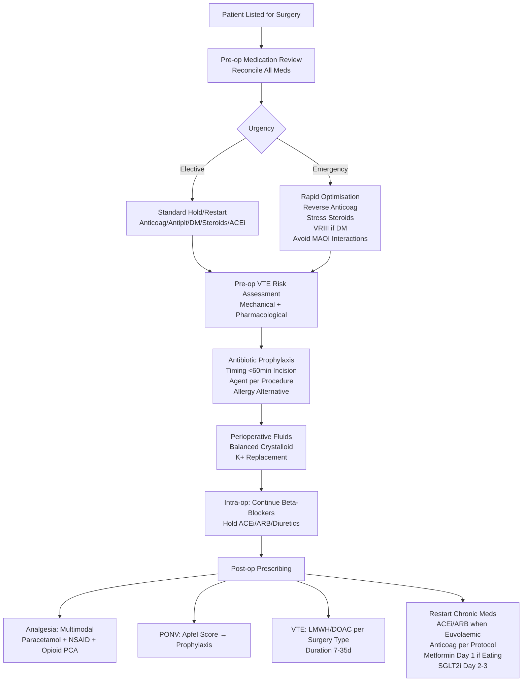
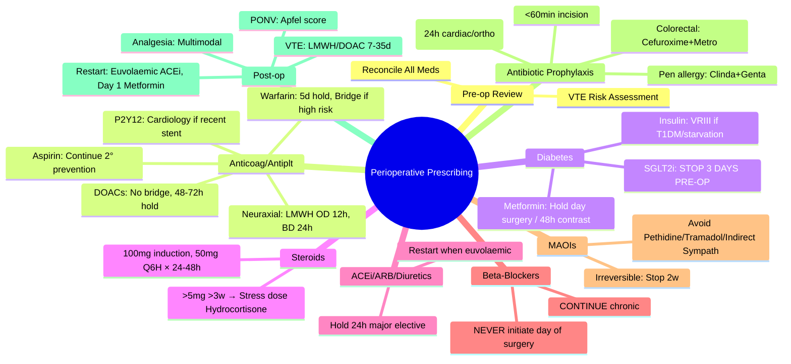

**Parent Topic:** [Clinical Therapeutics Overview](../../Clinical%20Therapeutics%20and%20Good%20Prescribing%20MOC.md)
**Status:** `full-fcps-mrcp-note`
**Priority:** ⭐⭐⭐ HIGHEST (FCPS/MRCP — preoperative assessment, drug hold/restart, VTE prophylaxis, antibiotic prophylaxis, emergency surgery)
**Source:** Davidson 24th Ed Ch 2; NICE NG45/NG180; BNF; AAGBI Guidelines; NHSE/BSA; SIGN; Perioperative Medicine literature

---

## 1. 1. 🎯 Learning Objectives
- [ ] Perform **preoperative medication review** (hold, continue, adjust)
- [ ] Apply **VTE prophylaxis** guidelines (risk assessment, drug choice, timing, duration)
- [ ] Select **surgical antibiotic prophylaxis** (timing, agent, redosing, allergy)
- [ ] Manage **specific drug classes** perioperatively: Anticoagulants, Antiplatelets, Steroids, Diabetes meds, ACEi/ARB, Beta-blockers, MAOIs
- [ ] Handle **emergency surgery** medication optimisation
- [ ] Address **postoperative** prescribing: Analgesia, N&V, Fluids, VTE, Antibiotics
- [ ] Answer viva: "Metformin perioperative management" and "DOAC hold for surgery"

---

## 2. 2. 🧠 Core Concept: Preoperative Medication Review

### 1. Stop / Hold / Continue Framework

```mermaid
flowchart TD
    A[Patient on Chronic Medication] --> B{Drug Class}
    B -->|Anticoagulants/ Antiplatelets| C[Assess Bleeding vs Thrombosis Risk
Procedure-specific
Hold/Restart per Protocol]
    B -->|Diabetes Meds| D[Type of Surgery / Starvation
Metformin / SGLT2i / Insulin
Variable Rate Infusion]
    B -->|Steroids| E[Chronic >3w or High Dose
Stress Dose Hydrocortisone]
    B -->|ACEi/ARB / Diuretics| F[Elective Major Surgery
Hold 24h Pre-op
Restart Post-op when Euvolaemic]
    B -->|Beta-blockers| G[Continue (unless bradycardia/hypotension)
Avoid Initiation Day of Surgery]
    B -->|MAOIs| H[Elective: Stop 2w (irreversible)
Emergency: Avoid Pethidine/Indirect Sympathomimetics]
    B -->|Herbals/Supplements| I[Stop 2w (Garlic, Ginkgo, Ginseng, St John's Wort)
Bleeding/Interaction Risk]
```

---

## 3. 3. ️⃣ Anticoagulant & Antiplatelet Management

### 1. VTE Risk Assessment (All Surgical Patients) — NICE NG180
| Tool | Score → Risk | Prophylaxis |
|------|--------------|-------------|
| **VTE Risk Assessment** (Admission) | **Medical**: Any risk factor → Prophylaxis | **LMWH / UFH / Fondaparinux** |
| **Surgical** (Procedure-specific) | **High VTE risk** (ortho, pelvic, major cancer, >90min) → **Mechanical + Pharmacological** | **LMWH standard**; Fondaparinux (ortho) |

### 2. Elective Surgery — Hold/Restart Protocols

| Drug | Hold Pre-op | Restart Post-op | Bridging |
|------|-------------|-----------------|----------|
| **Warfarin** | **5 days** (INR <1.5) | **24h** post-op (if haemostasis) | **Therapeutic LMWH** if high thrombotic risk (Mechanical valve, AF+CHA₂DS₂-VASc≥4, VTE<3m) — **Stop LMWH 24h pre-op** |
| **Apixaban / Rivaroxaban** | **48h** (CrCl>30); **72h** (CrCl<30) | **24-48h** (low bleed); **48-72h** (high bleed) | **No routine bridging** |
| **Dabigatran** | **48h** (CrCl>50); **72-96h** (CrCl<50) | **24-48h** (low bleed); **48-72h** (high bleed) | No bridging |
| **Edoxaban** | **48h** (CrCl>30); **72h** (CrCl<30) | Same as apixaban/rivaroxaban | No bridging |
| **LMWH (Prophylactic)** | **12h** (once daily) | **6-12h** post-op | — |
| **LMWH (Therapeutic)** | **24h** (twice daily) | **24h** post-op | — |
| **Aspirin (Secondary Prevention)** | **Continue** (most surgery) | — | — |
| **Aspirin (Primary Prevention)** | **7-10 days** | Post-op | — |
| **Clopidogrel / Ticagrelor / Prasugrel** | **5-7 days** (7d clopidogrel, 5d ticagrelor/prasugrel) | **24h** post-op | **Avoid stopping if recent stent (<6m BMS, <12m DES)** — cardiology discussion |

> **Key:** *DOACs — **no bridging**, hold by renal function. Warfarin — **bridge if high thrombotic risk**. Antiplatelets — **continue aspirin for secondary prevention**; **P2Y12 inhibitors: cardiology input if recent stent**.*

### 3. Neuraxial Block / Spinal Anaesthesia — Timing (AAGBI)

| Anticoagulant | Stop Pre-op | Restart Post-op |
|---------------|-------------|-----------------|
| **LMWH Prophylactic (OD)** | **12h** | **4h** (if no bloody tap) |
| **LMWH Therapeutic (BD)** | **24h** | **24h** |
| **Warfarin** | **INR <1.5** (5 days) | **24h** (if INR therapeutic) |
| **Apixaban / Rivaroxaban / Edoxaban** | **48h** (CrCl>30); **72h** (CrCl<30) | **24h** (if haemostasis) |
| **Dabigatran** | **72h** (CrCl>50); **96h** (CrCl<50) | **24h** |
| **Fondaparinux** | **36-42h** | **24h** |
| **Aspirin / Clopidogrel** | **No need to stop** (relative safety) | — |

---

## 4. 4. ️⃣ Diabetes Medications — Perioperative Management

### 1. Metformin
| Scenario | Action |
|----------|--------|
| **Elective Surgery (General Anaesthesia)** | **Hold on day of surgery** (omit morning dose) |
| **Contrast / Renal Impairment Risk** | **Hold 48h pre & post** if eGFR<60 or IV contrast |
| **Lactic Acidosis Risk** | Avoid if: AKI, sepsis, hypoxia, contrast, major hepatic resection |
| **Restart** | **Post-op Day 1** if eating/drinking, renal function stable |

### 2. SGLT2 Inhibitors (Empagliflozin, Dapagliflozin, Canagliflozin)
| Scenario | Action |
|----------|--------|
| **ALL Surgery** | **Stop 3 days pre-op** (risk of **euglycaemic DKA** with starvation/stress) |
| **Emergency Surgery** | **Stop immediately**; check ketones; treat if DKA |
| **Restart** | **Post-op Day 2-3** when eating normally, no ketosis |

### 3. Insulin — Variable Rate IV Insulin Infusion (VRIII)
| Indication | Protocol |
|------------|----------|
| **Type 1 DM** | **Always VRIII** for starvation >1 meal |
| **Type 2 DM on Insulin** | VRIII if: starvation >1 meal, major surgery, poor control |
| **Type 2 DM on Oral Only** | VRIII if: HbA1c>69mmol/mol, major surgery, starvation >2 meals |

#### VRIII Standard Protocol (NHS/Diabetes UK)
```
Potassium Chloride 20mmol in 500mL NaCl 0.9% + Glucose 5% or 10%
+ Insulin (Actrapid/Humulin S) 50 units in 50mL NaCl 0.9%
→ Insulin rate guided by BG (target 6-10 mmol/L)
→ K+ replacement guided by serum K+
→ Hourly BG monitoring
→ Continue basal insulin (glargine/detemir) at 80% dose SC
```

### 4. Sulfonylureas / DPP-4 Inhibitors / GLP-1 Agonists
| Drug Class | Action |
|------------|--------|
| **Sulfonylureas** (Gliclazide, Glimepiride) | **Omit day of surgery** (hypoglycaemia risk with starvation) |
| **DPP-4 Inhibitors** (Sitagliptin, Linagliptin) | **Continue** (low hypoglycaemia risk) |
| **GLP-1 Agonists** (Liraglutide, Semaglutide) | **Omit day of surgery** (delayed gastric emptying → aspiration risk) |

---

## 5. 5. ️⃣ Steroid Cover — Surgical Stress Dose

### 1. Who Needs Stress Dose Hydrocortisone?
| Criteria | Action |
|----------|--------|
| **Current oral steroid** >5mg prednisolone/day for >3 weeks | **Stress dose** |
| **Recent steroid** (stopped <4 weeks) after >3 weeks | **Stress dose** |
| **High-dose inhaled steroid** (>1000mcg beclometasone/day) + major stress | Consider |
| **Known adrenal insufficiency** | **Stress dose** |

### 2. Stress Dose Regimen (Major Surgery / Trauma / Sepsis)
| Timing | Hydrocortisone IV |
|--------|-------------------|
| **Induction** | **100mg** IV bolus |
| **Intra-op** | **50mg** Q6H (or 200mg/24h infusion) |
| **Post-op 24h** | **50mg** Q6H |
| **Post-op 48h** | **25mg** Q6H |
| **Then** | Taper to usual oral dose over 2-3 days |

### 3. Minor Surgery / Local Anaesthesia
| Regimen | Hydrocortisone |
|---------|----------------|
| **Single dose** | **25-50mg** IV at induction |
| **If usual dose ≤5mg** | Usual oral dose sufficient |

> **Key:** *Dexamethasone 6.6mg ≈ Prednisolone 40mg ≈ Hydrocortisone 160mg. **Hydrocortisone preferred** (mineralocorticoid activity).*

---

## 6. 6. ️⃣ ACE Inhibitors / ARBs / Diuretics

### 1. Elective Major Surgery (General Anaesthesia)
| Drug | Pre-op | Post-op Restart |
|------|--------|-----------------|
| **ACEi / ARB** | **Hold 24h** (omit morning dose) | **When euvolaemic, normotensive, renal stable** (usually Day 1-2) |
| **Diuretics** (Loop/Thiazide) | **Hold 24h** | **When euvolaemic** |
| **Mineralocorticoid Antagonists** (Spironolactone/Eplerenone) | **Hold 24-48h** | **When K+ normal, renal stable** |

### 2. Rationale
- **ACEi/ARB + GA** → refractory hypotension (vasoplegia) due to loss of angiotensin II
- **Diuretics** → hypovolaemia, electrolyte disturbance
- **Post-op AKI risk** ↑ if restarted early in hypovolaemic state

### 3. Emergency Surgery
- **Continue if already taken**; manage hypotension intra-op with vasopressors

---

## 7. 7. ️⃣ Beta-Blockers

| Scenario | Action |
|----------|--------|
| **Chronic Beta-Blocker** | **CONTINUE** perioperatively (omission → rebound tachycardia/ischaemia) |
| **New Initiation** | **Do NOT start on day of surgery** (POISE trial: ↑ stroke, hypotension, bradycardia) |
| **Contraindicated** | Bradycardia (<50), Hypotension (SBP<100), Decompensated HF, High-degree AV block |
| **Cardiac Surgery** | Continue (cardiologist preference) |

---

## 8. 8. ️⃣ MAO Inhibitors (MAOIs)

| Type | Examples | Perioperative Management |
|------|----------|--------------------------|
| **Irreversible (Non-selective)** | Phenelzine, Tranylcypromine, Isocarboxazid | **Elective: Stop 2 WEEKS** before surgery
**Emergency: Avoid Pethidine, Tramadol, Indirect Sympathomimetics (Ephedrine, Metaraminol)**
**Safe**: Morphine, Fentanyl, Alfentanil, Propofol, Volatile agents, Vecuronium, Rocuronium |
| **Reversible (RIMA)** | Moclobemide | **Stop 24-48h**; less dietary restriction |

### 1. Drug Interactions with MAOIs — AVOID
| Drug | Interaction | Consequence |
|------|-------------|-------------|
| **Pethidine** | Serotonin syndrome | Hyperthermia, rigidity, rhabdomyolysis, death |
| **Tramadol** | Serotonin syndrome | As above |
| **Dextromethorphan** | Serotonin syndrome | As above |
| **SSRIs / SNRIs / TCAs** | Serotonin syndrome | As above |
| **Indirect Sympathomimetics** (Ephedrine, Metaraminol, Phenylephrine) | Hypertensive crisis | Uncontrolled HTN, stroke |
| **Vasopressin** | Hypertensive crisis | As above |

> **Safe Vasopressors with MAOIs**: **Noradrenaline, Adrenaline, Metaraminol (direct), Vasopressin (direct)** — NO, vasopressin also risky. **Noradrenaline/Adrenaline = safe direct acting**.

---

## 9. 9. ️⃣ Surgical Antibiotic Prophylaxis — NICE NG125

### 1. Principles
| Principle | Detail |
|-----------|--------|
| **Timing** | **IV within 60 min before incision** (Fluoroquinolones/Vancomycin/Teicoplanin: 120 min) |
| **Redosing** | **If surgery > half-life** (e.g., Cephalosporins q2-3h; Vancomycin q6h) OR **blood loss >1500mL** |
| **Duration** | **Single dose** (or 24h max for cardiac/orthopaedic implants) — **NO prolonged courses** |
| **Allergy** | Penicillin allergy → **Clindamycin** or **Vancomycin** (if MRSA risk) |

### 2. Common Procedures — First-Line Prophylaxis

| Surgery | Agent | Dose | Redosing |
|---------|-------|------|----------|
| **Clean (Breast, Thyroid, Hernia)** | **None** (unless implant/valve) | — | — |
| **Clean-Contaminated (Colorectal, Biliary, Appendicectomy, Gynae)** | **Cefuroxime 1.5g IV** + **Metronidazole 500mg IV** | Single | Cefuroxime q3h |
| **Contaminated / Dirty (Peritonitis, Trauma, Open Fracture)** | **Therapeutic Antibiotics** (not prophylaxis) | Per culture | Therapeutic course |
| **Cardiac / Vascular (Prosthetic)** | **Cefuroxime 1.5g IV** (or Flucloxacillin 2g + Gentamicin) | 24h post-op | Cefuroxime q3h |
| **Orthopaedic (Joint Replacement)** | **Cefuroxime 1.5g IV** (or Teicoplanin 400mg if MRSA+) | 24h | Cefuroxime q3h |
| **Neurosurgery / Spinal** | **Cefuroxime 1.5g IV** | Single | — |
| **Caesarean Section** | **Cefuroxime 1.5g IV** (after cord clamp) | Single | — |
| **Urological (Prostate, Bladder)** | **Gentamicin 120mg IV** + **Amoxicillin 1g IV** (or Cefuroxime) | Single | — |

### 3. Penicillin Allergy — Alternatives
| Allergy Type | Alternative |
|--------------|-------------|
| **Non-severe (Rash >10y ago)** | **Cefuroxime** (low cross-reactivity) |
| **Severe (Anaphylaxis, Angioedema, SJS)** | **Clindamycin 600mg IV** + **Gentamicin 120mg IV** (or **Vancomycin 1g IV** if MRSA risk) |
| **MRSA Carrier / High Prevalence** | Add **Vancomycin 1g IV** (or Teicoplanin 400mg) |

---

## 10. 10. ️⃣ Postoperative Prescribing — Common Issues

### 1. Analgesia — Multimodal
| Component | Drug | Dose | Notes |
|-----------|------|------|-------|
| **Paracetamol** | IV/PO 1g QDS | 4g/24h max | First-line |
| **NSAID** | Ibuprofen 400mg TDS PO / Parecoxib IV | Avoid if CKD, bleeding risk | COX-2 preferred if bleeding risk |
| **Opioid** | Morphine PCA / Oxycodone PRN | Per protocol | See [Pain Management](../Pain%20Management.md) |
| **Gabapentinoid** | Pregabalin 150mg PO pre-op + 75mg BD post-op | Reduce if CKD | Opioid-sparing |
| **Local Anaesthetic** | Wound infiltration / Block | Ropivacaine 0.2% | Reduces opioid need |

### 2. Postoperative Nausea & Vomiting (PONV) — Risk-Based
| Risk (Apfel Score) | Prophylaxis |
|--------------------|-------------|
| **0-1** (Low) | None routine |
| **2** (Moderate) | **Single agent**: Ondansetron 4mg IV / Dexamethasone 4-8mg IV |
| **3-4** (High) | **Combination**: Ondansetron 4mg + Dexamethasone 8mg (+/- Cyclizine) |

### 3. Fluid Prescribing — Post-op
| Principle | Action |
|-----------|--------|
| **Euvolaemia** | Balance input/output; avoid overload |
| **Maintenance** | 25-30 mL/kg/day NaCl 0.9% + Glucose 5% (or balanced crystalloid) |
| **Replacement** | Match losses (drains, NG, stoma) mL for mL with appropriate fluid |
| **KCl** | Add 20-40mmol/L if K+ normal; monitor U&Es 6-12h |

### 4. VTE Prophylaxis — Post-op (NICE NG180)
| Surgery Type | Pharmacological | Mechanical |
|--------------|-----------------|------------|
| **General / Abdominal / Thoracic** | LMWH (Enoxaparin 40mg OD) | TED stockings + IPC |
| **Orthopaedic (Hip/Knee Replacement)** | **Rivaroxaban 10mg OD** OR **Apixaban 2.5mg BD** OR **LMWH** | IPC |
| **Neurosurgery / Spinal** | **LMWH 12-24h post-op** (if haemostasis) | IPC (no stockings cranial) |
| **Duration** | **7-14 days** (abdominal/pelvic); **28-35 days** (hip/knee replacement); **7-10 days** (other major) | Until mobile |

---

## 11. 11. ️⃣ Emergency Surgery — Medication Optimisation

| Priority | Action |
|----------|--------|
| **1. Anticoagulants** | Reverse if possible (Vit K, PCC, Idarucizumab, Andexanet); hold DOACs |
| **2. Antiplatelets** | Aspirin continue; P2Y12 — discuss with cardiology (stent risk) |
| **3. Steroids** | Stress dose hydrocortisone 100mg IV if on chronic steroids |
| **4. Diabetes** | Stop SGLT2i; VRIII if Type 1 or starvation; hold metformin |
| **5. ACEi/ARB** | Continue (manage hypotension with vasopressors) |
| **6. MAOIs** | Avoid pethidine/tramadol/indirect sympathomimetics |
| **7. Antibiotic Prophylaxis** | Give ASAP (within 60 min incision) |

---

## 12. 12. 🔟 Practical Algorithm



---

## 13. 13. ⚡ FCPS/MRCP High-Yield Summary

| Topic | Key Points |
|-------|------------|
| **Warfarin** | Hold 5 days (INR<1.5); Bridge with therapeutic LMWH if high thrombotic risk (mechanical valve, recent VTE, AF high CHA₂DS₂-VASc); Stop LMWH 24h pre-op |
| **DOACs** | **No bridging**; Hold 48h (CrCl>30) / 72h (CrCl<30); Rivaroxaban/Apixaban/Edoxaban; Dabigatran 48h/72-96h |
| **Aspirin** | **Continue** for secondary prevention; Stop 7-10d for primary prevention |
| **P2Y12 Inhibitors** | Clopidogrel 7d, Ticagrelor/Prasugrel 5d; **Cardiology if recent stent** (<6m BMS, <12m DES) |
| **Neuraxial Block** | LMWH OD 12h, BD 24h; Warfarin INR<1.5; DOACs 48-72h |
| **Metformin** | Hold day of surgery; Hold 48h if contrast/eGFR<60; Restart Day 1 if eating, renal OK |
| **SGLT2 Inhibitors** | **STOP 3 DAYS PRE-OP** (euglycaemic DKA risk); Restart Day 2-3 eating normally |
| **Insulin** | VRIII for Type 1 / starvation >1 meal; Continue basal at 80% |
| **Steroids** | >5mg pred >3w → Stress dose: 100mg IV induction, 50mg Q6H × 24-48h |
| **ACEi/ARB** | Hold 24h pre-op (major elective); Restart when euvolaemic |
| **Beta-Blockers** | **CONTINUE**; Do NOT initiate day of surgery |
| **MAOIs** | Irreversible: Stop 2w; Avoid Pethidine, Tramadol, Indirect Sympathomimetics |
| **Antibiotic Prophylaxis** | <60min incision; Single dose (24h cardiac/ortho); Cefuroxime+Metro for colorectal; Clindamycin+Gentamicin if severe penicillin allergy |

---

## 14. 14. 🎤 Viva Questions (Expected Answers)

| # | Question | Expected Answer |
|---|----------|-----------------|
| 1 | Warfarin patient for elective hip replacement. CHA₂DS₂-VASc 4. Hold/Restart protocol? | **Hold 5 days** (INR<1.5). **Bridge with therapeutic LMWH** (high thrombotic risk). **Stop LMWH 24h pre-op**. Restart warfarin + LMWH 24h post-op when haemostasis. Continue LMWH until INR therapeutic. |
| 2 | Apixaban patient (CrCl 45) for elective colectomy. Hold/Restart? | **Hold 48h** (CrCl>30). **No bridging**. Restart **24-48h** post-op (low bleed risk colectomy → 24h; high bleed → 48h). |
| 3 | Patient on clopidogrel for coronary stent 3 months ago. Needs emergency laparotomy. Management? | **Cardiology discussion URGENT**. **Do NOT stop clopidogrel** if <6 months BMS / <12 months DES (stent thrombosis risk). If must stop → bridge with glycoprotein IIb/IIIa inhibitor or continue aspirin. |
| 4 | Metformin patient for elective surgery with IV contrast. Management? | **Hold metformin 48h pre-op and 48h post-op** (contrast + surgery AKI risk). Check renal function before restarting. |
| 5 | Patient on empagliflozin (SGLT2i) for elective surgery. Management? | **STOP 3 DAYS PRE-OP** (euglycaemic DKA risk with starvation). Check ketones pre-op. Restart Day 2-3 when eating normally. |
| 6 | Patient on prednisolone 10mg daily for 2 years. Major abdominal surgery. Steroid cover? | **Stress dose hydrocortisone**: 100mg IV at induction, 50mg Q6H for 24-48h, then taper to usual oral dose. |
| 7 | ACE inhibitor patient for major elective surgery. Hold/Restart? | **Hold 24h pre-op** (omit morning dose). **Restart when euvolaemic, normotensive, renal stable** (usually Day 1-2). |
| 8 | Antibiotic prophylaxis for elective colorectal surgery. Penicillin allergy (anaphylaxis). Agent? | **Clindamycin 600mg IV + Gentamicin 120mg IV** (or Vancomycin 1g IV + Gentamicin). Cefuroxime contraindicated in severe allergy. |
| 9 | MAOI (phenelzine) patient for emergency surgery. Which analgesic AVOID? | **Pethidine** (serotonin syndrome). Also avoid tramadol, indirect sympathomimetics (ephedrine). Safe: Morphine, Fentanyl, Alfentanil. |
| 10 | Post-op VTE prophylaxis for total hip replacement. Agent and Duration? | **Rivaroxaban 10mg OD** (start 6-10h post-op) OR **Apixaban 2.5mg BD** OR **LMWH 40mg OD**. **Duration 28-35 days**. |

---

## 15. 15. 🧩 Confusions & Mnemonics

| Confusion | Clarification |
|-----------|---------------|
| **"Bridge all anticoagulants"** | **NO.** **DOACs = NO BRIDGING** (rapid on/off). **Warfarin = bridge ONLY if high thrombotic risk**. |
| **"Stop aspirin for all surgery"** | **NO.** **Secondary prevention = CONTINUE**. Primary prevention = stop 7-10d. |
| **"Metformin hold only day of surgery"** | **NO.** **Contrast/eGFR<60 → hold 48h pre/post**. Day of surgery only if normal renal, no contrast. |
| **"SGLT2i hold day of surgery"** | **NO.** **STOP 3 DAYS PRE-OP** (euglycaemic DKA risk with starvation). |
| **"ACEi/ARB continue for all surgery"** | **NO.** **Major elective = HOLD 24h** (refractory hypotension with GA). Emergency = continue. |
| **"Beta-blocker start day of surgery if tachycardia"** | **NO.** **POISE trial: ↑ stroke, death**. Continue if chronic; **do NOT initiate**. |
| **"Pethidine safe with MAOIs"** | **NO.** **CONTRAINDICATED** — serotonin syndrome (death reported). |
| **"Antibiotic prophylaxis = 5 days post-op"** | **NO.** **SINGLE DOSE** (24h max for cardiac/orthopaedic implants). Prolonged → resistance. |
| **"LMWH therapeutic = 12h hold for neuraxial"** | **NO.** **Therapeutic BD = 24h hold**. Prophylactic OD = 12h hold. |
| **"DOAC restart = 24h for all surgery"** | **NO.** **Low bleed = 24h; High bleed = 48-72h** (spinal, neurosurgery, major cancer). |

> **Mnemonic: PERIOPERATIVE DRUGS**  
> **P**re-op Review: **Reconcile ALL meds** (incl. herbals, OTC)  
> **E**lective vs **Emergency**: Elective = protocol; Emergency = rapid optimise  
> **R**isk Assessment: **VTE (All), Bleeding (Anticoag/Antiplt), AKI (Metformin/ACEi/NSAID)**  
> **I**nternational Normalised Ratio: **Warfarin 5d hold (INR<1.5); Bridge if High Risk**  
> **O**ral Anticoagulants (DOACs): **NO BRIDGE; 48h hold (CrCl>30); 72h (CrCl<30)**  
> **P**2Y12 Inhibitors: **Clopid 7d, Ticag/Prasu 5d; Cardiology if Recent Stent**  
> **E**nteral Feeding/Starvation: **VRIII for T1DM / Starvation >1 meal**  
> **R**enal Protection: **Metformin Hold (Day Surgery / 48h Contrast)**; **SGLT2i STOP 3 DAYS**  
> **A**drenal Insufficiency: **Steroids >5mg >3w → Hydrocortisone 100mg/50mg Q6H**  
> **T**iming Antibiotics: **<60min Incision; Single Dose; Cefuroxime+Metro Colorectal**  
> **O**perative Fluids: **Balanced Crystalloid; K+ Replace; Avoid Overload**  
> **P**ost-op VTE: **LMWH/DOAC per Surgery; Duration 7-35d**  
> **E**uvolaemic Restart: **ACEi/ARB when Euvolaemic; Metformin Day 1 Eating; SGLT2i Day 2-3**  
> **R**estart Anticoag: **Warfarin+LMWH 24h; DOAC 24-72h per Bleed Risk**  
> **A**ntiplt: **Aspirin Continue 2° Prevention; P2Y12 Cardiology if Stent**  
> **T**achycardia: **Beta-Blocker CONTINUE; NEVER Initiate Day of Surgery**  
> **I**rreversible MAOI: **Stop 2w; Avoid Pethidine/Tramadol/Indirect Sympathomimetics**  
> **V**asopressors MAOI: **Noradrenaline/Adrenaline SAFE; Avoid Ephedrine/Metaraminol**  
> **E**mergency: **Reverse Anticoag (VitK/PCC/Idarucizumab/Andexanet); Stress Steroids**  

---

## 16. 16. 🗺️ Mind Map



---

## 17. 17. 📅 Spaced Repetition Tracker

| Review | Date | Score (0–5) | Notes |
|--------|------|-------------|-------|
| Day 1 | | | |
| Day 3 | | | |
| Day 7 | | | |
| Day 14 | | | |
| Day 30 | | | |
| Day 90 | | | |

---

## 18. 18. 📝 Self-Test Scorecard

| Section | Max | Score | % |
|---------|-----|-------|---|
| Anticoagulant / Antiplatelet | 4 | | |
| Diabetes Medications | 4 | | |
| Steroid Cover | 2 | | |
| ACEi/ARB / Beta-Blockers | 3 | | |
| MAOIs | 2 | | |
| Antibiotic Prophylaxis | 3 | | |
| Post-op Prescribing | 3 | | |
| Emergency Surgery | 2 | | |
| **Total** | **23** | | |

---

## 19. 19. 💬 Exam Answer Modes

| Format | Prompt | Key Points |
|--------|--------|------------|
| **Long Essay** | "Describe the perioperative management of a patient on warfarin, metformin, and prednisolone for elective colorectal surgery." | Warfarin: 5d hold, bridge LMWH (high risk). Metformin: hold day of surgery (no contrast). Prednisolone: stress dose hydrocortisone. Antibiotic prophylaxis: cefuroxime+metronidazole. VTE: LMWH post-op. Restart warfarin+LMWH post-op. |
| **Short Note** | "DOAC perioperative management." | No bridging. Hold 48h (CrCl>30) / 72h (CrCl<30). Restart 24-72h post-op per bleed risk. Neuraxial: 48-72h hold. |
| **Viva** | "Patient on dabigatran (CrCl 40) for emergency laparotomy. Last dose 12h ago. Management?" | **Dabigatran hold 72-96h if CrCl<50**. **Emergency → reverse with Idarucizumab 5g IV** (2x2.5g). Monitor coagulation (dTT/ECT). Proceed to surgery. Restart 48-72h post-op. |
| **Ward Round** | "Post-op Day 1 post colorectal surgery. Patient on enoxaparin 40mg OD, ACEi, metformin. BP 110/70, eating, U&Es normal. Restart meds?" | **Restart ACEi** (euvolaemic). **Restart metformin** (eating, renal OK). **Continue enoxaparin** (7-14d post colorectal). |
| **Last-Night** | "Warfarin: 5d hold, bridge high risk. DOAC: no bridge, 48/72h hold. Aspirin continue 2°. Clopidogrel cardio if stent. Metformin hold day/48h contrast. SGLT2i STOP 3d. Steroid >5mg>3w: 100/50mg HC. ACEi hold 24h. Beta-block CONTINUE. MAOI 2w stop, avoid pethidine. Abx <60min, single dose. VTE LMWH/DOAC 7-35d." | Warfarin/DOAC/Antiplt. Diabetes. Steroids. ACEi/Beta-block. MAOI. Abx. VTE. Restart. |

---

## 20. 20. 📌 Summary
- **Warfarin**: Hold 5 days (INR<1.5); **Bridge with therapeutic LMWH** if high thrombotic risk (mechanical mitral valve, recent VTE<3m, AF CHA₂DS₂-VASc≥4); Stop LMWH 24h pre-op
- **DOACs**: **No bridging**; Hold **48h (CrCl>30) / 72h (CrCl<30)**; Restart **24h (low bleed) / 48-72h (high bleed)**; Neuraxial: 48-72h hold
- **Antiplatelets**: **Aspirin continue** for secondary prevention; **P2Y12 inhibitors**: Clopidogrel 7d, Ticagrelor/Prasugrel 5d; **Cardiology if recent stent** (<6m BMS, <12m DES)
- **Neuraxial**: LMWH OD 12h, BD 24h; Warfarin INR<1.5; DOACs 48-72h
- **Metformin**: Hold day of surgery; **Hold 48h pre/post if IV contrast or eGFR<60**
- **SGLT2 Inhibitors**: **STOP 3 DAYS PRE-OP** (euglycaemic DKA risk); Restart Day 2-3 eating normally
- **Insulin**: VRIII for Type 1 / starvation >1 meal; Continue basal 80%
- **Steroids**: >5mg pred >3w → **Hydrocortisone 100mg IV induction, 50mg Q6H × 24-48h**, then taper
- **ACEi/ARB**: **Hold 24h** major elective; Restart when euvolaemic
- **Beta-Blockers**: **CONTINUE** chronic; **Do NOT initiate** day of surgery
- **MAOIs**: Irreversible → **Stop 2 weeks**; Avoid **Pethidine, Tramadol, Indirect Sympathomimetics**
- **Antibiotic Prophylaxis**: **<60 min incision**; **Single dose** (24h cardiac/ortho); Colorectal: **Cefuroxime + Metronidazole**; Severe penicillin allergy: **Clindamycin + Gentamicin**
- **Post-op VTE**: LMWH/DOAC per surgery type; Duration **7-14d** (abdominal), **28-35d** (hip/knee)
- **Post-op Restart**: ACEi/ARB when euvolaemic; Metformin Day 1 if eating; SGLT2i Day 2-3; Anticoag per protocol

---

## 21. 21. ❓ MCQs (10)

1. **Warfarin bridging indication for elective surgery:**  
   A. All patients  B. **Mechanical mitral valve**  C. CHA₂DS₂-VASc 2  D. VTE >12 months ago  
   *Answer: B. High thrombotic risk = mechanical mitral valve, recent VTE<3m, AF CHA₂DS₂-VASc≥4.*

2. **Apixaban hold for elective surgery (CrCl 50):**  
   A. 24h  B. **48h**  C. 72h  D. 96h  
   *Answer: B. 48h if CrCl>30; 72h if CrCl<30.*

3. **SGLT2 inhibitor perioperative instruction:**  
   A. Hold day of surgery  B. **Stop 3 days pre-op**  C. Continue throughout  D. Double dose  
   *Answer: B. Stop 3 days pre-op (euglycaemic DKA risk with starvation).*

4. **Metformin + IV contrast for CT — hold duration:**  
   A. Day of scan only  B. **48h pre and post**  C. 24h post only  D. No hold needed  
   *Answer: B. Hold 48h pre and post if eGFR<60 or IV contrast (AKI → lactic acidosis risk).*

5. **ACE inhibitor for major elective surgery:**  
   A. Continue  B. **Hold 24h pre-op**  C. Double dose  D. Stop 1 week  
   *Answer: B. Hold 24h (omit morning dose) to avoid refractory hypotension with GA.*

6. **Beta-blocker initiation day of surgery:**  
   A. Recommended  B. **Contraindicated (POISE trial)**  C. If HR>90  D. If HTN  
   *Answer: B. POISE trial: ↑ stroke, hypotension, bradycardia, death. Continue chronic; never initiate.*

7. **Pethidine + MAOI interaction:**  
   A. Hypertensive crisis  B. **Serotonin syndrome**  C. Respiratory depression  D. Seizures  
   *Answer: B. Serotonin syndrome (hyperthermia, rigidity, rhabdomyolysis, death).*

8. **Antibiotic prophylaxis timing:**  
   A. At induction  B. **Within 60 min before incision**  C. Post-op  D. Pre-op clinic  
   *Answer: B. IV within 60 min before incision (fluoroquinolones/vancomycin/teicoplanin: 120 min).*

9. **Post-op VTE prophylaxis duration for total hip replacement:**  
   A. 7-10 days  B. 14 days  C. **28-35 days**  D. 3 months  
   *Answer: C. 28-35 days for hip/knee replacement (NICE NG180).*

10. **Clopidogrel hold for elective surgery (no recent stent):**  
    A. 3 days  B. 5 days  C. **7 days**  D. 10 days  
    *Answer: C. Clopidogrel 7 days; Ticagrelor/Prasugrel 5 days.*

---

## 22. 22. 📋 SBAs (10)

1. **70M, mechanical aortic valve, warfarin, INR 2.5, for elective inguinal hernia repair. Bridging?**  
   A. No bridging  B. **Therapeutic LMWH bridge**  C. Prophylactic LMWH only  D. Switch to DOAC  
   *Answer: B. Mechanical valve = high thrombotic risk → therapeutic LMWH bridge.*

2. **65F, apixaban for AF (CrCl 40), elective total knee replacement. Hold/Restart?**  
   A. Hold 48h, restart 24h post-op  B. **Hold 72h, restart 48-72h post-op**  C. Hold 24h, restart 24h  D. No hold  
   *Answer: B. CrCl<30 → hold 72h; High bleed risk surgery (joint replacement) → restart 48-72h.*

3. **Type 2 DM on empagliflozin, elective cholecystectomy. Pre-op instruction?**  
   A. Take as normal  B. **Stop 3 days before surgery**  C. Hold morning dose only  D. Switch to gliclazide  
   *Answer: B. SGLT2i stop 3 days pre-op (euglycaemic DKA risk).*

4. **Patient on phenelzine (MAOI) for depression, emergency appendicectomy. Analgesic to AVOID?**  
   A. Morphine  B. **Pethidine**  C. Fentanyl  D. Paracetamol  
   *Answer: B. Pethidine → serotonin syndrome with MAOIs.*

5. **Post-op Day 1 after open colectomy. Patient on enoxaparin 40mg OD, ACEi, metformin. Eating, BP 115/75, Cr 90. Restart?**  
   A. All three  B. **ACEi + Metformin**  C. Enoxaparin + Metformin  D. Enoxaparin + ACEi  
   *Answer: B. ACEi (euvolaemic), Metformin (eating, renal OK). Enoxaparin continues (7-14d post colorectal).*

---

## 23. 23. 🔑 Answer Keys
| MCQs | SBAs |
|------|------|
| 1-B, 2-B, 3-B, 4-B, 5-B, 6-B, 7-B, 8-B, 9-C, 10-C | 1-B, 2-B, 3-B, 4-B, 5-B |

---

## 24. 24. 🔗 Cross-Links
- [[Medication Safety and Errors/PINCH High-Risk Drugs]] — Anticoagulants (H in PINCH), Insulin (I in PINCH)
- [[Special Populations/Renal Prescribing]] — Drug dosing in perioperative AKI/CKD
- [[Drug Interactions/Pharmacokinetic interactions/Metabolism interactions]] — CYP interactions (MAOIs, antibiotics)
- [[Clinical Context/Pain Management]] — Post-op multimodal analgesia, opioid PCA
- [[Clinical Context/Palliative Care]] — Perioperative palliative care, opioid management
- [[Clinical Context/Antimicrobial Stewardship]] — Surgical antibiotic prophylaxis, stewardship
- [[Therapeutic Drug Monitoring]] — TDM for aminoglycosides (surgical prophylaxis), vancomycin
- [[Polypharmacy and Deprescribing/Assessment Tools]] — Medication review preoperative

## PasTest Scenario SBAs (Clinical Vignettes)

> **Auto-generated PasTest/Mediscope-style scenario SBAs** grounded in the authored source. Each scenario tests a real clinical fact (triad, specific sign, contraindication, trial, first-line Rx) extracted from the topic. *Source: Ch 2: Clinical Therapeutics — Perioperative Prescribing*

**Q1.** What is the most appropriate first-line therapy for Perioperative Prescribing?

  - **A.** Edoxaban + 48h + 72h
  - **B.** An advanced/surgical therapy reserved for refractory disease
  - **C.** Symptomatic treatment only, no disease-modifying therapy
  - **D.** Empiric broad-spectrum therapy without specific indication

  > **Answer: A** — Edoxaban + 48h + 72h
  >
  > *Source:* **Edoxaban**   **48h** (CrCl>30); **72h** (CrCl<30)   Same as apixaban/rivaroxaban   No bridging

