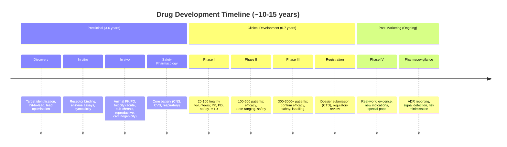
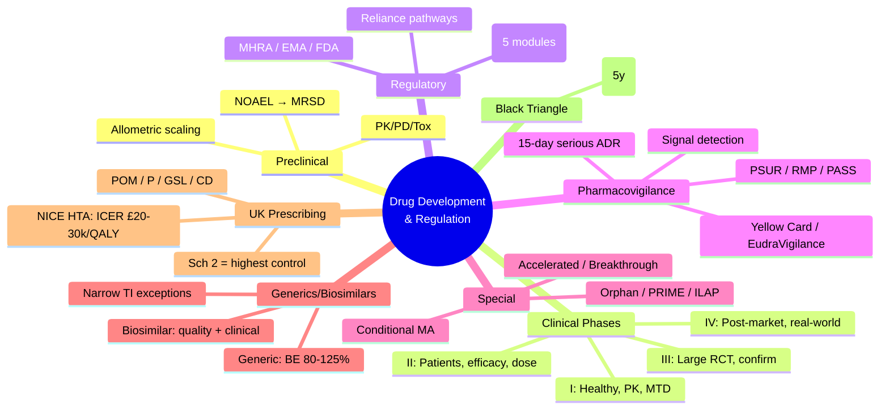

**Parent Topic:** [Clinical Therapeutics Overview](../../Clinical%20Therapeutics%20and%20Good%20Prescribing%20MOC.md)
**Status:** `full-fcps-mrcp-note`
**Priority:** ⭐⭐ HIGH (FCPS/MRCP — clinical trial phases, regulatory pathways, drug safety monitoring, pharmacovigilance)
**Source:** Davidson 24th Ed Ch 2; MHRA; EMA; FDA; ICH Guidelines; GCP; CIOMS; Pharmacovigilance literature

---

## 1. 1. 🎯 Learning Objectives
- [ ] Describe **drug development phases** (Preclinical → Phase I–IV)
- [ ] Understand **regulatory approval pathways** (UK MHRA, EU EMA, US FDA)
- [ ] Apply **pharmacovigilance principles**: ADR reporting, signal detection, risk management
- [ ] Know **post-marketing surveillance** tools (PSUR, RMP, PASS, PAES)
- [ ] Distinguish **generic vs biosimilar** approval requirements
- [ ] Understand **HTA/NICE** role in UK prescribing
- [ ] Answer viva: "Phase I vs II vs III" and "Yellow Card scheme"

---

## 2. 2. 🧠 Core Concept: Drug Development Timeline



---

## 3. 3. ️⃣ Preclinical Development

### 1. Required Studies (ICH M3/M6)

| Category | Key Studies |
|----------|-------------|
| **Pharmacology** | Primary pharmacodynamics (target engagement); Secondary PD (off-target); Safety pharmacology (core battery: CNS, CVS — hERG, respiratory) |
| **Pharmacokinetics** | ADME (absorption, distribution, metabolism, excretion); Toxicokinetics (PK at toxic doses); Cross-species comparison |
| **Toxicology** | **Single-dose (acute)**; **Repeated-dose** (28-day, 90-day, 6-month rodent + non-rodent); **Genotoxicity** (Ames, chromosomal aberration, micronucleus); **Carcinogenicity** (2-year rodent, 6-month transgenic); **Reproductive** (fertility, embryofetal, pre/post-natal); **Local tolerance** |
| **Formulation** | Stability, biocompatibility, sterility |

> **Key:** *No human data. **Allometric scaling** from animals → human starting dose (NOAEL → MRSD with safety factors).*

---

## 4. 4. ️⃣ Clinical Trial Phases

### 1. Phase I — First-in-Human (FIH)
| Aspect | Details |
|--------|---------|
| **Participants** | 20–100 **healthy volunteers** (or patients for oncology/toxic drugs) |
| **Objectives** | **Safety, tolerability, PK, PD**; **Maximum Tolerated Dose (MTD)**; Food effect; Drug interactions (initial) |
| **Design** | Single Ascending Dose (SAD) → Multiple Ascending Dose (MAD) |
| **Endpoints** | AEs, vital signs, ECG, labs, PK parameters (Cmax, AUC, t½, CL, Vd) |
| **Duration** | Months |

### 2. Phase II — Proof of Concept / Dose-Ranging
| Aspect | Details |
|--------|---------|
| **Participants** | 100–500 **patients** with target disease |
| **Objectives** | **Efficacy** (preliminary); **Dose-response**; Safety in patients; Refine Phase III design |
| **Design** | **Phase IIa** (dose-ranging, PoC); **Phase IIb** (dose-confirmation, pivotal efficacy) |
| **Endpoints** | Surrogate/clinical efficacy; Safety; PK/PD |
| **Duration** | 1–2 years |
| **Key Issue** | **~30% fail** (lack of efficacy / safety) |

### 3. Phase III — Confirmatory / Pivotal
| Aspect | Details |
|--------|---------|
| **Participants** | **300–3000+** patients (large, diverse) |
| **Objectives** | **Confirm efficacy** vs placebo/active comparator; **Safety** in large population; **Labelling claims**; Special populations (elderly, renal, hepatic) |
| **Design** | **RCT** (parallel, crossover, factorial); **Non-inferiority** or **Superiority**; Multi-centre, international |
| **Endpoints** | **Primary** (clinical outcome); **Secondary** (QoL, biomarkers); Safety |
| **Duration** | 2–4 years |
| **Key Issue** | **~50% fail** (efficacy/safety); Cost: $100M–$1B+ |

### 4. Phase IV — Post-Marketing / Real-World
| Aspect | Details |
|--------|---------|
| **Participants** | **Large populations** in routine care |
| **Objectives** | **Long-term safety** (rare AEs); **Effectiveness** (real-world); **New indications/pops**; **Drug utilisation**; **Cost-effectiveness** |
| **Design** | Observational (cohort, case-control, registry); Pragmatic RCT; Database studies |
| **Regulatory** | **Mandated** (PASS — Post-Authorisation Safety Study) or **Voluntary** |

---

## 5. 5. ️⃣ Regulatory Approval Pathways

### 1. UK (MHRA) — Post-Brexit
| Pathway | Description |
|---------|-------------|
| **National Procedure** | UK-only application (MHRA) |
| **Reliance** | Recognise EU (EMA), US (FDA), Swiss (Swissmedic), Australian (TGA), Canadian (Health Canada), Singapore (HSA) decisions |
| **Conditional Marketing Authorisation (CMA)** | For unmet need (less comprehensive data) — e.g., COVID vaccines |
| **Exceptional Circumstances** | Rare diseases where comprehensive data impossible |
| **Traditional Herbal Registration (THR)** | Herbal medicines with traditional use |

### 2. EU (EMA) — Centralised vs National
| Procedure | Scope |
|-----------|-------|
| **Centralised** | Mandatory for biotech, orphan, ATMP; Optional for new active substances → **Single MA valid EU/EEA** |
| **Mutual Recognition (MRP)** | National MA recognised by other MS |
| **Decentralised (DCP)** | Simultaneous application to multiple MS |
| **National** | Single MS only |

### 3. US (FDA)
| Pathway | Description |
|---------|-------------|
| **NDA (New Drug Application)** | Standard small molecule |
| **BLA (Biologics License Application)** | Biologics (mAbs, vaccines, gene therapy) |
| **505(b)(2)** | Hybrid (relies on published data + new studies) |
| **Accelerated Approval** | Surrogate endpoint for serious conditions (confirmatory trial required) |
| **Fast Track / Breakthrough / Priority Review** | Expedited programs |

---

## 6. 6. ️⃣ Common Technical Document (CTD) — Dossier Structure

| Module | Content |
|--------|---------|
| **Module 1** | Administrative (region-specific: application forms, labelling, PIL) |
| **Module 2** | **Summaries** (2.3 Quality, 2.4 Non-clinical, 2.5 Clinical, 2.7 Risk Management Plan) |
| **Module 3** | **Quality** (drug substance, drug product, manufacturing, stability) |
| **Module 4** | **Non-clinical** (pharmacology, PK, toxicology — study reports) |
| **Module 5** | **Clinical** (biopharmaceutics, PK, efficacy, safety — study reports, ISE, ISS) |

> **ICH CTD** = Harmonised format for EU, US, Japan, Canada, Switzerland, UK, Australia, China, South Korea, Singapore, Brazil, etc.

---

## 7. 7. ️⃣ Pharmacovigilance — Post-Marketing Safety

### 1. Key Definitions
| Term | Definition |
|------|------------|
| **ADR (Adverse Drug Reaction)** | Noxious/unintended response at **normal doses** (causal link suspected) |
| **ADE (Adverse Drug Event)** | Any untoward occurrence during treatment (causal link not required) |
| **Serious ADR** | Death, life-threatening, hospitalisation, disability, congenital anomaly, medically significant |
| **Signal** | Information from one/multiple sources suggesting **new causal association** or **new aspect of known association** |

### 2. ADR Reporting Systems

| System | Region | Key Features |
|--------|--------|--------------|
| **Yellow Card Scheme** | UK (MHRA) | **Spontaneous reporting** by HCPs, patients, pharma; paper/electronic/app |
| **EudraVigilance** | EU (EMA) | Centralised database; MAH mandatory electronic reporting |
| **FAERS** | US (FDA) | Adverse Event Reporting System; MedDRA coding |
| **VigiBase** | WHO (Uppsala) | Global ICSR database (>25M reports); signal detection |
| **VigiAccess** | WHO | Public access to VigiBase summaries |

### 3. Reporting Timelines (ICH E2D)

| Event | MAH → Regulatory |
|-------|------------------|
| **Serious unexpected ADR** | **15 calendar days** |
| **Serious expected ADR** | **15 calendar days** (or per national law) |
| **Non-serious** | **90 days** (or per national law) |
| **Periodic Safety Update Report (PSUR)** | **6-monthly** × 2 years, then **annually** (up to 5 years), then **3-yearly** |

### 4. Signal Detection & Management
```mermaid
flowchart TD
    A[Data Sources] --> B[Signal Detection]
    B --> C{Signal Validated?}
    C -->|Yes| D[Risk Assessment
CIOMS/WHO criteria]
    D --> E[Risk Minimisation]
    E --> F1[Label Update
(SmPC/PIL)]
    E --> F2[RMP Update
(Additional monitoring)]
    E --> F3[DHPC / Dear HCP Letter]
    E --> F4[Restriction / Suspension / Withdrawal]
    C -->|No| G[Continue Monitoring]
```

### 5. Key Pharmacovigilance Tools

| Tool | Purpose |
|------|---------|
| **PSUR (Periodic Safety Update Report)** / **PBRER** | Cumulative benefit-risk review at defined intervals |
| **RMP (Risk Management Plan)** | **Pharmacovigilance activities** (routine + additional) + **Risk minimisation measures** (routine: SmPC/PIL; additional: controlled access, pregnancy prevention, registries) |
| **PASS (Post-Authorisation Safety Study)** | **Mandated** observational study for specific safety concern |
| **PAES (Post-Authorisation Efficacy Study)** | **Mandated** study for efficacy (e.g., confirmatory for accelerated approval) |
| **DHPC (Direct Healthcare Professional Communication)** | Urgent safety info to HCPs (SmPC change, restriction) |
| **SmPC / PIL** | **Summary of Product Characteristics** (HCP) / **Package Information Leaflet** (patient) |

---

## 8. 8. ️⃣ Generic vs Biosimilar Approval

### 1. Generic Medicines (Small Molecules)
| Requirement | Standard |
|-------------|----------|
| **Active substance** | Same qualitative/quantitative |
| **Pharmaceutical form** | Same |
| **Route of administration** | Same |
| **Bioequivalence** | **90% CI of AUC/Cmax ratio 80–125%** (log-transformed) |
| **Clinical efficacy/safety** | **Not required** (relied on reference) |
| **Exceptions** | Narrow TI drugs (warfarin, digoxin, lithium, phenytoin, carbamazepine, theophylline, ciclosporin, tacrolimus) — **stricter BE / clinical data** |

### 2. Biosimilars (Biological Medicines)
| Requirement | Standard |
|-------------|----------|
| **Reference product** | Authorised biological |
| **Quality** | **Comprehensive comparability** (structure, function, purity, impurities) |
| **Non-clinical** | **Reduced** (PK/PD, toxicity in relevant species) |
| **Clinical** | **PK/PD similarity** (healthy volunteers); **Confirmatory efficacy/safety** (1–2 RCTs in sensitive population); **Immunogenicity** comparison |
| **Extrapolation** | **Scientific justification** for other indications of reference |
| **Interchangeability** | **Regulatory ≠ automatic substitution** (varies by country); UK: **prescriber decision** |

---

## 9. 9. ️⃣ Special Regulatory Designations

| Designation | Region | Purpose |
|-------------|--------|---------|
| **Orphan Drug** | EU/UK/US/Japan | Incentives for rare diseases (<5/10,000 EU; <200k US); market exclusivity (10y EU, 7y US) |
| **PRIME (Priority Medicines)** | EU (EMA) | Early support for promising medicines addressing unmet need |
| **ILAP (Innovative Licensing and Access Pathway)** | UK (MHRA) | Accelerated access for innovative medicines |
| **Accelerated Approval** | US (FDA) | Surrogate endpoint for serious conditions |
| **Breakthrough Therapy** | US (FDA) | Preliminary evidence of substantial improvement |
| **Fast Track** | US (FDA) | Serious condition + unmet need → rolling review |
| **Conditional MA / CMA** | EU/UK | Less comprehensive data for unmet need (specific obligations) |

---

## 10. 10. ️⃣ UK Health Technology Assessment (HTA) — NICE

### 1. NICE Technology Appraisal (TA) Process
```mermaid
flowchart TD
    A[Topic Selection] --> B[Scope Development]
    B --> C[Evidence Submission
(Company + Independent)]
    C --> D[Assessment Group
(Critique + Economic Model)]
    D --> E[Appraisal Committee
(Clinical + Economic)]
    E --> F[Draft Guidance]
    F --> G[Consultation]
    G --> H[Final Guidance]
    H --> I[Mandatory Funding (NHS)]
```

### 2. NICE Decision Framework
| Outcome | Meaning |
|---------|---------|
| **Recommended** | NHS must fund within 90 days |
| **Optimised** | Recommended in specific sub-population |
| **Only in Research** | Not for routine use; only in clinical trials |
| **Not Recommended** | NHS not funded (exceptional cases via IFR) |

### 3. Key NICE Criteria
| Criterion | Threshold |
|-----------|-----------|
| **Cost-effectiveness** | **ICER ≤ £20,000–£30,000/QALY** (end of life: £50,000) |
| **Clinical effectiveness** | vs current standard of care |
| **Budget impact** | >£20M/yr → additional negotiation (commercial access agreements) |
| **Equality** | No discrimination |

> **SMC (Scottish Medicines Consortium)** = Separate HTA body for Scotland. **AWMSG (All Wales Medicines Strategy Group)** = Wales.

---

## 11. 11. ️⃣ Prescribing in the UK — Regulatory Framework

### 1. Legal Classification (UK)
| Category | Supply | Examples |
|----------|--------|----------|
| **POM (Prescription Only Medicine)** | Rx only (doctor/dentist/nurse/pharmacist independent prescriber) | Most therapeutic drugs |
| **P (Pharmacy Medicine)** | Pharmacist supervision (no Rx) | Chloramphenicol eye drops, emergency contraception, some analgesics |
| **GSL (General Sales List)** | Any retail outlet | Paracetamol 500mg (≤16 tabs), ibuprofen 200mg (≤24 tabs) |
| **CD (Controlled Drugs)** | **Misuse of Drugs Act 1971** schedules + **MDR 2001** | See below |

### 2. Controlled Drugs Schedules (UK)

| Schedule | Examples | Prescription Requirements | Storage/Destruction |
|----------|----------|---------------------------|---------------------|
| **Sch 1** | LSD, MDMA, cannabis (raw) | **No medical use** (Home Office licence for research) | Secure cabinet |
| **Sch 2** | **Morphine, Diamorphine, Fentanyl, Oxycodone, Pethidine, Methadone, Ketamine, Amphetamine, Methylphenidate, Cocaine** | **FP10CD** (or electronic CD Rx); **Handwritten signature**; **Dose in words & figures**; **Total quantity in words & figures**; **Patient name/address**; **Prescriber details**; **28-day validity** | **CD cabinet**; **CD register** (running balance); **Witnessed destruction** |
| **Sch 3** | **Temazepam, Midazolam, Buprenorphine, Tramadol, Gabapentin, Pregabalin, Phenobarbital, Testosterone, GHB** | Standard Rx (FP10); **28-day validity**; No CD register req'd | Secure storage |
| **Sch 4** | **Benzodiazepines (diazepam, lorazepam, clonazepam — except Sch 3), Z-drugs, Anabolic steroids, Clenbuterol** | Standard Rx; 28-day validity | Secure storage |
| **Sch 5** | **Codeine ≤100mg/5mL, Dihydrocodeine, Pholcodine, Loperamide, Kaolin & morphine, Diphenoxylate** | Standard Rx (OTC P/GSL for some) | Standard |

> **Key:** *Schedule 2 = **highest control** (CD Rx, CD register, witnessed destruction). **Nurse/pharmacist independent prescribers** can prescribe Sch 2–5 (with limitations).*

---

## 12. 12. 🔟 Pharmacovigilance in Clinical Practice

### 1. Yellow Card Reporting (UK)
| Who Can Report | How |
|----------------|-----|
| **Doctors, dentists, nurses, pharmacists, midwives** | Online (yellowcard.mhra.gov.uk), app, paper |
| **Patients / carers** | Same routes |
| **Pharma companies** | Mandatory electronic (EudraVigilance) |

### 2. What to Report
- **All serious ADRs** (even if known)
- **All ADRs to new drugs** (▼ black triangle)
- **Medication errors** causing harm
- **Defective medicines** (quality defects)
- **Counterfeit/falsified medicines**

### 3. Black Triangle (▼) Scheme
| Drug | Duration |
|------|----------|
| **New active substance** | **5 years** (or longer if safety concerns) |
| **New indication / route / population** | Until safety established |
| **Biosimilars** | 5 years |
| **Meaning** | **Intensive monitoring** — report **ALL suspected ADRs** (not just serious) |

---

## 13. 13. ⚡ FCPS/MRCP High-Yield Summary

| Topic | Key Points |
|-------|------------|
| **Drug Development** | Preclinical (3–6y) → Phase I (healthy, PK/safety) → Phase II (patients, efficacy/dose) → Phase III (large RCT, confirmatory) → Phase IV (post-marketing) |
| **Regulatory** | MHRA (UK), EMA (EU), FDA (US); CTD dossier (5 modules); Reliance pathways post-Brexit |
| **Pharmacovigilance** | Yellow Card (UK); EudraVigilance (EU); FAERS (US); 15-day serious ADR reporting; PSUR/PBRER; RMP |
| **Signal Detection** | Disproportionality analysis (ROR, PRR, IC) → validation → risk assessment → minimisation (label, RMP, DHPC, restriction) |
| **Generics** | Bioequivalence (80–125% CI); Narrow TI = stricter; Biosimilars = quality comparability + clinical similarity + immunogenicity |
| **Orphan/PRIME/ILAP** | Incentives for unmet need/rare diseases |
| **NICE HTA** | ICER £20–30k/QALY; mandatory funding if recommended |
| **CD Schedules** | **Sch 2 = highest** (CD Rx, register, destruction); Sch 3–5 = standard Rx |
| **Black Triangle (▼)** | New drugs 5y → report ALL suspected ADRs |

---

## 14. 14. 🎤 Viva Questions (Expected Answers)

| # | Question | Expected Answer |
|---|----------|-----------------|
| 1 | Describe the phases of clinical drug development. | Phase I: 20–100 healthy volunteers, PK/safety/MTD. Phase II: 100–500 patients, efficacy/dose-ranging. Phase III: 300–3000+ patients, confirm efficacy/safety vs comparator. Phase IV: Post-marketing real-world. |
| 2 | What is the Yellow Card scheme? | UK spontaneous ADR reporting system (MHRA) for HCPs and patients. All serious ADRs, all ADRs for ▼ drugs, medication errors. |
| 3 | Reporting timeline for serious unexpected ADR by pharma company? | **15 calendar days** to regulatory authority (ICH E2D). |
| 4 | Generic vs biosimilar approval — key difference? | Generic: **Bioequivalence** (80–125% CI) only. Biosimilar: **Quality comparability + non-clinical + clinical PK/PD + efficacy/safety + immunogenicity**. |
| 5 | What is a PSUR? | Periodic Safety Update Report — cumulative benefit-risk review at defined intervals (6-monthly × 2y, then annually, then 3-yearly). |
| 6 | NICE cost-effectiveness threshold? | **ICER ≤ £20,000–£30,000/QALY** (end-of-life: up to £50,000). |
| 7 | Controlled Drug Schedule 2 — prescription requirements? | **FP10CD** (or eCD Rx); handwritten signature; dose in words & figures; total quantity in words & figures; patient name/address; prescriber details; 28-day validity. |
| 8 | Black triangle (▼) meaning? | **Intensive monitoring** — report **ALL suspected ADRs** (not just serious). Duration ~5 years for new active substance. |
| 9 | Bioequivalence acceptance criteria for generics? | **90% CI of geometric mean ratio (test/reference) for AUC and Cmax within 80–125%** (log-transformed). |
| 10 | What is an RMP? | Risk Management Plan — pharmacovigilance activities (routine + additional) + risk minimisation measures (routine: SmPC/PIL; additional: controlled access, pregnancy prevention, registries). |

---

## 15. 15. 🧩 Confusions & Mnemonics

| Confusion | Clarification |
|-----------|---------------|
| **"Phase I = efficacy"** | **NO.** Phase I = **safety, PK, MTD** in healthy volunteers. Efficacy = Phase II/III. |
| **"Generics need clinical trials"** | **NO.** Generics need **bioequivalence only** (except narrow TI). Biosimilars need clinical data. |
| **"Biosimilar = generic biologic"** | **NO.** Biosimilar = **similar but not identical**; requires clinical confirmation. More complex than generic. |
| **"MHRA = EMA post-Brexit"** | **NO.** MHRA is **UK sovereign regulator**. Relies on EU/US/Swiss/Aus/Can/SG decisions but independent. |
| **"All ADRs reported in 15 days"** | **Only serious unexpected** by pharma (15 days). HCPs report serious ADRs ASAP. Non-serious = 90 days (pharma). |
| **"NICE recommended = free for all"** | **NICE recommended = NHS MUST fund** within 90 days. But may have **optimised** (subgroup only) or **commercial access agreements**. |
| **"Schedule 2 = all opioids"** | **NO.** Tramadol = Sch 3; Codeine low-dose = Sch 5; Only strong opioids (morphine, diamorphine, fentanyl, oxycodone, pethidine, methadone) = Sch 2. |
| **"Phase IV = optional"** | **Often MANDATED** (PASS/PAES as condition of approval). Also voluntary for label extensions. |

> **Mnemonic: DRUG DEVELOPMENT REG**  
> **D**rug phases: **Preclinical → I (healthy/PK) → II (patients/efficacy) → III (RCT/confirm) → IV (post-market)**  
> **R**egulatory: **MHRA (UK), EMA (EU), FDA (US)**; CTD 5 modules; Reliance pathways  
> **U**K CD schedules: **Sch 2 = opioids (CD Rx, register, destruction); Sch 3 = tramadol/gabapentin; Sch 4 = benzos; Sch 5 = weak opioids**  
> **G**enerics: **BE 80-125%** (narrow TI stricter); **Biosimilars: quality + clinical + immunogenicity**  
> **D**evelopment cost: **$1-2B, 10-15y, 90% fail** (Phase II 30%, Phase III 50%)  
> **E**fficacy endpoints: **Surrogate (Phase II) → Clinical (Phase III)**  
> **V**igilance: **Yellow Card (UK), EudraVigilance (EU), FAERS (US), VigiBase (WHO)**  
> **E**MA/PRIME/ILAP/Orphan: **Incentives for unmet need/rare diseases**  
> **L**abeling: **SmPC (HCP), PIL (patient)**; Black triangle ▼ = report ALL ADRs (5y)  
> **O**bligations: **PSUR 6m→ann→3y; RMP (PV + risk minimisation); PASS/PAES (mandated)**  
> **P**harmacovigilance: **Signal detection (ROR/PRR/IC) → Validation → Risk minimisation**  
> **M**edicines classification: **POM, P, GSL, CD** (Misuse of Drugs Act)  
> **E**conomic: **NICE ICER £20-30k/QALY; SMC (Scotland), AWMSG (Wales)**  
> **N**ew drug: **10-15y, $2B+, patent 20y from filing, data exclusivity 8+2+1y (EU)**  
> **T**oxicity: **Sch 1 no medical use; Sch 2 highest control (CD register); Sch 3-5 descending**  
> **R**isk management: **Routine (SmPC) + Additional (controlled access, pregnancy prevention, registry)**  
> **E**xpedited: **Accelerated (surrogate), Breakthrough (prelim evidence), Fast Track (rolling), PRIME (EMA)**  
> **G**uidelines: **ICH (E2D/E2E/E2F/M3/M4/M6/M7/M10), GCP, GMP, GLP**

---

## 16. 16. 🗺️ Mind Map



---

## 17. 17. 📅 Spaced Repetition Tracker

| Review | Date | Score (0–5) | Notes |
|--------|------|-------------|-------|
| Day 1 | | | |
| Day 3 | | | |
| Day 7 | | | |
| Day 14 | | | |
| Day 30 | | | |
| Day 90 | | | |

---

## 18. 18. 📝 Self-Test Scorecard

| Section | Max | Score | % |
|---------|-----|-------|---|
| Clinical Trial Phases | 3 | | |
| Regulatory Pathways | 2 | | |
| Pharmacovigilance (Yellow Card, PSUR, RMP) | 3 | | |
| Signal Detection & Risk Minimisation | 2 | | |
| Generic vs Biosimilar | 2 | | |
| Orphan/Expedited Designations | 2 | | |
| NICE HTA | 2 | | |
| UK CD Schedules & Prescribing Law | 2 | | |
| Black Triangle | 2 | | |
| **Total** | **20** | | |

---

## 19. 19. 💬 Exam Answer Modes

| Format | Prompt | Key Points |
|--------|--------|------------|
| **Long Essay** | "Describe the drug development process from discovery to post-marketing surveillance." | Preclinical → Phase I–IV; Regulatory (MHRA/EMA/FDA); CTD; Pharmacovigilance (Yellow Card, PSUR, RMP); Signal detection; Generics vs biosimilars; NICE HTA; CD schedules |
| **Short Note** | "Yellow Card scheme and black triangle monitoring." | Spontaneous reporting (HCP/patient); 15-day pharma reporting; ▼ drugs = report ALL ADRs for 5y; MHRA evaluates signals |
| **Viva** | "What is the difference between generic and biosimilar approval?" | Generic: BE 80-125% CI only. Biosimilar: comprehensive quality comparability + non-clinical + clinical PK/PD + confirmatory efficacy/safety + immunogenicity. Extrapolation with justification. |
| **Ward Round** | "Patient on new drug (▼) develops rash. Action?" | **Report via Yellow Card** (ALL suspected ADRs for ▼ drugs). Document fully. Review need for drug. Inform patient. |
| **Last-Night** | "Phases: I healthy PK, II dose/efficacy, III RCT confirm, IV post-market. Yellow Card 15d serious. Generic BE 80-125. Biosimilar quality+clinical. NICE £20-30k/QALY. CD Sch2 CD Rx+register. ▼=report all. RMP=PV+risk min." | Phases. Reporting. Generic vs biosimilar. NICE. CD. Black triangle. RMP. |

---

## 20. 20. 📌 Summary
- **Drug development**: Preclinical (3–6y) → **Phase I** (healthy, PK/safety/MTD) → **Phase II** (patients, efficacy/dose) → **Phase III** (large RCT, confirmatory) → **Phase IV** (post-marketing real-world)
- **Regulatory**: MHRA (UK), EMA (EU), FDA (US); **CTD** 5-module dossier; **Reliance pathways** post-Brexit
- **Pharmacovigilance**: **Yellow Card** (UK spontaneous reporting); **15-day** serious ADR reporting by pharma; **PSUR/PBRER** (cumulative benefit-risk); **RMP** (PV activities + risk minimisation); **Signal detection** → validation → risk minimisation
- **Generics**: **Bioequivalence** (90% CI 80–125%) only; **Narrow TI** = stricter; **Biosimilars**: Quality comparability + **clinical similarity + immunogenicity**
- **Special designations**: **Orphan** (rare disease incentives); **PRIME/ILAP** (accelerated access); **Conditional MA** (unmet need, less data)
- **NICE HTA**: **ICER £20,000–£30,000/QALY**; mandatory funding if recommended
- **UK CD Schedules**: **Sch 2 = highest** (morphine, fentanyl, oxycodone — CD Rx, register, witnessed destruction); Sch 3–5 descending
- **Black Triangle (▼)**: **New drugs 5 years** → report **ALL suspected ADRs** (intensive monitoring)
- **Prescribing law**: POM/P/GSL/CD; Nurse/pharmacist independent prescribers for Sch 2–5

---

## 21. 21. ❓ MCQs (10)

1. **Phase I clinical trial primary objective:**  
   A. Confirm efficacy  B. **Safety, PK, MTD**  C. Dose-ranging  D. Long-term safety  
   *Answer: B. Phase I = first-in-human, healthy volunteers, safety/PK/MTD.*

2. **Bioequivalence acceptance criteria for generic approval:**  
   A. 70–130%  B. **80–125% (90% CI of geometric mean ratio)**  C. 75–133%  D. 90–110%  
   *Answer: B. 90% CI of AUC and Cmax ratio within 80–125% (log-transformed).*

3. **Yellow Card reporting — who can report?**  
   A. Doctors only  B. Doctors + pharmacists  C. **HCPs + patients + pharma**  D. Pharma only  
   *Answer: C. Doctors, dentists, nurses, pharmacists, midwives, patients, carers, pharma companies.*

4. **Biosimilar vs generic — key difference:**  
   A. Biosimilars cheaper  B. **Biosimilars require clinical data; generics only BE**  C. Generics for biologics  D. Same process  
   *Answer: B. Generics = BE only (80–125%). Biosimilars = quality comparability + non-clinical + clinical PK/PD + efficacy/safety + immunogenicity.*

5. **NICE cost-effectiveness threshold (standard):**  
   A. £10,000/QALY  B. **£20,000–£30,000/QALY**  C. £50,000/QALY  D. £100,000/QALY  
   *Answer: B. £20,000–£30,000/QALY (end-of-life up to £50,000).*

6. **Controlled Drug Schedule 2 — example:**  
   A. Tramadol  B. **Morphine**  C. Diazepam  D. Codeine linctus  
   *Answer: B. Morphine, diamorphine, fentanyl, oxycodone, pethidine, methadone = Sch 2. Tramadol = Sch 3. Diazepam = Sch 4. Codeine low-dose = Sch 5.*

7. **PSUR submission frequency (first 2 years):**  
   A. Annually  B. **6-monthly**  C. 3-yearly  D. Monthly  
   *Answer: B. 6-monthly × 2 years, then annually up to 5 years, then 3-yearly.*

8. **Black triangle (▼) duration for new active substance:**  
   A. 2 years  B. **5 years**  C. 10 years  D. Indefinite  
   *Answer: B. ~5 years (or longer if safety concerns). Meaning: report ALL suspected ADRs.*

9. **Signal detection — common statistical method:**  
   A. Chi-square  B. **Disproportionality analysis (ROR, PRR, IC)**  C. Linear regression  D. Kaplan-Meier  
   *Answer: B. Disproportionality analysis (Reporting Odds Ratio, Proportional Reporting Ratio, Information Component).*

10. **Phase III trial typical size:**  
    A. 20–100  B. 100–500  C. **300–3000+**  D. 10,000+  
    *Answer: C. Phase III = 300–3000+ patients, confirmatory RCT.*

---

## 22. 22. 📋 SBAs (10)

1. **Pharma company receives report of serious unexpected ADR from clinical trial. Report to MHRA within?**  
   A. 24 hours  B. 7 days  C. **15 calendar days**  D. 30 days  
   *Answer: C. ICH E2D: 15 calendar days for serious unexpected ADRs.*

2. **NICE recommends a drug "only in research." What does this mean?**  
   A. NHS must fund  B. **Not for routine use; only in clinical trials**  C. Fund via IFR only  D. Deferred decision  
   *Answer: B. Not recommended for routine commissioning; only in clinical trials.*

3. **Generic warfarin — additional requirement beyond standard BE?**  
   A. None  B. **Stricter BE limits / clinical data**  C. Different manufacturing  D. No generic allowed  
   *Answer: B. Narrow TI drugs (warfarin, digoxin, lithium, phenytoin, carbamazepine, theophylline, ciclosporin, tacrolimus) — stricter BE / clinical data required.*

4. **Prescriber writes FP10 for morphine sulfate 10mg/5mL oral solution 100mL. Schedule?**  
   A. Sch 3  B. **Sch 2**  C. Sch 4  D. Sch 5  
   *Answer: B. Morphine = Schedule 2. Requires FP10CD (CD prescription).*

5. **New biologic drug granted Conditional Marketing Authorisation (CMA). Obligation?**  
   A. No further studies  B. **Complete ongoing/confirmatory studies (specific obligations)**  C. Price reduction  D. Post-market surveillance only  
   *Answer: B. CMA = less comprehensive data for unmet need; **specific obligations** (usually confirmatory trial completion).*

---

## 23. 23. 🔑 Answer Keys
| MCQs | SBAs |
|------|------|
| 1-B, 2-B, 3-C, 4-B, 5-B, 6-B, 7-B, 8-B, 9-B, 10-C | 1-C, 2-B, 3-B, 4-B, 5-B |

---

## 24. 24. 🔗 Cross-Links
- [[Medication Safety and Errors/ADR Classification]] — ADR types, causality, Yellow Card reporting
- [[Medication Safety and Errors/Pharmacovigilance]] — Signal detection, PSUR, RMP
- [[Drug Interactions]] — Interaction detection in Phase I/IV; post-marketing signal detection
- [[Special Populations/Pregnancy and Lactation]] — Pregnancy exposure registries (RMP additional measures)
- [[Special Populations/Paediatric Prescribing]] — Paediatric Investigation Plans (PIP) — EU requirement
- [[Clinical Context/Antimicrobial Stewardship]] — Antibiotic development pathways, resistance monitoring
- [[Therapeutic Drug Monitoring]] — PK in drug development (Phase I); TDM for narrow TI drugs
- [[Polypharmacy and Deprescribing/Assessment Tools]] — Post-marketing safety in elderly (STOPP/START)
