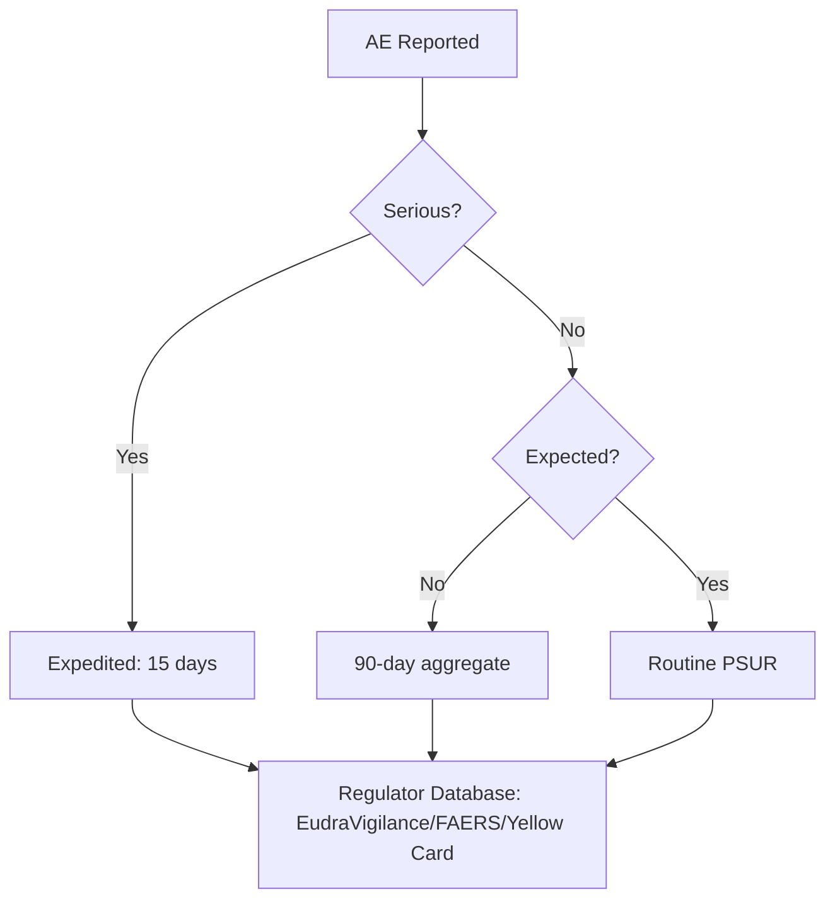
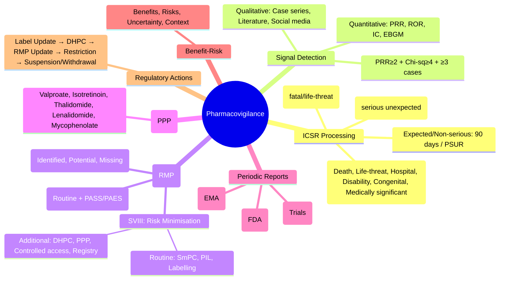

**Status**: `draft` | **Chapter**: 2 — Clinical Therapeutics and Good Prescribing | **Heading**: Drug Development and Regulation | **Exam Priority**: ⭐⭐⭐ **HIGH** (Patient safety, governance, Yellow Card, FCPS/MRCP)

---

## 1. 1. 🎯 Learning Objectives
- [ ] Define pharmacovigilance scope: detection, assessment, understanding, prevention of ADRs
- [ ] Apply signal detection: qualitative (case series) + quantitative (disproportionality)
- [ ] Execute case processing: ICSR, MedDRA, seriousness criteria, expedited reporting
- [ ] Apply risk management: RMP, risk minimisation (educational, controlled access, PPTP)
- [ ] Understand regulatory reporting: PSUR/PADER, DSUR, 15-day/90-day rules
- [ ] Recognise benefit-risk balance: regulatory actions (label change, restriction, withdrawal)

---

## 2. 2. 📊 Pharmacovigilance Framework

| Component | Description |
|-----------|-------------|
| **Scope** | **Detection, Assessment, Understanding, Prevention** of ADRs and drug-related problems |
| **Legislation** | **EU**: Pharmacovigilance Directive 2010/84/EU, Regulation 726/2004; **UK**: Human Medicines Regulations 2012; **US**: FD&C Act, FDAAA 2007 |
| **Key Databases** | **EudraVigilance** (EU), **FAERS** (FDA), **VigiBase** (WHO/Uppsala), **Yellow Card** (UK MHRA) |
| **Stakeholders** | **MAH** (Marketing Authorisation Holder), **Regulators** (EMA/PRAC, FDA, MHRA), **HCPs**, **Patients**, **WHO** |

---

## 3. 3. 📝 Individual Case Safety Reports (ICSRs)

### 1. Seriousness Criteria (CIOMS/ICH E2D)
An AE is **SERIOUS** if it results in:
| Criterion | Definition |
|-----------|------------|
| **Death** | Fatal outcome |
| **Life-threatening** | Immediate risk of death |
| **Hospitalisation** | Inpatient admission or prolongation |
| **Disability** | Persistent/significant incapacity |
| **Congenital anomaly** | Birth defect |
| **Medically significant** | Requires intervention to prevent above (e.g., overdose, cancer) |

> **Non-serious** = all other AEs; **Expedited reporting** required for **serious** (15 days) and **non-serious unexpected** (90 days)

### 2. Expedited Reporting Timelines
| Report Type | **Timeline** | **To Whom** |
|-------------|--------------|-------------|
| **Serious Unexpected** (15-day) | **15 calendar days** from MAH awareness | **Regulator** (EMA/EudraVigilance, FDA/FAERS, MHRA) |
| **Serious Expected** (15-day) | **15 calendar days** | **Regulator** (if new info on severity/frequency) |
| **Non-serious Unexpected** | **90 calendar days** | **Regulator** (periodic aggregate) |
| **SUSARs** (Clinical Trials) | **7 days** (fatal/life-threatening) / **15 days** (other serious) | **Regulator + Ethics Committee** |

> **SUSAR** = Suspected Unexpected Serious Adverse Reaction (in clinical trials)

### 3. Case Processing Workflow

---

## 4. 4. 📈 Signal Detection

### 1. Qualitative (Clinical Review)
| Method | Description |
|--------|-------------|
| **Case Series Review** | Multiple similar ICSRs suggesting causal association |
| **Literature Monitoring** | Systematic review of publications, conference abstracts |
| **Regulatory Communications** | DHPC (Direct Healthcare Professional Communication), RMP updates |
| **Social Media / Patient Forums** | Emerging safety concerns from patient reports |

### 2. Quantitative (Disproportionality Analysis)
| Metric | Formula | Interpretation |
|--------|---------|----------------|
| **PRR** (Proportional Reporting Ratio) | **(a/(a+b)) / (c/(c+d))** | **PRR ≥2** + **Chi-square ≥4** + **≥3 cases** = Signal |
| **ROR** (Reporting Odds Ratio) | **(a×d) / (b×c)** | **Lower 95% CI >1** = Signal |
| **IC** (Information Component) | **Bayesian** (log2 of observed/expected) | **IC025 >0** (Bayanian) = Signal |
| **EBGM** (Empirical Bayes Geometric Mean) | **FDA** (shrinkage estimator) | **EB05 ≥2** = Signal |

**2×2 Table:**
| | **Drug of Interest** | **All Other Drugs** |
|---|---|---|
| **Event of Interest** | a | b |
| **All Other Events** | c | d |

> **Disproportionality ≠ Causation** — **Signal = Hypothesis** requiring clinical evaluation

---

## 5. 5. 🛡️ Risk Management

### 1. Risk Management Plan (RMP) — **Mandatory for EMA/MHRA**
| Module | Content |
|--------|---------|
| **SI** (Safety Specification) | Identified risks, potential risks, missing info (pregnancy, paediatrics, elderly, long-term) |
| **SVII** (Pharmacovigilance Plan) | Routine PV + Additional PASS/PAES; signal detection plan |
| **SVIII** (Risk Minimisation) | **Routine** (SmPC, PIL, labelling) + **Additional** (educational, controlled access, PPTP) |

### 2. Risk Minimisation Measures
| Type | Examples |
|------|----------|
| **Routine** | **SmPC** (Summary of Product Characteristics), **PIL** (Patient Information Leaflet), **Labelling**, **Pack size**, **Legal status** (POM, P, GSL) |
| **Additional — Educational** | **DHPC** (Dear Healthcare Professional Communication), **Teaching materials**, **Webinars**, **Prescriber guides** |
| **Additional — Controlled Access** | **Pregnancy Prevention Programme (PPP)** (e.g., Valproate, Isotretinoin, Thalidomide, Lenalidomide), **Controlled distribution** (e.g., Clozapine monitoring), **Specialist-only prescribing** |
| **Additional — Monitoring** | **DSMB** for trials, **Registry** (e.g., pregnancy, long-term), **TDM requirements** |

---

## 6. 6. 📊 Periodic Safety Reports

| Report | **EMA/MHRA** | **FDA** | **Interval** |
|--------|--------------|---------|--------------|
| **PSUR** (Periodic Safety Update Report) | **Mandatory** | **PADER** (Periodic Adverse Drug Experience Report) | **6 mo (first 2yr) → 1yr (next 2yr) → 3yr → 5yr** |
| **PSUR Content** | Cumulative safety data, signal evaluation, benefit-risk, RMP update | Similar | Same intervals |
| **PSUR Submission** | **EU: Single PSUR for all MAHs** (via PSUR Repository); **US: Per MAH** | **Per MAH** | **Within 60 days** of data lock point |
| **DSUR** (Development Safety Update Report) | **Annual** for clinical trials | **Annual** (IND Annual Report) | **Annual** (clinical trial safety summary) |

---

## 7. 7. ⚖️ Benefit-Risk Assessment & Regulatory Actions

### 1. Benefit-Risk Framework (EMA PRAC / FDA)
| Dimension | Considerations |
|-----------|----------------|
| **Benefits** | Efficacy (magnitude, duration), unmet need, patient preference, public health impact |
| **Risks** | Severity, frequency, preventability, reversibility, vulnerable populations |
| **Uncertainty** | Missing data (pregnancy, paediatrics, long-term), study limitations |
| **Context** | Disease severity, alternatives, patient population, public health |

### 2. Regulatory Actions (Escalating)
| Action | Trigger | Example |
|--------|---------|---------|
| **Label Update (SmPC/PIL)** | New safety info (ADR, interaction, contraindication) | **Section 4.8 update**, **Section 4.4 warning** |
| **DHPC** (Direct Healthcare Professional Communication) | **Urgent safety issue** requiring immediate action | **Valproate pregnancy contraindication**, **Clozapine myocarditis** |
| **RMP Update** | New risk identified / risk minimisation change | **Add PASS**, **Add PPP** |
| **Restriction** | Risk outweighs benefit in subgroups | **Valproate: contraindicated pregnancy**, **Codeine <12y** |
| **Suspension / Withdrawal** | **Risk > Benefit** (overall or in population) | **Rofecoxib (Vioxx)**, **Thalidomide (initially)**, **Ranitidine (NDMA)** |
| **Referral** (EU) | **MS disagreement** or **Union interest** | **Article 31 (Pharmacovigilance), Article 20 (Community interest)** |

---

## 8. 8. 🎯 FCPS/MRCP High-Yield Summary

| Pearl | Details |
|-------|---------|
| **Serious AE criteria** | Death, Life-threatening, Hospitalisation, Disability, Congenital anomaly, Medically significant |
| **Expedited reporting** | **Serious Unexpected: 15 days**; **SUSAR fatal: 7 days** |
| **Signal detection** | **Qualitative** (case series, literature) + **Quantitative** (PRR≥2, ROR, IC, EBGM) |
| **RMP** | **Mandatory EMA/MHRA**; SI (risks), SVII (PV plan), SVIII (minimisation) |
| **Risk minimisation** | **Routine** (SmPC, PIL); **Additional** (DHPC, PPP, controlled access, registry) |
| **PPP** (Pregnancy Prevention Programme) | **Valproate, Isotretinoin, Thalidomide, Lenalidomide, Mycophenolate** |
| **PSUR intervals** | **6mo → 1yr → 3yr → 5yr** (EMA); **PADER** (FDA) |
| **Regulatory actions** | Label update → DHPC → RMP update → Restriction → Suspension/Withdrawal |

---

## 9. 9. ❓ Viva Questions (10)

| Q | Answer |
|---|--------|
| 1. Serious AE criteria (CIOMS)? | **Death, Life-threatening, Hospitalisation, Disability, Congenital anomaly, Medically significant** |
| 2. Expedited reporting timeline for serious unexpected ADR? | **15 calendar days** from MAH awareness to regulator |
| 3. SUSAR reporting in clinical trials — fatal/life-threatening? | **7 days** to regulator + ethics committee |
| 4. Signal detection — quantitative vs qualitative? | **Quantitative**: PRR≥2, ROR, IC, EBGM (disproportionality); **Qualitative**: Case series, literature, patient reports |
| 5. RMP — three modules? | **SI** (Safety Spec), **SVII** (PV Plan), **SVIII** (Risk Minimisation) |
| 6. Risk minimisation — routine vs additional? | **Routine**: SmPC, PIL, labelling; **Additional**: DHPC, PPP, controlled access, registry |
| 7. Pregnancy Prevention Programme (PPP) — which drugs? | **Valproate, Isotretinoin, Thalidomide, Lenalidomide, Mycophenolate** |
| 8. PSUR submission intervals (EMA)? | **6mo (first 2yr) → 1yr (next 2yr) → 3yr → 5yr** |
| 9. PRR formula for signal detection? | **(a/(a+b)) / (c/(c+d))** — **PRR≥2 + Chi-sq≥4 + ≥3 cases** = signal |
| 10. Regulatory action escalation — order? | **Label update → DHPC → RMP update → Restriction → Suspension/Withdrawal** |

---

## 10. 10. 🤯 Confusions & Mnemonics

| Confusion | Clarification |
|-----------|---------------|
| **Signal = Causation?** | **No** — Signal = statistical association/hypothesis; **Causation requires clinical evaluation** |
| **PRR ≥2 = Signal?** | **PRR≥2 + Chi-sq≥4 + ≥3 cases** = signal (all three needed) |
| **RMP vs REMS** | **RMP (EMA/MHRA)** = Mandatory for all; **REMS (FDA)** = Selected high-risk drugs only |
| **PSUR vs DSUR** | **PSUR** = Post-marketing; **DSUR** = Clinical trials (annual) |
| **DHPC vs Label Update** | **DHPC** = Urgent communication to HCPs; **Label Update** = Formal SmPC/PIL change |

**Mnemonics:**
- **"SERIOUS = DEATH, LIFE-THREATENING, HOSPITAL, DISABILITY, CONGENITAL, MEDICALLY SIGNIFICANT"**
- **"15 DAYS = SERIOUS UNEXPECTED"**
- **"7 DAYS = SUSAR FATAL"**
- **"PRR ≥2 + CHI-SQ ≥4 + ≥3 CASES = SIGNAL"**
- **"RMP = SI + SVII + SVIII"** = Safety Spec, PV Plan, Risk Minimisation
- **"PPP DRUGS"** = **Valproate, Isotretinoin, Thalidomide, Lenalidomide, Mycophenolate**
- **"PSUR INTERVALS"** = **6mo → 1yr → 3yr → 5yr**
- **"RISK MIN" = ROUTINE (SmPC/PIL) + ADDITIONAL (DHPC/PPP/REGISTRY)**
- **"BENEFIT-RISK"** = Benefits vs Risks + Uncertainty + Context

---

## 11. 11. 🧠 Mind Map (Mermaid)

---

## 12. 12. 📅 Spaced Repetition Tracker

| Review | Date | Score | Next |
|--------|------|-------|----|
| 1 | | | 1d |
| 2 | | | 3d |
| 3 | | | 1w |
| 4 | | | 2w |
| 5 | | | 1m |
| 6 | | | 3m |

---

## 13. 13. 🧪 Self-Test Scorecard

| Section | Max | Score |
|---------|-----|-------|
| ICSR & seriousness | 8 | |
| Signal detection | 8 | |
| RMP & risk minimisation | 8 | |
| PPP drugs | 4 | |
| PSUR/DSUR | 4 | |
| Regulatory actions | 4 | |
| Viva answers | 10 | |
| **Total** | **46** | |

**Target**: ≥37/46 (80%)

---

## 14. 14. 📝 Exam Answer Modes

### 1. Short Question (5 marks): *"Pharmacovigilance — signal detection methods and RMP components."*
- **Signal Detection**: **Qualitative** (case series, literature); **Quantitative** (PRR≥2+Chi-sq≥4+≥3 cases, ROR, IC, EBGM)
- **RMP Modules**: **SI** (Safety Spec: identified/potential/missing risks); **SVII** (PV Plan: routine + PASS/PAES); **SVIII** (Risk Minimisation: Routine SmPC/PIL + Additional DHPC/PPP/Registry)
- **PPP Drugs**: Valproate, Isotretinoin, Thalidomide, Lenalidomide, Mycophenolate

### 2. Viva (1 min): *"New safety signal detected for Drug X. Process?"*
- **Signal confirmed** (quantitative → clinical evaluation)
- **RMP updated** (SI: add to identified risks; SVIII: additional risk minimisation)
- **DHPC issued** (urgent HCP communication)
- **Label updated** (SmPC Section 4.4/4.8)
- **PASS considered** (if needed)
- **Regulator informed** (PRAC assessment)

### 3. Ward Round (30 sec): *"Patient on valproate, pregnant. What's the system failure?"*
- **Pregnancy Prevention Programme (PPP) breached**
- **Valproate contraindicated in pregnancy** (NTDs 1–2%, malformations 10%, neurodevelopmental delay)
- **PPP requirements**: Annual specialist review, risk acknowledgement form, effective contraception, pregnancy test before initiation
- **Action**: Urgent specialist review; switch to safe AED (LEV/LTG); folic acid 5mg; antenatal monitoring

### 4. Last-Night Revision (1-liners):
- Serious AE = Death, Life-threat, Hospital, Disability, Congenital, Medically significant
- 15 days = Serious unexpected; 7 days = SUSAR fatal
- Signal = PRR≥2 + Chi-sq≥4 + ≥3 cases (Quantitative) + Case series (Qualitative)
- RMP = SI + SVII + SVIII
- PPP = Valproate, Isotretinoin, Thalidomide, Lenalidomide, Mycophenolate
- PSUR = 6mo→1yr→3yr→5yr
- Actions = Label → DHPC → RMP → Restriction → Withdrawal

---

## 15. 15. 📚 Summary Card

> **PHARMACOVIGILANCE:**
> **SERIOUS AE** = Death, Life-threat, Hospital, Disability, Congenital, Medically significant
> **15 DAYS** = Serious unexpected; **7 DAYS** = SUSAR fatal
> **SIGNAL** = PRR≥2 + Chi-sq≥4 + ≥3 cases (Quant) + Case series (Qual)
> **RMP** = SI (risks) + SVII (PV plan) + SVIII (minimisation)
> **PPP** = Valproate, Isotretinoin, Thalidomide, Lenalidomide, Mycophenolate
> **PSUR** = 6mo→1yr→3yr→5yr
> **ACTIONS** = Label → DHPC → RMP → Restriction → Withdrawal

---

## 16. 16. ❓ MCQs (12)

1. **Serious AE criteria — which is NOT included?**
   A. Death
   B. Life-threatening
   C. Hospitalisation
   D. **Mild nausea** ✓
   E. Congenital anomaly

2. **Expedited reporting timeline for serious unexpected ADR:**
   A. 7 days
   B. **15 calendar days** ✓
   C. 30 days
   D. 90 days
   E. Next PSUR

3. **SUSAR (fatal/life-threatening) — reporting timeline:**
   A. **7 days** ✓
   B. 15 days
   C. 30 days
   D. 90 days
   E. Next DSUR

4. **PRR signal threshold — all required:**
   A. PRR ≥2 only
   B. **PRR ≥2 + Chi-square ≥4 + ≥3 cases** ✓
   C. PRR ≥2 + ≥3 cases
   D. Chi-square ≥4 only
   E. ≥3 cases only

5. **RMP modules — which is NOT a module?**
   A. SI (Safety Specification)
   B. SVII (Pharmacovigilance Plan)
   C. SVIII (Risk Minimisation)
   D. **SIX (Signal Investigation)** ✓
   E. All are modules

6. **Pregnancy Prevention Programme (PPP) — which drug is NOT included?**
   A. Valproate
   B. **Lamotrigine** ✓
   C. Isotretinoin
   D. Thalidomide
   E. Mycophenolate

7. **Risk minimisation — routine measure:**
   A. DHPC
   B. **SmPC / PIL / Labelling** ✓
   C. Pregnancy Prevention Programme
   D. Controlled access
   E. Registry

8. **PSUR submission intervals (EMA):**
   A. Monthly → Quarterly
   B. **6mo → 1yr → 3yr → 5yr** ✓
   C. Quarterly → Annually
   D. Annually only
   E. Every 5 years only

9. **Regulatory action escalation order:**
   A. Withdrawal → Restriction → DHPC → Label
   B. **Label → DHPC → RMP Update → Restriction → Withdrawal** ✓
   C. DHPC → Label → Restriction → Withdrawal
   D. Restriction → Label → DHPC → Withdrawal
   E. RMP Update → Label → DHPC → Withdrawal

10. **RMP mandatory for:**
    A. FDA only
    B. **EMA and MHRA (all MAAs)** ✓
    C. High-risk drugs only
    D. Orphan drugs only
    E. Conditional MA only

11. **Signal detection — quantitative methods:**
    A. Case series review only
    B. **PRR, ROR, IC, EBGM** ✓
    C. Literature review only
    C. Social media only
    E. Expert opinion only

12. **PSUR vs DSUR:**
    A. Same
    B. **PSUR = Post-marketing; DSUR = Clinical trials** ✓
    C. PSUR = Trials; DSUR = Post-marketing
    D. Both for trials
    E. Both for post-marketing

---

## 17. 17. 🃏 Flashcards (Anki-ready)

| Front | Back |
|-------|------|
| Serious AE criteria | Death, Life-threat, Hospital, Disability, Congenital, Medically significant |
| Expedited serious unexpected | 15 calendar days |
| SUSAR fatal | 7 days |
| PRR signal | PRR≥2 + Chi-sq≥4 + ≥3 cases |
| RMP modules | SI, SVII, SVIII |
| PPP drugs | Valproate, Isotretinoin, Thalidomide, Lenalidomide, Mycophenolate |
| Risk minimisation routine | SmPC, PIL, Labelling |
| Risk minimisation additional | DHPC, PPP, Controlled access, Registry |
| PSUR intervals | 6mo→1yr→3yr→5yr |
| Regulatory escalation | Label → DHPC → RMP → Restriction → Withdrawal |
| PSUR vs DSUR | PSUR = Post-market; DSUR = Trials |

---

## 18. 18. ✅ Answer Keys

### 1. MCQs
1. **D** — Mild nausea (not serious)
2. **B** — 15 calendar days
3. **A** — 7 days
4. **B** — PRR≥2 + Chi-sq≥4 + ≥3 cases
5. **D** — SIX not a module
6. **B** — Lamotrigine (not in PPP)
7. **B** — SmPC/PIL/Labelling
8. **B** — 6mo→1yr→3yr→5yr
9. **B** — Label → DHPC → RMP → Restriction → Withdrawal
10. **B** — EMA and MHRA (all MAAs)
11. **B** — PRR, ROR, IC, EBGM
12. **B** — PSUR = Post-market; DSUR = Trials

---

*File: `/mnt/tb/Medicine/Clinical Therapeutics and Good Prescribing/Drug Development/Pharmacovigilance.md` | Status: `draft` → upgrade after review*

## PasTest Scenario SBAs (Clinical Vignettes)

> **Auto-generated PasTest/Mediscope-style scenario SBAs** grounded in the authored source. Each scenario tests a real clinical fact (triad, specific sign, contraindication, trial, first-line Rx) extracted from the topic. *Source: Ch 2: Clinical Therapeutics — Pharmacovigilance*

**Q1.** What is the most appropriate first-line therapy for Pharmacovigilance?

  - **A.** Mandatory for EMA/MHRA
  - **B.** An advanced/surgical therapy reserved for refractory disease
  - **C.** Symptomatic treatment only, no disease-modifying therapy
  - **D.** Empiric broad-spectrum therapy without specific indication

  > **Answer: A** — Mandatory for EMA/MHRA
  >
  > *Source:* ### Risk Management Plan (RMP) — **Mandatory for EMA/MHRA**

