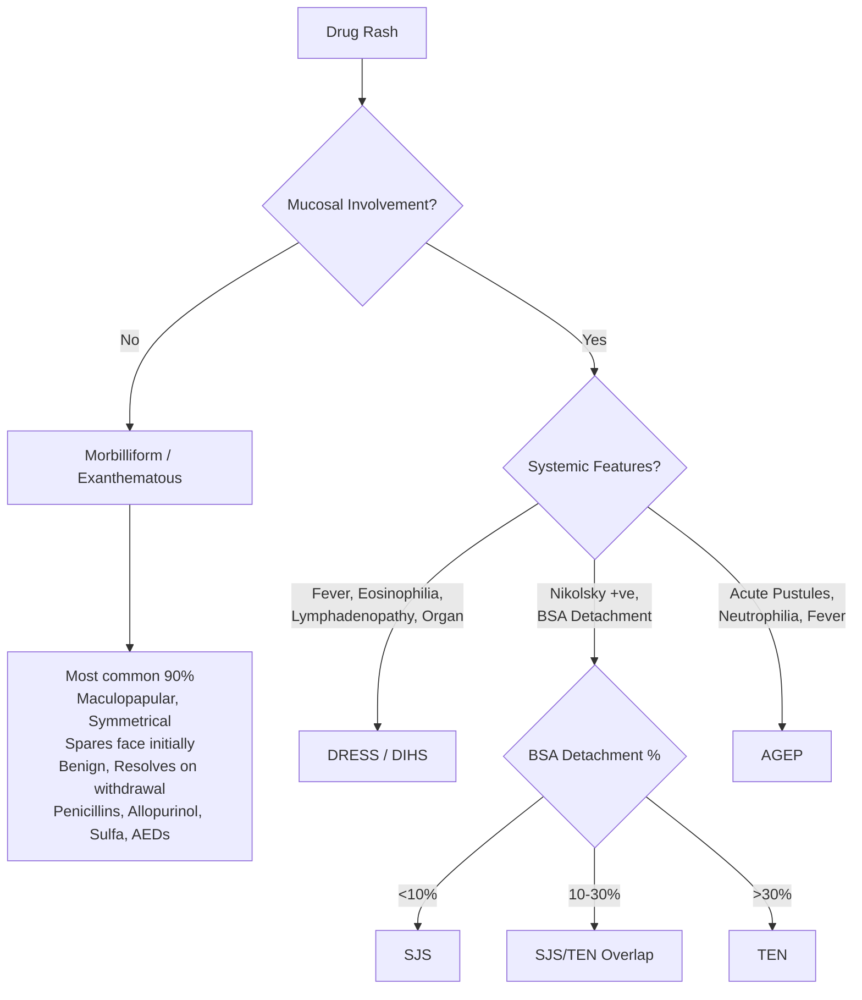
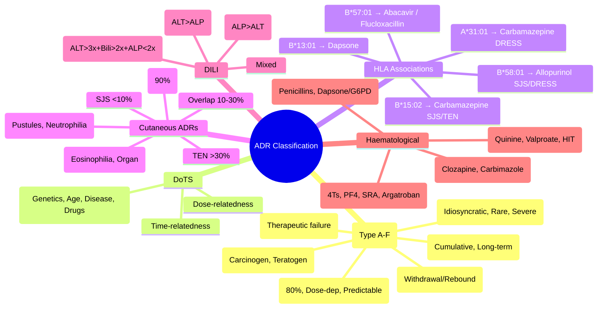

# Adverse Drug Reaction Classification

> [!tip] **FCPS/MRCP Priority: HIGH**
> **Exam staple:** Type A vs B distinction, DoTS framework, HLA screening indications, Cutaneous ADR spectrum (Morbilliform → SJS/TEN → DRESS → AGEP), Hy's Law, HIT 4Ts score.
> Viva: *"A patient on carbamazepine develops fever, rash, eosinophilia, hepatitis at week 3. Diagnosis? Which HLA?"*

---

## 1. Learning Objectives
By the end of this note you should be able to:
- [ ] Classify ADRs using **Rawlins-Thompson (Type A-F)** and **DoTS** systems
- [ ] Distinguish **Type A (Augmented)** vs **Type B (Bizarre)** with examples
- [ ] Identify **HLA associations** for severe cutaneous ADRs (SJS/TEN, DRESS)
- [ ] Recognise **cutaneous ADR spectrum** and apply RegiSCAR/EuroSCAR/SCORTEN
- [ ] Apply **Hy's Law** for DILI risk stratification
- [ ] Calculate **4Ts score** for Heparin-Induced Thrombocytopenia (HIT)

---

## 2. Rawlins-Thompson Classification (Type A-F)

| Type | Name | Mechanism | Frequency | Dose-Dependent | Predictable | Reversibility | Key Examples |
|------|------|-----------|-----------|----------------|-------------|---------------|--------------|
| **A** | **Augmented** | Exaggerated pharmacological effect | **~80%** | **Yes** | **Yes** | On dose reduction | Hypoglycaemia (Insulin/SU), Bleeding (Warfarin), Bradycardia (β-blockers), Postural hypotension (ACEi/α-blockers), Diarrhoea (Metformin), Sedation (Antihistamines/Opioids) |
| **B** | **Bizarre** | Idiosyncratic/Immunological (not pharmacological) | **Rare** | No | No | Often irreversible | Anaphylaxis, **SJS/TEN**, **DRESS**, **AGEP**, **HIT**, Agranulocytosis, DILI, Pulmonary fibrosis (Bleomycin), Stevens-Johnson |
| **C** | **Chronic** | Cumulative tissue damage with long-term use | Uncommon | Yes (Cumulative) | Yes | Often irreversible | Steroid osteoporosis, Phenytoin gum hyperplasia, Amiodarone corneal deposits, Chloroquine retinopathy, NSAID nephropathy |
| **D** | **Delayed** | Carcinogenesis / Teratogenesis (latent) | Rare | No (Latent) | No | Irreversible | DES vaginal adenocarcinoma, Thalidomide phocomelia, Cyclophosphamide bladder cancer, Radiotherapy second malignancies |
| **E** | **End of Use** | Withdrawal / Rebound reactions | Uncommon | No | Yes | Reversible on restart/taper | **Benzodiazepine withdrawal**, **Steroid adrenal crisis**, **SSRI discontinuation**, **Beta-blocker rebound tachycardia**, **Opioid withdrawal**, **Clonidine rebound HTN** |
| **F** | **Failure** | Therapeutic failure (inefficacy) | Variable | No | No | N/A | Antibiotic resistance, Drug interactions reducing efficacy, Non-adherence, Malabsorption |

---

## 3. DoTS Classification (Dose, Time, Susceptibility)

> **DoTS** = **D**ose-relatedness, **T**ime-relatedness, **S**usceptibility factors

| Dimension | Description | Examples |
|-----------|-------------|----------|
| **Dose** | Dose-dependent (Type A) vs Independent (Type B) | Type A: ↑ dose → ↑ ADR; Type B: No dose relationship |
| **Time** | Immediate, Early, Delayed, Late, Withdrawal | Immediate: Anaphylaxis; Early: Nausea (1-2wk); Delayed: DRESS (2-8wk); Late: Steroid osteoporosis; Withdrawal: BZD, Steroids |
| **Susceptibility** | **Genetics, Age, Disease, Concomitant Drugs** | **HLA-B*15:02** (Carbamazepine SJS), **HLA-B*58:01** (Allopurinol SJS/DRESS), **CYP2C9*3** (Warfarin sensitivity), Elderly (↑ Type A), CKD (↑ accumulation), Polypharmacy (↑ interactions) |

### Susceptibility Factors — High Yield
| Factor | Impact |
|--------|--------|
| **Genetics (Pharmacogenomics)** | HLA alleles (SJS/TEN), CYP polymorphisms (Warfarin, Clopidogrel, Codeine), TPMT (Azathioprine/6-MP), G6PD (Dapsone/Oxidative drugs), NAT2 (Isoniazid) |
| **Age** | Elderly: ↓ Renal/hepatic clearance, ↑ Vd (lipophilic), ↑ Sensitivity (CNS, Anticholinergic), Polypharmacy; Neonates: Immature metabolism (Chloramphenicol grey baby) |
| **Disease** | Renal impairment (↑ Renally cleared drugs), Hepatic impairment (↑ Hepatically cleared), Heart failure (↓ Clearance), Hypoalbuminaemia (↑ Free drug) |
| **Concomitant Drugs** | CYP inhibitors/inducers, Protein binding displacement, Additive toxicity (e.g., Triple Whammy, Serotonin syndrome) |
| **Pregnancy** | Altered PK (↑ Vd, ↑ GFR, ↑ CYP3A4), Teratogenicity risk (Type D) |

---

## 4. Key HLA Associations (Exam Favourites)

| Drug | HLA Allele | ADR | Population | Screening Recommendation |
|------|------------|-----|------------|--------------------------|
| **Carbamazepine** | **HLA-B*15:02** | SJS/TEN | **Han Chinese, Thai, SE Asian** (>90% PPV) | **Mandatory pre-treatment screening** (FDA, MHRA, EMA) |
| **Carbamazepine** | HLA-A*31:01 | DRESS, maculopapular | European, Japanese | Consider screening (NPV >99%) |
| **Allopurinol** | **HLA-B*58:01** | SJS/TEN, DRESS | **Han Chinese, Korean, Thai, European** | **Strongly recommended** before starting (especially CKD) |
| **Abacavir** | **HLA-B*57:01** | Hypersensitivity (Fever, Rash, GI, Resp) | **Caucasian, African** | **Mandatory** before abacavir (NHS, FDA) |
| **Flucloxacillin** | HLA-B*57:01 | DILI (Cholestatic) | European | Not routine (Low PPV); Awareness |
| **Dapsone** | HLA-B*13:01 | Dapsone Hypersensitivity Syndrome | Chinese | Consider in high-prevalence populations |
| **Lamotrigine** | HLA-B*38:02 (weak) | SJS/TEN | — | Not routine; Slow titration key |
| **Nevirapine** | HLA-DRB1*01:01 | SJS/TEN, Hepatitis | African | Screen in some guidelines |

**Pearl:** **HLA-B*58:01 for Allopurinol** — Screen before starting in high-risk populations (Asian, CKD); **HLA-B*15:02 for Carbamazepine** — Mandatory in SE Asian ancestry.

---

## 5. Cutaneous ADR Spectrum (RegiSCAR / EuroSCAR / SCORTEN)

### Cutaneous ADR Comparison

| Feature | **Morbilliform** | **SJS** | **SJS/TEN Overlap** | **TEN** | **DRESS** | **AGEP** |
|---------|------------------|---------|---------------------|---------|-----------|----------|
| **BSA Detachment** | None | **<10%** | **10-30%** | **>30%** | Variable (oedematous) | None (Pustules) |
| **Mucosal Involvement** | Rare | **Yes (≥2 sites)** | **Yes** | **Yes (≥2 sites)** | Common | Rare |
| **Systemic Features** | Mild/None | Fever, Malaise | Fever, Malaise | Severe sepsis picture | **Fever, Eosinophilia, Lymphadenopathy, Organ (Liver>Kidney>Lung)** | Fever, Neutrophilia |
| **Histology** | Vacuolar interface | **Full-thickness necrosis** | Full-thickness | Full-thickness | Interface + Eosinophils | **Subcorneal pustules + Neutrophils** |
| **Latency** | 1-2 weeks | 1-3 weeks | 1-3 weeks | 1-3 weeks | **2-8 weeks (Longer)** | **1-5 days (Short)** |
| **Key Drugs** | Penicillins, Allopurinol, Sulfa, AEDs | **Allopurinol, Carbamazepine, Lamotrigine, Phenytoin, Sulfa, Nevirapine, Oxicams** | Same as SJS/TEN | Same | **Allopurinol, AEDs, Sulfa, Minocycline, Abacavir, Allopurinol** | **β-lactams, Macrolides, Hydroxychloroquine, Diltiazem** |
| **Mortality** | <1% | **~5%** | **~15-20%** | **30-50%** | **~10%** | <5% |

### SCORTEN (TEN Prognostic Score) — 1 point each
1. Age >40
2. Malignancy
3. Tachycardia >120
4. BSA detachment >10%
5. Serum Urea >10 mmol/L
6. Bicarbonate <20 mmol/L
7. Glucose >14 mmol/L

| Score | Mortality Risk |
|-------|----------------|
| 0-1 | **3.2%** |
| 2 | **12.1%** |
| 3 | **35.3%** |
| 4 | **58.3%** |
| ≥5 | **>90%** |

### RegiSCAR Criteria for DRESS (Diagnostic)
**Definite:** ≥3 of 4 stars + 1 of 4 systemic + Exclusion
- **Stars:** Fever >38°C, Lymphadenopathy, Eosinophilia (>1.5 or >20%), Organ involvement (Liver, Kidney, Lung)
- **Systemics:** Atypical lymphocytes, Viral reactivation (HHV-6), HLA association, >15d latency

---

## 6. Hepatic ADRs (DILI Patterns) & Hy's Law

### DILI Patterns
| Pattern | Biochemistry | Key Drugs | Latency | Prognosis |
|---------|--------------|-----------|---------|-----------|
| **Hepatocellular** | **ALT/AST** >5x ULN | Paracetamol, Isoniazid, Halothane, Valproate, Methotrexate, Niacin, **Herbal (Kava, Germander)** | Variable | Acute liver failure risk (Paracetamol, Idiosyncratic) |
| **Cholestatic** | **ALP/GGT** >2x ULN | **Amoxicillin-Clavulanate, Flucloxacillin, Chlorpromazine, Azathioprine, Anabolic steroids, OCP** | Longer (weeks-months) | Prolonged recovery, rarely fatal |
| **Mixed** | Both ↑ ALT & ALP | Ciprofloxacin, Cotrimoxazole, Phenytoin, Carbamazepine | Intermediate | Variable |

### Hy's Law — **Regulatory Red Flag**
> **ALT/AST >3x ULN + Total Bilirubin >2x ULN + ALP <2x ULN (No cholestasis)**
> **→ 10-50% Mortality / Transplant**
> **→ Triggers FDA/EMA action: Boxed warning, Restriction, Withdrawal**

**Mechanism:** Mitochondrial injury + Bile salt export pump (BSEP) inhibition → Impaired bilirubin excretion + Hepatocellular necrosis

---

## 7. Haematological ADRs — HIT (High Yield)

### Heparin-Induced Thrombocytopenia (HIT)
- **Mechanism:** IgG anti-PF4/Heparin complexes → Activate platelets → Thrombocytopenia + **Paradoxical THROMBOSIS** (Arterial > Venous)
- **Timing:** Typically **Day 5-14** (or Day 1-2 if prior exposure <100d)
- **4Ts Score (Pre-test Probability):**

| Category | 2 Points | 1 Point | 0 Points |
|----------|----------|---------|----------|
| **Thrombocytopenia** | >50% fall, nadir ≥20 | 30-50% fall, nadir 10-19 | <30% fall, nadir <10 |
| **Timing** | 5-10d, or ≤1d (past exposure) | >10d, or ≤1d (no past) | <5d (no past) |
| **Thrombosis** | New thrombosis | Progressive/recurrent | None |
| **Other Causes** | None apparent | Possible | Definite |

| Score | Probability | Action |
|-------|-------------|--------|
| **≥6 (High)** | **>90%** | **Stop Heparin, Start alternative (Argatroban/Bivalirudin/Fondaparinux), Confirm with Anti-PF4 ELISA + SRA** |
| **4-5 (Intermediate)** | 10-20% | Stop Heparin, Start alternative, Test |
| **≤3 (Low)** | <1% | Continue Heparin, Monitor platelets |

**Diagnosis:** **Anti-PF4 ELISA** (High sensitivity) → **SRA (Serotonin Release Assay)** (Gold standard, High specificity)

**Management:** **STOP ALL HEPARIN (UFH/LMWH)** → **Non-heparin anticoagulant** (Argatroban IV, Bivalirudin IV, Fondaparinux SC, DOACs off-label) → **NO Warfarin until platelets >150** (Warfarin necrosis risk) → Platelet count daily → Transition to Warfarin/DOAC after recovery.

---

## 8. FCPS/MRCP High-Yield Summary

| Topic | Key Points |
|-------|------------|
| **Type A vs B** | A: Dose-dependent, Predictable, Common (80%); B: Idiosyncratic, Non-dose-dependent, Rare, Severe |
| **DoTS** | Dose, Time, Susceptibility (Genetics, Age, Disease, Drugs) |
| **HLA-B*15:02** | Carbamazepine → SJS/TEN (SE Asian) — **Screen mandatory** |
| **HLA-B*58:01** | Allopurinol → SJS/TEN/DRESS (Asian, CKD) — **Screen recommended** |
| **HLA-B*57:01** | Abacavir → Hypersensitivity; Flucloxacillin → DILI |
| **Cutaneous Spectrum** | Morbilliform (90%) → SJS (<10%) → Overlap (10-30%) → TEN (>30%) → DRESS (Eosinophilia, Organ) → AGEP (Pustules, Neutrophilia) |
| **SCORTEN** | 7 variables → Mortality risk (0-1: 3%; ≥5: >90%) |
| **Hy's Law** | ALT>3x + Bilirubin>2x + ALP<2x → 10-50% mortality |
| **HIT 4Ts** | ≥6 High → Stop heparin, Start non-heparin anticoag, Test PF4/SRA |
| **Type C** | Chronic toxicity (Steroid osteoporosis, Phenytoin gums, Amiodarone deposits) |
| **Type D** | Delayed (Carcinogenesis, Teratogenesis) |
| **Type E** | Withdrawal (BZD, Steroid, SSRI, Beta-blocker, Opioid, Clonidine) |
| **Type F** | Failure (Resistance, Interactions, Non-adherence) |

---

## 9. Viva Questions (MRCP PACES / FCPS)

| Question | Expected Answer |
|----------|-----------------|
| **Classify this ADR: 65M on warfarin presents with INR 8.5, no bleeding.** | **Type A (Augmented)** — Dose-dependent, predictable, exaggerated pharmacological effect (anticoagulation) |
| **25F on carbamazepine 3 weeks: fever, rash, mucosal ulcers, eosinophilia, hepatitis. Diagnosis? HLA?** | **DRESS** (Latency 2-8w, eosinophilia, organ involvement); **HLA-B*58:01** (Allopurinol) — *Correction: Carbamazepine DRESS = HLA-A*31:01; SJS/TEN = B*15:02* |
| **Carbamazepine SJS — which HLA? In which population screen?** | **HLA-B*15:02**; **Han Chinese, Thai, SE Asian** — Mandatory pre-treatment screening |
| **Allopurinol started in 60M with CKD. 4 weeks later: fever, rash, facial oedema, eosinophilia, ALT 800. Diagnosis? Prevention?** | **DRESS** (Latency, eosinophilia, organ); **Pre-screen HLA-B*58:01** before starting allopurinol in Asian/CKD |
| **TEN — SCORTEN variables? Score 3 = ?** | Age>40, Malignancy, HR>120, BSA>10%, Urea>10, Bicarb<20, Glucose>14; **Score 3 = 35% mortality** |
| **Hy's Law — criteria and significance?** | **ALT/AST>3x ULN + Bilirubin>2x ULN + ALP<2x ULN** → **10-50% mortality/transplant** → Regulatory action |
| **HIT — typical timing? 4Ts high probability management?** | **Day 5-14** (or sooner if prior exposure); **4Ts ≥6: Stop ALL heparin, Start Argatroban/Bivalirudin/Fondaparinux, Anti-PF4 ELISA + SRA, No warfarin until platelets >150** |
| **Type E ADR examples?** | **Benzodiazepine withdrawal, Steroid adrenal crisis, SSRI discontinuation, Beta-blocker rebound tachycardia, Opioid withdrawal, Clonidine rebound HTN** |

---

## 10. Confusions & Mnemonics

| Confusion | Clarification |
|-----------|---------------|
| **SJS vs TEN vs Overlap** | **BSA detachment:** SJS <10%, Overlap 10-30%, TEN >30% — **Spectrum, not distinct diseases** |
| **DRESS vs SJS/TEN** | DRESS: **Longer latency (2-8w), Eosinophilia, Lymphadenopathy, Organ involvement (Liver)**; SJS/TEN: **Nikolsky +ve, Epidermal detachment, No eosinophilia** |
| **HIT vs HAT** | **HIT:** Immune, PF4 antibodies, **Thrombosis**; **HAT (Heparin-associated thrombocytopenia):** Non-immune, Transient, Day 1-4, **No thrombosis** |
| **Hy's Law vs Cholestatic DILI** | Hy's Law = **Hepatocellular** (ALT>3x, Bilirubin>2x, ALP<2x); Cholestatic = ALP>2x, Bilirubin ↑ later |
| **Type C vs Type A** | Type C = **Chronic/Cumulative** (Steroid osteoporosis after months-years); Type A = **Acute dose-dependent** |

**Mnemonic: ADR-TYPE**
- **A**ugmented = **Dose-dependent, Predictable, Common** (80%)
- **B**izarre = **Idiosyncratic, Rare, Severe** (SJS, HIT, DRESS)
- **C**hronic = **Cumulative** (Steroid bones, Phenytoin gums)
- **D**elayed = **Carcinogenesis, Teratogenesis** (Latent)
- **E**nd of use = **Withdrawal** (BZD, Steroid, SSRI, β-blocker)
- **F**ailure = **Inefficacy** (Resistance, Interactions)

**Mnemonic: SCORTEN-7**
- **S** (Site: BSA>10%)
- **C** (Cancer/Malignancy)
- **O** (Old age >40)
- **R** (Rate: HR>120)
- **T** (i**T**er: Urea>10)
- **E** (Electrolytes: Bicarb<20)
- **N** (Gluco**N**eogenesis: Glucose>14)

---

## 11. Mind Map

---

## 12. Spaced Repetition Trackers

| Review Interval | Date Completed | Confidence (1-5) | Notes |
|-----------------|----------------|------------------|-------|
| 24 hours | | | |
| 7 days | | | |
| 15 days | | | |
| 30 days | | | |
| 90 days | | | |

---

## 13. Self-Test Scorecard

| Section | Score /5 | Last Attempt |
|---------|----------|--------------|
| Type A-F Classification | | |
| DoTS Framework | | |
| HLA Associations | | |
| Cutaneous ADR Spectrum | | |
| SCORTEN | | |
| Hy's Law | | |
| HIT 4Ts & Management | | |
| Type C/D/E/F | | |

---

## 14. Exam Answer Modes

### Long Answer Skeleton
1. Define ADR (WHO)
2. Classify using Type A-F + DoTS
3. Apply to clinical vignette
4. Mention relevant HLA if cutaneous/severe
5. Management: Stop drug, Supportive, Specific (Steroids, Argatroban, etc.)

### Short Note Skeleton
- **Type A:** Dose-dep, Predictable, 80% (Hypoglycaemia, Bleeding)
- **Type B:** Idiosyncratic, Non-dose-dep, Rare (SJS, HIT, DRESS)
- **HLA-B*15:02** = Carbamazepine SJS (SE Asian)
- **HLA-B*58:01** = Allopurinol SJS/DRESS
- **Hy's Law:** ALT>3x + Bilirubin>2x → 10-50% mortality
- **HIT 4Ts ≥6:** Stop heparin, Non-heparin anticoag, PF4/SRA

### Viva One-Liners
- "Type A = 80% of ADRs, predictable, dose-dependent; Type B = idiosyncratic, rare, severe"
- "HLA-B*15:02 for carbamazepine SJS in SE Asians — screen before prescribing"
- "Hy's Law = hepatocellular injury with jaundice → 10-50% mortality"
- "HIT = Day 5-14, thrombosis paradoxical, 4Ts score, stop heparin, argatroban"

### Ward-Case Discussion Points
- New rash on drug → STOP drug, Photograph, Classify (Morbilliform vs SJS/TEN vs DRESS vs AGEP)
- Allopurinol in Asian/CKD → **Always check HLA-B*58:01 first**
- Heparin → Check platelets Day 1, 4, 7, 14; 4Ts if thrombocytopenia
- DILI → Hy's Law criteria → Urgent hepatology referral

### Last-Night-Before-Exam Sheet
- **A-F:** Augmented, Bizarre, Chronic, Delayed, End-use, Failure
- **DoTS:** Dose, Time, Susceptibility (Genetics, Age, Disease, Drugs)
- **HLA:** B*15:02(CBZ), B*58:01(Allo), B*57:01(Abacavir), A*31:01(CBZ DRESS)
- **Cutaneous:** Morbilliform(90%) → SJS(<10%) → O(10-30%) → TEN(>30%) / DRESS(eos, organ) / AGEP(pustules)
- **SCORTEN:** Age>40, Ca, HR>120, BSA>10%, Urea>10, Bicarb<20, Glc>14
- **Hy's Law:** ALT>3x + Bili>2x + ALP<2x = BAD
- **HIT:** 4Ts ≥6 → Stop Heparin, Argatroban, PF4+SRA, No Warfarin

---

## 15. Summary
ADR classification uses **Type A-F** (Rawlins-Thompson) and **DoTS** frameworks. **Type A (80%)** are dose-dependent, predictable; **Type B** are idiosyncratic, rare, severe. **HLA screening** prevents SJS/TEN/DRESS for carbamazepine (B*15:02), allopurinol (B*58:01), abacavir (B*57:01). **Cutaneous ADR spectrum** ranges from morbilliform (90%) to SJS/TEN (mortality up to 50% TEN) to DRESS (eosinophilia + organ) to AGEP (pustules). **Hy's Law** identifies DILI with high mortality. **HIT** diagnosed by 4Ts, confirmed by PF4/SRA, treated with non-heparin anticoagulants.

---

## 16. MCQs (10)
1. **Which ADR type accounts for ~80% of all ADRs?**
   A. Type B  B. **Type A**  C. Type C  D. Type D
2. **HLA-B*15:02 screening is mandatory before prescribing:**
   A. Allopurinol  B. **Carbamazepine**  C. Abacavir  D. Flucloxacillin
3. **SJS vs TEN differentiation is based on:**
   A. Mucosal sites  B. **BSA detachment %**  C. Eosinophilia  D. Latency
4. **Hy's Law criteria:**
   A. ALT>2x + Bili>3x  B. **ALT>3x + Bili>2x + ALP<2x**  C. ALP>3x + Bili>2x  D. ALT>5x alone
5. **HIT typical timing:**
   A. Day 1-2  B. Day 3-4  C. **Day 5-14**  D. Day 21-28
6. **4Ts score ≥6 indicates:**
   A. Low probability  B. Intermediate  C. **High probability**  D. Excluded
7. **Management of confirmed HIT:**
   A. Continue LMWH, add warfarin  B. **Stop ALL heparin, Start argatroban/bivalirudin/fondaparinux**  C. Switch to UFH  D. Platelet transfusion
8. **DRESS vs SJS/TEN — key differentiator:**
   A. Mucosal involvement  B. **Eosinophilia + Organ involvement (Liver)**  C. Nikolsky sign  D. BSA detachment
9. **Type E ADR example:**
   A. Hypoglycaemia on insulin  B. SJS on carbamazepine  C. **SSRI discontinuation syndrome**  D. Antibiotic resistance
10. **SCORTEN variable NOT included:**
    A. Age >40  B. **WBC count**  C. HR >120  D. BSA >10%

---

## 17. SBA Questions (10)
1. **45M Han Chinese, new epilepsy. Before starting carbamazepine, which test?**
   A. HLA-B*27  B. **HLA-B*15:02**  C. HLA-B*58:01  D. HLA-B*57:01
2. **60F on allopurinol 3 weeks: fever, rash, eosinophilia 2.5, ALT 450, creatinine 180. Diagnosis?**
   A. SJS  B. **DRESS**  C. AGEP  D. Morbilliform
3. **Patient on UFH post-op day 7: platelets 80 (was 250), new DVT. 4Ts = ?**
   A. 3 (Low)  B. 4 (Int)  C. **6 (High)**  D. 5 (Int)
4. **TEN with SCORTEN 4. Mortality risk?**
   A. 12%  B. 35%  C. **58%**  D. >90%
5. **Drug causing Hy's Law pattern (ALT>3x, Bili>2x, ALP<2x) — highest risk?**
   A. Amoxicillin-clavulanate  B. Flucloxacillin  C. **Paracetamol overdose**  D. OCP
6. **HIT confirmed. When can warfarin be started?**
   A. Immediately with heparin overlap  B. **Platelets >150**  C. Day 5 of argatroban  D. After 48h fondaparinux
7. **AGEP typical latency:**
   A. 2-8 weeks  B. **1-5 days**  C. 1-3 weeks  D. >8 weeks
8. **Which is Type C ADR?**
   A. Bleeding on warfarin  B. SJS on carbamazepine  C. **Osteoporosis on long-term prednisolone**  D. Thalidomide phocomelia
9. **Clozapine monitoring — FBC frequency initial 18 weeks?**
   A. Daily  B. **Weekly**  C. Fortnightly  D. Monthly
10. **Teratogenic ADR = Type ?**
    A. Type A  B. Type B  C. Type C  D. **Type D**

---

## 18. Flashcards
- Q: **Type A vs Type B — one liner?**
  A: **A = Dose-dep, Predictable, 80%; B = Idiosyncratic, Non-dose, Rare, Severe**
- Q: **HLA for carbamazepine SJS?**
  A: **HLA-B*15:02** (SE Asian)
- Q: **HLA for allopurinol SJS/DRESS?**
  A: **HLA-B*58:01** (Asian, CKD)
- Q: **Hy's Law?**
  A: **ALT>3x + Bili>2x + ALP<2x → 10-50% mortality**
- Q: **HIT 4Ts high prob → Action?**
  A: **Stop heparin, Non-heparin anticoag (Argatroban), PF4+SRA, No warfarin until plt>150**
- Q: **SCORTEN 7 variables?**
  A: Age>40, Ca, HR>120, BSA>10%, Urea>10, Bicarb<20, Glc>14

---

## 19. Answer Key with Explanations

### MCQs
1. **B** — Type A (Augmented) = 80% of ADRs, dose-dependent, predictable
2. **B** — Carbamazepine SJS/TEN in SE Asian = HLA-B*15:02 (Mandatory screening)
3. **B** — BSA detachment defines SJS (<10%), Overlap (10-30%), TEN (>30%)
4. **B** — Hy's Law: ALT>3x ULN + T.Bili>2x ULN + ALP<2x ULN
5. **C** — HIT typically Day 5-14 (or sooner if prior exposure <100d)
6. **C** — 4Ts ≥6 = High probability (>90%)
7. **B** — Stop ALL heparin; Non-heparin anticoag (Argatroban/Bivalirudin/Fondaparinux); NO warfarin until platelets >150
8. **B** — DRESS has eosinophilia and organ involvement (liver); SJS/TEN has Nikolsky, detachment
9. **C** — Type E = End of use (Withdrawal): SSRI discontinuation, BZD withdrawal, Steroid crisis
10. **B** — WBC count not in SCORTEN (Age, Cancer, HR, BSA, Urea, Bicarb, Glucose)

### SBAs
1. **B** — HLA-B*15:02 for carbamazepine SJS/TEN in Han Chinese/SE Asian
2. **B** — DRESS: Latency 2-8w, Fever, Eosinophilia, Lymphadenopathy, Organ (Liver) involvement
3. **C** — 4Ts: Thrombocytopenia >50% (2), Timing 5-10d (2), Thrombosis new (2), Other causes none (2) = 8 (High)
4. **C** — SCORTEN 4 = 58.3% mortality
5. **C** — Paracetamol overdose = Hepatocellular Hy's Law pattern; Amox-clav/Fluclox = Cholestatic
6. **B** — Warfarin only after platelets >150 (avoid warfarin necrosis)
7. **B** — AGEP latency 1-5 days (vs DRESS 2-8w, SJS/TEN 1-3w)
8. **C** — Type C = Chronic cumulative (Steroid osteoporosis, Phenytoin gums, Amiodarone deposits)
9. **B** — Clozapine FBC: Weekly ×18w, Fortnightly ×1yr, Monthly thereafter
10. **D** — Type D = Delayed (Carcinogenesis, Teratogenesis)

---

## 20. Local Navigation
- **Parent Heading**: [[ADRs|ADRs]]
- **Chapter Map**: [[Davidson Chapter 2 - Clinical Therapeutics Hierarchy|Chapter 2 Hierarchy]]
- **Chapter MOC**: [[Clinical Therapeutics and Good Prescribing MOC]]
- **Related**: [[Causality Assessment]], [[Pharmacovigilance]], [[Cutaneous ADRs]], [[Hepatic ADRs]], [[HIT]], [[SJS TEN]], [[DRESS]], [[AGEP]], [[DILI Patterns]], [[HLA Associations]]
