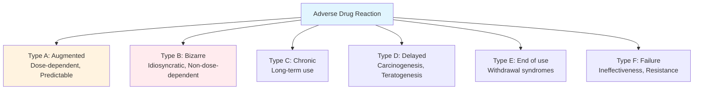
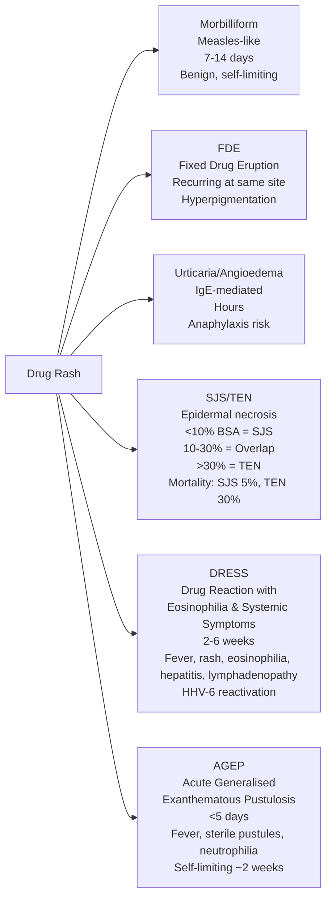
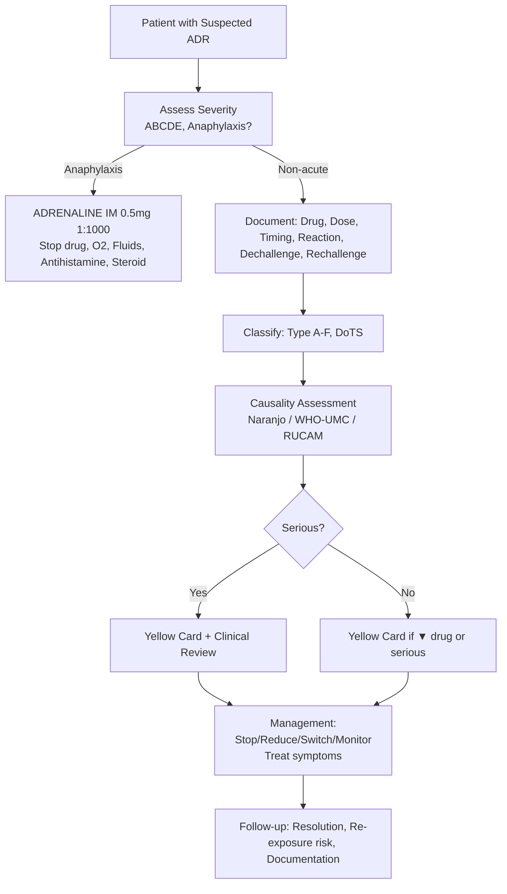
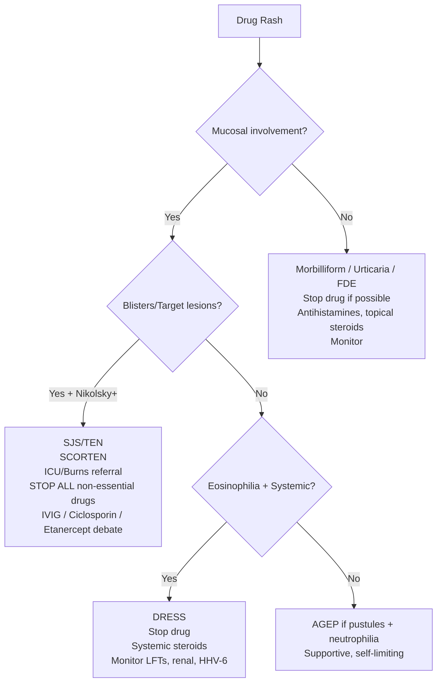
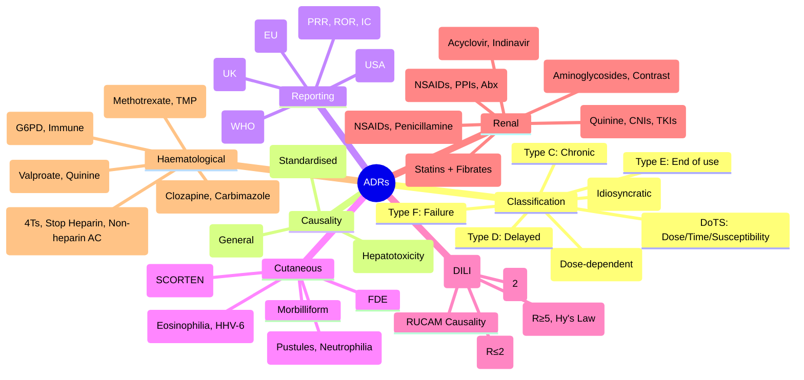

# Adverse Drug Reactions (ADRs)

> [!tip] **FCPS/MRCP Priority: HIGHEST**
> **Daily clinical practice + exam staple.** Must know Type A vs B distinction, causality tools (Naranjo for exams, RUCAM for hepatotoxicity), and Yellow Card reporting. System-specific patterns (SJS/TEN, DILI, HIT, AIN) are high-yield for vivas and SBAs.
> Viva classic: *"Patient on allopurinol develops fever, rash, eosinophilia, hepatitis — what ADR? Classification? Causality? Management?"*

---

## 1. Learning Objectives

By the end of this note you should be able to:
- [ ] Classify ADRs using **Type A-F (Rawlins/Thompson)** and **DoTS (Dose, Time, Susceptibility)**
- [ ] Apply **causality assessment**: Naranjo (general), WHO-UMC (standardised), RUCAM (hepatotoxicity)
- [ ] Report ADRs via **Yellow Card (UK)**, understand EudraVigilance, FAERS, VigiBase
- [ ] Recognise **system-specific ADR patterns**: Cutaneous (SJS/TEN/DRESS/AGEP), Hepatic (DILI), Renal (AIN/crystal/ATN), Haematological (HIT/agranulocytosis/thrombocytopenia)
- [ ] Distinguish **ADR vs medication error vs ADE**
- [ ] Answer viva: "Type A vs B", "Naranjo scoring", "SJS vs TEN vs DRESS", "DILI patterns", "HIT 4Ts"

---

## 2. Core Concept: ADR Definitions & Taxonomy

> **ADR (WHO):** *A response to a drug which is noxious and unintended, occurring at doses normally used in man for prophylaxis, diagnosis, or therapy.*

### ADR vs ADE vs Medication Error

| Term | Definition | Key Distinction |
|------|------------|-----------------|
| **ADR** | Noxious, unintended response at normal doses | **Not preventable** (inherent to drug) |
| **ADE** (Adverse Drug Event) | Any injury from drug use (includes ADRs + errors) | Broader — includes preventable harm |
| **Medication Error** | Preventable event causing inappropriate use | **Preventable** — system/human failure |

---

## 3. ADR Classification Systems

### 2.1 Rawlins & Thompson (Type A-F) — Exam Standard

| Type | Name | Characteristics | Examples | Management |
|------|------|-----------------|----------|------------|
| **A** | **Augmented** | Dose-dependent, Predictable, Common, Related to pharmacological action | Hypoglycaemia (insulin), Bleeding (warfarin), Bradycardia (beta-blockers), Constipation (opioids) | **Dose reduction**, monitoring, drug substitution |
| **B** | **Bizarre** | Non-dose-dependent, Unpredictable, Rare, Idiosyncratic/Allergic | Anaphylaxis (penicillin), SJS/TEN (allopurinol), DILI (isoniazid), Agranulocytosis (clozapine) | **Drug withdrawal**, avoidance, cross-reactivity awareness |
| **C** | **Chronic** | Long-term therapy, Dose/time related | Osteoporosis (steroids), Tardive dyskinesia (antipsychotics), Nephropathy (analgesics), Cataracts (steroids) | **Prophylaxis**, monitoring, lowest effective dose |
| **D** | **Delayed** | Latent period, Carcinogenesis/Teratogenesis | Vaginal adenocarcinoma (DES), Leukaemia (alkylators), Phocomelia (thalidomide) | **Risk-benefit**, counselling, contraception, surveillance |
| **E** | **End of use** | Withdrawal/Rebound syndromes | Adrenal crisis (steroids), Rebound hypertension (clonidine), Seizures (benzos), SSRI discontinuation | **Gradual taper**, patient education |
| **F** | **Failure** | Unexpected loss of efficacy | Antibiotic resistance, Insulin antibody resistance, Paradoxical reactions | **Suspected resistance**, switch class, check adherence |

> **Exam Pearl:** *Type A = "Augmented" = dose-related = predictable. Type B = "Bizarre" = idiosyncratic = unpredictable. Together = 80-90% of ADRs.*

### 2.2 DoTS Classification (Dose, Time, Susceptibility) — Mechanistic

| Dimension | Categories | Example |
|-----------|------------|---------|
| **Dose** | **Toxic** (supratherapeutic) — Paracetamol overdose **Collateral** (therapeutic dose, off-target) — Opioid constipation **Hypersusceptibility** (normal dose, exaggerated) — G6PD haemolysis with dapsone | Mechanistic insight for prevention |
| **Time** | **Rapid** (minutes-hours) — Anaphylaxis **First-dose** — ACEi hypotension **Early** (days-weeks) — SJS/TEN **Intermediate** (weeks-months) — DILI **Late** (months-years) — Tardive dyskinesia, carcinogenesis | Guides monitoring timeline |
| **Susceptibility** | **Genetic** — HLA-B*58:01 (allopurinol SJS), TPMT (azathioprine myelosuppression), CYP2C9*3 (warfarin) **Physiological** — Renal/hepatic impairment, pregnancy, age **Disease** — HIV (↑ cutaneous ADRs), EBV (ampicillin rash) **Drug interactions** — CYP inhibition → toxicity | Personalised prescribing |

> **DoTS Advantage:** *Mechanistic — guides prevention (dose adjustment, genotyping, avoidance in susceptible).*

---

## 4. Causality Assessment Tools

### 3.1 Naranjo Algorithm — General ADR Causality (Exam Favourite)

| Question | Yes | No | Do Not Know |
|----------|-----|----|-------------|
| 1. Previous conclusive reports? | +1 | 0 | 0 |
| 2. Event after drug given? | +2 | -1 | 0 |
| 3. Improved on dechallenge? | +1 | 0 | 0 |
| 4. Reappeared on rechallenge? | +2 | -1 | 0 |
| 5. Alternative causes? | -1 | +2 | 0 |
| 6. Reaction on placebo? | -1 | +1 | 0 |
| 7. Drug in body fluids toxic range? | +1 | 0 | 0 |
| 8. Reaction dose-related? | +1 | 0 | 0 |
| 9. Similar reaction to similar drugs? | +1 | 0 | 0 |
| 10. Objective evidence? | +1 | 0 | 0 |

#### Score Interpretation

| Score | Category |
|-------|----------|
| **≥9** | **Definite** |
| **5–8** | **Probable** |
| **1–4** | **Possible** |
| **≤0** | **Doubtful** |

> **Viva Key:** *"Naranjo is a structured 10-question tool. ≥9 = Definite, 5-8 = Probable, 1-4 = Possible, ≤0 = Doubtful. Used for general ADRs. For hepatotoxicity, use RUCAM."*

### 3.2 WHO-UMC Standardised Case Causality Assessment

| Category | Criteria |
|----------|----------|
| **Certain** | Plausible time, +dechallenge, +rechallenge, no alternative cause |
| **Probable/Likely** | Plausible time, +dechallenge, unlikely alternative cause |
| **Possible** | Plausible time, dechallenge unclear, alternative cause possible |
| **Unlikely** | Implausible time, alternative cause more likely |
| **Conditional/Unclassified** | More data needed |
| **Unassessable** | Insufficient information |

### 3.3 RUCAM (Roussel Uclaf Causality Assessment Method) — Hepatotoxicity Specific

| Domain | Scoring |
|--------|---------|
| **Time to onset** (from drug start) | 5-90 days = +2; <5 or >90 = +1; <1 or >180 = 0 |
| **Course after cessation** | Decrease ≥50% in 8d = +3; Decrease ≥50% in 30d = +2; No info = 0; Persistent = -2 |
| **Risk factors** | Alcohol = +1; Age ≥55 = +1 |
| **Concomitant drugs** | None = 0; Possible hepatotoxin = -1; Known hepatotoxin = -2; +dechallenge for concomitant = -3 |
| **Exclusion of other causes** | All ruled out = +2; 5-6 ruled out = +1; <5 ruled out = 0; Non-drug cause highly probable = -3 |
| **Previous info on drug** | Reaction in label = +2; Reaction published = +1; Unknown = 0 |
| **Response to rechallenge** | Positive = +3; Compatible = +1; Negative = -2; Not done = 0 |

#### RUCAM Score Interpretation

| Score | Causality |
|-------|-----------|
| **>8** | **Highly probable** |
| **6–8** | **Probable** |
| **3–5** | **Possible** |
| **1–2** | **Unlikely** |
| **≤0** | **Excluded** |

> **Exam Key:** *RUCAM is the gold standard for DILI causality. Know the domains: Time, Course, Risk factors, Concomitant drugs, Exclusion, Previous info, Rechallenge.*

---

## 5. Pharmacovigilance & Reporting Systems

### 4.1 UK Yellow Card Scheme (MHRA)

| Aspect | Details |
|--------|---------|
| **Who can report** | Healthcare professionals, patients, carers |
| **What to report** | **All ADRs for ▼ (Black Triangle) drugs** (intensive monitoring, typically 5 years post-launch); **Serious ADRs for all drugs**; Medication errors; Defective products; Counterfeit medicines |
| **Serious criteria** | Death, Life-threatening, Hospitalisation/prolongation, Disability, Congenital anomaly, Medically significant |
| **How** | Online (yellowcard.mhra.gov.uk), App, Paper form, Phone |
| **Key data** | Patient (age, sex, initials), Drug (name, dose, route, dates), Reaction (description, onset, outcome), Medical history, Concomitant drugs, Reporter details |

> **Black Triangle (▼):** *New drugs, biosimilars, new indications. Report **ALL** suspected ADRs (even minor) for 5 years.*

### 4.2 International Systems

| System | Region | Key Features |
|--------|--------|--------------|
| **EudraVigilance** | EU/EEA | Centralised EU database; EV Gateway for electronic reporting; Signal detection by EMA |
| **FAERS** | USA (FDA) | FDA Adverse Event Reporting System; Quarterly data extracts public; FAERS dashboard |
| **VigiBase** | Global (WHO) | >30M reports from 150+ countries; WHO Drug Dictionary (WHO-Drug), WHO-ART/ MedDRA coding; Signal detection (IC/Bayesian) |
| **ISMP** | Global | Medication error-specific reporting; Focus on system improvements |

### 4.3 Signal Detection Methods

| Method | Principle |
|--------|-----------|
| **PRR** (Proportional Reporting Ratio) | Reports of drug-event / Total drug reports vs Event reports / Total reports |
| **ROR** (Reporting Odds Ratio) | Case-control within database; Odds of drug in cases vs controls |
| **IC** (Information Component) | Bayesian; IC025 > 0 = signal |
| **MGPS** (Multi-item Gamma Poisson Shrinker) | FDA; Empirical Bayes shrinkage |
| **Egger test / Funnel plot** | Publication bias in signal assessment |

> **Signal Definition (CIOMS):** *Information arising from one or multiple sources suggesting a new potentially causal association between a drug and an event, judged to be of sufficient likelihood to warrant verificatory action.*

---

## 6. System-Specific ADR Patterns — High-Yield for Exams

### 5.1 Cutaneous ADRs — Spectrum of Severity

#### Key Culprits by Syndrome

| Syndrome | Top Culprits | Key Features |
|----------|--------------|--------------|
| **Morbilliform** | Antibiotics (penicillins, sulfonamides), Allopurinol, Anticonvulsants | Pruritic maculopapular, 7-14d, no mucosal involvement |
| **SJS/TEN** | **Allopurinol, Sulfonamides, Anticonvulsants (lamotrigine, carbamazepine, phenytoin), NSAIDs (oxicams), Nevirapine** | **Mucosal involvement (98%), Nikolsky+, SCORTEN for prognosis** |
| **DRESS** | **Allopurinol, Anticonvulsants (phenytoin, carbamazepine), Sulfonamides, Abacavir, Minocycline** | **Eosinophilia >1.5k OR >10%, Atypical lymphs, Hepatitis, HHV-6, Long latency (2-6w)** |
| **AGEP** | **Beta-lactams, Macrolides, Calcium channel blockers, Hydroxychloroquine, Mercury** | **Sterile pustules on oedematous erythema, Neutrophilia, Rapid onset (<5d), EuroSCAR criteria** |
| **FDE** | NSAIDs, Tetracyclines, Barbiturates, Sulfonamides, Paracetamol | Round/oval plaques, same site recurrence, post-inflammatory hyperpigmentation |

> **Viva Key:** *SJS/TEN = medical emergency → stop ALL non-essential drugs, admit to burns/ICU, SCORTEN, IVIG/ciclosporin/etanercept debated. DRESS = eosinophilia + hepatitis + HHV-6. AGEP = pustules + neutrophilia, self-limiting. HLA-B*58:01 for allopurinol SJS/TEN in Han Chinese/Thai.*

### 5.2 Drug-Induced Liver Injury (DILI)

#### Patterns of Liver Injury

| Pattern | ALT/ALP Ratio (R) | Examples | Prognosis |
|---------|-------------------|----------|-----------|
| **Hepatocellular** | R ≥ 5 | Paracetamol, Isoniazid, Methyldopa, Nitrofurantoin, Halothane, Phenytoin, Valproate | **Hy's Law: ALT >3x ULN + Bilirubin >2x ULN → 10-50% mortality/transplant** |
| **Cholestatic** | R ≤ 2 | Amoxicillin-clavulanate, Flucloxacillin, Chlorpromazine, Azathioprine, OCP, Anabolic steroids | Prolonged but usually reversible |
| **Mixed** | 2 < R < 5 | Co-trimoxazole, Phenytoin, Carbamazepine, Terbinafine | Intermediate |

#### Hy's Law — Critical for Exams

> **Criteria:** *ALT/AST >3× ULN + Total Bilirubin >2× ULN + No other cause (viral, biliary, ischaemic)*
> **Implication:** *10-50% risk of death or liver transplant. Drug MUST be stopped. Regulatory red flag.*

#### RUCAM for DILI Causality (see Section 3.3)

#### High-Risk DILI Drugs by Pattern

| Pattern | Drugs |
|---------|-------|
| **Hepatocellular** | Paracetamol (dose-dependent), Isoniazid (↑ with age/alcohol), Methyldopa, Nitrofurantoin, Halothane, Phenytoin, Valproate (↑ <3y, metabolic disorders), Rifampicin (cholestatic too) |
| **Cholestatic** | **Amoxicillin-clavulanate (most common)**, Flucloxacillin, Chlorpromazine, Sulindac, OCP, Anabolic steroids, Azathioprine, Terbinafine |
| **Mixed** | Co-trimoxazole, Phenytoin, Carbamazepine, Terbinafine, Mefenamic acid |

#### Management of DILI

1. **STOP the drug** immediately (and all non-essential drugs)
2. **Exclude alternatives** (viral ABCHE, autoimmune, biliary US, Wilson, alcohol)
3. **Assess severity** (Hy's Law criteria, INR, encephalopathy)
4. **Refer** if: INR >1.5, encephalopathy, bilirubin rising, Hy's Law met
5. **Monitor** LFTs weekly until trend down
6. **Report** Yellow Card
7. **Avoid rechallenge** (except essential drugs with no alternative under specialist)

### 5.3 Drug-Induced Renal Injury

| Syndrome | Mechanism | Key Drugs | Features |
|----------|-----------|-----------|----------|
| **Acute Interstitial Nephritis (AIN)** | T-cell mediated hypersensitivity | **NSAIDs, PPIs, Antibiotics (beta-lactams, sulfonamides, rifampicin), Diuretics (thiazides, loop), Allopurinol, ICIs** | **Fever, rash, eosinophilia (30%), eosinophiluria, sterile pyuria, AKI; Biopsy: interstitial infiltrate + eosinophils; Rx: Stop drug, steroids if severe** |
| **Acute Tubular Necrosis (ATN)** | Direct tubular toxicity | Aminoglycosides, Amphotericin, Contrast, Cisplatin, Tenofovir, Vancomycin (with pip-tazo) | **Muddy brown casts, FENa >1%, non-oliguric usually; Rx: Supportive, avoid nephrotoxins** |
| **Crystal Nephropathy** | Intraluminal precipitation | Acyclovir (high dose), Indinavir, Sulfonamides, Methotrexate, Foscarnet, Ciprofloxacin | **Crystalluria, flank pain, AKI; Rx: Hydration, alkalinisation (methotrexate), stop drug** |
| **Glomerular Disease** | Immune complex / anti-GBM | NSAIDs (minimal change), Penicillamine (membranous), Gold, Hydralazine (ANCA+), IFN-alpha (FSGS), Heroin (FSGS) | **Proteinuria (nephrotic), haematuria; Rx: Stop drug, immunosuppression if needed** |
| **Thrombotic Microangiopathy (TMA)** | Endothelial injury | Quinidine, Ticlopidine/Clopidogrel, Cyclosporine/Tacrolimus, Gemcitabine, Bevacizumab, Quinine | **MAHA (schistocytes), thrombocytopenia, AKI; Rx: STOP drug, plasma exchange if severe** |
| **Rhabdomyolysis** | Muscle necrosis → myoglobinuria | Statins (↑ with fibrates, CYP3A4 inhibitors), Colchicine (renal impairment) | **CK >5000, myoglobinuria, AKI; Rx: Hydration, alkalinisation, stop drug** |

> **AIN Classic Triad:** *Fever, Rash, Eosinophilia* (only 10-30% have all three). **PPIs = increasingly recognised cause.** Biopsy = gold standard. **Steroids (pred 1mg/kg) if no improvement after 1w off drug.**

### 5.4 Drug-Induced Haematological Toxicity

| Syndrome | Key Drugs | Mechanism | Monitoring/Management |
|----------|-----------|-----------|----------------------|
| **HIT** (Heparin-Induced Thrombocytopenia) | **UFH > LMWH > Fondaparinux (rare)** | IgG anti-PF4/heparin → platelet activation → thrombosis | **4Ts score** (Thrombocytopenia, Timing, Thrombosis, Other causes). If intermediate/high → **STOP heparin, START non-heparin anticoagulant (argatroban, danaparoid, fondaparinux, DOAC)**, HIT antibody (ELISA/PF4-SRA). Platelets nadir day 5-10. **Do NOT wait for antibody result.** |
| **Agranulocytosis** (ANC <500) | Clozapine, Carbimazole, Methimazole, PTU, Sulfonamides, Dapsone, Antithyroid, Chemotherapy | Immune destruction / direct toxicity | **Clozapine: weekly FBC × 18w → fortnightly × 1y → monthly. Stop if ANC <1500 (neutropenia) or <500 (agranulocytosis). G-CSF if severe.** |
| **Thrombocytopenia** (non-HIT) | Heparin (HIT), Quinine (immune), Valproate (dose-dependent), Alcohol, Chemo, GPIIb/IIIa inhibitors | Immune / direct marrow suppression / dilution | **Valproate: dose-related, check platelets pre-op. Quinine: acute severe, stop immediately.** |
| **Neutropenia** | Chemo, Clozapine, Carbimazole, Methimazole, Sulfonamides, Dapsone, Antivirals (ganciclovir) | Marrow suppression / immune | **Monitor FBC. G-CSF if febrile neutropenia.** |
| **Haemolytic Anaemia** | **Cephalosporins (immune), Penicillins, Methyldopa (AIHA), Dapsone (G6PD), Primaquine (G6PD), Sulfonamides (G6PD), Quinine** | Immune (Coombs+) / Oxidative (G6PD) | **DAT (Coombs) positive for immune. G6PD screen before oxidative drugs. Stop offending drug.** |
| **Megaloblastic Anaemia** | Methotrexate, Trimethoprim, Pyrimethamine, Phenytoin, Sulfasalazine, Metformin (B12) | Folate/B12 antagonism | **Folate supplementation with methotrexate. B12 monitoring with long-term metformin.** |

#### 4Ts Score for HIT (Exam Essential)

| Category | 2 Points | 1 Point | 0 Points |
|----------|----------|---------|----------|
| **Thrombocytopenia** | Platelets <10k or >50% fall | Platelets 10-19k or 30-50% fall | Platelets ≥20k and <30% fall |
| **Timing** | Day 5-10 or ≤1 day (prior exposure) | Day 10+ or ≤1 day (no prior) | Day <4 (no prior exposure) |
| **Thrombosis** | New thrombosis (venous/arterial) | Progressive/recurrent thrombosis | None |
| **Other causes** | None apparent | Possible | Definite |

| 4Ts Score | Probability | Action |
|-----------|-------------|--------|
| **≥4** (High) | ~64% | **STOP heparin, START alternative anticoagulant, send HIT Ab** |
| **2-3** (Intermediate) | ~22% | **STOP heparin, START alternative, send HIT Ab** |
| **≤1** (Low) | ~3% | Continue heparin, monitor platelets, low threshold to test |

> **Viva Key:** *HIT = clinical diagnosis (4Ts). Do NOT wait for antibody. Stop ALL heparin (including flushes). Start argatroban/danaparoid/fondaparoid/DOAC. Platelet transfusions contraindicated (↑ thrombosis).*

---

## 7. Practical Algorithms

### Algorithm: ADR Encounter — Clinical Approach

### Algorithm: Cutaneous ADR Triage

---

## 8. FCPS/MRCP High-Yield Summary

| Concept | Key Points |
|---------|------------|
| **Type A** | Augmented, dose-dependent, predictable (hypoglycaemia, bleeding) — dose reduce |
| **Type B** | Bizarre, idiosyncratic, unpredictable (anaphylaxis, SJS/TEN, DILI) — stop drug |
| **Type C/D/E/F** | Chronic (steroids), Delayed (teratogenesis), End of use (withdrawal), Failure (resistance) |
| **DoTS** | Dose (toxic/collateral/hypersusceptibility), Time (rapid→late), Susceptibility (genetic/physiological/disease) |
| **Naranjo** | 10 questions; ≥9 Definite, 5-8 Probable, 1-4 Possible, ≤0 Doubtful |
| **WHO-UMC** | Certain/Probable/Possible/Unlikely/Conditional/Unassessable |
| **RUCAM** | Hepatotoxicity specific; Time, Course, Risk factors, Concomitants, Exclusion, Previous, Rechallenge; >8 Highly probable |
| **Yellow Card** | All ADRs for ▼ drugs (5y); Serious ADRs for all drugs; Online/app/phone |
| **SJS/TEN** | Allopurinol, Sulfonamides, Anticonvulsants; Mucosal + Nikolsky+; SCORTEN; ICU |
| **DRESS** | Allopurinol, Anticonvulsants; Eosinophilia + Hepatitis + HHV-6; 2-6w latency |
| **AGEP** | Beta-lactams; Pustules + Neutrophilia; <5d; Self-limiting |
| **DILI Patterns** | Hepatocellular (R≥5), Cholestatic (R≤2), Mixed (2<R<5); **Hy's Law = ALT>3x + Bili>2x = 10-50% mortality** |
| **AIN** | NSAIDs, PPIs, Antibiotics; Fever/Rash/Eosinophilia triad; Steroids if no improvement |
| **HIT** | UFH>LMWH; 4Ts score; **STOP heparin, START non-heparin anticoagulant immediately**; No platelet transfusion |
| **Agranulocytosis** | Clozapine, Carbimazole, Methimazole; FBC monitoring mandatory |
| **G6PD Haemolysis** | Dapsone, Primaquine, Sulfonamides, Quinine; Screen before prescribing |

---

## 9. Viva Questions (Expected Answers)

| # | Question | Expected Answer |
|---|----------|-----------------|
| 1 | Classify ADRs — Type A vs B with examples. | Type A: Augmented, dose-dependent, predictable (e.g., warfarin bleed, insulin hypo). Type B: Bizarre, idiosyncratic, unpredictable (e.g., penicillin anaphylaxis, allopurinol SJS). Type C: Chronic (steroid osteoporosis). Type D: Delayed (carcinogenesis). Type E: End of use (steroid withdrawal). Type F: Failure (antibiotic resistance). |
| 2 | Naranjo algorithm — how many questions? Score for probable? | 10 questions. **5-8 = Probable**, ≥9 = Definite, 1-4 = Possible, ≤0 = Doubtful. Key items: previous reports, temporal relationship, dechallenge, rechallenge, alternative causes, placebo, drug levels, dose relationship, similar drugs, objective evidence. |
| 3 | Patient on allopurinol 2 weeks — fever, rash, eosinophilia 3.0, ALT 300. Diagnosis? Classification? | **DRESS** (Drug Reaction with Eosinophilia and Systemic Symptoms). **Type B** (Bizarre/idiosyncratic). Latency 2-6w, eosinophilia >1.5k or >10%, systemic involvement (hepatitis). Culprits: allopurinol, anticonvulsants, sulfonamides. HHV-6 reactivation common. |
| 4 | SJS vs TEN vs DRESS — distinguishing features. | **SJS**: <10% BSA detachment, mucosal involvement (98%). **TEN**: >30% BSA detachment, mucosal involvement. **Overlap**: 10-30%. **DRESS**: Eosinophilia + systemic symptoms (hepatitis, lymphadenopathy), NO/limited epidermal detachment, HHV-6, longer latency. SCORTEN for SJS/TEN prognosis. |
| 5 | Hy's Law — criteria and significance. | **ALT/AST >3× ULN + Total Bilirubin >2× ULN + no other cause**. Significance: **10-50% risk of death or liver transplant**. Regulatory red flag — drug likely to be withdrawn/restricted. |
| 6 | AIN — typical drugs, presentation, management. | **Drugs**: NSAIDs, PPIs, antibiotics (beta-lactams, sulfonamides), diuretics, allopurinol, ICIs. **Presentation**: AKI, fever, rash, eosinophilia (30%), eosinophiluria, sterile pyuria. **Management**: Stop drug, biopsy if uncertain, prednisolone 1mg/kg if no improvement after 1w off drug. |
| 7 | HIT — 4Ts score components and management. | **4Ts**: Thrombocytopenia (magnitude/timing), Timing (day 5-10 or ≤1d if prior exposure), Thrombosis (new), Other causes (excluded). **Management**: If intermediate/high 4Ts → **STOP ALL heparin, START non-heparin anticoagulant (argatroban, danaparoid, fondaparinux, DOAC) immediately, send HIT antibody**. Do NOT wait for antibody. Platelet transfusion contraindicated. |
| 8 | DILI patterns — hepatocellular vs cholestatic vs mixed; R ratio. | **R = ALT/ALP (both ×ULN)**. Hepatocellular R≥5 (paracetamol, isoniazid, valproate). Cholestatic R≤2 (amoxicillin-clavulanate, flucloxacillin). Mixed 2<R<5 (co-trimoxazole, carbamazepine). Hy's Law applies to hepatocellular/mixed. |
| 9 | Clozapine monitoring — FBC schedule and action thresholds. | **Weekly × 18w → Fortnightly × 1y → Monthly**. **ANC <1500 (neutropenia): interrupt, monitor 2-3x/week, restart if >2000**. **ANC <500 (agranulocytosis): STOP permanently, G-CSF, infection precautions, NO rechallenge**. |
| 10 | Yellow Card reporting — when mandatory, what to include. | **Mandatory**: All ADRs for ▼ drugs (5 years); All serious ADRs (death, life-threatening, hospitalisation, disability, congenital anomaly, medically significant). **Include**: Patient (age, sex, initials), Drug (name, dose, route, dates), Reaction (description, onset, outcome), Medical history, Concomitant drugs, Reporter details. |

---

## 10. Confusions & Mnemonics

| Confusion | Clarification |
|-----------|---------------|
| **"Type A = Allergic"** | **NO.** Type A = **Augmented** (dose-dependent, predictable). Type B = **Bizarre** (includes allergic/idiosyncratic). |
| **"Naranjo = only tool for causality"** | NO. Naranjo = general. **RUCAM for DILI**. WHO-UMC = standardised case assessment. |
| **"HIT = only with UFH"** | **NO.** LMWH also causes HIT (lower risk ~10x less). Fondaparinux very low cross-reactivity (can be used for treatment). |
| **"Platelet transfusion helps HIT"** | **CONTRAINDICATED** — ↑ thrombosis risk (fuels the prothrombotic state). |
| **"Eosinophilia = always DRESS"** | NO. Also in AIN, EGPA, parasitic infections, lymphoma, eosinophilic pneumonia. DRESS = eosinophilia + systemic symptoms + rash + latency. |
| **"SJS/TEN = same thing, just severity"** | They are a **spectrum** but distinct by BSA detachment: SJS <10%, Overlap 10-30%, TEN >30%. Mortality differs (5% vs 30%). |
| **"Hy's Law = any ALT>3x + Bili>2x"** | Must **exclude other causes** (viral, biliary, ischaemic, autoimmune). It's a **signal for regulatory action**, not just a lab finding. |

> **Mnemonic: ADR CLASSIFICATION**  
> **A**ugmented = **Type A** = **Dose-dependent, Predictable** (warfarin bleed, insulin hypo)  
> **B**izarre = **Type B** = **Idiosyncratic, Unpredictable** (anaphylaxis, SJS, DILI)  
> **C**hronic = **Type C** = **Long-term** (steroid osteoporosis, tardive dyskinesia)  
> **D**elayed = **Type D** = **Carcinogenesis/Teratogenesis** (DES, thalidomide, alkylators)  
> **E**nd of use = **Type E** = **Withdrawal** (steroid crisis, benzo seizures, clonidine rebound)  
> **F**ailure = **Type F** = **Ineffective/Resistance** (antibiotic resistance, insulin antibodies)  

> **Mnemonic: NARANJO**  
> **N**ew event after drug? (+2/-1)  
> **A**lternative causes? (-1/+2)  
> **R**eappeared on rechallenge? (+2/-1)  
> **A**ppeared before in reports? (+1/0)  
> **N**eutralised on dechallenge? (+1/0)  
> **J**udgement — placebo? (-1/+1)  
> **O**bjective evidence? (+1/0)  
> *(Plus: dose-related, similar drugs, toxic levels)*  

> **Mnemonic: HIT 4Ts**  
> **T**hrombocytopenia (fall >50% or <10k)  
> **T**iming (day 5-10 or ≤1d if prior)  
> **T**hrombosis (new venous/arterial)  
> **T**ruth (other causes excluded)  
> **Score ≥4 = High → ACT NOW**  

> **Mnemonic: RUCAM LIVER**  
> **L**atency (5-90d = +2)  
> **I**mprovement on dechallenge (≥50% in 8d = +3)  
> **V**ariables (alcohol +1, age≥55 +1)  
> **E**xclusion of other causes (all ruled out = +2)  
> **R**echallenge (positive = +3)  
> **+(Concomitant drugs, Previous info) = Score**  
> **>8 = Highly probable**

> **Mnemonic: SCORTEN (SJS/TEN Prognosis)**  
> **S**SCORTEN: **S**ite (>10% BSA), **C**reatinine >282, **O**lder >40, **R**ate (pulse >120), **T**umor (malignancy), **E**piderlysis >30%, **N**eutrophilia (actually **B**icarbonate <20)  
> **Score 0-1 = 3% mortality, 2 = 12%, 3 = 35%, 4 = 58%, ≥5 = 90%**

---

## 11. Mind Map

---

## 12. Spaced Repetition Tracker

| Review | Date | Score (0–5) | Notes |
|--------|------|-------------|-------|
| Day 1 | | | |
| Day 3 | | | |
| Day 7 | | | |
| Day 14 | | | |
| Day 30 | | | |
| Day 90 | | | |

---

## 13. Self-Test Scorecard

| Section | Max | Score | % |
|---------|-----|-------|---|
| Type A-F Classification | 6 | | |
| DoTS Classification | 3 | | |
| Naranjo / WHO-UMC / RUCAM | 5 | | |
| Yellow Card / Pharmacovigilance | 3 | | |
| Cutaneous ADRs (SJS/TEN/DRESS/AGEP) | 5 | | |
| DILI Patterns & Hy's Law | 4 | | |
| Renal ADRs (AIN, ATN, Crystal) | 4 | | |
| Haematological (HIT, Agranulocytosis) | 4 | | |
| **Total** | **34** | | |

---

## 14. Exam Answer Modes

| Format | Prompt | Key Points |
|--------|--------|------------|
| **Long Essay** | "Classify ADRs and describe the clinical features, causality assessment, and management of severe cutaneous adverse reactions." | Type A-F + DoTS; SJS/TEN/DRESS/AGEP distinction; SCORTEN; RUCAM/Naranjo; Management algorithms; Reporting |
| **Short Note** | "Hy's Law in drug-induced liver injury." | Criteria: ALT>3x ULN + Bili>2x ULN + no other cause. Significance: 10-50% mortality/transplant. Regulatory implication. Hepatocellular pattern. |
| **Viva** | "Patient on allopurinol for gout develops fever, rash, eosinophilia, hepatitis at 3 weeks. Diagnosis? Classification?Management?" | **DRESS** (Drug Reaction with Eosinophilia and Systemic Symptoms). **Type B (Bizarre)**. Stop allopurinol. Systemic steroids (pred 1mg/kg). Monitor LFTs, renal, HHV-6. Avoid allopurinol + cross-reactivity (Febuxostat OK). HLA-B*58:01 screening in high-risk populations. |
| **Ward Round** | "Post-op patient on prophylactic LMWH day 7 — platelets dropped from 250 to 85. No bleeding. Action?" | **Calculate 4Ts**: Thrombocytopenia 66% fall (2pts), Timing day 7 (2pts), No thrombosis (0pts), No other cause (1pt) = **5 (High)**. **STOP LMWH immediately. START argatroban/danaparoid/fondaparinux/DOAC. Send HIT antibody (PF4 ELISA + SRA). DO NOT wait for result. NO platelet transfusion.** |
| **Last-Night** | "Type A=Augmented/dose-dep, Type B=Bizarre/idiosyncratic, C=Chronic, D=Delayed, E=End-use, F=Failure. DoTS: Dose/Time/Suscept. Naranjo: ≥9 Def, 5-8 Prob, 1-4 Poss. Yellow Card: ▼ drugs all, all serious. SJS<10%, TEN>30%, DRESS=eos+hep+HHV6. Hy's Law: ALT>3x+Bili>2x=10-50% death. AIN: NSAID/PPI/Abx, fever/rash/eos, steroids. HIT: 4Ts≥4→stop heparin+non-heparin AC. Clozapine: weekly FBC, ANC<1.5k hold, <0.5k stop forever." | Full framework in 3 lines. |

---

## 15. Answer Keys

| MCQs | SBAs |
|------|------|
| 1-A, 2-C, 3-B, 4-D, 5-C, 6-A, 7-D, 8-B, 9-C, 10-A | 1-C, 2-A, 3-B, 4-D, 5-C |

---

## 16. Cross-Links

- [[Principles of Rational Prescribing]] — WHO 6-step, P-drug, monitoring
- [[Drug Interactions]] — CYP450, PK/PD interactions increasing ADR risk
- [[Medication Safety and Errors]] — Error classification, PINCH, root cause analysis
- [[Therapeutic Drug Monitoring]] — TDM to prevent Type A ADRs (toxicity)
- [[Drug Development and Regulation]] — Pharmacovigilance, signal detection, PSUR/RMP
- [[Prescribing in Special Populations]] — ADR susceptibility in renal/hepatic/elderly/pregnancy
- [[Polypharmacy and Deprescribing]] — ADRs as driver for deprescribing

---

## 17. ❓ MCQs (10)

1. **Rawlins & Thompson classification — Type B ADR is:**  
   A. Dose-dependent and predictable  
   B. Chronic, long-term use related  
   C. **Idiosyncratic, non-dose-dependent, unpredictable**  
   D. Delayed carcinogenesis

2. **DoTS classification — "Hypersusceptibility" refers to:**  
   A. Supratherapeutic dose causing toxicity  
   B. **Normal dose, exaggerated response in susceptible individual (e.g., G6PD)**  
   C. Therapeutic dose, off-target effect  
   D. Delayed reaction after long-term use

3. **Naranjo score 6 — causality category?**  
   A. Definite  
   B. **Probable**  
   C. Possible  
   D. Doubtful

4. **RUCAM is specifically designed for:**  
   A. General ADR causality  
   B. Cutaneous ADRs  
   C. **Drug-induced liver injury (DILI)**  
   D. Haematological ADRs

5. **Yellow Card — mandatory reporting for:**  
   A. All ADRs for all drugs  
   B. Only serious ADRs for all drugs  
   C. **All ADRs for ▼ (Black Triangle) drugs AND serious ADRs for all drugs**  
   D. Only fatal ADRs

6. **SJS vs TEN — distinguishing feature by BSA detachment:**  
   A. SJS >30%, TEN <10%  
   B. **SJS <10%, TEN >30%**  
   C. SJS 10-30%, TEN <10%  
   D. Both <10% but TEN has mucosal involvement

7. **Hy's Law criteria:**  
   A. ALT >2x ULN + Bilirubin >3x ULN  
   B. **ALT >3x ULN + Total Bilirubin >2x ULN + no other cause**  
   C. ALP >3x ULN + Bilirubin >2x ULN  
   D. ALT >5x ULN alone

8. **AIN — classic drug culprits:**  
   A. ACEi, ARB, Diuretics  
   B. **NSAIDs, PPIs, Antibiotics (beta-lactams, sulfonamides)**  
   C. Statins, Fibrates, Ezetimibe  
   D. Beta-blockers, CCBs, Digoxin

9. **HIT 4Ts score — High probability = ≥4. Immediate action:**  
   A. Continue heparin, send antibody, wait for result  
   B. **Stop ALL heparin, start non-heparin anticoagulant, send antibody**  
   C. Reduce heparin dose, monitor platelets  
   D. Platelet transfusion, continue heparin

10. **Clozapine agranulocytosis monitoring — ANC threshold for permanent discontinuation:**  
    A. <1000  
    B. <1500  
    C. **<500**  
    D. <100

---

## 18. 📋 SBAs (5)

1. **45M on allopurinol 300mg for gout × 3 weeks. Fever 39°C, diffuse maculopapular rash, face oedema, eosinophils 3.5×10⁹/L, ALT 280, creatinine 110. Diagnosis?**  
   A. SJS  
   B. AGEP  
   C. **DRESS**  
   D. Morbilliform rash  
   E. Serum sickness

2. **28F post-C-section on prophylactic enoxaparin 40mg OD. Day 8: platelets 65 (baseline 280). No thrombosis. 4Ts score?**  
   A. 3 (Intermediate)  
   B. 4 (High)  
   C. **5 (High)**  
   D. 2 (Intermediate)  
   E. 1 (Low)

3. **62M on amoxicillin-clavulanate for CAP × 10 days. Presents with jaundice, pruritus. ALT 180, ALP 480, Bilirubin 85. R ratio = 1.1. Pattern?**  
   A. Hepatocellular  
   B. **Cholestatic**  
   C. Mixed  
   D. Infiltrative  
   E. Indeterminate

4. **70F on omeprazole 20mg OD × 6 months for GERD. AKI, fever, rash, eosinophilia 1.2. Urine: sterile pyuria, eosinophiluria+. Biopsy: interstitial lymphocytic infiltrate with eosinophils. Likely drug?**  
   A. NSAID  
   B. **PPI (omeprazole)**  
   C. ACEi  
   D. Diuretic  
   E. Statin

5. **55M on clozapine 300mg OD × 1 year. Routine FBC: WBC 2.1, ANC 0.4. Febrile 38.5°C. Immediate action?**  
   A. Reduce clozapine dose, repeat FBC in 48h  
   B. **STOP clozapine permanently, G-CSF, broad-spectrum IV antibiotics, infection precautions**  
   C. Hold clozapine, repeat FBC daily, restart if ANC >1.5  
   D. Switch to olanzapine, continue clozapine at lower dose  
   E. Continue clozapine, add G-CSF
