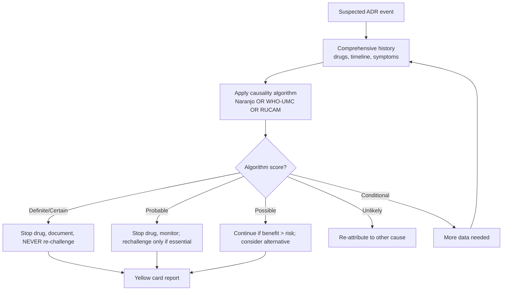
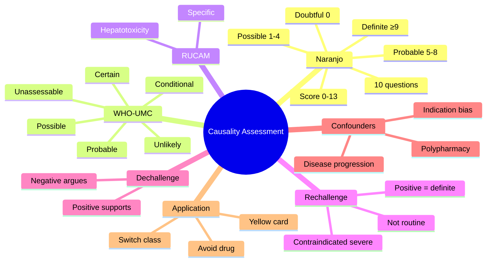

# ADR Causality Assessment (Naranjo, WHO-UMC, RUCAM)

> [!info]
> **Disease-Level Topic** under **ADRs → Causality Assessment**.
> Davidson 24e Ch2 — "Adverse Drug Reactions" (Maxwell SRJ).

## 1. Learning Objectives
- [ ] Define causality assessment and its clinical role
- [ ] Apply **Naranjo algorithm** to a case scenario
- [ ] Apply **WHO-UMC** criteria
- [ ] Apply **RUCAM** for hepatotoxicity
- [ ] Differentiate certain, probable, possible, unlikely, conditional, unassessable
- [ ] Recognise confounders (polypharmacy, indication bias, rechallenge)
- [ ] Discuss dechallenge, rechallenge, and placebo considerations

## 2. Why Causality Assessment?

- Distinguishes **true ADRs** from coincidental events
- Guides **drug withdrawal vs continuation**
- Informs **regulatory action** (yellow card, black triangle)
- **Compensation** decisions
- **Re-prescription** decisions (avoid forever vs cautious reintroduction)

**Confounders:**
- Polypharmacy (multiple potential culprits)
- Indication bias (e.g., NSAID given for pain in early RA — pain may flare independently)
- Disease progression
- Drug-drug interactions
- Patient characteristics (age, organ function, genetics)

## 3. Mermaid Algorithm — Causality Assessment Workflow

## 4. Comparison Tables

### 4.1 Naranjo Algorithm (Most Widely Used)

| Question | Yes | No | Don't Know |
|----------|-----|-----|-----------|
| 1. Are there previous conclusive reports on this reaction? | +1 | 0 | 0 |
| 2. Did the ADR appear after the suspect drug was given? | +2 | -1 | 0 |
| 3. Did the ADR improve when the drug was stopped (dechallenge)? | +1 | 0 | 0 |
| 4. Did the ADR reappear when the drug was re-given (rechallenge)? | +2 | -1 | 0 |
| 5. Are there alternative causes? | -1 | +2 | 0 |
| 6. Did the reaction reappear with placebo? | -1 | +1 | 0 |
| 7. Was the drug detected in blood/fluid at toxic level? | +1 | 0 | 0 |
| 8. Did the reaction worsen with increasing dose? | +1 | 0 | 0 |
| 9. Did the patient have similar reaction to same drug in past? | +1 | 0 | 0 |
| 10. Was the ADR confirmed by any objective evidence? | +1 | 0 | 0 |

**Scoring:**
- ≥ 9: **Definite** ADR
- 5-8: **Probable** ADR
- 1-4: **Possible** ADR
- 0: **Doubtful** (unlikely)

### 4.2 WHO-UMC Causality Categories

| Category | Criteria |
|----------|----------|
| **Certain** | Plausible time relationship; cannot be explained by concurrent disease/drug; positive dechallenge; positive rechallenge (definitive) |
| **Probable** | Plausible time; unlikely due to concurrent disease; positive dechallenge; rechallenge not required |
| **Possible** | Plausible time; could be explained by concurrent disease/drug; dechallenge information lacking or unclear |
| **Unlikely** | Temporal relationship improbable; could be explained by concurrent disease/drug |
| **Conditional / Unclassified** | More data needed for assessment; preliminary report |
| **Unassessable / Unclassifiable** | Cannot judge (info missing, conflicting) |

### 4.3 Naranjo vs WHO-UMC vs RUCAM

| Feature | Naranjo | WHO-UMC | RUCAM |
|---------|---------|---------|-------|
| **Type** | Questionnaire (10 Q) | Categorical (6 levels) | Organ-specific (liver) |
| **Organ system** | Any | Any | Hepatotoxicity only |
| **Rechallenge required** | No (optional) | No | No |
| **Specificity** | Moderate | Moderate | High for liver |
| **Use** | Research, regulatory | Clinical | DILI causality |
| **Validated** | Yes (most studied) | Yes | Yes |

### 4.4 Dechallenge & Rechallenge Definitions

| Term | Definition | Implication |
|------|------------|-------------|
| **Dechallenge positive** | ADR improves on stopping drug | Supports causality |
| **Dechallenge negative** | No change on stopping | Argues against |
| **Rechallenge positive** | ADR recurs on re-starting | Definite ADR (avoid forever) |
| **Rechallenge negative** | No recurrence | Less likely ADR |
| **Dechallenge cannot be assessed** | Drug not stopped, or irreversible damage | Uncertain |

## 5. FCPS/MRCP High-Yield Summary

| Pearl | Detail |
|-------|--------|
| Most widely used algorithm | Naranjo (10 Q, max 13 points) |
| Naranjo definite | ≥9 |
| Naranjo probable | 5-8 |
| Naranjo possible | 1-4 |
| Naranjo doubtful | 0 |
| Gold standard for hepatotoxicity | RUCAM |
| Time relationship | Foundation of all algorithms |
| Positive rechallenge | Definite ADR; avoid drug for life |
| Rechallenge | NOT recommended routinely (risk of severe reaction, esp. SJS) |
| Confounder | Indication bias (drug prescribed for prodrome of disease) |
| Causality assessment is | Subjective; inter-rater variability high |
| Yellow Card | UK pharmacovigilance system (MHRA) |

## 6. Viva Questions (10)

1. **Define causality assessment in ADRs.**
   *Structured process to determine the probability that a drug caused a particular adverse event, using standardised algorithms.*

2. **Name 3 causality assessment tools.**
   *Naranjo (questionnaire), WHO-UMC (categorical), RUCAM (hepatotoxicity-specific).*

3. **What is the Naranjo score for "Definite" ADR?**
   *≥9.*

4. **What is the difference between dechallenge and rechallenge?**
   *Dechallenge = stopping drug to see if ADR resolves. Rechallenge = re-starting drug to see if ADR recurs.*

5. **When is rechallenge contraindicated?**
   *In severe Type B reactions: SJS/TEN, anaphylaxis, DRESS, hepatotoxicity with coagulopathy, aplastic anaemia.*

6. **Why is the Naranjo algorithm not always reliable?**
   *Inter-rater variability; doesn't handle polypharmacy well; doesn't consider pharmacogenomics; missing data common; not disease-specific.*

7. **A patient on amiodarone develops hepatotoxicity. Which causality tool is best?**
   *RUCAM (hepatotoxicity-specific).*

8. **A patient develops rash on drug A and drug B given simultaneously. How do you determine the culprit?**
   *Stop both (or one at a time with safety assessment); review literature for each; consider temporal relationship; rechallenge only with each separately if benefit outweighs risk and ADR was mild.*

9. **A 70-year-old with heart failure and CKD is on ramipril, furosemide, bisoprolol, digoxin. He develops hyperkalaemia and AKI. Likely culprit?**
   *Ramipril + furosemide (esp. in dehydration) → AKI; ramipril causes hyperkalaemia. Likely ramipril-related, dose-related (Type A). Stop ramipril, rehydrate, monitor.*

10. **What is "indication bias" in causality assessment?**
    *Confounding where a drug is prescribed for early signs of the disease that later manifests fully — the "ADR" is actually disease progression, not the drug. E.g., NSAIDs given for early RA pain before RA diagnosis.*

## 7. Confusions & Mnemonics

| Confusion | Resolution |
|-----------|------------|
| Naranjo definite vs probable | Definite ≥9; Probable 5-8 |
| WHO-UMC certain vs probable | Certain needs rechallenge; Probable does not |
| RUCAM vs Naranjo | RUCAM = liver-specific; Naranjo = general |
| Rechallenge positive vs negative | Positive = ADR recurs; Negative = no recurrence |
| Type A vs Type B ADR causality | Type A more easily assessed; Type B often requires pharmacogenomic/immunological workup |
| Causality vs Attribution | Causality = statistical/drug-event link; Attribution = clinical judgement (more holistic) |
| Algorithm limitations | Subject to inter-rater variability; not replace clinical judgement |
| Yellow card vs Black triangle | Yellow = report ADR; Black triangle = newly licensed (intensive monitoring) |

**Mnemonic — Naranjo thresholds: "**9+ Definite, 5-8 Probable, 1-4 Possible, 0 Doubtful**"**

**Mnemonic — WHO-UMC categories: "**C**ertain **P**robable **P**ossible **U**nlikely **C**onditional **U**nassessable"** (CPPUCU)

**Mnemonic — Dechallenge vs Rechallenge: "**D**e = Discontinue; **R**e = Reintroduce"**

## 8. Mermaid Mind Map

## 9. Spaced Repetition Tracker

| Topic | Day 1 | Day 3 | Day 7 | Day 14 | Day 30 |
|-------|-------|-------|-------|-------|--------|
| Naranjo 10 Q | ☐ | ☐ | ☐ | ☐ | ☐ |
| Naranjo thresholds | ☐ | ☐ | ☐ | ☐ | ☐ |
| WHO-UMC 6 levels | ☐ | ☐ | ☐ | ☐ | ☐ |
| RUCAM indication | ☐ | ☐ | ☐ | ☐ | ☐ |
| Dechallenge meaning | ☐ | ☐ | ☐ | ☐ | ☐ |
| Rechallenge rules | ☐ | ☐ | ☐ | ☐ | ☐ |

## 10. Self-Test Scorecard

| Domain | Score (0-5) |
|--------|-------------|
| Naranjo scoring | /5 |
| WHO-UMC categories | /5 |
| RUCAM use | /5 |
| Dechallenge/rechallenge | /5 |
| Confounders | /5 |
| Rechallenge contraindications | /5 |
| **TOTAL** | **/30** |

## 11. MCQs (10)

1. **The Naranjo algorithm has:**
   A. 5 questions
   B. 10 questions ✓
   C. 15 questions
   D. 20 questions
   E. 25 questions

2. **A Naranjo score of 7 represents:**
   A. Definite ADR
   B. Probable ADR ✓
   C. Possible ADR
   D. Doubtful
   E. Conditional

3. **A Naranjo score of ≥9 is:**
   A. Probable
   B. Possible
   C. Definite ✓
   D. Doubtful
   E. Unassessable

4. **Which tool is most specific for hepatotoxicity causality?**
   A. Naranjo
   B. WHO-UMC
   C. RUCAM ✓
   D. Karch-Lasagna
   E. Kramer

5. **"Dechallenge positive" means:**
   A. ADR appears on stopping drug
   B. ADR improves on stopping drug ✓
   C. ADR recurs on re-starting
   D. ADR persists on re-starting
   E. No change

6. **"Rechallenge positive" means:**
   A. ADR improves on stopping
   B. ADR recurs on re-starting ✓
   C. ADR persists
   D. ADR worsens
   E. ADR is dose-related

7. **Rechallenge is contraindicated in:**
   A. Mild nausea
   B. SJS/TEN and anaphylaxis ✓
   C. Headache
   D. Drowsiness
   E. Dry mouth

8. **"Possible" causality (Naranjo 1-4) means:**
   A. Drug is definitely the cause
   B. Drug is the likely cause
   C. Drug could be the cause but other factors possible ✓
   D. Drug is not the cause
   E. Cannot be determined

9. **"Indication bias" refers to:**
   A. Wrong drug prescribed
   B. Drug prescribed for early signs of disease that later manifests ✓
   C. Polypharmacy
   D. Inadequate dose
   E. Contraindication

10. **Yellow Card (UK) is for:**
    A. Prescribing a new drug
    B. Reporting an ADR to MHRA ✓
    C. Reimbursement
    D. Continuing therapy
    E. Stopping therapy

## 12. SBAs (5)

1. **A patient on allopurinol develops rash 10 days later. After stopping, rash resolves. Naranjo scores: prev reports (+1), appeared after drug (+2), improved on stopping (+1), no alternative cause (+2), no rechallenge (0), no placebo (0), no blood level (0), no dose-response (0), no past history (0), no objective evidence (0). Score = 6. Interpretation:**
   - A) Definite ADR
   - B) Probable ADR ✓
   - C) Possible ADR
   - D) Doubtful
   - E) Unclassifiable

2. **A patient on isoniazid, rifampicin, pyrazinamide develops jaundice at week 4. Best tool:**
   - A) Naranjo
   - B) WHO-UMC
   - C) RUCAM ✓
   - D) Karch-Lasagna
   - E) Clinical judgement alone

3. **A patient with penicillin allergy 20 years ago has "amoxicillin" in chart. Should you rechallenge?**
   - A) Yes, with full dose
   - B) Yes, with desensitisation
   - C) No — avoid all β-lactams; consider non-β-lactam alternative ✓
   - D) Yes, intradermal test then full dose
   - E) Skin test first

4. **A 70-year-old on amiodarone develops pulmonary fibrosis after 24 months. The dechallenge is:**
   - A) Positive (improves on stopping)
   - B) Slow but usually partial improvement ✓
   - C) Always fatal
   - D) Irrelevant
   - E) Mandatory

5. **A patient on trimethoprim develops SJS. Action:**
   - A) Rechallenge with smaller dose
   - B) Continue drug; add antihistamine
   - C) Stop drug FOREVER; never re-challenge; report via Yellow Card ✓
   - D) Switch to same class
   - E. Desensitise

## 13. Answer Key

### MCQ Answers
1. **B** (10 questions, max 13 points)
2. **B** (5-8 = probable)
3. **C** (≥9 definite)
4. **C** (RUCAM for liver)
5. **B** (Dechallenge positive = improves on stopping)
6. **B** (Rechallenge positive = recurs on restarting)
7. **B** (SJS/TEN and anaphylaxis — never rechallenge)
8. **C** (Possible = could be drug but other factors)
9. **B** (Indication bias)
10. **B** (Yellow Card = MHRA reporting)

### SBA Answers
1. **B** — Naranjo 6 = probable ADR. Don't rechallenge with allopurinol (SJS risk).
2. **C** — RUCAM for hepatotoxicity (e.g., ATT-induced hepatitis).
3. **C** — Avoid β-lactams (cross-reactivity); use non-β-lactam (e.g., macrolide) or non-penicillin alternative.
4. **B** — Amiodarone pulmonary fibrosis improves slowly/partial on stopping; dechallenge partially positive.
5. **C** — SJS = stop drug FOREVER; never rechallenge; Yellow Card report.

## 14. Summary Box

> **Causality assessment uses structured algorithms to determine drug-event relatedness.** Naranjo (10 Q, max 13): ≥9 definite, 5-8 probable, 1-4 possible, 0 doubtful. WHO-UMC: 6 categorical levels. RUCAM: hepatotoxicity-specific. Dechallenge (stop drug) supports causality; Rechallenge (re-start) is the gold standard but contraindicated in severe Type B reactions (SJS, anaphylaxis). Always consider polypharmacy, indication bias, and disease progression.

---

## 15. Cross-Links
- **Parent Topic-Group**: [[../ADRs|ADRs]]
- **Sibling Topic-Groups**: [[Definition and classification]], [[Reporting and pharmacovigilance]], [[Common ADR patterns by system]]
- **Heading Hub**: [[ADRs]]
- **Chapter MOC**: [[Clinical Therapeutics and Good Prescribing MOC]]
- **Related**: [[Drug Interactions]], [[Special Populations/Renal Impairment/Renal Drug Dosing]]

**Last Updated:** 2026-06-15  
**Status: FULLY COMPLETE with Exam Suite (Viva 10, MCQ 10, SBA 5, Answer Key, Confusions, Mind Map, Spaced Repetition, Self-Test, Exam Modes)**
