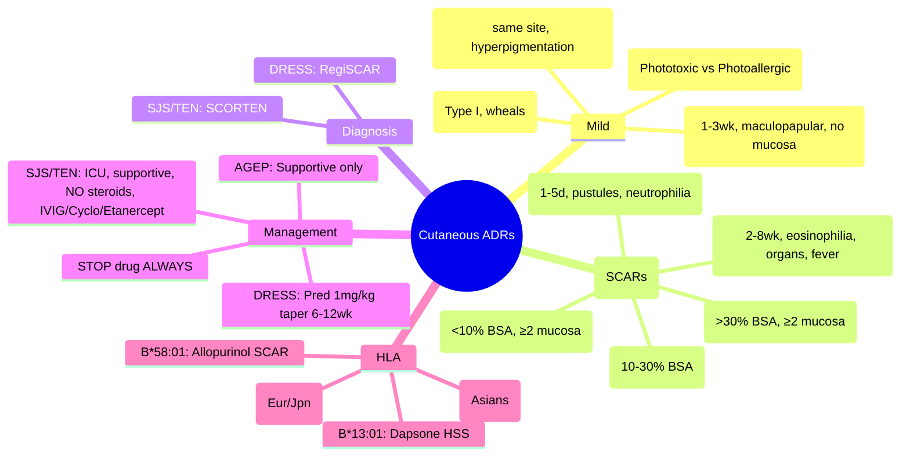

# Cutaneous ADRs

**Status**: `full-fcps-mrcp-note` | **Chapter**: 2 — Clinical Therapeutics and Good Prescribing | **Heading**: Adverse Drug Reactions → System-Specific Patterns | **Exam Priority**: ⭐⭐⭐ **HIGHEST** (VIVA favourite, visual recognition, SCAR differentiation)

---

## 1. 🎯 Learning Objectives
- [ ] Classify cutaneous ADRs by morphology and severity
- [ ] Differentiate SJS/TEN/DRESS/AGEP/Morbilliform with diagnostic criteria
- [ ] Apply SCORTEN and RegiSCAR scoring
- [ ] Identify high-risk drugs for each reaction
- [ ] Execute emergency management for SCARs
- [ ] Know HLA associations for prevention

---

## 2. 📊 Classification by Severity & Morphology

| Category | Reaction | Severity | Key Features |
|----------|----------|----------|--------------|
| **Mild** | Morbilliform (Exanthematous) | Low | Diffuse maculopapular, no mucosa, no systemic |
| | Urticaria/Angioedema | Low-Moderate | Wheals, pruritus, ± angioedema |
| | Fixed Drug Eruption | Low | Recurrent same site, hyperpigmentation |
| | Photosensitivity | Low-Moderate | Sun-exposed areas, phototoxic/photoallergic |
| **Severe (SCARs)** | **SJS (Stevens-Johnson Syndrome)** | **High** | <10% BSA detachment, ≥2 mucosal sites |
| | **SJS/TEN Overlap** | **High** | 10–30% BSA detachment |
| | **TEN (Toxic Epidermal Necrolysis)** | **Critical** | >30% BSA detachment, ≥2 mucosal sites |
| | **DRESS (Drug Reaction with Eosinophilia and Systemic Symptoms)** | **High** | Fever, eosinophilia, organ involvement, delayed onset |
| | **AGEP (Acute Generalised Exanthematous Pustulosis)** | **Moderate** | Non-follicular pustules, neutrophilia, rapid onset |

---

## 3. 🔬 Severe Cutaneous Adverse Reactions (SCARs) Comparison

| Feature | **Morbilliform** | **SJS** | **TEN** | **DRESS** | **AGEP** |
|---------|------------------|---------|---------|-----------|----------|
| **Onset** | 1–3 weeks | 1–4 weeks | 1–4 weeks | **2–8 weeks** | **1–5 days** |
| **Skin** | Maculopapular, confluent | Targetoid, blisters, <10% BSA | Targetoid, blisters, **>30% BSA** | Variable (morbilliform, exfoliative) | **Non-follicular pustules** on oedematous erythema |
| **Mucosa** | Rare | **≥2 sites** (oral, ocular, genital) | **≥2 sites** | Often (≥1) | Rare |
| **Systemic** | None/minimal | Fever, malaise | Fever, sepsis risk | **Fever, eosinophilia, organ involvement** | Fever, **neutrophilia** |
| **Labs** | Normal | Normal/mild ↑ LFTs | ↑ LFTs, coagulopathy | **Eosinophilia >1.5×10⁹/L**, atypical lymphs, ↑ LFTs, ↑ Cr, proteinuria | **Neutrophilia**, ↑ CRP |
| **Histology** | Vacuolar interface, lymphocyte infiltration | **Full-thickness epidermal necrosis**, sparse infiltrate | **Full-thickness epidermal necrosis** | Interface dermatitis, eosinophils | **Subcorneal pustules**, neutrophilic infiltrate |
| **Mortality** | <1% | 5–10% | 30–50% | ~10% | <5% |
| **Top Drugs** | Antibiotics (β-lactams), Allopurinol, AEDs | **Allopurinol, Sulfonamides, AEDs (CZP, PHT, LMG, OXC), NSAIDs, Nevirapine** | Same as SJS | **Allopurinol, AEDs, Dapsone, Abacavir, Minocycline, Allopurinol** | **β-lactams (aminopenicillins), Quinolones, Hydroxychloroquine, Diltiazem** |
| **HLA** | — | **B*15:02** (CZP), **B*58:01** (Allo), **A*31:01** (CZP) | Same as SJS | **B*58:01** (Allo), **A*31:01** (CZP), **B*13:01** (Dapsone) | — |

---

## 4. 📋 Diagnostic Criteria

### SCORTEN (SJS/TEN Severity Score) — *Calculate at admission*
| Parameter | Points |
|-----------|--------|
| Age >40 years | 1 |
| Heart rate >120 bpm | 1 |
| Malignancy (current) | 1 |
| BSA detached >10% | 1 |
| BUN >28 mg/dL (10 mmol/L) | 1 |
| Glucose >14 mmol/L (252 mg/dL) | 1 |
| Bicarbonate <20 mmol/L | 1 |

| SCORTEN | Predicted Mortality |
|---------|---------------------|
| 0–1 | 3.2% |
| 2 | 12.1% |
| 3 | 35.3% |
| 4 | 58.3% |
| ≥5 | >90% |

### RegiSCAR (DRESS) — *Scoring system*
| Criterion | Score |
|-----------|-------|
| Fever ≥38°C | 1 |
| Lymphadenopathy (≥2 sites, >1cm) | 1 |
| Eosinophilia >1.5×10⁹/L or atypical lymphs | 2 |
| Organ involvement (liver, kidney, lung, heart, pancreas, etc.) | 1 per organ |
| Rash | 1 |
| Reaction onset >2 weeks after drug start | 1 |

**Score ≥5 = Definite DRESS; 4–5 = Probable; 2–3 = Possible**

---

## 5. ⚡ Emergency Management of SCARs

```mermaid
flowchart TD
    A[Suspect SCAR: SJS/TEN/DRESS/AGEP] --> B[**STOP ALL NON-ESSENTIAL DRUGS IMMEDIATELY**]
    B --> C{SCAR Type?}
    C -->|SJS/TEN| D[**ICU / Burns Unit Referral**<br/>Fluid/electrolyte management<br/>Wound care (non-adherent dressings)<br/>Ophthalmology review (ocular mucosa)<br/>Infection surveillance<br/>Nutrition (NG if oral mucosa severe)]
    C -->|DRESS| E[**Systemic Steroids: Prednisolone 1mg/kg/day**<br/>Slow taper 6–12 weeks<br/>Monitor LFTs, renal, cardiac<br/>IVIG controversial]
    C -->|AGEP| F[**Supportive only**<br/>Topical steroids/emollients<br/>Antihistamines for pruritus<br/>Typically resolves <2 weeks post-withdrawal]
    D & E & F --> G[**Identify culprit drug** — detailed timeline<br/>HLA testing if indicated (retrospective)<br/>Document allergy: drug + reaction type<br/>Cross-reactivity counselling]
```

### SJS/TEN Specifics
- **NO systemic steroids** (controversial, ↑ sepsis risk, no mortality benefit in RCTs)
- **IVIG** — 2–3g/kg over 2–3 days (controversial, some benefit if early)
- **Cyclosporine** — 3–5mg/kg/day (emerging evidence, ↓ mortality)
- **Etanercept** — Single dose 50mg SC (promising, case series)
- **Plasmapheresis** — Limited evidence

### DRESS Specifics
- **Steroids mandatory** — Prednisolone 1mg/kg/day → taper over 6–12 weeks
- **Monitor for flare** on taper (common at 10–20mg)
- **IVIG** — Consider if steroid-refractory or severe organ involvement
- **Reactivation herpesviruses** (HHV-6, EBV, CMV) — monitor PCR, may need antivirals

---

## 6. 🎯 FCPS/MRCP High-Yield Summary

| Clinical Vignette | Diagnosis | Key Action |
|-------------------|-----------|------------|
| 2wk post-allopurinol: fever, target lesions, oral ulcers, 15% BSA detachment | **SJS** (or overlap) | **STOP allopurinol, ICU, supportive, NO steroids** |
| 3wk post-carbamazepine: fever, diffuse rash, eosinophilia 3×10⁹, ALT 300, facial oedema | **DRESS** | **STOP CZP, Pred 1mg/kg, taper 6–12wk** |
| 2 days post-amoxicillin: fever, widespread non-follicular pustules, neutrophilia | **AGEP** | **STOP amoxicillin, supportive, resolves <2wk** |
| 10 days post-trimethoprim: morbilliform rash, no mucosa, no fever, no eosinophilia | **Morbilliform** | **STOP TMP, antihistamines, topical steroids** |
| SJS/TEN patient: age 50, HR 110, BSA 15%, BUN 30, glucose 15, HCO₃ 18 | **SCORTEN** | **Score = 5 (Age, BSA, BUN, Glc, HCO₃) → >90% mortality** |

---

## 7. ❓ Viva Questions (12)

| Q | Answer |
|---|--------|
| 1. Differentiate SJS, TEN, and Overlap by BSA detachment. | SJS <10%, Overlap 10–30%, TEN >30%; all have ≥2 mucosal sites |
| 2. SCORTEN components? What does score 3 mean? | 7 items (Age>40, HR>120, Cancer, BSA>10%, BUN>28, Glc>14, HCO₃<20); Score 3 = 35% mortality |
| 3. DRESS vs SJS/TEN — key distinguishing features? | DRESS: **eosinophilia, organ involvement, 2–8wk onset**; SJS/TEN: **necrosis/bullae, mucosal, 1–4wk, no eosinophilia** |
| 4. AGEP typical drug triggers and time course? | **β-lactams (esp. aminopenicillins), quinolones, hydroxychloroquine, diltiazem**; onset **1–5 days**; neutrophilia not eosinophilia |
| 5. Allopurinol SCAR — which HLA? Screening in whom? | **HLA-B*58:01**; screen Han Chinese, Korean, Thai, African, CKD≥3 |
| 6. Carbamazepine SJS — which HLA? Population? | **HLA-B*15:02**; Han Chinese, Thai, Malaysian, Indian (freq 2–15%) |
| 7. Carbamazepine DRESS — which HLA? Population? | **HLA-A*31:01**; Europeans (2–5%), Japanese (10–15%) |
| 8. Morbilliform rash management? | Stop drug if possible; oral antihistamines; topical steroids; typically resolves 1–2wks |
| 9. Fixed drug eruption — clinical features? | Recurrent **same anatomical site** (lips, genitals, hands); well-demarcated erythematous plaque → hyperpigmentation; common: NSAIDs, tetracyclines, sulfonamides |
| 10. Photosensitivity — phototoxic vs photoallergic? | **Phototoxic**: dose-dependent, sunburn-like, no prior sensitisation (tetracyclines, amiodarone, fluoroquinolones); **Photoallergic**: immune-mediated, eczematous, requires prior exposure (thiazides, ketoprofen) |
| 11. SJS/TEN management — why NO systemic steroids? | ↑ infection risk, impaired wound healing, no mortality benefit in observational studies; IVIG/cyclosporine/etanercept preferred |
| 12. Cross-reactivity in aromatic AEDs? | **High among CZP, PHT, PB, OXC, LMG** — if SCAR to one, **avoid all aromatic AEDs**; use levetiracetam, topiramate, gabapentin, lacosamide, zonisamide |

---

## 8. 🤯 Confusions & Mnemonics

| Confusion | Clarification |
|-----------|---------------|
| **SJS/TEN vs DRESS vs AGEP** | SJS/TEN = **necrosis/bullae**; DRESS = **eosinophilia + organs**; AGEP = **pustules + neutrophilia** |
| **DRESS onset** | **2–8 weeks** (delayed) vs SJS/TEN 1–4 weeks vs AGEP 1–5 days |
| **Steroids in SJS/TEN** | **Contraindicated** (↑ mortality); **Indicated in DRESS** (1mg/kg taper 6–12wk) |
| **SCORTEN vs RegiSCAR** | SCORTEN = SJS/TEN severity; RegiSCAR = DRESS diagnosis |
| **HLA for CZP** | **B*15:02 = SJS/TEN** (Asians); **A*31:01 = DRESS** (Europeans/Japanese) |

**Mnemonics:**
- **"SCAR TRIAD"** = **S**JS/TEN (necrosis), **D**RESS (eosinophilia/organs), **A**GEP (pustules)
- **"SCORTEN"** = **S**kin>10%, **C**ancer, **O**ld>40, **R**enal (BUN>28), **T**achy>120, **E**lectrolytes (HCO₃<20, Glc>14), **N**eoplasia
- **"REGISCAR"** = **R**ash, **E**osinophilia, **G**lobular atyp lymphs, **I**ntermittent fever, **S**ystemic organ, **C**ytology, **A**llopurinol/AEDs, **R**eaction>2wks
- **"AGEP = ACUTE PUSTULES"** = **A**cute **G**eneralised **E**xanthematous **P**ustulosis = **Pustules + Neutrophilia + <5 days**
- **"CZP HLA"** = **B*15:02** = **S**JS/**T**EN; **A*31:01** = **A**utoimmune (**D**RESS)

---

## 9. 🧠 Mind Map (Mermaid)



---

## 10. 📅 Spaced Repetition Tracker

| Review | Date | Score (0–5) | Next Interval |
|--------|------|-------------|---------------|
| 1 (Learn) | | | 1 day |
| 2 | | | 3 days |
| 3 | | | 1 week |
| 4 | | | 2 weeks |
| 5 | | | 1 month |
| 6 | | | 3 months |

---

## 11. 🧪 Self-Test Scorecard

| Section | Max | Score | % |
|---------|-----|-------|---|
| Classification table | 10 | | |
| SCAR comparison | 15 | | |
| SCORTEN/RegiSCAR | 10 | | |
| Management algorithms | 10 | | |
| HLA associations | 8 | | |
| Viva answers | 12 | | |
| **Total** | **65** | | |

**Target**: ≥52/65 (80%)

---

## 12. 📝 Exam Answer Modes

### Long Question (10 marks): *"Discuss the classification, diagnosis, and management of severe cutaneous adverse reactions (SCARs)."*
1. **Classification** (2): SCARs = SJS/TEN, DRESS, AGEP; distinguish from morbilliform
2. **SJS/TEN** (3): BSA criteria, SCORTEN, drugs (Allopurinol, Sulfa, AEDs), HLA (B*15:02, B*58:01), management (ICU, supportive, NO steroids, IVIG/cyclo/etanercept)
3. **DRESS** (3): RegiSCAR, 2–8wk onset, eosinophilia/organ involvement, drugs, HLA, steroids 1mg/kg taper 6–12wk
4. **AGEP** (1): Pustules, neutrophilia, 1–5d, β-lactams, self-limiting
5. **Cross-reactivity** (1): Aromatic AEDs — avoid all if SCAR to one

### Short Question (5 marks): *"SJS vs TEN vs DRESS"*
| Feature | SJS | TEN | DRESS |
|---------|-----|-----|-------|
| BSA detachment | <10% | >30% | Variable |
| Mucosal | ≥2 | ≥2 | Often |
| Onset | 1–4wk | 1–4wk | **2–8wk** |
| Key lab | — | — | **Eosinophilia, atypical lymphs** |
| Mortality | 5–10% | 30–50% | ~10% |
| Steroids | NO | NO | **YES (1mg/kg)** |

### Viva (2 min): *"Patient on allopurinol 10 days, fever, rash, eosinophilia 2.5×10⁹, ALT 200. Diagnosis? Management?"*
- **DRESS** (RegiSCAR criteria: fever, rash, eosinophilia, organ involvement, >2wk onset)
- **Stop allopurinol immediately**
- **Prednisolone 1mg/kg**, slow taper 6–12 weeks
- Monitor LFTs, renal, cardiac, HHV-6 reactivation
- Screen HLA-B*58:01 (retrospective); alternative: febuxostat

### Ward Round (30 sec): *"Patient on carbamazepine 2 weeks, widespread targetoid lesions, oral ulcers, 5% BSA detachment. Immediate steps?"*
- **SJS** — **STOP carbamazepine immediately**
- ICU referral, supportive care, ophthalmology
- **NO systemic steroids**
- Check HLA-B*15:02 (retrospective)
- Switch to non-aromatic AED (levetiracetam)

### Last-Night Revision (1-liners):
- SJS <10%, TEN >30%, Overlap 10–30% BSA; all ≥2 mucosa
- SCORTEN: 7 items, score 3 = 35% mortality
- DRESS: 2–8wk, eosinophilia, organs → **Steroids 1mg/kg taper 6–12wk**
- AGEP: pustules, neutrophilia, 1–5d, β-lactams → benign
- SJS/TEN: NO steroids; DRESS: YES steroids
- HLA: B*15:02 (CZP SJS), B*58:01 (Allo), A*31:01 (CZP DRESS), B*13:01 (Dapsone)
- Aromatic AEDs cross-react: avoid CZP/PHT/PB/OXC/LMG if SCAR to one

---

## 13. 📚 Summary Card

> **SCAR TRIAD FOR VIVA:**
> 1. **SJS/TEN** — Necrosis, SCORTEN, **ICU, No Steroids**, HLA-B*15:02/B*58:01
> 2. **DRESS** — Eosinophilia + Organs, RegiSCAR, **Steroids 1mg/kg**, HLA-B*58:01/A*31:01
> 3. **AGEP** — Pustules + Neutrophilia, 1–5d, **Benign**, β-lactams
>
> **CROSS-REACTIVITY**: Aromatic AEDs (CZP, PHT, PB, OXC, LMG) — **avoid all**

---

## 14. ❓ MCQs (15)

1. **Stevens-Johnson Syndrome is defined by BSA detachment of:**
   A. >30%
   B. 10–30%
   C. **<10%** ✓
   D. >50%
   E. Any BSA with mucosal involvement

2. **TEN mortality with SCORTEN score of 4 is approximately:**
   A. 12%
   B. 35%
   C. **58%** ✓
   D. 90%
   E. 3%

3. **DRESS is characterised by all EXCEPT:**
   A. Fever
   B. Eosinophilia >1.5×10⁹/L
   C. **Neutrophilia** ✓
   D. Organ involvement
   E. Onset 2–8 weeks

4. **AGEP typical histology shows:**
   A. Full-thickness epidermal necrosis
   B. **Subcorneal pustules with neutrophilic infiltrate** ✓
   C. Vacuolar interface dermatitis with eosinophils
   D. Dense lymphocytic infiltrate at dermoepidermal junction
   D. Granulomatous inflammation

5. **Allopurinol-induced SCAR is most strongly associated with:**
   A. HLA-B*15:02
   B. HLA-A*31:01
   C. **HLA-B*58:01** ✓
   D. HLA-B*57:01
   E. HLA-DRB1*07:01

6. **Carbamazepine-induced DRESS in Europeans/Japanese is associated with:**
   A. HLA-B*15:02
   B. **HLA-A*31:01** ✓
   C. HLA-B*58:01
   D. HLA-B*57:01
   E. HLA-B*13:01

7. **SCORTEN does NOT include:**
   A. Age >40
   B. **Serum creatinine >200** ✓
   C. Heart rate >120
   D. BSA detached >10%
   E. Bicarbonate <20

8. **RegiSCAR criteria for DRESS include all EXCEPT:**
   A. Fever ≥38°C
   B. Lymphadenopathy
   C. **Neutrophilia >10×10⁹/L** ✓
   D. Eosinophilia >1.5×10⁹/L
   E. Organ involvement

9. **SJS/TEN management — which is CONTRAINDICATED?**
   A. IVIG
   B. Cyclosporine
   C. **Systemic corticosteroids** ✓
   D. Etanercept
   E. Supportive care in ICU

10. **DRESS first-line management:**
    A. Supportive only
    B. **Prednisolone 1mg/kg/day with slow taper** ✓
    C. IVIG only
    D. Cyclosporine only
    E. Etanercept

11. **AGEP most common drug trigger:**
    A. Allopurinol
    B. Carbamazepine
    C. **Beta-lactams (aminopenicillins)** ✓
    D. Sulfonamides
    E. Lamotrigine

12. **Fixed drug eruption — characteristic feature:**
    A. Generalised distribution
    B. **Recurrence at same anatomical site** ✓
    C. Always mucosal involvement
    D. Associated with eosinophilia
    E. Rapid onset <24h

13. **Phototoxic vs photoallergic reaction — key difference:**
    A. Phototoxic = immune-mediated
    B. **Photoallergic = immune-mediated, requires prior sensitisation** ✓
    C. Phototoxic = eczematous
    D. Photoallergic = sunburn-like
    E. Both require prior sensitisation

14. **Morbilliform drug eruption typical onset:**
    A. <24 hours
    B. 1–3 days
    C. **1–3 weeks** ✓
    D. 4–8 weeks
    E. >8 weeks

15. **Aromatic antiepileptic cross-reactivity — which drug is NON-AROMATIC and safe alternative?**
    A. Oxcarbazepine
    B. Phenytoin
    C. **Levetiracetam** ✓
    D. Lamotrigine
    E. Phenobarbital

---

## 15. 🃏 Flashcards (Anki-ready)

| Front | Back |
|-------|------|
| SJS BSA | <10% |
| TEN BSA | >30% |
| Overlap BSA | 10–30% |
| SCORTEN 7 items | Age>40, HR>120, Cancer, BSA>10%, BUN>28, Glc>14, HCO3<20 |
| SCORTEN score 3 mortality | 35% |
| DRESS onset | 2–8 weeks |
| DRESS key labs | Eosinophilia >1.5, atypical lymphs, LFTs, renal |
| DRESS management | Stop drug, Pred 1mg/kg, taper 6–12 weeks |
| AGEP features | Pustules, neutrophilia, 1–5 days, β-lactams |
| AGEP histology | Subcorneal pustules, neutrophilic infiltrate |
| Morbilliform onset | 1–3 weeks |
| Fixed drug eruption | Same site recurrence, hyperpigmentation |
| Phototoxic | Dose-dependent, sunburn-like, no prior sensitisation (tetracyclines, amiodarone, FQs) |
| Photoallergic | Immune-mediated, eczematous, prior sensitisation (thiazides, ketoprofen) |
| HLA-B*15:02 | CZP/PHT/OXC/LMG SJS/TEN (Asians) |
| HLA-B*58:01 | Allopurinol SCAR (Asians, CKD) |
| HLA-A*31:01 | CZP DRESS (Europeans/Japanese) |
| HLA-B*13:01 | Dapsone HSS |
| Aromatic AEDs | CZP, PHT, PB, OXC, LMG — cross-reactivity HIGH |
| Non-aromatic AEDs | Levetiracetam, Topiramate, Gabapentin, Lacosamide, Zonisamide, Pregabalin |
| SJS/TEN steroids | CONTRAINDICATED |
| DRESS steroids | INDICATED (1mg/kg taper 6–12wk) |

---

## 16. ✅ Answer Keys

### MCQs
1. **C** — SJS <10% BSA
2. **C** — SCORTEN 4 = 58% mortality
3. **C** — DRESS has eosinophilia, not neutrophilia (that's AGEP)
4. **B** — AGEP = subcorneal pustules + neutrophils
5. **C** — Allopurinol SCAR = HLA-B*58:01
6. **B** — CZP DRESS = HLA-A*31:01 (Europeans/Japanese)
7. **B** — SCORTEN uses BUN, not creatinine
8. **C** — RegiSCAR uses eosinophilia, not neutrophilia
9. **C** — Systemic steroids contraindicated in SJS/TEN
10. **B** — DRESS = Pred 1mg/kg taper
11. **C** — AGEP = β-lactams (aminopenicillins)
12. **B** — Fixed drug eruption = same site recurrence
13. **B** — Photoallergic = immune, prior sensitisation
14. **C** — Morbilliform = 1–3 weeks
15. **C** — Levetiracetam = non-aromatic

---

*File: `/mnt/tb/Medicine/Clinical Therapeutics and Good Prescribing/ADRs/Cutaneous ADRs.md` | Status: `full-fcps-mrcp-note`*
