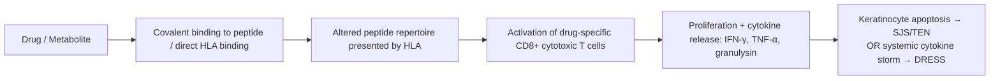
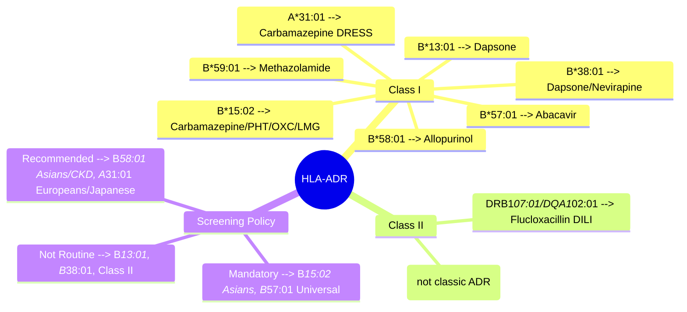

# HLA-associated ADRs

**Status**: `draft` | **Chapter**: 2 — Clinical Therapeutics and Good Prescribing | **Heading**: Adverse Drug Reactions | **Exam Priority**: ⭐⭐⭐ **HIGHEST** (FCPS/MRCP favorite — specific alleles, screening mandates, VIVA gold)

---

## 1. 🎯 Learning Objectives
- [ ] List key HLA alleles with established drug associations and the specific drugs they predict
- [ ] Explain screening recommendations (mandatory vs. recommended) by ethnicity and drug
- [ ] Describe the pathophysiology: HLA-restricted T-cell activation → cytotoxic reactions (SJS/TEN/DRESS)
- [ ] Calculate Number Needed to Screen (NNS) and cost-effectiveness thresholds
- [ ] Answer viva questions on allele-drug pairs, screening logistics, and negative predictive value

---

## 2. 🧬 High-Yield HLA Allele–Drug Association Table

| HLA Allele | Drug(s) | Reaction Predicted | Population Prevalence | Screening Status | Key Exam Points |
|------------|---------|-------------------|----------------------|------------------|-----------------|
| **HLA-B*15:02** | Carbamazepine, Phenytoin, Lamotrigine, Oxcarbazepine | **SJS / TEN** | Han Chinese: 10–15%; Thai: 8–15%; Indian: 2–4%; European: <1% | **Mandatory** before CZP/PTX in Asian ancestry (FDA/EMA/MHRA) | **Strongest association** (OR >1000). Also predict CZP-induced DRESS. NPV ~100% |
| **HLA-B*58:01** | Allopurinol | **SJS/TEN, DRESS, AHS** | Han Chinese: 6–8%; Korean: 4–6%; Thai: 8–10%; European: 1–2% | **Strongly recommended** (mandatory in Taiwan, Hong Kong, Thailand) | Allopurinol SCAR: OR ~100. Renal impairment ↑ risk independent of HLA. Screen before starting |
| **HLA-B*57:01** | Abacavir | **Hypersensitivity syndrome (HSS)** | European: 5–8%; African: 2–3%; Asian: <1% | **Mandatory** before ABC (universal) | NPV 98–100%. PPV only ~50% — clinical diagnosis still needed. PREDICT-1 trial proved utility |
| **HLA-B*13:01** | Dapsone | **Dapsone Hypersensitivity Syndrome (DHS)** | Chinese: 5–10% | Recommended in endemic areas | DHS: fever, rash, hepatitis, eosinophilia. Also HLA-B*38:01, HLA-DQB1*06:01 |
| **HLA-A*31:01** | Carbamazepine | **DRESS, MPE, SJS/TEN** | European: 2–5%; Japanese: 10–15%; Chinese: 2–3% | Recommended (esp. European/Japanese) | Broader phenotype than B*15:02. NPV for DRESS ~98%. Not FDA-mandated |
| **HLA-DRB1*07:01 / DQA1*02:01** | Flucloxacillin | **DILI (cholestatic)** | European: ~15% | Not routine; research context | OR ~80. Low PPV. HLA-B*57:01 also implicated in some cohorts |
| **HLA-B*59:01** | Methazolamide, Sulfonamides | **SJS/TEN** | Japanese: ~1% | Not routine | Rare but strong association in Japanese |
| **HLA-B*38:01 / DQB1*06:01** | Dapsone, Nevirapine | **DHS, Nevirapine SJS/TEN** | Variable | Research | Nevirapine: also CD4>250 in women ↑ risk |
| **HLA-DPB1*03:01** | Aspirin-exacerbated respiratory disease (AERD) | **Aspirin intolerance** | Not a drug ADR per se | N/A | Not HLA class I; pharmacogenomic |

---

## 3. 📊 Screening Algorithms (Mermaid)

### Carbamazepine/Oxcarbazepine — HLA-B*15:02
```mermaid
flowchart TD
    A[Patient needs Carbamazepine/Oxcarbazepine] --> B{Ancestry?}
    B -->|Han Chinese, Thai, Malaysian, Indian, Filipino| C[**MANDATORY HLA-B*15:02 testing**]
    B -->|European, African, Hispanic| D[Testing optional; low prevalence]
    C --> E{Result}
    E -->|Positive| F[**AVOID carbamazepine/oxcarbazepine**\nUse alternative: levetiracetam, valproate, lamotrigine\n(caution: lamotrigine also has B*15:02 link)]
    E -->|Negative| G[Proceed with carbamazepine\nMonitor for SJS/TEN first 8–12 weeks]
    D --> G
```

### Allopurinol — HLA-B*58:01
```mermaid
flowchart TD
    A[Patient needs Allopurinol] --> B{Ancestry / Risk factors?}
    B -->|Han Chinese, Korean, Thai, African ancestry\nOR CKD stage 3+| C[**STRONGLY RECOMMENDED HLA-B*58:01**]
    B -->|European, no CKD| D[Start low dose 100 mg/day; titrate slowly]
    C --> E{Result}
    E -->|Positive| F[**AVOID allopurinol**\nUse febuxostat\n(CARE: febuxostat CV risk — CARES trial)]
    E -->|Negative| G[Start 100 mg/day (50 mg if eGFR<30)\nTitrate by 100 mg q2–4wk to target urate]
    D --> G
```

### Abacavir — HLA-B*57:01
```mermaid
flowchart TD
    A[Patient needs Abacavir] --> B[**UNIVERSAL HLA-B*57:01 screening**]
    B --> C{Result}
    C -->|Positive| D[**CONTRAINDICATED**\nDo not rechallenge\nDocument allergy: \"Abacavir HLA-B*57:01 +ve\"]
    C -->|Negative| E[Proceed with ABC\nMonitor for HSS first 6 weeks\nSymptoms: fever, rash, GI, resp, constitutional]
```

---

## 4. ⚖️ Number Needed to Screen (NNS) & Cost-Effectiveness

| Drug + Allele | Population | NNS to Prevent 1 SJS/TEN | Cost-Effectiveness | Policy |
|---------------|------------|---------------------------|-------------------|--------|
| CZP + B*15:02 | Han Chinese | **~350** | Highly cost-effective (<$50k/QALY) | **Mandatory** (FDA boxed warning) |
| CZP + B*15:02 | European | ~50,000 | Not cost-effective | Not recommended |
| ALLO + B*58:01 | Han Chinese | **~400** | Cost-effective | **Mandatory** (Taiwan, HK, Thailand) |
| ALLO + B*58:01 | European | ~10,000 | Borderline | Recommended if CKD |
| ABC + B*57:01 | European | **~200** | Highly cost-effective | **Mandatory universal** |

> **Exam Pearl**: NNS = 1 / (Allele Frequency × Attributable Risk). High allele freq + high OR → low NNS → cost-effective.

---

## 5. 🧠 Pathophysiology: HLA-Restricted T-Cell Activation



**Two Mechanisms (p-i concept + altered peptide repertoire):**
1. **p-i (pharmacological interaction)**: Drug binds directly to HLA/TCR without covalent binding (e.g., abacavir in HLA-B*57:01 groove)
2. **Altered peptide repertoire**: Drug binds HLA groove → changes self-peptide selection → neoantigen presentation

---

## 6. 🎯 FCPS/MRCP High-Yield Summary

| Scenario | Correct Action |
|----------|----------------|
| Han Chinese patient, new seizure, needs CZP | **Test HLA-B*15:02 FIRST** — if +ve, avoid CZP/PTX/OXC |
| European patient, gout, eGFR 45, needs allopurinol | Start **allopurinol 100 mg/day**; HLA-B*58:01 not mandatory but consider |
| Thai patient, allopurinol induced SJS | **HLA-B*58:01 will be +ve** — lifelong avoid allopurinol; use febuxostat |
| HIV patient, HLA-B*57:01 negative, develops fever/rash week 3 on ABC | **Still possible HSS** — PPV only 50%; stop ABC, never rechallenge |
| Carbamazepine-induced DRESS in Japanese patient | Likely **HLA-A*31:01** (not B*15:02) — screen family if indicated |

---

## 7. ❓ Viva Questions (12)

| Q | Expected Answer |
|---|-----------------|
| 1. Which HLA allele mandates screening before carbamazepine in Asian patients? | **HLA-B*15:02** — FDA/EMA boxed warning; OR >1000 for SJS/TEN |
| 2. What is the NPV of HLA-B*15:02 for carbamazepine SJS/TEN? | **~100%** — negative test effectively rules out SJS/TEN from CZP |
| 3. Allopurinol SCAR: which allele? Screening in whom? | **HLA-B*58:01**; Han Chinese, Korean, Thai, African, CKD≥3 |
| 4. Abacavir hypersensitivity: allele? PPV/NPV? | **HLA-B*57:01**; NPV 98–100%, PPV ~50% (clinical diagnosis needed) |
| 5. Carbamazepine DRESS in Europeans/Japanese: which allele? | **HLA-A*31:01** (not B*15:02) |
| 6. Flucloxacillin DILI: HLA association? | **HLA-DRB1*07:01 / DQA1*02:01** (class II, not class I) |
| 7. Dapsone hypersensitivity syndrome: key alleles? | **HLA-B*13:01** (primary), B*38:01, DQB1*06:01 |
| 8. Why is HLA-B*57:01 screening universal but B*15:02 ancestry-based? | B*57:01 prevalence 5–8% in Europeans (cost-effective universal); B*15:02 <1% in Europeans (NNS too high) |
| 9. Patient on allopurinol develops SJS. HLA-B*58:01 negative. Explain. | 5–10% of allopurinol SCAR are B*58:01 negative — other mechanisms (renal impairment, other genes). Clinical diagnosis stands. |
| 10. Can you rechallenge abacavir if HLA-B*57:01 negative but HSS occurred? | **NO** — absolute contraindication. Rechallenge causes fatal hypotension. Document as allergy. |
| 11. Cost-effectiveness threshold for genetic screening? | Generally <$50,000–100,000/QALY (US); NICE £20–30k/QALY. NNS <1000 usually favorable. |
| 12. Pregnancy and HLA screening? | No change — screen if indicated. No teratogenicity from test. Counsel re: fetal risk if drug avoided. |

---

## 8. 🤯 Confusions & Mnemonics

| Confusion | Clarification |
|-----------|---------------|
| **B*15:02 vs A*31:01 for CZP** | B*15:02 = SJS/TEN (Asians); A*31:01 = DRESS/MPE (Europeans/Japanese) |
| **B*58:01 for allopurinol vs febuxostat** | B*58:01 predicts allopurinol SCAR only; febuxostat NOT associated — safe in B*58:01+ |
| **ABC HSS vs IRIS** | HSS: week 1–6, HLA-B*57:01 linked; IRIS: week 2–12, immune recovery, no HLA link |
| **Screening = prevention?** | Screening prevents *initiation* in +ve; does NOT mitigate risk if drug already started |

**Mnemonics:**
- **"B15 for CZP SJS"** → HLA-**B***15:02** = **C**arbamazepine **S**JS/**T**EN
- **"B58 for Allo SCAR"** → HLA-**B***58:01** = **A**llopurinol **S**CAR
- **"B57 for ABC HSS"** → HLA-**B***57:01** = **A**baca**v**ir **H**SS
- **"A31 for CZP DRESS"** → HLA-**A***31:01** = CZP **DRESS** (Europeans)

---

## 9. 🧠 Mind Map (Mermaid)



---

## 10. 📅 Spaced Repetition Tracker

| Review | Date | Score (0–5) | Next Interval |
|--------|------|-------------|---------------|
| 1 (Learn) | | | 1 day |
| 2 | | | 3 days |
| 3 | | | 1 week |
| 4 | | | 2 weeks |
| 5 | | | 1 month |
| 6 | | | 3 months |

---

## 11. 🧪 Self-Test Scorecard

| Section | Max | Score | % |
|---------|-----|-------|---|
| Allele–Drug pairs | 10 | | |
| Screening indications | 8 | | |
| NNS/Cost-effectiveness | 4 | | |
| Pathophysiology | 4 | | |
| Viva answers | 12 | | |
| **Total** | **38** | | |

**Target**: ≥30/38 (80%) for FCPS/MRCP readiness

---

## 12. 📝 Exam Answer Modes

### Long Question (10 marks): *"Discuss HLA-B*57:01 screening before abacavir therapy"*
**Structure:**
1. **Introduction** (1): ABC HSS, incidence 5–8%, HLA-B*57:01 association
2. **Evidence** (3): PREDICT-1 trial (prospective RCT), SHOP study, NPV 98–100%, PPV 50%
3. **Screening Algorithm** (2): Universal pre-treatment testing; +ve = absolute contraindication
4. **Clinical Nuances** (2): Negative test ≠ zero risk (clinical vigilance); never rechallenge; document allergy
5. **Cost-effectiveness** (1): NNS ~200, highly cost-effective, standard of care globally
6. **Conclusion** (1): Mandatory screening prevents mortality; exemplar of pharmacogenomics implementation

### Short Question (5 marks): *"HLA-B*15:02 and carbamazepine"*
- Allele: HLA-B*15:02
- Reaction: SJS/TEN (OR >1000)
- Population: Han Chinese, Thai, Malaysian, Indian (freq 2–15%)
- Screening: **Mandatory** before CZP/PTX/OXC in these ancestries
- Alternative if +ve: Levetiracetam, valproate, topiramate (NOT lamotrigine — also B*15:02 risk)
- NPV ~100%

### Viva (2 min): *"Why screen for HLA-B*58:01 before allopurinol but not HLA-B*15:02 in Europeans?"*
- B*58:01 freq 1–2% Europeans but ↑ risk with CKD; NNS ~10,000 general, ~400 CKD → consider in renal impairment
- B*15:02 freq <1% Europeans; NNS >50,000 → not cost-effective; no mandate

### Ward Round (30 sec): *"Patient on allopurinol 300 mg, eGFR 25, develops rash + fever day 10. Plan?"*
- **STOP allopurinol immediately**. Suspect SCAR. Check HLA-B*58:01 (retrospective). Start febuxostat 40 mg later. Derm/ ICU referral if mucosal/organ involvement.

### Last-Night Revision (1-liners):
- B*15:02 = CZP SJS (Asians mandatory)
- B*58:01 = Allo SCAR (Asians/CKD screen)
- B*57:01 = ABC HSS (Universal mandatory)
- A*31:01 = CZP DRESS (Eur/Jpn recommended)
- DRB1*07:01 = Fluclox DILI (Class II, research)

---

## 13. 📚 Summary Card

> **HLA-ADR Trinity for Exams:**
> 1. **B*15:02** — Carbamazepine → SJS/TEN (Asians) — **Mandatory screen**
> 2. **B*58:01** — Allopurinol → SCAR (Asians/CKD) — **Strongly recommend screen**
> 3. **B*57:01** — Abacavir → HSS (All) — **Universal mandatory screen**
>
> **Bonus**: A*31:01 — CZP DRESS (Eur/Jpn); DRB1*07:01 — Fluclox DILI (Class II)

---

## 14. ❓ MCQs (10)

1. **A 25-year-old Han Chinese woman requires carbamazepine for newly diagnosed focal epilepsy. Which HLA allele should be tested BEFORE initiation?**
   A. HLA-B*57:01
   B. **HLA-B*15:02** ✓
   C. HLA-B*58:01
   D. HLA-A*31:01
   E. HLA-DRB1*07:01

2. **Which statement about HLA-B*57:01 and abacavir is CORRECT?**
   A. Positive predictive value >90%
   B. **Negative predictive value ~98–100%** ✓
   C. Screening only required in African ancestry
   D. Rechallenge safe if HLA-B*57:01 negative
   D. Associated with SJS/TEN phenotype

3. **Allopurinol-induced SJS/TEN is most strongly associated with:**
   A. HLA-B*15:02
   B. HLA-A*31:01
   C. **HLA-B*58:01** ✓
   D. HLA-B*57:01
   E. HLA-B*13:01

4. **A European patient with gout and CKD stage 3 (eGFR 40) is started on allopurinol. Regarding HLA-B*58:01 screening:**
   A. Mandatory for all Europeans
   B. Not indicated; prevalence too low
   C. **Recommended given CKD** ✓
   D. Only if family history of SCAR
   E. Only if previous allopurinol allergy

5. **Carbamazepine-induced DRESS in a Japanese patient is associated with:**
   A. HLA-B*15:02
   B. **HLA-A*31:01** ✓
   C. HLA-B*58:01
   D. HLA-B*57:01
   E. HLA-DQB1*06:01

6. **Flucloxacillin-induced cholestatic DILI is associated with which HLA class?**
   A. Class I (HLA-B)
   B. **Class II (HLA-DR/DQ)** ✓
   C. Class I (HLA-A)
   D. Class I (HLA-C)
   E. Non-HLA

7. **Number Needed to Screen (NNS) to prevent one case of carbamazepine SJS/TEN in Han Chinese is approximately:**
   A. 50
   B. **350** ✓
   C. 1,000
   D. 5,000
   E. 50,000

8. **A patient tests HLA-B*57:01 negative, starts abacavir, and develops fever, rash, and dyspnea at week 4. Management?**
   A. Continue with antihistamines
   B. **Stop abacavir permanently; never rechallenge** ✓
   C. Reduce dose and monitor
   D. Switch to another NRTI but can rechallenge later
   E. Treat as IRIS; continue ART

9. **Which HLA allele is associated with dapsone hypersensitivity syndrome (DHS)?**
   A. HLA-B*15:02
   B. HLA-B*58:01
   C. **HLA-B*13:01** ✓
   D. HLA-B*57:01
   E. HLA-A*31:01

10. **A Thai patient develops SJS after 2 weeks of allopurinol. HLA-B*58:01 testing returns negative. What does this mean?**
    A. Allopurinol not the cause
    B. **5–10% of allopurinol SCAR are B*58:01 negative; clinical diagnosis stands** ✓
    C. Can cautiously restart allopurinol
    D. Test for HLA-B*15:02 instead
    E. Febuxostat contraindicated

---

## 15. 🔬 SBAs (10)

1. **A 30-year-old Malaysian man starts carbamazepine for trigeminal neuralgia. On day 14, he develops fever, widespread targetoid lesions, and oral mucosal erosions with 25% BSA detachment. Nikolsky sign positive. HLA-B*15:02 testing (done pre-treatment) was negative. What is the MOST LIKELY explanation?**
   A. False negative HLA test
   B. **Phenytoin cross-reactivity (he was on it briefly)**
   C. HLA-A*31:01 mediated reaction (not screened)
   D. Non-HLA mediated idiosyncratic reaction
   E. Stevens-Johnson syndrome from concomitant allopurinol

2. **An HIV-positive European woman (CD4 350) is ART-naive. Pre-treatment HLA-B*57:01 is negative. She starts ABC/3TC/DTG. At week 3, she develops fever, rash, nausea, and fatigue. CRP elevated. What is the NEXT BEST STEP?**
   A. Continue ABC; treat symptomatically
   B. **Stop ABC permanently; switch to TAF/FTC/DTG** ✓
   C. Reduce ABC dose by 50%
   D. Add prednisolone 40 mg and continue ABC
   E. Re-test HLA-B*57:01; if still negative, continue

3. **A 65-year-old Chinese man with CKD stage 4 (eGFR 22) and gout is started on allopurinol 100 mg daily. HLA-B*58:01 was not tested. On day 10, he develops fever, facial edema, diffuse maculopapular rash, eosinophilia (2.5×10⁹/L), and ALT 3×ULN. What is the MOST APPROPRIATE management?**
   A. Continue allopurinol; add antihistamine
   B. Stop allopurinol; start febuxostat 40 mg immediately
   C. **Stop allopurinol; avoid febuxostat until SCAR resolved; supportive care** ✓
   D. Reduce allopurinol to 50 mg; monitor LFTs
   E. Pulse methylprednisolone; continue allopurinol

4. **Which of the following HLA–drug pairs has the HIGHEST positive predictive value (PPV)?**
   A. HLA-B*57:01 – Abacavir
   B. **HLA-B*15:02 – Carbamazepine SJS/TEN** ✓
   C. HLA-B*58:01 – Allopurinol SCAR
   D. HLA-A*31:01 – Carbamazepine DRESS
   E. HLA-DRB1*07:01 – Flucloxacillin DILI

5. **A Japanese woman requires carbamazepine. She tests negative for HLA-B*15:02. Which additional allele should be considered for screening given her ancestry?**
   A. HLA-B*57:01
   B. HLA-B*58:01
   C. **HLA-A*31:01** ✓
   D. HLA-B*13:01
   E. HLA-DPB1*03:01

6. **Regarding cost-effectiveness of HLA screening: which statement is TRUE?**
   A. HLA-B*15:02 screening in Europeans is highly cost-effective
   B. **HLA-B*57:01 universal screening is cost-effective (NNS ~200)** ✓
   C. HLA-B*58:01 screening in all gout patients is cost-effective
   D. HLA-A*31:01 screening in all carbamazepine users is cost-effective
   E. NNS >10,000 is generally considered cost-effective

7. **A patient with HLA-B*58:01 positive status requires urate-lowering therapy. What is the RECOMMENDED alternative?**
   A. Allopurinol 50 mg daily with close monitoring
   B. **Febuxostat** ✓
   C. Probenecid
   D. Benzbromarone
   E. Pegloticase as first-line

8. **Which SCAR phenotype is MOST COMMONLY associated with HLA-A*31:01?**
   A. SJS/TEN
   B. **DRESS** ✓
   C. DHS
   D. AGEP
   E. HSS

9. **A 40-year-old European man develops cholestatic jaundice 3 weeks after starting flucloxacillin for MSSA bacteremia. HLA-DRB1*07:01 testing is positive. What is the PPV of this allele for flucloxacillin DILI?**
   A. >90%
   B. 50–70%
   C. **<10% (low PPV despite high OR)** ✓
   D. 100% (diagnostic)
   E. Not established

10. **Which statement about HLA screening and pregnancy is CORRECT?**
    A. HLA-B*15:02 testing contraindicated in pregnancy
    B. **Screening indicated if drug needed; no fetal risk from test** ✓
    C. All HLA screening deferred until postpartum
    D. Only HLA-B*57:01 safe in pregnancy
    E. HLA alleles change during pregnancy

---

## 16. 🃏 Flashcards (Anki-ready)

| Front | Back |
|-------|------|
| HLA-B*15:02 → Drug + Reaction + Population | Carbamazepine/phenytoin/oxcarbazepine/lamotrigine → **SJS/TEN** → Han Chinese, Thai, Malaysian, Indian (freq 2–15%) |
| HLA-B*58:01 → Drug + Reaction + Screening | Allopurinol → **SJS/TEN/DRESS/AHS** → Screen Asians, CKD≥3 |
| HLA-B*57:01 → Drug + Reaction + Policy | Abacavir → **HSS** → **Universal mandatory** screen; NPV 98–100%, PPV 50% |
| HLA-A*31:01 → Drug + Reaction + Population | Carbamazepine → **DRESS/MPE/SJS** → Europeans (2–5%), Japanese (10–15%) |
| Flucloxacillin DILI → HLA alleles | **HLA-DRB1*07:01 / DQA1*02:01** (Class II) — OR ~80, low PPV |
| Dapsone hypersensitivity (DHS) → Key allele | **HLA-B*13:01** (also B*38:01, DQB1*06:01) |
| NNS for CZP B*15:02 in Han Chinese | **~350** (highly cost-effective) |
| NNS for ABC B*57:01 in Europeans | **~200** (highly cost-effective) |
| NNS for ALLO B*58:01 in Han Chinese | **~400** (cost-effective) |
| B*57:01 negative + HSS on ABC → Action | **Stop ABC permanently; never rechallenge** (clinical dx > genetic) |
| Pathophysiology: p-i concept | Drug binds **directly to HLA/TCR** without processing (e.g., abacavir in B*57:01 groove) |
| Pathophysiology: Altered peptide repertoire | Drug binds HLA groove → **changes self-peptide selection** → neoantigen → T-cell activation |

---

## 17. ✅ Answer Keys

### MCQs
1. **B** — HLA-B*15:02 mandatory pre-CZP in Asian ancestry
2. **B** — NPV 98–100%; PPV only ~50%
3. **C** — HLA-B*58:01 for allopurinol SCAR
4. **C** — Recommended in CKD (↑ risk independent of HLA)
5. **B** — HLA-A*31:01 for CZP DRESS in Japanese/Europeans
6. **B** — Class II (DR/DQ), not Class I
7. **B** — NNS ~350 in Han Chinese
8. **B** — Stop permanently; never rechallenge even if HLA negative
9. **C** — HLA-B*13:01 for dapsone hypersensitivity
10. **B** — 5–10% B*58:01 negative SCAR; clinical diagnosis stands

### SBAs
1. **C** — HLA-A*31:01 mediates CZP DRESS/SJS in B*15:02 negative Asians (Japanese data)
2. **B** — ABC HSS: stop permanently regardless of HLA; switch to non-ABC regimen
3. **C** — SCAR: stop culprit; febuxostat can be started AFTER resolution (not during acute SCAR)
4. **B** — B*15:02 has highest PPV (~100% for SJS/TEN in Asians); B*57:01 PPV only ~50%
5. **C** — HLA-A*31:01 for CZP DRESS in Japanese (10–15% freq)
6. **B** — Universal B*57:01 screening NNS ~200 = cost-effective
7. **B** — Febuxostat safe in B*58:01+; no HLA association
8. **B** — A*31:01 → DRESS (primarily)
9. **C** — DRB1*07:01 OR high but PPV low (<10%) — not diagnostic
10. **B** — Genetic testing safe in pregnancy; screen if drug indicated

---

*File: `/mnt/tb/Medicine/Clinical Therapeutics and Good Prescribing/ADRs/HLA-associated ADRs.md` | Status: `draft` → upgrade to `full-fcps-mrcp-note` after review*
