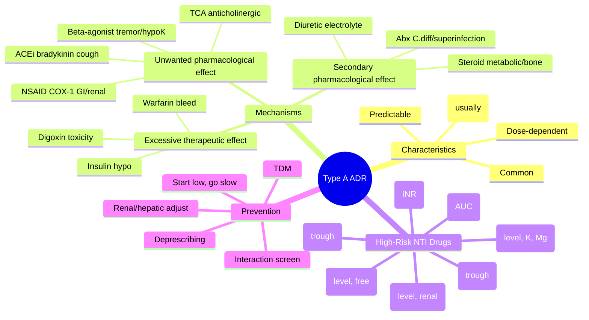

# Type A (Augmented) ADRs

**Status**: `draft` | **Chapter**: 2 — Clinical Therapeutics and Good Prescribing | **Heading**: Adverse Drug Reactions | **Exam Priority**: ⭐⭐⭐ **HIGH** (Mechanism-based, dose-predictable, common in exams)

---

## 1. 🎯 Learning Objectives
- [ ] Define Type A ADR: dose-dependent, predictable from pharmacology
- [ ] Distinguish Type A vs Type B (idiosyncratic) — classic exam differentiation
- [ ] List major mechanisms: excessive therapeutic effect, unwanted pharmacological effect, secondary pharmacological effect
- [ ] Identify high-risk drugs with narrow therapeutic index (NTI)
- [ ] Apply monitoring strategies to prevent Type A ADRs

---

## 2. 📖 Definition & Classification

| Feature | **Type A (Augmented)** | **Type B (Bizarre)** |
|---------|------------------------|----------------------|
| **Mechanism** | Exaggerated pharmacological effect | Idiosyncratic, non-pharmacological |
| **Dose-dependence** | **Yes** — ↑ dose = ↑ risk | No — unpredictable |
| **Predictability** | **Predictable** from known pharmacology | Unpredictable |
| **Incidence** | **Common** (high) | Rare |
| **Mortality** | Low (usually reversible) | High (unpredictable severity) |
| **Examples** | Warfarin bleed, insulin hypoglycaemia | Anaphylaxis, SJS/TEN, DRESS |
| **Management** | Dose reduction, monitoring, antagonist | **Drug withdrawal**, avoid rechallenge |

---

## 3. 🧬 Mechanisms of Type A ADRs

### 1. Excessive Therapeutic Effect (On-target, excessive)
| Drug | Therapeutic Effect | Type A ADR (Excessive) |
|------|-------------------|------------------------|
| Warfarin | Anticoagulation | **Haemorrhage** (INR >4) |
| Insulin / Sulfonylureas | ↓ Blood glucose | **Hypoglycaemia** |
| Antihypertensives | ↓ BP | **Symptomatic hypotension, falls** |
| Diuretics | Natriuresis | **Hyponatraemia, hypokalaemia, dehydration** |
| Beta-blockers | ↓ HR, ↓ contractility | **Bradycardia, heart block, HF exacerbation** |
| Opioids | Analgesia | **Respiratory depression, sedation** |
| Digoxin | ↑ Contractility | **Toxicity: nausea, arrhythmias, visual changes** |

### 2. Unwanted Pharmacological Effect (Off-target, predictable)
| Drug | Primary Target | Unwanted Effect (Off-target) |
|------|----------------|------------------------------|
| **NSAIDs** | COX-2 (inflammation) | **COX-1 → Gastric ulcer, renal vasoconstriction, platelet inhibition** |
| **Tricyclics (Amitriptyline)** | NA/5-HT reuptake | **Anticholinergic: dry mouth, constipation, urinary retention, confusion** |
| **First-gen antihistamines** | H1 receptor | **CNS H1 → Sedation; Anticholinergic; Alpha-1 → Hypotension** |
| **Beta-agonists (Salbutamol)** | Beta-2 (bronchodilation) | **Beta-1 → Tachycardia; Beta-2 → Tremor, Hypokalaemia** |
| **ACE inhibitors** | ACE → ↓ Ang II | **Bradykinin accumulation → Dry cough, Angioedema** |
| **Calcium channel blockers** | Vascular smooth muscle | **Reflex tachycardia (dihydropyridines); Constipation; Ankle oedema** |

### 3. Secondary Pharmacological Effect (Downstream consequence)
| Drug | Primary Effect | Secondary Effect → ADR |
|------|----------------|------------------------|
| **Corticosteroids** | Anti-inflammatory | **Hyperglycaemia, osteoporosis, adrenal suppression, Cushing's** |
| **Diuretics (Loop/Thiazide)** | Natriuresis | **Hypokalaemia → Arrhythmias, Digoxin toxicity; Hyponatraemia; Gout** |
| **Antibiotics (Broad-spectrum)** | Bactericidal | **C. difficile colitis; Resistance; Superinfection (Candida)** |
| **Bisphosphonates** | Osteoclast inhibition | **Oesophagitis; Atypical femoral fracture; ONJ** |

---

## 4. ⚠️ High-Risk Drugs for Type A ADRs (Narrow Therapeutic Index)

| Drug | Monitoring Parameter | Target Range | ADR if Exceeded |
|------|---------------------|--------------|-----------------|
| **Warfarin** | INR | 2.0–3.0 (most) / 2.5–3.5 (mechanical mitral) | **Major haemorrhage** |
| **Digoxin** | Serum level | 0.5–0.9 ng/mL (HF) / 0.8–2.0 (AF) | **Nausea, arrhythmias, visual (yellow halos)** |
| **Lithium** | Serum level | 0.6–1.0 mmol/L (maintenance) | **Tremor, NDI, renal, neurotoxicity (>1.5)** |
| **Phenytoin** | Total level | 10–20 µg/mL (free 1–2) | **Nystagmus, ataxia, gingival hyperplasia** |
| **Gentamicin** | Trough (extended interval) | <1 mg/L (Hartford) | **Nephrotoxicity, Ototoxicity** |
| **Vancomycin** | AUC₀₋₂₄/MIC | 400–600 | **Nephrotoxicity, Ototoxicity** |
| **Theophylline** | Serum level | 10–20 mg/L | **Seizures, arrhythmias, nausea** |
| **Ciclosporin / Tacrolimus** | Trough (C0) | Drug/indication specific | **Nephrotoxicity, HTN, neurotox, hyperK** |
| **Methotrexate (high-dose)** | Serum level (24h, 48h) | <1 µmol/L (24h) | **Myelosuppression, mucositis, hepatotoxicity** |

---

## 5. 🛡️ Prevention Strategies (Exam Essentials)

| Strategy | Application |
|----------|-------------|
| **Start low, go slow** | Elderly, renal/hepatic impairment, polypharmacy |
| **Therapeutic Drug Monitoring (TDM)** | NTI drugs: warfarin, digoxin, lithium, phenytoin, aminoglycosides, vancomycin, immunosuppressants |
| **Renal dose adjustment** | Cockcroft-Gault CrCl for: DOACs, metformin, aminoglycosides, gabapentin, allopurinol, antibiotics |
| **Hepatic dose adjustment** | Child-Pugh for: warfarin, phenytoin, theophylline, morphine, statins |
| **Drug interaction screening** | CYP450, P-gp, renal transporters — esp. initiators/inhibitors |
| **Patient education** | Hypoglycaemia symptoms, INR monitoring, fall risk, adrenal insufficiency (steroids) |
| **Deprescribing** | Review indication, time-to-benefit, ACB, DBI — STOPP/START |

---

## 6. 🎯 FCPS/MRCP High-Yield Summary

| Scenario | Type A ADR | Mechanism |
|----------|------------|-----------|
| Warfarin + antibiotics → INR 8, haematuria | **Haemorrhage** | Excessive therapeutic effect (↑ anticoagulation) |
| Elderly on furosemide 80mg → falls, confusion, Na⁺ 125 | **Hyponatraemia** | Unwanted effect (impaired water excretion) |
| Amitriptyline 50mg → dry mouth, constipation, urinary retention | **Anticholinergic syndrome** | Off-target (muscarinic blockade) |
| Salbutamol neb → tremor, tachycardia, K⁺ 2.8 | **Beta-2 stimulation** | Off-target (beta-1/2) |
| ACEi → persistent dry cough | **Bradykinin accumulation** | Secondary pharmacological effect |
| Prednisolone 30mg long-term → hyperglycaemia, osteoporosis | **Metabolic, bone** | Secondary pharmacological effect |

---

## 7. ❓ Viva Questions (8)

| Q | Answer |
|---|--------|
| 1. Define Type A ADR. Give 3 examples. | Dose-dependent, predictable from pharmacology. Examples: warfarin bleed, insulin hypoglycaemia, NSAID gastric ulcer |
| 2. How does Type A differ from Type B? | Type A: dose-dependent, predictable, common, low mortality. Type B: idiosyncratic, unpredictable, rare, high mortality |
| 3. Patient on warfarin, INR 6.5, no bleeding. Management? | **Omit 1–2 doses; vitamin K 1–2mg PO if INR >8 or risk factors; restart at lower dose when INR therapeutic** |
| 4. Elderly patient on amitriptyline develops confusion, dry mouth, constipation. ADR type? Mechanism? | **Type A** — anticholinergic (off-target muscarinic blockade) |
| 5. Why are NSAIDs high-risk for Type A ADRs in elderly? | COX-1 inhibition → ↓ gastric PG → ulcer; ↓ renal PG → AKI; antiplatelet → bleed; ↑ CV risk |
| 6. What monitoring prevents Type A ADRs with digoxin? | **Serum level (0.5–0.9 ng/mL), K⁺, Mg²⁺, renal function, ECG** — hypokalaemia ↑ toxicity |
| 7. Patient on ACEi develops angioedema. Mechanism? Management? | **Bradykinin accumulation** (ACE degrades bradykinin). **Stop ACEi; avoid ARB (30% cross-reactivity); use alternative** |
| 8. How does "Start low, go slow" prevent Type A ADRs? | Allows homeostatic adaptation; identifies susceptibility; reduces peak concentrations; crucial in elderly/renal/hepatic impairment |

---

## 8. 🤯 Confusions & Mnemonics

| Confusion | Clarification |
|-----------|---------------|
| **Type A vs B dose-dependence** | Type A = **dose-dependent**; Type B = **dose-independent** (but may need minimum dose to trigger) |
| **Type A = always mild?** | No — warfarin bleed, digoxin toxicity, insulin hypoglycaemia can be **fatal** |
| **On-target vs off-target** | On-target = excessive therapeutic (warfarin bleed); Off-target = unwanted pharmacology (amitriptyline anticholinergic) |
| **Secondary effect = Type C?** | No — secondary pharmacological effect is still **Type A** (predictable cascade). Type C = **chronic** (time-dependent, e.g., steroid osteoporosis) |

**Mnemonics:**
- **"A = Augmented = Dose-Dependent = Predictable"** — A for **Augmented**, **Anticipated**, **A lot** (common)
- **"Dose makes the poison"** — Type A
- **"B = Bizarre = Idiosyncratic"** — Type B

---

## 9. 🧠 Mind Map (Mermaid)

---

## 10. 📅 Spaced Repetition Tracker

| Review | Date | Score | Next |
|--------|------|-------|------|
| 1 | | | 1d |
| 2 | | | 3d |
| 3 | | | 1w |
| 4 | | | 2w |
| 5 | | | 1m |
| 6 | | | 3m |

---

## 11. 🧪 Self-Test Scorecard

| Section | Max | Score |
|---------|-----|-------|
| Definition & comparison Type A vs B | 6 | |
| Mechanisms (3 categories + examples) | 12 | |
| NTI drugs & monitoring | 10 | |
| Prevention strategies | 6 | |
| Viva answers | 8 | |
| **Total** | **42** | |

**Target**: ≥34/42 (80%)

---

## 12. 📝 Exam Answer Modes

### Long Question (10 marks): *"Classify ADRs with examples. Discuss Type A ADRs in detail."*
1. **Classification** (2): Rawlins/Thompson → Type A (Augmented), Type B (Bizarre), Type C (Chronic), D (Delayed), E (End of use), F (Failure) — or DoTS
2. **Type A Definition** (2): Dose-dependent, predictable, common, low mortality
3. **Three Mechanisms** (3): Excessive therapeutic, Unwanted pharmacological, Secondary pharmacological — with 2 examples each
4. **High-risk NTI drugs** (2): Table of drug, monitoring, target, ADR
5. **Prevention** (1): Start low/go slow, TDM, dose adjust, interaction screen, deprescribing

### Short Question (5 marks): *"Type A vs Type B ADR"*
- Table: Mechanism, Dose-dependence, Predictability, Incidence, Mortality, Examples, Management

### Viva (2 min): *"80yo on warfarin, INR 5.8, no bleed. Why Type A? Manage."*
- **Type A**: Excessive anticoagulation (dose-dependent, predictable)
- **Manage**: Omit 1–2 doses; Vit K 1mg PO if high bleed risk/elderly; Restart lower dose; Review interacting drugs

### Ward Round (30 sec): *"Patient on furosemide 80mg, K⁺ 2.9. Type A or B?"*
- **Type A** — Unwanted pharmacological effect (renal K⁺ wasting). **Action**: K⁺ replacement, ↓ dose, add K⁺-sparing, review indication.

### Last-Night Revision (1-liners):
- Type A = Augmented = Dose-dependent = Predictable = Common
- Type B = Bizarre = Idiosyncratic = Unpredictable = Rare = High mortality
- NTI drugs: Warfarin, Digoxin, Lithium, Phenytoin, Gentamicin, Vancomycin, Tacrolimus, Theophylline
- Mechanisms: 1° Excessive therapeutic 2° Off-target 3° Secondary cascade

---

## 13. 📚 Summary Card

> **TYPE A ADR TRIAD:**
> 1. **Excessive therapeutic** — Warfarin bleed, Insulin hypo, Digoxin toxicity
> 2. **Unwanted pharmacological** — NSAID GI/renal, TCA anticholinergic, ACEi cough, Beta-agonist tremor
> 3. **Secondary pharmacological** — Steroid metabolic/bone, Diuretic electrolytes, Abx C.diff
>
> **PREVENTION:** Start low, go slow + TDM (NTI) + Renal/hepatic adjust + Interaction screen + Deprescribe

---

## 14. ❓ MCQs (10)

1. **Which characteristic defines a Type A (Augmented) ADR?**
   A. Idiosyncratic, unpredictable
   B. **Dose-dependent, predictable from pharmacology** ✓
   C. Occurs after long-term use only
   D. Immunologically mediated
   E. Genetic predisposition required

2. **Warfarin-induced haemorrhage with INR >4 is an example of which Type A mechanism?**
   A. Unwanted pharmacological effect
   B. **Excessive therapeutic effect** ✓
   C. Secondary pharmacological effect
   D. Idiosyncratic reaction
   E. Drug interaction effect

3. **Amitriptyline causing dry mouth, constipation, and urinary retention represents:**
   A. Type B ADR
   B. **Type A: Unwanted pharmacological effect (anticholinergic)** ✓
   C. Excessive therapeutic effect
   D. Secondary pharmacological effect
   E. Drug interaction

4. **ACE inhibitor-induced dry cough is mediated by:**
   A. Excessive therapeutic effect (oversuppression of Ang II)
   B. **Bradykinin accumulation (secondary pharmacological effect)** ✓
   C. Unwanted pharmacological effect (off-target receptor)
   D. Direct bronchial irritation
   E. Type B idiosyncratic reaction

5. **Which drug does NOT have a narrow therapeutic index requiring TDM?**
   A. Digoxin
   B. Lithium
   C. Phenytoin
   D. **Amoxicillin** ✓
   E. Warfarin

6. **An elderly patient on furosemide 80 mg daily develops hyponatraemia (Na⁺ 125 mmol/L). This is a Type A ADR via which mechanism?**
   A. Excessive therapeutic effect
   B. **Unwanted pharmacological effect (impaired water excretion)** ✓
   C. Secondary pharmacological effect
   D. Type B idiosyncratic
   E. Drug interaction

7. **Salbutamol-induced tremor and hypokalaemia are due to:**
   A. Excessive beta-2 bronchodilation
   B. **Unwanted pharmacological effect (beta-2 stimulation in muscle, beta-1 in heart)** ✓
   C. Secondary effect of hypoxia correction
   D. Type B hypersensitivity
   E. Drug interaction with steroids

8. **Corticosteroid-induced osteoporosis is classified as:**
   A. Type A: Excessive therapeutic effect
   B. Type A: Unwanted pharmacological effect
   C. **Type A: Secondary pharmacological effect (metabolic/bone)** ✓
   D. Type C: Chronic ADR only
   E. Type B: Idiosyncratic

9. **Key prevention strategy for Type A ADRs in elderly polypharmacy patients:**
   A. Avoid all medications
   B. **Start low, go slow; regular review; deprescribing** ✓
   C. Use only Type B drugs
   D. Increase doses gradually to tolerance
   E. Routine genetic testing

10. **Patient on digoxin 125 mcg develops nausea, yellow vision, and bradycardia. Serum K⁺ 3.1. Most likely explanation:**
    A. Type B ADR
    B. **Type A ADR: Digoxin toxicity precipitated by hypokalaemia** ✓
    C. Drug interaction with ACEi
    D. Secondary pharmacological effect
    E. Idiopathic intolerance

---

## 15. 🃏 Flashcards (Anki-ready)

| Front | Back |
|-------|------|
| Type A ADR definition | Dose-dependent, predictable from pharmacology, common, usually reversible |
| Type B ADR definition | Idiosyncratic, non-dose-dependent, unpredictable, rare, high mortality |
| Type A mechanism 1 | **Excessive therapeutic effect** — Warfarin bleed, Insulin hypo, Digoxin toxicity |
| Type A mechanism 2 | **Unwanted pharmacological (off-target)** — NSAID COX-1 GI/renal, TCA anticholinergic, ACEi cough, Beta-agonist tremor |
| Type A mechanism 3 | **Secondary pharmacological** — Steroid metabolic/bone, Diuretic electrolytes, Abx C.diff |
| NTI drugs requiring TDM | Warfarin (INR), Digoxin (level/K/Mg), Lithium (level/renal), Phenytoin (level), Gentamicin (trough), Vancomycin (AUC), Tacrolimus/Ciclosporin (trough), Theophylline (level) |
| ACEi cough mechanism | Bradykinin accumulation (ACE degrades bradykinin) |
| NSAID GI/renal mechanism | COX-1 inhibition → ↓ prostaglandins → ↓ gastric mucus/HCO₃⁻, ↓ renal vasodilation |
| TCA anticholinergic SEs | Dry mouth, constipation, urinary retention, confusion, blurred vision, tachycardia |

---

## 16. ✅ Answer Keys

### MCQs
1. **B** — Type A = dose-dependent, predictable
2. **B** — Warfarin bleed = excessive anticoagulation (therapeutic effect)
3. **B** — TCA anticholinergic = unwanted off-target muscarinic blockade
4. **B** — Bradykinin accumulation = secondary pharmacological effect
5. **D** — Amoxicillin wide TI, no TDM
6. **B** — Furosemide hyponatraemia = unwanted effect (impaired dilution)
7. **B** — Salbutamol tremor/hypoK = beta-2 off-target (muscle, K⁺ shift)
8. **C** — Steroid osteoporosis = secondary metabolic effect (chronological but pharmacologically mediated)
9. **B** — Start low/go slow + review + deprescribe
10. **B** — Digoxin toxicity + hypokalaemia = Type A (predictable, dose/exposure dependent)

---

*File: `/mnt/tb/Medicine/Clinical Therapeutics and Good Prescribing/ADRs/Type A (Augmented).md` | Status: `draft` → upgrade to `full-fcps-mrcp-note` after review*
