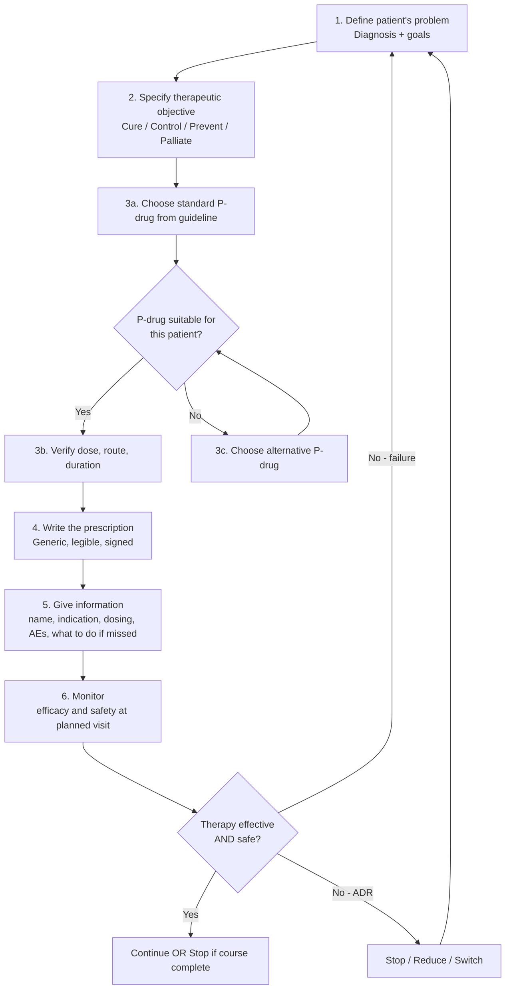
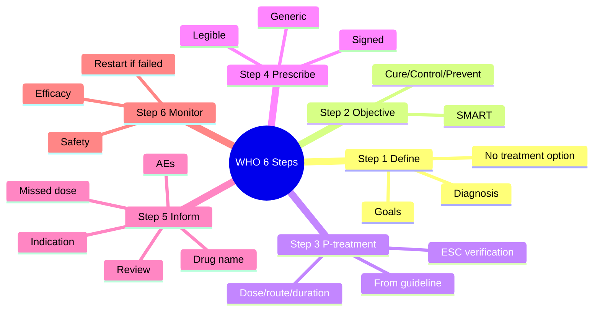

# WHO 6-Step Model of Rational Prescribing

> [!info]
> **Disease-Level Topic** under **Principles of Rational Prescribing → Steps of Rational Prescribing**.
> Davidson 24e Ch2 — "Introduction to Good Prescribing" (Maxwell SRJ).

## 1. Learning Objectives
- [ ] Recall and apply the 6 steps of the WHO prescribing model
- [ ] Differentiate Step 2 (objective) from Step 3 (treatment choice)
- [ ] Use Venn diagrams to choose between competing P-drugs
- [ ] Counsel a patient at Step 5 (information, instructions, warnings)
- [ ] Design a Step 6 monitoring plan (efficacy + safety)
- [ ] Recognise when to restart the cycle (treatment failure / ADR)

## 2. The 6 Steps in Detail

| Step | Action | Output / Document |
|------|--------|-------------------|
| **1. Define the patient's problem** | Make a diagnosis; identify goals; rule out "no treatment needed" | Problem list, working diagnosis |
| **2. Specify the therapeutic objective** | What do we want to achieve? (cure, control, prevention, palliation) | SMART objective |
| **3. Choose a standard P-treatment (P-drug)** | From guidelines, local formulary, BNF; verify ESC criteria | Selected drug + dose + duration |
| **4. Write the prescription** | Generic name, dose, route, frequency, duration, indication, prescriber details | Legally valid Rx |
| **5. Give information** | Drug name, indication, when/how to take, side effects, what to do if missed | Patient information leaflet + verbal counselling |
| **6. Monitor** | Efficacy (clinical + biochemical) + safety (ADR, labs); review at planned interval | Follow-up plan |

## 3. Mermaid Algorithm — WHO 6-Step Cycle

## 4. Comparison Tables

### 4.1 Common Errors at Each Step

| Step | Common Error | Example |
|------|--------------|---------|
| 1 | Treating symptom without diagnosis | Proton pump inhibitor for dyspepsia without endoscopy in red flags |
| 2 | Unclear objective | "Treat the patient" vs "Reduce BP to <140/90 in 3 months" |
| 3 | Choosing newest / branded drug | Rosuvastatin without indication when simvastatin works |
| 4 | Ambiguous dose | "Take as directed" or "One tablet daily" without specifying morning/night |
| 5 | No information on AEs | Patient stops amiodarone after seeing blue-grey skin |
| 6 | No follow-up plan | Methotrexate weekly without FBC monitoring → pancytopenia |

### 4.2 SMART Therapeutic Objective

| Letter | Meaning | Example |
|--------|---------|---------|
| **S** | Specific | Reduce HbA1c |
| **M** | Measurable | to <7.0% (53 mmol/mol) |
| **A** | Achievable | with metformin + lifestyle |
| **R** | Relevant | to reduce microvascular complications |
| **T** | Time-bound | within 6 months |

### 4.3 Information to Give at Step 5 (Mnemonic: **"DIM AWARE"**)

| Letter | Information |
|--------|------------|
| **D** | **D**rug name (generic + brand) |
| **I** | **I**ndication (why you are taking it) |
| **M** | **M**issed dose instructions |
| **A** | **A**dverse effects (common + serious) |
| **W** | **W**arnings (interactions, driving) |
| **A** | **A**ctions if side effect / when to stop |
| **R** | **R**eview date |
| **E** | **E**xpectations (when to feel better) |

## 5. FCPS/MRCP High-Yield Summary

| Pearl | Detail |
|-------|--------|
| Step most often skipped in practice | Step 1 (definitive diagnosis) |
| Step most often poorly performed | Step 5 (patient information) — leads to 50% non-adherence |
| Step requiring a SMART objective | Step 2 |
| Step requiring patient involvement | Step 5 (counselling) |
| Step that closes the loop | Step 6 (monitor) — if missed, ADRs and failure undetected |
| Therapeutic objective for HTN | BP <140/90 (or <130/80 in DM/CKD) within 3 months |
| Therapeutic objective for DVT | Prevent PE and recurrence; anticoagulate for ≥3 months |
| Therapeutic objective for palliative pain | Pain score ≤3/24 with minimal sedation |

## 6. Viva Questions (10)

1. **List the WHO 6 steps in order.**
   *1) Define the patient's problem; 2) Specify therapeutic objective; 3) Choose P-treatment; 4) Write prescription; 5) Give information; 6) Monitor.*

2. **What is the most often skipped step? Why does it matter?**
   *Step 1 — defining the problem. Skipping it leads to symptomatic Rx without diagnosis and missed serious disease (e.g., PPI for gastric cancer symptoms).*

3. **Differentiate Step 2 from Step 3.**
   *Step 2 = therapeutic objective (what you want to achieve). Step 3 = how to achieve it (which drug, dose, duration).*

4. **Give a SMART objective for a patient with new T2DM (HbA1c 8.5%).**
   *Reduce HbA1c from 8.5% to <7.0% (53 mmol/mol) within 6 months using metformin + lifestyle, monitored 3-monthly.*

5. **What are the 4 elements of Step 3 (Choose P-treatment)?**
   *Verify efficacy, safety, suitability (no CI, no interaction), cost.*

6. **A prescription says "Take as directed." What is wrong?**
   *It is ambiguous; no dose, frequency, duration, or indication. Open to dosing error. Always write: drug + dose + route + frequency + duration + indication.*

7. **What information should be given at Step 5?**
   *Drug name, indication, dosing, common and serious side effects, what to do if missed dose, when to seek help, review date.*

8. **What does Step 6 monitor?**
   *Efficacy (does it work?) AND safety (any ADR?). Includes clinical, biochemical, and patient-reported outcomes.*

9. **When should you restart the cycle (return to Step 1)?**
   *On treatment failure (objective not met), new symptoms, suspected ADR, or change in patient context (new comorbidity, pregnancy, age).*

10. **Why is Step 5 considered the most important in adherence?**
    *Verbal + written information improves adherence by 30-50% (WHO). Most "treatment failure" is actually non-adherence due to inadequate counselling.*

## 7. Confusions & Mnemonics

| Confusion | Resolution |
|-----------|------------|
| Step 2 vs Step 3 | Step 2 = WHAT (objective); Step 3 = HOW (drug). E.g., "BP <140/90" vs "amlodipine 5 mg OD." |
| Step 4 vs Step 5 | Step 4 = written prescription (for pharmacist); Step 5 = verbal + written information (for patient). |
| "Start low, go slow" | A prescribing principle for elderly — usually applies to dose titration in Step 3/4. |
| Step 6 vs Follow-up | Step 6 = planned monitoring schedule (liver tests, INR, BP); Follow-up = clinic visit. |
| Step 3a vs Step 3b | Step 3a = standard P-drug from guideline; Step 3b = verify it's safe for THIS patient (CI, allergy, interaction). |

**Mnemonic — 6 Steps: "**D**efine **S**pecify **C**hoose **W**rite **I**nform **M**onitor"** *(DSCWIM — like "discuss")*

**Mnemonic — Information at Step 5: "**DIM AWARE**"** *(Drug, Indication, Missed dose, Adverse effects, Warnings, Actions, Review, Expectations)*

## 8. Mermaid Mind Map

## 9. Spaced Repetition Tracker

| Step | Day 1 | Day 3 | Day 7 | Day 14 | Day 30 |
|------|-------|-------|-------|-------|--------|
| Step 1 define | ☐ | ☐ | ☐ | ☐ | ☐ |
| Step 2 SMART | ☐ | ☐ | ☐ | ☐ | ☐ |
| Step 3 ESC | ☐ | ☐ | ☐ | ☐ | ☐ |
| Step 4 prescription | ☐ | ☐ | ☐ | ☐ | ☐ |
| Step 5 DIM AWARE | ☐ | ☐ | ☐ | ☐ | ☐ |
| Step 6 monitor | ☐ | ☐ | ☐ | ☐ | ☐ |

## 10. Self-Test Scorecard

| Domain | Score (0-5) |
|--------|-------------|
| Recall of 6 steps | /5 |
| Step 2 SMART objective | /5 |
| Step 3 ESC verification | /5 |
| Step 4 legal Rx writing | /5 |
| Step 5 patient information | /5 |
| Step 6 monitoring | /5 |
| **TOTAL** | **/30** |

## 11. MCQs (10)

1. **Step 1 of the WHO prescribing model is:**
   A. Specify therapeutic objective
   B. Define the patient's problem ✓
   C. Choose P-treatment
   D. Write prescription
   E. Monitor

2. **A SMART therapeutic objective should be:**
   A. Specific, Measurable, Achievable, Relevant, Time-bound ✓
   B. Simple, Manageable, Achievable, Reasonable, Timely
   C. Safe, Measured, Active, Rational, Targeted
   D. Specific, Meaningful, Audited, Reviewed, Timed
   E. Simple, Measured, Affordable, Real, Tested

3. **Step 3 (Choose P-treatment) requires verification of:**
   A. Efficacy, Safety, Suitability, Cost ✓
   B. Efficacy, Speed, Simplicity, Cost
   C. Effectiveness, Safety, Suitability, Cost
   D. Evidence, Safety, Suitability, Cost
   E. Efficacy, Safety, Schedule, Cost

4. **Which step is most often poorly performed, leading to non-adherence?**
   A. Step 1
   B. Step 2
   C. Step 3
   D. Step 4
   E. Step 5 ✓

5. **A prescription reads "Take 1 tablet daily." What is missing?**
   A. Patient name
   B. Drug name, dose, route, duration, prescriber signature ✓
   C. Pharmacy name
   D. Hospital address
   E. Insurance number

6. **Step 6 (Monitor) should assess:**
   A. Efficacy only
   B. Safety only
   C. Both efficacy and safety ✓
   D. Adherence only
   E. Cost only

7. **"Reduce BP to <140/90 mmHg within 3 months" is an example of:**
   A. Step 1
   B. Step 2 ✓
   C. Step 3
   D. Step 4
   E. Step 5

8. **Information to give the patient at Step 5 includes all EXCEPT:**
   A. Drug name
   B. Indication
   C. Common side effects
   D. Mechanism of action ✓
   E. What to do if dose missed

9. **The cycle returns to Step 1 when:**
   A. Treatment is successful
   B. Treatment fails or a new problem emerges ✓
   C. Patient is discharged
   D. Prescription is collected
   E. Yearly review

10. **Which step requires LEGAL compliance (signature, date, registration)?**
    A. Step 1
    B. Step 2
    C. Step 3
    D. Step 4 ✓
    E. Step 5

## 12. SBAs (5)

1. **A 60-year-old man with AF and CHA2DS2-VASc 3 is started on apixaban 5 mg BD. Which step of the WHO model is this?**
   - A) Step 1
   - B) Step 2
   - C) Step 3 ✓
   - D) Step 4
   - E) Step 6

2. **The doctor tells the patient: "This is warfarin, a blood thinner, to prevent stroke. Take it at 6 pm. Avoid cranberry juice. We will check INR in 3 days." Which step is this?**
   - A) Step 1
   - B) Step 2
   - C) Step 3
   - D) Step 4
   - E) Step 5 ✓

3. **A 50-year-old newly diagnosed T2DM has HbA1c 8.5%. The therapeutic objective is to reduce HbA1c to <7.0% in 6 months. Which step does this represent?**
   - A) Step 1
   - B) Step 2 ✓
   - C) Step 3
   - D) Step 4
   - E) Step 6

4. **A patient on methotrexate 15 mg weekly for RA has FBC and LFTs checked monthly. Which step is this?**
   - A) Step 1
   - B) Step 3
   - C) Step 4
   - D) Step 5
   - E) Step 6 ✓

5. **A junior writes "Methotrexate 2.5 mg — take 1 tablet TDS" (intended weekly). What is the most likely outcome?**
   - A) Inadequate RA control
   - B) Pancytopenia and death ✓
   - C) Hepatotoxicity only
   - D) No effect
   - E) Improved adherence

## 13. Answer Key

### MCQ Answers
1. **B** (Step 1 = define the problem)
2. **A** (SMART = Specific, Measurable, Achievable, Relevant, Time-bound)
3. **A** (ESC criteria)
4. **E** (Step 5 = counselling; most skipped)
5. **B** (Missing drug name, dose, route, duration, signature)
6. **C** (Both efficacy AND safety)
7. **B** (Step 2 = objective)
8. **D** (Mechanism of action is NOT routinely given — name, indication, AE, missed dose are)
9. **B** (Restart cycle on failure/new problem)
10. **D** (Step 4 = written prescription, legally required)

### SBA Answers
1. **C** — Step 3 = choose P-drug (apixaban 5 mg BD for stroke prevention in AF).
2. **E** — Step 5 = giving patient information (drug name, indication, dosing, interactions, monitoring).
3. **B** — Step 2 = therapeutic objective (HbA1c target).
4. **E** — Step 6 = monitoring (FBC, LFT for methotrexate safety).
5. **B** — Methotrexate daily (instead of weekly) = pancytopenia and death. Well-documented fatal error.

## 14. Summary Box

> **WHO 6-step model = "DSCWIM"** (Define, Specify, Choose, Write, Inform, Monitor). Step 2 is SMART objective; Step 3 verifies ESC; Step 5 is most-skipped but most-important for adherence; Step 6 closes the loop. Restart cycle on failure or new problem.

---

## 15. Cross-Links
- **Parent Topic-Group**: [[../Principles of Rational Prescribing|Principles of Rational Prescribing]]
- **Sibling Topic-Groups**: [[Definition and aims]], [[Evidence-based prescribing]], [[Prescription writing]]
- **Heading Hub**: [[Principles of Rational Prescribing]]
- **Chapter MOC**: [[Clinical Therapeutics and Good Prescribing MOC]]
- **Related**: [[ADRs]], [[Drug Interactions]], [[Therapeutic Drug Monitoring]]

**Last Updated:** 2026-06-15  
**Status: FULLY COMPLETE with Exam Suite (Viva 10, MCQ 10, SBA 5, Answer Key, Confusions, Mind Map, Spaced Repetition, Self-Test, Exam Modes)**
