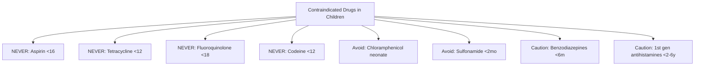
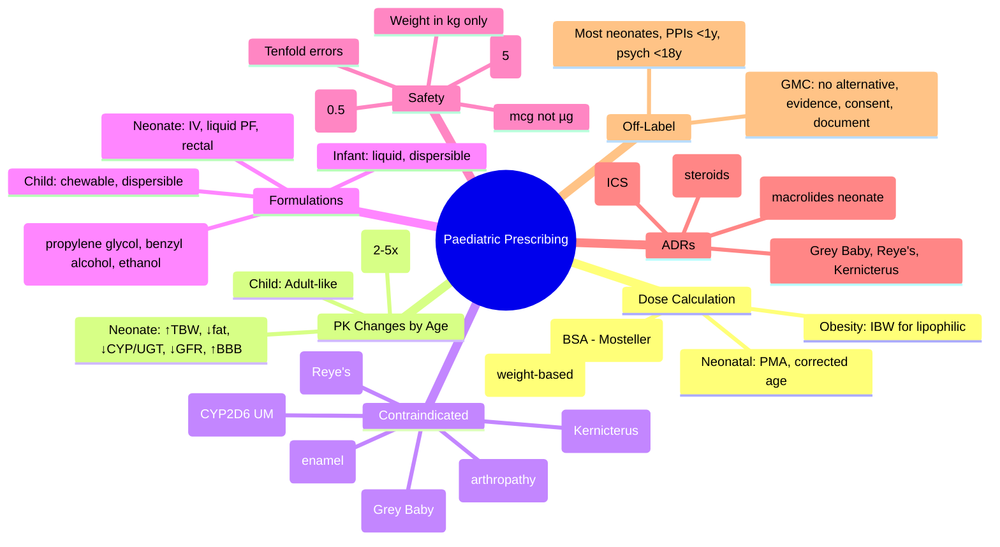

# Paediatric Prescribing Guide

> [!tip] **FCPS/MRCP Priority: HIGH**
> **Daily paediatric practice + exams.** Weight-based dosing (mg/kg) is non-negotiable. Four "NEVER" contraindications: **Aspirin <16, Tetracycline <12, Fluoroquinolone <18, Codeine <12**. Tenfold error prevention (lead zero, no trail zero) is examinable. Off-label prescribing framework (GMC) appears in ethics vivas.
> Viva classic: *"15kg child needs ceftriaxone 50mg/kg IV. Vial 1g reconstituted to 100mg/mL. What volume?"*

---

## 1. Learning Objectives

By the end of this note you should be able to:
- [ ] Calculate **weight-based doses (mg/kg)** and **BSA-based doses (mg/m²)** accurately
- [ ] Apply **age-related physiological changes** (neonate → adolescent) to drug selection & dosing
- [ ] Identify **contraindicated/avoided drugs** in children (aspirin, tetracyclines, fluoroquinolones, codeine)
- [ ] Use **age-appropriate formulations** (oral liquid, dispersible, rectal, IV)
- [ ] Recognise **paediatric-specific ADRs** (Grey Baby Syndrome, Reye's, Kernicterus, growth suppression, enamel dysplasia)
- [ ] Perform **paediatric medication safety checks** (tenfold errors, decimal points, unlicensed/off-label)
- [ ] Counsel **parents/carers** on administration, storage, adherence
- [ ] Answer viva: "Weight-based calculation" and "Codeine contraindication mechanism" and "Ceftriaxone in jaundiced neonate"

---

## 2. Core Concept: Paediatric Dosing Principles

```mermaid
flowchart TD
    A[Child Presenting for Prescribing] --> B[Obtain ACCURATE Weight (kg) & Height (cm)]
    B --> C{Calculate Dose}
    C --> D1[Weight-Based (mg/kg)\nMost drugs]
    C --> D2[BSA-Based (mg/m²)\nChemo, high TI drugs]
    C --> D3[Neonatal: PMA/Corrected Age\nCaffeine, gentamicin, phenobarbital]
    D1 --> E[Select Formulation\nAge-appropriate]
    D2 --> E
    D3 --> E
    E --> F[Safety Check\nTenfold errors, lead zero, trail zero]
    F --> G[Document: mg/kg, weight, BSA, calculation, formulation, max dose]
    G --> H[Counsel Parent/Carer\nAdministration, storage, adverse effects]
    
    style A fill:#e3f2fd
    style B fill:#fff3e0
    style F fill:#fce4ec
    style H fill:#e8f5e9
```

> **Golden Rule:** *Every paediatric prescription MUST have: weight in kg, dose in mg (or mcg), calculation shown, formulation specified, maximum daily dose stated.*

---

## 3. Dose Calculation Methods

### 2.1 Weight-Based (mg/kg) — Most Common

$$Dose (mg) = Weight (kg) \times Dose (mg/kg)$$

- **Standard**: Use **actual body weight** (not ideal)
- **Obese (BMI >95th percentile)**: Consider **ideal body weight** for **lipophilic drugs** (e.g., gentamicin, digoxin, midazolam)
- **Neonates**: Use **birth weight** until term corrected age; then current weight

### 2.2 Body Surface Area (BSA) — Chemo, Some Antibiotics, High TI Drugs

$$BSA (m^2) = \sqrt{\frac{Height (cm) \times Weight (kg)}{3600}} \quad \text{(Mosteller)}$$

$$Dose (mg) = BSA (m^2) \times Dose (mg/m^2)$$

| Age | Weight (kg) | BSA (m²) |
|-----|-------------|----------|
| Preterm 28wk | 1.0 | 0.08 |
| Term neonate | 3.5 | 0.20 |
| 6 months | 7.5 | 0.35 |
| 1 year | 10 | 0.46 |
| 5 years | 18 | 0.68 |
| 10 years | 30 | 1.00 |
| Adult | 70 | 1.73 |

### 2.3 Age-Based (Clark's Rule / Fried's Rule) — Historical/Estimation Only

- **Fried's Rule** (infants <1yr): $$Dose = \frac{Age (months)}{150} \times Adult Dose$$
- **Clark's Rule** (children 1–12yr): $$Dose = \frac{Weight (lb)}{150} \times Adult Dose$$

> **⚠️ Not for precision prescribing** — use weight/BSA

### 2.4 Neonatal Dosing: Postmenstrual Age (PMA) & Postnatal Age

| Concept | Definition |
|---------|------------|
| **Gestational Age (GA)** | Weeks from LMP to birth |
| **Postnatal Age** | Days/weeks since birth |
| **Postmenstrual Age (PMA)** | GA + Postnatal age |
| **Corrected Age** | Postnatal age - (40 - GA) |

**Neonatal dosing often uses PMA** (e.g., caffeine, gentamicin, phenobarbital)

---

## 4. Age-Related Pharmacokinetic Changes

```mermaid
flowchart LR
    A[Developmental PK Changes] --> B[Neonate/Preterm]
    A --> C[Infant 1-12m]
    A --> D[Child 1-12y]
    A --> E[Adolescent]
    
    B --> B1[↑ TBW 80-90%\n↓ Fat 1%\n↓ Albumin\n↓ CYP450 (Phase I)\n↓↓ UGT (Phase II)\n↓↓ GFR 10-20\n↑ BBB permeability]
    C --> C1[TBW 75%\nFat 15%\nCYP OVERSHOOT 2-5x adult\nUGT maturing\nGFR 100+\nTubular secretion maturing]
    D --> D1[Adult-like PK\nTBW 60%\nFat 15-20%\nAdult CYP/UGT\nAdult GFR]
    E --> E1[Adult PK\nPuberty hormonal effects\nBody composition changes]
```

| Parameter | Preterm Neonate | Term Neonate | Infant (1–12m) | Child (1–12y) | Adolescent |
|-----------|-----------------|--------------|----------------|---------------|------------|
| **Gastric pH** | High | High → ↓ by 2wk | Low (adult-like) | Adult | Adult |
| **Gastric emptying** | Slow | Slow → normal 6m | Normal | Normal | Normal |
| **Protein binding** | ↓ Albumin (↑ free drug) | ↓ Albumin | ↑ to adult | Adult | Adult |
| **Body water (TBW)** | **↑ 80–90%** | **↑ 75%** | 65% | 60% | 60% |
| **Body fat** | **↓ 1%** | **↓ 15%** | 25% | 15–20% | 15–20% |
| **CYP450 (Phase I)** | **↓↓↓ Immature** | **↓↓ Immature** | **↑↑ Overshoot** (2–5× adult) | Adult | Adult |
| **UGT (Phase II)** | **↓↓↓ Very low** | **↓↓ Low** | ↑ to adult | Adult | Adult |
| **Renal: GFR** | **↓↓ 10–20 mL/min** | **↓ 20–40** | ↑↑ 100+ | Adult 120 | Adult |
| **Renal: Tubular secretion** | **Absent** | **Immature** | Maturing | Adult | Adult |
| **BBB permeability** | **Permeable** | **Permeable** | Less permeable | Adult | Adult |

---

## 5. Key Drug-Specific Implications by Age

| Drug Class | Neonatal/Infant Consideration |
|------------|------------------------------|
| **Aminoglycosides (Gentamicin)** | ↑ Vd (↑ TBW) → higher mg/kg dose; ↓ clearance (↓ GFR) → extended interval (q24–48h); TDM essential |
| **Vancomycin** | ↑ Vd; ↓ clearance → AUC-guided dosing (target 400–600 mg·h/L) |
| **Phenytoin / Phenobarbital** | ↓ Protein binding → ↑ free fraction; ↓ metabolism → saturation kinetics; TDM total + free |
| **Morphine / Opioids** | ↑ BBB permeability → ↑ respiratory depression risk; ↓ UGT2B7 (morphine-6-glucuronide) |
| **Paracetamol** | ↓ Glucuronidation (UGT1A6) → ↑ oxidative pathway (NAPQI) **BUT** ↑ sulphation compensates; standard 15mg/kg safe |
| **Chloramphenicol** | **↓ UGT** → **Grey Baby Syndrome** (cardiovascular collapse, ashen grey) — **AVOID neonates** |
| **Sulfonamides** | Displace bilirubin → **Kernicterus** — avoid <2 months (and G6PD deficiency) |
| **Cephalosporins (3rd gen)** | ↑ Vd, ↓ clearance → standard mg/kg but extended interval in preterm |
| **Proton Pump Inhibitors** | CYP2C19 polymorphism matters; omeprazole ↓ clearance in infants |
| **Corticosteroids (inhaled/nasal)** | Growth velocity monitoring; adrenal suppression risk |

---

## 6. Contraindicated / Avoided Drugs in Children — THE BIG FOUR + MORE



| Drug | Age Avoidance | Reason | Alternative |
|------|---------------|--------|-------------|
| **Aspirin** | **<16 years** (UK) / <19 (US) | **Reye's Syndrome** (viral illness + aspirin → hepatic encephalopathy) | Paracetamol, ibuprofen |
| **Tetracyclines** (doxycycline, minocycline) | **<12 years** (some <8) | **Enamel dysplasia, bone deposition, growth inhibition** | Macrolides, amoxicillin |
| **Fluoroquinolones** (ciprofloxacin) | **<18 years** (avoid <18 unless no alternative) | **Arthropathy, tendonitis, cartilage damage** | 3rd gen cephalosporin, TMP-SMX |
| **Codeine** | **<12 years** (UK) / <18 post-tonsillectomy | **CYP2D6 ultra-rapid metabolizers → morphine toxicity (apnoea, death)** | Morphine, oxycodone, paracetamol+ibuprofen |
| **Tramadol** | **<12 years** | Similar CYP2D6 risk; seizures | As above |
| **Chloramphenicol** | **Neonates <1 month** | **Grey Baby Syndrome** (↓ UGT) | Ceftriaxone, meropenem |
| **Sulfonamides** (TMP-SMX) | **<2 months** (and G6PD) | **Kernicterus** (bilirubin displacement) | Alternative abx |
| **Benzodiazepines** (oral midazolam excepted) | **<6 months** / cautious <2y | Respiratory depression, paradoxical agitation | Age-appropriate sedation |
| **Antihistamines 1st gen** (promethazine, diphenhydramine) | **<2 years** (FDA) / <6y (UK) | Respiratory depression, sedation, paradoxical excitation | 2nd gen (cetirizine, loratadine) |
| **Hyoscine / Antimuscarinics** | **<2 years** | Hyperthermia, ileus, CNS effects | Domperidone (caution), ondansetron |
| **Droperidol / Metoclopramide** (high dose/prolonged) | **<1 year** / <20kg | Extrapyramidal, NMS risk | Ondansetron, cyclizine (caution) |
| **Topical corticosteroids** (high potency) | **<1 year** face/flexures | Skin atrophy, adrenal suppression | Low potency, short course |

---

## 7. Formulation Selection by Age

| Age | Preferred Formulations | Avoid |
|-----|------------------------|-------|
| **Preterm/Term Neonate** | IV, oral liquid (preservative-free), rectal, buccal | Tablets, capsules, alcohol-containing liquids |
| **Infant (1–12m)** | Oral liquid, dispersible tablet, rectal, IV | Tablets, capsules, chewables (choking) |
| **Child 1–5y** | Oral liquid, dispersible/chewable, sprinkle capsules | Large tablets, sublingual |
| **Child 6–12y** | Tablets (small), chewable, dispersible, liquid | Large unscored tablets |
| **Adolescent** | Adult formulations usually OK | — |

**Key excipients to avoid in neonates/infants:**
- **Propylene glycol** (lorazepam IV, phenytoin IV) — metabolic acidosis, seizures
- **Benzyl alcohol** (preservative) — gasping syndrome (preterm)
- **Ethanol** (oral liquids) — CNS depression
- **Sorbitol / Mannitol** — osmotic diarrhoea

---

## 8. Paediatric Medication Safety — **TENFOLD ERROR PREVENTION**

### 7.1 Common Error Traps

| Error Type | Example | Prevention |
|------------|---------|------------|
| **Decimal point** | 0.5 mg written as .5 mg → read as 5 mg | **Always write 0.5 mg (leading zero); never .5 mg** |
| **Trailing zero** | 5.0 mg → read as 50 mg | **Never write trailing zeros (5 mg not 5.0 mg)** |
| **Unit confusion** | mg vs mcg (µg) | **Write microgram in full or use mcg; avoid µg** |
| **Weight error** | lb vs kg | **Document weight in kg ONLY**; convert at admission |
| **BSA calculation** | Wrong formula / height error | **Use Mosteller; verify height** |
| **Concentration error** | 100 mg/5mL vs 100 mg/mL | **State concentration on prescription**; double-check |
| **Frequency error** | "daily" vs "BD" vs "TDS" | **Write in full: ONCE DAILY, TWICE DAILY** |
| **Age-inappropriate formulation** | Tablet to 2-year-old | **Specify formulation on Rx** |

### 7.2 Safety Checklist (Every Prescription)

```
☐ Patient name, DOB, weight (kg), height (cm), BSA (m²), gestational age (if <2y)
☐ Drug name (generic), dose in mg (or mcg), NOT "1 tablet"
☐ Dose calculation shown: mg/kg or mg/m² + weight/BSA used
☐ Route, frequency (in words), duration
☐ Formulation specified (liquid: concentration mg/mL)
☐ Maximum daily dose stated
☐ Renal/hepatic adjustment noted if applicable
☐ Allergy status documented
☐ Unlicensed/off-label status flagged + justification
☐ Prescriber signature, GMC, date
```

---

## 9. Common Paediatric Dosing Quick Reference

### 8.1 Analgesia / Antipyretics

| Drug | Dose | Max | Notes |
|------|------|-----|-------|
| **Paracetamol** | **15 mg/kg/dose** PO/PR q4–6h | **60 mg/kg/day** (max 4g/day >50kg) | 120 mg/5mL (24 mg/mL) or 250 mg/5mL |
| **Ibuprofen** | **10 mg/kg/dose** PO q6–8h | **30–40 mg/kg/day** | >3 months, >5kg; with food; avoid dehydration |
| **Morphine** | **0.1–0.2 mg/kg/dose** IV q2–4h | — | Neonate: 0.05–0.1 mg/kg; PCA >6y; monitor resp |
| **Fentanyl** | **1–2 mcg/kg/dose** IV | — | Intranasal 1.5–2 mcg/kg (procedural) |

### 8.2 Antibiotics (Common)

| Drug | Dose (mg/kg) | Frequency | Key Notes |
|------|--------------|-----------|-----------|
| **Amoxicillin** | 25–50 | TDS | 125 mg/5mL, 250 mg/5mL |
| **Co-amoxiclav** | 25/6.25–50/12.5 | TDS | Augmentin ES: 45/3.2 TDS |
| **Cefalexin** | 25–50 | QDS | 125 mg/5mL |
| **Cefuroxime** | 10–15 | BD | 125 mg/5mL |
| **Ceftriaxone** | 50–100 | OD IV/IM | **Avoid <28 days corrected if hyperbilirubinaemia** (bilirubin displacement) |
| **Azithromycin** | 10 | OD x3–5d | 200 mg/5mL |
| **Clarithromycin** | 7.5 | BD | 125 mg/5mL |
| **Trimethoprim** | 4–8 | BD | Prophylaxis 2mg/kg nocte |
| **Nitrofurantoin** | 3–5 | QDS | **Avoid <3 months** (haemolysis risk); renal impairment |
| **Gentamicin** | 4–5 (extended interval) | OD (traditional) / q24–48h (Hartford) | **TDM: peak 14–20, trough <1**; adjust interval |
| **Vancomycin** | 15 | q6–8h (neonate q8–12h) | **AUC-guided 400–600**; trough 10–20 (old) |

### 8.3 Anticonvulsants

| Drug | Load | Maintenance | TDM |
|------|------|-------------|-----|
| **Phenytoin** | 15–20 mg/kg IV | 4–8 mg/kg/day BD | Total 10–20 µg/mL; free 1–2 |
| **Phenobarbital** | 15–20 mg/kg IV/IM | 3–5 mg/kg/day OD | 15–40 µg/mL |
| **Levetiracetam** | — | 10–60 mg/kg/day BD | Not routine |
| **Sodium Valproate** | — | 10–30 mg/kg/day BD | 50–100 µg/mL |
| **Carbamazepine** | — | 10–20 mg/kg/day BD | 4–12 µg/mL |

### 8.4 Respiratory

| Drug | Dose | Notes |
|------|------|-------|
| **Salbutamol (nebuliser)** | 2.5 mg (<5y) / 5 mg (>5y) | q20min x3 then q1–4h |
| **Ipratropium** | 250 mcg neb | q20min x3 with salbutamol |
| **Prednisolone** | 1–2 mg/kg/day OD | 3–5 days acute asthma; max 60mg |
| **Dexamethasone** | 0.15–0.6 mg/kg OD | Croup: 0.15 mg/kg (max 10mg) |

### 8.5 Neonatal Specific

| Drug | Dose | Indication |
|------|------|------------|
| **Caffeine citrate** | Load 20 mg/kg → 5–10 mg/kg/day OD | Apnoea of prematurity |
| **Surfactant** | 100 mg/kg (poractant) | RDS |
| **Vitamin K** | 1 mg IM (term) / 0.5 mg IM (preterm) | Haemorrhagic disease prevention |
| **Hepatitis B vaccine** | 10 mcg (0.5 mL) IM | Birth, 1m, 6m |
| **BCG** | 0.05 mL ID (<1yr) / 0.1 mL (>1yr) | TB endemic areas |

---

## 10. Paediatric-Specific ADRs (Exam Favorites)

| ADR | Drug | Population | Mechanism |
|-----|------|------------|-----------|
| **Grey Baby Syndrome** | Chloramphenicol | Neonates <1 month | ↓ UGT → ↑ free drug → mitochondrial toxicity → CV collapse, ashen skin, hypothermia |
| **Reye's Syndrome** | Aspirin + viral illness | <16 years | Mitochondrial injury → hepatic encephalopathy, cerebral oedema |
| **Kernicterus** | Sulfonamides (TMP-SMX) | Neonates <2 months, G6PD | Bilirubin displacement → bilirubin encephalopathy |
| **Enamel dysplasia / Bone growth inhibition** | Tetracyclines | <12 years | Calcium chelation in developing teeth/bones |
| **Arthropathy / Cartilage damage** | Fluoroquinolones | <18 years | Weight-bearing joint cartilage toxicity (animal data) |
| **Fatally toxic morphine levels** | Codeine | <12 years, CYP2D6 UM | Ultra-rapid metabolism → morphine overdose → respiratory arrest |
| **Growth suppression** | Inhaled corticosteroids (high dose/long-term) | Children | Systemic absorption → ↓ growth velocity (reversible catch-up) |
| **Adrenal suppression** | Topical/inhaled/nasal steroids | Infants/children | HPA axis suppression |
| **Hypertrophic pyloric stenosis** | Macrolides (erythromycin/azithromycin) | Neonates <2 weeks | Gastric outlet obstruction (↑ risk 7–10×) |
| **Cataracts / Glaucoma** | Long-term corticosteroids | Children | Posterior subcapsular cataract, ↑ IOP |

---

## 11. Unlicensed / Off-Label Prescribing

| Term | Definition |
|------|------------|
| **Licensed (On-label)** | Marketing authorisation for that age, dose, route, indication |
| **Off-label** | Licensed drug used outside licence (age, dose, indication, route) |
| **Unlicensed** | No UK marketing authorisation (imported, specials, clinical trial) |

**Prescriber Responsibilities (GMC):**
1. **No suitable licensed alternative** exists
2. **Evidence base** supports use (guidelines, literature)
3. **Informed consent** from parent/carer (and child if Gillick competent)
4. **Document** justification in notes
5. **Monitor** for efficacy and ADRs

**Common Off-Label in Paeds:**
- Most antibiotics in neonates (dose/route)
- Proton pump inhibitors <1 year
- Antidepressants <18 years
- Antipsychotics <18 years
- Melatonin (unlicensed special in UK; licensed in EU)

---

## 12. FCPS/MRCP High-Yield Paediatric Prescribing

| Scenario | Key Points |
|----------|------------|
| **4kg neonate, gentamicin dosing** | Extended interval (Hartford): 4–5 mg/kg q24h; TDM pre-dose (trough <1) at 18h; adjust interval |
| **3yo, 15kg, amoxicillin for AOM** | 40 mg/kg/day TDS = 600 mg/day → 200 mg/dose → **4 mL of 250 mg/5mL TDS** |
| **6yo, tonsillectomy, codeine prescribed** | **STOP** — codeine contraindicated <12y (CYP2D6 UM risk death); use morphine/paracetamol/ibuprofen |
| **2mo, UTI, ceftriaxone?** | **Avoid if jaundiced** (bilirubin displacement); use cefotaxime instead |
| **10yo, asthma exacerbation, prednisolone** | 1–2 mg/kg OD (max 60mg) x 3–5 days; no taper if <14 days |
| **Neonate, apnoea, caffeine citrate** | Load 20 mg/kg IV → 5–10 mg/kg/day OD; TDM not routine |
| **Child on long-term inhaled steroid** | Monitor **growth velocity** 6-monthly; use lowest effective dose; spacer + rinse |
| **Adolescent, acne, doxycycline** | **Avoid <12y**; if >12y, counsel on photosensitivity, oesophageal ulcer (take with water, upright) |
| **Preterm, PDA, ibuprofen IV** | 10 mg/kg dose 1 → 5 mg/kg at 24h & 48h; monitor renal, platelets, GI bleed |

---

## 13. Viva Questions (10)

| Q | Answer |
|---|--------|
| 1. 2-year-old, 12kg, needs paracetamol. What dose? Formulation? | **15 mg/kg = 180 mg/dose**; 120 mg/5mL → **7.5 mL** q4–6h (max 4 doses/24h) |
| 2. Why is aspirin contraindicated <16 years? | **Reye's Syndrome** — mitochondrial dysfunction → hepatic encephalopathy + cerebral oedema after viral illness |
| 3. 3-week-old, UTI. Can you use ceftriaxone? | **Avoid** if hyperbilirubinaemia (displaces bilirubin → kernicterus); use **cefotaxime** |
| 4. 8-year-old post-tonsillectomy. Codeine prescribed. Action? | **Contraindicated** — CYP2D6 ultra-rapid metabolizers → morphine toxicity → respiratory arrest/death |
| 5. Neonate on chloramphenicol develops grey skin, hypothermia, CV collapse. Diagnosis? | **Grey Baby Syndrome** — ↓ UGT glucuronidation → toxic levels |
| 6. 5kg infant, gentamicin. Standard vs extended interval? | **Extended interval (Hartford) preferred**: 4–5 mg/kg q24–48h; TDM trough <1 at 18h |
| 7. Prescription: "Morphine 0.1mg/kg 4-hourly". Child weighs 20kg. What volume of 10mg/mL? | 0.1 × 20 = 2mg/dose → **0.2 mL of 10mg/mL** |
| 8. What is the Mosteller formula for BSA? | √(Height cm × Weight kg / 3600) |
| 9. 12-year-old on high-dose inhaled fluticasone 500mcg BD. Monitoring? | **Growth velocity 6-monthly**; bone density if >5y; cataract/glaucoma screen |
| 10. Parent asks: "Is this medicine licensed for my child?" You prescribed omeprazole liquid 5mg to 6-month-old. Answer? | **Off-label** (licensed >1 year); explain no licensed alternative, evidence supports use, document consent |

---

## 14. Confusions & Mnemonics

| Confusion | Clarification |
|-----------|---------------|
| **mg/kg vs mg/m²** | mg/kg = most drugs; mg/m² = chemo, some abx (gentamicin sometimes), high TI drugs |
| **Ideal vs actual weight** | Actual weight for most; **ideal body weight for lipophilic drugs in obesity** (gentamicin, digoxin, midazolam) |
| **Ceftriaxone in neonates** | Avoid <28 days corrected if jaundiced (bilirubin displacement); cefotaxime preferred |
| **Codeine vs morphine** | Codeine **prodrug** → morphine via CYP2D6; UM = toxic morphine levels |
| **Off-label vs unlicensed** | Off-label = licensed drug outside licence; Unlicensed = no UK MA (specials, imports) |

**Mnemonics:**
- **GREY BABY** = **G**rey baby syndrome = **Chloramphenicol** in neonates
- **REYE'S** = **R**eason: **A**spirin + **V**iral = **E**ncephalopathy + **S**yndrome
- **KERN** = **K**ernicterus = **S**ulfonamides + **N**eonates
- **NO ASPIRIN <16**, **NO TETRACYCLINE <12**, **NO QUINOLONE <18**, **NO CODEINE <12**
- **LEAD ZERO, NO TRAIL ZERO** = 0.5 mg ✓ ; .5 mg ✗ ; 5 mg ✓ ; 5.0 mg ✗

---

## 15. Mind Map



---

## 16. Spaced Repetition Tracker

| Review | Date | Score (0–5) | Next |
|--------|------|-------------|------|
| Day 1 | | | 1d |
| Day 3 | | | 3d |
| Day 7 | | | 1w |
| Day 14 | | | 2w |
| Day 30 | | | 1m |
| Day 90 | | | 3m |

---

## 17. Self-Test Scorecard

| Section | Max | Score | % |
|---------|-----|-------|---|
| Dose calculations (mg/kg, BSA) | 10 | | |
| Age-related PK changes | 8 | | |
| Contraindicated drugs table | 12 | | |
| Formulation selection | 6 | | |
| Safety checks (tenfold) | 8 | | |
| Common dosing reference | 10 | | |
| Paediatric ADRs | 8 | | |
| Off-label principles | 4 | | |
| Viva answers | 10 | | |
| **Total** | **76** | | |

**Target: ≥61/76 (80%)**

---

## 18. Exam Answer Modes

### Calculation Viva (2 min): *"15kg child, ceftriaxone 50mg/kg IV. Vial 1g. Reconstitute to 100mg/mL. Volume?"*

1. Dose = 15 × 50 = **750 mg**
2. Concentration = **100 mg/mL**
3. Volume = 750 / 100 = **7.5 mL**

### Short Question (5 marks): *"Codeine in children — contraindication and mechanism"*

- Contraindicated **<12 years** (UK); **<18 post-tonsillectomy**
- **Prodrug** → morphine via CYP2D6
- **Ultra-rapid metabolizers** → toxic morphine levels → respiratory depression, death

### Ward Round (30 sec): *"2-month-old, ceftriaxone for meningitis. Any issue?"*

- **Avoid if jaundiced** (bilirubin displacement → kernicterus); use **cefotaxime**. If not jaundiced, ceftriaxone OK.

### Last-Night Revision (1-liners):

- Paracetamol 15mg/kg q4–6h (max 60mg/kg/d)
- Ibuprofen 10mg/kg q6–8h (>3m, >5kg)
- Aspirin <16 = Reye's
- Tetracycline <12 = enamel
- Quinolone <18 = arthropathy
- Codeine <12 = CYP2D6 UM death
- Chloramphenicol neonate = Grey Baby
- Gentamicin extended interval = Hartford 4–5mg/kg q24h
- Ceftriaxone neonate + jaundice = NO (cefotaxime)
- Mosteller BSA = √(Ht×Wt/3600)
- 0.5mg ✓ ; .5mg ✗ ; 5mg ✓ ; 5.0mg ✗

---

## 19. Summary Card

> **PAEDIATRIC PRESCRIBING SAFETY TRIAD:**
> 1. **WEIGHT in kg** — every prescription, every time
> 2. **LEAD ZERO, NO TRAIL ZERO** — 0.5 mg not .5 mg; 5 mg not 5.0 mg
> 3. **FORMULATION SPECIFIED** — liquid concentration, dispersible, age-appropriate
>
> **BIG 4 CONTRAINDICATIONS:**
> - Aspirin <16 (Reye's)
> - Tetracycline <12 (enamel)
> - Fluoroquinolone <18 (arthropathy)
> - Codeine <12 (CYP2D6 UM → death)

---

## 20. MCQs (15)

| # | Question | Answer |
|---|----------|--------|
| 1 | 15kg child, ceftriaxone 50mg/kg IV. Vial 1g reconstituted to 100mg/mL. Volume? | **B. 7.5 mL** |
| 2 | Drug contraindicated <16 years due to Reye's syndrome? | **C. Aspirin** |
| 3 | 3-week-old UTI. Avoid which cephalosporin if jaundiced? | **B. Ceftriaxone** |
| 4 | Codeine contraindicated <12 years because: | **B. CYP2D6 UM produce toxic morphine** |
| 5 | Grey Baby Syndrome caused by: | **B. Chloramphenicol** |
| 6 | Mosteller BSA formula: | **B. √(Ht × Wt / 3600)** |
| 7 | 6mo infant 7.5kg, paracetamol 120mg/5mL. Dose & volume? | **B. 15mg/kg = 112.5mg → 4.7 mL q4–6h** |
| 8 | Correct paediatric formulation statement? | **B. Oral liquids state concentration (mg/mL)** |
| 9 | Tetracyclines avoided <12 years due to: | **B. Enamel dysplasia & bone growth inhibition** |
| 10 | 10yo on high-dose fluticasone 500mcg BD x2y. Monitor? | **B. Growth velocity 6-monthly** |
| 11 | Correctly written prescription? | **B. Morphine 0.5 mg IV q4h** |
| 12 | Gentamicin extended interval (Hartford) neonate dose? | **C. 4–5 mg/kg q24h** |
| 13 | Drug causing hypertrophic pyloric stenosis in neonates <2w? | **A. Erythromycin** |
| 14 | Ideal body weight used for dosing in obese child for: | **C. Lipophilic drugs (gentamicin, digoxin, midazolam)** |
| 15 | Off-label prescribing GMC requirement NOT needed? | **D. Hospital formulary approval** |

---

## 21. SBAs (8)

1. **4kg term neonate (7 days old), suspected sepsis. Gentamicin dosing per Hartford nomogram?**
   A. 2.5 mg/kg q12h
   B. 4 mg/kg q24h
   C. **4–5 mg/kg q24h** ✓
   D. 7.5 mg/kg q24h
   E. 5 mg/kg q36h
   *Explanation: Extended-interval (Hartford) dosing for neonates: 4–5 mg/kg q24h (q36–48h if preterm/renal impairment). TDM trough <1 mg/L at 18h post-dose.*

2. **3-year-old (15kg) with acute otitis media. Amoxicillin 40mg/kg/day TDS. Suspension 250mg/5mL. Volume per dose?**
   A. 2 mL
   B. 3 mL
   C. **4 mL** ✓
   D. 5 mL
   E. 6 mL
   *Explanation: 15kg × 40 = 600mg/day ÷ 3 = 200mg/dose. 250mg/5mL = 50mg/mL. 200/50 = 4mL.*

3. **6-year-old post-tonsillectomy. Codeine 1mg/kg prescribed. Most appropriate action?**
   A. Give as prescribed; monitor respiratory rate
   B. Reduce dose to 0.5mg/kg
   C. **Stop codeine; prescribe morphine or paracetamol+ibuprofen** ✓
   D. Switch to tramadol
   E. Check CYP2D6 genotype first
   *Explanation: Codeine contraindicated <12y (UK) and <18y post-tonsillectomy. CYP2D6 ultra-rapid metabolizers → fatal morphine toxicity.*

4. **2-month-old with UTI, mild jaundice (bilirubin 80 µmol/L). IV antibiotic choice?**
   A. Ceftriaxone 50mg/kg OD
   B. **Cefotaxime 50mg/kg q8h** ✓
   C. Cefuroxime 30mg/kg q8h
   D. Gentamicin 5mg/kg OD
   E. Amoxicillin 50mg/kg q8h
   *Explanation: Ceftriaxone displaces bilirubin → kernicterus risk. Cefotaxime preferred in jaundiced infants <28 days corrected.*

5. **12-year-old (40kg) on high-dose inhaled fluticasone 500mcg BD for 3 years. Growth velocity slowed from 5 to 3.5 cm/year. Next step?**
   A. Stop fluticasone immediately
   B. **Step down to lowest effective dose; spacer; rinse; monitor growth 6-monthly** ✓
   C. Switch to oral prednisolone
   D. Add growth hormone
   E. Continue unchanged; growth catch-up expected
   *Explanation: ICS growth suppression is dose-related and reversible. Step down, ensure technique (spacer), monitor 6-monthly. Catch-up growth occurs after dose reduction.*

6. **10-year-old with severe asthma exacerbation. Prednisolone dose?**
   A. 0.5 mg/kg OD
   B. **1–2 mg/kg OD (max 60mg) × 3–5 days** ✓
   C. 2 mg/kg BD × 7 days
   D. 0.15 mg/kg OD
   E. 5 mg/kg OD
   *Explanation: Prednisolone 1–2 mg/kg/day (max 60mg) for 3–5 days. No taper if <14 days. Dexamethasone 0.15 mg/kg single dose alternative for croup.*

7. **Neonate (28 weeks corrected, 1.2kg) with apnoea of prematurity. Caffeine citrate loading dose?**
   A. 5 mg/kg IV
   B. 10 mg/kg IV
   C. **20 mg/kg IV** ✓
   D. 30 mg/kg IV
   E. 50 mg/kg IV
   *Explanation: Caffeine citrate load 20 mg/kg (equivalent to 10 mg/kg caffeine base) → maintenance 5–10 mg/kg/day OD. TDM not routine.*

8. **8-year-old (25kg) needs IV morphine for severe pain. Prescription: "Morphine 0.1 mg/kg IV q4h PRN". Vial 10mg/mL. Volume per dose?**
   A. 0.1 mL
   B. **0.25 mL** ✓
   C. 0.5 mL
   D. 2.5 mL
   E. 25 mL
   *Explanation: 0.1 × 25 = 2.5mg. 10mg/mL → 2.5/10 = 0.25mL. Safety: lead zero (0.25 not .25), max dose documented.*

---

## 22. Flashcards (Anki-ready)

| Front | Back |
|-------|------|
| Paracetamol paediatric dose | 15mg/kg q4–6h PO/PR (max 60mg/kg/day) |
| Ibuprofen paediatric dose | 10mg/kg q6–8h PO (>3m, >5kg) |
| Aspirin contraindication age | <16 years (Reye's syndrome) |
| Tetracycline contraindication age | <12 years (enamel dysplasia, bone growth inhibition) |
| Fluoroquinolone contraindication age | <18 years (arthropathy, cartilage damage) |
| Codeine contraindication age | <12 years (CYP2D6 UM → morphine toxicity death) |
| Chloramphenicol neonate ADR | Grey Baby Syndrome (↓ UGT → CV collapse) |
| Sulfonamide neonate ADR | Kernicterus (bilirubin displacement) |
| Gentamicin neonate dosing | Extended interval: 4–5mg/kg q24h (Hartford); trough <1 at 18h |
| Ceftriaxone neonate + jaundice | AVOID (bilirubin displacement → kernicterus); use cefotaxime |
| Mosteller BSA formula | √(Height cm × Weight kg / 3600) |
| Lead zero / trail zero rule | 0.5mg ✓ ; .5mg ✗ ; 5mg ✓ ; 5.0mg ✗ |
| kg weight documentation | Mandatory on every paediatric prescription |
| Off-label vs unlicensed | Off-label = licensed drug outside MA; Unlicensed = no UK MA |
| GMC off-label requirements | No alternative, evidence, consent, document, monitor |
| Growth velocity monitoring ICS | 6-monthly if high dose/long-term |
| Macroide neonate <2w ADR | Hypertrophic pyloric stenosis (↑ risk 7-10x) |
| Ideal body weight for | Lipophilic drugs in obesity: gentamicin, digoxin, midazolam |

---

## 23. Answer Keys

### MCQs
1. **B** — 15×50=750mg; 750/100=7.5mL
2. **C** — Aspirin + viral = Reye's
3. **B** — Ceftriaxone displaces bilirubin
4. **B** — CYP2D6 UM → toxic morphine
5. **B** — Chloramphenicol ↓ UGT in neonates
6. **B** — Mosteller = √(Ht×Wt/3600)
7. **B** — 7.5×15=112.5mg; 112.5/24=4.69mL
8. **B** — Concentration on Rx mandatory
9. **B** — Calcium chelation in teeth/bones
10. **B** — Growth velocity 6-monthly
11. **B** — Lead zero required; no trail zero
12. **C** — Hartford 4–5mg/kg q24h
13. **A** — Erythromycin/azithromycin <2w
14. **C** — Lipophilic drugs in obesity
15. **D** — GMC doesn't require formulary approval

### SBAs
1. **C** — Hartford 4–5mg/kg q24h (extend if preterm/renal impairment)
2. **C** — 200mg/dose ÷ 50mg/mL = 4mL
3. **C** — Codeine contraindicated <12y; CYP2D6 UM risk death
4. **B** — Cefotaxime preferred in jaundiced neonate
5. **B** — Step down, spacer, rinse, monitor 6-monthly
6. **B** — Prednisolone 1–2mg/kg OD max 60mg × 3–5d
7. **C** — Caffeine citrate load 20mg/kg (10mg/kg base)
8. **B** — 0.1×25=2.5mg; 2.5/10=0.25mL

---

## 24. Cross-Links

- [[Prescribing in Special Populations]] — Renal, hepatic, elderly, pregnancy dosing
- [[Therapeutic Drug Monitoring]] — Gentamicin, vancomycin, phenytoin, phenobarbital in children
- [[Medication Safety and Errors]] — Tenfold errors, PINCH drugs in paediatrics, root cause analysis
- [[Drug Interactions]] — CYP450 ontogeny, drug interactions in children
- [[Clinical Context/Pain Management]] — WHO ladder paediatric, opioid prescribing in children
- [[Clinical Context/Palliative Care]] — Paediatric syringe drivers, end-of-life prescribing
- [[Drug Development and Regulation]] — Paediatric investigation plans (PIPs), paediatric labelling
