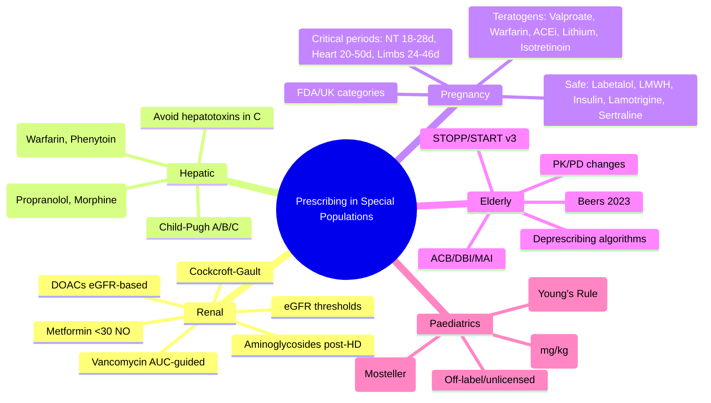

# Prescribing in Special Populations

> [!info]
> **Heading Hub** for Davidson Chapter 2: Clinical therapeutics and good prescribing.
> Davidson alignment: *Section on Prescribing in Special Populations* (SRJ Maxwell).

## 1. Scope
Pharmacokinetic and pharmacodynamic alterations in renal impairment, hepatic impairment, elderly, pregnancy/lactation, and paediatrics; dose adjustment principles and contraindicated drugs.

## 2. Sub-Topics (Topic-Groups)

### [[Special Populations/Renal impairment|Renal Impairment]]
- [[Special Populations/eGFR and Cockcroft-Gault|eGFR & Cockcroft-Gault Estimation]]
- [[Special Populations/Renal drug dosing principles|Renal Drug Dosing Principles]]
- [[Special Populations/Renal dosing common drugs|Common Drug Dose Adjustments in CKD]]
- [[Special Populations/Dialysis dosing|Drug Dosing in Dialysis]] (HD, PD, CRRT)
- [[Special Populations/Renal contraindicated|Drugs Contraindicated in Renal Impairment]]

### [[Special Populations/Hepatic impairment|Hepatic Impairment]]
- [[Special Populations/Child-Pugh classification|Child-Pugh Classification for Dosing]]
- [[Special Populations/Hepatic drug metabolism|Hepatic Drug Metabolism Principles]]
- [[Special Populations/Hepatic dosing common drugs|Common Drug Dose Adjustments in Liver Disease]]
- [[Special Populations/Hepatic contraindicated|Drugs Contraindicated in Hepatic Impairment]]

### [[Special Populations/Elderly|Elderly Prescribing]]
- [[Special Populations/Age-related PK PD changes|Age-Related PK/PD Changes]]
- [[Special Populations/Frailty|Frailty & Prescribing Decisions]]
- [[Special Populations/High-risk drugs elderly|High-Risk Drugs in Elderly]] (Beers, STOPP)
- [[Special Populations/Deintensification|Deintensification & Deprescribing in Elderly]]

### [[Special Populations/Pregnancy and lactation|Pregnancy & Lactation]]
- [[Special Populations/Pregnancy categories|Pregnancy Categories]] (FDA A/B/C/D/X, UK/EU alternatives)
- [[Special Populations/Teratogenicity|Teratogenicity Principles & Critical Periods]]
- [[Special Populations/Safe drugs pregnancy|Safe Drugs in Pregnancy]]
- [[Special Populations/Contraindicated pregnancy|Drugs Contraindicated in Pregnancy]]
- [[Special Populations/Lactation safety|Drugs in Breastfeeding]] (LactMed, Hale's)

### [[Special Populations/Paediatrics|Paediatric Prescribing]]
- [[Special Populations/Paediatric dosing|Paediatric Dosing Principles]] (Weight, BSA, Age)
- [[Special Populations/Off-label paeds|Off-Label & Unlicensed Prescribing in Children]]
- [[Special Populations/Neonatal dosing|Neonatal & Infant Dosing Considerations]]

---

## 3. FCPS/MRCP High-Yield Summary

### Renal Dosing Quick Reference (eGFR-based)

| eGFR (mL/min) | Dosing Adjustment Principle |
|---------------|------------------------------|
| **≥60** | Normal dose |
| **30-59** | Reduce dose OR extend interval (check specific drug) |
| **15-29** | Significant dose reduction; extend interval; avoid nephrotoxins |
| **<15 (Dialysis)** | Post-HD dosing for renally cleared drugs; avoid drugs dialysed out |

**Cockcroft-Gault (CrCl) for Drug Dosing:**
> **CrCl (mL/min) = (140 - Age) × Weight (kg) × (0.85 if female) / (72 × SCr mg/dL)**
> *Use actual body weight unless obese (then adjusted body weight)*

### Common Drug Renal Adjustments (CKD Stages G3-G5)

| Drug | eGFR 30-59 | eGFR 15-29 | eGFR <15 / Dialysis |
|------|------------|------------|---------------------|
| **Metformin** | Max 1g BD (caution) | **Contraindicated** (lactic acidosis) | Contraindicated |
| **ACEi/ARB** | Standard dose; monitor K, Cr | Reduce dose; monitor closely | Start low; monitor; hold if K>5.5 |
| **DOACs** | **Rivaroxaban 15mg OD (AF)** / 10mg OD (VTE) | **Apixaban 2.5mg BD** / **Dabigatran 110mg BD** / **Avoid Rivaroxaban** | **Avoid DOACs**; Use Warfarin |
| **Aminoglycosides** | Extended interval; monitor levels | Extended interval; monitor levels | Post-HD dosing |
| **Vancomycin** | Standard dose; AUC-guided | Standard dose; AUC-guided | Post-HD dosing (15-20mg/kg) |
| **Gabapentin/Pregabalin** | Reduce dose | Significant reduction | Dose post-HD |
| **Allopurinol** | Reduce dose (100mg/day max if <30) | 100mg/day max | 100mg post-HD |
| **Colchicine** | Reduce dose (0.5mg OD) | 0.5mg alternate days | Avoid / 0.5mg post-HD |

### Hepatic Impairment (Child-Pugh)

| Class | Score | Dosing Approach |
|-------|-------|-----------------|
| **A (Mild)** | 5-6 | Minor reduction for high-extraction drugs; standard for most |
| **B (Moderate)** | 7-9 | Reduce dose 50% for high-extraction; 25% for low-extraction; avoid hepatotoxins |
| **C (Severe)** | 10-15 | Avoid most hepatically cleared drugs; use alternatives |

**High-Extraction Drugs (Flow-limited):** Propranolol, Lidocaine, Morphine, Verapamil, Nitrates
**Low-Extraction Drugs (Capacity-limited):** Warfarin, Phenytoin, Diazepam, Theophylline

### Pregnancy Categories (FDA → Phased Out; Use Narrative Labelling)

| Old Category | Meaning | Examples |
|--------------|---------|----------|
| **A** | Controlled studies show no risk | Levothyroxine, Folic acid, Pyridoxine |
| **B** | Animal studies no risk; no human studies OR animal risk but human studies no risk | Penicillins, Cephalosporins, Metformin, Insulin, Paracetamol |
| **C** | Animal risk; no human studies OR no animal/human data | Most antidepressants (SSRIs), Antihypertensives (except ACEi/ARB), Corticosteroids |
| **D** | Positive human risk; benefits may outweigh | **Lithium**, **Valproate**, **Carbamazepine**, Phenytoin, **Warfarin**, **ACEi/ARB**, **DOACs**, **Statins** |
| **X** | Contraindicated; risk > benefit | **Isotretinoin**, **Thalidomide**, **Methotrexate**, **Ribavirin**, **Mycophenolate**, **Misoprostol** |

**UK/EU System:** No letter categories; use **Summary of Product Characteristics (SmPC) Section 4.6** — "Contraindicated", "Not recommended", "Use only if clearly needed", "May be used"

### Teratogenic Critical Periods
| Organ System | Critical Period (Post-conception) |
|--------------|-----------------------------------|
| **Neural tube** | Days 18-28 (Week 3-4) |
| **Heart** | Days 20-50 (Week 3-7) |
| **Limbs** | Days 24-46 (Week 4-7) |
| **Eyes** | Days 21-42 (Week 3-6) |
| **Palate** | Days 42-56 (Week 6-8) |
| **External genitalia** | Weeks 7-12 |
| **Brain (functional)** | Throughout pregnancy (especially 2nd/3rd trimester) |

### Key Teratogens (Avoid in Pregnancy)
- **Valproate** — Neural tube defects (1-2%), developmental delay, autism (↑ risk vs other AEDs)
- **Carbamazepine** — Neural tube defects, craniofacial abnormalities
- **Lithium** — Ebstein's anomaly (cardiac), 1st trimester
- **Warfarin** — Warfarin embryopathy (chondrodysplasia punctata, nasal hypoplasia) 1st trimester; CNS bleeding 2nd/3rd
- **ACEi/ARB** — Fetal renal dysplasia, oligohydramnios, pulmonary hypoplasia, skull ossification defects (2nd/3rd trimester)
- **Isotretinoin** — Severe CNS, cardiac, thymic, craniofacial defects
- **Methotrexate** — Fetal death, craniofacial, limb defects
- **Statins** — Animal teratogenicity; theoretical risk to cholesterol synthesis

### Safe in Pregnancy (Common)
| Indication | Preferred Drug(s) |
|------------|-------------------|
| **Hypertension** | Labetalol, Methyldopa, Nifedipine (MR) |
| **Anticoagulation** | **LMWH (Enoxaparin)** — All trimesters; Warfarin 2nd/3rd only if mechanical valve |
| **Diabetes** | **Insulin**; Metformin (2nd line, growing evidence) |
| **Epilepsy** | **Lamotrigine**, **Levetiracetam** (Lowest teratogenicity); Folic acid 5mg daily |
| **Depression** | **Sertraline**, **Fluoxetine**, **Citalopram** (SSRIs preferred) |
| **Asthma** | Continue all inhalers (ICS, LABA, SABA); Montelukast |
| **Pain** | Paracetamol (1st line); Avoid NSAIDs 3rd trimester |
| **Nausea** | Doxylamine + Pyridoxine (1st line); Metoclopramide, Ondansetron (2nd line) |

### Paediatric Dosing
| Method | Formula | Use Case |
|--------|---------|----------|
| **Weight-based** | Dose (mg/kg) × Weight (kg) | Most drugs |
| **BSA-based** | Dose (mg/m²) × BSA (m²) | Chemotherapy, some antibiotics |
| **Age-based** | (Age + 4) / 24 × Adult dose (Young's Rule) | Approximation only |
| **BSA (Mosteller)** | √[Height(cm) × Weight(kg) / 3600] | Most accurate for chemo |

---

## 4. Navigation
- **Parent Chapter**: [[Davidson Chapter 2 - Clinical Therapeutics Hierarchy|Chapter 2 Hierarchy]]
- **Chapter MOC**: [[Clinical Therapeutics and Good Prescribing MOC]]
- **Template**: [[../Templates/Clinical Therapeutics and Good Prescribing Topic Template|Topic Template]]

## 5. Tags
#medicine #clinical-therapeutics #davidson #hub #special-populations #renal-dosing #hepatic-dosing #pregnancy-prescribing #paediatric-dosing #fcps #mrcp

---

## 6. 📌 Summary

Prescribing in special populations is a **core FCPS/MRCP prescribing topic**. Master **renal dosing** (eGFR/Cockcroft-Gault), **hepatic dosing** (Child-Pugh, high vs low extraction), **pregnancy/lactation safety** (teratogenicity, FDA/UK categories), **paediatric dosing** (weight/BSA/age), and **elderly prescribing** (frailty, Beers/STOPP, deprescribing). Accurate dose adjustment prevents toxicity and therapeutic failure in vulnerable patients.

---

## 7. ❓ MCQs (10)

1. **Renal dosing — metformin contraindication threshold?**
   A. eGFR <60
   B. eGFR <45
   C. **eGFR <30 (contraindicated); eGFR 30-45: max 1g BD**
   D. eGFR <15 only

2. **DOAC dosing in CKD — rivaroxaban for AF at eGFR 30-49?**
   A. 20mg OD
   B. **15mg OD**
   C. 10mg OD
   D. Contraindicated

3. **Child-Pugh Class C — dosing principle?**
   A. Standard doses for all drugs
   B. **Avoid most hepatically cleared drugs; avoid hepatotoxins; use alternatives**
   C. Reduce all drugs by 25%
   D. No dose adjustment needed

4. **High-extraction drugs (flow-limited) — which is correct?**
   A. Warfarin, Phenytoin
   B. **Propranolol, Lidocaine, Morphine, Verapamil, Nitrates**
   C. Phenytoin, Theophylline, Diazepam
   D. Digoxin, Atenolol, Gabapentin

5. **Pregnancy — ACE inhibitor risk in 2nd/3rd trimester?**
   A. Cardiac malformations
   B. **Fetal renal dysplasia, oligohydramnios, pulmonary hypoplasia, skull defects**
   C. Neural tube defects
   C. Limb reduction defects

6. **Teratogen — valproate associated with:**
   A. Cardiac defects only
   B. **Neural tube defects (1-2%), developmental delay, autism**
   C. Cardiac defects + cleft palate only
   D. Limb reduction defects only

7. **ACE inhibitor in pregnancy — when absolutely contraindicated?**
   A. 1st trimester only
   B. **2nd and 3rd trimester (fetal renal dysplasia, oligohydramnios, pulmonary hypoplasia)**
   C. All trimesters equally
   D. Only if woman has hypertension

8. **Paediatric dosing — most accurate method for chemotherapy?**
   A. Weight-based (mg/kg)
   B. **BSA-based (mg/m²) with Mosteller formula**
   C. Age-based (Young's Rule)
   D. Flat adult dose

8. **Elderly — STOPP criterion for statin in primary prevention?**
   A. >65 years
   B. **>85 years**
   C. >75 years
   D. >70 years

9. **Paediatric dosing — Young's Rule formula?**
   A. (Age × Weight) / Adult Dose
   B. **(Age + 4) / 24 × Adult Dose**
   C. Weight (kg) × 2 / Adult Dose
   D. BSA (m²) × Adult Dose

9. **Drug dosing in haemodialysis — when to give renally cleared drug?**
   A. Pre-dialysis
   B. **Post-dialysis**
   C. Mid-dialysis
   D. Any time

---

## 8. 📋 SBAs (5)

1. **85F, eGFR 28, T2DM on metformin 1g BD. Management?**
   A. Continue 1g BD
   B. **Reduce to 500mg BD (max 1g/day if eGFR 30-45); contraindicated if <30**
   C. Switch to gliclazide
   C. Stop metformin
   *Answer: B*

2. **32F, 12 weeks pregnant, epilepsy on valproate 1g BD. Folic acid 5mg prescribed. Best AED switch?**
   A. Carbamazepine
   B. **Lamotrigine or Levetiracetam (lowest teratogenicity); Folic acid 5mg daily**
   C. Phenytoin
   D. Topiramate
   *Answer: B*

3. **70M, Child-Pugh B cirrhosis, needs analgesia for fracture. Safe opioid?**
   A. Morphine (standard dose)
   B. **Fentanyl/Alfentanil (low hepatic extraction, safe in liver disease); avoid morphine/codeine**
   C. Codeine 60mg
   C. Tramadol 100mg
   *Answer: B*

4. **5-year-old, 18kg, needs amoxicillin for pneumonia. Dose?**
   A. 125mg TDS
   B. **25mg/kg/dose = 450mg TDS (50mg/kg/day in divided doses)**
   C. 500mg TDS
   D. 250mg BD
   *Answer: B*

4. **85F, frail, on 12 medications including lorazepam, digoxin, furosemide. STOPP criterion?**
   A. Statin primary prevention >85y
   B. **Benzodiazepine >4w (falls, cognitive impairment) — STOPP B2**
   C. PPI >8w
   D. Warfarin >1y VTE
   *Answer: B*

---

## 9. 🔑 Answer Keys
| MCQs | SBAs |
|------|------|
| 1-C, 2-B, 3-B, 4-B, 5-B, 6-B, 7-B, 8-B, 9-B, 10-B | 1-B, 2-B, 3-B, 4-B, 5-B |

---

## 10. 🎤 Viva Questions (Expected Answers)

| # | Question | Expected Answer |
|---|----------|-----------------|
| 1 | Metformin in renal impairment — dosing thresholds? | **eGFR ≥45: full dose; 30-44: max 1g BD (500mg BD); 15-29: contraindicated (lactic acidosis risk); <15/dialysis: contraindicated.** |
| 2 | Child-Pugh classification — classes and dosing? | **A (5-6): mild, minor reduction for high-extraction. B (7-9): moderate, reduce high-extraction 50%, low-extraction 25%, avoid hepatotoxins. C (10-15): severe, avoid most hepatically cleared drugs.** |
| 3 | High vs low extraction drugs — examples and hepatic dosing impact? | **High-extraction (flow-limited): Propranolol, Lidocaine, Morphine, Verapamil, Nitrates — dose depends on hepatic blood flow; reduce in liver disease. Low-extraction (capacity-limited): Warfarin, Phenytoin, Diazepam, Theophylline — dose depends on intrinsic clearance/enzyme activity.** |
| 4 | Teratogenic critical periods — neural tube, heart, limbs? | **Neural tube: Days 18-28 (Week 3-4). Heart: Days 20-50 (Week 3-7). Limbs: Days 24-46 (Week 4-7).** |
| 5. Key teratogens — valproate, warfarin, ACEi, lithium? | **Valproate: NTD 1-2%, developmental delay, autism. Warfarin: Embryopathy (chondrodysplasia, nasal hypoplasia) 1st tri; CNS bleed 2nd/3rd. ACEi: Fetal renal dysplasia, oligohydramnios, pulmonary hypoplasia (2nd/3rd tri). Lithium: Ebstein's anomaly (cardiac) 1st tri. ACEi/ARB Contraindicated 2nd/3rd tri.** |
| 6. Warfarin in pregnancy — when can it be used? | **Mechanical heart valve only (with specialist oversight); otherwise contraindicated (teratogenic 1st tri, CNS bleeding 2nd/3rd). LMWH preferred for VTE/AF in pregnancy.** |
| 7. Paediatric dosing — methods and when to use each? | **Weight-based (mg/kg) = most drugs; BSA-based (mg/m²) = chemotherapy, some antibiotics (Mosteller formula); Age-based (Young's Rule) = approximation only.** |
| 7 | STOPP/START in elderly — key criteria? | **STOPP: Benzos >4w, PPI >8w, NSAID in HF/CKD/ulcer, Warfarin >1y for VTE, Aspirin 1° prev >70, Statin 1° prev >85, Anticholinergic burden. START: Vit D+Ca in OP, ACEi/ARB in HFrEF, BB in HFrEF, Statin in CVD, Anticoag in AF, Bisphosphonate in OP.** |
| 8 | DOAC in CKD — rivaroxaban for AF dosing by eGFR? | **≥50: 20mg OD; 15-49: 15mg OD; <15: Avoid (use warfarin/LMWH). CrCl 15-49: 15mg OD.** |
| 9 | Pregnancy — ACE inhibitor risk in 2nd/3rd trimester? | **Fetal renal dysplasia, oligohydramnios, pulmonary hypoplasia, skull defects. Contraindicated 2nd/3rd trimester.** |
| 10. Paediatric dosing — Mosteller formula? | **BSA (m²) = √[Height(cm) × Weight(kg) / 3600]. Most accurate for chemo dosing.** |

---

## 11. 🧩 Confusions & Mnemonics

| Confusion | Clarification |
|-----------|---------------|
| **eGFR = CrCl for dosing** | **NO.** eGFR (MDRD/CKD-EPI) ≠ CrCl (Cockcroft-Gault). Use **CrCl (Cockcroft-Gault)** for drug dosing — it estimates creatinine clearance better for dosing. |
| **All drugs need renal dose adjustment** | **NO.** Only renally cleared drugs (eGFR <60). Check each drug individually. |
| **Child-Pugh C = no drugs** | **NO.** Some drugs still usable with careful titration and monitoring; many require avoidance. |
| **All statins safe in liver disease** | **NO.** Statins metabolised by CYP3A4 (simvastatin, atorvastatin, lovastatin) need caution in liver disease. Pravastatin, rosuvastatin, fluvastatin, pitavastatin preferred. |
| **All antibiotics safe in pregnancy** | **NO.** Tetracyclines, Aminoglycosides, Fluoroquinolones, Sulfonamides, Metronidazole (1st tri) = contraindicated/risk. Penicillins, Cephalosporins, Macrolides, Clindamycin = generally safe. |
| **All antiepileptics teratogenic** | **NO.** Lamotrigine, Levetiracetam = lowest risk. Valproate highest risk. Carbamazepine/Phentoin intermediate. |
| **All DOACs contraindicated in CKD** | **NO.** Apixaban 2.5mg BD (eGFR 15-29), Dabigatran 110mg BD (CrCl 30-49), Rivaroxaban 15mg OD (CrCl 15-49). Warfarin for eGFR <15/dialysis. |
| **Elderly = just reduce all doses** | **NO.** Individualised deprescribing (STOPP/START). Some drugs need full dose (e.g., antibiotic for severe infection). |
| **Paediatric dosing = always weight-based** | **NO.** BSA-based for chemo (Mosteller); Age-based approximation only when weight unavailable. |
| **Protein binding displacement = major interaction in elderly** | **Rarely.** Only for high-extraction, narrow TI drugs (warfarin, phenytoin, valproate). |

> **Mnemonic: SPECIAL POPULATIONS**
> **S**pecial Populations: **R**enal, **H**epatic, **P**regnancy, **E**lderly, **P**aediatrics
> **R**enal: **C**ockcroft-**G**ault for dosing; **M**etformin <30 = NO; **D**OACs adjust by eGFR; **A**minoglycosides post-HD
> **H**epatic: **C**hild-Pugh **A/B/C**; **H**igh-extraction (Propranolol, Morphine) vs **L**ow (Warfarin, Phenytoin)
> **P**regnancy: **T**eratogenic **C**ritical periods (NT 18-28d, Heart 20-50d, Limbs 24-46d); **V**alproate (NTD, Autism), **L**ithium (Ebstein), **W**arfarin (Embryopathy), **A**CEi (Renal dysplasia)
> **E**lderly: **S**TOPP/**S**TART; **B**eers; **A**CB; **D**B**I**; **D**epresc ribing (PPI, Benzo, Anticholinergic, Statin, HTN)
> **P**aediatrics: **W**eight-based (mg/kg) most; **B**SA (Mosteller) for chemo; **Y**oung's Rule (Age+4)/24 × Adult
> **B**reastfeeding: **L**actMed; **H**ale's; **S**afe = Short-acting, low milk transfer, poor oral bioavailability

> **Mnemonic: RENAL DOSING — "MADD-AB-VAC"**
> **M**etformin <30 NO, 30-45 max 1g BD
> **A**CEi/ARB: monitor K, Cr; reduce if <30
> **D**OACs: Riva 15mg (30-49), Apx 2.5mg BD (15-29), Dab 110mg BD (30-49); <15 Warfarin
> **D**ABIGATRAN: 110mg BD (CrCl 30-49), 75mg BD (15-29), avoid <15
> **A**minoglycosides: Extended interval; post-HD dosing
> **B**enzenes (Vancomycin): Standard dose, AUC-guided; post-HD 15-20mg/kg
> **V**anc_mycin: AUC-guided; post-HD 15-20mg/kg
> **A**llopurinol: 100mg max (<30), post-HD
> **C**holchicine: 0.5mg OD (30-59), alt days (15-29), avoid <15

> **Mnemonic: HEPATIC — "CHILD-PUGH"**
> **C**lass A (5-6): Mild reduction high-extraction
> **H**igh-extraction drugs: Propranolol, Lidocaine, Morphine, Verapamil, Nitrates
> **I**ntermediate (B: 7-9): 50% high, 25% low extraction reduction
> **L**ow-extraction: Warfarin, Phenytoin, Diazepam, Theophylline
+ **D**ose reduction severe (C: 10-15): Avoid most hepatically cleared
> **P**regnancy: ACEi/ARB Contraindicated 2nd/3rd tri
> **U**terine teratogens: Valproate, Warfarin, ACEi, Lithium, Isotretinoin, Methotrexate, Statins
> **G**enerally safe: Lamotrigine, Levetiracetam, Labetalol, Methyldopa, Nifedipine, LMWH, Insulin, Sertraline, Paracetamol

---

## 12. 🗺️ Mind Map

---

## 13. 📅 Spaced Repetition Tracker

| Review | Date | Score (0–5) | Notes |
|--------|------|-------------|-------|
| Day 1 | | | |
| Day 3 | | | |
| Day 7 | | | |
| Day 14 | | | |
| Day 30 | | | |
| Day 90 | | | |

---

## 14. 📝 Self-Test Scorecard

| Section | Max | Score | % |
|---------|-----|-------|---|
| Renal Dosing | 4 | | |
| Hepatic Dosing | 3 | | |
| Pregnancy & Lactation | 4 | | |
| Elderly Prescribing | 3 | | |
| Paediatric Dosing | 3 | | |
| Teratogenicity | 3 | | |
| **Total** | **20** | | |

---

## 15. 💬 Exam Answer Modes

| Format | Prompt | Key Points |
|--------|--------|------------|
| **Long Essay** | "Describe the principles of prescribing in renal impairment, hepatic impairment, and pregnancy." | Renal: CrCl (C-G), eGFR thresholds, metformin/DOAC/aminoglycoside adjustments. Hepatic: Child-Pugh A/B/C, high vs low extraction drugs. Pregnancy: FDA/UK categories, teratogens (valproate, warfarin, ACEi, lithium), safe drugs, teratogenic critical periods. |
| **Short Note** | "Metformin in renal impairment — dosing and contraindication." | eGFR ≥45: full dose; 30-44: max 1g BD; 15-29: contraindicated; <15/dialysis: contraindicated. Lactic acidosis risk. |
| **Viva** | "32F, 12 weeks pregnant, epilepsy on valproate. Management?" | **Switch to lamotrigine/levetiracetam (lowest teratogenicity). Folic acid 5mg daily. Valproate: NTD 1-2%, developmental delay, autism.** |
| **Ward Round** | "85F, eGFR 28, on metformin 1g BD. Management?" | **Reduce to 500mg BD (max 1g/day if eGFR 30-45). Monitor lactate, renal function. If eGFR drops <30 → stop.** |
| **Last-Night** | "Renal: CG for dosing, Metformin <30 NO, 30-45 max 1g, DOACs eGFR adjust, Amino post-HD. Hepatic: Child-Pugh A/B/C, High-extraction (Propranolol, Morphine) vs Low (Warfarin, Phenytoin). Preg: Valproate/Lithium/Warfarin/ACEi teratogenic; Safe: Labetalol, LMWH, Insulin, Lamotrigine, Sertraline. Teratogenic periods: NT 18-28d, Heart 20-50d, Limbs 24-46d. Elderly: STOPP/START, Beers, ACB≥3=High risk. Paeds: Weight mg/kg, BSA Mosteller chemo. Elderly: STOPP/START, Deprescribing." | Compressed. |

---

## 16. 📌 Summary

- **Renal Dosing:** **Cockcroft-Gault (CrCl)** for dosing; eGFR thresholds: Metformin <30 contraindicated, 30-44 max 1g BD; DOACs adjust by eGFR; Aminoglycosides post-HD; Vancomycin AUC-guided.
- **Hepatic Dosing:** **Child-Pugh A/B/C**; High-extraction (Propranolol, Lidocaine, Morphine, Verapamil, Nitrates) — reduce in liver disease; Low-extraction (Warfarin, Phenytoin, Diazepam, Theophylline) — adjust for enzyme capacity.
- **Pregnancy:** **Teratogens:** Valproate (NTD, autism), Warfarin (embryopathy), ACEi/ARB (renal dysplasia), Lithium (Ebstein), Isotretinoin, Methotrexate, Statins. **Safe:** Labetalol, Methyldopa, Nifedipine, LMWH, Insulin, Lamotrigine, Levetiracetam, Sertraline, Paracetamol. **Critical periods:** Neural tube 18-28d, Heart 20-50d, Limbs 24-46d, Palate 42-56d.
- **Elderly:** **STOPP/START v3**, Beers 2023, ACB/DBI/MAI, Deprescribing (PPI, Benzo, Anticholinergic, Statin, HTN).
- **Paediatrics:** **Weight-based (mg/kg) most; BSA (Mosteller) for chemo; Young's Rule (Age+4)/24 × Adult dose**.
- **Contraindicated in Pregnancy (X):** Isotretinoin, Thalidomide, Methotrexate, Ribavirin, Mycophenolate.
- **Lactation:** Prefer short-acting, low milk transfer, poor oral bioavailability drugs; Consult LactMed/Hale's.
- **Renal Replacement:** HD — post-HD dosing for renally cleared drugs; PD — similar but less drug removal; CRRT — higher clearance, adjust accordingly.

---

## 17. ❓ MCQs (10)

1. **Metformin contraindicated at which eGFR?**
   A. <60
   B. <45
   C. **<30**
   D. <45

2. **Rivaroxaban for AF in eGFR 30-49?**
   A. 20mg OD
   B. **15mg OD**
   C. 10mg OD
   D. Contraindicated

3. **Child-Pugh B — dosing adjustment for high-extraction drugs?**
   A. No change
   B. **Reduce 50%**
   C. Reduce 25%
   D. Avoid

4. **ACE inhibitor teratogenicity — mechanism in 2nd/3rd trimester?**
   A. Cardiac malformations
   B. **Fetal renal dysplasia, oligohydramnios, pulmonary hypoplasia**
   C. Neural tube defects
   D. Limb defects

5. **Valproate teratogenicity — key features?**\n   A. Cardiac defects only\n   B. **Neural tube defects (1-2%), developmental delay, autism**\n   C. Cardiac + cleft palate\n   D. Limb defects only

6. **STOPP criterion for statin primary prevention?**\n   A. >75 years\n   B. **>85 years**\n   C. >75 years\n   D. >70 years

7. **Paediatric chemo dosing — most accurate method?**\n   A. Weight-based\n   B. **BSA (Mosteller)**\n   C. Age-based\n   D. Flat adult dose

8. **Lithium in pregnancy — specific cardiac defect?**\n   A. VSD\n   B. **Ebstein's anomaly**\n   C. TOF\n   D. Coarctation

9. **ACEi in pregnancy — when contraindicated?**\n   A. 1st trimester only\n   B. **2nd and 3rd trimester**\n   C. All trimesters\n   D. Safe throughout

10. **Paediatric dosing — Young's Rule?**\n    A. (Age × Weight) / Adult Dose\n    B. **(Age + 4) / 24 × Adult Dose**\n    C. Weight / Adult Dose\n    D. BSA × Adult Dose

---

## 18. 📋 SBAs (5)

1. **85F, eGFR 28, T2DM on metformin 1g BD. Management?**
   A. Continue 1g BD
   B. **Reduce to 500mg BD (max 1g/day if eGFR 30-45); contraindicated if <30**
   C. Switch to gliclazide
   D. Stop metformin
   *Answer: B*

2. **32F, 12 weeks pregnant, epilepsy on valproate 1g BD. Folic acid 5mg prescribed. Best AED switch?**
   A. Carbamazepine
   B. **Lamotrigine or Levetiracetam (lowest teratogenicity); Folic acid 5mg daily**
   C. Phenytoin
   D. Topiramate
   *Answer: B*

3. **70M, Child-Pugh B cirrhosis, fractured hip. Safe opioid?**
   A. Morphine (standard dose)
   B. **Fentanyl/Alfentanil (low hepatic extraction, safe in liver disease); avoid morphine/codeine**
   C. Codeine 60mg
   D. Tramadol 100mg
   *Answer: B*

4. **5-year-old, 18kg, amoxicillin for pneumonia. Dose?**
   A. 125mg TDS
   B. **25mg/kg/dose = 450mg TDS (50mg/kg/day)**
   C. 500mg TDS
   D. 250mg BD
   *Answer: B*

4. **85F, frail, 12 medications including lorazepam, digoxin, furosemide. STOPP?**
   A. Statin primary prevention >85y
   B. **Benzodiazepine >4w (falls, cognitive impairment) — STOPP B2**
   C. PPI >8w
   D. Warfarin >1y VTE
   *Answer: B*

---

## 19. 🔑 Answer Keys
| MCQs | SBAs |
|------|------|
| 1-C, 2-B, 3-B, 4-B, 5-B, 6-B, 7-B, 8-B, 9-B, 10-B | 1-B, 2-B, 3-B, 4-B, 5-B |

---

## 20. 🔗 Cross-Links
- [[Principles of Rational Prescribing]] — WHO 6-step, monitoring
- [[ADRs]] — Special population ADRs
- [[Drug Interactions]] — PK/PD changes in special populations
- [[Polypharmacy and Deprescribing]] — Elderly deprescribing
- [[Therapeutic Drug Monitoring]] — TDM in special populations
- [[CYP450 Drug Interactions]] — PK changes in organ impairment
- [[Drug Development and Regulation]] — Pregnancy categories, paediatric licensing
- [[Clinical Contexts/Antimicrobial Stewardship]] — Renal/hepatic antibiotic dosing
- [[Population & Newborn Screening]] — Neonatal screening, antenatal prescribing
- [[9. ELSI]] — Pregnancy prescribing ethics, paediatric off-label ethics

---

**Last Updated:** 2026-06-15  
**Prescribing in Special Populations Hub: COMPLETE with Full Exam Suite (Viva Qs, MCQs, SBAs, Answer Keys, Confusions, Mind Map, Spaced Repetition, Self-Test, Exam Modes)**
