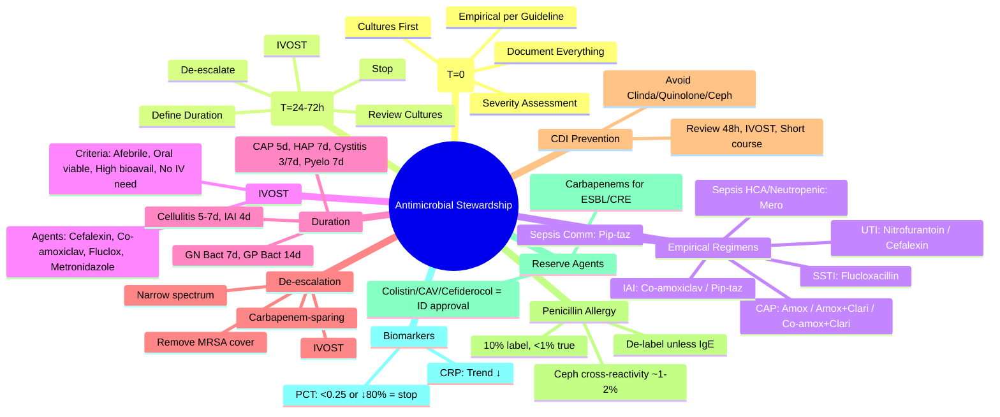

# Clinical Context: Antimicrobial Stewardship (AMS)

**Parent Topic:** [Clinical Therapeutics Overview](../../Clinical%20Therapeutics%20and%20Good%20Prescribing%20MOC.md)
**Status:** `full-fcps-mrcp-note`
**Priority:** ⭐⭐⭐ HIGHEST (FCPS/MRCP — Start Smart Then Focus, empirical vs targeted, IVOST, duration, de-escalation, C. difficile prevention)
**Source:** Davidson 24th Ed Ch 2; NICE NG15/NG190; UK 5-Year AMR Strategy; PHE/UKHSA; ESCMID; IDSA; BSAC; Antimicrobial Stewardship literature

---

## 1. 🎯 Learning Objectives
- [ ] Apply **Start Smart Then Focus** framework (empirical → review → targeted)
- [ ] Select **empirical antibiotics** by syndrome (sepsis, pneumonia, UTI, SSTI, IAIs)
- [ ] Implement **IV to Oral Switch (IVOST)** criteria
- [ ] Define **duration** of therapy for common infections
- [ ] Perform **de-escalation** based on culture/sensitivity
- [ ] Prevent **C. difficile infection** (antibiotic stewardship)
- [ ] Understand **carbapenem-sparing** and **last-resort** agent preservation
- [ ] Apply **penicillin allergy delabeling** principles
- [ ] Answer viva: "Start Smart Then Focus" and "IVOST criteria"

---

## 2. 🧠 Core Concept: Start Smart Then Focus (UK AMS Framework)

```mermaid
flowchart TD
    A[Patient with Suspected Infection] --> B[Start Smart<br/><b>T = 0</b>]
    B --> C1[Take Cultures<br/>Blood x2, Urine, Sputum,<br/>Wound, CSF, Other]
    B --> C2[Assess Severity<br/>Sepsis 6, NEWS2, qSOFA]
    B --> C3[Choose Empirical Abx<br/>Local formulary + guidelines<br/>Allergy history<br/>Severity-adjusted]
    B --> C4[Document Indication<br/>Dose, Route, Duration,<br/>Review Date]
    C1 & C2 & C3 & C4 --> D[Focus<br/><b>T = 24-72h</b>]
    D --> E{Review: Culture Results<br/>Clinical Response<br/>Biomarkers (CRP, PCT)}
    E -->|Pathogen ID + Sens| F[De-escalate<br/>Narrowest Spectrum<br/>Targeted Therapy]
    E -->|No Growth / Improving| G[Stop or Switch to Oral<br/>(IVOST) / Short Course]
    E -->|Deteriorating / Resistant| H[Escalate / Broaden<br/>Specialist ID/Micro Advice]
    F & G & H --> I[Define Duration<br/>Stop Date Documented]
    I --> J[Discharge / OPAT<br/>Clear Communication]
```

> **Key Principle:** *Empirical therapy = **best guess** based on likely pathogens, local epidemiology, severity. **Targeted therapy** = **narrowest effective spectrum** once pathogen known. **Review at 24–72h** is mandatory.*

---

## 3. ️⃣ Empirical Antibiotic Selection — Common Syndromes (UK Guidelines)

### Sepsis (Unknown Source) — NICE NG51 / Surviving Sepsis
| Population | Empirical Regimen | Alternatives |
|------------|-------------------|--------------|
| **Community-acquired** | **Piperacillin-tazobactam 4.5g IV Q6H** | Meropenem 1g IV Q8H (if allergy/severe) |
| **Healthcare-associated** | **Meropenem 1g IV Q8H** (+/- vancomycin if MRSA risk) | Piperacillin-tazobactam + vancomycin |
| **Neutropenic Sepsis** | **Piperacillin-tazobactam 4.5g IV Q6H** (+/- gentamicin) | Meropenem (if unstable/penicillin allergy) |

### Community-Acquired Pneumonia (CAP) — NICE NG138 / BTS
| Severity (CURB-65) | Empirical Regimen |
|--------------------|-------------------|
| **Low (0–1)** | **Amoxicillin 500mg TDS PO** (5 days) |
| **Moderate (2)** | **Amoxicillin 1g TDS IV + Clarithromycin 500mg BD PO/IV** (5 days) |
| **High (3–5)** | **Co-amoxiclav 1.2g IV TDS + Clarithromycin 500mg BD IV** OR **Ceftriaxone 2g IV OD + Clarithromycin** |

### Hospital-Acquired Pneumonia (HAP) / VAP
| Risk | Empirical Regimen |
|------|-------------------|
| **Early (<5 days), no MDR risk** | Piperacillin-tazobactam 4.5g IV Q6H |
| **Late (>5 days) / MDR risk** | Meropenem 1g IV Q8H (+/- vancomycin/linezolid for MRSA) |

### Urinary Tract Infection
| Syndrome | Empirical Regimen |
|----------|-------------------|
| **Lower UTI (Cystitis)** | **Nitrofurantoin 100mg BD PO** (3d women, 7d men) OR **Trimethoprim 200mg BD PO** (if susceptible) |
| **Upper UTI (Pyelonephritis)** | **Cefalexin 500mg QDS PO** OR **Co-amoxiclav 625mg TDS PO** (7–10d) |
| **Complicated / Catheter-associated** | **Gentamicin 5–7mg/kg IV OD** (if susceptible) OR **Piperacillin-tazobactam** |

### Skin & Soft Tissue Infection (SSTI)
| Type | Empirical Regimen |
|------|-------------------|
| **Cellulitis (non-purulent)** | **Flucloxacillin 1g QDS IV/PO** (5–7d) + **Penicillin V 500mg QDS** (if strep suspected) |
| **Purulent / Abscess** | **Flucloxacillin 1g QDS IV/PO** + **Incision & drainage** |
| **Necrotising Fasciitis** | **Urgent surgery** + **Piperacillin-tazobactam 4.5g Q6H + Clindamycin 600mg Q6H IV** |

### Intra-Abdominal Infection (IAI)
| Type | Empirical Regimen |
|------|-------------------|
| **Community-acquired (appendicitis, cholecystitis)** | **Co-amoxiclav 1.2g IV TDS** OR **Ceftriaxone 2g OD + Metronidazole 500mg TDS** |
| **Healthcare-associated / Post-op** | **Piperacillin-tazobactam 4.5g IV Q6H** OR **Meropenem 1g IV Q8H** |

### Meningitis (Adult) — NICE CG102
| Age / Risk | Empirical Regimen |
|------------|-------------------|
| **18–50y** | **Ceftriaxone 2g IV Q12H** (+/- **Dexamethasone 10mg IV Q6H × 4d**) |
| **>50y / Immunocompromised** | **Ceftriaxone 2g IV Q12H + Amoxicillin 2g IV Q4H** (Listeria cover) + Dexamethasone |
| **Penicillin allergy** | **Chloramphenicol 50mg/kg IV Q6H** (or Meropenem 2g IV Q8H) |

---

## 4. ️⃣ IV to Oral Switch (IVOST) — Criteria

### Mandatory Criteria (ALL must be met)
| Criterion | Detail |
|-----------|--------|
| **Clinical improvement** | Afebrile >24h (or trend ↓), improving sepsis markers (NEWS2, CRP ↓) |
| **Oral route viable** | Able to swallow/absorb, no vomiting, no ileus, no malabsorption |
| **Oral antibiotic available** | Bioavailability >80%, same spectrum as IV |
| **No ongoing need for IV** | No other IV drugs, no PICC/central line solely for antibiotics |

### High Bioavailability Oral Agents (IVOST Candidates)
| IV Antibiotic | Oral Switch | Bioavailability |
|---------------|-------------|-----------------|
| **Ceftriaxone** | **Cefalexin** (or Co-amoxiclav) | ~90% |
| **Piperacillin-tazobactam** | **Co-amoxiclav** | ~90% |
| **Meropenem** | **None reliable** (consider ertapenem OPAT) | — |
| **Flucloxacillin** | **Flucloxacillin** | ~50% (high dose) |
| **Metronidazole** | **Metronidazole** | 100% |
| **Ciprofloxacin** | **Ciprofloxacin** | ~70–80% |
| **Clindamycin** | **Clindamycin** | ~90% |
| **Linezolid** | **Linezolid** | 100% |
| **Doxycycline** | **Doxycycline** | ~90% |

> **Key:** *IVOST **reduces LOS, line complications, cost, C. difficile risk**. **Default to oral** unless criteria not met. **Review daily**.*

---

## 5. ️⃣ Duration of Therapy — Evidence-Based Short Courses

| Infection | Recommended Duration | Evidence |
|-----------|---------------------|----------|
| **CAP** | **5 days** (all severities) | Multiple RCTs (non-inferior) |
| **HAP/VAP** | **7 days** (non-fermenters may need longer) | IDSA/ATS |
| **UTI (Cystitis)** | **3 days (women), 7 days (men)** | Cochrane |
| **UTI (Pyelonephritis)** | **7 days** (10–14 if complicated) | RCT |
| **SSTI (Cellulitis)** | **5–7 days** | RCT |
| **IAI (Source control achieved)** | **4 days** (STOP-IT trial) | RCT |
| **Bacteremia (Gram-negative, source controlled)** | **7 days** | RCT (BALANCE) |
| **Bacteremia (Gram-positive, e.g., S. aureus)** | **14 days** (2w minimum) | Guidelines |
| **Infective Endocarditis** | **4–6 weeks** (per organism) | ESC |
| **Osteomyelitis** | **6 weeks** (2w IV + 4w PO if good response) | IDSA |
| **Septic Arthritis** | **2–4 weeks** (2w IV + 2w PO) | BSR |

> **Principle:** *Shortest effective duration. **Stop date documented at prescription**. Review at 48–72h.*

---

## 6. ️⃣ De-escalation — From Empirical to Targeted

### De-escalation Strategies
| Strategy | Example |
|----------|---------|
| **Spectrum narrowing** | Pip-taz → Co-amoxiclav (if MSSA/E. coli susceptible) |
| **Carbapenem-sparing** | Meropenem → Pip-taz/Co-amoxiclav (if ESBL-negative) |
| **MRSA coverage removal** | Vancomycin → Flucloxacillin (if MSSA) |
| **Double cover → Single** | Pip-taz + Gentamicin → Pip-taz alone (if susceptible) |
| **IV → Oral** | IVOST criteria met |
| **Stop** | No growth at 48–72h + clinical improvement |

### De-escalation Decision Tree
```mermaid
flowchart TD
    A[Culture Result at 24-72h] --> B{Organism Identified?}
    B -->|Yes| C[Check Susceptibilities]
    C --> D{Narrower Agent Available?}
    D -->|Yes| E[Switch to Narrowest Effective<br/>IVOST if criteria met<br/>Document new stop date]
    D -->|No| F[Continue Current / Optimise Dose]
    B -->|No (Sterile)| G[Clinical Response?]
    G -->|Improving| H[Stop Antibiotics<br/>(or IVOST if short course needed)]
    G -->|Not Improving| I[Reassess Source / Imaging<br/>Specialist Advice]
```

---

## 7. ️⃣ C. difficile Infection (CDI) Prevention — Antibiotic Stewardship

### High-Risk Antibiotics for CDI (Relative Risk)
| Highest Risk | Moderate Risk | Lower Risk |
|--------------|---------------|------------|
| **Clindamycin** (RR 16–20) | **Cephalosporins** (2nd/3rd gen) (RR 5–8) | **Penicillins** (RR 2–3) |
| **Fluoroquinolones** (RR 5–10) | **Co-amoxiclav** (RR 3–5) | **Tetracyclines** (RR 1–2) |
| **Carbapenems** (RR 5–10) | **Piperacillin-tazobactam** (RR 3–5) | **Trimethoprim** (RR 1–2) |

### CDI Prevention Bundle
| Intervention | Detail |
|--------------|--------|
| **Antibiotic restriction** | Avoid clindamycin, fluoroquinolones, cephalosporins unless essential |
| **Review at 48–72h** | Stop/de-escalate → ↓ exposure |
| **IVOST** | Oral = ↓ CDI risk vs IV |
| **Shortest duration** | Evidence-based courses |
| **PPI review** | PPIs ↑ CDI risk — stop if not indicated |
| **Isolation / Contact precautions** | Immediate on suspicion |
| **Environmental cleaning** | Chlorine-based (1000ppm) |

---

## 8. ️⃣ Penicillin Allergy De-labelling

### Problem
- **~10% labelled penicillin allergic** → true allergy **<1%** (most are intolerance/childhood rash)
- **Consequences**: Broader antibiotics (quinolones, clindamycin, vancomycin) → ↑ resistance, CDI, cost, worse outcomes

### De-labelling Algorithm
```mermaid
flowchart TD
    A[Patient Labelled Penicillin Allergic] --> B[Assess Reaction History]
    B --> C{Type of Reaction}
    C -->|Type I (IgE)<br/>Anaphylaxis, Urticaria,<br/>Angioedema, Bronchospasm<br/>&lt;1h| D[High Risk<br/>Avoid Penicillins<br/>Refer Allergy Clinic<br/>Skin Test / Challenge]
    C -->|Type IV (T-cell)<br/>Morbilliform rash,<br/>SJS/TEN, DRESS, AGEP<br/>>1h to days| E[Delay = Lower Risk<br/>If mild rash >10y ago<br/>→ Direct Oral Challenge<br/>(Supervised)]
    C -->|Non-immune<br/>GI upset, Headache,<br/>Family history only| F[**NOT Allergy**<br/>Remove Label<br/>Use Penicillin Safely]
    C -->|Unknown / Vague| G[**Default: De-label**<br/>Unless clear IgE history<br/>Supervised Challenge if needed]
```

### Cross-Reactivity (True)
| Drug | Cross-Reactivity with Penicillin |
|------|----------------------------------|
| **Cephalosporins** | **~1–2%** (mostly 1st gen; side-chain specific; 3rd/4th gen very low) |
| **Carbapenems** | **<1%** (meropenem/ertapenem safe in most penicillin-allergic) |
| **Monobactams (Aztreonam)** | **Negligible** (safe) |

---

## 9. ️⃣ Carbapenem-Sparing & Last-Resort Agents

### Carbapenem-Sparing Strategies
| Strategy | Application |
|----------|-------------|
| **Piperacillin-tazobactam** | First-line for many HAI/IAI (if ESBL prevalence low) |
| **Cefepime** | Alternative for Pseudomonas (if pip-taz not suitable) |
| **Fosfomycin (IV)** | MDR UTI (ESBL, CRE) — oral/IV |
| **Temocillin** | ESBL UTI/IAI (stable, narrow Gram-negative) |
| **Aminoglycoside (short course)** | Synergy, step-down |
| **Colistin-sparing** | Ceftazidime-avibactam, meropenem-vaborbactam, cefiderocol for CRE |

### Last-Resort Agents — Reserve for MDR/XDR
| Agent | Indication | Stewardship |
|-------|------------|-------------|
| **Colistin** | CRE, MDR Pseudomonas/Acinetobacter | **ID/Micro approval**; nephro/neurotoxicity; TDM |
| **Tigecycline** | MDR Gram-positive/negative (not bacteraemia) | **FDA warning: mortality**; low serum levels |
| **Fosfomycin IV** | MDR UTI, CRE | Resistance emerges rapidly — **combination** |
| **Ceftazidime-avibactam** | CRE (KPC, OXA-48), MDR Pseudomonas | **Reserve**; monitor susceptibility |
| **Meropenem-vaborbactam** | CRE (KPC) | **Reserve** |
| **Cefiderocol** | CRE, MDR Gram-negative (incl. MBL) | **Reserve**; siderophore |
| **Eravacycline** | Complicated IAI (MDR) | Tetracycline class |
| **Lefamulin** | CAP (incl. MDR) | Pleuromutilin |

---

## 10. ️⃣ Biomarkers to Guide Duration
| Biomarker | Use | Evidence |
|-----------|-----|----------|
| **CRP (C-Reactive Protein)** | Trend ↓ = response; stop when <50% peak or <10–20mg/L | Widely available; non-specific |
| **Procalcitonin (PCT)** | **Guided discontinuation** in sepsis, LRTI, VAP | **PCT-guided ↓ duration 20–25%**; avoid in post-op, trauma, some viral |
| **PCT Algorithm (Sepsis)** | Start abx → PCT Day 0, 1, 2, 3... → Stop when **PCT <0.25 or ↓80–90% from peak** + clinical improvement | Cochrane meta-analysis |

---

## 11. ️⃣ Outpatient Parenteral Antimicrobial Therapy (OPAT)
| Indication | Examples |
|------------|----------|
| **Long-course IV** | Osteomyelitis (6w), Endocarditis (4–6w), Complex IAI |
| **No oral alternative** | MDR organisms (CRE, Pseudomonas), CNS infections |
| **Patient stable** | Clinically improved, oral route not viable, home support |
| **Common OPAT Drugs** | Ceftriaxone (OD), Ertapenem (OD), Teicoplanin (OD), Daptomycin (OD), Linezolid (PO/IV), Colistin |

---

## 12. 🔟 Practical AMS Checklist (Prescriber)

```mermaid
flowchart TD
    A[Before Prescribing] --> B[1. Is it Infection?<br/>Sepsis 6 / Clinical Criteria]
    B --> C[2. Cultures BEFORE Antibiotics<br/>(Blood x2, Source)]
    C --> D[3. Local Guideline + Allergy<br/>Severity-adjusted Empirical]
    D --> E[4. Document: Indication, Dose, Route,<br/>Duration, Review Date (48-72h)]
    E --> F[At 48-72h Review]
    F --> G[5. Culture Results?<br/>De-escalate / Stop / IVOST]
    G --> H[6. Clinical Improvement?<br/>Stop / Short Course / IVOST]
    H --> I[7. Biomarkers (CRP/PCT)<br/>Trend ↓ = Stop]
    I --> J[8. Discharge: Clear Stop Date,<br/>OPAT Plan, GP Communication]
```

---

## 13. ⚡ FCPS/MRCP High-Yield Summary

| Topic | Key Points |
|-------|------------|
| **Start Smart Then Focus** | **T=0**: Cultures, severity, empirical per guideline, document. **T=24–72h**: Review cultures, de-escalate/stop/IVOST, define stop date. |
| **Empirical Sepsis** | Community: Pip-taz. Healthcare/Neutropenic: Meropenem. |
| **CAP** | Low: Amoxicillin. Mod: Amox + Clarithro. High: Co-amoxiclav + Clarithro / Ceftriaxone + Clarithro. |
| **IVOST Criteria** | Afebrile 24h, oral viable, oral agent available (high bioavailability), no other IV need. |
| **Duration** | CAP 5d, HAP 7d, Cystitis 3/7d, Pyelo 7d, Cellulitis 5–7d, IAI 4d, GN bacteremia 7d, GP bacteremia 14d, IE 4–6w. |
| **De-escalation** | Narrow spectrum, remove MRSA cover if MSSA, carbapenem-sparing, IVOST, stop if sterile + improving. |
| **CDI Prevention** | Avoid clindamycin, quinolones, cephalosporins; review 48h; IVOST; short course; PPI review. |
| **Penicillin Allergy** | **~10% label, <1% true**. De-label unless clear IgE (anaphylaxis/urticaria <1h). Ceph cross-reactivity ~1–2%. |
| **Carbapenem-Sparing** | Pip-taz first-line; temocillin/fosfomycin for ESBL; reserve carbapenems for documented ESBL/CRE. |
| **Last-Resort** | Colistin, tigecycline, ceftazidime-avibactam, meropenem-vaborbactam, cefiderocol — ID/Micro approval. |
| **PCT Guidance** | Stop when PCT <0.25 or ↓80–90% from peak + clinical improvement (sepsis, LRTI, VAP). |

---

## 14. 🎤 Viva Questions (Expected Answers)

| # | Question | Expected Answer |
|---|----------|-----------------|
| 1 | What is "Start Smart Then Focus"? | **T=0**: Cultures first, assess severity, empirical antibiotics per local guideline, document indication/dose/route/duration/review date. **T=24–72h**: Review cultures, clinical response, biomarkers → de-escalate to narrowest spectrum, IVOST, stop, or escalate. Define stop date. |
| 2 | IVOST criteria? | **Clinical improvement** (afebrile >24h, CRP ↓), **Oral route viable** (swallow, absorb, no vomiting), **Oral agent available** with high bioavailability (>80%) covering same spectrum, **No other IV need**. |
| 3 | Empirical antibiotic for community-acquired sepsis? | **Piperacillin-tazobactam 4.5g IV Q6H**. |
| 4 | Empirical antibiotic for neutropenic sepsis? | **Piperacillin-tazobactam 4.5g IV Q6H** (+/- gentamicin). Meropenem if unstable/penicillin allergy. |
| 5 | Duration of CAP treatment? | **5 days** (all severities). |
| 6 | Duration of Gram-negative bacteremia (source controlled)? | **7 days**. |
| 7 | Highest risk antibiotic for C. difficile? | **Clindamycin** (RR 16–20), then fluoroquinolones, cephalosporins. |
| 8 | Penicillin allergy cross-reactivity with cephalosporins? | **~1–2%** (mostly 1st gen; side-chain specific; 3rd/4th gen very low). |
| 9 | Carbapenem-sparing for ESBL UTI? | **Temocillin** or **Fosfomycin** (oral/IV) or **Aminoglycoside** (short course). |
| 10 | Procalcitonin-guided stopping rule in sepsis? | Stop when **PCT <0.25 μg/L** OR **↓80–90% from peak** + clinical improvement. |

---

## 15. 🧩 Confusions & Mnemonics

| Confusion | Clarification |
|-----------|---------------|
| **"IVOST = switch to any oral antibiotic"** | **NO.** Must be **same spectrum**, **high bioavailability** (>80%), **equivalent coverage** (e.g., ceftriaxone → cefalexin; pip-taz → co-amoxiclav; meropenem → NO reliable oral). |
| **"All penicillin allergies = avoid cephalosporins"** | **NO.** True IgE allergy = ~1–2% cross-reactivity (mostly 1st gen). **Most labels are not true allergy** — de-label if mild rash >10y ago or GI upset. |
| **"Longer antibiotics = better"** | **NO.** **Shortest effective duration** reduces resistance, CDI, toxicity. Evidence: CAP 5d, IAI 4d, GN bacteremia 7d. |
| **"MRSA cover always needed in HAP"** | **Only if MRSA risk factors** (prior MRSA, recent hospitalisation, colonisation). If MSSA on culture → switch to flucloxacillin. |
| **"Procalcitonin replaces clinical judgement"** | **NO.** PCT **adjunct** to clinical assessment. Not validated in post-op, trauma, some viral, immunocompromised. |
| **"Switch to oral = step down = weaker"** | **NO.** **High bioavailability oral = equivalent exposure** (cefalexin, flucloxacillin, metronidazole, ciprofloxacin, linezolid, clindamycin). |
| **"All MR antibiotics need ID approval"** | **Ideally yes**, especially last-resort (colistin, tigecycline, CAV, cefiderocol). Local formulary may define restricted agents. |
| **"De-escalation = stopping antibiotics"** | **De-escalation = narrowing spectrum** (pip-taz → co-amoxiclav; meropenem → pip-taz; vancomycin → flucloxacillin). **Stopping = separate decision** if no infection. |

> **Mnemonic: AMS START SMART FOCUS**  
> **S**tart Smart: **Cultures first** (blood x2, source), **Severity** (Sepsis 6, NEWS2), **Empirical** per **local guideline**, **Document** (indication, dose, route, duration, review 48-72h)  
> **T**hen **F**ocus (24-72h): **Review cultures**, **De-escalate** (narrow spectrum), **IVOST** (criteria met?), **Stop** (if no infection/improving), **Duration** (evidence-based short course)  
> **A**ntibiotic choices: **Sepsis comm = Pip-taz; Healthcare/neutropenic = Meropenem; CAP low = Amox; Mod/High = Amox+Clari/Co-amox+Clari**  
> **R**enal/hepatic adjust: **Gentamicin (Hartford), Vancomycin (AUC), Teicoplanin, Colistin**  
> **T**ime-out: **Default stop date** on every prescription  
> **S**pectrum: **Narrowest effective** (MSSA → Fluclox; E. coli → Co-amoxiclav; ESBL → Temocillin/Fosfo)  
> **M**RSA cover: **Only if risk factors** (prior MRSA, colonisation); remove if MSSA  
> **A**ntibiotic CDI risk: **Clindamycin > Fluoroquinolones > Cephalosporins > Co-amoxiclav > Pip-taz > Penicillins**  
> **R**eserve agents: **Carbapenems for ESBL/CRE; Colistin/Tigecycline/CAV/Mer-Vab/Cefiderocol = ID approval**  
> **T**herapy duration: **CAP 5d, HAP 7d, Cystitis 3/7d, Pyelo 7d, Cellulitis 5-7d, IAI 4d, GN Bacteremia 7d, GP Bacteremia 14d**  
> **P**enicillin allergy: **10% label, <1% true; De-label unless clear IgE (anaphylaxis/urticaria <1h)**  
> **C**ross-reactivity: **Cephalosporins ~1-2% (side-chain); Carbapenems <1%; Aztreonam negligible**  
> **T**argeted therapy: **Bug + Drug = Narrow spectrum**  
> **O**PAT: **Ceftriaxone/Ertapenem/Teicoplanin/Daptomycin** for long-course IV at home  
> **U**rine: **Nitrofurantoin 1st line cystitis; Trimethoprim if susceptible**  
> **S**top date: **Mandatory on every Rx; Review 48-72h; Biomarkers (CRP↓, PCT<0.25 or ↓80%)**

---

## 16. 🗺️ Mind Map



---

## 17. 📅 Spaced Repetition Tracker

| Review | Date | Score (0–5) | Notes |
|--------|------|-------------|-------|
| Day 1 | | | |
| Day 3 | | | |
| Day 7 | | | |
| Day 14 | | | |
| Day 30 | | | |
| Day 90 | | | |

---

## 18. 📝 Self-Test Scorecard

| Section | Max | Score | % |
|---------|-----|-------|---|
| Start Smart Then Focus | 3 | | |
| Empirical Regimens | 4 | | |
| IVOST Criteria | 3 | | |
| Duration of Therapy | 3 | | |
| De-escalation Principles | 2 | | |
| CDI Prevention | 2 | | |
| Penicillin Allergy De-labelling | 2 | | |
| Carbapenem-Sparing / Reserve Agents | 2 | | |
| Biomarkers (PCT/CRP) | 2 | | |
| OPAT | 1 | | |
| **Total** | **24** | | |

---

## 19. 💬 Exam Answer Modes

| Format | Prompt | Key Points |
|--------|--------|------------|
| **Long Essay** | "Describe the antimicrobial stewardship framework 'Start Smart Then Focus' and its application in clinical practice." | T=0: cultures, severity, empirical guideline-based, document. T=24-72h: review, de-escalate, IVOST, stop, duration. Empirical regimens by syndrome. IVOST criteria. CDI prevention. Penicillin de-labelling. Reserve agents. |
| **Short Note** | "IV to Oral Switch (IVOST) criteria and suitable agents." | Afebrile 24h, oral viable, high bioavailability oral equivalent, no other IV need. Agents: cefalexin, co-amoxiclav, flucloxacillin, metronidazole, ciprofloxacin, linezolid, clindamycin. |
| **Viva** | "Patient with community-acquired sepsis, penicillin allergy (childhood rash). Empirical antibiotic?" | **Childhood rash = likely not true IgE allergy**. De-label if possible. If must avoid: **Meropenem 1g IV Q8H** (or ciprofloxacin + metronidazole if mild). |
| **Ward Round** | "Patient on piperacillin-tazobactam 4.5g Q6H for 48h. Blood cultures: E. coli susceptible to co-amoxiclav. CRP 45 (was 180). Afebrile 24h. Taking oral fluids. Action?" | **De-escalate to co-amoxiclav 625mg TDS PO** (IVOST criteria met). Stop IV. Define stop date (e.g., 7 days total). |
| **Last-Night** | "Start Smart: cultures, severity, empirical, document. Focus 48h: de-escalate, IVOST, stop, duration. Sepsis comm pip-taz, neutropenic mero. CAP 5d. IVOST: afebrile, oral viable, high bioavail. CDI: avoid clinda/quinolone/ceph. Pen allergy: de-label unless IgE. Carbapenem-sparing: pip-taz, temocillin, fosfo. Reserve: colistin/CAV. PCT<0.25 stop." | Start Smart/Then Focus. Key empirical. IVOST. Durations. CDI. Penicillin. Reserve. PCT. |

---

## 20. 📌 Summary
- **Start Smart Then Focus**: **T=0** — cultures, severity, empirical per guideline, document indication/dose/route/duration/review. **T=24–72h** — review cultures/clinical/biomarkers → de-escalate (narrowest spectrum), IVOST, stop, define stop date.
- **Empirical Regimens**: Sepsis community = pip-taz; Healthcare/neutropenic = meropenem; CAP low = amoxicillin, mod/high = amox+clarithro/co-amox+clarithro; UTI = nitrofurantoin/cefalexin; SSTI = flucloxacillin; IAI = co-amoxiclav/pip-taz.
- **IVOST Criteria**: Clinical improvement (afebrile 24h), oral route viable, high bioavailability oral equivalent available, no other IV need. Agents: cefalexin, co-amoxiclav, flucloxacillin, metronidazole, ciprofloxacin, linezolid, clindamycin.
- **Duration**: CAP 5d, HAP 7d, Cystitis 3d (women)/7d (men), Pyelo 7d, Cellulitis 5–7d, IAI 4d, GN bacteremia 7d, GP bacteremia 14d, IE 4–6w.
- **De-escalation**: Spectrum narrowing (pip-taz → co-amoxiclav), remove MRSA cover if MSSA, carbapenem-sparing, IVOST, stop if sterile+improving.
- **CDI Prevention**: Avoid clindamycin (RR 16–20), fluoroquinolones, cephalosporins; 48h review; IVOST; short courses; PPI review.
- **Penicillin Allergy**: **10% labelled, <1% true IgE**. De-label unless clear anaphylaxis/urticaria <1h. Cephalosporin cross-reactivity ~1–2% (side-chain).
- **Carbapenem-Sparing**: Pip-taz first-line; temocillin/fosfomycin/aminoglycoside for ESBL; reserve carbapenems for confirmed ESBL/CRE.
- **Reserve Agents**: Colistin, tigecycline, ceftazidime-avibactam, meropenem-vaborbactam, cefiderocol — ID/Micro approval only.
- **PCT Guidance**: Stop when **PCT <0.25** or **↓80–90% from peak** + clinical improvement (sepsis, LRTI, VAP).

---

## 21. ❓ MCQs (10)

1. **"Start Smart Then Focus" — Focus phase timing:**  
   A. Immediately  B. 6–12h  C. **24–72h**  D. 7 days  
   *Answer: C. Review at 24–72h when culture results available.*

2. **IVOST — which is NOT a criterion?**  
   A. Clinical improvement  B. Oral route viable  C. **Oral agent cheaper than IV**  D. High bioavailability oral equivalent  
   *Answer: C. Cost not a criterion; clinical criteria are improvement, oral viable, bioavailable equivalent, no other IV need.*

3. **Empirical antibiotic for neutropenic sepsis:**  
   A. Ceftriaxone  B. **Piperacillin-tazobactam**  C. Co-amoxiclav  D. Ciprofloxacin  
   *Answer: B. Piperacillin-tazobactam 4.5g Q6H (± gentamicin). Meropenem if unstable/penicillin allergy.*

4. **Duration of treatment for Gram-negative bacteremia (source controlled):**  
   A. 14 days  B. **7 days**  C. 5 days  D. 4 days  
   *Answer: B. 7 days (BALANCE trial).*

5. **Highest risk antibiotic for C. difficile infection:**  
   A. Co-amoxiclav  B. **Clindamycin**  C. Piperacillin-tazobactam  D. Ceftriaxone  
   *Answer: B. Clindamycin RR 16–20. Then fluoroquinolones, cephalosporins.*

6. **Penicillin allergy — true IgE-mediated crossover with cephalosporins:**  
   A. 10%  B. 50%  C. **~1–2%**  D. 0%  
   *Answer: C. ~1–2% (mostly 1st gen; side-chain specific; 3rd/4th gen very low).*

7. **Carbapenem-sparing agent for ESBL UTI:**  
   A. Ceftriaxone  B. **Temocillin**  C. Cefepime  D. Ertapenem  
   *Answer: B. Temocillin (stable to ESBL, narrow Gram-negative). Also fosfomycin (oral/IV).*

8. **Procalcitonin-guided antibiotic discontinuation in sepsis:**  
   A. PCT <0.5  B. **PCT <0.25 or ↓80–90% from peak**  C. PCT <1.0  D. PCT <2.0  
   *Answer: B. Stop when PCT <0.25 μg/L OR ↓80–90% from peak + clinical improvement.*

9. **Empirical CAP moderate severity (CURB-65 = 2):**  
   A. Amoxicillin PO  B. **Amoxicillin IV + Clarithromycin**  C. Ceftriaxone IV  D. Pip-taz IV  
   *Answer: B. Amoxicillin 1g IV TDS + Clarithromycin 500mg BD PO/IV (5 days).*

10. **OPAT — commonly used once-daily IV antibiotic:**  
    A. Piperacillin-tazobactam  B. **Ceftriaxone**  C. Meropenem  D. Vancomycin  
    *Answer: B. Ceftriaxone (OD), also ertapenem, teicoplanin, daptomycin, linezolid.*

---

## 22. 📋 SBAs (10)

1. **65M, community-acquired sepsis, penicillin allergy (anaphylaxis 5y ago). Blood cultures pending. Empirical antibiotic?**  
   A. Piperacillin-tazobactam  B. **Meropenem 1g IV Q8H**  C. Ceftriaxone 2g OD  D. Co-amoxiclav 1.2g TDS  
   *Answer: B. True IgE allergy (anaphylaxis) → avoid all beta-lactams (including carbapenems if possible, but meropenem cross-reactivity <1% — use with caution or use ciprofloxacin + metronidazole). Meropenem is standard alternative.*

2. **Patient on IV piperacillin-tazobactam 48h for pyelonephritis. E. coli grown, susceptible to co-amoxiclav. Afebrile 36h, taking oral fluids. CRP 30 (peak 150). Action?**  
   A. Continue IV 7 days  B. **Switch to co-amoxiclav 625mg TDS PO**  C. Switch to ciprofloxacin PO  D. Stop antibiotics  
   *Answer: B. IVOST criteria met → de-escalate to oral co-amoxiclav (narrower, high bioavailability). Define stop date (7d total).*

3. **72F, cystitis, nitrofurantoin 100mg BD prescribed. eGFR 25. Appropriate?**  
   A. Yes  B. **No (contraindicated eGFR<30)**  C. Reduce dose  D. Use trimethoprim instead  
   *Answer: B. Nitrofurantoin contraindicated if eGFR<30 (ineffective + toxicity). Use trimethoprim or cefalexin.*

4. **Patient labelled "penicillin allergy" (morbilliform rash age 7, now 65). Needs flucloxacillin for cellulitis. Action?**  
   A. Avoid all penicillins  B. **De-label; give flucloxacillin (mild rash >10y ago = low risk)**  C. Refer allergy clinic  D. Use clarithromycin  
   *Answer: B. Delayed rash >10y ago = likely non-IgE. De-label after assessment. Flucloxacillin safe.*

5. **Meropenem started for ESBL E. coli bacteremia. 72h: blood cultures negative, CRP 15 (peak 200), afebrile 36h. Total duration planned 14d. AMS action?**  
   A. Continue 14d  B. **Stop at 7d (GN bacteremia, source controlled)**  C. Switch to pip-taz  D. Continue 10d  
   *Answer: B. GN bacteremia with source control = 7 days total. Stop at 7d (evidence-based short course).*

---

## 23. 🔑 Answer Keys
| MCQs | SBAs |
|------|------|
| 1-C, 2-C, 3-B, 4-B, 5-B, 6-C, 7-B, 8-B, 9-B, 10-B | 1-B, 2-B, 3-B, 4-B, 5-B |

---

## 24. 🔗 Cross-Links
- [[Drug Interactions/Pharmacokinetic interactions/Excretion interactions]] — Renal adjustment of antibiotics (gentamicin, vancomycin, teicoplanin)
- [[Therapeutic Drug Monitoring]] — TDM for aminoglycosides, vancomycin, teicoplanin in stewardship
- [[Special Populations/Renal Prescribing]] — Antibiotic dosing in CKD/AKI/HD
- [[Special Populations/Pregnancy and Lactation]] — Antibiotics in pregnancy (avoid quinolones, tetracyclines, aminoglycosides)
- [[Medication Safety and Errors/PINCH High-Risk Drugs]] — Aminoglycosides, vancomycin, pip-taz as high-alert
- [[Clinical Context/Palliative Care]] — Antibiotics in palliative care (symptom control vs burden)
- [[Polypharmacy and Deprescribing/Assessment Tools]] — STOPP criteria for antibiotics in elderly
- [[Drug Development and Regulation]] — Antibiotic development pipeline, regulatory incentives (GAIN Act, REVIVE)
