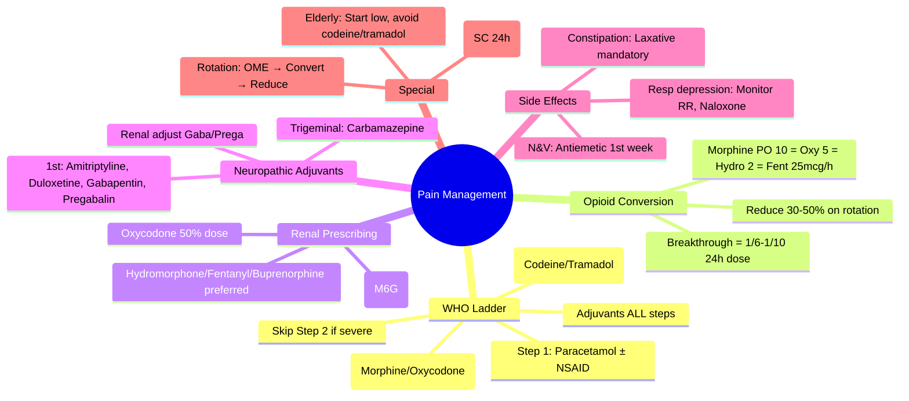

# Clinical Context: Pain Management (WHO Ladder, Opioids)

**Parent Topic:** [Clinical Therapeutics Overview](../../Clinical%20Therapeutics%20and%20Good%20Prescribing%20MOC.md)
**Status:** `full-fcps-mrcp-note`
**Priority:** ⭐⭐⭐ HIGHEST (FCPS/MRCP — WHO analgesic ladder, opioid conversion, neuropathic pain, breakthrough pain, opioid toxicity)
**Source:** Davidson 24th Ed Ch 2; WHO Guidelines; NICE CG173/NG193; BNF; Palliative Care Formulary; EAPC Guidelines; BPS

---

## 1. 🎯 Learning Objectives
- [ ] Apply **WHO Analgesic Ladder** (1986, updated 2019) for cancer and chronic pain
- [ ] Calculate **oral morphine equivalent (OME)** conversions between opioids
- [ ] Manage **breakthrough pain** with rescue doses
- [ ] Prescribe **adjuvant analgesics** for neuropathic pain (gabapentinoids, TCAs, SNRIs)
- [ ] Recognise and manage **opioid toxicity** (respiratory depression, sedation, constipation, N&V)
- [ ] Apply **opioid rotation** principles for toxicity/poor response
- [ ] Understand **special populations**: renal/hepatic impairment, elderly, palliative care
- [ ] Answer viva: "WHO ladder steps" and "Morphine to oxycodone conversion"

---

## 2. 🧠 Core Concept: WHO Analgesic Ladder (Updated 2019)

```mermaid
flowchart TD
    A[Pain Assessment<br/>Severity: Mild/Moderate/Severe<br/>Type: Nociceptive/Neuropathic/Mixed] --> B{Step 1: Mild Pain<br/>NRS 1-3}
    B --> C[Paracetamol 1g QDS<br/>± NSAID (ibuprofen 400mg TDS)<br/>± Adjuvant if neuropathic]
    C --> D{Inadequate?}
    D -->|Yes| E[Step 2: Moderate Pain<br/>NRS 4-6]
    D -->|No| F[Continue + Review]
    E --> G[Weak Opioid<br/>Codeine 30-60mg QDS<br/>or Tramadol 50-100mg QDS<br/>+ Paracetamol/NSAID<br/>+ Adjuvant]
    G --> H{Inadequate?}
    H -->|Yes| I[Step 3: Severe Pain<br/>NRS 7-10]
    H -->|No| J[Continue + Review]
    I --> K[Strong Opioid<br/>Morphine PO 10-20mg Q4H<br/>or Oxycodone PO 5-10mg Q4H<br/>or Fentanyl TD patch<br/>+ Paracetamol/NSAID<br/>+ Adjuvant<br/>+ Laxative + Antiemetic PRN]
    K --> L{Inadequate?}
    L -->|Yes| M[Optimise: Dose titration<br/>Opioid rotation<br/>Intrathecal/epidural<br/>Specialist referral]
```

> **Key Update (2019):** *Ladder applies to **all persistent pain** (not just cancer). **Skip Step 2** for severe pain — go straight to strong opioid. **Adjuvants at all steps** for neuropathic component. **Regular dosing** (not PRN) for persistent pain.*

---

## 3. ️⃣ Step 1: Non-Opioid Analgesics

| Drug | Dose | Max Daily | Key Points |
|------|------|-----------|------------|
| **Paracetamol** | 1g QDS (PO/IV) | **4g** (2g if <50kg/elderly/liver disease) | First-line; minimal side effects; **IV = 100% bioavailability** |
| **Ibuprofen** | 400mg TDS (PO) | 2.4g | NSAID of choice (lowest GI risk); avoid if CKD, HF, peptic ulcer, anticoagulation |
| **Naproxen** | 500mg BD (PO) | 1g | Alternative NSAID; lower CV risk than diclofenac |
| **Diclofenac** | 50mg TDS (PO) | 150mg | Higher CV risk; avoid if CVD risk factors |
| **COX-2 inhibitors** (celecoxib/etoricoxib) | 200mg OD/BD | 400mg/120mg | Lower GI risk; **CV risk** — avoid if CVD; not first-line |

### Paracetamol + NSAID Combination
- **Synergistic** (different mechanisms)
- **Paracetamol 1g + Ibuprofen 400mg** Q6H = effective for moderate pain
- **Max doses**: Paracetamol 4g + Ibuprofen 1.2g (if staggered)

---

## 4. ️⃣ Step 2: Weak Opioids (Moderate Pain)

| Drug | Dose | OME Ratio | Key Points |
|------|------|-----------|------------|
| **Codeine** | 30–60mg QDS (PO) | **1:10** (60mg codeine ≈ 6mg morphine) | **Prodrug** → morphine via CYP2D6; **poor metabolisers (7–10%) = no effect**; ultra-rapid = toxicity; constipating |
| **Tramadol** | 50–100mg QDS (PO) | **1:5** (100mg tramadol ≈ 20mg morphine) | **Dual**: weak μ-agonist + SNRI; **seizure risk** (↓ threshold); serotonin syndrome with SSRIs; renal adjustment |
| **Dihydrocodeine** | 30mg QDS (PO) | **1:6** | Similar to codeine; less CYP2D6 dependence |

> **Key:** *Step 2 opioids have **ceiling effect** — max dose limited by side effects. **Not for severe pain**. Avoid codeine in children <12y (MHRA).*

---

## 5. ️⃣ Step 3: Strong Opioids (Severe Pain)

### First-Line Oral Opioids

| Drug | Starting Dose (Opioid-Naïve) | OME Ratio | Formulations |
|------|------------------------------|-----------|--------------|
| **Morphine (IR)** | **10–20mg Q4H** (PO) | **1:1** (reference) | Oramorph® 10mg/5mL, Sevredol® 10/20mg |
| **Oxycodone (IR)** | **5–10mg Q4H** (PO) | **1:1.5–2** (5mg oxycodone ≈ 7.5–10mg morphine) | Shortec® 5/10/20mg; better bioavailability |
| **Hydromorphone (IR)** | **2–4mg Q4H** (PO) | **1:5** (2mg ≈ 10mg morphine) | Palladone® 1.3/2.6/4mg; renal safer |
| **Tapentadol (IR)** | **50–100mg Q4H** (PO) | **1:2.5–3** | Dual: μ-agonist + NRI; less constipation |

### Modified-Release (MR) — For Background Pain
| Drug | Starting Dose | Conversion from IR |
|------|---------------|-------------------|
| **Morphine MR** (MST®, Zomorph®) | **20–30mg BD** | Total 24h IR dose → BD |
| **Oxycodone MR** (OxyContin®) | **10–20mg BD** | Total 24h IR dose × 0.5 → BD |
| **Hydromorphone MR** (Palladone SR®) | **8–16mg BD** | Total 24h IR dose × 0.2 → BD |
| **Tapentadol MR** (Palexia SR®) | **50–100mg BD** | Total 24h IR dose × 0.5 → BD |

### Transdermal — For Stable Pain / Swallowing Difficulty
| Drug | Dose | Conversion |
|------|------|------------|
| **Fentanyl Patch** (Durogesic®) | **12.5–25 mcg/h** (q72h) | **100mg oral morphine/24h ≈ 25 mcg/h fentanyl** |
| **Buprenorphine Patch** (Transtec®, BuTrans®) | **5–20 mcg/h** (q72h/q168h) | Partial agonist; ceiling effect; less respiratory depression |

> **Key:** *Fentanyl patch **NOT** for acute/opioid-naïve pain. **12.5 mcg/h = lowest**. Conversion: **Morphine 60mg/24h PO ≈ Fentanyl 25mcg/h TD**.*

---

## 6. ️⃣ Opioid Conversion — Oral Morphine Equivalent (OME)

### Conversion Table (Approximate — **Always Reduce 30–50% on Rotation**)

| Drug | Route | Dose | ≈ Oral Morphine (mg) |
|------|-------|------|----------------------|
| **Morphine** | PO | 10mg | **10** |
| **Morphine** | SC/IV | 5mg | **10** (2:1) |
| **Oxycodone** | PO | 5mg | **7.5–10** (1:1.5–2) |
| **Oxycodone** | SC/IV | 2.5–3mg | **10** (2:1) |
| **Hydromorphone** | PO | 2mg | **10** (1:5) |
| **Hydromorphone** | SC/IV | 1mg | **10** (5:1) |
| **Fentanyl** | TD | 25mcg/h | **60–100mg/24h** |
| **Fentanyl** | IV | 100mcg | **10mg** (100:1) |
| **Alfentanil** | IV | 500mcg | **10mg** |
| **Remifentanil** | IV | 1mg | **10mg** |
| **Methadone** | PO | **Variable** (see below) | **Variable** |
| **Buprenorphine** | TD | 20mcg/h | **~30–40mg/24h** |
| **Tramadol** | PO | 100mg | **20** (1:5) |
| **Codeine** | PO | 60mg | **6** (1:10) |
| **Diamorphine** | SC/IV | 5mg | **10** (2:1) |

### Methadone Conversion — **Specialist Only**
| Current OME (mg/24h) | Methadone Ratio |
|----------------------|-----------------|
| <100 | 4:1 (100mg morphine ≈ 25mg methadone) |
| 100–300 | 8:1 |
| 300–600 | 12:1 |
| >600 | 15:1+ |
> **Methadone: long t½ (15–60h), QT prolongation, complex PK — **specialist supervision required**.**

### Opioid Rotation Principles
1. **Calculate current 24h OME**
2. **Select new opioid** (renal/hepatic considerations)
3. **Convert to new opioid dose** using table
4. **Reduce by 30–50%** (incomplete cross-tolerance)
5. **Divide into regular dosing** (BD for MR, Q4H for IR)
6. **Prescribe breakthrough dose** (1/6–1/10 of 24h dose)
7. **Monitor closely** (sedation, respiratory rate, pain score)

---

## 7. ️⃣ Breakthrough Pain — Rescue Dosing

| Principle | Detail |
|-----------|--------|
| **Definition** | Transient flare on controlled background pain |
| **Rescue dose** | **1/6 to 1/10 of total 24h opioid dose** (IR formulation) |
| **Frequency** | Q1–2H PRN (max 4–6 doses/24h) |
| **Reassessment** | If >3 rescue doses/day → **increase background dose** |
| **Incident pain** | Pre-emptive dosing 20–30 min before activity |

---

## 8. ️⃣ Adjuvant Analgesics — Neuropathic Pain

### First-Line (NICE CG173)
| Drug | Starting Dose | Target Dose | Key Points |
|------|---------------|-------------|------------|
| **Amitriptyline / Nortriptyline** | 10–25mg ON | 50–75mg ON | **TCA**; anticholinergic SE; avoid if CVD, glaucoma, retention; nortriptyline < SE |
| **Duloxetine** | 30mg OD | 60mg OD | **SNRI**; also for diabetic neuropathy; nausea common |
| **Gabapentin** | 300mg ON → 300mg TDS | 1800–3600mg/day | **Renal adjust**; slow titration; sedation, weight gain, oedema |
| **Pregabalin** | 75mg BD → 150mg BD | 300–600mg/day | **Renal adjust**; faster titration; similar SE; **controlled drug (Sch 3)** |

### Second-Line / Specialised
| Drug | Indication |
|------|------------|
| **Carbamazepine** | **Trigeminal neuralgia** (first-line) |
| **Lamotrigine** | Refractory neuropathic pain |
| **Topical lidocaine 5% patch** | Localised neuropathic pain (PHN) |
| **Capsaicin 8% patch** | PHN, HIV neuropathy (specialist) |
| **Ketamine (oral/IV)** | Refractory pain (specialist) |
| **Cannabinoids** (nabiximols) | MS spasticity pain (specialist) |

---

## 9. ️⃣ Opioid Side Effects — Prevention & Management

| Side Effect | Prevention | Management |
|-------------|------------|------------|
| **Constipation** | **Laxative co-prescription mandatory** (stimulant + softener: senna + docusate) | Increase laxatives; consider naloxegol (peripheral antagonist) |
| **Nausea/Vomiting** | Antiemetic PRN (metoclopramide/ondansetron) for 1st week | Regular antiemetic if persistent; rotate opioid |
| **Sedation** | Start low, titrate slow; avoid CNS depressants | Reduce dose; rotate; consider stimulant (modafinil — specialist) |
| **Respiratory Depression** | **Monitor RR** (not just SpO₂); naloxone available | **Naloxone 100–400mcg IV/SC** (titrate); support ventilation |
| **Dry Mouth** | Sips water, saliva substitutes | Pilocarpine drops |
| **Urinary Retention** | Monitor; avoid anticholinergics | Catheter if needed; reduce dose |
| **Pruritus** | Antihistamine (chlorphenamine) | Rotate opioid; ondansetron |
| **Myoclonus** | Hydration; rotate opioid | Clonazepam; rotate |
| **Opioid-Induced Hyperalgesia (OIH)** | Avoid dose escalation; rotate | **Opioid rotation**; ketamine adjuvant |

---

## 10. ️⃣ Special Populations

### Renal Impairment — **Opioid Choice Critical**

| Opioid | eGFR >30 | eGFR 15–30 | eGFR <15 / HD | Notes |
|--------|----------|------------|---------------|-------|
| **Morphine** | ✅ Use with caution | ❌ **Avoid** (M6G accumulation) | ❌ **Avoid** | M6G = active, renally cleared → respiratory depression |
| **Oxycodone** | ✅ Preferred | ✅ Reduce dose 50% | ⚠️ Specialist | Minor active metabolite; safer than morphine |
| **Hydromorphone** | ✅ Preferred | ✅ Preferred | ✅ Preferred | **Minimal active metabolites** — **safest in CKD** |
| **Fentanyl** | ✅ Preferred | ✅ Preferred | ✅ Preferred | **Hepatic clearance**; minimal renal; TD patch stable |
| **Buprenorphine** | ✅ Preferred | ✅ Preferred | ✅ Preferred | Partial agonist; ceiling respiratory effect |
| **Tramadol** | ✅ Reduce | ⚠️ Reduce 50% | ❌ Avoid | Seizure risk ↑ in renal failure |
| **Codeine** | ❌ Avoid | ❌ Avoid | ❌ Avoid | Unpredictable metabolism |
| **Methadone** | ✅ Preferred | ✅ Preferred | ✅ Preferred | Hepatic; but complex — specialist |

> **Viva Key:** *Morphine **avoided in CKD** (M6G). **Hydromorphone, fentanyl, buprenorphine, oxycodone (dose-reduced), methadone** = preferred in renal failure.*

### Hepatic Impairment
- **All opioids**: Start low, titrate slow
- **Morphine/Oxycodone**: ↓ Clearance → reduce dose
- **Fentanyl/Buprenorphine**: Preferred (less hepatic first-pass)
- **Methadone**: Complex — specialist

### Elderly
- **Start low** (50% of adult dose)
- **Titrate slowly**
- **Monitor**: Sedation, falls, confusion, constipation
- **Avoid**: Codeine (CYP2D6), tramadol (seizures), meperidine (normeperidine)
- **Preferred**: Paracetamol first; then morphine/hydromorphone/oxycodone low dose

### Palliative Care — Syringe Drivers (SC Infusion)
| Drug | Compatibility | Dose Range (24h) |
|------|---------------|------------------|
| **Morphine** | Most compatible | 10–500mg+ |
| **Oxycodone** | Compatible | 5–200mg |
| **Hydromorphone** | Compatible | 2–100mg |
| **Alfentanil** | Highly compatible | 0.5–5mg |
| **Ketamine** | Compatible (separate line preferred) | 50–500mg |
| **Midazolam** | Compatible | 5–60mg |
| **Levomepromazine** | Compatible | 6.25–25mg |
| **Haloperidol** | Compatible | 1–10mg |
| **Glycopyrronium** | Compatible | 0.6–2.4mg |
| **Octreotide** | Compatible | 300–1200mcg |

> **Water for injection** = standard diluent. **Sodium chloride 0.9%** for alfentanil. **Check compatibility charts** (Dickman, Palliative Care Formulary).

---

## 11. ️⃣ Practical Prescribing Algorithm

```mermaid
flowchart TD
    A[Assess Pain: Severity, Type, Impact] --> B{Neuropathic Component?}
    B -->|Yes| C[Add Adjuvant at ALL Steps<br/>Gabapentin/Pregabalin/Duloxetine/Amitriptyline]
    B -->|No| D[Proceed]
    C & D --> E{Pain Severity}
    E -->|Mild (1-3)| F[Step 1: Paracetamol ± NSAID<br/>Regular dosing]
    E -->|Moderate (4-6)| G[Step 2: Weak Opioid<br/>Codeine/Tramadol + Step 1]
    E -->|Severe (7-10)| H[Step 3: Strong Opioid<br/>Morphine/Oxycodone MR + IR breakthrough]
    F & G & H --> I[Co-prescribe Laxative + Antiemetic PRN]
    I --> J[Review: 24-48h (acute), 1-2w (chronic)]
    J --> K{Adequate Control?}
    K -->|No| L[Optimise: Titrate dose<br/>Add/Adjust adjuvant<br/>Opioid rotation<br/>Specialist referral]
    K -->|Yes| M[Continue + Regular Review]
```

---

## 12. ⚡ FCPS/MRCP High-Yield Summary

| Topic | Key Points |
|-------|------------|
| **WHO Ladder** | Step 1: Paracetamol ± NSAID. Step 2: Weak opioid (codeine/tramadol) + Step 1. Step 3: Strong opioid (morphine/oxycodone) + Step 1. **Skip Step 2 for severe pain**. Adjuvants at all steps for neuropathic pain. |
| **Opioid Conversion** | **Morphine PO 10mg = Oxycodone PO 5mg = Hydromorphone PO 2mg = Fentanyl TD 25mcg/h ≈ Morphine 60mg/24h PO**. **Reduce 30–50% on rotation**. |
| **Breakthrough Dose** | **1/6–1/10 of 24h dose** (IR) Q1–2H PRN. >3/day → increase background. |
| **Renal Impairment** | **Avoid morphine** (M6G). **Preferred: Hydromorphone, fentanyl, buprenorphine, oxycodone (½ dose), methadone**. |
| **Neuropathic Adjuvants** | **First-line: Amitriptyline, duloxetine, gabapentin, pregabalin** (renal adjust). Carbamazepine for trigeminal neuralgia. |
| **Side Effects** | **Constipation = universal (laxative mandatory)**. N&V (antiemetic 1st week). Sedation. Respiratory depression (monitor RR). |
| **Opioid Rotation** | Calculate OME → Convert → **Reduce 30–50%** → Regular dosing + breakthrough. |
| **Syringe Driver** | SC infusion 24h. Morphine/oxycodone/hydromorphone/alfentanil + midazolam/levomepromazine/haloperidol. Water for injection. |

---

## 13. 🎤 Viva Questions (Expected Answers)

| # | Question | Expected Answer |
|---|----------|-----------------|
| 1 | WHO Analgesic Ladder — three steps? | Step 1: Non-opioid (paracetamol ± NSAID). Step 2: Weak opioid (codeine/tramadol) + non-opioid. Step 3: Strong opioid (morphine/oxycodone) + non-opioid. Adjuvants at all steps. |
| 2 | Oral morphine to oxycodone conversion? | **Morphine 10mg PO ≈ Oxycodone 5mg PO** (ratio 1:1.5–2). Reduce 30–50% on rotation. |
| 3 | Morphine in renal failure — why avoid? | **Morphine-6-glucuronide (M6G)** = active metabolite, renally cleared → accumulates → **respiratory depression, sedation**. |
| 4 | Preferred opioid in CKD? | **Hydromorphone, fentanyl, buprenorphine, oxycodone (dose-reduced), methadone** — minimal active metabolites. |
| 5 | Breakthrough dose calculation? | **1/6 to 1/10 of total 24h opioid dose** as immediate-release, Q1–2H PRN. |
| 6 | First-line neuropathic pain adjuvants? | **Amitriptyline, duloxetine, gabapentin, pregabalin** (NICE). Carbamazepine for trigeminal neuralgia. |
| 7 | Fentanyl patch conversion from oral morphine? | **Oral morphine 60mg/24h ≈ Fentanyl 25mcg/h TD**. Lowest patch 12.5mcg/h = ~30mg morphine/24h. |
| 8 | Opioid rotation — why reduce dose 30–50%? | **Incomplete cross-tolerance** — patient not fully tolerant to new opioid's side effects. |
| 9 | Co-prescribing essential with strong opioids? | **Laxative (stimulant + softener: senna + docusate)** + **Antiemetic PRN** for first week. |
| 10 | Syringe driver compatible drugs (common)? | **Morphine, oxycodone, hydromorphone, alfentanil, midazolam, levomepromazine, haloperidol, glycopyrronium, octreotide** — water for injection diluent. |

---

## 14. 🧩 Confusions & Mnemonics

| Confusion | Clarification |
|-----------|---------------|
| **"WHO ladder only for cancer pain"** | **NO.** 2019 update: **all persistent pain** (cancer + chronic non-cancer). |
| **"Step 2 mandatory before Step 3"** | **NO.** **Skip Step 2 for severe pain** — go straight to strong opioid. |
| **"Codeine works for everyone"** | **NO.** **Prodrug** → morphine via **CYP2D6**. **Poor metabolisers (7–10%) = no analgesia**. Ultra-rapid = toxicity. |
| **"Tramadol = safe weak opioid"** | **NO.** **Seizure risk** (↓ threshold), serotonin syndrome with SSRIs, renal adjust needed, controlled drug (Sch 3). |
| **"Fentanyl patch for acute pain"** | **NO.** **Only for stable chronic pain** in opioid-tolerant patients. NOT for opioid-naïve. |
| **"Methadone conversion simple"** | **NO.** **Variable ratio** (4:1 to 15:1 depending on current OME). **Long t½, QT prolongation — specialist only.** |
| **"Oxycodone safe in all CKD"** | **Reduce 50% if eGFR<30**. Hydromorphone/fentanyl/buprenorphine safer. |
| **"Laxative only if constipated"** | **NO.** **Prophylactic laxative mandatory** with ALL strong opioids from Day 1. |
| **"PRN opioids for chronic pain"** | **NO.** **Regular dosing** (MR BD + IR breakthrough) for persistent pain. PRN only for incident/breakthrough. |

> **Mnemonic: PAIN MANAGEMENT WHO**  
> **P**ain assessment: **Severity (NRS), Type (nociceptive/neuropathic)**  
> **A**djuvants at **ALL steps** for neuropathic: **Amitriptyline, Duloxetine, Gabapentin, Pregabalin**  
> **I**R vs MR: **MR for background (BD), IR for breakthrough (Q4H)**  
> **N**europathic: **Carbamazepine = trigeminal neuralgia**  
> **M**orphine PO 10mg = **Oxycodone PO 5mg = Hydromorphone PO 2mg = Fentanyl TD 25mcg/h**  
> **A**void morphine in **CKD** (M6G accumulation) → **Hydromorphone/Fentanyl/Buprenorphine preferred**  
> **N**ausea/Constipation: **Laxative mandatory (senna+docusate); Antiemetic 1st week**  
> **A**lways **reduce 30-50% on opioid rotation** (incomplete cross-tolerance)  
> **G**abapentin/Pregabalin: **Renal adjust** (eGFR<30: ↓ dose/↑ interval)  
> **E**lderly: **Start 50% dose; monitor falls/sedation; avoid codeine/tramadol/meperidine**  
> **M**ethadone: **Specialist only** (variable ratio, QT, long t½)  
> **E** - **Entonox** (50% N₂O) for procedural/acute pain  
> **N**on-opioid: **Paracetamol 1g QDS (max 4g); Ibuprofen 400mg TDS**  
> **T**ramadol: **Seizure risk, serotonin syndrome, Sch 3, renal adjust**  
> **WHO Ladder**: **Step 1 (Paracetamol/NSAID) → Step 2 (Codeine/Tramadol) → Step 3 (Morphine/Oxycodone)**  
> **H**eroin (diamorphine) SC: **2:1 vs oral morphine** (5mg SC = 10mg PO)  
> **O**pioid rotation: **OME → Convert → Reduce 30-50% → Regular + Breakthrough**  
> **L**axative: **Senna + Docusate** from Day 1 with strong opioids  
> **A**lfentanil: **Syringe driver favourite** (stable, small volume, minimal histamine)  
> **D**iamorphine: **SC preferred in palliative** (more soluble than morphine)  
> **D**osage breakthrough: **1/6-1/10 of 24h dose**; >3/day → ↑ background  
> **R**espiratory depression: **Monitor RR (not SpO₂); Naloxone 100-400mcg IV/SC**  
> **S**yringe driver: **Water for injection; 24h; check compatibility (Dickman)**

---

## 15. 🗺️ Mind Map



---

## 16. 📅 Spaced Repetition Tracker

| Review | Date | Score (0–5) | Notes |
|--------|------|-------------|-------|
| Day 1 | | | |
| Day 3 | | | |
| Day 7 | | | |
| Day 14 | | | |
| Day 30 | | | |
| Day 90 | | | |

---

## 17. 📝 Self-Test Scorecard

| Section | Max | Score | % |
|---------|-----|-------|---|
| WHO Ladder | 3 | | |
| Opioid Conversion | 4 | | |
| Renal Prescribing | 3 | | |
| Neuropathic Adjuvants | 3 | | |
| Breakthrough Dosing | 2 | | |
| Opioid Side Effects | 2 | | |
| Opioid Rotation | 2 | | |
| Syringe Driver | 2 | | |
| **Total** | **20** | | |

---

## 18. 💬 Exam Answer Modes

| Format | Prompt | Key Points |
|--------|--------|------------|
| **Long Essay** | "Describe the management of severe cancer pain including opioid selection, conversion and side effects." | WHO ladder (skip step 2), morphine/oxycodone MR + IR breakthrough, OME conversions, renal adjustments, laxative/antiemetic, adjuvant for neuropathic, rotation principles, syringe driver |
| **Short Note** | "Opioid conversion in renal failure." | Avoid morphine (M6G). Use hydromorphone/fentanyl/buprenorphine. Oxycodone 50% dose reduction. Methadone specialist. |
| **Viva** | "Patient on morphine 60mg/24h PO, switching to fentanyl patch. Dose?" | **Morphine 60mg/24h PO ≈ Fentanyl 25mcg/h TD**. Start 25mcg/h patch, continue oral morphine for 12h after patch application (reservoir effect). |
| **Ward Round** | "Patient on oxycodone MR 40mg BD, drowsy, RR 8. Immediate action?" | **Opioid toxicity**. **Naloxone 100–400mcg IV/SC** titrate to RR >10. Stop oxycodone. Monitor. Consider rotation to hydromorphone/fentanyl when stable. |
| **Last-Night** | "Ladder: Step1 Paracet/NSAID, Step2 Codeine/Tramadol, Step3 Morph/Oxy. Skip Step2 severe. Conversion: M10=O5=Hy2=Fent25mcg/h. CKD: avoid M, use Hy/Fent/Bupr. Neuropathic: Ami/Dulox/Gaba/Prega. Breakthrough 1/6-1/10. Laxative+antiemetic mandatory. Rotation reduce 30-50%." | WHO ladder. Key conversions. Renal prescribing. Neuropathic adjuvants. Breakthrough. Side effect prophylaxis. Rotation. |

---

## 19. 📌 Summary
- **WHO Ladder**: Step 1 (Paracetamol ± NSAID) → Step 2 (Codeine/Tramadol) → Step 3 (Morphine/Oxycodone). **Skip Step 2 for severe pain**. Adjuvants at all steps for neuropathic pain.
- **Key Conversions**: **Morphine PO 10mg = Oxycodone PO 5mg = Hydromorphone PO 2mg = Fentanyl TD 25mcg/h ≈ Morphine 60mg/24h PO**. **Reduce 30–50% on rotation** (incomplete cross-tolerance).
- **Breakthrough Dose**: **1/6–1/10 of 24h dose** (IR) Q1–2H PRN. >3/day → increase background.
- **Renal Impairment**: **Avoid morphine** (M6G accumulation). **Preferred: Hydromorphone, fentanyl, buprenorphine, oxycodone (½ dose), methadone**.
- **Neuropathic Adjuvants**: **First-line: Amitriptyline, duloxetine, gabapentin, pregabalin** (renal adjust). Carbamazepine for trigeminal neuralgia.
- **Side Effects**: **Constipation = universal** → **laxative mandatory** (senna + docusate). N&V (antiemetic 1st week). Sedation. **Respiratory depression** → monitor RR, naloxone available.
- **Opioid Rotation**: Calculate OME → Convert → **Reduce 30–50%** → Regular MR + IR breakthrough.
- **Syringe Driver (SC 24h)**: Morphine/oxycodone/hydromorphone/alfentanil + midazolam/levomepromazine/haloperidol/glycopyrronium. Water for injection.

---

## 20. ❓ MCQs (10)

1. **WHO Analgesic Ladder Step 2 drug:**  
   A. Morphine  B. **Codeine**  C. Fentanyl  D. Paracetamol  
   *Answer: B. Step 2 = weak opioids (codeine, tramadol, dihydrocodeine).*

2. **Oral morphine to oxycodone conversion ratio:**  
   A. 1:1  B. **1:1.5–2 (10mg morphine ≈ 5mg oxycodone)**  C. 2:1  D. 1:5  
   *Answer: B. Morphine 10mg PO ≈ Oxycodone 5mg PO (1.5–2x more potent).*

3. **Opioid AVOIDED in chronic kidney disease:**  
   A. Hydromorphone  B. Fentanyl  C. **Morphine**  D. Buprenorphine  
   *Answer: C. Morphine → M6G (active metabolite) accumulates in CKD → respiratory depression.*

4. **Breakthrough dose for patient on morphine MR 60mg BD:**  
   A. 5mg  B. **10–20mg**  C. 30mg  D. 60mg  
   *Answer: B. 24h dose = 120mg. Breakthrough = 1/6–1/10 = 12–20mg (use 10–20mg IR).*

5. **First-line adjuvant for diabetic neuropathy:**  
   A. Carbamazepine  B. **Duloxetine**  C. Topiramate  D. Lamotrigine  
   *Answer: B. Duloxetine (SNRI) — NICE first-line for diabetic neuropathy. Also amitriptyline, gabapentin, pregabalin.*

6. **Fentanyl transdermal patch — indication:**  
   A. Acute postoperative pain  B. **Stable chronic pain in opioid-tolerant patient**  C. Opioid-naïve severe pain  D. Breakthrough pain  
   *Answer: B. Fentanyl patch ONLY for stable chronic pain in opioid-tolerant patients. NOT for acute/opioid-naïve.*

7. **Methadone conversion — characteristic:**  
   A. Fixed ratio 1:1  B. **Variable ratio (4:1 to 15:1 depending on OME)**  C. Always 10:1  D. 2:1  
   *Answer: B. Methadone ratio varies with current OME (4:1 if <100mg, up to 15:1 if >600mg). Specialist only.*

8. **Co-prescription MANDATORY with strong opioids:**  
   A. PPI  B. **Laxative (stimulant + softener)**  C. Antihistamine  D. Beta-blocker  
   *Answer: B. Constipation is universal — prophylactic laxative (senna + docusate) from Day 1.*

9. **Syringe driver diluent:**  
   A. Sodium chloride 0.9%  B. **Water for injection**  C. Glucose 5%  D. Hartmann's  
   *Answer: B. Water for injection (standard). NaCl 0.9% for alfentanil.*

10. **Tramadol — key risk:**  
    A. Respiratory depression  B. **Seizures (lowers threshold)**  C. Hepatotoxicity  D. Nephrotoxicity  
    *Answer: B. Tramadol lowers seizure threshold; risk with antidepressants, renal failure, epilepsy.*

---

## 21. 📋 SBAs (10)

1. **70M, metastatic prostate cancer, severe back pain (NRS 9). eGFR 20. Strong opioid choice?**  
   A. Morphine MR 20mg BD  B. Oxycodone MR 20mg BD  C. **Hydromorphone MR 8mg BD**  D. Codeine 60mg QDS  
   *Answer: C. eGFR 20 → avoid morphine. Hydromorphone preferred (minimal active metabolites). Oxycodone needs 50% reduction. Codeine inadequate for severe pain.*

2. **Patient on morphine MR 60mg BD, breakthrough morphine IR 20mg Q4H PRN. Using 6 breakthrough doses/day. Action?**  
   A. Increase breakthrough to 30mg  B. **Increase morphine MR to 90mg BD**  C. Add tramadol  D. Switch to fentanyl  
   *Answer: B. >3 breakthrough doses/day → increase background dose by 30–50% (120mg → 180mg/24h = 90mg BD).*

3. **65F, trigeminal neuralgia, carbamazepine 200mg BD, develops rash and eosinophilia. Action?**  
   A. Continue, add antihistamine  B. **Stop carbamazepine (SJS risk); refer neurology**  C. Reduce dose  D. Switch to gabapentin  
   *Answer: B. Carbamazepine + rash + eosinophilia = potential SJS/DRESS. Stop immediately. Refer.*

4. **Palliative patient, syringe driver: morphine 30mg/24h + midazolam 10mg/24h. Compatible?**  
   A. No  B. **Yes (standard combination)**  C. Only with NaCl 0.9%  D. Only separate lines  
   *Answer: B. Morphine + midazolam = compatible in water for injection (standard palliative combination).*

5. **Opioid-naïve patient, severe acute pain. WHO ladder approach?**  
   A. Start Step 1, escalate weekly  B. **Start Step 3 (strong opioid) immediately**  C. Start Step 2  D. Paracetamol only  
   *Answer: B. Severe pain (NRS 7–10) → **skip Step 2, go straight to Step 3 (strong opioid)**. Regular dosing + breakthrough.*

---

## 22. 🔑 Answer Keys
| MCQs | SBAs |
|------|------|
| 1-B, 2-B, 3-C, 4-B, 5-B, 6-B, 7-B, 8-B, 9-B, 10-B | 1-C, 2-B, 3-B, 4-B, 5-B |

---

## 23. 🔗 Cross-Links
- [[Medication Safety and Errors/PINCH High-Risk Drugs]] — Opioids (N in PINCH): respiratory depression, naloxone, standard concentrations
- [[Special Populations/Renal Prescribing]] — Opioid choice in CKD (avoid morphine, prefer hydromorphone/fentanyl)
- [[Special Populations/Elderly Prescribing]] — Opioids in elderly (start low, falls risk, avoid codeine/tramadol)
- [[Special Populations/Hepatic Prescribing]] — Opioid metabolism in liver disease
- [[Clinical Context/Palliative Care]] — Syringe drivers, end-of-life opioid management
- [[Drug Interactions/Pharmacokinetic interactions/Metabolism interactions]] — CYP2D6 (codeine), CYP3A4 (fentanyl, oxycodone), serotonin syndrome (tramadol + SSRIs)
- [[Therapeutic Drug Monitoring]] — Not routine for opioids but TDM principles apply (toxicity monitoring)
- [[Polypharmacy and Deprescribing/Assessment Tools]] — STOPP criteria for opioids in elderly
