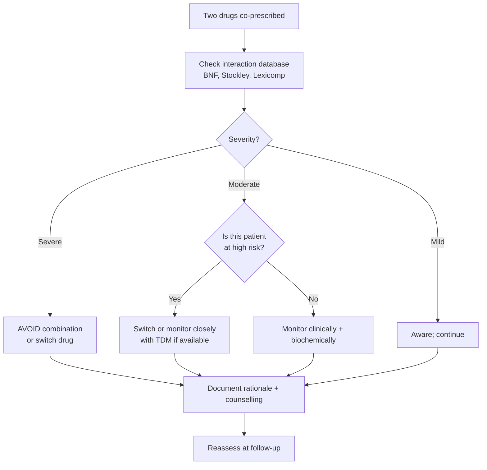
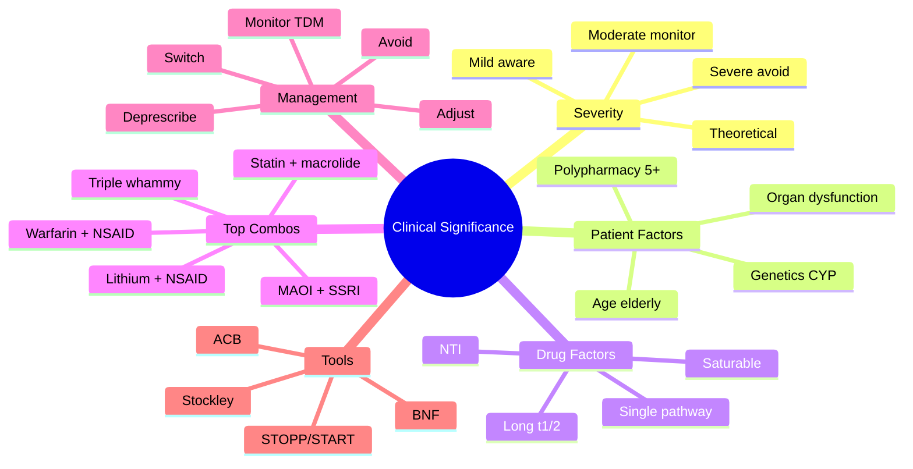

# Clinical Significance of Drug Interactions

> [!info]
> **Disease-Level Topic** under **Drug Interactions → Clinical Significance**.
> Davidson 24e Ch2 — "Drug Interactions and Polypharmacy" (Maxwell SRJ).

## 1. Learning Objectives
- [ ] Stratify drug interactions by **clinical significance** (severe, moderate, mild)
- [ ] Identify **patient-related** risk factors (age, organ function, polypharmacy, genetics)
- [ ] Identify **drug-related** risk factors (narrow TI, dose, route, frequency)
- [ ] Use **BNF / Stockley** interaction checkers effectively
- [ ] Decide between "monitor", "adjust dose", "switch", "avoid"
- [ ] Apply a structured **risk-benefit framework**
- [ ] Document interactions in medical records
- [ ] Counsel patients on common interactions

## 2. Stratification of Clinical Significance

| Severity | Definition | Example | Action |
|----------|------------|---------|--------|
| **Severe / Contraindicated** | Life-threatening; possible fatality; combined use should be AVOIDED | MAOI + SSRI (serotonin syndrome); ergot + strong CYP3A4 inhibitor (ergotism); simvastatin + ciclosporin (rhabdomyolysis) | **AVOID** |
| **Moderate / Significant** | Clinically important; may need dose adjustment, monitoring, or alternative | Warfarin + amiodarone; ciclosporin + diltiazem; lithium + NSAID | **Monitor** or **adjust** |
| **Mild / Minor** | Limited clinical effect; no action usually needed | Paracetamol + codeine (additive analgesia); amoxicillin + paracetamol | **No action**; aware |
| **Unknown / Theoretical** | Documented in vitro, unclear in vivo | Some protein binding displacement | **Aware** |

## 3. Mermaid Algorithm — Interaction Risk Assessment

## 4. Comparison Tables

### 4.1 Patient-Related Risk Factors

| Factor | Mechanism | Example |
|--------|-----------|---------|
| **Age (≥65 yr)** | ↓ Hepatic/renal function; polypharmacy; frailty | Elderly on warfarin + NSAID → bleed |
| **Organ dysfunction** | ↓ Metabolism/excretion | CKD + lithium; hepatic failure + morphine |
| **Polypharmacy (≥5 drugs)** | Probability of interaction ↑ exponentially | 5 drugs = 50% chance; ≥10 drugs = 100% |
| **Genetics (CYP polymorphisms)** | Poor/ultra-rapid metaboliser | CYP2C19 PM + clopidogrel → no antiplatelet effect |
| **Disease state** | Altered PK/PD | Heart failure + β-blocker (↓ clearance) |
| **Pregnancy / Lactation** | Altered PK + fetal exposure | Warfarin (teratogenic); ACEi (fetal AKI) |
| **Critical illness** | ↓ Perfusion, ↓ protein binding, ↓ clearance | ICU patient on multiple sedatives |
| **Adherence** | Affects steady state and monitoring | Poor adherence + variable INR |

### 4.2 Drug-Related Risk Factors

| Factor | Drugs at risk |
|--------|--------------|
| **Narrow therapeutic index (NTI)** | Warfarin, digoxin, lithium, phenytoin, theophylline, aminoglycosides, ciclosporin, tacrolimus, methotrexate |
| **Steep dose-response curve** | Heparin, insulin, opioids, phenytoin |
| **Saturable metabolism (Michaelis-Menten)** | Phenytoin, theophylline (zero-order at therapeutic doses) |
| **Multiple metabolism pathways** | Resistant to single CYP inhibition (e.g., codeine via CYP2D6) |
| **Single metabolism pathway** | Vulnerable to inhibition (e.g., tacrolimus via CYP3A4) |
| **Active metabolites** | Morphine → M6G; tramadol → O-desmethyltramadol |
| **Long half-life** | Amiodarone, chloroquine (persistence) |
| **High first-pass** | Ciclosporin, tacrolimus, fentanyl |

### 4.3 Top 10 Highest-Risk Drug Combinations (Mnemonic: "**WWALICCTSM**")

| Rank | Combination | Risk | Mechanism |
|------|-------------|------|-----------|
| 1 | **W**arfarin + NSAID / aspirin | GI bleed | Additive + ↓ platelet function |
| 2 | **W**arfarin + macrolide / quinolone / TMP | ↑ INR | CYP inhibition |
| 3 | **A**CEi + diuretic + NSAID ("triple whammy") | AKI | Renal hypoperfusion |
| 4 | **L**ithium + NSAID / ACEi / thiazide | Lithium toxicity | ↓ Renal clearance |
| 5 | **I**mmunosuppressant (ciclosporin/tacrolimus) + macrolide / azole | Toxicity | CYP3A4 inhibition |
| 6 | **C**YP3A4 substrate + strong inhibitor (e.g., simvastatin + clarithromycin) | Rhabdomyolysis / toxicity | ↑ Substrate levels |
| 7 | **C**lozapine + carbamazepine | Agranulocytosis risk | Additive bone marrow suppression |
| 8 | **T**hree QT-prolonging drugs (e.g., sotalol + ondansetron + erythromycin) | Torsades | Additive QT prolongation |
| 9 | **S**erotonergic drugs (MAOI + SSRI, tramadol + SSRI) | Serotonin syndrome | Additive 5HT effect |
| 10 | **M**ethotrexate + trimethoprim / NSAID | Pancytopenia | Additive antifolate + ↓ clearance |

### 4.4 Action Strategies

| Strategy | When | Example |
|----------|------|---------|
| **Avoid combination** | Severe, life-threatening | MAOI + SSRI |
| **Switch drug class** | Moderate with safer alternative | Simvastatin → pravastatin (if macrolide needed) |
| **Dose adjustment** | Predictable PK change | Reduce warfarin 30-50% when starting amiodarone |
| **Timing separation** | Absorption interactions | Levothyroxine + calcium — separate by 4 hr |
| **Therapeutic Drug Monitoring (TDM)** | Narrow TI drugs | Tacrolimus + diltiazem → check level |
| **Clinical + biochemical monitoring** | Moderate interactions | INR, U&E, LFT, drug levels |
| **Patient education** | OTC, food, herbal | Avoid grapefruit, St John's Wort |
| **Deprescribing** | Polypharmacy, >5 drugs | STOPP/START |

### 4.5 Food / Herbal / OTC Interactions

| Substance | Affected drug | Effect |
|-----------|--------------|--------|
| **Grapefruit** | Statins (simva, atorva), ciclosporin, tacrolimus, CCB, sildenafil, apixaban | ↑ Levels (CYP3A4) |
| **Dairy / antacids** | Tetracyclines, quinolones | ↓ Absorption (chelation) |
| **Vitamin K-rich foods** | Warfarin | ↓ INR |
| **Cranberry juice** | Warfarin | ↑ INR (CYP2C9) |
| **St John's Wort** | Ciclosporin, tacrolimus, OCP, simvastatin, apixaban, SSRIs, MAOIs | ↓ Levels (CYP3A4 induction) |
| **Alcohol (acute)** | CNS depressants, paracetamol (chronic) | ↑ Sedation, hepatotoxicity |
| **Tobacco** | Theophylline, insulin, β-blockers, warfarin | CYP1A2 induction |
| **Garlic, ginkgo, ginger** | Warfarin, antiplatelets | ↑ Bleeding |
| **Iron / multivitamins** | Tetracyclines, quinolones, levothyroxine, bisphosphonates | ↓ Absorption |
| **Echinacea** | Immunosuppressants | ↓ Effect (theoretical) |

## 5. FCPS/MRCP High-Yield Summary

| Pearl | Detail |
|-------|--------|
| Number of drugs threshold for high interaction risk | ≥5 (polypharmacy); ≥10 = near-certain interaction |
| Top 3 most common fatal interactions | Warfarin + NSAID; Methotrexate + NSAID; Opioid + benzo |
| 2 highest-risk patient groups | Elderly, polypharmacy, organ dysfunction |
| NTI drugs to monitor closely | Warfarin, digoxin, lithium, phenytoin, theophylline, ciclosporin, tacrolimus, methotrexate, aminoglycosides |
| Interaction checkers | BNF (UK), Stockley, Lexicomp, Micromedex, Drugs.com, Medscape |
| Documenting interactions | In notes, on prescription, in discharge summary, in EPR alerts |
| Risk-benefit | Always weigh interaction risk vs clinical benefit; sometimes no good alternative |
| Polypharmacy review | Use STOPP/START criteria; aim for <5 drugs where possible |
| 100% rule | A patient on 10 drugs has 100% chance of at least one interaction (theoretical, not all clinically significant) |
| Communication | Patient, GP, pharmacist, MDT |
| Anticholinergic burden scale | ACB calculator; sum score ≥3 = ↑ cognitive impairment risk |

## 6. Viva Questions (10)

1. **Stratify drug interactions by clinical significance.**
   *Severe (life-threatening; avoid); Moderate (clinically relevant; monitor or adjust); Mild (limited effect; aware); Theoretical (in vitro only).*

2. **Name 3 patient-related risk factors for interactions.**
   *Age (≥65), organ dysfunction (renal/hepatic), polypharmacy (≥5), genetic polymorphisms (CYP), disease state (HF, pregnancy), poor adherence.*

3. **Name 3 drug-related risk factors.**
   *Narrow therapeutic index (warfarin, digoxin, lithium, phenytoin, theophylline); single metabolic pathway (CYP3A4 for tacrolimus); long half-life (amiodarone).*

4. **What is the most common cause of fatal drug interaction?**
   *GI bleeding from NSAID + anticoagulant (warfarin, DOAC, heparin); CNS depression from opioid + benzo; AKI from ACEi + diuretic + NSAID; methotrexate + NSAID; serotonin syndrome from MAOI + SSRI.*

5. **How do you assess clinical significance of an interaction?**
   *Use BNF/Stockley. Consider: severity (life-threatening vs minor), patient factors (age, organ function, polypharmacy), drug factors (NTI, dose, route), availability of alternatives, monitoring options (TDM), documentation.*

6. **A patient is on warfarin, amiodarone, simvastatin, lisinopril, indapamide. They are prescribed clarithromycin. List the interactions.**
   *1) Warfarin + amiodarone (already present) — high INR; 2) Warfarin + clarithromycin — ↑ INR (CYP inhibition); 3) Simvastatin + clarithromycin — rhabdomyolysis (CYP3A4); 4) Lisinopril + indapamide (already) + clarithromycin — no major PK, but renal caution.*

7. **What is the role of deprescribing in reducing interactions?**
   *Removes unnecessary drugs → ↓ interaction risk, ↓ ADR, ↓ cost, ↑ adherence. Use STOPP/START criteria; prioritise drugs with high interaction risk.*

8. **What is the difference between "avoid" and "monitor" in interaction management?**
   *Avoid: combination is life-threatening or has no safe alternative. Monitor: combination has known interaction but is manageable with dose adjustment, TDM, or clinical monitoring.*

9. **What is the "anticholinergic burden" scale?**
   *Quantifies cumulative anticholinergic effect of multiple drugs (e.g., TCA, antihistamine, oxybutynin, antipsychotic). Score ≥3 → ↑ risk of cognitive impairment, falls, delirium in elderly. Useful in polypharmacy review.*

10. **How do you document an interaction decision?**
    *In the medical record: list the interaction, the rationale for use (benefit > risk), the monitoring plan (clinical, biochemical, TDM), patient counselling given, and any dose adjustment. Communicate to GP and pharmacist.*

## 7. Confusions & Mnemonics

| Confusion | Resolution |
|-----------|------------|
| PK vs PD interaction | PK = concentration change; PD = effect change at same concentration |
| Theoretical vs clinical interaction | Theoretical = in vitro only; Clinical = observed in patients |
| Drug interaction vs drug incompatibility | Interaction = in vivo (in patient); Incompatibility = in vitro (in syringe/bag) |
| BNF severity vs Stockley | BNF: standard, do not co-administer, etc.; Stockley: more detailed, with management |
| Additive vs synergistic | Additive = 1+1=2; Synergistic = 1+1=3 (supra-additive) |
| Antagonistic vs inhibition | Antagonistic = opposing effect (e.g., naloxone + morphine); Inhibition = blocks enzyme/receptor |
| Severe vs moderate interaction | Severe = life-threatening; Moderate = clinically relevant but manageable |
| Polypharmacy threshold | ≥5 drugs; "hyper-polypharmacy" ≥10 |
| Anticholinergic burden | Cumulative score of anticholinergic drugs; ≥3 = high risk in elderly |
| Adherence to monitoring | In elderly, polypharmacy, narrow TI drugs |

**Mnemonic — Top 5 highest-risk combinations: "**WAIT-S**"** (Warfarin + Amiodarone/NSAID; ACEi + diuretic + NSAID; Immunosuppressant + azole; Triple QT prolongers; Serotonin syndrome)

**Mnemonic — Severe vs Moderate: "**S**evere = **S**top **S**tart (avoid); **M**oderate = **M**odify/**M**onitor"**

**Mnemonic — NTI drugs: "**W**ide **L**ist of **N**arrow **T**herapeutic: Warfarin, Lithium, Phenytoin, Theophylline, Digoxin, Cyclosporin, Tacrolimus"** (WLPTTDC)

**Mnemonic — Patient risk factors: "**A**ge **O**rgan **P**olypharmacy **G**enetic **D**isease **P**regnancy"** (AOPGDP)

## 8. Mermaid Mind Map

## 9. Spaced Repetition Tracker

| Topic | Day 1 | Day 3 | Day 7 | Day 14 | Day 30 |
|-------|-------|-------|-------|-------|--------|
| Severity tiers | ☐ | ☐ | ☐ | ☐ | ☐ |
| Patient risk factors | ☐ | ☐ | ☐ | ☐ | ☐ |
| Drug risk factors | ☐ | ☐ | ☐ | ☐ | ☐ |
| Top 5 combos | ☐ | ☐ | ☐ | ☐ | ☐ |
| NTI drugs | ☐ | ☐ | ☐ | ☐ | ☐ |
| ACB scale | ☐ | ☐ | ☐ | ☐ | ☐ |

## 10. Self-Test Scorecard

| Domain | Score (0-5) |
|--------|-------------|
| Severity stratification | /5 |
| Patient risk factors | /5 |
| Drug risk factors | /5 |
| Top combinations | /5 |
| Management strategies | /5 |
| Documentation | /5 |
| **TOTAL** | **/30** |

## 11. MCQs (10)

1. **The polypharmacy threshold for "high interaction risk" is:**
   A. 1 drug
   B. 3 drugs
   C. 5 drugs ✓
   D. 10 drugs
   E. 20 drugs

2. **Which is NOT a narrow therapeutic index drug?**
   A. Warfarin
   B. Digoxin
   C. Lithium
   D. Paracetamol ✓
   E. Tacrolimus

3. **The "triple whammy" for AKI is:**
   A. ACEi + diuretic + NSAID ✓
   B. ACEi + β-blocker + CCB
   C. NSAID + paracetamol + opioid
   D. ACEi + ARB + spironolactone
   E. Statin + fibrate + ezetimibe

4. **The most common fatal drug interaction is:**
   A. Warfarin + NSAID (bleed) ✓
   B. ACEi + K-sparing diuretic
   C. Statin + fibrate (rhabdo)
   D. SSRI + MAOI
   E. Methotrexate + NSAID

5. **Anticholinergic burden ≥3 is associated with:**
   A. Bleeding
   B. Cognitive impairment, falls ✓
   C. Renal failure
   D. Hepatotoxicity
   E. QT prolongation

6. **St John's Wort primarily affects:**
   A. CYP2D6
   B. CYP3A4 (induction) ✓
   C. CYP2C9
   D. P-gp
   E. Both CYP3A4 and P-gp ✓

7. **Which drug is least likely to have a clinically significant interaction?**
   A. Warfarin
   B. Digoxin
   C. Paracetamol ✓
   D. Lithium
   E. Tacrolimus

8. **A patient on warfarin starts amiodarone. Best action:**
   A. Continue warfarin, no change
   B. Reduce warfarin 30-50%, monitor INR ✓
   C. Stop warfarin
   D. Switch to DOAC
   E. Add vitamin K

9. **The BNF appendix for drug interactions is:**
   A. Appendix 1
   B. Appendix 2
   C. Appendix 3 (interactions) ✓
   D. Appendix 4
   E. Appendix 5

10. **Which tool is most useful for polypharmacy review in elderly?**
    A. Beers criteria
    B. STOPP/START ✓
    C. Charlson Comorbidity Index
    D. ACB
    E. Apgar score

## 12. SBAs (5)

1. **A 75-year-old is on 9 drugs: warfarin, amiodarone, simvastatin, lisinopril, indapamide, metformin, omeprazole, paracetamol, codeine. They are prescribed clarithromycin for pneumonia. The MOST important interaction is:**
   - A) Warfarin + clarithromycin (↑ INR)
   - B) Simvastatin + clarithromycin (rhabdomyolysis) ✓
   - C) Omeprazole + clarithromycin
   - D) Amiodarone + clarithromycin
   - E) Lisinopril + clarithromycin

2. **A patient on lithium for bipolar disorder takes ibuprofen for OA. Three days later, lithium level is 1.8 mmol/L (toxic). Mechanism:**
   - A) NSAIDs induce lithium metabolism
   - B) NSAIDs inhibit renal prostaglandins → ↓ renal Li clearance ✓
   - C) NSAIDs increase Li absorption
   - D) Ibuprofen displaces Li
   - E. ACEi effect

3. **A transplant patient on tacrolimus takes St John's Wort for depression. Creatinine rises. Mechanism:**
   - A) SJW inhibits CYP3A4
   - B) SJW induces CYP3A4 and P-gp → ↓ tacrolimus → rejection ✓
   - C) SJW increases tacrolimus
   - D) SJW has no effect
   - E. Tacrolimus toxicity

4. **A 70-year-old is on 8 drugs. ACB score = 3. The most appropriate action is:**
   - A) Continue all
   - B) Deprescribe anticholinergic drugs; switch to safer alternatives ✓
   - C) Add memantine
   - D) Reduce dose
   - E) Stop all

5. **A 60-year-old on simvastatin starts diltiazem. Two weeks later, develops muscle pain, CK 8000. Mechanism:**
   - A) Diltiazem induces CYP3A4
   - B) Diltiazem inhibits CYP3A4 → ↑ simvastatin → rhabdomyolysis ✓
   - C) Diltiazem displaces simvastatin
   - D) Diltiazem is toxic
   - E) Additive statin

## 13. Answer Key

### MCQ Answers
1. **C** (5 drugs = polypharmacy)
2. **D** (Paracetamol = wide TI)
3. **A** (Triple whammy)
4. **A** (Warfarin + NSAID = most common fatal)
5. **B** (ACB ≥3 = cognitive impairment)
6. **E** (SJW = CYP3A4 and P-gp inducer)
7. **C** (Paracetamol = few interactions)
8. **B** (Reduce warfarin 30-50%, monitor INR)
9. **C** (BNF Appendix 3)
10. **B** (STOPP/START = polypharmacy)

### SBA Answers
1. **B** — Simvastatin + clarithromycin = rhabdomyolysis (CYP3A4 inhibition). Highest risk of acute severe outcome.
2. **B** — NSAID inhibits renal prostaglandins → ↓ renal Li clearance → toxicity.
3. **B** — SJW induces CYP3A4 and P-gp → ↓ tacrolimus → rejection.
4. **B** — Deprescribe anticholinergic drugs; switch to safer alternatives.
5. **B** — Diltiazem inhibits CYP3A4 → ↑ simvastatin → rhabdomyolysis.

## 14. Summary Box

> **Stratify interactions by severity (severe/moderate/mild) and patient/drug risk factors.** Patient factors: age ≥65, organ dysfunction, polypharmacy (≥5), genetics. Drug factors: NTI (warfarin, digoxin, lithium, phenytoin, theophylline, ciclosporin, tacrolimus, methotrexate), single metabolic pathway, long t1/2. Top 5 fatal: Warfarin+NSAID, Triple whammy, Lithium+NSAID, MAOI+SSRI, Statin+macrolide. Management: Avoid / Switch / Adjust / Monitor TDM / Deprescribe (STOPP/START).

---

## 15. Cross-Links
- **Parent Topic-Group**: [[../Drug Interactions|Drug Interactions]]
- **Sibling Topic-Groups**: [[Pharmacokinetic interactions]], [[High-risk drug combinations]]
- **Heading Hub**: [[Drug Interactions]]
- **Chapter MOC**: [[Clinical Therapeutics and Good Prescribing MOC]]
- **Related**: [[Polypharmacy and Deprescribing]], [[ADRs]], [[CYP450 Drug Interactions]]

**Last Updated:** 2026-06-15  
**Status: FULLY COMPLETE with Exam Suite (Viva 10, MCQ 10, SBA 5, Answer Key, Confusions, Mind Map, Spaced Repetition, Self-Test, Exam Modes)**
