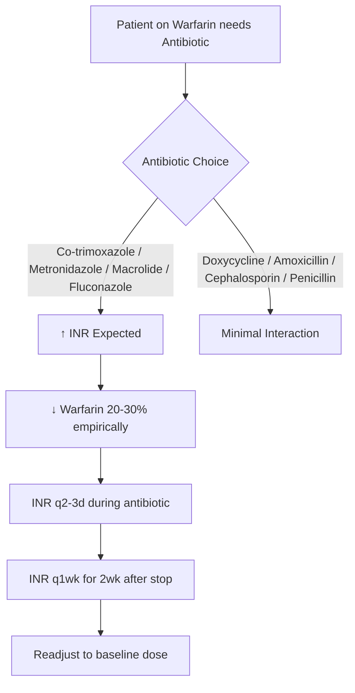
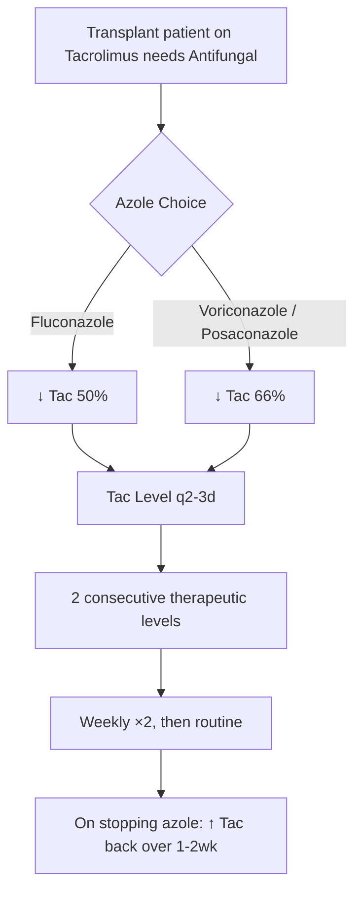

# CYP450 Drug Interactions — Inhibition & Induction

> [!tip] **FCPS/MRCP Priority: HIGHEST**
> **The single most examinable drug interaction topic.** Memorise the CYP table, key substrate/inhibitor/inducer triads, and management algorithms for Warfarin, DOACs, Immunosuppressants, Statins, Clopidogrel.
> Viva classic: *"Mechanism of clarithromycin-warfarin interaction? Management?"*

---

## 1. Learning Objectives
By the end of this note you should be able to:
- [ ] Recite **CYP450 isoform table** (Substrates, Inhibitors, Inducers) for 1A2, 2C9, 2C19, 2D6, 3A4/5
- [ ] Predict **direction of interaction** (↑ Substrate level → Toxicity; ↓ Substrate level → Therapeutic failure)
- [ ] Apply **management algorithms** for Warfarin, DOACs, Tacrolimus/Ciclosporin, Statins, Clopidogrel
- [ ] Identify **P-gp interactions** and dual CYP3A4/P-gp inhibition
- [ ] Distinguish **reversible vs mechanism-based (irreversible) inhibition**

---

## 2. CYP450 Quick Reference Table (EXAM ESSENTIAL)

```mermaid
flowchart LR
    subgraph CYP1A2
        S1[Theophylline<br/>Clozapine<br/>Olanzapine<br/>Duloxetine<br/>Tizanidine]
        I1[Fluvoxamine +++<br/>Ciprofloxacin<br/>Enoxacin]
        N1[Smoking +++<br/>Omeprazole<br/>Insulin]
    end
    
    subgraph CYP2C9
        S2[Warfarin (S-) +++<br/>Phenytoin<br/>Glipizide<br/>Losartan<br/>Ibuprofen<br/>Celecoxib]
        I2[Fluconazole +++<br/>Amiodarone<br/>Metronidazole<br/>Trimethoprim<br/>Sulfamethoxazole]
        N2[Rifampicin +++<br/>Carbamazepine<br/>Phenytoin<br/>St John's Wort]
    end
    
    subgraph CYP2C19
        S3[Clopidogrel (activation)+++<br/>PPIs<br/>Citalopram<br/>Diazepam<br/>Voriconazole]
        I3[Omeprazole/Esomeprazole +++<br/>Fluoxetine<br/>Fluvoxamine<br/>Voriconazole]
        N3[Rifampicin +++<br/>Carbamazepine<br/>St John's Wort]
    end
    
    subgraph CYP2D6
        S4[Codeine→Morphine+++<br/>Tramadol<br/>TCAs<br/>Beta-blockers<br/>Flecainide<br/>Atomoxetine]
        I4[Paroxetine +++<br/>Fluoxetine<br/>Quinidine<br/>Bupropion<br/>Duloxetine]
        N4[No major inducers]
    end
    
    subgraph CYP3A4/5
        S5[>50% drugs:<br/>Statins (Simva, Atorva)<br/>CCBs<br/>Tacrolimus/Ciclosporin<br/>DOACs (Riva/Apix)<br/>Midazolam<br/>ED drugs<br/>Steroids]
        I5[Clarithromycin +++<br/>Erythromycin<br/>Ketoconazole<br/>Itraconazole<br/>Ritonavir/Cobicistat<br/>Grapefruit<br/>Verapamil/Diltiazem<br/>Amiodarone]
        N5[Rifampicin +++<br/>Carbamazepine<br/>Phenytoin<br/>Phenobarbital<br/>St John's Wort<br/>Bosentan<br/>Modafinil]
    end
```

### CYP450 Isoform Summary Table

| Isoform | % Drugs Metabolised | Key Substrates (Exam) | Strong Inhibitors | Strong Inducers | Genetic Polymorphism |
|---------|---------------------|----------------------|-------------------|-----------------|---------------------|
| **1A2** | ~5% | Theophylline, Clozapine, Olanzapine, Duloxetine, Tizanidine | **Fluvoxamine**, Ciprofloxacin | **Smoking**, Omeprazole | *CYP1A2* variants |
| **2C9** | ~15% | **Warfarin (S-)**, Phenytoin, Glipizide, Losartan, NSAIDs | **Fluconazole**, Amiodarone, Metronidazole, TMP-SMX | **Rifampicin**, Carbamazepine, Phenytoin | ***CYP2C9*2/*3** → ↓ Warfarin dose |
| **2C19** | ~10% | **Clopidogrel**, PPIs, Citalopram, Diazepam, Voriconazole | **Omeprazole/Esomeprazole**, Fluoxetine, Fluvoxamine | **Rifampicin**, Carbamazepine, SJW | ***CYP2C19*2/*3** (PM) → ↓ Clopidogrel activation |
| **2D6** | ~20% | **Codeine**, Tramadol, TCAs, β-blockers, Flecainide, Atomoxetine | **Paroxetine**, Fluoxetine, Quinidine, Bupropion | **None** | ***CYP2D6*4/*5** (PM) → No codeine→morphine |
| **3A4/5** | **>50%** | Statins, CCBs, **Tacrolimus**, **Ciclosporin**, DOACs, Midazolam, Steroids | **Clarithromycin**, **Erythromycin**, **Azoles**, **Ritonavir**, **Grapefruit**, Verapamil, Diltiazem | **Rifampicin**, **Carbamazepine**, **Phenytoin**, **Phenobarbital**, **SJW** | *CYP3A5* expressor vs non-expressor |

---

## 3. Interaction Mechanisms

### Reversible Inhibition
- **Competitive:** Inhibitor competes for active site (Most CYP inhibitors)
- **Non-competitive:** Binds allosteric site
- **Onset:** Rapid (hours); **Offset:** Rapid (hours-days after stopping inhibitor)

### Mechanism-Based / Irreversible Inhibition (Time-Dependent)
- **Metabolic-intermediate complex** formation → Heme destruction
- **Drugs:** **Erythromycin, Clarithromycin, Verapamil, Diltiazem, Paroxetine, Fluoxetine, Ritonavir, Azoles**
- **Onset:** Days (requires new enzyme synthesis); **Offset:** Days-weeks (enzyme turnover)
- **Clinical:** More pronounced, longer-lasting interaction

### Induction
- **Transcriptional activation** via **PXR (Pregnane X Receptor)** / **CAR (Constitutive Androstane Receptor)**
- **Onset:** 3-7 days (max 2-3 weeks); **Offset:** 1-3 weeks after stopping
- **Key Inducers:** **Rifampicin (Universal, +++), Carbamazepine, Phenytoin, Phenobarbital, St John's Wort, Bosentan, Modafinil**

### P-glycoprotein (P-gp / ABCB1)
- **Efflux transporter:** Intestine (↓ absorption), Liver (↑ biliary excretion), Kidney (↑ tubular excretion), BBB (↓ CNS penetration)
- **Substrates:** **Digoxin, DOACs, Tacrolimus, Ciclosporin, Colchicine, Fexofenadine**
- **Inhibitors:** Clarithromycin, Verapamil, Quinidine, Amiodarone, Ciclosporin, Ritonavir
- **Inducers:** Rifampicin, St John's Wort, Carbamazepine
- **Dual CYP3A4 + P-gp substrates:** Most CYP3A4 substrates (DOACs, Immunosuppressants, Statins)

---

## 4. High-Yield Interaction Management Algorithms

### Warfarin + CYP2C9/3A4 Interactions

| Interacting Drug | Effect | Mechanism | Time to Peak | Management |
|------------------|--------|-----------|--------------|------------|
| **Co-trimoxazole** | ↑↑ INR | CYP2C9 inhibition + Vit K reduction | 3-5 days | ↓ Warfarin 20-30%, **INR q2d** |
| **Metronidazole** | ↑↑ INR | CYP2C9 inhibition | 3-5 days | ↓ Warfarin 20-30%, **INR q2d** |
| **Clarithromycin** | ↑↑ INR | CYP3A4 inhibition (R-warfarin) | 3-5 days | ↓ Warfarin 20-30%, **INR q2d** |
| **Fluconazole** | ↑↑ INR | CYP2C9/3A4 inhibition | 3-5 days | ↓ Warfarin **30-50%**, **INR q2d** |
| **Amiodarone** | ↑↑ INR (Delayed) | CYP2C9 inhibition + Displacement | **1-2 weeks** | ↓ Warfarin **30-50%**, **INR q3d ×2wk then weekly** |
| **Rifampicin** | ↓↓ INR | CYP2C9/3A4 induction | 5-7 days | ↑ Warfarin **2-3x**, **Bridge LMWH**, **INR q2d** |

**Warfarin Interaction Pearl:** **S-warfarin = CYP2C9**; **R-warfarin = CYP3A4/1A2/2C19** — Inhibitors of any ↑ INR; Rifampicin induces all → ↓↓ INR.

---

### DOAC + CYP3A4/P-gp Interactions

| DOAC | Strong Dual Inhibitor (Contraindicated) | Moderate Inhibitor (Dose Reduce) | Strong Inducer (Avoid) |
|------|----------------------------------------|----------------------------------|------------------------|
| **Dabigatran** | **Azoles, HIV PIs, Clarithro** | Avoid if CrCl<50 | **Rifampicin, Carbamazepine, Phenytoin, SJW** |
| **Rivaroxaban** | **Azoles, HIV PIs, Clarithro** | **15mg OD (AF) / 10mg OD (VTE)** | **Rifampicin, Carbamazepine, Phenytoin, SJW** |
| **Apixaban** | **Azoles, HIV PIs, Clarithro** | **2.5mg BD** | **Rifampicin, Carbamazepine, Phenytoin, SJW** |
| **Edoxaban** | **Azoles, HIV PIs, Clarithro** | **30mg OD** | **Rifampicin, Carbamazepine, Phenytoin, SJW** |

**Management Rules:**
- **Strong dual inhibitor (Azole/HIV PI/Clarithro):** **CONTRAINDICATED** for all DOACs → Switch to Warfarin
- **Moderate inhibitor (Diltiazem, Verapamil, Amiodarone, Erythro, Azithro):** Dose reduce per table
- **Strong inducer:** **AVOID** all DOACs → Switch to Warfarin
- **No routine monitoring** — Renal function & clinical review

---

### Tacrolimus / Ciclosporin / Sirolimus / Everolimus + CYP3A4/P-gp Interactions

| Inhibitor | Tacrolimus | Ciclosporin | Sirolimus/Everolimus |
|-----------|------------|-------------|----------------------|
| **Fluconazole** | **Reduce 50%** | **Reduce 50%** | **Reduce 66%** (Everolimus 90%) |
| **Voriconazole** | **Reduce 66%** | **Reduce 66%** | **Reduce 80-90%** |
| **Posaconazole** | **Reduce 66%** | **Reduce 66%** | **Reduce 80-90%** |
| **Clarithromycin** | **Reduce 50-66%** | **Reduce 50-66%** | **Reduce 80-90%** |
| **Diltiazem/Verapamil** | **Reduce 50%** | **Reduce 50%** | **Reduce 66%** |
| **Amiodarone** | **Reduce 50%** | **Reduce 50%** | **Reduce 66%** |
| **Rifampicin (Inducer)** | **Avoid / ↑ Dose 3-5x** | **Avoid / ↑ Dose 3-5x** | **Avoid / ↑ Dose 3-5x** |
| **Carbamazepine/Phenytoin** | **Avoid / ↑ Dose 3-5x** | **Avoid / ↑ Dose 3-5x** | **Avoid / ↑ Dose 3-5x** |

**Monitoring Protocol on Starting Inhibitor:**
1. **Pre-emptive dose reduction** (As above) on Day 1 of inhibitor
2. **Level q2-3d** until stable (2 consecutive therapeutic levels)
3. **Then weekly ×2**, then routine
4. **On stopping inhibitor:** Reverse dose reduction over 1-2 weeks; Monitor levels q2-3d

---

### Simvastatin / Atorvastatin + CYP3A4 Interactions

| Interacting Drug | Simvastatin Max Dose | Atorvastatin Max Dose | Action |
|------------------|---------------------|----------------------|--------|
| **Clarithromycin / Erythromycin / Azoles / HIV PIs** | **CONTRAINDICATED** (or ≤10mg) | ≤20mg | **Switch to Rosuvastatin/Pravastatin** |
| **Diltiazem / Verapamil / Amiodarone** | **≤10mg** | ≤40mg | Dose limit; Monitor CK |
| **Grapefruit juice (>1L/day)** | Avoid | Caution | Counsel patient |
| **Fibrates (Gemfibrozil)** | Avoid (↑ Myopathy) | Caution | Avoid combo; If needed → Fenofibrate + Rosuvastatin |

**Statin Interaction Pearl:** **Rosuvastatin & Pravastatin** = Minimal CYP3A4 metabolism → **Preferred with CYP3A4 inhibitors**

---

### Clopidogrel + PPI Interaction

| PPI | CYP2C19 Inhibition | Clopidogrel Effect | Recommendation |
|-----|-------------------|-------------------|----------------|
| **Omeprazole / Esomeprazole** | **Strong** | ↓ Active metabolite → ↓ Antiplatelet effect | **AVOID** (MHRA/FDA warning) |
| **Lansoprazole** | Moderate | Possible ↓ effect | Avoid if possible |
| **Pantoprazole / Rabeprazole** | **Weak/Minimal** | **No significant interaction** | **PREFERRED** |
| **H2 Blockers (Ranitidine, Famotidine)** | None | None | **Safe alternative** |

**Mechanism:** Clopidogrel = Prodrug → **CYP2C19** (major) → Active metabolite → Irreversible P2Y12 blockade. Omeprazole inhibits CYP2C19 → ↓ Active metabolite.

---

## 5. Clinical Decision-Making Flowcharts

### Warfarin + Antibiotic Prescribing


### Immunosuppressant + Azole


---

## 6. FCPS/MRCP High-Yield Summary

| Interaction Pair | Mechanism | Clinical Effect | Management |
|------------------|-----------|-----------------|------------|
| **Warfarin + Co-trimoxazole** | CYP2C9 inhibition | ↑ INR → Bleeding | ↓ Warfarin 20-30%, INR q2d |
| **Warfarin + Amiodarone** | CYP2C9 inhib + Displacement | ↑ INR (Delayed 1-2wk) | ↓ Warfarin 30-50%, INR q3d×2wk |
| **Warfarin + Rifampicin** | CYP2C9/3A4 induction | ↓ INR → Thrombosis | ↑ Warfarin 2-3x, **Bridge LMWH**, INR q2d |
| **DOAC + Clarithromycin** | Dual CYP3A4/P-gp inhibition | ↑ DOAC → Bleeding | **CONTRAINDICATED** → Switch to Warfarin |
| **DOAC + Diltiazem/Verapamil** | Moderate CYP3A4/P-gp inhibition | ↑ DOAC | **Dose reduce** (Riva 15/10, Apixa 2.5, Edoxa 30) |
| **DOAC + Rifampicin** | CYP3A4/P-gp induction | ↓ DOAC → Thrombosis | **AVOID** → Warfarin |
| **Tacrolimus + Fluconazole** | CYP3A4/P-gp inhibition | ↑ Tac → Nephrotoxicity | **↓ Tac 50%**, Level q2-3d |
| **Tacrolimus + Voriconazole** | Strong CYP3A4/P-gp inhibition | ↑↑ Tac | **↓ Tac 66%**, Level q2-3d |
| **Tacrolimus + Rifampicin** | CYP3A4/P-gp induction | ↓ Tac → Rejection | **AVOID** / ↑ Tac 3-5x, Level q2-3d |
| **Simvastatin + Clarithromycin** | CYP3A4 inhibition | ↑ Simva → Rhabdo | **Contraindicated** → Rosuvastatin/Pravastatin |
| **Clopidogrel + Omeprazole** | CYP2C19 inhibition | ↓ Antiplatelet → Stent thrombosis | **Avoid omeprazole** → Pantoprazole/Rabeprazole/H2RA |
| **Codeine + Paroxetine** | CYP2D6 inhibition | ↓ Morphine formation → ↓ Analgesia | **Avoid** → Morphine/Oxycodone |
| **Theophylline + Ciprofloxacin** | CYP1A2 inhibition | ↑ Theophylline → Seizures/Arrhythmia | **↓ Theophylline dose**, Level monitoring |

---

## 7. Viva Questions (MRCP PACES / FCPS)

| Question | Expected Answer |
|----------|-----------------|
| **Patient on warfarin (INR 2.5) prescribed clarithromycin for pneumonia. What happens? What do you do?** | Clarithromycin inhibits CYP3A4 (R-warfarin) → ↑ INR in 3-5 days. **Reduce warfarin 20-30%, Monitor INR q2-3d during antibiotic, q1wk for 2wk after stop.** |
| **Patient on rivaroxaban 20mg OD for AF needs fluconazole for candidemia. Management?** | Fluconazole = Strong dual CYP3A4/P-gp inhibitor → **CONTRAINDICATED with rivaroxaban**. Switch to **Warfarin** (with LMWH bridge) for duration of fluconazole. |
| **Renal transplant on tacrolimus prescribed voriconazole for aspergillosis. Dose adjustment?** | **Reduce tacrolimus 66%** (e.g., 4mg BD → 1.5mg BD). Check tac level q2-3d until stable (2 consecutive therapeutic), then weekly ×2. |
| **Patient on simvastatin 40mg needs clarithromycin. What do you do?** | Simvastatin + strong CYP3A4 inhibitor = **Contraindicated (Rhabdo risk)**. **Switch to Rosuvastatin 10-20mg or Pravastatin 40mg** (minimal CYP3A4). |
| **Clopidogrel + Omeprazole interaction. Mechanism? Alternative?** | Omeprazole inhibits **CYP2C19** → ↓ Conversion of clopidogrel to active metabolite → ↓ Antiplatelet effect. **Use Pantoprazole/Rabeprazole or H2 blocker.** |
| **Codeine + Fluoxetine. Why reduced analgesia?** | Fluoxetine inhibits **CYP2D6** → ↓ Conversion of codeine → morphine. **Switch to morphine/oxycodone** (not CYP2D6 dependent). |
| **Theophylline + Ciprofloxacin. Risk? Monitoring?** | Ciprofloxacin inhibits **CYP1A2** → ↑ Theophylline levels → **Seizures, Arrhythmias, Nausea**. **Reduce theophylline dose, Check theophylline level, Monitor for toxicity.** |

---

## 8. Confusions & Mnemonics

| Confusion | Clarification |
|-----------|---------------|
| **Warfarin S- vs R-enantiomer** | **S-warfarin (Active) = CYP2C9**; **R-warfarin = CYP3A4/1A2/2C19** — Inhibitors of ANY ↑ INR; Rifampicin induces ALL → ↓ INR |
| **DOAC + Moderate inhibitor** | Only **Rivaroxaban, Apixaban, Edoxaban** have dose reduction; **Dabigatran = Avoid if CrCl<50 with moderate inhibitor** |
| **Tacrolimus vs Ciclosporin dose reduction** | Both CYP3A4/P-gp substrates; Similar reduction percentages; **Tacrolimus more potent, narrower TI** |
| **Clopidogrel + PPI — all PPIs?** | **Only Omeprazole/Esomeprazole** (Strong CYP2C19 inhibition); **Pantoprazole/Rabeprazole = Safe** |
| **Reversible vs Irreversible inhibition** | Reversible = Rapid onset/offset (most); **Irreversible (MBI) = Erythromycin, Clarithromycin, Verapamil, Diltiazem, Paroxetine, Fluoxetine, Ritonavir, Azoles** — Days onset/offset |
| **CYP3A5 expressors** | **Tacrolimus/Ciclosporin:** CYP3A5 expressors (*1/*1) need **higher doses**; Non-expressors (*3/*3) need lower doses |

**Mnemonic: CYPs-INHIBITORS**
- **1**A2: **Fluvoxamine**, Ciprofloxacin
- **2**C9: **Fluconazole**, Amiodarone, Metronidazole, TMP-SMX
- **2**C19: **Omeprazole/Esomeprazole**, Fluoxetine, Fluvoxamine
- **2**D6: **Paroxetine**, Fluoxetine, Quinidine, Bupropion
- **3**A4: **Clarithromycin**, **Erythromycin**, **Ketoconazole**, **Itraconazole**, **Ritonavir**, **Grapefruit**, Verapamil, Diltiazem

**Mnemonic: CYPs-INDUCERS**
- **R**ifampicin (**Universal +++**)
- **C**arbamazepine
- **P**henytoin
- **P**henobarbital
- **S**t **J**ohn's **W**ort
- **B**osentan
- **M**odafinil

---

## 9. Mind Map

```mermaid
mindmap
  root((CYP450 Interactions))
    Isoforms
      1A2: Theophylline, Clozapine | Fluvoxamine, Cipro | Smoking
      2C9: Warfarin(S), Phenytoin | Fluconazole, Amiodarone, Metro | Rifampicin, CBZ, Phenytoin
      2C19: Clopidogrel, PPIs | Omeprazole, Fluoxetine | Rifampicin, CBZ, SJW
      2D6: Codeine, Tramadol, TCAs | Paroxetine, Fluoxetine | None
      3A4/5: >50% drugs | Clarithro, Erythro, Azoles, Ritonavir, Grapefruit | Rifampicin, CBZ, Phenytoin, SJW
    Mechanisms
      Reversible (Rapid)
      Irreversible/MBI (Days-weeks)
      Induction (PXR/CAR, 2-3wks)
    P-gp
      Substrates: Digoxin, DOACs, Tacro, Ciclo, Colchicine
      Inhibitors: Clarithro, Verapamil, Amiodarone, Ritonavir
      Inducers: Rifampicin, SJW, CBZ
    High-Yield Combos
      Warfarin + Abx/Amio/Rifampicin
      DOAC + Azole/HIV PI/Clarithro
      Tacro/Ciclo + Azole/Clarithro/Rifampicin
      Simva/Atorva + CYP3A4 Inhib
      Clopidogrel + Omeprazole
      Codeine + Paroxetine
      Theophylline + Cipro
```

---

## 10. Spaced Repetition Trackers

| Review Interval | Date Completed | Confidence (1-5) | Notes |
|-----------------|----------------|------------------|-------|
| 24 hours | | | |
| 7 days | | | |
| 15 days | | | |
| 30 days | | | |
| 90 days | | | |

---

## 11. Self-Test Scorecard

| Section | Score /5 | Last Attempt |
|---------|----------|--------------|
| CYP450 Table (Sub/Inh/Ind) | | |
| Warfarin Interaction Mgmt | | |
| DOAC Interaction Mgmt | | |
| Immunosuppressant Mgmt | | |
| Statin Interaction Mgmt | | |
| Clopidogrel + PPI | | |
| P-gp Interactions | | |

---

## 12. Exam Answer Modes

### Long Answer Skeleton
1. Identify interacting drugs, CYP isoform(s), mechanism (inhibition/induction)
2. Predict direction (↑ Substrate = Toxicity; ↓ Substrate = Failure)
3. Cite specific management (Dose adjustment, Monitoring, Alternative)
4. Mention monitoring parameters & frequency

### Short Note Skeleton
- **CYP Table:** 1A2(Fluvox,Cipro|Smoke), 2C9(Warfarin|Flucon,Amio|Rif), 2C19(Clopi|Omep|Rif), 2D6(Codeine|Parox|None), 3A4(>50%|Clari,Azoles,Rito|Rif,CBZ,Pheno,SJW)
- **Warfarin:** Co-trimox/Metro/Macro/Flucon → ↓Warf 20-30%, INR q2d; Amio → ↓30-50%, INR q3d×2w; Rif → ↑2-3x, Bridge LMWH
- **DOAC:** Strong dual inhib = Contraindicated; Mod inhib = Dose reduce; Inducer = Avoid
- **Tacro:** Flucon ↓50%, Vori/Posa ↓66%, Clari ↓50-66%, Rif Avoid/↑3-5x; Level q2-3d
- **Statin:** Simva/Atorva + CYP3A4 inhib → Switch Rosuva/Prava
- **Clopidogrel:** Omeprazole bad → Pantoprazole/Rabeprazole/H2RA

### Viva One-Liners
- "CYP3A4 does >50% drugs; Rifampicin induces everything; Clarithromycin inhibits 3A4 strongly"
- "Warfarin: S=2C9, R=3A4/1A2; Any inhibitor → ↑INR; Rifampicin → ↓INR → Bridge LMWH"
- "DOAC + Azole/Clarithro/HIV PI = CONTRAINDICATED → Warfarin"
- "Tacrolimus + Voriconazole = ↓66% dose, level q2-3d"
- "Clopidogrel + Omeprazole = CYP2C19 inhibition → ↓Active metabolite → Pantoprazole instead"

### Ward-Case Discussion Points
- New prescription: **Always check CYP interactions** (Warfarin, DOAC, Tacrolimus, Statin, Clopidogrel, Theophylline)
- Antibiotic prescribing in anticoagulated patient: **Avoid Macrolides/Fluoroquinolones/Co-trimoxazole/Metronidazole/Azoles if possible** → Use Doxycycline/Amoxicillin/Cephalosporin
- Transplant patient + any new drug: **Check Tacrolimus/Ciclosporin interaction first**
- Statin + new CYP3A4 inhibitor: **Switch to Rosuvastatin/Pravastatin**

### Last-Night-Before-Exam Sheet
- **1A2:** Theoph/Cloz | Fluvox/Cipro | Smoke
- **2C9:** Warf(S) | Flucon/Amio/Metro/TMP-SMX | Rif/CBZ/Pheno
- **2C19:** Clopi | Omep/Esomep/Fluox | Rif/CBZ/SJW
- **2D6:** Codeine/Tramadol | Parox/Fluox/Quinidine | None
- **3A4:** >50% (Statins, Tacro, DOACs) | Clari/Eryth/Azoles/Rito/Grapefruit | Rif/CBZ/Pheno/SJW
- **Warfarin:** Abx/Amio → ↓Warf 20-50%, INR q2-3d; Rif → ↑2-3x, Bridge LMWH
- **DOAC:** Strong dual inhib = CONTRA; Mod = Dose↓; Inducer = AVOID
- **Tacro:** Flucon ↓50%, Vori/Posa ↓66%, Clari ↓66%, Rif AVOID; Level q2-3d
- **Simva/Atorva + CYP3A4 inhib:** Switch Rosuva/Prava
- **Clopidogrel + Omep/Esomep:** AVOID → Pantoprazole/Rabeprazole/H2RA

---

## 13. Summary
CYP450 interactions are **the highest-yield drug interaction topic** for FCPS/MRCP. **CYP3A4** metabolises >50% drugs (Statins, Tacrolimus, Ciclosporin, DOACs, CCBs). **Rifampicin** is the universal inducer; **Clarithromycin, Azoles, Ritonavir** are strong 3A4 inhibitors. **Warfarin** S-enantiomer = CYP2C9; R-enantiomer = CYP3A4/1A2/2C19. **DOACs** contraindicated with strong dual CYP3A4/P-gp inhibitors; dose reduce with moderate. **Tacrolimus/Ciclosporin** require 50-66% dose reduction with azoles/macrolides; avoid inducers. **Simvastatin/Atorvastatin** + strong 3A4 inhibitors → Switch to Rosuvastatin/Pravastatin. **Clopidogrel + Omeprazole/Esomeprazole** → Avoid (CYP2C19 inhibition).

---

## 14. MCQs (10)
1. **Which CYP isoform metabolises >50% of drugs?**
   A. CYP2C9  B. CYP2D6  C. **CYP3A4/5**  D. CYP1A2
2. **S-warfarin is metabolised by:**
   A. CYP3A4  B. **CYP2C9**  C. CYP2C19  D. CYP1A2
3. **Strong dual CYP3A4/P-gp inhibitor — DOAC contraindicated:**
   A. Diltiazem  B. Verapamil  C. **Clarithromycin**  D. Amiodarone
4. **Tacrolimus + Voriconazole — dose reduction:**
   A. 25%  B. 50%  C. **66%**  D. 80%
5. **Clopidogrel + Omeprazole — mechanism:**
   A. CYP3A4 inhibition  B. **CYP2C19 inhibition**  C. P-gp inhibition  D. Protein binding displacement
6. **Simvastatin + Clarithromycin — management:**
   A. Reduce simvastatin to 10mg  B. **Switch to Rosuvastatin/Pravastatin**  C. Monitor CK only  D. No action needed
7. **Codeine + Paroxetine — effect:**
   A. ↑ Analgesia  B. **↓ Analgesia (↓ Morphine formation)**  C. ↑ Toxicity  D. No interaction
8. **Rifampicin effect on DOACs:**
   A. ↑ Levels  B. **↓ Levels → Thrombosis risk**  C. No effect  D. ↑ Bleeding risk
9. **Which PPI is SAFE with clopidogrel?**
   A. Omeprazole  B. Esomeprazole  C. **Pantoprazole**  D. Lansoprazole
10. **Theophylline + Ciprofloxacin — risk:**
    A. ↓ Theophylline  B. **↑ Theophylline → Seizures/Arrhythmia**  C. No interaction  D. ↑ Ciprofloxacin toxicity

---

## 15. SBA Questions (10)
1. **70M on warfarin (INR 2.3) prescribed clarithromycin for CAP. Next INR check?**
   A. 1 week  B. **2-3 days**  C. 2 weeks  D. No extra monitoring
2. **Renal transplant on tacrolimus 3mg BD started on fluconazole. New tac dose?**
   A. 3mg BD  B. **1.5mg BD (50% reduction)**  C. 1mg BD  D. 2mg BD
3. **AF on rivaroxaban 20mg OD needs fluconazole for oesophageal candidiasis. Management?**
   A. Continue rivaroxaban, monitor renal  B. **Switch to Warfarin + LMWH bridge**  C. Reduce rivaroxaban to 15mg  D. Hold rivaroxaban during fluconazole
4. **Patient on simvastatin 40mg started on diltiazem for HTN. Max simvastatin dose?**
   A. 40mg  B. 20mg  C. **10mg**  D. Contraindicated
5. **Clopidogrel + Omeprazole — which trial showed increased CV events?**
   A. PLATO  B. **TRITON-TIMI 38 / COGENT**  C. CURE  D. CHARISMA
6. **Transplant on tacrolimus started on rifampicin for TB. Tacrolimus dose?**
   A. Reduce 50%  B. **Avoid / Increase 3-5x with level monitoring**  C. No change  D. Switch to ciclosporin
7. **Codeine 30mg QDS + Fluoxetine 20mg. Patient reports poor pain relief. Reason?**
   A. Fluoxetine ↑ Codeine metabolism  B. **Fluoxetine inhibits CYP2D6 → ↓ Morphine**  C. Fluoxetine displaces codeine  D. Codeine ↓ Fluoxetine effect
8. **Which statin has MINIMAL CYP3A4 metabolism?**
   A. Simvastatin  B. Atorvastatin  C. **Rosuvastatin**  D. Lovastatin
9. **Warfarin + Amiodarone — INR peak effect timing?**
   A. 24 hours  B. 3-5 days  C. **1-2 weeks**  D. 4 weeks
10. **Patient on apixaban 5mg BD started on carbamazepine for seizures. Management?**
    A. Continue apixaban, monitor renal  B. Increase apixaban  C. **Switch to Warfarin**  D. Reduce apixaban to 2.5mg BD

---

## 16. Flashcards
- Q: **CYP3A4 substrates (exam list)?**
  A: Statins (Simva, Atorva), CCBs, **Tacrolimus, Ciclosporin, DOACs (Riva, Apix), Midazolam, ED drugs, Steroids**
- Q: **Rifampicin = Universal inducer of?**
  A: **CYP1A2, 2C9, 2C19, 2D6 (weak), 3A4, P-gp, UGT** — Essentially everything
- Q: **Warfarin enantiomers?**
  A: **S-warfarin = CYP2C9 (Active); R-warfarin = CYP3A4/1A2/2C19**
- Q: **DOAC + Strong dual inhibitor = ?**
  A: **CONTRAINDICATED → Warfarin**
- Q: **Tacrolimus + Fluconazole dose adjust?**
  A: **↓50%, Level q2-3d**
- Q: **Clopidogrel + Omeprazole = ?**
  A: **CYP2C19 inhibition → ↓Active metabolite → Pantoprazole/H2RA**
- Q: **Simvastatin + CYP3A4 inhibitor = ?**
  A: **Switch to Rosuvastatin/Pravastatin**
- Q: **Codeine + CYP2D6 inhibitor = ?**
  A: **↓Morphine → ↓Analgesia → Morphine/Oxycodone**

---

## 17. Answer Key with Explanations

### MCQs
1. **C** — CYP3A4/5 metabolises >50% of clinically used drugs
2. **B** — S-warfarin (active) = CYP2C9; R-warfarin = CYP3A4/1A2/2C19
3. **C** — Clarithromycin = Strong CYP3A4 + P-gp inhibitor (Contraindicated with DOACs); Diltiazem/Verapamil/Amiodarone = Moderate
4. **C** — Voriconazole/Posaconazole = Strong CYP3A4/P-gp inhibition → Tacrolimus ↓66-80%
5. **B** — Clopidogrel requires CYP2C19 for activation; Omeprazole inhibits CYP2C19
6. **B** — Simvastatin + Strong CYP3A4 inhibitor = Contraindicated/Rhabdo risk → Switch to Rosuvastatin/Pravastatin
7. **B** — Paroxetine inhibits CYP2D6 → ↓ Codeine→Morphine conversion → ↓ Analgesia
8. **B** — Rifampicin induces CYP3A4/P-gp → ↓ DOAC levels → Thrombosis risk → AVOID
9. **C** — Pantoprazole/Rabeprazole = Weak CYP2C19 inhibition → Safe with Clopidogrel
10. **B** — Ciprofloxacin inhibits CYP1A2 → ↑ Theophylline → Seizures, Arrhythmia, Nausea

### SBAs
1. **B** — INR rises in 3-5 days with CYP inhibitors → Monitor q2-3d
2. **B** — Fluconazole = Moderate CYP3A4/P-gp inhibitor → Tacrolimus ↓50%, Level q2-3d
3. **B** — Fluconazole = Strong dual CYP3A4/P-gp inhibitor → **CONTRAINDICATED with all DOACs** → Switch to Warfarin
4. **C** — Diltiazem = Moderate CYP3A4 inhibitor → Simvastatin max **10mg** (or switch to Rosuvastatin)
5. **B** — TRITON-TIMI 38 / COGENT showed ↑ CV events with Clopidogrel + PPI (Omeprazole)
6. **B** — Rifampicin = Strong inducer → ↓ Tacrolimus → Rejection risk; Avoid or ↑ dose 3-5x with close level monitoring
7. **B** — Fluoxetine inhibits CYP2D6 → ↓ Codeine→Morphine → ↓ Analgesia
8. **C** — Rosuvastatin = Minimal CYP3A4 metabolism (BCRP/OATP substrate) → Preferred with CYP3A4 inhibitors
9. **C** — Amiodarone = CYP2C9 inhibition + Displacement → Delayed peak INR effect at **1-2 weeks**
10. **C** — Carbamazepine = Strong CYP3A4/P-gp inducer → ↓ Apixaban levels → **AVOID** → Switch to Warfarin

---

## 18. Local Navigation
- **Parent Heading**: [[Drug Interactions|Drug Interactions]]
- **Chapter Map**: [[Davidson Chapter 2 - Clinical Therapeutics Hierarchy|Chapter 2 Hierarchy]]
- **Chapter MOC**: [[Clinical Therapeutics and Good Prescribing MOC]]
- **Related**: [[Pharmacokinetic Interactions]], [[Pharmacodynamic Interactions]], [[Warfarin Interactions]], [[DOAC Interactions]], [[Immunosuppressant Interactions]], [[QT Prolongation]], [[Clinical Contexts/Pain management|Opioid Interactions]], [[Special Populations/Renal impairment|Renal Drug Interactions]]
