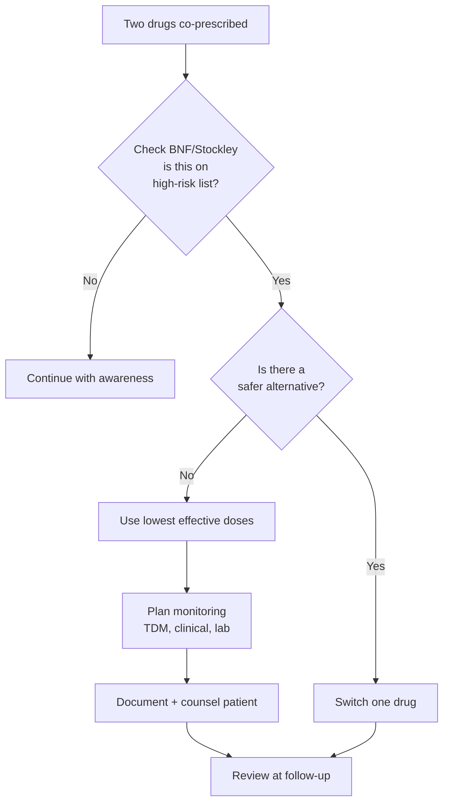
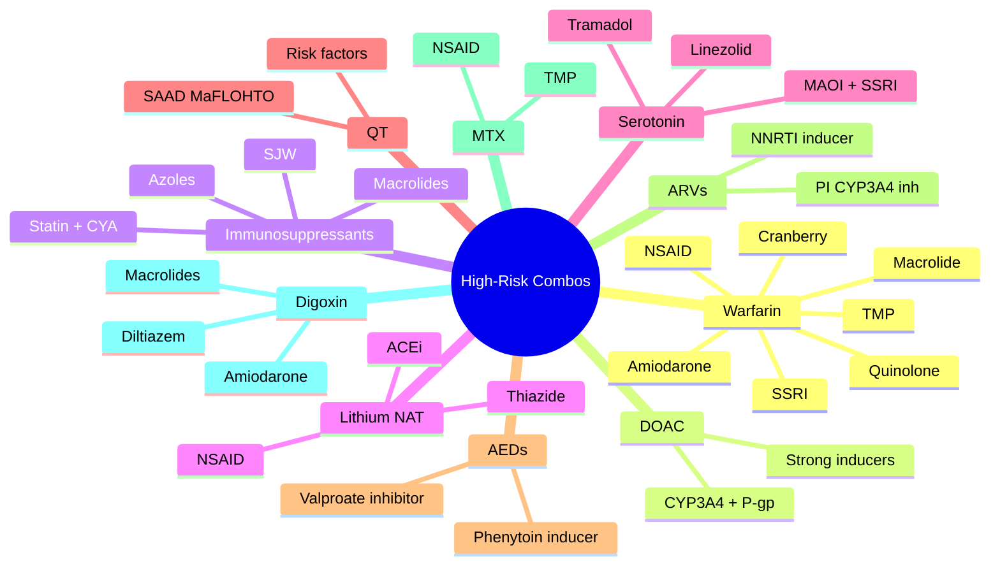

# High-Risk Drug Combinations

> [!info]
> **Disease-Level Topic** under **Drug Interactions → High-Risk Drug Combinations**.
> Davidson 24e Ch2 — "Drug Interactions and Polypharmacy" (Maxwell SRJ).

## 1. Learning Objectives
- [ ] List the **highest-risk drug combinations** encountered in clinical practice
- [ ] Apply **management strategies** for each combination
- [ ] Recognize **warfarin + NSAID/amiodarone** interactions
- [ ] Identify **immunosuppressant + azole/macrolide** interactions
- [ ] Discuss **lithium + NSAID/ACEi** toxicity
- [ ] Recognise **serotonin syndrome** (MAOI + SSRI)
- [ ] Identify **QT-prolonging combinations** (torsades risk)
- [ ] Apply **epilepsy drug interactions** (CYP450)
- [ ] Discuss **DOAC interactions** (P-gp, CYP3A4)

## 2. Definition: "High-Risk Combination"

A drug combination is **high-risk** when it:
- Causes **severe, life-threatening** outcome (e.g., bleed, AKI, serotonin syndrome, torsades)
- Has **narrow therapeutic index** in either drug
- Affects a **common prescription scenario** (high prevalence)
- Is often **preventable** with awareness

## 3. Mermaid Algorithm — Approach to High-Risk Combo

## 4. Comparison Tables

### 4.1 Warfarin Interactions (Mnemonic: "**WATCH OUT**")

| Drug/Food | Effect on INR | Mechanism |
|-----------|---------------|-----------|
| **W**arfarin (baseline) | 2.0-3.0 (or 2.5-3.5) | — |
| **A**miodarone | ↑ INR (1.5-2x) | CYP2C9/3A4 inhibition |
| **T**rimethoprim | ↑ INR | CYP2C9 inhibition |
| **C**iprofloxacin / macrolides | ↑ INR | CYP inhibition + gut flora ↓ |
| **H**eparin (added) | ↑ Bleed | Additive |
| **O**CP, **O**meprazole | Modest ↑ | CYP |
| **U**Seful (Vitamin K) | ↓ INR | Antidote (warfarin antagonist) |
| **T**hyroid (carbimazole, levothyroxine) | ↑/↓ | Affects clotting factors |

**Drugs that increase bleeding risk (not via INR):**
- NSAIDs (GI mucosal injury, antiplatelet)
- Antiplatelets (aspirin, clopidogrel, ticagrelor)
- SSRIs (↓ platelet serotonin)
- Corticosteroids (with NSAID = ulcer risk)

**Drugs that DECREASE warfarin effect (↓ INR):**
- Enzyme inducers: rifampicin, carbamazepine, phenytoin, St John's Wort
- Vitamin K-rich foods: leafy greens (kale, spinach, broccoli)
- OCP (estrogen ↑ clotting factors)
- Cholestyramine (↓ absorption)

### 4.2 DOAC (Direct Oral Anticoagulant) Interactions

| DOAC | Metabolism/Transport | Major Interactions | Effect |
|------|----------------------|---------------------|--------|
| **Apixaban** | CYP3A4 (minor), P-gp | Strong CYP3A4 + P-gp inhibitors (ketoconazole, ritonavir) | ↑ Apixaban (bleed) |
| | | Strong inducers (rifampicin, carbamazepine, phenytoin, SJW) | ↓ Apixaban (clot) |
| **Rivaroxaban** | CYP3A4, P-gp | Same as apixaban | ↑/↓ Levels |
| **Dabigatran** | P-gp (not CYP) | P-gp inhibitors (verapamil, amiodarone, quinidine, ketoconazole) | ↑ Dabigatran (bleed) |
| | | P-gp inducers (rifampicin, SJW) | ↓ Dabigatran (clot) |
| **Edoxaban** | P-gp (minimal CYP) | P-gp inhibitors (verapamil, quinidine, amiodarone, dronedarone) | ↑ Edoxaban |

**Key rule:** With strong dual CYP3A4+P-gp inhibitors (ketoconazole, ritonavir) → avoid apixaban/rivaroxaban. With strong inducers → avoid all DOACs (use warfarin).

### 4.3 Immunosuppressant (Ciclosporin, Tacrolimus) Interactions

| Drug | Effect on Level | Mechanism | Action |
|------|-----------------|-----------|--------|
| **CYP3A4 inhibitors (azole, macrolide, grapefruit, diltiazem, verapamil)** | ↑ Ciclosporin/tacrolimus | ↓ Metabolism | ↓ Dose 50-90%; TDM |
| **CYP3A4 inducers (rifampicin, carbamazepine, phenytoin, SJW)** | ↓ Levels | ↑ Metabolism | ↑ Dose; TDM; avoid SJW |
| **NSAIDs** | ↑ Nephrotoxicity | Renal | Monitor U&E; avoid in transplant |
| **Aminoglycosides** | ↑ Nephrotoxicity | Renal | Avoid; if needed, TDM |
| **Statins** | ↑ Myopathy (especially simvastatin + ciclosporin) | CYP3A4 | Use pravastatin/rosuvastatin |
| **Azathioprine + allopurinol** | ↑ AZA toxicity (myelosuppression) | Xanthine oxidase | Reduce AZA to 25% |

### 4.4 Lithium Interactions (Mnemonic: "**NAT**")

| Drug | Effect on Li | Mechanism |
|------|--------------|-----------|
| **N**SAIDs (esp. ibuprofen, diclofenac, indomethacin) | ↑ Li (1.5-2x) | ↓ Renal prostaglandins → ↓ Li clearance |
| **A**CEi / ARBs | ↑ Li (1.5-2x) | ↓ GFR + ↓ tubular Li excretion |
| **T**hiazides (and to lesser extent, loop) | ↑ Li (1.5-2x) | ↓ Li clearance (paradoxical) |

**Drugs that ↓ Li (less common):**
- Theophylline, caffeine, acetazolamide, NaHCO₃ (↑ Li clearance)
- Osmotic diuretics, sodium loading

**Lithium toxicity levels:**
- Therapeutic: 0.6-1.0 mmol/L (maintenance); 0.8-1.0 (acute mania)
- Mild toxicity: 1.0-1.5
- Moderate: 1.5-2.0
- Severe: >2.0 (>4.0 = life-threatening)

### 4.5 Serotonin Syndrome (Mnemonic: "**MAOI + any serotonergic = SS**")

| Trigger | Examples |
|---------|----------|
| **MAOI + SSRI** | Phenelzine + sertraline (washout 2 weeks each way; fluoxetine 5 weeks) |
| **MAOI + TCA** | Phenelzine + amitriptyline |
| **MAOI + tramadol / pethidine / fentanyl** | Severe SS |
| **MAOI + linezolid / methylene blue** | Linezolid is a reversible MAOI |
| **SSRI + tramadol / triptan / lithium** | Moderate risk |
| **SSRI + St John's Wort** | ↑ Risk |
| **SSRI + dextromethorphan** | "Triple C" abuse |
| **SSRI + buspirone / LSD** | ↑ Risk |

**Clinical features (Hunter Criteria):**
- Spontaneous clonus
- Inducible clonus + agitation/diaphoresis
- Ocular clonus + agitation/diaphoresis
- Tremor + hyperreflexia
- Hypertonia + temp >38°C + ocular/inducible clonus

**Management:** Stop drug, supportive, cyproheptadine (5-HT2A antagonist), dantrolene, cooling.

### 4.6 QT-Prolonging Combinations (Torsades Risk)

**Mnemonic: "**SAAD MaFLOHTO**" (Drugs that prolong QT)**

| Group | Examples |
|-------|----------|
| **S**otalol, **A**miodarone, **A**ntiarrhythmics (class Ia, III), **D**ofetilide | Antiarrhythmics |
| **M**acrolides (erythromycin, clarithromycin, azithromycin mild) | Antibiotics |
| **F**luoroquinolones (moxifloxacin highest) | Antibiotics |
| **L**amotrigine (some), lithium, levofloxacin | Misc |
| **O**ndansetron, **H**aloperidol, droperidol | Antiemetics/antipsychotics |
| **T**CAs, **M**ethadone, **Q**uinidine | Antidepressants/opioids |

**Risk factors for Torsades:**
- ≥2 QT-prolonging drugs
- Female sex (longer baseline QTc)
- Hypokalaemia, hypomagnesaemia
- Bradycardia
- Pre-existing long QT
- High drug level
- Family history of sudden death

**Rule:** Avoid ≥2 QT-prolonging drugs; if unavoidable, check ECG and electrolytes (K⁺, Mg²⁺).

### 4.7 Epilepsy Drug Interactions (AEDs)

| AED | Effect on Other AEDs | Key Interactions |
|-----|----------------------|------------------|
| **Phenytoin** | Strong inducer (1A2, 2C9, 2C19, 3A4) — ↓ OCP, warfarin, simvastatin, ciclosporin, many | Narrow TI; saturable kinetics |
| **Carbamazepine** | Strong inducer (1A2, 2C9, 2C19, 3A4) — ↓ many drugs | Induces own metabolism (auto-induction) |
| **Phenobarbital** | Strong inducer (1A2, 2C9, 2C19, 3A4) | ↓ OCP, warfarin, many |
| **Valproate** | Inhibitor (UGT1A4, 2C9) — ↑ lamotrigine, phenytoin | Pancreatitis, hepatotoxicity, teratogenicity |
| **Lamotrigine** | No significant effect on others | Stevens-Johnson risk (slow titration) |
| **Levetiracetam** | No significant effect (renally cleared) | Few interactions |
| **Topiramate** | Mild inducer (3A4) | ↓ OCP (with >200 mg/day) |

### 4.8 Antiretroviral Interactions

| ARV | Effect | Key Interactions |
|-----|--------|------------------|
| **Protease inhibitors (PI: ritonavir, lopinavir, atazanavir)** | Strong CYP3A4 inhibitors | ↑ Statins (avoid simvastatin; use pravastatin/atorvastatin cautiously), ↑ CCB, ↑ PDE5 |
| **NNRTI (efavirenz, nevirapine, etravirine)** | CYP3A4 inducers (variable) | ↓ OCP, methadone, statins |
| **Integrase inhibitors (dolutegravir, raltegravir)** | Few interactions (CYP-independent) | Cations (Ca²⁺, Mg²⁺, Fe²⁺) ↓ absorption |
| **NRTI (tenofovir, abacavir, emtricitabine)** | Few interactions | Tenofovir + nephrotoxic drugs (NSAID, aminoglycoside) |

### 4.9 Methotrexate High-Risk Combinations

| Combination | Effect | Action |
|-------------|--------|--------|
| **MTX + trimethoprim / co-trimoxazole** | Pancytopenia (additive antifolate) | Avoid |
| **MTX + NSAID (esp. aspirin)** | MTX toxicity (↓ renal clearance + protein binding) | Avoid or monitor MTX level closely |
| **MTX + PPI** | ↑ MTX (↓ renal clearance) | Monitor |
| **MTX + penicillins** | ↓ MTX clearance | Monitor |
| **MTX + allopurinol** | ↑ MTX (XO inhibition) | Reduce MTX dose 50% |
| **MTX + live vaccine** | Infection | Avoid live vaccines |
| **MTX + leflunomide** | Hepatotoxicity, marrow | Monitor LFT, FBC |

### 4.10 Digoxin High-Risk Combinations

| Drug | Effect on Digoxin | Mechanism |
|------|-------------------|-----------|
| **Amiodarone** | ↑ 70-100% | P-gp + renal |
| **Diltiazem / Verapamil** | ↑ 50-100% | P-gp |
| **Quinidine** | ↑ 100% | P-gp + renal |
| **Macrolides (clarithro, erythro)** | ↑ Levels | P-gp |
| **Spironolactone** | ↑ Levels (but K⁺ ↓ → toxicity) | P-gp + K⁺ |
| **Diuretics (loop, thiazide)** | ↑ Toxicity (via K⁺, Mg²⁺ ↓) | Electrolyte |
| **St John's Wort** | ↓ Levels | P-gp induction |
| **Rifampicin** | ↓ Levels | P-gp induction |

## 5. FCPS/MRCP High-Yield Summary

| Pearl | Detail |
|-------|--------|
| Most common fatal warfarin combination | Warfarin + NSAID (or antiplatelet) |
| Lithium toxicity precipitants | NSAID, ACEi/ARB, thiazide (NAT) |
| Triple whammy | ACEi + diuretic + NSAID → AKI |
| Strongest CYP3A4 inducers | Rifampicin, carbamazepine, phenytoin, SJW |
| Strongest CYP3A4 inhibitors | Ritonavir, ketoconazole, clarithromycin, grapefruit |
| SJW + ciclosporin | Acute rejection (always avoid) |
| Simvastatin + clarithromycin | Rhabdomyolysis (hold statin) |
| Serotonin syndrome washout | MAOI → SSRI: 2 weeks; fluoxetine → MAOI: 5 weeks |
| Methotrexate + trimethoprim | Avoid (pancytopenia) |
| QT prolongation threshold | QTc >500 ms or Δ >60 ms = high risk |
| QT-prolonging combinations | ≥2 QT-prolonging drugs (esp. with risk factors) |
| DOAC + strong CYP3A4+P-gp inhibitor | Avoid apixaban/rivaroxaban |
| DOAC + strong inducer | Avoid all DOACs (use warfarin) |
| Azathioprine + allopurinol | Reduce AZA to 25% (XOI) |

## 6. Viva Questions (10)

1. **List 5 high-risk warfarin combinations.**
   *1) Warfarin + NSAID (GI bleed); 2) Warfarin + amiodarone (↑ INR); 3) Warfarin + ciprofloxacin/macrolide (↑ INR); 4) Warfarin + trimethoprim (↑ INR); 5) Warfarin + rifampicin (↓ INR, loss of anticoagulation); 6) Warfarin + SSRI (↑ bleed); 7) Warfarin + cranberry (↑ INR).*

2. **Name the 3 most common precipitants of lithium toxicity.**
   *NSAID, ACEi/ARB, thiazide diuretics (mnemonic NAT). All reduce renal lithium clearance.*

3. **What is the most life-threatening interaction with MAOIs?**
   *Serotonin syndrome with SSRIs/serotonergic drugs (tramadol, linezolid). Washout: 2 weeks each way; fluoxetine 5 weeks before MAOI (long t1/2).*

4. **Name 3 strong CYP3A4 inducers that reduce ciclosporin levels.**
   *Rifampicin, carbamazepine, phenytoin, St John's Wort. All cause transplant rejection; SJW is the most common patient self-medication.*

5. **Why is simvastatin contraindicated with ciclosporin?**
   *Ciclosporin is a strong CYP3A4 inhibitor → ↑ simvastatin → myopathy/rhabdomyolysis. Use pravastatin/rosuvastatin (not CYP3A4).*

6. **List 3 drugs that double digoxin levels.**
   *Amiodarone, diltiazem, verapamil, quinidine, macrolides (clarithromycin). All inhibit P-gp.*

7. **Why is methotrexate + trimethoprim avoided?**
   *Additive antifolate effect → pancytopenia. Both inhibit folate metabolism (MTX = DHFR; TMP = DHFR).*

8. **A patient is on apixaban. Which drugs should be avoided?**
   *Strong dual CYP3A4 + P-gp inhibitors (ketoconazole, ritonavir) → ↑ apixaban. Strong inducers (rifampicin, carbamazepine, phenytoin, SJW) → ↓ apixaban. Both increase bleeding/clot risk.*

9. **What is the washout period when switching fluoxetine to an MAOI?**
   *5 weeks (fluoxetine's half-life is long, norfluoxetine metabolite is active for 2 weeks). Standard washout for SSRIs to MAOI is 2 weeks, but fluoxetine needs 5 weeks.*

10. **A patient is on azathioprine. Allopurinol is started for gout. What dose adjustment?**
    *Reduce azathioprine to 25% (1/4) of original dose. Allopurinol inhibits xanthine oxidase, which metabolises 6-MP (active AZA metabolite), leading to severe myelosuppression. Alternative: switch to febuxostat (cautiously) or allopurinol + low-dose AZA.*

## 7. Confusions & Mnemonics

| Confusion | Resolution |
|-----------|------------|
| Amiodarone + warfarin direction | Amiodarone ↑ INR; reduce warfarin 30-50% |
| DOAC + strong inducer | ↓ DOAC → clotting; switch to warfarin (more flexible INR) |
| SSRI + warfarin | Both ↑ bleeding (SSRI ↓ platelet 5HT) |
| Quinolone + theophylline | Ciprofloxacin inhibits CYP1A2 → ↑ theophylline |
| Lithium toxicity level | Therapeutic 0.6-1.0; Toxic >1.5; Severe >2.0 |
| Grapefruit drugs | Statins (simvastatin, atorvastatin — NOT pravastatin), CCB, ciclosporin, tacrolimus, sildenafil, apixaban |
| Anticholinergic drugs | TCA, 1st-gen antihistamine, oxybutynin, antipsychotic, hyoscine |
| Serotonin vs NMS | Serotonin: hours, hyperreflexia, clonus; NMS: days-weeks, rigidity, CK↑ |
| QT vs Torsades | QT prolongation is the surrogate; torsades is the arrhythmia |
| Warfarin + cranberry | ↑ INR (CYP2C9) |
| OCP + rifampicin | ↓ OCP → pregnancy; advise barrier or higher-dose |
| Methotrexate weekly | Weekly for RA (NOT daily, fatal) |

**Mnemonic — Lithium NAT: "**N**SAID, **A**CEi, **T**hiazide = ↑ Li"**

**Mnemonic — Warfarin up/down: "**H**eart **A**ntibiotics, **T**hyroid, **A**miodarone ↑; **R**ifampicin, **C**arbamazepine, **P**henytoin, **S**t **J**ohn's ↓"**

**Mnemonic — QT prolongation: "**SAAD MaFLOHTO**"** (Sotalol, Amiodarone, Antiarrhythmics, Dofetilide; Macrolides, Fluoroquinolones, Ondansetron, Haloperidol, TCAs, Methadone)

**Mnemonic — Serotonin syndrome features: "**H**yper**r**eflexia, **C**lonus, **A**gitation, **D**iaphoresis, **T**emp↑"** (Hunter Criteria)

**Mnemonic — DOAC + strong dual inhibitors: "**K**etoconazole, **I**traconazole, **R**itonavir, **C**larithromycin — avoid apixaban/rivaroxaban"**

## 8. Mermaid Mind Map

## 9. Spaced Repetition Tracker

| Combination | Day 1 | Day 3 | Day 7 | Day 14 | Day 30 |
|-------------|-------|-------|-------|-------|--------|
| Warfarin + NSAID | ☐ | ☐ | ☐ | ☐ | ☐ |
| Warfarin + amiodarone | ☐ | ☐ | ☐ | ☐ | ☐ |
| Lithium + NAT | ☐ | ☐ | ☐ | ☐ | ☐ |
| MAOI + SSRI | ☐ | ☐ | ☐ | ☐ | ☐ |
| Simvastatin + macrolide | ☐ | ☐ | ☐ | ☐ | ☐ |
| Ciclosporin + SJW | ☐ | ☐ | ☐ | ☐ | ☐ |
| DOAC + ketoconazole | ☐ | ☐ | ☐ | ☐ | ☐ |
| MTX + TMP | ☐ | ☐ | ☐ | ☐ | ☐ |
| Triple whammy | ☐ | ☐ | ☐ | ☐ | ☐ |
| QT ≥2 drugs | ☐ | ☐ | ☐ | ☐ | ☐ |

## 10. Self-Test Scorecard

| Domain | Score (0-5) |
|--------|-------------|
| Warfarin | /5 |
| DOAC | /5 |
| Immunosuppressants | /5 |
| Lithium | /5 |
| Serotonin | /5 |
| QT | /5 |
| AEDs/ARVs/MTX/Digoxin | /5 |
| **TOTAL** | **/35** |

## 11. MCQs (10)

1. **The "triple whammy" is:**
   A. ACEi + diuretic + NSAID ✓
   B. ACEi + β-blocker + CCB
   C. NSAID + paracetamol + opioid
   D. ACEi + ARB + spironolactone
   E. Statin + fibrate + ezetimibe

2. **Lithium toxicity is precipitated by all EXCEPT:**
   A. NSAIDs
   B. ACEi
   C. Thiazides
   D. Paracetamol ✓
   E. ARBs

3. **MAOIs should NEVER be combined with:**
   A. Paracetamol
   B. SSRIs (serotonin syndrome) ✓
   C. β-blockers
   D. Statins
   E. Warfarin

4. **Simvastatin + ciclosporin causes:**
   A. Hepatotoxicity
   B. Rhabdomyolysis ✓
   C. Renal failure
   D. Bleeding
   E. Myocardial infarction

5. **SJW + ciclosporin causes:**
   A. Ciclosporin toxicity
   B. Acute rejection (CYP3A4 induction) ✓
   C. Renal failure
   D. Hepatotoxicity
   E. No effect

6. **Methotrexate + trimethoprim causes:**
   A. Renal failure
   B. Hepatotoxicity
   C. Pancytopenia ✓
   D. Bleeding
   E. No effect

7. **Warfarin + amiodarone requires:**
   A. Stop warfarin
   B. Reduce warfarin 30-50%, monitor INR ✓
   C. Switch to DOAC
   D. Add vitamin K
   E. No change

8. **DOACs are contraindicated with:**
   A. Paracetamol
   B. Strong CYP3A4 + P-gp inhibitors (ketoconazole) ✓
   C. β-blockers
   D. Statins
   E. CCB

9. **Azathioprine + allopurinol requires:**
   A. Stop azathioprine
   B. Reduce AZA to 25% of original dose ✓
   C. Increase AZA
   D. Add folic acid
   E. No change

10. **Two QT-prolonging drugs with risk factors require:**
    A. Routine use
    B. ECG + K⁺/Mg²⁺ check; avoid if possible ✓
    C. Reduce dose
    D. Switch drugs
    E. Add β-blocker

## 12. SBAs (5)

1. **A transplant patient on tacrolimus starts diltiazem for AF. Two weeks later, tacrolimus level is 28 ng/mL (toxic). Mechanism:**
   - A) Diltiazem induces CYP3A4
   - B) Diltiazem inhibits CYP3A4 + P-gp → ↑ tacrolimus ✓
   - C) Diltiazem displaces tacrolimus
   - D) Tacrolimus dose too high
   - E) Renal failure

2. **A 60-year-old on warfarin (INR 2.5) starts TMP for UTI. INR rises to 6.0. Mechanism:**
   - A) TMP induces CYP2C9
   - B) TMP inhibits CYP2C9 → ↓ warfarin-S metabolism ✓
   - C) TMP displaces warfarin
   - D) TMP causes bleeding
   - E) TMP is toxic

3. **A 70-year-old on lithium takes ibuprofen for back pain. Three days later, lithium = 1.8 mmol/L, with tremor and ataxia. Action:**
   - A) Continue lithium, add ibuprofen
   - B) Stop ibuprofen, IV fluids, consider haemodialysis ✓
   - C) Add more lithium
   - D) Switch to paracetamol
   - E) Add carbamazepine

4. **A patient on phenelzine (MAOI) takes fluoxetine (SSRI). Within 6 hours, develops hyperreflexia, clonus, hyperthermia. Diagnosis:**
   - A) Neuroleptic malignant syndrome
   - B) Serotonin syndrome ✓
   - C) Malignant hyperthermia
   - D) Anticholinergic toxicity
   - E) Lithium toxicity

5. **A patient on apixaban for AF takes carbamazepine for epilepsy. AF recurs with stroke. Mechanism:**
   - A) Carbamazepine inhibits CYP3A4 → ↑ apixaban
   - B) Carbamazepine induces CYP3A4 + P-gp → ↓ apixaban (clot) ✓
   - C) Carbamazepine displaces apixaban
   - D) Carbamazepine enhances AF
   - E) Apixaban dose too low

## 13. Answer Key

### MCQ Answers
1. **A** (Triple whammy)
2. **D** (Paracetamol doesn't affect Li)
3. **B** (MAOI + SSRI = serotonin syndrome)
4. **B** (Rhabdomyolysis)
5. **B** (SJW induces CYP3A4 → ↓ ciclosporin → rejection)
6. **C** (Pancytopenia)
7. **B** (Reduce warfarin 30-50%, monitor INR)
8. **B** (Ketoconazole strong CYP3A4+P-gp inhibitor)
9. **B** (Reduce AZA to 25%)
10. **B** (ECG + K⁺/Mg²⁺; avoid if possible)

### SBA Answers
1. **B** — Diltiazem inhibits CYP3A4 + P-gp → ↑ tacrolimus. Reduce tacrolimus 50-70%, TDM.
2. **B** — TMP inhibits CYP2C9 → ↓ warfarin-S metabolism → ↑ INR. Hold warfarin, monitor INR, restart lower.
3. **B** — Stop NSAID, IV fluids, monitor Li level, consider haemodialysis if severe (>2.5 with renal failure).
4. **B** — Serotonin syndrome (Hunter Criteria: hyperreflexia, clonus, agitation, diaphoresis, hyperthermia).
5. **B** — Carbamazepine induces CYP3A4 + P-gp → ↓ apixaban → clot. Switch to warfarin (or different AED).

## 14. Summary Box

> **Top 10 high-risk drug combinations** to remember: (1) Warfarin + NSAID/amiodarone/macrolide/TMP; (2) Triple whammy (ACEi+diuretic+NSAID) → AKI; (3) Lithium + NAT (NSAID, ACEi, Thiazide); (4) MAOI + SSRI/serotonergic → serotonin syndrome; (5) Simvastatin + ciclosporin/clarithromycin → rhabdo; (6) Ciclosporin + SJW → rejection; (7) MTX + TMP/NSAID → pancytopenia; (8) DOAC + strong CYP3A4/P-gp inhibitors or inducers; (9) Azathioprine + allopurinol → ↓ AZA dose 25%; (10) ≥2 QT-prolonging drugs → torsades.

---

## 15. Cross-Links
- **Parent Topic-Group**: [[../Drug Interactions|Drug Interactions]]
- **Sibling Topic-Groups**: [[Pharmacokinetic interactions]], [[Clinical significance]]
- **Heading Hub**: [[Drug Interactions]]
- **Chapter MOC**: [[Clinical Therapeutics and Good Prescribing MOC]]
- **Related**: [[ADRs]], [[CYP450 Drug Interactions]], [[High-risk drug combinations/Warfarin interactions]], [[High-risk drug combinations/Immunosuppressant interactions]]

**Last Updated:** 2026-06-15  
**Status: FULLY COMPLETE with Exam Suite (Viva 10, MCQ 10, SBA 5, Answer Key, Confusions, Mind Map, Spaced Repetition, Self-Test, Exam Modes)**
