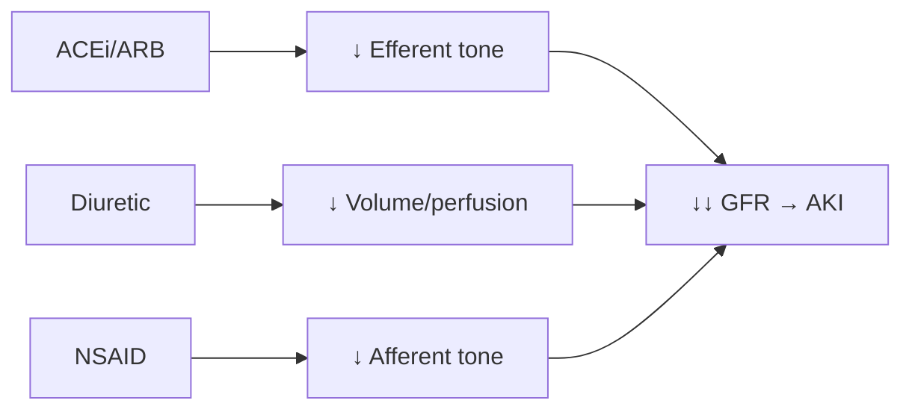
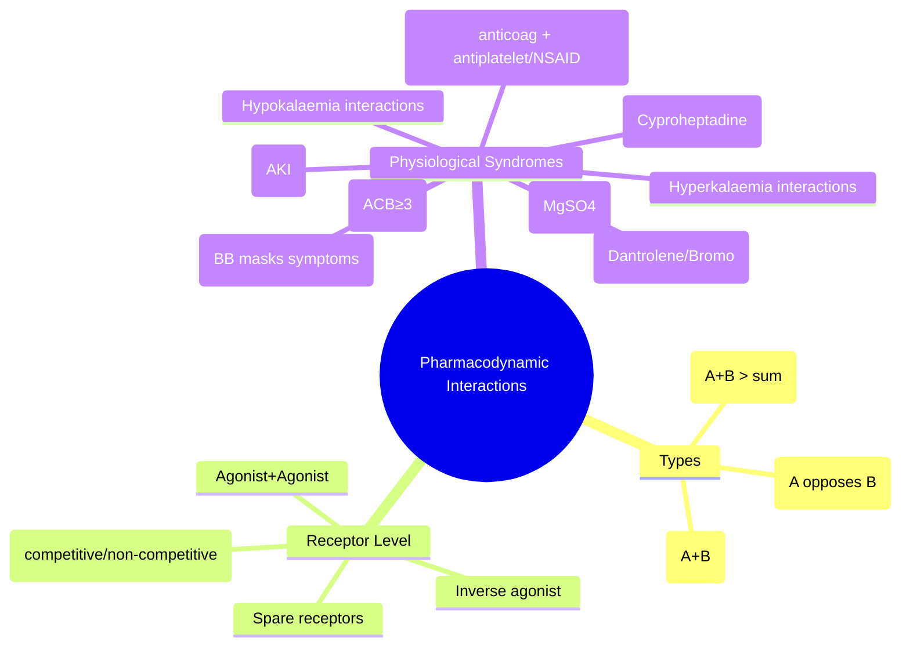

# Pharmacodynamic Interactions

**Status**: `draft` | **Chapter**: 2 — Clinical Therapeutics and Good Prescribing | **Heading**: Drug Interactions | **Exam Priority**: ⭐⭐⭐ **HIGH** (Additive, Synergistic, Antagonistic — daily clinical decisions)

---

## 1. 🎯 Learning Objectives
- [ ] Distinguish additive, synergistic, and antagonistic pharmacodynamic interactions
- [ ] Identify receptor-level interactions (agonist/antagonist, spare receptors)
- [ ] Recognise physiological system interactions (Triple Whammy, Serotonin Syndrome, NMS)
- [ ] Apply management strategies: avoid, monitor, dose adjust

---

## 2. 📖 Classification of PD Interactions

| Type | Definition | Example | Clinical Significance |
|------|------------|---------|----------------------|
| **Additive** | Effect A + Effect B = Sum | ACEi + ARB → ↑ hyperK, AKI; Two sedatives → ↑ sedation | ↑ Toxicity risk; may be intentional (analgesia) |
| **Synergistic** | Effect A + Effect B > Sum | Alcohol + Benzodiazepines → ↑↑ CNS depression; Warfarin + Antiplatelet → ↑↑ bleed | **High risk**; often unexpected magnitude |
| **Antagonistic** | Effect A opposes Effect B | Beta-blocker + Salbutamol → ↓ bronchodilation; NSAID + ACEi → ↓ antihypertensive | **Therapeutic failure**; may be intentional (reversal) |

---

## 3. ⚡ Receptor-Level Interactions

| Interaction | Mechanism | Example |
|-------------|-----------|---------|
| **Agonist + Agonist** (same receptor) | Additive/synergistic | Full agonist + full agonist = additive; Full + partial = partial may antagonise |
| **Agonist + Antagonist** (competitive) | Antagonist shifts dose-response right | Naloxone + Morphine; Flumazenil + Midazolam; Atropine + Organophosphates |
| **Agonist + Antagonist** (non-competitive) | ↓ Max response (Emax) | Phenoxybenzamine + Adrenaline; Ketamine (NMDA) |
| **Inverse Agonist** | Stabilises inactive receptor conformation | Beta-blockers (some), Antihistamines (H1) |
| **Spare Receptors** | Max response achieved without full occupancy | High spare receptors → antagonist needs high dose to block effect |

---

## 4. 🔄 Physiological System Interactions (High-Yield Syndromes)

### 1. Triple Whammy (Renal)
| Components | Mechanism | Risk |
|------------|-----------|------|
| **ACEi/ARB** | ↓ Ang II → ↓ efferent arteriolar tone → ↓ GFR | **AKI** (↑ Creatinine >30%) |
| **Diuretic** (Loop/Thiazide) | ↓ Intravascular volume → ↓ renal perfusion | |
| **NSAID** | ↓ PG → ↓ afferent arteriolar tone → ↓ GFR | |

**Management**: Avoid NSAID; if essential, monitor creatinine day 3–7; hold ACEi/ARB if AKI

---

### 2. Serotonin Syndrome
| Mechanism | Drugs | Hunter Criteria (Diagnosis) |
|-----------|-------|----------------------------|
| **Excess 5-HT** at 5-HT2A receptors | **SSRIs, SNRIs, MAOIs, TCAs, Tramadol, Fentanyl, Linezolid, Ondansetron, Triptans, Lithium, St John's Wort, Dextromethorphan** | **Spontaneous clonus** OR **Inducible clonus + agitation/sweating** OR **Ocular clonus + agitation/sweating** OR **Tremor + hyperreflexia** OR **Hypertonia + Temp >38°C + ocular/inducible clonus** |

**Management**: Stop all serotonergic drugs → Supportive (cooling, benzodiazepines) → **Cyproheptadine 12mg stat then 2mg 2-hourly** (5-HT2A antagonist) → ICU if severe

---

### 3. Neuroleptic Malignant Syndrome (NMS)
| Mechanism | Drugs | Diagnostic Criteria (Levenson) |
|-----------|-------|-------------------------------|
| **D2 blockade** → ↓ dopamine → hyperthermia, rigidity | **Antipsychotics** (typical > atypical), **Metoclopramide, Prochlorperazine, Tetrabenazine** | **Hyperthermia >38°C** + **Rigidity** + **Altered consciousness** + **Autonomic instability** (tachy, labile BP, diaphoresis) + **CK ↑↑** + **Leukocytosis** |

**Management**: Stop offending drug → Supportive (cooling, hydration, dantrolene, bromocriptine/amantadine) → ICU

---

### 4. QT Prolongation / Torsades
| Mechanism | High-Risk Combinations |
|-----------|------------------------|
| **Additive hERG blockade** | **Class Ia/III antiarrhythmics + Antipsychotics + Macrolides + Fluoroquinolones + Antidepressants (Citalopram, TCAs) + Antiemetics (Ondansetron, Domperidone) + Methadone + Azoles** |

**Risk Factors**: Female, elderly, hypokalaemia, hypomagnesaemia, bradycardia, congenital LQTS, heart failure, liver disease

**Monitoring**: Baseline ECG if ≥2 QT drugs or risk factors; QTc >500ms or Δ>60ms = high risk

---

### 5. Anticholinergic Burden (Additive)
| Mechanism | Drugs (ACB 1–3) | Consequences |
|-----------|----------------|--------------|
| **Additive muscarinic blockade** | TCAs, 1st-gen antihistamines, Antispasmodics (oxybutynin), Antipsychotics (clozapine, olanzapine), Antiparkinson (benztropine), Opioids, Muscle relaxants | **Delirium, Falls, Constipation, Urinary retention, Cognitive decline, Tachycardia, Dry mouth** |

**Management**: ACB score ≥3 → review, deprescribe, switch to low-ACB alternatives

---

### 6. Hypokalaemia-Induced Interactions
| Scenario | Drugs | Risk |
|----------|-------|------|
| **Diuretic + Digoxin** | Loop/Thiazide + Digoxin | **Digoxin toxicity** (↓ K⁺ → ↑ digoxin binding to Na/K ATPase) |
| **Diuretic + QT drugs** | Loop/Thiazide + Amiodarone/Sotalol/Antipsychotics | **Torsades** |
| **Corticosteroid + Diuretic** | Prednisolone + Furosemide | **Severe hypokalaemia** |

---

### 7. Hyperkalaemia-Induced Interactions
| Scenario | Drugs | Risk |
|----------|-------|------|
| **ACEi/ARB + K⁺-sparing + Supplement** | Ramipril + Spironolactone + KCl | **Life-threatening hyperkalaemia** |
| **ACEi/ARB + Trimethoprim** | Ramipril + TMP-SMX | **Hyperkalaemia** (TMP = K⁺-sparing effect) |
| **Heparin + ACEi/ARB** | LMWH + Ramipril | **Hyperkalaemia** (heparin ↓ aldosterone) |

---

### 8. Bleeding Risk (Additive/Synergistic)
| Combination | Mechanism | Monitoring |
|-------------|-----------|------------|
| **Anticoagulant + Antiplatelet** | Warfarin/DOAC + Aspirin/Clopidogrel | INR, Hb, clinical bleed |
| **Anticoagulant + NSAID** | Warfarin/DOAC + Ibuprofen | INR, Hb, GI protection (PPI) |
| **Dual antiplatelet + Anticoagulant** | Triple therapy (AF + ACS/Stent) | Hb, INR, HAS-BLED |

---

### 9. Hypoglycaemia (Additive)
| Combination | Mechanism |
|-------------|-----------|
| **Insulin/Sulfonylurea + Beta-blocker** | BB masks adrenergic symptoms (tachy, tremor) → **unrecognised hypo** |
| **Insulin/Sulfonylurea + Alcohol** | Alcohol ↓ gluconeogenesis + masks symptoms |
| **SGLT2i + Insulin/Sulfonylurea** | Additive glucose lowering |
| **ACEi/ARB + Insulin** | ↑ Insulin sensitivity |

---

## 5. 🎯 FCPS/MRCP High-Yield Summary

| Syndrome | Key Drugs | Diagnostic Criteria | Antidote/Specific Rx |
|----------|-----------|---------------------|----------------------|
| **Triple Whammy** | ACEi/ARB + Diuretic + NSAID | AKI (Cr ↑>30%) | Avoid NSAID; hold ACEi/ARB if AKI |
| **Serotonin Syndrome** | SSRI + MAOI + Tramadol + Linezolid + Triptan | Hunter Criteria (clonus, hyperreflexia, hypertonia, fever) | **Cyproheptadine**, Benzodiazepines, Cooling |
| **NMS** | Antipsychotic + Metoclopramide | Levenson: Fever + Rigidity + Altered consciousness + Autonomic instability + CK↑ | **Dantrolene**, Bromocriptine, Supportive |
| **Torsades** | Multiple QT drugs + HypoK/Mg | QTc >500ms, polymorphic VT | **IV MgSO₄ 2g**, Correct K/Mg, Pacing |
| **Anticholinergic Toxicity** | ACB ≥3 drugs | Delirium, Dry, Hot, Red, Blind, Mad, Full | Physostigmine (severe), Supportive |
| **Bleeding** | Anticoag + Antiplatelet/NSAID | Hb drop, INR rise | Hold, Reverse (Vit K, PCC, Idarucizumab, Andexanet) |

---

## 6. ❓ Viva Questions (10)

| Q | Answer |
|---|--------|
| 1. Additive vs Synergistic vs Antagonistic PD interaction? | Additive = A+B; Synergistic = A+B > sum; Antagonistic = A opposes B |
| 2. Triple Whammy components and mechanism? | ACEi/ARB (↓ efferent) + Diuretic (↓ volume) + NSAID (↓ afferent) → ↓↓ GFR → AKI |
| 3. Serotonin Syndrome: mechanism, 3 drug examples, antidote? | Excess 5-HT at 5-HT2A; SSRI + MAOI + Tramadol; **Cyproheptadine** |
| 4. NMS vs Serotonin Syndrome — distinguishing features? | NMS: **Bradykinesia, Lead-pipe rigidity, CK↑↑, Onset days-weeks**; Serotonin: **Hyperreflexia, Clonus, Onset hours, CK normal/mild↑** |
| 5. QT prolongation: mechanism, 3 high-risk drug classes? | hERG (IKr) blockade; Antiarrhythmics, Antipsychotics, Macrolides/Fluoroquinolones, Antidepressants, Antiemetics |
| 6. Digoxin + furosemide interaction? | Furosemide → hypokalaemia → ↑ digoxin binding to Na/K ATPase → **digoxin toxicity** |
| 7. ACEi + Spironolactone + KCl — risk? | **Hyperkalaemia** — monitor K⁺ weekly x4 then monthly |
| 8. Beta-blocker + insulin — danger? | **Masks hypoglycaemia symptoms** (tachycardia, tremor) → unrecognised hypo |
| 9. Anticholinergic burden: target score, 3 high-ACB drugs? | Target **<3**; Amitriptyline (3), Oxybutynin (3), Chlorpromazine (3) |
| 10. Competitive vs non-competitive antagonism? | Competitive: surmountable, shifts curve right (Naloxone); Non-competitive: ↓ Emax (Phenoxybenzamine) |

---

## 7. 🤯 Confusions & Mnemonics

| Confusion | Clarification |
|-----------|---------------|
| **PD vs PK interaction** | PD = effect at site of action (receptor/system); PK = ADME (absorption, distribution, metabolism, excretion) |
| **Serotonin Syndrome vs NMS** | Serotonin = **hyperreflexia, clonus, rapid onset**; NMS = **rigidity, bradykinesia, CK↑↑, slow onset** |
| **Additive vs Synergistic bleeding** | Warfarin + Aspirin = additive (different mechanisms); Warfarin + NSAID = synergistic (antiplatelet + anticoag + gastric injury) |
| **Triple Whammy = only NSAID?** | Any renal afferent constrictor (calcineurin inhibitors, contrast) can substitute NSAID |

**Mnemonics:**
- **"TRIPLE WHAMMY"** = ACEi + Diuretic + NSAID = **AKI**
- **"SEROTONIN"** = **S**SRI + **MAOI** + **Tramadol** + **Linezolid** + **Triptan** → **Clonus, Hyperreflexia, Hypertonia, Fever** → **Cyproheptadine**
- **"NMS"** = **N**euroleptic **M**alignant **S**yndrome = **Fever + Rigidity + CK↑↑ + Altered consciousness** → **Dantrolene/Bromocriptine**
- **"QT DRUGS"** = **Q**uinidine, **T**ricyclics, **D**ronedarone, **R**isperidone, **U**ndesirable **G**roups (antiarrhythmics, antipsychotics, macrolides, fluoroquinolones, antiemetics, methadone) → **MgSO₄**
- **"ANTICHOLINERGIC"** = **A**mitriptyline, **N**ortriptyline, **T**olterodine, **I**pratropium, **C**lozapine, **H**yoscine, **O**lanzapine, **L**oxapine, **I**mipramine, **N**eostigmine reversal, **E**szopiclone, **R**isperidone (some), **G**lycopyrrolate, **I**nvese, **C**yclobenzaprine

---

## 8. 🧠 Mind Map (Mermaid)

---

## 9. 📅 Spaced Repetition Tracker

| Review | Date | Score | Next |
|--------|------|-------|------|
| 1 | | | 1d |
| 2 | | | 3d |
| 3 | | | 1w |
| 4 | | | 2w |
| 5 | | | 1m |
| 6 | | | 3m |

---

## 10. 🧪 Self-Test Scorecard

| Section | Max | Score |
|---------|-----|-------|
| PD interaction types | 6 | |
| Receptor mechanisms | 6 | |
| 9 Physiological syndromes | 18 | |
| Viva answers | 10 | |
| **Total** | **40** | |

**Target**: ≥32/40 (80%)

---

## 11. 📝 Exam Answer Modes

### Short Question (5 marks): *"Triple Whammy AKI"*
- ACEi/ARB + Diuretic + NSAID → ↓ efferent + ↓ volume + ↓ afferent → ↓↓ GFR
- Avoid NSAID; monitor creatinine; hold ACEi/ARB if AKI

### Viva (2 min): *"SSRI + Tramadol + Linezolid → confusion, clonus, fever. Diagnosis? Management?"*
- **Serotonin Syndrome** (Hunter criteria met)
- Stop all serotonergic drugs
- Supportive: cooling, IV fluids, benzodiazepines
- **Cyproheptadine 12mg stat then 2mg 2-hourly**
- ICU if severe (hyperthermia >41°C, DIC, rhabdo)

### Ward Round (30 sec): *"Patient on ramipril, furosemide, started ibuprofen for knee pain. Day 5: Cr 180 (baseline 100). Action?"*
- **Triple Whammy AKI** — Stop ibuprofen, hold ramipril, IV fluids, monitor Cr daily

### Last-Night Revision (1-liners):
- Additive = A+B; Synergistic > sum; Antagonistic opposes
- Triple Whammy = ACEi + Diuretic + NSAID = AKI
- Serotonin = Clonus + Hyperreflexia + Fever → Cyproheptadine
- NMS = Rigidity + Fever + CK↑↑ → Dantrolene/Bromo
- Torsades = Multiple QT drugs + HypoK/Mg → MgSO₄ 2g
- Digoxin + Diuretic = HypoK → Dig toxicity
- ACEi + Spiro + KCl = HyperK
- BB + Insulin = Masks hypo

---

## 12. 📚 Summary Card

> **PD INTERACTION EMERGENCIES:**
> 1. **Serotonin Syndrome** → **Cyproheptadine**
> 2. **NMS** → **Dantrolene / Bromocriptine**
> 3. **Torsades** → **IV MgSO₄ 2g**
> 4. **Triple Whammy** → **Stop NSAID, Hold ACEi/ARB**
> 5. **Anticholinergic** → **Physostigmine (severe)**

---

## 13. ❓ MCQs (12)

1. **Additive pharmacodynamic interaction example:**
   A. Warfarin + Clarithromycin (PK)
   B. **ACE inhibitor + ARB → hyperkalaemia** ✓
   C. Rifampicin + OCP (PK induction)
   D. Grapefruit juice + Simvastatin (PK)
   E. Phenytoin + Fluconazole (PK)

2. **Triple Whammy components:**
   A. ACEi + Beta-blocker + Diuretic
   B. **ACEi/ARB + Diuretic + NSAID** ✓
   C. ARB + CCB + Diuretic
   D. ACEi + ARB + CCB
   E. Beta-blocker + Diuretic + NSAID

3. **Serotonin Syndrome diagnostic criteria (Hunter):**
   A. Rigidity + Fever + CK↑
   B. **Clonus (spontaneous/inducible/ocular) + Agitation/Sweating OR Tremor+Hyperreflexia OR Hypertonia+Fever+Clonus** ✓
   C. Altered consciousness + Hypotension + Bradycardia
   D. Seizures + Coma + Respiratory failure
   E. Diarrhoea + Mydriasis + Hyperthermia

4. **Antidote for Serotonin Syndrome:**
   A. Naloxone
   B. Flumazenil
   C. **Cyproheptadine** ✓
   D. Physostigmine
   E. Dantrolene

5. **NMS vs Serotonin Syndrome — key differentiator:**
   A. Fever present in both
   B. **NMS: Lead-pipe rigidity, Bradykinesia, CK↑↑; Serotonin: Hyperreflexia, Clonus, Rapid onset** ✓
   C. NMS caused by SSRIs
   D. Serotonin syndrome caused by antipsychotics
   E. Both treated with dantrolene

6. **Antidote for NMS:**
   A. Cyproheptadine
   B. **Dantrolene / Bromocriptine** ✓
   C. Naloxone
   D. Flumazenil
   E. Physostigmine

7. **QTc >500ms or Δ>60ms on multiple QT drugs — immediate action?**
   A. Continue all, monitor
   B. **Stop offending drugs, IV MgSO₄ 2g, correct K⁺/Mg²⁺** ✓
   C. Start beta-blocker
   D. Amiodarone 300mg IV
   E. Cardioversion

8. **Furosemide + Digoxin interaction mechanism:**
   A. PK: Furosemide inhibits digoxin clearance
   B. **PD: Furosemide → hypokalaemia → ↑ digoxin binding to Na/K ATPase** ✓
   C. PK: Protein binding displacement
   D. PK: P-gp inhibition
   E. No interaction

9. **ACEi + Spironolactone + KCl — monitoring?**
   A. INR weekly
   B. **K⁺ weekly x4 then monthly** ✓
   C. Creatinine monthly
   D. Digoxin level
   E. No monitoring needed

10. **Beta-blocker masks which hypoglycaemia symptoms?**
    A. Neuroglycopenic (confusion, seizure)
    B. **Adrenergic (tachycardia, tremor, sweating, palpitations)** ✓
    C. Both equally
    D. Neither
    E. GI symptoms only

11. **Competitive antagonism — dose-response curve:**
    A. **Shifted right, same Emax** ✓
    B. Shifted left, same Emax
    C. ↓ Emax, same EC50
    D. ↑ Emax, same EC50
    E. No change

12. **Target Anticholinergic Burden (ACB) score:**
    A. 0
    B. <1
    C. **<3** ✓
    D. <5
    E. <10

---

## 14. 🃏 Flashcards (Anki-ready)

| Front | Back |
|-------|------|
| Additive PD interaction | Effect A + Effect B = Sum (e.g., ACEi+ARB → hyperK) |
| Synergistic PD interaction | Effect A + Effect B > Sum (e.g., EtOH + BZD → CNS depression) |
| Antagonistic PD interaction | Effect A opposes Effect B (e.g., BB + Salbutamol) |
| Triple Whammy | ACEi/ARB + Diuretic + NSAID → AKI (↓efferent + ↓volume + ↓afferent) |
| Serotonin Syndrome | Excess 5-HT2A → Clonus, Hyperreflexia, Hypertonia, Fever → Cyproheptadine |
| NMS | D2 blockade → Fever, Rigidity, CK↑↑, Altered consciousness → Dantrolene/Bromo |
| Serotonin vs NMS | Serotonin: hyperreflexia/clonus, rapid onset; NMS: rigidity/bradykinesia, CK↑↑, slow |
| Torsades | hERG block + risk factors → IV MgSO₄ 2g, correct K/Mg |
| Digoxin + Diuretic | HypoK → ↑ digoxin binding → toxicity |
| ACEi + Spiro + KCl | HyperK risk — K⁺ weekly x4 then monthly |
| BB + Insulin | Masks adrenergic hypo symptoms (tachy, tremor) |
| Competitive antagonist | Shifts dose-response right, same Emax (Naloxone) |
| Non-competitive antagonist | ↓ Emax (Phenoxybenzamine) |
| ACB target | <3 |

---

## 15. ✅ Answer Keys

### MCQs
1. **B** — ACEi+ARB = additive hyperkalaemia
2. **B** — Triple Whammy = ACEi/ARB + Diuretic + NSAID
3. **B** — Hunter criteria
4. **C** — Cyproheptadine (5-HT2A antagonist)
5. **B** — NMS: rigidity/bradykinesia/CK↑↑; Serotonin: hyperreflexia/clonus
6. **B** — Dantrolene/Bromocriptine
7. **B** — Stop drugs, MgSO₄, correct electrolytes
8. **B** — PD: hypokalaemia → ↑ digoxin binding
9. **B** — K⁺ weekly x4 then monthly
10. **B** — Masks adrenergic symptoms
11. **A** — Competitive: right shift, same Emax
12. **C** — ACB <3

---

*File: `/mnt/tb/Medicine/Clinical Therapeutics and Good Prescribing/Drug Interactions/Pharmacodynamic interactions.md` | Status: `draft` → upgrade after review*
