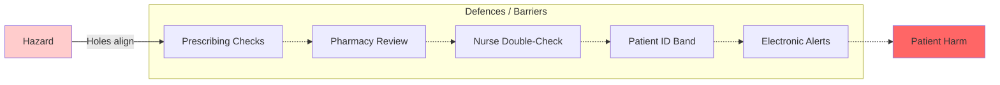
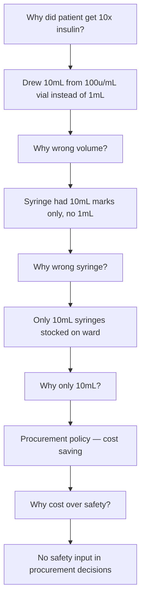
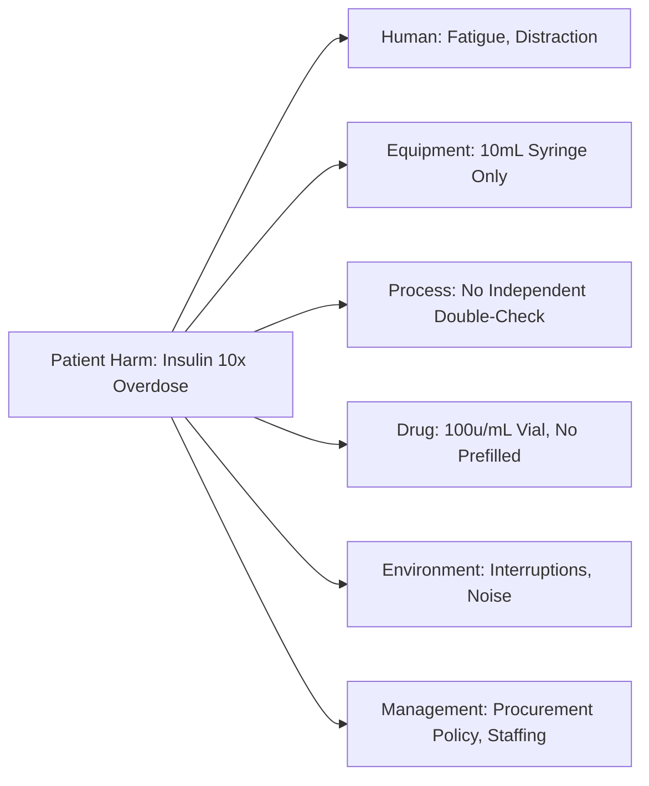
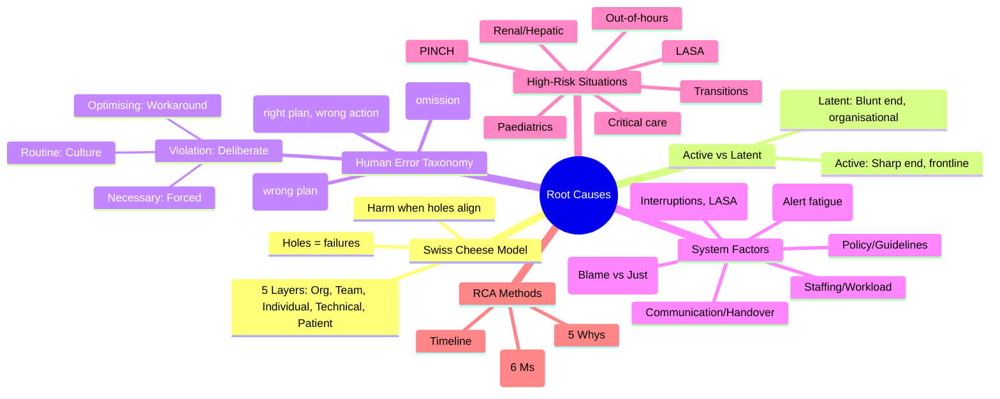

# Root Causes of Medication Errors

**Status**: `draft` | **Chapter**: 2 — Clinical Therapeutics and Good Prescribing | **Heading**: Medication Safety and Errors | **Exam Priority**: ⭐⭐⭐ **HIGH** (Governance, RCAs, FCPS/MRCP)

---

## 1. 🎯 Learning Objectives
- [ ] Apply Swiss Cheese Model / Reason's Model of accident causation
- [ ] Distinguish Active Errors (Sharp End) vs Latent Conditions (Blunt End)
- [ ] Identify Human Factors: slips, lapses, mistakes, violations
- [ ] Recognise System Factors: workflow, culture, technology, environment
- [ ] Execute Root Cause Analysis (RCA) basics: 5 Whys, Fishbone, Timeline

---

## 2. 🧀 Swiss Cheese Model (Reason, 1990)

| Layer | Defence | Typical "Holes" (Failures) |
|-------|---------|----------------------------|
| 1 | **Organisational** (Culture, Staffing, Policy) | Blame culture, understaffing, outdated guidelines |
| 2 | **Team / Ward** (Supervision, Handover, Communication) | Poor handover, hierarchy, fear of speaking up |
| 3 | **Individual** (Knowledge, Fatigue, Distraction) | Knowledge gap, fatigue, interruption, cognitive bias |
| 4 | **Technical / System** (CPOE, Alerts, Barcode, LASA storage) | Alert fatigue, poor UI, no barcode, LASA stored together |
| 5 | **Patient** (ID band, Allergy awareness, Self-advocacy) | Missing ID band, unconscious, language barrier |

> **Accident occurs when holes in all layers align** — **No single cause**

---

## 3. ⚡ Active Errors vs Latent Conditions

| Type | Definition | Examples | Timeframe |
|------|------------|----------|-----------|
| **Active Errors (Sharp End)** | **Errors at the point of care** — directly cause harm | Wrong dose given, wrong drug administered, allergy ignored | Immediate |
| **Latent Conditions (Blunt End)** | **System/organisational failures** — dormant until triggered | Understaffing, poor CPOE design, culture of blame, outdated protocols | Months–years before event |

> **Key**: **Active errors are SYMPTOMS of latent conditions** — fixing only the active error (blaming the nurse) misses the root cause

---

## 4. 👤 Human Factors — Error Taxonomy (Reason)

| Error Type | Definition | Mechanism | Example |
|------------|------------|-----------|---------|
| **Slip** | **Action not as planned** (attentional failure) | **Automatic behaviour, distraction** | Intend to give 5mg, give 50mg (distraction); pick wrong vial (looks similar) |
| **Lapse** | **Memory failure** (omission) | **Forgetting step, interrupted** | Forget to give VTE prophylaxis; forget to check allergy status |
| **Mistake** | **Plan wrong** (knowledge/rule failure) | **Knowledge gap, misapplied rule** | Prescribe NSAID in HF (didn't know contraindicated); use wrong guideline |
| **Violation** | **Deliberate deviation** from protocol | **Routine, Optimising, Necessary** | Not double-checking insulin (routine); borrows drug from another ward (optimising) |

| Violation Type | Motivation |
|----------------|------------|
| **Routine** | "Everyone does it this way" (cultural norm) |
| **Optimising** | "Trying to help / save time" (borrowing drugs, workarounds) |
| **Necessary / Situational** | "No other choice" (system failure forces workaround) |

---

## 5. 🏥 System / Organisational Factors

| Domain | Failure Modes |
|--------|---------------|
| **Workflow / Process** | Complex protocols, missing steps, no forcing functions, poor handovers |
| **Staffing / Workload** | **Understaffing, high patient:nurse ratio, excessive overtime, agency staff** |
| **Culture** | **Blame culture, fear of reporting, hierarchy, lack of psychological safety** |
| **Training / Competence** | Inadequate induction, no CPD, unfamiliar with formulary/guidelines |
| **Communication** | Poor handover (SBAR not used), illegible orders, abbreviation misuse, language barriers |
| **Environment** | **Interruptions, noise, poor lighting, similar packaging stored together (LASA)** |
| **Technology** | **Alert fatigue (CPOE)**, poor UI, no barcode scanning, no forced functions, downtime |
| **Policy / Guidelines** | Outdated, inaccessible, conflicting, not evidence-based |
| **Equipment / Supplies** | Missing drugs, look-alike vials, no prefilled syringes, infusion pump errors |

---

## 6. 🎯 High-Risk Situations (Error Traps)

| Situation | Why High Risk | Mitigation |
|-----------|---------------|------------|
| **Transitions of Care** | Info loss at admission/transfer/discharge | **Medication Reconciliation** (gold standard) |
| **Look-Alike Sound-Alike (LASA)** | Name confusion, similar packaging | **Tall Man lettering, separate storage, alerts** |
| **High-Alert Drugs (PINCH)** | Narrow TI, severe harm if error | **Independent double-check, prefilled syringes, standard concentrations** |
| **Paediatrics / Neonates** | Weight-based dosing, small volumes, immature organs | **Weight-based protocols, pharmacist review** |
| **Renal / Hepatic Impairment** | Dose adjustment complexity | **eGFR/CrCl on every order, hepatic dose alerts** |
| **Critically Ill** | Multiple drugs, organ support, instability | **Daily review, pharmacist on rounds** |
| **Out-of-Hours / Weekend** | Reduced staffing, senior cover, formulary access | **On-call pharmacist, restricted formulary** |
| **New Starters / Locums** | Unfamiliar systems, guidelines, patients | **Structured induction, buddy system** |

---

## 7. 🔬 Root Cause Analysis (RCA) Methods

### 1. 5 Whys (Simple, Iterative)

**Root Cause**: **Procurement policy without safety review** → **System fix: Stock 1mL insulin syringes**

### 2. Fishbone / Ishikawa Diagram

### 3. Timeline / Chronology
| Time | Event | Barrier Failed |
|------|-------|----------------|
| 08:00 | Dr prescribes insulin 10u | — |
| 08:30 | Pharmacy dispenses 100u/mL vial | — |
| 09:00 | Nurse draws up — uses 10mL syringe, draws 10mL (1000u) | **Independent double-check missed** |
| 09:15 | Patient given 1000u IV | **Patient ID / dose verification missed** |
| 09:30 | Hypoglycaemia, seizure | — |

---

## 8. 🎯 FCPS/MRCP High-Yield Summary

| Pearl | Details |
|-------|---------|
| **Swiss Cheese** | Multiple defence layers; harm when holes align |
| **Active vs Latent** | Active = sharp end (immediate); Latent = blunt end (organisational) |
| **Human Error Types** | Slip (attention), Lapse (memory), Mistake (knowledge), Violation (deliberate) |
| **Violation Types** | Routine (cultural), Optimising (workaround), Necessary (forced) |
| **5 Whys** | Iterative "Why?" to reach latent root cause |
| **Fishbone** | Categories: Human, Machine, Method, Material, Environment, Management |
| **Top System Failures** | Understaffing, Alert fatigue, Blame culture, Poor handover, LASA storage |
| **High-Risk Situations** | Transitions, LASA, PINCH, Paediatrics, Renal/Hepatic, Critical care |

---

## 9. ❓ Viva Questions (8)

| Q | Answer |
|---|--------|
| 1. Swiss Cheese Model — what do the holes represent? | **Failures/weaknesses in defence layers** (organisational, team, individual, technical, patient); harm when holes align |
| 2. Active error vs Latent condition — difference? | **Active = Sharp end** (frontline error, immediate); **Latent = Blunt end** (organisational failure, dormant, root cause) |
| 3. Human error taxonomy — Slip vs Lapse vs Mistake? | **Slip** = action not as planned (attention); **Lapse** = memory failure (omission); **Mistake** = wrong plan (knowledge/rule) |
| 4. Violation types — Routine, Optimising, Necessary? | **Routine** = cultural norm ("everyone does it"); **Optimising** = workaround to save time/help; **Necessary** = forced by system failure |
| 5. 5 Whys — purpose? | **Iterative questioning to reach latent/organisational root cause** (not just frontline error) |
| 6. Fishbone categories? | **Human, Machine, Method, Material, Environment, Management** (6 Ms) |
| 7. Top 3 system factors contributing to medication errors? | **Understaffing/Workload, Alert Fatigue (CPOE), Blame Culture / Poor Reporting** |
| 8. High-risk situations for medication errors — name 5? | **Transitions of care, LASA drugs, PINCH drugs, Paediatrics, Renal/Hepatic impairment, Critical illness, Out-of-hours, New staff** |

---

## 10. 🤯 Confusions & Mnemonics

| Confusion | Clarification |
|-----------|---------------|
| **Active error = root cause?** | **No** — active error is the **symptom**; latent condition is the **root cause** |
| **Slip vs Mistake** | **Slip** = right plan, wrong execution (attention); **Mistake** = wrong plan (knowledge) |
| **Violation = always bad?** | **Necessary violations** reveal system failures (e.g., borrowing drug because pharmacy closed) |
| **Swiss Cheese = blame individuals?** | **No** — model shows **systemic alignment of failures**, not individual blame |
| **RCA = blame exercise?** | **No** — RCA is **system-focused** (What failed? Why? How prevent?) not **Who failed?** |

**Mnemonics:**
- **"SWISS CHEESE = HOLES ALIGN"** = Multiple barriers, harm when holes line up
- **"ACTIVE = SHARP END"** = Frontline, immediate; **"LATENT = BLUNT END"** = Organisational, root cause
- **"SLIP = ATTENTION"** = Right plan, wrong action; **"LAPSE = MEMORY"** = Forgot step; **"MISTAKE = KNOWLEDGE"** = Wrong plan
- **"VIOLATION TYPES"** = **R**outine (culture), **O**ptimising (workaround), **N**ecessary (forced)
- **"5 WHYS = ROOT CAUSE"** = Keep asking "Why?" until organisational cause found
- **"FISHBONE 6 Ms"** = **M**an, **M**achine, **M**ethod, **M**aterial, **E**nvironment, **M**gmt
- **"ERROR TRAPS"** = **T**ransitions, **R**enal/Hepatic, **A**lert fatigue, **P**INCH, **S**TAFFING

---

## 11. 🧠 Mind Map (Mermaid)

---

## 12. 📅 Spaced Repetition Tracker

| Review | Date | Score | Next |
|--------|------|-------|------|
| 1 | | | 1d |
| 2 | | | 3d |
| 3 | | | 1w |
| 4 | | | 2w |
| 5 | | | 1m |
| 6 | | | 3m |

---

## 13. 🧪 Self-Test Scorecard

| Section | Max | Score |
|---------|-----|-------|
| Swiss Cheese | 6 | |
| Active vs Latent | 6 | |
| Human error types | 8 | |
| System factors | 6 | |
| RCA methods | 8 | |
| Viva answers | 8 | |
| **Total** | **42** | |

**Target**: ≥34/42 (80%)

---

## 14. 📝 Exam Answer Modes

### Short Question (5 marks): *"Swiss Cheese Model and Active vs Latent errors."*
- **Swiss Cheese**: 5 defence layers (Organisational, Team, Individual, Technical, Patient); holes = failures; harm when holes align
- **Active Error** = Sharp end, frontline, immediate (wrong dose given)
- **Latent Condition** = Blunt end, organisational, dormant (understaffing, alert fatigue, culture)
- **Key**: Active errors are symptoms of latent conditions

### Viva (1 min): *"Nurse gives 10x insulin. 5 Whys analysis?"*
1. Why 10x? → Drew 10mL from 100u/mL vial (1000u)
2. Why 10mL? → Only 10mL syringes stocked
3. Why only 10mL? → Procurement policy (cost)
4. Why cost over safety? → No safety input in procurement
5. **Root Cause: Procurement policy without clinical safety review**
- **Fix**: Stock 1mL insulin syringes; independent double-check; prefilled pens

### Ward Round (30 sec): *"Junior doctor prescribes NSAID for HF patient. Why? System fix?"*
- **Mistake** (knowledge gap — didn't know NSAID contraindicated in HF)
- **System fix**: CPOE alert for NSAID in HF; formulary restriction; education; pharmacist review

### Last-Night Revision (1-liners):
- Swiss Cheese = holes in defences align → harm
- Active = sharp end; Latent = blunt end (root cause)
- Slip = attention; Lapse = memory; Mistake = knowledge; Violation = deliberate
- Violation types: Routine (culture), Optimising (workaround), Necessary (forced)
- 5 Whys = iterative to root cause
- Fishbone = Man, Machine, Method, Material, Environment, Management
- Error traps = Transitions, LASA, PINCH, Renal/Hepatic, Staffing, Alert fatigue

---

## 15. 📚 Summary Card

> **ROOT CAUSES:**
> **SWISS CHEESE** = 5 layers, holes align = harm
> **ACTIVE** = Sharp end (symptom); **LATENT** = Blunt end (root cause)
> **SLIP** = attention; **LAPSE** = memory; **MISTAKE** = knowledge; **VIOLATION** = deliberate
> **RCA** = 5 Whys / Fishbone (6 Ms) / Timeline
> **SYSTEM FAILURES** = Understaffing, Alert fatigue, Blame culture, Poor handover, LASA storage
> **ERROR TRAPS** = Transitions, LASA, PINCH, Renal/Hepatic, Critical care, Out-of-hours

---

## 16. ❓ MCQs (10)

1. **Swiss Cheese Model — what do holes represent?**
   A. Successful defences
   B. **Failures/weaknesses in defence layers** ✓
   C. Patient factors only
   C. Technology failures only
   E. Individual errors only

2. **Active error vs Latent condition:**
   A. Same thing
   B. **Active = Sharp end (frontline); Latent = Blunt end (organisational)** ✓
   C. Active = Organisational; Latent = Frontline
   D. Active = always harmful; Latent = never harmful
   E. No difference

3. **Slip — mechanism:**
   A. Memory failure
   B. Knowledge gap
   C. **Attentional failure (action not as planned)** ✓
   D. Deliberate deviation
   E. System failure

4. **Lapse — mechanism:**
   A. **Memory failure (omission)** ✓
   B. Attentional failure
   C. Knowledge gap
   D. Deliberate deviation
   E. Rule misapplication

5. **Routine violation — motivation:**
   A. Trying to help
   B. **Cultural norm ("everyone does it")** ✓
   C. No other choice
   D. Knowledge gap
   E. Fatigue

6. **5 Whys — purpose:**
   A. Blame the individual
   B. **Find latent/organisational root cause** ✓
   C. Document the error
   D. Train the staff
   E. Report to regulators

7. **Fishbone diagram — 6 M categories:**
   A. Man, Machine, Method, Material, Environment, Management ✓
   B. Man, Machine, Money, Method, Market, Management
   C. Medical, Mental, Method, Material, Environment, Management
   D. Man, Machine, Method, Medication, Environment, Management
   E. Manual, Machine, Method, Material, Environment, Management

8. **High-risk situation for medication errors:**
   A. Routine ward round
   B. **Transitions of care (admission/transfer/discharge)** ✓
   C. Elective clinic
   D. Daytime pharmacy
   E. Weekend off

9. **Alert fatigue — contributes to errors by:**
   A. Increasing knowledge
   B. **Clinicians overriding important alerts** ✓
   C. Reducing workload
   D. Improving accuracy
   E. No effect

10. **Just Culture — principle:**
    A. Blame individuals for all errors
    B. **Distinguish human error (console), at-risk behaviour (coach), reckless behaviour (punish)** ✓
    C. No accountability
    D. Punish all errors equally
    E. Report only serious harm

---

## 17. 🃏 Flashcards (Anki-ready)

| Front | Back |
|-------|------|
| Swiss Cheese holes | Failures in defence layers |
| Active error | Sharp end, frontline, immediate |
| Latent condition | Blunt end, organisational, root cause |
| Slip | Attentional failure (right plan, wrong action) |
| Lapse | Memory failure (omission) |
| Mistake | Knowledge/rule failure (wrong plan) |
| Violation types | Routine (culture), Optimising (workaround), Necessary (forced) |
| 5 Whys purpose | Iterative to latent root cause |
| Fishbone 6 Ms | Man, Machine, Method, Material, Environment, Management |
| Just Culture | Console human error, Coach at-risk, Punish reckless |
| Error traps | Transitions, LASA, PINCH, Renal/Hepatic, Critical, Out-of-hours, New staff |

---

## 18. ✅ Answer Keys

### MCQs
1. **B** — Failures in defence layers
2. **B** — Active = Sharp end; Latent = Blunt end
3. **C** — Attentional failure
4. **A** — Memory failure
5. **B** — Cultural norm
6. **B** — Find latent root cause
7. **A** — Man, Machine, Method, Material, Environment, Management
8. **B** — Transitions of care
9. **B** — Clinicians overriding important alerts
10. **B** — Console human error, Coach at-risk, Punish reckless

---

*File: `/mnt/tb/Medicine/Clinical Therapeutics and Good Prescribing/Medication Safety/Root causes.md` | Status: `draft` → upgrade after review*
