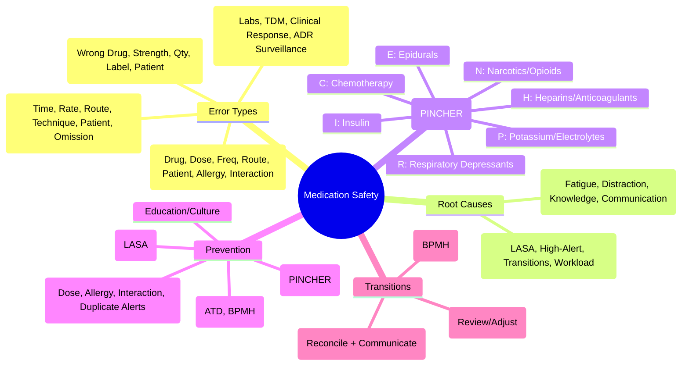

# Medication Safety and Errors

> [!info]
> **Heading Hub** for Davidson Chapter 2: Clinical therapeutics and good prescribing.
> Davidson alignment: *Section on Medication Safety and Errors* (SRJ Maxwell).

## 1. Scope
Types of medication errors, root causes, prevention strategies (reconciliation, CPOE, Tall Man, double-check), and high-risk drug categories (PINCH/PINCHER).

## 2. Sub-Topics (Topic-Groups)

### [[Medication Safety/Types of medication errors|Types of Medication Errors]]
- [[Medication Safety/Prescribing errors|Prescribing Errors]] — Wrong drug, dose, frequency, route, patient, allergy, interaction missed
- [[Medication Safety/Dispensing errors|Dispensing Errors]] — Wrong drug, strength, quantity, labelling, patient
- [[Medication Safety/Administration errors|Administration Errors]] — Wrong time, rate, route, technique, patient, omission
- [[Medication Safety/Monitoring errors|Monitoring Errors]] — Failure to monitor labs, TDM, clinical response, ADR surveillance

### [[Medication Safety/Root causes|Root Causes & Contributing Factors]]
- [[Medication Safety/Human factors|Human Factors & System Failures]] — Fatigue, distraction, knowledge gaps, communication breakdown
- [[Medication Safety/High-risk situations|High-Risk Situations]] — Transitions of care, Look-alike/sound-alike (LASA), High-alert drugs

### [[Medication Safety/Prevention strategies|Prevention Strategies]]
- [[Medication Safety/Medication reconciliation|Medication Reconciliation]] — Admission, Transfer, Discharge (ATD); Best Possible Medication History (BPMH)
- [[Medication Safety/Computerised prescribing|CPOE & Clinical Decision Support]] — Dose checking, Allergy alerts, Interaction alerts, Duplicate therapy alerts
- [[Medication Safety/Tall Man lettering|Tall Man Lettering & Labelling]] — e.g., dopaMINE vs dobutAMINE, HYDRALAZINE vs HYDROXYZINE
- [[Medication Safety/Independent double check|Independent Double-Check]] — For high-alert drugs; Two-person verification

### [[Medication Safety/High-risk drugs|High-Risk Drugs (PINCH/PINCHER)]]
- [[Medication Safety/Anticoagulants|Anticoagulants & Antiplatelets]] — Warfarin, DOACs, Heparins, Clopidogrel, Ticagrelor
- [[Medication Safety/Insulin|Insulin]] — Concentration errors, U-100 vs U-500, Sliding scale vs Basal-bolus
- [[Medication Safety/Opioids|Opioids & Sedatives]] — Respiratory depression, PCA errors, Conversion errors
- [[Medication Safety/Chemotherapy|Chemotherapy]] — BSA dosing, Protocol verification, Two-nurse check, Extravasation
- [[Medication Safety/Electrolytes|Concentrated Electrolytes]] — KCl, KPhos, NaCl 3%, MgSO₄ — Restricted access, Pre-mixed bags

---

## 3. FCPS/MRCP High-Yield Summary

### PINCH / PINCHER High-Alert Drug Classes
| Acronym | Drug Class | Key Risks |
|---------|------------|-----------|
| **P** | **Potassium & other electrolytes** (Concentrated KCl, KPhos, NaCl 3%, MgSO₄) | Cardiac arrest (K), Osmotic demyelination (Na), Respiratory arrest (Mg) |
| **I** | **Insulin** (U-100, U-500, U-200, U-300) | Hypoglycaemia, Dose confusion, Concentration errors |
| **N** | **Narcotics/Opioids** (Morphine, Oxycodone, Fentanyl, Alfentanil, Remifentanil) | Respiratory depression, Sedation, Conversion errors (oral:parenteral) |
| **C** | **Chemotherapy** (All cytotoxic agents) | Narrow TI, BSA dosing, Protocol deviation, Extravasation |
| **H** | **Heparins/Anticoagulants** (UFH, LMWH, Warfarin, DOACs, Fondaparinux) | Bleeding, Thrombosis (HIT), Monitoring failure |
| **E** | **Epidurals** (Local anaesthetics, Opioids via epidural) | Motor block, Hypotension, Epidural haematoma/abscess |
| **R** | **Respiratory depressants** (Benzodiazepines, GABAergics, Clonidine, Anaesthetics) | Apnoea, Sedation, Synergy with opioids |

### Medication Reconciliation (ATD)
| Transition | Action |
|------------|--------|
| **Admission** | Obtain BPMH (Patient, Carer, GP, Pharmacy, Previous discharge summary) → Compare with admission orders → Document discrepancies → Resolve |
| **Transfer** (Ward/ICU/Step-down) | Review all meds → Stop unnecessary → Adjust for organ function → Communicate changes |
| **Discharge** | Reconcile discharge meds with pre-admission list → Explain changes to patient/carer → Send to GP/Pharmacy within 24h → Follow-up plan |

### Common LASA Pairs (Tall Man Lettering)
| Confused Pair | Tall Man Differentiation |
|---------------|--------------------------|
| Dopamine / Dobutamine | dopaMINE / dobutAMINE |
| Hydralazine / Hydroxyzine | HYDRALAZINE / HYDROXYZINE |
| Propranolol / Propofol | propranOLOL / proPOFOL |
| Carbamazepine / Carmustine | carBAMAZEPINE / carMUSTINE |
| Ceftriaxone / Cefotaxime | cefTRIAXone / cefoTAXime |
| Glipizide / Glyburide | glipiZIDE / glyBURIDE |
| Lamotrigine / Lamivudine | lamotrIJINE / lamiVUDINE |
| Metformin / Metronidazole | metFORMIN / metRONIDAZOLE |
| Prednisolone / Prednisone | prednisoLONE / predniSONE |
| Zolpidem / Zopiclone | zolpiDEM / zopiCLONE |

### Independent Double-Check Requirements
- **Insulin** (all subcutaneous and IV)
- **Heparins** (UFH IV bolus/infusion, LMWH treatment dose)
- **Warfarin** (loading doses, dose changes)
- **DOACs** (first dose, renal impairment)
- **Chemotherapy** (All — Protocol, BSA, Dose, Drug, Patient, Route, Time)
- **Opioids IV/PCA** (Concentration, Rate, Patient)
- **Potassium IV** (Concentration, Rate, Dilution)
- **Epidural medications** (Drug, Concentration, Rate, Site)

---

## 4. Navigation
- **Parent Chapter**: [[Davidson Chapter 2 - Clinical Therapeutics Hierarchy|Chapter 2 Hierarchy]]
- **Chapter MOC**: [[Clinical Therapeutics and Good Prescribing MOC]]
- **Template**: [[../Templates/Clinical Therapeutics and Good Prescribing Topic Template|Topic Template]]

## 5. Tags
#medicine #clinical-therapeutics #davidson #hub #medication-safety #pinch #pincher #lasa #reconciliation #cpoe #fcps #mrcp

---

## 6. 📌 Summary

Medication safety is a **core FCPS/MRCP prescribing topic**. Master the **error classification** (prescribing/dispensing/administration/monitoring), **root causes** (human factors, system failures, LASA), **high-alert drugs (PINCH/PINCHER)**, and **prevention strategies** (reconciliation ATD, CPOE, Tall Man, double-check, independent verification). Medication errors are a leading cause of preventable harm — systematic approach saves lives and scores top marks in vivas.

---

## 7. ❓ MCQs (10)

1. **Medication error classification — which is a PRESCRIBING error?**
   A. Wrong patient given drug
   B. **Wrong dose prescribed**
   C. Wrong drug dispensed
   D. Drug given at wrong time

2. **High-alert drug classes in PINCHER acronym?**
   A. P=Penicillins, I=Insulin, N=NSAIDs, C=Corticosteroids, H=Hypnotics, E=Electrolytes, R=Rifampicin
   B. **P=Potassium/electrolytes, I=Insulin, N=Narcotics/opioids, C=Chemotherapy, H=Heparins/anticoagulants, E=Epidurals, R=Respiratory depressants**
   C. P=Penicillins, I=Iron, N=Nitrates, C=Calcium channel blockers, H=Heparins, E=Erythropoietin, R=Rifampicin
   D. P=Proton pump inhibitors, I=Insulin, N=NSAIDs, C=Calcium, H=Heparins, E=Erythropoietin, R=Rifampicin

3. **Medication reconciliation — when is it performed?**
   A. Only at discharge
   B. **Admission, Transfer, Discharge (ATD)**
   C. Only on ICU admission
   D. Only for controlled drugs

4. **Tall Man lettering — which pair is correctly differentiated?**
   A. Metformin / Metronidazole = metFORMin / metRONIdazole
   B. **Hydralazine / Hydroxyzine = HYDRALAZINE / HYDROXYZINE**
   C. Propranolol / Propofol = propranOLOL / proPOFOL
   D. Glipizide / Glyburide = glipiZIDE / glyBURIDE

5. **Independent double-check required for:**
   A. All oral antibiotics
   B. **IV heparin bolus/infusion**
   C. Oral paracetamol
   D. Oral vitamin D

6. **Medication reconciliation — "Best Possible Medication History" (BPMH) sources:**
   A. Patient only
   B. **Patient + Carer + GP + Pharmacy + Previous discharge summary**
   C. GP records only
   D. Hospital notes only

7. **High-alert drug — which PINCHER category includes epidurals?**
   A. P
   B. I
   C. N
   C. **E**
   D. R

8. **Medication error type — "Drug given at wrong time" is:**
   A. Prescribing error
   B. Dispensing error
   C. **Administration error**
   D. Monitoring error

9. **CPOE (Computerised Prescriber Order Entry) — key alert functions:**
   A. Patient demographics only
   B. **Dose checking, Allergy alerts, Interaction alerts, Duplicate therapy alerts**
   C. Signature capture only
   C. Cost checking only

10. **Independent double-check — when is it REQUIRED?**
    A. All oral medications
    B. **IV heparin bolus/infusion**
    C. Oral vitamin supplements
    D. Topical creams

---

## 8. 📋 SBAs (5)

1. **72F admitted with confusion. Medications: warfarin, furosemide, ramipril, metoprolol, lorazepam. BPMH reveals she takes rivaroxaban, not warfarin. Error type?**
   A. Prescribing error
   B. Dispensing error
   C. Administration error
   D. **Monitoring error (failure to identify discrepancy on admission reconciliation)**
   *Answer: D*

2. **Pharmacist dispenses dobutamine instead of dopamine. Error type?**
   A. Prescribing error
   B. **Dispensing error**
   C. Administration error
   D. Monitoring error
   *Answer: B*

3. **IV morphine 10mg prescribed; nurse administers 10mg IV over 1 min instead of over 5 min. Patient develops respiratory depression. Error type?**
   A. Prescribing error
   B. Dispensing error
   C. **Administration error (wrong rate)**
   D. Monitoring error
   *Answer: C*

4. **Patient on warfarin, INR not checked for 6 weeks. INR 8.5. Error type?**
   A. Prescribing error
   B. Dispensing error
   C. Administration error
   D. **Monitoring error (failure to monitor INR per protocol)**
   *Answer: D*

5. **Pharmacist assembles IV potassium 40mmol in 100ml bag. Nurse administers over 30 min instead of 4 hours. Patient develops cardiac arrest. Error type?**
   A. Prescribing error
   B. Dispensing error (wrong concentration)
   C. **Administration error (wrong rate — K⁺ IV rate violated)**
   D. Monitoring error
   *Answer: C*

---

## 9. 🔑 Answer Keys
| MCQs | SBAs |
|------|------|
| 1-B, 2-B, 3-B, 4-B, 5-B, 6-B, 6-B, 7-C, 8-C, 9-B, 10-B | 1-D, 2-B, 3-C, 4-D, 5-C |

---

## 10. 🎤 Viva Questions (Expected Answers)

| # | Question | Expected Answer |
|---|----------|-----------------|
| 1 | Classify medication errors — give examples of each type. | **Prescribing:** Wrong drug/dose/frequency/route/patient/allergy/interaction missed. **Dispensing:** Wrong drug/strength/quantity/labelling/patient. **Administration:** Wrong time/rate/route/technique/patient/omission. **Monitoring:** Failure to monitor labs/TDM/clinical response/ADR surveillance. |
| 2 | PINCHER acronym — what does each letter stand for? | **P**=Potassium/electrolytes, **I**=Insulin, **N**=Narcotics/opioids, **C**=Chemotherapy, **H**=Heparins/anticoagulants, **E**=Epidurals, **R**=Respiratory depressants. |
| 3 | Medication reconciliation — when and how? | **At Admission, Transfer, Discharge (ATD).** Obtain BPMH (Patient, Carer, GP, Pharmacy, Previous discharge summary) → Compare with orders → Document discrepancies → Resolve. |
| 4 | Tall Man lettering — purpose and examples? | **Differentiate look-alike/sound-alike (LASA) drug names.** Examples: dopaMINE/dobutAMINE, HYDRALAZINE/HYDROXYZINE, propranOLOL/proPOFOL, carBAMAZEPINE/carMUSTINE, cefTRIAXone/cefoTAXime. |
| 5. Independent double-check — when required? | **High-alert drugs:** Insulin (all SC/IV), Heparins (UFH IV, LMWH treatment dose), Warfarin (loading/dose changes), DOACs (first dose, renal impairment), Chemotherapy (protocol/BSA/dose/drug/patient/route/time), Opioids IV/PCA, Potassium IV, Epidural meds. |
| 6. Medication reconciliation at discharge — key steps? | Reconcile discharge meds with pre-admission list → Explain changes to patient/carer → Send to GP/Pharmacy within 24h → Follow-up plan. |
| 7. Common LASA pairs — list 5 with Tall Man differentiation. | dopaMINE/dobutAMINE; HYDRALAZINE/HYDROXYZINE; propranOLOL/proPOFOL; carBAMAZEPINE/carMUSTINE; cefTRIAXone/cefoTAXime. |
| 8. High-alert drugs — independent double-check required for? | **Insulin (all SC/IV), Heparins (UFH IV/LMWH treatment), Warfarin (loading/dose changes), DOACs (first dose/renal impairment), Chemotherapy (all), Opioids IV/PCA, K⁺ IV, Epidural meds.** |
| 9. Medication error at transitions of care — common causes? | **Incomplete reconciliation, poor communication, inaccurate BPMH, unintentional changes, failure to resolve discrepancies.** |
| 10. CPOE — key safety features? | **Dose checking (max/min/renal), Allergy alerts, Drug interaction alerts, Duplicate therapy alerts, Formulary guidance, Renal dose adjustment.** |

---

## 11. 🧩 Confusions & Mnemonics

| Confusion | Clarification |
|-----------|---------------|
| **Prescribing error = dispensing error** | **NO.** Prescribing = wrong decision by prescriber. Dispensing = wrong product/quantity/label supplied by pharmacy. |
| **Administration error = dispensing error** | **NO.** Administration = wrong act of giving drug to patient (time, rate, route, technique, patient). |
| **Monitoring error = not a real error** | **NO.** Failure to monitor = failure to detect harm from other errors or disease progression. |
| **Tall Man lettering = fixes all LASA** | **Helps but not foolproof.** Still need barcode scanning, independent double-check. |
| **Double-check = always needed** | **NO.** Only for HIGH-ALERT drugs (PINCHER). Routine double-check for all drugs = fatigue, false security. |
| **Medication reconciliation = just listing meds** | **NO.** Reconciliation = COMPARE lists + RESOLVE discrepancies + DOCUMENT + COMMUNICATE. |
| **"Do not use" abbreviations = optional** | **MANDATORY.** "U" for units, "QD/QOD", trailing zeros, lack of leading zeros — ALL cause errors. |
| **CPOE eliminates all errors** | **NO.** CPOE reduces but introduces new errors (alert fatigue, wrong menu selection, free-text overrides). |
| **Double-check = any two people** | **INDEPENDENT double-check** = two QUALIFIED people independently verify drug, dose, patient, route. |
| **PINCHER = all high-alert drugs** | **Standardised list.** Local formulary may have additional high-alert drugs. |

> **Mnemonic: PINCHER High-Alert Drugs**
> **P**otassium & electrolytes (KCl, MgSO₄, NaCl 3%)
> **I**nsulin (U-100, U-500, U-200, U-300)
> **N**arcotics/opioids (Morphine, Fentanyl, Oxycodone, Alfentanil)
> **C**hemotherapy (All cytotoxics — BSA, protocol, 2-nurse check)
> **H**eparins/Anticoagulants (UFH, LMWH, Warfarin, DOACs)
> **E**pidurals (LAs, opioids via epidural — motor block, haematoma)
> **R**espiratory depressants (BZDs, GABAergics, Clonidine, Anaesthetics)

> **ERROR TYPES — "PRESCRIBE ADMIN MONITOR"**
> **P**rescribing: Drug, dose, frequency, route, patient, allergy, interaction
> **R**econciling: Admission, Transfer, Discharge (ATD)
> **E**rror: Prescribing, Dispensing, Administration, Monitoring
> **S**ystem: Human factors, LASA, High-alert, Transitions
> **C**heck: Independent double-check (PINCHER)
> **R**econciliation: BPMH, Admission, Transfer, Discharge
> **I**nterventions: CPOE, Tall Man, Barcodes, Double-check
> **P**revention: LASA, PINCHER, Reconciliation, CPOE, Education
> **E**rror reporting: Learning culture, Root cause analysis
> **S**afety: Culture, Systems, Technology, People

> **LASA PAIRS — TALL MAN:**
> **D**opaMINE / **D**obutAMINE
> **H**YDRALAZINE / **H**YDROXYZINE
> **P**ropranOLOL / **P**roPOFOL
> **C**arBAMAZEPINE / **C**arMUSTINE
> **C**efTRIAXone / **C**efoTAXime
> **G**lipiZIDE / **G**lyBURIDE
> **L**amotrIJINE / **L**amiVUDINE
> **M**etFORMIN / **M**etRONIDAZOLE
> **P**rednisoLONE / **P**redniSONE
> **Z**olpiDEM / **Z**opiCLONE

> **ATD RECONCILIATION:**
> **A**dmission: BPMH + Compare + Resolve
> **T**ransfer: Review + Stop unnecessary + Adjust renal/hepatic + Communicate
> **D**ischarge: Reconcile + Explain changes + Send to GP/Pharmacy (24h) + Follow-up

> **DOUBLE-CHECK (PINCHER):**
> **I**nsulin (all SC/IV)
> **H**eparins (UFH IV, LMWH treatment)
> **W**arfarin (loading, dose changes)
> **D**OACs (1st dose, renal impairment)
> **C**hemotherapy (All — 2-nurse)
> **O**pioids (IV/PCA)
> **P**otassium IV
> **E**pidural meds

---

## 12. 🗺️ Mind Map

---

## 13. 📅 Spaced Repetition Tracker

| Review | Date | Score (0–5) | Notes |
|--------|------|-------------|-------|
| Day 1 | | | |
| Day 3 | | | |
| Day 7 | | | |
| Day 14 | | | |
| Day 30 | | | |
| Day 90 | | | |

---

## 14. 📝 Self-Test Scorecard

| Section | Max | Score | % |
|---------|-----|-------|---|
| Error Classification & Types | 3 | | |
| PINCHER High-Alert Drugs | 3 | | |
| Medication Reconciliation (ATD) | 3 | | |
| LASA & Tall Man Lettering | 3 | | |
| Prevention Strategies (CPOE, Double-Check) | 3 | | |
| Root Cause Analysis & Reporting | 2 | | |
| Special Populations & Transitions | 2 | | |
| **Total** | **20** | | |

---

## 15. 💬 Exam Answer Modes

| Format | Prompt | Key Points |
|--------|--------|------------|
| **Long Essay** | "Describe the classification of medication errors, high-alert drug classes (PINCHER), and prevention strategies." | Error types (prescribing/dispensing/administration/monitoring); PINCHER (P=K⁺/electrolytes, I=Insulin, N=Narcotics, C=Chemo, H=Heparins, E=Epidurals, R=Respiratory depressants); Prevention: Reconciliation (ATD), CPOE, Tall Man (LASA), Independent double-check (PINCHER), Culture & Education. |
| **Short Note** | "Medication reconciliation — steps and importance." | ATD (Admission/Transfer/Discharge); BPMH sources; Compare orders; Resolve discrepancies; Document; Communicate. Reduces errors at transitions by 50-80%. |
| **Viva** | "Patient on warfarin, INR 8.5 at admission. GP list shows rivaroxaban. GP not contacted. Error type and prevention?" | **Monitoring error** (failure to detect discrepancy) + **Reconciliation failure** at admission. Prevention: BPMH from multiple sources (patient, GP records, pharmacy, summary care record) → compare with admission orders → resolve discrepancy → document. |
| **Ward Round** | "Patient on IV morphine PCA, nurse programs 5mg bolus instead of 1mg. Prevention?" | **Independent double-check** for opioid PCA (concentration, rate, patient, drug). **CPOE/PCA with hard limits.** **Tall Man lettering** on syringes. |
| **Last-Night** | "Errors: Prescribe/Dispense/Admin/Monitor. PINCHER: P=K⁺/electrolytes, I=Insulin, N=Narcotics, C=Chemo, H=Heparins, E=Epidurals, R=Resp depressants. LASA: TALL MAN (DopaMINE/DobutAMINE, HYDRALAZINE/HYDROXYZINE, PropranOLOL/proPOFOL). Reconciliation: ATD (Admission/Transfer/Discharge) + BPMH. CPOE: Dose/Allergy/Interaction/Duplicate alerts. Double-check: PINCHER drugs. ATD: Admission (BPMH+compare), Transfer (review/adjust), Discharge (reconcile+explain+communicate)." | Compressed. |

---

## 16. 📌 Summary

- **Error Types:** Prescribing (drug/dose/freq/route/patient/allergy/interaction), Dispensing (wrong drug/strength/qty/label/patient), Administration (time/rate/route/technique/patient/omission), Monitoring (labs/TDM/clinical response/ADR).
- **PINCHER High-Alert:** **P**=K⁺/electrolytes, **I**=Insulin, **N**=Narcotics/opioids, **C**=Chemotherapy, **H**=Heparins/anticoagulants, **E**=Epidurals, **R**=Respiratory depressants.
- **LASA:** Tall Man lettering (dopaMINE/dobutAMINE, HYDRALAZINE/HYDROXYZINE, propranOLOL/proPOFOL).
- **Reconciliation (ATD):** Admission (BPMH), Transfer (review/adjust), Discharge (reconcile+communicate 24h).
- **Prevention:** CPOE (dose/allergy/interaction/duplicate alerts), Tall Man (LASA), Independent double-check (PINCHER drugs), Barcode scanning, Culture of safety.
- **Transitions:** Admission (BPMH+compare), Transfer (review/adjust/communicate), Discharge (reconcile+explain+GP/pharmacy 24h).

---

## 17. ❓ MCQs (10)

1. **Medication error — "Wrong dose prescribed" is:**
   A. Dispensing error
   B. **Prescribing error**
   C. Administration error
   D. Monitoring error

2. **PINCHER — "N" stands for:**
   A. NSAIDs
   B. **Narcotics/Opioids**
   C. Nitrates
   D. Nicotine

3. **Medication reconciliation — when performed?**
   A. At discharge only
   B. **Admission, Transfer, Discharge (ATD)**
   C. Only on ICU admission
   D. Only for controlled drugs

4. **Tall Man lettering — correct pair?**
   A. Metformin / Metronidazole = metFORMin / metRONIdazole
   B. **Hydralazine / Hydroxyzine = HYDRALAZINE / HYDROXYZINE**
   C. Propranolol / Propofol = propranOLOL / proPOFOL
   D. Glipizide / Glyburide = glipiZIDE / glyBURIDE

5. **Independent double-check required for:**
   A. All oral antibiotics
   B. **IV heparin bolus/infusion**
   C. Oral paracetamol
   D. Oral vitamin D

6. **Medication reconciliation — BPMH sources:**
   A. Patient only
   B. **Patient + Carer + GP + Pharmacy + Previous discharge summary**
   C. GP records only
   D. Hospital notes only

7. **PINCHER — "E" stands for:**
   A. Electrolytes
   B. **Epidurals**
   C. Epinephrine
   D. Enzyme inhibitors

8. **Error — "Drug given at wrong time" is:**
   A. Prescribing error
   B. Dispensing error
   C. **Administration error**
   D. Monitoring error

9. **CPOE key alerts?**
   A. Patient demographics only
   B. **Dose checking, Allergy alerts, Interaction alerts, Duplicate therapy alerts**
   C. Signature capture
   D. Cost checking

10. **Independent double-check required for:**
    A. All oral antibiotics
    B. **IV heparin bolus/infusion**
    C. Oral paracetamol
    D. Oral vitamin D

---

## 18. 📋 SBAs (5)

1. **72F admitted with confusion. BPMH reveals rivaroxaban; admission orders warfarin. Error type?**
   A. Prescribing error
   B. Dispensing error
   C. Administration error
   D. **Monitoring error (failure to identify discrepancy on admission reconciliation)**
   *Answer: D*

2. **Pharmacist dispenses dobutamine instead of dopamine. Error type?**  
   A. Prescribing error  
   B. **Dispensing error**  
   C. Administration error  
   D. Monitoring error  
   *Answer: B*

3. **IV morphine 10mg prescribed; nurse gives 10mg IV over 1 min (should be 5 min). Respiratory depression. Error type?**  
   A. Prescribing error  
   B. Dispensing error  
   C. **Administration error (wrong rate)**  
   D. Monitoring error  
   *Answer: C*

4. **Patient on warfarin, INR not checked 6 weeks, INR 8.5. Error type?**  
   A. Prescribing error  
   B. Dispensing error  
   C. Administration error  
   D. **Monitoring error (failure to monitor INR per protocol)**  
   *Answer: D*

5. **IV KCl 40mmol/100ml over 30 min (should be 4h). Cardiac arrest. Error type?**  
   A. Prescribing error  
   B. Dispensing error (wrong concentration)  
   C. **Administration error (wrong rate — K⁺ IV rate violated)**  
   D. Monitoring error  
   *Answer: C*

---

## 19. 🔑 Answer Keys
| MCQs | SBAs |
|------|------|
| 1-B, 2-B, 3-B, 4-B, 5-B, 6-B, 6-B, 7-C, 8-C, 9-B, 10-B | 1-D, 2-B, 3-C, 4-D, 5-C |

---

## 20. 🔗 Cross-Links
- [[Principles of Rational Prescribing]] — Safe prescribing, monitoring
- [[ADRs]] — Errors vs ADRs differentiation
- [[Drug Interactions]] — Interaction-induced errors
- [[Polypharmacy and Deprescribing]] — Polypharmacy-related errors
- [[Prescribing in Special Populations]] — Elderly/renal/paediatric safety
- [[Therapeutic Drug Monitoring]] — TDM errors
- [[ADRs]] — Medication error vs ADR reporting
- [[Clinical Contexts/Antimicrobial Stewardship]] — Antimicrobial prescribing safety
- [[Population & Newborn Screening]] — Neonatal medication safety
- [[9. ELSI]] — Error reporting ethics, just culture, blame-free reporting

---

**Last Updated:** 2026-06-15  
**Medication Safety & Errors Hub: COMPLETE with Full Exam Suite**
