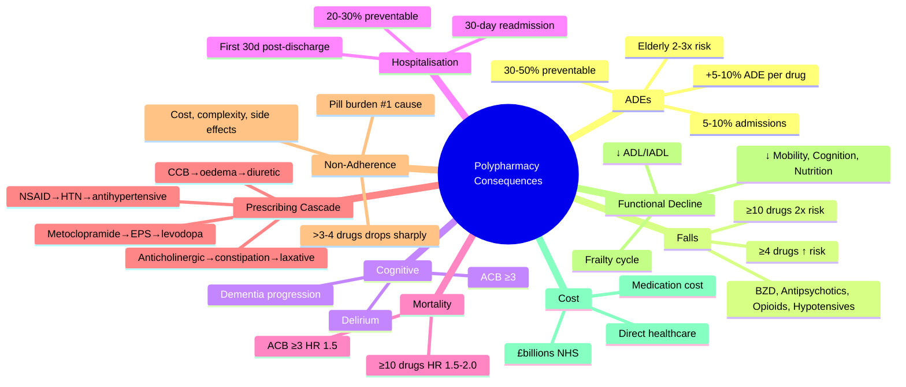

# Polypharmacy — Consequences

**Status**: `draft` | **Chapter**: 2 — Clinical Therapeutics and Good Prescribing | **Heading**: Polypharmacy and Deprescribing | **Exam Priority**: ⭐⭐⭐ **HIGH** (Clinical governance, geriatric medicine, MRCP)

---

## 1. 🎯 Learning Objectives
- [ ] List the major consequences of polypharmacy
- [ ] Quantify risk: ADEs, falls, hospitalisation, mortality
- [ ] Recognise the prescribing cascade mechanism
- [ ] Identify drug classes with disproportionate harm in polypharmacy
- [ ] Apply strategies to mitigate consequences

---

## 2. 📊 Major Consequences — Detail

### 1. Adverse Drug Events (ADEs)
| Statistic | Reference |
|----------|-----------|
| ADEs cause **5–10% of all hospital admissions** | Pirmohamed 2004 BMJ |
| **30–50% of ADEs are preventable** | Winterstein 2002 |
| Each additional drug → **↑ 5–10% ADE risk** | Linear relationship |
| **Elderly (>65y): 2–3x higher ADE risk** vs younger | Multiple |
| **Frail elderly: 5–10x higher ADE risk** | Clinical |
| **Polypharmacy + Renal impairment = highest ADE risk** | Cohort data |
| ADE-related mortality: ↑ with each additional drug | Linear |

### 2. Falls & Fractures
| Risk Factor | Mechanism |
|-------------|-----------|
| **Benzodiazepines** | Sedation, ↓ reaction time, ataxia, cognitive impairment |
| **Z-drugs (Zopiclone, Zolpidem)** | Similar to BZD; daytime sedation |
| **Antipsychotics** | Sedation, orthostatic hypotension (α1 blockade), EPS |
| **Opioids** | Sedation, cognitive impairment, constipation (frailty) |
| **Antihypertensives** (multiple) | Orthostatic hypotension, syncope |
| **Diuretics** | Volume depletion, urgency, electrolyte disturbance (Na⁺ ↓) |
| **Hypoglycaemics** (Insulin, SU) | Hypoglycaemia → falls |
| **Anticholinergics** | Cognitive impairment, blurred vision, sedation |
| **Antidepressants (TCAs > SSRIs)** | Sedation, orthostatic hypotension, hyponatraemia (SSRI/SIADH) |
| **Anticonvulsants** | Sedation, ataxia, dizziness |

**Polypharmacy + Falls**: **≥4 drugs = ↑ falls risk**; **≥10 drugs = 2x falls risk**

### 3. Cognitive Impairment & Delirium
| Mechanism | Examples |
|-----------|----------|
| **Anticholinergic Burden (ACB)** | Anticholinergics, TCAs, Antipsychotics, Bladder antispasmodics, 1st-gen antihistamines, Antiparkinsonian drugs |
| **GABAergic** | BZD, Z-drugs, Barbiturates |
| **Dopaminergic blockade** | Antipsychotics, Antiemetics (metoclopramide) |
| **Hyponatraemia** (SIADH) | SSRIs, SNRIs, TCAs, Carbamazepine |
| **Delirium risk** | Polypharmacy (especially anticholinergic + sedative) is a major delirium precipitant |

**ACB Score**: Cumulative anticholinergic effect of multiple drugs
- ACB 0: No/minimal
- ACB 1: Mild
- ACB 2: Moderate
- **ACB ≥3: ↑ cognitive decline, dementia risk**

### 4. Hospital Readmission
| Statistic | Details |
|-----------|---------|
| **30-day readmission** | ↑ with polypharmacy at discharge |
| **Preventable readmissions** | **20–30% medication-related** in elderly |
| **ED visits** | ADEs = 1 in 10 ED visits in elderly |
| **High-risk period** | First 30 days post-discharge (medication errors, non-adherence) |

### 5. Mortality
| Pattern | Details |
|---------|---------|
| **J-shaped or U-shaped curve** | Mortality ↑ with 0 drugs AND ≥10 drugs; ↓ at 5–7 (may be confounded by indication) |
| **Excessive polypharmacy (≥10)** | ↑ All-cause mortality (HR 1.5–2.0) |
| **Anticholinergic burden** | ACB ≥3 → ↑ mortality (HR 1.5) |
| **Sedative burden** | Multiple sedating drugs → ↑ mortality (falls, respiratory depression) |

### 6. Prescribing Cascades — **Critical to Recognise**
| Cascade Step | Mechanism | Result |
|--------------|-----------|--------|
| 1 | Drug A causes ADE misinterpreted as new disease | New "disease" |
| 2 | Drug B prescribed to treat the ADE (mistaken for disease) | Unnecessary drug |
| 3 | Drug B causes its own ADE | ADE × 2 |
| 4 | Drug C prescribed to treat Drug B's ADE | Cascade continues |

**Common Cascades**:
| Drug A | Misdiagnosed ADE | Drug B (unnecessary) | Then |
|--------|------------------|----------------------|------|
| **NSAID** | ↑ BP | Antihypertensive | More drugs |
| **CCB (DHP)** | Pedal oedema | Diuretic (often ineffective) | Hypotension |
| **AChE inhibitor (Donepezil)** | N/V, urinary incontinence | Antiemetic / Oxybutynin (worsens confusion) | Falls, cognitive ↓ |
| **Metoclopramide** | EPS (tremor, rigidity) | Levodopa | Worsens Parkinson's |
| **Anticholinergic** | Constipation | Laxative | Dependency |
| **Thiazide** | ↑ Uric acid → Gout flare | Allopurinol | ↑ Diuretic use |
| **Statin** | Myalgia | Pain meds / ↓ Statin | Cardiovascular risk ↑ |
| **Diuretic** | Hypokalaemia | K⁺ supplement | Pill burden, GI symptoms |

### 7. Non-Adherence
| Cause | Mechanism |
|-------|-----------|
| **Pill burden** | >5 drugs → complex regimen |
| **Cost** | Multiple copayments |
| **Side effects** | Cumulative → "I'm fed up" |
| **Forgetfulness** | Multiple timings, multiple devices |
| **Swallowing difficulty** | Large tablets, multiple tablets |
| **Cognitive impairment** | Can't remember instructions |
| **Dosing complexity** | "Take 1 morning, ½ at night, on alternate days" |

**Adherence drops sharply with >3–4 drugs** or >2 daily dosing times.

### 8. Functional Decline & Frailty
| Effect | Mechanism |
|--------|-----------|
| **↓ ADL/IADL** | Fatigue, sedation, falls, malnutrition |
| **↓ Mobility** | Orthostatic hypotension, dizziness |
| **↓ Cognition** | Anticholinergic burden |
| **↓ Nutrition** | Anorexia (multiple drugs), dry mouth, dysgeusia |
| **↓ Social interaction** | Fatigue, depression, isolation |
| **Frailty cycle** | Polypharmacy → ↑ ADEs → ↓ function → ↑ frailty → ↑ polypharmacy |

### 9. Economic Burden
| Sector | Cost |
|--------|------|
| **Direct healthcare** | ↑ Hospitalisation, ↑ ED visits, ↑ clinic visits |
| **Medication cost** | Multiple co-pays, especially for elderly on fixed income |
| **Lost productivity** | Caregiver burden, work absence |
| **UK NHS** | £billions annually; ~£300/adverse drug event |
| **WHO** | Polypharmacy is a global health priority |

---

## 3. 🎯 FCPS/MRCP High-Yield Summary

| Pearl | Details |
|-------|---------|
| **ADE % admissions** | 5–10% of admissions medication-related; 30–50% preventable |
| **Each additional drug** | ↑ 5–10% ADE risk |
| **Falls risk threshold** | ≥4 drugs ↑ falls; ≥10 drugs 2x falls |
| **ACB ≥3** | ↑ Cognitive decline, dementia, mortality |
| **Prescribing cascade** | ADE → misdiagnosed → new drug |
| **Polypharmacy #1 cause non-adherence** | Pill burden |
| **Mortality** | Excessive polypharmacy (≥10) ↑ mortality HR 1.5–2.0 |

---

## 4. ❓ Viva Questions (6)

| Q | Answer |
|---|--------|
| 1. What proportion of ADEs are preventable? | **30–50%** of ADEs are preventable with better prescribing/review |
| 2. Each additional drug — ADE risk increase? | **5–10% per additional drug** |
| 3. Prescribing cascade — 3 examples? | (1) **NSAID → HTN → antihypertensive**; (2) **CCB → oedema → diuretic**; (3) **Anticholinergic → constipation → laxative**; (4) **Metoclopramide → EPS → levodopa** (worsens) |
| 4. Anticholinergic burden ≥3 — consequences? | **↑ Cognitive decline, dementia risk, mortality** (HR ~1.5) |
| 5. Falls risk with polypharmacy — threshold? | **≥4 drugs ↑ falls risk**; **≥10 drugs = 2x falls risk** |
| 6. Mortality risk with excessive polypharmacy? | **Excessive (≥10) → ↑ all-cause mortality HR 1.5–2.0** |

---

## 5. 🤯 Confusions & Mnemonics

| Confusion | Clarification |
|-----------|---------------|
| **Polypharmacy always harmful?** | **No** — appropriate polypharmacy (HF GDMT) is beneficial |
| **Adverse Drug Event vs Adverse Drug Reaction** | **ADE = any harm from drug use** (errors, reactions, interactions); **ADR = harm directly attributable to drug at normal dose** (subset of ADE) |
| **Prescribing cascade vs side effect** | Cascade = **misinterpreted ADE → new drug**; side effect = recognised ADE |

**Mnemonics:**
- **"5+ DRUGS = 5–10% ADE RISK PER DRUG"** = linear relationship
- **"ADE → NEW DISEASE → NEW DRUG"** = prescribing cascade
- **"ACB ≥3 = COGNITIVE DECLINE"** = anticholinergic burden
- **"≥4 DRUGS = FALLS; ≥10 = 2x FALLS"**
- **"EXCESSIVE ≥10 = ↑ MORTALITY HR 1.5–2.0"**

---

## 6. 🧠 Mind Map (Mermaid)

---

## 7. 📅 Spaced Repetition Tracker

| Review | Date | Score | Next |
|--------|------|-------|------|
| 1 | | | 1d |
| 2 | | | 3d |
| 3 | | | 1w |
| 4 | | | 2w |
| 5 | | | 1m |
| 6 | | | 3m |

---

## 8. 🧪 Self-Test Scorecard

| Section | Max | Score |
|---------|-----|-------|
| ADE statistics | 6 | |
| Falls & cognitive | 8 | |
| Hospitalisation & mortality | 6 | |
| Prescribing cascades | 8 | |
| Non-adherence | 4 | |
| Viva answers | 6 | |
| **Total** | **38** | |

**Target**: ≥30/38 (80%)

---

## 9. 📝 Exam Answer Modes

### Short Question (5 marks): *"List 5 consequences of polypharmacy with mechanisms."*
1. **ADEs** — 5–10% of admissions, +5–10% ADE per drug
2. **Falls** — ≥4 drugs ↑; ≥10 = 2x (BZD, antipsychotics, opioids, hypotensives)
3. **Cognitive impairment** — Anticholinergic burden (ACB ≥3) → delirium, dementia
4. **Mortality** — Excessive polypharmacy (≥10) → HR 1.5–2.0
5. **Prescribing cascades** — ADE misinterpreted → new drug
6. **Non-adherence** — Pill burden (#1 cause)

### Viva (1 min): *"What is a prescribing cascade? Give 4 examples."*
- **ADE misinterpreted as new disease → another drug added**
- (1) **NSAID → HTN → antihypertensive**
- (2) **CCB → oedema → diuretic** (often ineffective)
- (3) **Anticholinergic → constipation → laxative**
- (4) **Metoclopramide → EPS → levodopa** (worsens Parkinson's)
- (5) **Thiazide → ↑ Uric acid → Gout → Allopurinol**
- (6) **Statin → Myalgia → Pain meds**

### Last-Night Revision (1-liners):
- ADEs = 5–10% admissions, 30–50% preventable
- Each additional drug = +5–10% ADE risk
- Falls: ≥4 drugs ↑; ≥10 drugs = 2x
- ACB ≥3 = cognitive decline, dementia, mortality HR 1.5
- Prescribing cascade = ADE → new drug
- Pill burden = #1 non-adherence cause
- Excessive polypharmacy (≥10) = mortality HR 1.5–2.0

---

## 10. 📚 Summary Card

> **CONSEQUENCES OF POLYPHARMACY:**
> 1. **ADEs** = 5–10% admissions, 30–50% preventable, +5–10%/drug
> 2. **FALLS** = ≥4 drugs ↑, ≥10 = 2x
> 3. **COGNITIVE** = ACB ≥3 → dementia
> 4. **MORTALITY** = ≥10 drugs HR 1.5–2.0
> 5. **CASCADE** = ADE → misdiagnosed → new drug
> 6. **NON-ADHERENCE** = pill burden #1 cause

---

## 11. ❓ MCQs (8)

1. **Proportion of ADE-related hospital admissions:**
   A. 1–2%
   B. **5–10%** ✓
   C. 20–30%
   D. 40–50%
   E. >50%

2. **% ADEs that are preventable:**
   A. <10%
   B. 10–20%
   C. **30–50%** ✓
   D. 60–70%
   E. >80%

3. **Each additional drug increases ADE risk by:**
   A. <1%
   B. **5–10%** ✓
   C. 15–20%
   D. 25–30%
   E. >50%

4. **Polypharmacy threshold for falls risk:**
   A. ≥2 drugs
   B. **≥4 drugs** ✓
   C. ≥6 drugs
   D. ≥8 drugs
   E. ≥10 drugs

5. **Anticholinergic burden ≥3 — primary risk:**
   A. Falls
   B. **Cognitive decline, dementia** ✓
   C. Hypotension
   D. Renal failure
   E. Hepatotoxicity

6. **Excessive polypharmacy (≥10) mortality HR:**
   A. 0.5
   B. 1.0
   C. **1.5–2.0** ✓
   D. 3.0
   E. 5.0

7. **#1 cause of non-adherence in polypharmacy:**
   A. Cost
   B. Side effects
   C. **Pill burden** ✓
   D. Forgetfulness
   E. Lack of information

8. **NSAID → HTN → antihypertensive is an example of:**
   A. ADR
   B. ADE
   C. **Prescribing cascade** ✓
   D. Drug interaction
   E. Therapeutic inertia

---

## 12. 🃏 Flashcards (Anki-ready)

| Front | Back |
|-------|------|
| ADE % admissions | 5–10% of all hospital admissions |
| % ADEs preventable | 30–50% |
| ADE risk per drug | +5–10% per additional drug |
| Falls threshold | ≥4 drugs ↑; ≥10 drugs = 2x risk |
| ACB ≥3 risk | Cognitive decline, dementia, mortality |
| Excessive polypharmacy mortality | ≥10 drugs = HR 1.5–2.0 |
| Prescribing cascade | ADE misinterpreted as disease → new drug |
| Cascade examples | NSAID→HTN; CCB→oedema; Anticholinergic→constipation; Metoclopramide→EPS |
| Pill burden | #1 cause of non-adherence |
| Polypharmacy cost | £billions annually; ~£300/ADE |

---

## 13. ✅ Answer Keys

### MCQs
1. **B** — 5–10%
2. **C** — 30–50%
3. **B** — 5–10% per drug
4. **B** — ≥4 drugs
5. **B** — Cognitive decline
6. **C** — HR 1.5–2.0
7. **C** — Pill burden
8. **C** — Prescribing cascade

---

*File: `/mnt/tb/Medicine/Clinical Therapeutics and Good Prescribing/Polypharmacy/Consequences.md` | Status: `draft` → upgrade after review*
