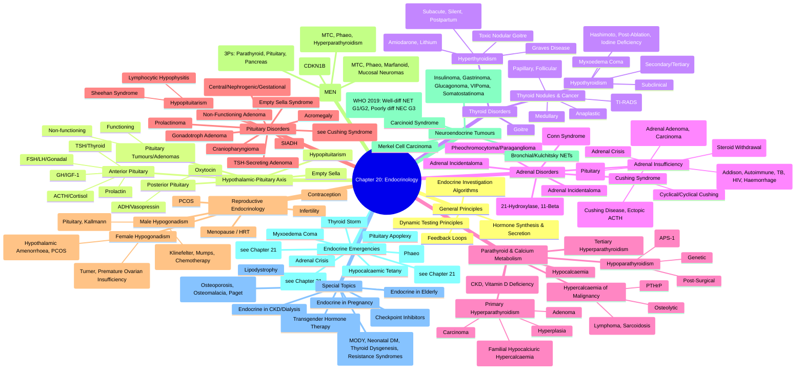

# Davidson Chapter 20 — Endocrinology Hierarchy

> [!info]
> **Chapter 20: Endocrinology** (Davidson 24th Edition) — Hormone axes, gland disorders, emergency presentations, MEN syndromes, neuroendocrine tumours. Structured for FCPS/MRCP exam preparation.

---

## Chapter Map

---

## Topic Inventory

### 📂 1. General Principles
| # | Topic | Status |
|---|-------|--------|
| 1 | Hormone Synthesis, Secretion & Transport | full-fcps-mrcp-note |
| 2 | Feedback Loops (Negative/Positive/Ultra-short) | full-fcps-mrcp-note |
| 3 | Dynamic Testing Principles (Stimulation/Suppression) | full-fcps-mrcp-note |
| 4 | Endocrine Investigation Algorithms | full-fcps-mrcp-note |

### 📂 2. Hypothalamic-Pituitary Axis
| # | Topic | Status |
|---|-------|--------|
| 5 | Anterior Pituitary Hormones Overview | full-fcps-mrcp-note |
| 6 | ACTH/Cortisol Axis | full-fcps-mrcp-note |
| 7 | TSH/Thyroid Axis | full-fcps-mrcp-note |
| 8 | GH/IGF-1 Axis | full-fcps-mrcp-note |
| 9 | FSH/LH/Gonadal Axis | full-fcps-mrcp-note |
| 10 | Prolactin Axis | full-fcps-mrcp-note |
| 11 | Posterior Pituitary: ADH/Vasopressin | full-fcps-mrcp-note |
| 12 | Posterior Pituitary: Oxytocin | full-fcps-mrcp-note |
| 13 | Pituitary Adenomas: Functioning | full-fcps-mrcp-note |
| 14 | Pituitary Adenomas: Non-Functioning | full-fcps-mrcp-note |
| 15 | Hypopituitarism | full-fcps-mrcp-note |
| 16 | Empty Sella Syndrome | full-fcps-mrcp-note |
| 17 | Pituitary Apoplexy | full-fcps-mrcp-note |
| 18 | Craniopharyngioma | full-fcps-mrcp-note |

### 📂 3. Thyroid Disorders
| # | Topic | Status |
|---|-------|--------|
| 19 | Hyperthyroidism Overview | full-fcps-mrcp-note |
| 20 | Graves Disease | full-fcps-mrcp-note |
| 21 | Toxic Nodular Goitre | full-fcps-mrcp-note |
| 22 | Thyroiditis (Subacute, Silent, Postpartum) | full-fcps-mrcp-note |
| 23 | Drug-Induced Thyroid Dysfunction | full-fcps-mrcp-note |
| 24 | Hypothyroidism Overview | full-fcps-mrcp-note |
| 25 | Primary Hypothyroidism (Hashimoto) | full-fcps-mrcp-note |
| 26 | Central Hypothyroidism | full-fcps-mrcp-note |
| 27 | Subclinical Thyroid Disease | full-fcps-mrcp-note |
| 28 | Myxoedema Coma | full-fcps-mrcp-note |
| 29 | Thyroid Nodule Evaluation (TI-RADS) | full-fcps-mrcp-note |
| 30 | Differentiated Thyroid Cancer (Papillary/Follicular) | full-fcps-mrcp-note |
| 31 | Medullary Thyroid Cancer | full-fcps-mrcp-note |
| 32 | Anaplastic Thyroid Cancer | full-fcps-mrcp-note |
| 33 | Goitre Management | full-fcps-mrcp-note |

### 📂 4. Adrenal Disorders
| # | Topic | Status |
|---|-------|--------|
| 34 | Cushing Syndrome Overview | full-fcps-mrcp-note |
| 35 | Cushing Disease (Pituitary ACTH) | full-fcps-mrcp-note |
| 36 | Ectopic ACTH Syndrome | full-fcps-mrcp-note |
| 37 | Adrenal Cushing (Adenoma/Carcinoma) | full-fcps-mrcp-note |
| 38 | Cyclical Cushing | full-fcps-mrcp-note |
| 39 | Adrenal Insufficiency: Primary (Addison) | full-fcps-mrcp-note |
| 40 | Adrenal Insufficiency: Secondary/Tertiary | full-fcps-mrcp-note |
| 41 | Adrenal Crisis | full-fcps-mrcp-note |
| 42 | Congenital Adrenal Hyperplasia | full-fcps-mrcp-note |
| 43 | Adrenal Incidentaloma | full-fcps-mrcp-note |
| 44 | Pheochromocytoma/Paraganglioma | full-fcps-mrcp-note |
| 45 | Primary Aldosteronism (Conn Syndrome) | full-fcps-mrcp-note |
| 46 | Adrenal Incidentaloma (repeat - consolidate) | full-fcps-mrcp-note |

### 📂 5. Parathyroid & Calcium Metabolism
| # | Topic | Status |
|---|-------|--------|
| 47 | Primary Hyperparathyroidism | full-fcps-mrcp-note |
| 48 | Secondary Hyperparathyroidism (CKD) | full-fcps-mrcp-note |
| 49 | Tertiary Hyperparathyroidism | full-fcps-mrcp-note |
| 50 | Hypoparathyroidism | full-fcps-mrcp-note |
| 51 | FHH (Familial Hypocalciuric Hypercalcaemia) | full-fcps-mrcp-note |
| 52 | Hypercalcaemia of Malignancy | full-fcps-mrcp-note |
| 53 | Hypocalcaemia (Acute & Chronic) | full-fcps-mrcp-note |
| 54 | Osteoporosis & Metabolic Bone Disease | full-fcps-mrcp-note |
| 55 | Vitamin D Metabolism & Deficiency | full-fcps-mrcp-note |

### 📂 6. Pituitary Disorders (Dedicated)
| # | Topic | Status |
|---|-------|--------|
| 56 | Acromegaly | full-fcps-mrcp-note |
| 57 | Prolactinoma | full-fcps-mrcp-note |
| 58 | TSH-Secreting Adenoma | full-fcps-mrcp-note |
| 59 | Gonadotroph Adenoma | full-fcps-mrcp-note |
| 60 | Non-Functioning Adenoma | full-fcps-mrcp-note |
| 61 | Hypopituitarism (Sheehan, Lymphocytic Hypophysitis) | full-fcps-mrcp-note |
| 62 | Empty Sella Syndrome | full-fcps-mrcp-note |
| 63 | Craniopharyngioma | full-fcps-mrcp-note |
| 64 | Diabetes Insipidus (Central/Nephrogenic/Gestational) | full-fcps-mrcp-note |
| 65 | SIADH | full-fcps-mrcp-note |

### 📂 7. Reproductive Endocrinology
| # | Topic | Status |
|---|-------|--------|
| 66 | Male Hypogonadism | full-fcps-mrcp-note |
| 67 | Female Hypogonadism | full-fcps-mrcp-note |
| 68 | PCOS | full-fcps-mrcp-note |
| 69 | Menopause & HRT | full-fcps-mrcp-note |
| 70 | Infertility (Endocrine Causes) | full-fcps-mrcp-note |
| 71 | Contraception (Endocrine Aspects) | full-fcps-mrcp-note |

### 📂 8. Multiple Endocrine Neoplasia (MEN)
| # | Topic | Status |
|---|-------|--------|
| 72 | MEN1 | full-fcps-mrcp-note |
| 73 | MEN2A | full-fcps-mrcp-note |
| 74 | MEN2B | full-fcps-mrcp-note |
| 75 | MEN4 | full-fcps-mrcp-note |

### 📂 9. Neuroendocrine Tumours
| # | Topic | Status |
|---|-------|--------|
| 76 | Carcinoid Syndrome | full-fcps-mrcp-note |
| 77 | Pancreatic NETs (Insulinoma, Gastrinoma, Glucagonoma, VIPoma, Somatostatinoma) | full-fcps-mrcp-note |
| 78 | Bronchial/Kulchitsky NETs | full-fcps-mrcp-note |
| 79 | Merkel Cell Carcinoma | full-fcps-mrcp-note |
| 80 | WHO 2019 Grading (NET G1/G2, NEC G3) | full-fcps-mrcp-note |

### 📂 10. Endocrine Emergencies
| # | Topic | Status |
|---|-------|--------|
| 81 | Adrenal Crisis | full-fcps-mrcp-note |
| 82 | Thyroid Storm | full-fcps-mrcp-note |
| 83 | Myxoedema Coma | full-fcps-mrcp-note |
| 84 | Pituitary Apoplexy | full-fcps-mrcp-note |
| 85 | Hypertensive Crisis (Phaeochromocytoma) | full-fcps-mrcp-note |
| 86 | Hypocalcaemic Tetany | full-fcps-mrcp-note |

### 📂 11. Special Topics
| # | Topic | Status |
|---|-------|--------|
| 87 | Endocrine in Pregnancy | full-fcps-mrcp-note |
| 88 | Endocrine in Elderly | full-fcps-mrcp-note |
| 89 | Endocrine in CKD/Dialysis | full-fcps-mrcp-note |
| 90 | Transgender Hormone Therapy | full-fcps-mrcp-note |
| 91 | Endocrine Complications of Immunotherapy (Checkpoint Inhibitors) | full-fcps-mrcp-note |
| 92 | Genetic Endocrinology (MODY, Neonatal DM, Thyroid Dysgenesis, Resistance Syndromes) | full-fcps-mrcp-note |
| 93 | Lipodystrophy Syndromes | full-fcps-mrcp-note |
| 94 | Metabolic Bone Disease (Osteoporosis, Osteomalacia, Paget) | full-fcps-mrcp-note |

---

## Total Topics: **94** disease-level topics across 11 theme groups

---

## Navigation Index

| Theme Group | File/Hub |
|-------------|----------|
| **Chapter Hierarchy** | `Davidson Chapter 20 - Endocrinology Hierarchy.md` (this file) |
| **Chapter MOC** | `Endocrinology MOC.md` |
| **General Principles** | `General Principles.md` (hub) |
| **Hypothalamic-Pituitary Axis** | `Hypothalamic-Pituitary Axis.md` (hub) |
| **Thyroid Disorders** | `Thyroid Disorders.md` (hub) |
| **Adrenal Disorders** | `Adrenal Disorders.md` (hub) |
| **Parathyroid & Calcium** | `Parathyroid & Calcium.md` (hub) |
| **Pituitary Disorders** | `Pituitary Disorders.md` (hub) |
| **Reproductive Endocrinology** | `Reproductive Endocrinology.md` (hub) |
| **MEN Syndromes** | `Multiple Endocrine Neoplasia.md` (hub) |
| **Neuroendocrine Tumours** | `Neuroendocrine Tumours.md` (hub) |
| **Endocrine Emergencies** | `Endocrine Emergencies.md` (hub) |
| **Special Topics** | `Special Topics.md` (hub) |
| **Template** | `../../Templates/Endocrinology Topic Template.md` |

---

## Status Key
- `scaffold` = scaffold file created, needs full content
- `full-fcps-mrcp-note` = complete FCPS/MRCP note
- `scaffold-hub` = hub file (parent folder index)

---

## Creation Instructions
1. Create all hub files (11 theme group hubs) from this hierarchy
2. Create 94 disease-level topic files following **Diabetes Topic Template** (14-section Davidson standard)
2. Convert to `full-fcps-mrcp-note` status progressively
3. Update this hierarchy with actual status as files are completed