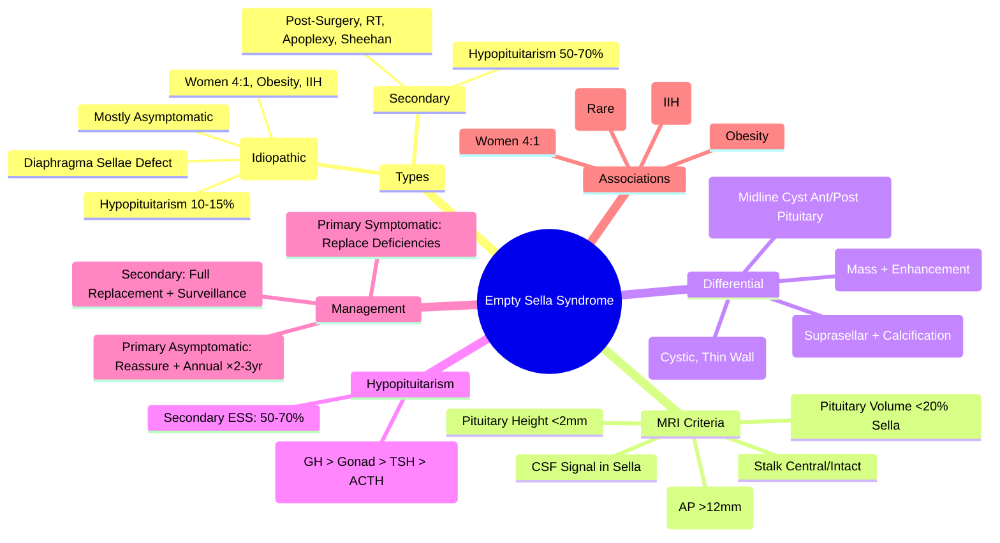
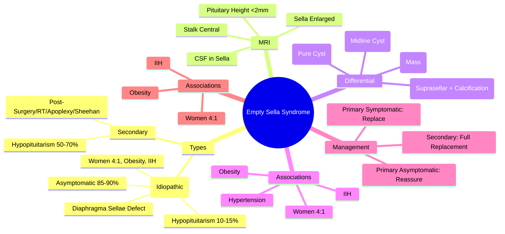

# Empty Sella Syndrome

> [!info]
> **Empty Sella Syndrome (ESS) = Enlarged Sella Turcica with Flattened/Attenuated Pituitary Gland.** Primary (Idiopathic) vs Secondary (Post-Surgery/RT/Sheehan). Most are **Asymptomatic Incidental Findings**; Hypopituitarism in 10-15%. **Not a tumour**.

---

## 1. Learning Objectives
By the end of this note you should be able to:
- [ ] Define Empty Sella Syndrome and classify Primary vs Secondary
- [ ] Recognise radiological criteria on MRI/CT
- [ ] Differentiate from Pituitary Adenoma, Arachnoid Cyst, Craniopharyngioma
- [ ] Assess pituitary function and manage hypopituitarism if present
- [ ] Counsel patients on prognosis and surveillance

---

## 2. Definition & Classification

| Type | Definition | Mechanism |
|--------|------------|-----------|
| **Primary (Idiopathic) ESS** | **Enlarged Sella + Atresia of Diaphragma Sellae** → CSF Pulsations → Pituitary Flattening | Congenital Diaphragma Sellae Defect → CSF Pulsations → Pituitary Atrophy |
| **Secondary ESS** | **Post-Destructive** (Surgery, Radiotherapy, Haemorrhage, Infection, Sheehan Syndrome) | Pituitary Destruction → CSF Fills Sella |

| Feature | **Primary ESS** | **Secondary ESS** |
|--------|-----------------|-------------------|
| **Aetiology** | Congenital Diaphragma Sellae Defect | Pituitary Destruction (Surgery, RT, Apoplexy, Sheehan, Infection) |
| **Demographics** | **Women > Men (4:1)**; 30-60 years | Any Age; Post-Surgery/RT/Sheehan |
| **Pituitary Height** | <2mm (Flattened) | Variable |
| **Pituitary Function** | **Mostly Normal** (85-90%) | **Hypopituitarism Common** (50-70%) |
| **Associated Conditions** | Obesity, Hypertension, Idiopathic Intracranial Hypertension | Sheehan, Post-Surgery, RT, Apoplexy |

---

## 3. Radiological Diagnosis (MRI)

### Diagnostic Criteria (MRI)
| Criterion | Finding |
|-----------|---------|
| **Sella Volume** | **Enlarged** (Volume >1000 mm³ or Area >500 mm²) |
| **Pituitary Height** | **<2mm** (Flattened against Sella Floor) |
| **Pituitary Volume** | **<20% of Sella Volume** |
| **CSF Signal** | **CSF Signal Intensity** Filling Sella (T1 Hypointense, T2 Hyperintense) |
| **Pituitary Stalk** | **Central / Slightly Deviated**; Intact |
| **Diaphragma Sellae** | **Incompetent/Absent** (CSF Pulsations Visible) |

### Imaging Modalities
| Modality | Role |
|-----------|------|
| **MRI (T1/T2, Sagittal/Coronal, 3mm)** | **Gold Standard**; Pituitary Gland, Stalk, Optic Chiasm, Diaphragma |
| **CT (Thin Slices)** | Bony Sella Enlargement; Calcifications; If MRI Contraindicated |

### Differential Diagnosis on Imaging
| Finding | **Empty Sella** | **Pituitary Adenoma** | **Arachnoid Cyst** | **Craniopharyngioma** |
|---------|----------------|-----------------------|-------------------|----------------------|
| **Pituitary Gland** | Flattened (<2mm) | **Mass Expanding Sella** | Absent/Displaced | Displaced/Invaded |
| **CSF in Sella** | **Yes (Fills Sella)** | No (Solid/Cystic) | Yes (CSF Signal) | Cystic + Solid (Calcifications) |
| **Pituitary Stalk** | Central | Displaced/Encased | Displaced | Displaced/Invaded |
| **Diaphragma Sellae** | Incompetent | Intact | Intact | Intact/Disrupted |
| **Enhancement** | None (Pituitary Thin) | **Avid Enhancement** | No Enhancement | Rim + Solid Enhancement + Calcifications |

---

## 4. Clinical Presentation

| Scenario | Frequency | Details |
|----------|-----------|---------|
| **Asymptomatic Incidentaloma** | **85-90% (Primary ESS)** | Found on MRI for Headache/Dizziness/Trauma |
| **Headache** | 20-30% | Non-specific; May Relate to Intracranial Hypertension |
| **Visual Disturbances** | <10% | Chiasmal Compression (Rare; ESS Usually No Chiasmal Compression) |
| **Hypopituitarism** | **10-15% (Primary ESS)**; **50-70% (Secondary ESS)** | GH > Gonadotrophs > TSH > ACTH |
| **Cerebrospinal Fluid Leak** | Rare | CSF Rhinorrhoea (Defective Diaphragma Sellae) |
| **Idiopathic Intracranial Hypertension (IIH)** | Association | Obese Women; Papilloedema; ESS Common in IIH |

### Hypopituitarism in ESS
| Axis | Frequency (Primary ESS) | Frequency (Secondary ESS) |
|------|------------------------|---------------------------|
| **GH** | 10-15% | 40-50% |
| **Gonadotrophs** | 5-10% | 30-40% |
| **TSH** | 5-10% | 20-30% |
| **ACTH** | <5% | 10-20% |

**Order of Loss**: GH → Gonadotrophs → TSH → ACTH (Same as General Hypopituitarism)

---

## 5. Aetiology & Pathophysiology

### Primary (Idiopathic) ESS
| Mechanism | Details |
|-----------|---------|
| **Diaphragma Sellae Defect** | Congenital Incompetence/Absence of Diaphragma Sellae |
| **CSF Pulsations** | Pulsatile CSF Pressure → Pituitary Flattening Against Sella Floor |
| **Risk Factors** | Female Gender, Obesity, **Idiopathic Intracranial Hypertension (IIH)**, Hypertension |
| **Pituitary Function** | **Mostly Preserved** (Pituitary Tissue Compressed but Viable) |

### Secondary ESS
| Cause | Mechanism |
|-------|----------|
| **Pituitary Surgery** | Transsphenoidal Resection → Pituitary Volume Loss |
| **Radiotherapy** | Radiation-Induced Atrophy + Fibrosis |
| **Pituitary Apoplexy** | Haemorrhagic Infarction → Necrosis + CSF Replacement |
| **Sheehan Syndrome** | Postpartum Pituitary Necrosis → Empty Sella |
| **Radiation Necrosis** | Delayed (Years Post-RT) |
| **Infection/Inflammation** | Meningitis, Sarcoidosis, Lymphocytic Hypophysitis |

---

## 6. Clinical Presentation

| Symptom | Frequency | Significance |
|---------|-----------|--------------|
| **Asymptomatic** | **80-90% (Primary)** | Incidental MRI Finding |
| **Headache** | 20-30% | Non-specific; May Relate to IIH |
| **Visual Disturbances** | <5% | ESS Usually **Does Not Compress Chiasm** (Unlike Adenoma) |
| **Hypopituitarism** | 10-15% (Primary) | Screen if Symptomatic |
| **CSF Rhinorrhoea** | Rare | Defective Diaphragma Sellae |
| **Secondary ESS** | 50-70% Hypopituitarism | Sheehan, Post-Surgery, RT, Apoplexy |

---

## 7. Diagnosis

### MRI Diagnostic Criteria (Primary ESS)
| Criterion | Threshold |
|-----------|-----------|
| **Sella Enlargement** | Anteroposterior Diameter >12mm (or Volume >1000 mm³) |
| **Pituitary Height** | **<2mm** (or <3mm in some definitions) |
| **Pituitary Volume** | <20% of Sella Volume |
| **CSF in Sella** | CSF Signal Intensity (T2 Hyperintense) Filling Sella |
| **Pituitary Stalk** | **Central / Slightly Deviated**, Intact |
| **Diaphragma Sellae** | Incompetent/Absent (Visible CSF Pulsations) |

### Assessment of Pituitary Function (All ESS)
| Axis | Tests | Interpretation |
|------|-------|----------------|
| **GH/IGF-1** | IGF-1 (Age-Adjusted) | Low = GHD |
| **Gonadal** | LH/FSH + Testosterone/Oestradiol | Low = Central Hypogonadism |
| **Thyroid** | fT4 + TSH | Low fT4 + Low/Normal TSH = Central Hypo |
| **Adrenal** | 09:00 Cortisol + ACTH | Low Cortisol + Low/Normal ACTH = Secondary AI |
| **Prolactin** | Prolactin | Normal or Mildly ↑ (Stalk Effect) |

---

## 8. Management

### Asymptomatic Primary ESS (Normal Pituitary Function)
| Approach | Details |
|----------|---------|
| **Reassurance** | **Not a Tumour**; Benign Radiological Finding |
| **Surveillance** | **Annual Clinical Review** for 2-3 Years; Repeat MRI if New Symptoms |
| **Hormonal Screening** | Baseline Hormones; Repeat if Symptoms Develop |

### Symptomatic Primary ESS (Hypopituitarism)
| Deficiency | Replacement |
|-----------|----------|
| **GH Deficiency** | RH-GH 0.1-0.3 mg/day SC (Adults); 0.025-0.035 mg/kg/day (Children) |
| **Gonadotroph Deficiency** | Testosterone (Male) / HRT (Female) |
| **TSH Deficiency** | **Levothyroxine** (Start BEFORE Glucocorticoid) |
| **ACTH Deficiency** | **Hydrocortisone 15-20mg AM + 5-10mg PM** |
| **Monitoring** | Annual Hormones for 2-3 Years; Then if Stable, Less Frequent |

### Secondary ESS (Post-Surgery/RT/Sheehan)
| Approach | Details |
|----------|---------|
| **Full Hormonal Assessment** | All Anterior Pituitary Axes + Prolactin |
| **Aggressive Replacement** | Higher Likelihood of Panhypopituitarism |
| **Sheehan Syndrome** | Agalactorrhoea + Amenorrhoea + Hair Loss; Empty Sella on MRI; Lifelong Replacement |
| **Post-RT** | Surveillance for 10+ Years (Delayed Hypopituitarism) |
| **Post-Surgery** | Immediate Post-op Hormonal Assessment; Replace if Deficient |

---

## 9. Differential Diagnosis

| Condition | Key Differentiators |
|-----------|---------------------|
| **Pituitary Adenoma** | Solid Mass Expanding Sella; Enhancement; Stalk Displacement |
| **Arachnoid Cyst** | Cystic, CSF Signal, Thin Wall, No Pituitary Tissue |
| **Craniopharyngioma** | Suprasellar; Calcifications; Rim Enhancement; Stalk Displacement |
| **Rathke's Cleft Cyst** | Midline Cystic; No Enhancement; Between Ant/Post Pituitary |
| **Meningioma** | Dural Tail; Homogeneous Enhancement; Suprasellar |
| **Hypothalamic Glioma** | Suprasellar; Infiltrative; Optic Pathway Involvement |

---

## 10. Exam Pearls (FCPS/MRCP)

| Topic | Key Point |
|-------|-----------|
| **ESS Definition** | Sella Enlarged + Pituitary Flattened (<2mm) + CSF-filled Sella |
| **Primary vs Secondary** | Primary = Idiopathic (Diaphragma Defect); Secondary = Post-Surgery/RT/Sheehan |
| **Primary ESS Demographics** | **Women 4:1**; Age 30-60; Obesity, Hypertension, IIH Association |
| **Symptoms** | **85-90% Asymptomatic** (Incidental); Headache 20-30%; Visual Loss Rare |
| **Hypopituitarism in Primary ESS** | **10-15%** (Mostly GH/Gonadotrophs); ACTH Rare |
| **Hypopituitarism in Secondary ESS** | **50-70%** (Sheehan, Post-Surgery, RT) |
| **ESS vs Adenoma** | ESS = Flattened Pituitary + CSF in Sella; Adenoma = Mass + Enhancement |
| **ESS vs Arachnoid Cyst** | Arachnoid Cyst = Cystic + Thin Wall; ESS = Pituitary Tissue Present (Flattened) |
| **Pituitary Stalk in ESS** | **Central / Intact** (vs Displaced in Adenoma) |
| **Visual Fields in ESS** | **Usually Normal** (No Chiasmal Compression) |
| **CSF Rhinorrhoea** | Rare; Defective Diaphragma Sellae |
| **IIH Association** | ESS Common in IIH (Obese Women, Papilloedema) |
| **Management Primary ESS** | Asymptomatic = Reassure + Annual Review; Symptomatic = Replace Deficiencies |

---

## 11. Confusions & Mnemonics

| Confusion | Clarification |
|-----------|---------------|
| **ESS vs Pituitary Adenoma** | ESS = Flattened Pituitary + CSF in Sella; Adenoma = Mass + Enhancement |
| **ESS vs Arachnoid Cyst** | Arachnoid Cyst = Pure Cystic CSF; ESS = Flattened Pituitary Tissue Present |
| **Primary vs Secondary ESS** | Primary = Idiopathic (Women, Obesity, IIH); Secondary = Post-Surgery/RT/Sheehan |
| **ESS vs Sheehan** | Sheehan = Postpartum Necrosis → Secondary ESS; Primary ESS = Idiopathic |
| **ESS vs Rathke's Cyst** | Rathke's = Midline Cyst Between Ant/Post Pituitary; ESS = Flattened Pituitary in Sella |
| **Visual Fields in ESS** | Usually Normal (No Chiasmal Compression) |
| **Pituitary Stalk in ESS** | Central/Intact (vs Displaced in Adenoma) |

**Mnemonic: EMPTY SELLA**
- **E**mpty = Pituitary Flattened <2mm
- **M**ostly Women (4:1)
- **P**rimary (Idiopathic) vs **S**econdary (Surgery/RT/Sheehan)
- **T**hyroid/Adrenal/Gonadal Usually Normal (Primary)
- **Y**oung Women: Obesity + IIH Association
- **S**ella Enlarged + CSF Filled
- **E**SS = Incidentaloma 85-90%
- **L**eads to Hypopituitarism Rarely (10-15% Primary)
- **L**eads to HYPOPIT in Secondary (50-70%)
- **A**s Symptomatic = Replace Deficiencies

---

## 12. Mind Map

---

## 13. Exam Pearls (FCPS/MRCP)

| Topic | Key Point |
|-------|-----------|
| **ESS Definition** | Enlarged Sella + Pituitary Height <2mm + CSF in Sella |
| **Primary ESS** | Idiopathic; Women 4:1; Obesity/IIH; 10-15% Hypopituitarism |
| **Secondary ESS** | Post-Surgery/RT/Sheehan/Apoplexy; 50-70% Hypopituitarism |
| **ESS vs Adenoma** | ESS = Flattened Pituitary + CSF; Adenoma = Mass + Enhancement |
| **ESS vs Arachnoid Cyst** | Arachnoid = Pure Cyst; ESS = Flattened Pituitary Tissue |
| **Primary ESS Hypopituitarism** | 10-15% (GH > Gonad > TSH > ACTH) |
| **Secondary ESS Hypopituitarism** | 50-70% |
| **Pituitary Stalk in ESS** | Central / Intact (vs Displaced in Adenoma) |
| **Visual Fields in ESS** | Usually Normal (No Chiasmal Compression) |
| **Primary ESS Management** | Asymptomatic = Reassure + Annual Review ×2-3yr |
| **Secondary ESS Management** | Full Hormonal Replacement + Lifelong Surveillance |
| **Sheehan Syndrome** | Postpartum Necrosis → Secondary ESS + Panhypopituitarism |
| **IIH Association** | ESS Common in IIH (Obese Women, Papilloedema) |

---

## 14. Mind Map

---

## 15. Local Navigation (for Dashboard UI)

> **Parent**: [[../Hypothalamic-Pituitary Axis|Hypothalamic-Pituitary Axis]]  
> **Hierarchy**: [[../../Davidson Chapter 20 - Endocrinology Hierarchy|Endocrinology Hierarchy]]  
> **Template**: [[../../../Templates/Endocrinology Topic Template|Endocrinology Topic Template]]  
> **See also**: [[Hypopituitarism]], [[Sheehan Syndrome]], [[Pituitary Adenomas: Non-Functioning]], [[Pituitary Apoplexy]], [[Craniopharyngioma]]
## 16. MCQs (10)
1. **Empty sella syndrome =**
   A. CSF herniation into sella turcica (primary or secondary); may cause hypopituitarism
   B. Pituitary adenoma
   C. Craniopharyngioma
   D. Meningioma
   E. Normal variant only

2. **Primary empty sella:**
   A. Idiopathic CSF herniation; often asymptomatic; common in obese women with hypertension
   B. Post-surgery
   C. Post-RT
   D. Post-haemorrhage
   E. Genetic

3. **Secondary empty sella:**
   A. Post-pituitary surgery/RT/haemorrhage; pituitary atrophy
   B. Idiopathic
   C. Genetic
   D. Infectious
   E. Autoimmune

4. **Empty sella presentation:**
   A. Often asymptomatic; headache; visual field defects if chiasm compression; hypopituitarism
   B. Acute headache only
   C. Sudden visual loss only
   D. Acute hormonal crisis
   E. Never asymptomatic

5. **Empty sella diagnosis:**
   A. MRI: CSF in sella, flattened pituitary; CSF signal on T1/T2
   B. CT only
   C. X-ray
   D. Clinical only
   E. Hormones only

6. **Empty sella management:**
   A. Screen for hypopituitarism; reassure if normal; treat hormone deficiencies
   B. Surgery always
   C. RT always
   D. Dopamine agonists
   E. No treatment

7. **Empty sella hypopituitarism:**
   A. GH deficiency most common; then gonadotrophins, TSH, ACTH
   B. ACTH most common
   C. TSH most common
   D. Prolactin most common
   E. ADH most common

8. **Primary empty sella demographics:**
   A. Obese women 30-50yr with hypertension
   B. Men only
   C. Children only
   D. Elderly men
   E. Thin women

9. **Empty sella vs pituitary adenoma:**
   A. MRI: CSF signal in sella (empty sella) vs enhancing mass (adenoma)
   B. Same appearance
   C. CT better
   D. X-ray better
   E. Clinical only

10. **Empty sella and pregnancy:**
   A. Physiological pituitary enlargement may fill sella; monitor for hypopituitarism
   B. No effect
   C. Contraindicated
   D. Always causes DI
   E. Always causes SIADH

## 17. SBA Questions (10)
1. **40yo woman: incidental empty sella on MRI, normal hormones. Management?**
   A. Reassure; screen for hypopituitarism annually; no surgery
   B. Surgery
   C. RT
   D. Dopamine agonist
   E. No follow-up needed

2. **Same patient: 2yr later develops fatigue, amenorrhoea. Hormones: low LH/FSH, TSH, cortisol. Management?**
   A. Hormone replacement (levothyroxine, sex hormones, hydrocortisone); monitor
   B. Surgery
   C. RT
   D. Dopamine agonist
   E. Observation

3. **Post-pituitary surgery: empty sella on MRI, panhypopituitarism. Cause?**
   A. Secondary empty sella (post-surgical atrophy)
   B. Primary empty sella
   C. Pituitary apoplexy
   D. Craniopharyngioma
   E. Meningioma

4. **Empty sella with visual field defects. Management?**
   A. Ophthalmology referral; consider surgery if chiasm compression
   B. Observation
   C. Dopamine agonist
   D. RT
   E. No treatment

5. **Empty sella in pregnancy. Monitoring?**
   A. Screen for hypopituitarism; physiological pituitary enlargement may fill sella
   B. Terminate pregnancy
   C. Surgery
   D. Dopamine agonist
   E. No monitoring needed

## 18. Flashcards
- **Q: Empty sella**
  **A: CSF herniation into sella; primary (idiopathic) or secondary (post-surgical/RT/haemorrhage)**

- **Q: Primary empty sella**
  **A: Obese hypertensive women 30-50yr; often asymptomatic**

- **Q: Secondary empty sella**
  **A: Post-pituitary surgery/RT/haemorrhage; pituitary atrophy**

- **Q: Diagnosis**
  **A: MRI: CSF signal in sella, flattened pituitary**

- **Q: Hypopituitarism**
  **A: GH deficiency most common; then gonadotrophins, TSH, ACTH**

- **Q: Management**
  **A: Screen for hypopituitarism; treat deficiencies; reassure if normal**

- **Q: Primary demographics**
  **A: Obese women 30-50yr with hypertension**

- **Q: Secondary cause**
  **A: Post-pituitary surgery/RT/haemorrhage**

- **Q: Pregnancy**
  **A: Physiological pituitary enlargement may fill sella; monitor for hypopituitarism**

- **Q: Surgery**
  **A: Only if chiasm compression with visual loss**

## 19. Answer Key with Explanations
### MCQs
1. **CSF herniation into sella turcica (primary or secondary); may cause hypopituitarism** — Empty sella syndrome =

2. **Idiopathic CSF herniation; often asymptomatic; common in obese women with hypertension** — Primary empty sella:

3. **Post-pituitary surgery/RT/haemorrhage; pituitary atrophy** — Secondary empty sella:

4. **Often asymptomatic; headache; visual field defects if chiasm compression; hypopituitarism** — Empty sella presentation:

5. **MRI: CSF in sella, flattened pituitary; CSF signal on T1/T2** — Empty sella diagnosis:

6. **Screen for hypopituitarism; reassure if normal; treat hormone deficiencies** — Empty sella management:

7. **GH deficiency most common; then gonadotrophins, TSH, ACTH** — Empty sella hypopituitarism:

8. **Obese women 30-50yr with hypertension** — Primary empty sella demographics:

9. **MRI: CSF signal in sella (empty sella) vs enhancing mass (adenoma)** — Empty sella vs pituitary adenoma:

10. **Physiological pituitary enlargement may fill sella; monitor for hypopituitarism** — Empty sella and pregnancy:

### SBAs
1. **Reassure; screen for hypopituitarism annually; no surgery** — 40yo woman: incidental empty sella on MRI, normal hormones. Management?

2. **Hormone replacement (levothyroxine, sex hormones, hydrocortisone); monitor** — Same patient: 2yr later develops fatigue, amenorrhoea. Hormones: low LH/FSH, TSH, cortisol. Management?

3. **Secondary empty sella (post-surgical atrophy)** — Post-pituitary surgery: empty sella on MRI, panhypopituitarism. Cause?

4. **Ophthalmology referral; consider surgery if chiasm compression** — Empty sella with visual field defects. Management?

5. **Screen for hypopituitarism; physiological pituitary enlargement may fill sella** — Empty sella in pregnancy. Monitoring?
---

> Auto-generated study sections for "Endocrinology" — Ch 20: Endocrinology.

## Flashcards (67 generated)

- Q: What is Sella Volume of Endocrinology?
  A: Enlarged (Volume >1000 mm³ or Area >500 mm²)
- Q: What is Pituitary Height of Endocrinology?
  A: <2mm (Flattened against Sella Floor)
- Q: What is Pituitary Volume of Endocrinology?
  A: <20% of Sella Volume
- Q: What is CSF Signal of Endocrinology?
  A: CSF Signal Intensity Filling Sella (T1 Hypointense, T2 Hyperintense)
- Q: What is Pituitary Stalk of Endocrinology?
  A: Central / Slightly Deviated; Intact
- Q: What is Diaphragma Sellae of Endocrinology?
  A: Incompetent/Absent (CSF Pulsations Visible)
- Q: What is Diaphragma Sellae Defect of Endocrinology?
  A: Congenital Incompetence/Absence of Diaphragma Sellae
- Q: What is CSF Pulsations of Endocrinology?
  A: Pulsatile CSF Pressure → Pituitary Flattening Against Sella Floor
- Q: What causes Endocrinology?
  A: Female Gender, Obesity, Idiopathic Intracranial Hypertension (IIH), Hypertension
- Q: What is Pituitary Function of Endocrinology?
  A: Mostly Preserved (Pituitary Tissue Compressed but Viable)
- Q: What is Pituitary Surgery of Endocrinology?
  A: Transsphenoidal Resection → Pituitary Volume Loss
- Q: How is Endocrinology managed?
  A: Radiation-Induced Atrophy + Fibrosis
- Q: What is Pituitary Apoplexy of Endocrinology?
  A: Haemorrhagic Infarction → Necrosis + CSF Replacement
- Q: What is Sheehan Syndrome of Endocrinology?
  A: Postpartum Pituitary Necrosis → Empty Sella
- Q: What is Radiation Necrosis of Endocrinology?
  A: Delayed (Years Post-RT)
- Q: What is Infection/Inflammation of Endocrinology?
  A: Meningitis, Sarcoidosis, Lymphocytic Hypophysitis
- Q: What is Sella Enlargement of Endocrinology?
  A: Anteroposterior Diameter >12mm (or Volume >1000 mm³)
- Q: What is Pituitary Height of Endocrinology?
  A: <2mm (or <3mm in some definitions)
- Q: What is Pituitary Volume of Endocrinology?
  A: <20% of Sella Volume
- Q: What is CSF in Sella of Endocrinology?
  A: CSF Signal Intensity (T2 Hyperintense) Filling Sella
- Q: What is Pituitary Stalk of Endocrinology?
  A: Central / Slightly Deviated, Intact
- Q: What is Diaphragma Sellae of Endocrinology?
  A: Incompetent/Absent (Visible CSF Pulsations)
- Q: What is the definition of Endocrinology?
  A: Sella Enlarged + Pituitary Flattened (<2mm) + CSF-filled Sella
- Q: What is Primary vs Secondary of Endocrinology?
  A: Primary = Idiopathic (Diaphragma Defect); Secondary = Post-Surgery/RT/Sheehan
- Q: What is Primary ESS Demographics of Endocrinology?
  A: Women 4:1; Age 30-60; Obesity, Hypertension, IIH Association
- Q: What are the clinical features of Endocrinology?
  A: 85-90% Asymptomatic (Incidental); Headache 20-30%; Visual Loss Rare
- Q: What is Hypopituitarism in Primary ESS of Endocrinology?
  A: 10-15% (Mostly GH/Gonadotrophs); ACTH Rare
- Q: What is Hypopituitarism in Secondary ESS of Endocrinology?
  A: 50-70% (Sheehan, Post-Surgery, RT)
- Q: What is ESS vs Adenoma of Endocrinology?
  A: ESS = Flattened Pituitary + CSF in Sella; Adenoma = Mass + Enhancement
- Q: What is ESS vs Arachnoid Cyst of Endocrinology?
  A: Arachnoid Cyst = Cystic + Thin Wall; ESS = Pituitary Tissue Present (Flattened)
- Q: What is Pituitary Stalk in ESS of Endocrinology?
  A: Central / Intact (vs Displaced in Adenoma)
- Q: What is Visual Fields in ESS of Endocrinology?
  A: Usually Normal (No Chiasmal Compression)
- Q: What is CSF Rhinorrhoea of Endocrinology?
  A: Rare; Defective Diaphragma Sellae
- Q: What is IIH Association of Endocrinology?
  A: ESS Common in IIH (Obese Women, Papilloedema)
- Q: How is Endocrinology managed?
  A: Asymptomatic = Reassure + Annual Review; Symptomatic = Replace Deficiencies
- Q: What is Sella Volume of Endocrinology?
  A: Enlarged (Volume >1000 mm³ or Area >500 mm²)
- Q: What is Pituitary Height of Endocrinology?
  A: <2mm (Flattened against Sella Floor)
- Q: What is Pituitary Volume of Endocrinology?
  A: <20% of Sella Volume
- Q: What is CSF Signal of Endocrinology?
  A: CSF Signal Intensity Filling Sella (T1 Hypointense, T2 Hyperintense)
- Q: What is Pituitary Stalk of Endocrinology?
  A: Central / Slightly Deviated; Intact
- Q: What is Diaphragma Sellae Defect of Endocrinology?
  A: Congenital Incompetence/Absence of Diaphragma Sellae
- Q: What is CSF Pulsations of Endocrinology?
  A: Pulsatile CSF Pressure → Pituitary Flattening Against Sella Floor
- Q: What causes Endocrinology?
  A: Female Gender, Obesity, Idiopathic Intracranial Hypertension (IIH), Hypertension
- Q: What is Pituitary Surgery of Endocrinology?
  A: Transsphenoidal Resection → Pituitary Volume Loss
- Q: How is Endocrinology managed?
  A: Radiation-Induced Atrophy + Fibrosis
- Q: What is Pituitary Apoplexy of Endocrinology?
  A: Haemorrhagic Infarction → Necrosis + CSF Replacement
- Q: What is Sheehan Syndrome of Endocrinology?
  A: Postpartum Pituitary Necrosis → Empty Sella
- Q: What is Radiation Necrosis of Endocrinology?
  A: Delayed (Years Post-RT)
- Q: What is Infection/Inflammation of Endocrinology?
  A: Meningitis, Sarcoidosis, Lymphocytic Hypophysitis
- Q: What is Sella Enlargement of Endocrinology?
  A: Anteroposterior Diameter >12mm (or Volume >1000 mm³)
- Q: What is Pituitary Height of Endocrinology?
  A: <2mm (or <3mm in some definitions)
- Q: What is Pituitary Volume of Endocrinology?
  A: <20% of Sella Volume
- Q: What is CSF in Sella of Endocrinology?
  A: CSF Signal Intensity (T2 Hyperintense) Filling Sella
- Q: What is Pituitary Stalk of Endocrinology?
  A: Central / Slightly Deviated, Intact
- Q: What is the definition of Endocrinology?
  A: Sella Enlarged + Pituitary Flattened (<2mm) + CSF-filled Sella
- Q: What is Primary vs Secondary of Endocrinology?
  A: Primary = Idiopathic (Diaphragma Defect); Secondary = Post-Surgery/RT/Sheehan
- Q: What is Primary ESS Demographics of Endocrinology?
  A: Women 4:1; Age 30-60; Obesity, Hypertension, IIH Association
- Q: What are the clinical features of Endocrinology?
  A: 85-90% Asymptomatic (Incidental); Headache 20-30%; Visual Loss Rare
- Q: What is Hypopituitarism in Primary ESS of Endocrinology?
  A: 10-15% (Mostly GH/Gonadotrophs); ACTH Rare
- Q: What is Hypopituitarism in Secondary ESS of Endocrinology?
  A: 50-70% (Sheehan, Post-Surgery, RT)
- Q: What is ESS vs Adenoma of Endocrinology?
  A: ESS = Flattened Pituitary + CSF in Sella; Adenoma = Mass + Enhancement
- Q: What is ESS vs Arachnoid Cyst of Endocrinology?
  A: Arachnoid Cyst = Cystic + Thin Wall; ESS = Pituitary Tissue Present (Flattened)
- Q: What is Pituitary Stalk in ESS of Endocrinology?
  A: Central / Intact (vs Displaced in Adenoma)
- Q: What is Visual Fields in ESS of Endocrinology?
  A: Usually Normal (No Chiasmal Compression)
- Q: What is CSF Rhinorrhoea of Endocrinology?
  A: Rare; Defective Diaphragma Sellae
- Q: What is IIH Association of Endocrinology?
  A: ESS Common in IIH (Obese Women, Papilloedema)
- Q: How is Endocrinology managed?
  A: Asymptomatic = Reassure + Annual Review; Symptomatic = Replace Deficiencies

## MCQs (1 generated)

1. **Which of the following best describes Endocrinology?**
   A. **Empty Sella Syndrome (ESS) = Enlarged Sella Turcica with Flattened/Attenuated Pituitary Gland.**
   B. An unrelated condition not matching the clinical picture of Endocrinology
   C. A complication seen late in the disease course of Endocrinology
   D. A condition that mimics Endocrinology but has a different underlying cause

## SBA Questions (1 generated)

1. A patient with suspected Endocrinology presents with: Primary (Idiopathic) ESS — Enlarged Sella + Atresia of Diaphragma Sellae → CSF Pulsations → Pituitary Flattening; Secondary ESS — Post-Destructive (Surgery, Radiotherapy, Haemorrhage, Infection, Sheehan Syndrome); Feature — Primary ESS. What is the most likely diagnosis?
   A. **Endocrinology**
   B. A condition that mimics Endocrinology but is not the same entity
   C. A complication of Endocrinology rather than the primary diagnosis
   D. An unrelated condition in the same clinical category as Endocrinology

