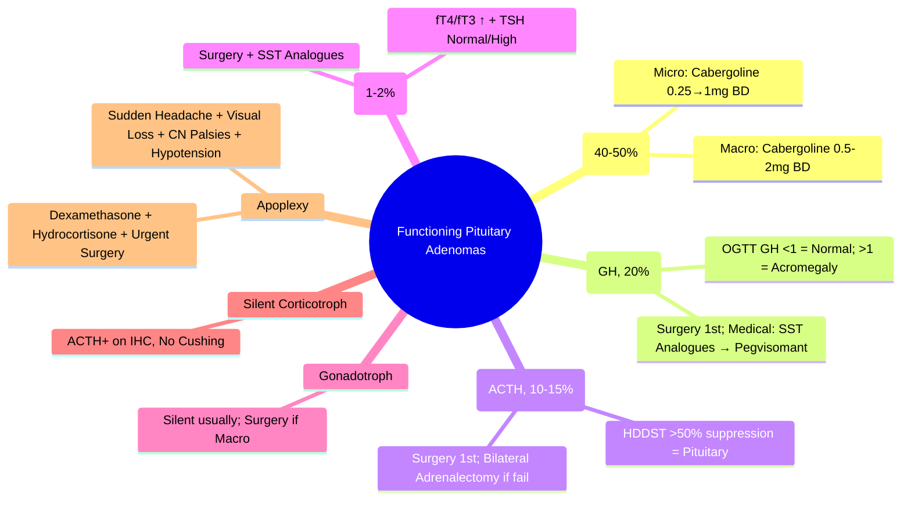

# Pituitary Adenomas: Functioning

> [!info]
> **Functioning pituitary adenomas secrete excessive hormone(s), producing characteristic clinical syndromes.** Most common: Prolactinoma (40-50%), then GH-secreting (20%), ACTH-secreting (10-15%), TSH-oma (1-2%), Gonadotroph (<5%). Silent corticotroph/Non-functioning = 25-30%.

---

## 1. Learning Objectives
By the end of this note you should be able to:
- [ ] Classify functioning pituitary adenomas by hormone secretion
- [ ] Recognise clinical presentation of each functioning adenoma type
- [ ] Apply appropriate investigations (hormones, dynamic tests, imaging)
- [ ] Outline management algorithms for each functioning adenoma
- [ ] Recognise and manage pituitary apoplexy as emergency

---

## 2. Classification of Pituitary Adenomas by Function

| Type | Hormone(s) | Prevalence | Cell of Origin | Clinical Syndrome |
|------|------------|------------|----------------|-------------------|
| **Prolactinoma** | Prolactin | **40-50%** | Lactotroph | Hyperprolactinaemia, Hypogonadism, Galactorrhoea |
| **Somatotroph (GH) Adenoma** | GH | **20%** | Somatotroph | **Acromegaly** (adult) / Gigantism (child) |
| **Corticotroph (ACTH) Adenoma** | ACTH | **10-15%** | Corticotroph | **Cushing Disease** |
| **Thyrotroph (TSH) Adenoma** | TSH | **1-2%** | Thyrotroph | Secondary Hyperthyroidism |
| **Gonadotroph Adenoma** | FSH/LH/α-subunit | **<5%** | Gonadotroph | Often asymptomatic / Mass effect |
| **Mixed/Plurihormonal** | Multiple (e.g., GH+PRL) | **5-10%** | Pluripotent | Overlapping syndromes |
| **Silent Corticotroph** | ACTH (clinically silent) | **10-15%** | Corticotroph | Non-functioning phenotype |

---

## 3. Prolactinoma

### Diagnosis
| Feature | Microprolactinoma (<10mm) | Macroprolactinoma (≥10mm) |
|---|---|---|
| **Prolactin Level** | 500-5000 mIU/L | **>5000 mIU/L** (often >10,000) |
| **Presentation** | Galactorrhoea, Amenorrhoea, Infertility, Low libido | Visual field defects, Headache, Hypopituitarism |
| **MRI** | Microadenoma (<10mm) | Macroadenoma (≥10mm), Chiasmal compression |

### Management
| Scenario | Treatment |
|----------|-----------|
| **Microprolactinoma** | **Cabergoline** 0.25mg BD → Titrate to 0.5-1mg BD (Max 2mg BD) |
| **Macroprolactinoma** | **Cabergoline** 0.5mg BD → Titrate to 1-2mg BD (Max 3mg BD); Surgery if resistant/intolerant/apoplexy |
| **Pregnancy + Micro** | Stop Cabergoline (Low growth risk) |
| **Pregnancy + Macro** | **Continue Cabergoline** (Growth risk >10%) |

**Cabergoline Dose Titration**:
- Micro: 0.25mg BD → 0.5mg BD → 1mg BD (Max 2mg BD)
- Macro: 0.5mg BD → 1mg BD → 1.5-2mg BD (Max 3mg BD)

**Withdrawal**: After 2-3 years normal Prolactin + No tumour on MRI → Taper over 3-6 months

---

## 4. Acromegaly (GH-secreting Adenoma)

### Clinical Features
| System | Features |
|--------|----------|
| **Facial** | Coarse features, Prognathism, Macroglossia, Wide teeth spacing |
| **Extremities** | Acral enlargement (Hands/Feet), Ring/Shoe size increase |
| **Skin** | Thickened, Oily, Hyperhidrosis, Skin tags, Acanthosis nigricans |
| **CVS** | Cardiomyopathy, Hypertension, Sleep apnoea |
| **Metabolic** | Impaired Glucose Tolerance / Diabetes (30-50%) |
| **Joints** | Arthropathy, Carpal tunnel syndrome |

### Diagnosis
| Test | Normal | Acromegaly |
|---|---|---|
| **IGF-1 (Age-Adjusted)** | Normal | **↑↑ (2-3x ULN)** |
| **OGTT (75g Glucose)** | GH **<1 µg/L** at 60-120min | **GH not suppressed ≥1 µg/L** (Gold Standard) |
| **Random GH** | <0.4 µg/L | >1 µg/L |
| **MRI Pituitary** | Normal | **Macroadenoma >10mm (90%)** |

### Management Algorithm
```
Acromegaly (↑ IGF-1 + GH not suppressed on OGTT)
         │
         ▼
MRI PITUITARY → Macroadenoma >10mm (90%)
         │
         ▼
TSS (Transsphenoidal Surgery) — **1st Line**
         │
         ├── CURE (IGF-1 Normal + OGTT GH <1) → Surveillance
         │
         └── RESIDUAL → Medical Therapy
                 │
                 ├── Somatostatin Analogues (Octreotide LAR/Lanreotide) — 1st Line Medical
                 ├── Pegvisomant (GH Receptor Antagonist) — If SST Refractory
                 ├── Dopamine Agonists (Cabergoline) — Adjunct
                 └── Radiotherapy (Stereotactic/Conventional) — Last Resort
```

**Medical Therapy**:
- **Octreotide LAR** 20-40mg IM q4wk / **Lanreotide** 60-120mg SC q4wk
- **Pasireotide** 40-60mg IM q4wk (2nd line, higher hyperglycaemia risk)
- **Pegvisomant** 10-30mg SC daily (GH Receptor Antagonist)
- **Cabergoline** 0.5-3mg/week (Adjunct)

**Cure Criteria**: IGF-1 Normal + OGTT GH <1 µg/L + Random GH <0.4 µg/L

---

## 5. Cushing Disease (ACTH-secreting Adenoma)

### Clinical Features
| Feature | Details |
|---------|---------|
| **Cushingoid Habitus** | Central obesity, Moon face, Buffalo hump, Striae, Bruising |
| **Metabolic** | Diabetes, Hypertension, Dyslipidaemia, Proximal Myopathy |
| **Psychiatric** | Depression, Anxiety, Cognitive impairment |
| **Skin** | Thin, Fragile, Acne, Hirsutism, Poor wound healing |

### Diagnosis
| Step | Investigation | Cut-off |
|---|---|---|
| **Screening** | 24h UFC ×2 + Late-night Salivary Cortisol ×2 + 1mg DST | UFC >ULN; DST Cortisol ≥50 nmol/L |
| **Confirm ACTH-Dependent** | ACTH (09:00, EDTA) | **Normal/High (>10-20 pg/mL)** |
| **Differentiate** | HDDST (2mg q6h × 48h) | **>50% Suppression = Cushing Disease** |
| **If Equivocal** | CRH Test / IPSS / ⁶⁸Ga-DOTATATE PET | Central:Peripheral ACTH Gradient >2 = Pituitary |

### Management
| Step | Treatment |
|---|---|
| **1st Line** | **Transsphenoidal Surgery (TSS)** — Cure rate 80-90% (Micro), 50-60% (Macro) |
| **Residual/Recurrent** | Repeat TSS / Bilateral Adrenalectomy / Medical (Ketoconazole, Metyrapone, Osilodrostat) / Radiotherapy |
| **Adjuvant Medical** | Ketoconazole (200-400mg q6h), Metyrapone, Osilodrostat, Pasireotide |

---

## 6. TSH-secreting Adenoma (TSH-oma)

### Clinical Features
| Feature | Details |
|--------|---------|
| **Hyperthyroidism** | fT4/fT3 ↑↑, **TSH Inappropriately Normal/High** |
| **Presentation** | Typical thyrotoxicosis + Goitre (often large) |
| **Pituitary MRI** | Macroadenoma (Usually >10mm) |

### Diagnosis
| Test | Finding |
|---|---|
| **TSH** | **Normal/High** despite fT4/fT3 ↑↑ |
| **TRH Test** | Paradoxical TSH Rise |
| **α-Subunit** | Elevated (Shared with FSH/LH) |
| **MRI Pituitary** | Macroadenoma |

### Management
| Step | Treatment |
|---|---|
| **1st Line** | **Transsphenoidal Surgery** |
| **Pre-op / Unresectable** | **Somatostatin Analogues** (Octreotide/Lanreotide) — Normalises TSH/T4 in 70% |
| **Radiotherapy** | If Residual/Recurrent |

---

## 7. Gonadotroph Adenoma

| Feature | Details |
|---------|---------|
| **Hormones** | FSH, LH, α-subunit (often elevated) |
| **Clinical** | Usually **Silent** (Mass effect dominant); May cause Hypogonadism (Compression) |
| **Presentation** | Headache, Visual Field Defects, Incidentaloma |
| **Biochemistry** | ↑ FSH/LH/α-subunit; Low/Normal Sex Steroids |
| **Treatment** | **Transsphenoidal Surgery** (if Macro/Visual Defects) |

---

## 8. Silent Corticotroph Adenoma

| Feature | Details |
|---------|---------|
| **Definition** | ACTH immuno-positive, **Clinically Silent** (No Cushing Features) |
| **Presentation** | Incidentaloma, Visual Field Defects, Headache, Hypopituitarism |
| **ACTH Staining** | Positive on Immunohistochemistry |
| **Biochemistry** | Normal Cortisol, Normal/↑ ACTH (Often Non-suppressible) |
| **Management** | **Surgery** if Macroadenoma / Visual Defects / Hypopituitarism |

---

## 9. Mixed / Plurihormonal Adenomas

| Combination | Clinical Picture |
|-------------|------------------|
| **GH + PRL** | Acromegaly + Hyperprolactinaemia (Most common mixed) |
| **ACTH + PRL** | Cushing + Hyperprolactinaemia |
| **TSH + GH** | Central Hyperthyroidism + Acromegaly |
| **Management** | Target Dominant Hormone; Surgery Often Required |

---

## 10. Pituitary Apoplexy — Emergency

| Feature | Details |
|---------|---------|
| **Definition** | Acute Haemorrhage/Infarction in Pituitary Adenoma |
| **Triggers** | Coagulopathy, Hypertension, Pregnancy, Trauma, Anticoagulation, Dynamic Testing |
| **Presentation** | **Sudden Severe Headache**, Visual Loss (Chiasmal), Ophthalmoplegia (CN III/IV/VI), Hypotension (Adrenal Crisis), Hypopituitarism |
| **Emergency Management** | **High-dose Dexamethasone** (4-8mg IV q6h), **IV Fluids**, **Hydrocortisone** 100mg IV STAT → 50mg q6h, **Urgent MRI**, **Transsphenoidal Surgery** if Deteriorating |

---

## 11. Exam Pearls (FCPS/MRCP)

| Topic | Key Point |
|-------|-----------|
| **Most Common Functioning** | **Prolactinoma** (40-50%) |
| **Prolactinoma Size** | Micro <10mm; Macro ≥10mm |
| **Cabergoline Dose** | Micro: 0.25mg BD → 1mg BD (Max 2mg BD); Macro: 0.5mg BD → 2mg BD (Max 3mg BD) |
| **Acromegaly Diagnosis** | **OGTT: GH not <1 µg/L**; IGF-1 ↑↑ |
| **Acromegaly 1st Line** | **Transsphenoidal Surgery** |
| **Cushing Disease vs Adrenal** | ACTH: Disease = N/↑; Adrenal = ↓↓; Ectopic = ↑↑ |
| **TSH-oma** | fT4/fT3 ↑ + TSH Inappropriately Normal/High |
| **Silent Corticotroph** | ACTH+ on IHC, No Cushing Features |
| **Pituitary Apoplexy** | Sudden Headache + Visual Loss + CN Palsies + Hypotension → Dexamethasone + Hydrocortisone + Urgent Surgery |
| **Silent Adenoma** | Non-functioning + ACTH+ on IHC → Surgery if Macro/Visual Defects |
| **Mixed Adenoma** | GH+PRL most common; Treat Dominant Hormone |

---

## 12. Mind Map



---

## 13. Local Navigation (for Dashboard UI)

> **Parent**: [[../Hypothalamic-Pituitary Axis|Hypothalamic-Pituitary Axis]]  
> **Hierarchy**: [[../../Davidson Chapter 20 - Endocrinology Hierarchy|Endocrinology Hierarchy]]  
> **Template**: [[../../../Templates/Endocrinology Topic Template|Endocrinology Topic Template]]  
> **See also**: [[Pituitary Adenomas: Non-Functioning]], [[Acromegaly]], [[Cushing Disease]], [[TSH-Secreting Adenoma]], [[Pituitary Apoplexy]], [[Hypopituitarism]]
## 14. MCQs (10)
1. **Pituitary functioning adenomas:**
   A. Hormone-secreting pituitary adenomas (prolactinoma, acromegaly, Cushing, TSHoma, gonadotroph)
   B. Non-functioning adenomas
   C. Craniopharyngioma
   D. Meningioma
   E. Metastasis

2. **Prolactinoma =**
   A. Prolactin-secreting pituitary adenoma; commonest functioning adenoma (~40%)
   B. GH-secreting
   C. ACTH-secreting
   D. TSH-secreting
   E. Non-functioning

3. **Acromegaly =**
   A. GH-secreting adenoma; IGF-1 elevated
   B. Prolactin-secreting
   C. ACTH-secreting
   D. TSH-secreting
   E. Non-functioning

4. **Cushing disease =**
   A. ACTH-secreting pituitary adenoma; 70% endogenous Cushing
   B. Adrenal adenoma
   C. Ectopic ACTH
   D. Exogenous steroids
   E. CAH

5. **TSH-secreting adenoma:**
   A. Rare (<1%); hyperthyroidism with inappropriately normal/raised TSH
   B. Common
   C. Always with hyperprolactinaemia
   D. Associated with acromegaly
   E. Always with Cushing

6. **Gonadotroph adenoma:**
   A. Secretes LH/FSH/alpha-subunit; often clinically non-functioning; mass effects
   B. Functioning prolactinoma
   C. Functioning acromegaly
   D. Functioning Cushing
   E. Functioning TSHoma

7. **Functioning adenoma treatment:**
   A. Prolactinoma: cabergoline; Acromegaly: surgery -> SSA/pegvisomant; Cushing: surgery; TSHoma: surgery; Gonadotroph: surgery
   B. All: cabergoline
   C. All: surgery
   D. All: radiotherapy
   E. All: observation

8. **Prolactinoma cabergoline:**
   A. 0.25mg BD titrate to 1-2mg/week; normalises prolactin; shrink tumour 80%
   B. 1mg OD
   C. 10mg weekly
   D. IV only
   E. Short-term only

9. **Acromegaly SSA:**
   A. Octreotide LAR/lanreotide; reduce GH/IGF-1; shrink tumour 30-50%
   B. No effect on tumour
   C. Only for Cushing
   D. Only for prolactinoma
   E. Oral only

10. **Cushing disease surgery:**
   A. Transsphenoidal 1st line; remission 80-90% microadenoma
   B. Bilateral adrenalectomy
   C. Ketoconazole only
   D. Radiotherapy 1st line
   E. Observation

## 15. SBA Questions (10)
1. **30yo woman: amenorrhoea, galactorrhoea, prolactin 2000, MRI 8mm microadenoma. Treatment?**
   A. Cabergoline 0.25mg BD titrate
   B. Surgery
   C. RAI
   D. Observation
   E. Bromocriptine

2. **Same patient: macroadenoma 15mm, visual field defect. Urgent?**
   A. Surgery (decompression) -> then cabergoline
   B. Cabergoline only
   C. RAI
   D. Observation
   E. Radiotherapy

3. **45yo man: acromegaly, 12mm macroadenoma, IGF-1 3x ULN. Treatment?**
   A. Transsphenoidal surgery
   B. Octreotide LAR
   C. Pegvisomant
   D. Radiotherapy
   E. Cabergoline

4. **35yo woman: Cushing features, ACTH 80, MRI 6mm microadenoma. Treatment?**
   A. Transsphenoidal surgery
   B. Ketoconazole
   C. Bilateral adrenalectomy
   D. Radiotherapy
   E. Pasireotide

5. **TSHoma: hyperthyroidism, TSH 5, fT4 40, MRI 10mm adenoma. Treatment?**
   A. Transsphenoidal surgery
   B. Carbimazole
   C. RAI
   D. Observation
   E. Somatostatin analogues

## 16. Flashcards
- **Q: Functioning adenomas**
  **A: Prolactinoma (40%), Acromegaly (15%), Cushing (10%), TSHoma (<1%), Gonadotroph (rare)**

- **Q: Prolactinoma**
  **A: Prolactin >2000; cabergoline 0.25mg BD; shrink 80%; surgery if macroadenoma + visual loss**

- **Q: Acromegaly**
  **A: IGF-1 screen; OGTT GH suppression; surgery 1st line; SSA/pegvisomant if residual**

- **Q: Cushing disease**
  **A: ACTH microadenoma; transsphenoidal surgery; remission 80-90% micro**

- **Q: TSHoma**
  **A: Rare; hyperthyroidism + inappropriately normal/raised TSH; surgery**

- **Q: Gonadotroph adenoma**
  **A: Often clinically non-functioning; LH/FSH/alpha-subunit; mass effects**

- **Q: Cabergoline**
  **A: 0.25mg BD titrate; prolactin normalisation; tumour shrinkage 80%**

- **Q: Octreotide/lanreotide**
  **A: SSA 2nd line acromegaly; reduce GH/IGF-1; shrink tumour**

- **Q: Pegvisomant**
  **A: GH receptor antagonist; normalises IGF-1; no tumour shrinkage**

- **Q: Functioning adenoma Rx**
  **A: Prolactinoma: cabergoline; Acromegaly: surgery -> SSA/pegvisomant; Cushing: surgery; TSHoma: surgery**

## 17. Answer Key with Explanations
### MCQs
1. **Hormone-secreting pituitary adenomas (prolactinoma, acromegaly, Cushing, TSHoma, gonadotroph)** — Pituitary functioning adenomas:

2. **Prolactin-secreting pituitary adenoma; commonest functioning adenoma (~40%)** — Prolactinoma =

3. **GH-secreting adenoma; IGF-1 elevated** — Acromegaly =

4. **ACTH-secreting pituitary adenoma; 70% endogenous Cushing** — Cushing disease =

5. **Rare (<1%); hyperthyroidism with inappropriately normal/raised TSH** — TSH-secreting adenoma:

6. **Secretes LH/FSH/alpha-subunit; often clinically non-functioning; mass effects** — Gonadotroph adenoma:

7. **Prolactinoma: cabergoline; Acromegaly: surgery -> SSA/pegvisomant; Cushing: surgery; TSHoma: surgery; Gonadotroph: surgery** — Functioning adenoma treatment:

8. **0.25mg BD titrate to 1-2mg/week; normalises prolactin; shrink tumour 80%** — Prolactinoma cabergoline:

9. **Octreotide LAR/lanreotide; reduce GH/IGF-1; shrink tumour 30-50%** — Acromegaly SSA:

10. **Transsphenoidal 1st line; remission 80-90% microadenoma** — Cushing disease surgery:


### SBAs
1. **Cabergoline 0.25mg BD titrate** — 30yo woman: amenorrhoea, galactorrhoea, prolactin 2000, MRI 8mm microadenoma. Treatment?

2. **Surgery (decompression) -> then cabergoline** — Same patient: macroadenoma 15mm, visual field defect. Urgent?

3. **Transsphenoidal surgery** — 45yo man: acromegaly, 12mm macroadenoma, IGF-1 3x ULN. Treatment?

4. **Transsphenoidal surgery** — 35yo woman: Cushing features, ACTH 80, MRI 6mm microadenoma. Treatment?

5. **Transsphenoidal surgery** — TSHoma: hyperthyroidism, TSH 5, fT4 40, MRI 10mm adenoma. Treatment?
---

> Auto-generated study sections for "Endocrinology" — Ch 20: Endocrinology.

## Flashcards (43 generated)

- Q: What is Cushingoid Habitus of Endocrinology?
  A: Central obesity, Moon face, Buffalo hump, Striae, Bruising
- Q: What is Metabolic of Endocrinology?
  A: Diabetes, Hypertension, Dyslipidaemia, Proximal Myopathy
- Q: What is Psychiatric of Endocrinology?
  A: Depression, Anxiety, Cognitive impairment
- Q: What is Skin of Endocrinology?
  A: Thin, Fragile, Acne, Hirsutism, Poor wound healing
- Q: What is Hyperthyroidism of Endocrinology?
  A: fT4/fT3 ↑↑, TSH Inappropriately Normal/High
- Q: What are the clinical features of Endocrinology?
  A: Typical thyrotoxicosis + Goitre (often large)
- Q: What is Pituitary MRI of Endocrinology?
  A: Macroadenoma (Usually >10mm)
- Q: What is Hormones of Endocrinology?
  A: FSH, LH, α-subunit (often elevated)
- Q: What is Clinical of Endocrinology?
  A: Usually Silent (Mass effect dominant); May cause Hypogonadism (Compression)
- Q: What are the clinical features of Endocrinology?
  A: Headache, Visual Field Defects, Incidentaloma
- Q: What is Biochemistry of Endocrinology?
  A: ↑ FSH/LH/α-subunit; Low/Normal Sex Steroids
- Q: How is Endocrinology managed?
  A: Transsphenoidal Surgery (if Macro/Visual Defects)
- Q: What is the definition of Endocrinology?
  A: ACTH immuno-positive, Clinically Silent (No Cushing Features)
- Q: What are the clinical features of Endocrinology?
  A: Incidentaloma, Visual Field Defects, Headache, Hypopituitarism
- Q: What is ACTH Staining of Endocrinology?
  A: Positive on Immunohistochemistry
- Q: What is Biochemistry of Endocrinology?
  A: Normal Cortisol, Normal/↑ ACTH (Often Non-suppressible)
- Q: How is Endocrinology managed?
  A: Surgery if Macroadenoma / Visual Defects / Hypopituitarism
- Q: What is the definition of Endocrinology?
  A: Acute Haemorrhage/Infarction in Pituitary Adenoma
- Q: What is Triggers of Endocrinology?
  A: Coagulopathy, Hypertension, Pregnancy, Trauma, Anticoagulation, Dynamic Testing
- Q: What are the clinical features of Endocrinology?
  A: Sudden Severe Headache, Visual Loss (Chiasmal), Ophthalmoplegia (CN III/IV/VI), Hypotension (Adrenal Crisis), Hypopituitarism
- Q: How is Endocrinology managed?
  A: High-dose Dexamethasone (4-8mg IV q6h), IV Fluids, Hydrocortisone 100mg IV STAT → 50mg q6h, Urgent MRI, Transsphenoidal Surgery if Deteriorating
- Q: What is Cushingoid Habitus of Endocrinology?
  A: Central obesity, Moon face, Buffalo hump, Striae, Bruising
- Q: What is Metabolic of Endocrinology?
  A: Diabetes, Hypertension, Dyslipidaemia, Proximal Myopathy
- Q: What is Psychiatric of Endocrinology?
  A: Depression, Anxiety, Cognitive impairment
- Q: What is Hyperthyroidism of Endocrinology?
  A: fT4/fT3 ↑↑, TSH Inappropriately Normal/High
- Q: What are the clinical features of Endocrinology?
  A: Typical thyrotoxicosis + Goitre (often large)
- Q: What is TSH of Endocrinology?
  A: Normal/High despite fT4/fT3 ↑↑
- Q: What is the investigation of choice for Endocrinology?
  A: Paradoxical TSH Rise
- Q: What is α-Subunit of Endocrinology?
  A: Elevated (Shared with FSH/LH)
- Q: What is Hormones of Endocrinology?
  A: FSH, LH, α-subunit (often elevated)
- Q: What is Clinical of Endocrinology?
  A: Usually Silent (Mass effect dominant); May cause Hypogonadism (Compression)
- Q: What are the clinical features of Endocrinology?
  A: Headache, Visual Field Defects, Incidentaloma
- Q: What is Biochemistry of Endocrinology?
  A: ↑ FSH/LH/α-subunit; Low/Normal Sex Steroids
- Q: How is Endocrinology managed?
  A: Transsphenoidal Surgery (if Macro/Visual Defects)
- Q: What is the definition of Endocrinology?
  A: ACTH immuno-positive, Clinically Silent (No Cushing Features)
- Q: What are the clinical features of Endocrinology?
  A: Incidentaloma, Visual Field Defects, Headache, Hypopituitarism
- Q: What is ACTH Staining of Endocrinology?
  A: Positive on Immunohistochemistry
- Q: What is Biochemistry of Endocrinology?
  A: Normal Cortisol, Normal/↑ ACTH (Often Non-suppressible)
- Q: How is Endocrinology managed?
  A: Surgery if Macroadenoma / Visual Defects / Hypopituitarism
- Q: What is the definition of Endocrinology?
  A: Acute Haemorrhage/Infarction in Pituitary Adenoma
- Q: What is Triggers of Endocrinology?
  A: Coagulopathy, Hypertension, Pregnancy, Trauma, Anticoagulation, Dynamic Testing
- Q: What are the clinical features of Endocrinology?
  A: Sudden Severe Headache, Visual Loss (Chiasmal), Ophthalmoplegia (CN III/IV/VI), Hypotension (Adrenal Crisis), Hypopituitarism
- Q: How is Endocrinology managed?
  A: High-dose Dexamethasone (4-8mg IV q6h), IV Fluids, Hydrocortisone 100mg IV STAT → 50mg q6h, Urgent MRI, Transsphenoidal Surgery if Deteriorating

## MCQs (1 generated)

1. **Which of the following best describes Endocrinology?**
   A. **Functioning pituitary adenomas secrete excessive hormone(s), producing characteristic clinical syndromes.**
   B. An unrelated condition not matching the clinical picture of Endocrinology
   C. A complication seen late in the disease course of Endocrinology
   D. A condition that mimics Endocrinology but has a different underlying cause

## SBA Questions (1 generated)

1. A patient with suspected Endocrinology presents with: Somatotroph (GH) Adenoma — GH; Corticotroph (ACTH) Adenoma — ACTH; Thyrotroph (TSH) Adenoma — TSH. What is the most likely diagnosis?
   A. **Endocrinology**
   B. A condition that mimics Endocrinology but is not the same entity
   C. A complication of Endocrinology rather than the primary diagnosis
   D. An unrelated condition in the same clinical category as Endocrinology

