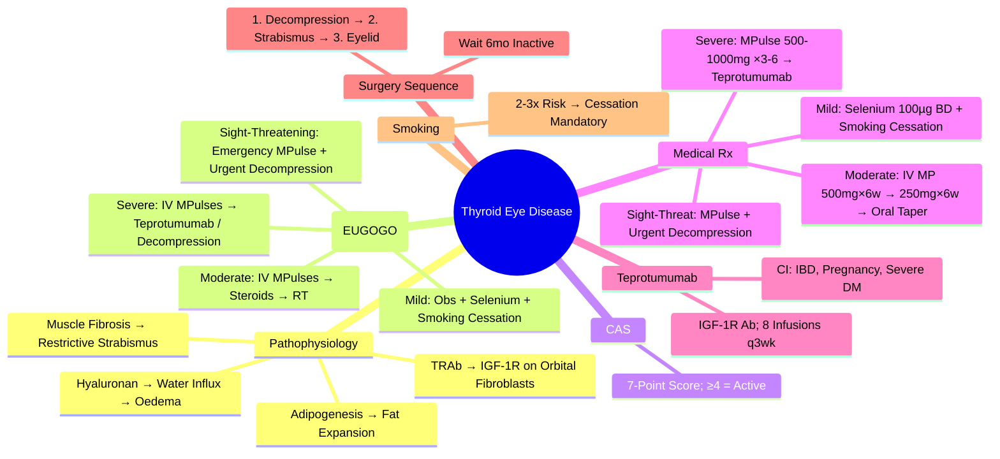

# Thyroid Eye Disease (Graves Ophthalmopathy)

> [!info]
> **Thyroid Eye Disease (TED) = Autoimmune orbital inflammation** driven by TSH-R/IGF-1R antibodies on orbital fibroblasts. **Most common orbital disease**. **25-50% of Graves patients**. Smoking is major modifiable risk factor.

---

## 1. Learning Objectives
By the end of this note you should be able to:
- [ ] Apply EUGOGO grading (mild/moderate/severe/sight-threatening)
- [ ] Differentiate active vs inactive disease (CAS)
- [ ] Apply medical management algorithm (teprotumumab, steroids, radiotherapy)
- [ ] Indicate surgical decompression and rehabilitation sequence
- [ ] Counsel on smoking cessation and selenium

---

## 2. Pathophysiology

| Mechanism | Details |
|-----------|---------|
| **Autoantibodies** | **TSH-R Stimulating Antibodies (TRAb)** cross-react with **IGF-1R** on orbital fibroblasts |
| **Cellular Target** | Orbital fibroblasts, adipocytes, extraocular muscle fibres |
| **Key Mediators** | **Hyaluronan (GAGs)** → osmotic water influx → oedema; **Adipogenesis** → fat expansion; **Cytokines** (IL-1, IL-6, TNF-α, IFN-γ) |
| **Muscle Involvement** | **Inferior > Medial > Superior > Lateral** rectus; spares tendons |
| **Fat Expansion** | Adipocyte differentiation + hypertrophy → proptosis |

---

## 3. Clinical Features

| Feature | Frequency | Details |
|---------|-----------|---------|
| **Lid Retraction** | 90% | Dalrymple's sign (upper lid), Von Graefe's sign (lid lag) |
| **Proptosis** | 60% | Measured by Hertel exophthalmometer (>21mm abnormal) |
| **Diplopia** | 50% | Restrictive myopathy; Inferior > Medial > Superior > Lateral |
| **Soft Tissue Signs** | 70% | Periorbital oedema, chemosis, conjunctival injection |
| **Corneal Exposure** | 30% | Lagophthalmos, exposure keratopathy |
| **Optic Neuropathy** | 5-10% | **Sight-threatening**; Acuity loss, colour desaturation, RAPD |

---

## 4. EUGOGO Grading & Clinical Activity Score (CAS)

### EUGOGO Severity Classification

| Grade | Criteria | Management |
|-------|----------|------------|
| **Mild** | Lid retraction <2mm, Proptosis <2mm, Mild soft tissue signs, No diplopia | **Observation**; Lubricants; **Selenium 100µg BD**; Smoking cessation |
| **Moderate** | Proptosis 2-4mm, Inconstant diplopia, Moderate soft tissue signs, No sight threat | **IV Methylprednisolone** → Oral taper; **Orbital Radiotherapy** if steroid-fails |
| **Severe** | Proptosis >4mm, Constant diplopia, Severe soft tissue signs, **NO optic neuropathy** | **IV Methylprednisolone** (500-1000mg pulsed) → Radiosurgery/Surgery |
| **Sight-Threatening** | **Optic neuropathy** (↓ acuity, colour vision, RAPD), Corneal ulceration | **Emergency IV Methylprednisolone 500-1000mg × 3-6 doses** → **Urgent Orbital Decompression** |

### Clinical Activity Score (CAS) — 7-Point Scale
| Feature | Points |
|---------|--------|
| Spontaneous retrobulbar pain | 1 |
| Gaze-evoked pain | 1 |
| Erythema | 1 |
| Conjunctival injection | 1 |
| Chemosis | 1 |
| Lid swelling | 1 |
| **Total ≥4/7** = **Active Disease** (treat with immunomodulation) | |

---

## 5. Medical Management Algorithm

```
Thyroid Eye Disease (Confirmed)
         │
         ├── MILD (EUGOGO)
         │       Lubricants (Preservative-free tears/gel)
         │       **Selenium 100µg BD** (6 months; reduces progression)
         │       **Smoking Cessation** (Mandatory; 2-3x risk reduction)
         │       Elevate Head of Bed; Sunglasses
         │       Monitor q3-6mo
         │
         ├── MODERATE (Active: CAS ≥4)
         │       **IV Methylprednisolone 500mg/week × 6 weeks → 250mg/week × 6 weeks**
         │       (Cumulative 4.5g; Standard EUGOGO protocol)
         │       → Oral Prednisolone taper over 3-6 months
         │       If Steroid-Resistant/Intolerant → **Orbital Radiotherapy (20Gy/10 fractions)**
         │
         ├── SEVERE (Inactive or Active)
         │       **IV Methylprednisolone 500-1000mg IV × 3-6 pulses** (q weekly)
         │       → Oral Prednisolone Taper (4-6 months)
         │       **Orbital Radiotherapy (20Gy/10 fractions)** if steroid-resistant
         │       **Teprotumumab (IGF-1R Antibody)** — 8 infusions q3wk; FDA-approved; Marked proptosis reduction
         │
         └── SIGHT-THREATENING (Optic Neuropathy / Corneal Ulcer)
                 **EMERGENCY IV Methylprednisolone 500-1000mg × 3-6 doses**
                 → **Urgent Orbital Decompression Surgery** (within days)
                 → Post-op Steroids + Monitoring
```

---

## 6. Surgical Rehabilitation Sequence (Fixed Order)

| Stage | Procedure | Timing |
|-------|-----------|--------|
| **1. Orbital Decompression** | Medial + Lateral walls + Floor (Balanced) | **First** (after disease inactive ≥6mo) |
| **2. Strabismus Surgery** | Recession/Recession of affected muscles | **Second** (after decompression stable) |
| **3. Eyelid Surgery** | Upper lid lowering, Lower lid elevation | **Last** (after strabismus stable) |

**Key Rule**: Disease must be **inactive for ≥6 months** before elective surgery.

---

## 7. Teprotumumab (IGF-1R Antibody) — Game Changer

| Feature | Details |
|---------|---------|
| **Mechanism** | **IGF-1R Antibody** → Blocks TSH-R/IGF-1R crosstalk on orbital fibroblasts |
| **Dose** | **10mg/kg IV** (Day 1) → **20mg/kg IV q3wk × 7 doses** (Total 8 infusions over 21 weeks) |
| **Efficacy** | **~80% achieve ≥2mm proptosis reduction**; Significant CAS improvement |
| **Indication** | **Active Moderate-Severe TED** (FDA-approved); Also used off-label in inactive disease |
| **Contraindications** | **Inflammatory Bowel Disease** (↑ flare risk); Pregnancy; Severe Diabetes |
| **Monitoring** | Glucose (↑ Hyperglycaemia risk), Hearing (Infusion reactions), Infection |

---

## 8. Orbital Radiotherapy

| Aspect | Details |
|--------|---------|
| **Dose** | **20 Gy in 10 fractions** (2Gy/fx over 2 weeks) |
| **Indication** | Steroid-resistant moderate disease; Adjunct to steroids |
| **Timing** | Ideally **within 6 months of acute phase** |
| **Efficacy** | ~60% improvement in CAS; Better for motility than proptosis |
| **Complications** | Cataract (delayed), Retinopathy (rare), Secondary malignancy (very rare) |
| **Contraindications** | Age <35 (relative), Diabetic retinopathy, Prior orbital RT |

---

## 9. Smoking Cessation — Critical Modifiable Factor

| Statistic | Impact |
|-----------|--------|
| **Risk Increase** | **2-3x higher** risk of TED in smokers |
| **Severity** | Dose-dependent (pack-years) |
| **Treatment Response** | **Poorer** response to steroids/RT in smokers |
| **Cessation Benefit** | Risk approaches non-smoker after **5-10 years** |

**Mandatory**: Document smoking status; Offer cessation support at every visit.

---

## 10. Selenium Supplementation

| Aspect | Details |
|--------|---------|
| **Dose** | **100µg BD** (Sodium Selenite) |
| **Duration** | **6 months** |
| **Evidence** | RCT: Reduces progression in mild disease; Improves QoL |
| **Mechanism** | Antioxidant; Restores GPx activity; Modulates immune response |
| **Safety** | Well-tolerated; Avoid >400µg/day (selenosis risk) |

---

## 11. Special Situations

### Pregnancy
| Aspect | Management |
|--------|------------|
| **Course** | Often improves in 1st tri (immunosuppression); Worsens postpartum |
| **Steroids** | Prednisolone preferred (placental metabolism); Avoid IVMP pulses if possible |
| **Teprotumumab** | **Contraindicated** (No safety data) |
| **Radiotherapy** | **Contraindicated** (Fetal radiation) |
| **Surgery** | Defer until postpartum |

### Diabetes
| Aspect | Management |
|--------|------------|
| **Teprotumumab** | **Hyperglycaemia risk** (20-30%); Monitor HbA1c q infusion; Adjust diabetes meds |
| **Steroids** | Intensive glucose monitoring; Insulin adjustment |

---

## 12. Exam Pearls (FCPS/MRCP)

| Topic | Key Point |
|-------|-----------|
| **Most Common Orbital Disease** | **Thyroid Eye Disease** |
| **Commonest Cause of Proptosis** | **Thyroid Eye Disease** (Adults) |
| **EUGOGO Mild** | Lubricants, Selenium 100µg BD, Smoking Cessation |
| **EUGOGO Moderate** | IV MP 500mg/wk ×6 → 250mg/wk ×6 → Oral taper; RT if resistant |
| **EUGOGO Severe** | IV MP 500-1000mg × 3-6 pulses → Teprotumumab / Decompression |
| **Sight-Threatening** | **Optic Neuropathy** → **Emergency IV MP 500-1000mg × 3-6 doses → Urgent Decompression** |
| **CAS ≥4/7** | Active Disease → Immunomodulation Indicated |
| **Teprotumumab** | IGF-1R Ab; 8 infusions q3wk; 80% ≥2mm proptosis reduction; CI: IBD |
| **Surgical Sequence** | 1. Decompression → 2. Strabismus → 3. Eyelid (After 6mo inactive) |
| **Smoking** | 2-3x Risk; Cessation Mandatory |
| **Selenium** | 100µg BD × 6mo; Reduces Progression in Mild Disease |
| **Teprotumumab CI** | **IBD (Flare Risk)**; Pregnancy; Severe Diabetes |
| **Radiotherapy** | 20Gy/10fx; Steroid-Resistant Moderate; Best <6mo from Onset |
| **Diabetic on Teprotumumab** | Monitor Glucose q Infusion; ↑ Hyperglycaemia Risk |
| **Surgical Sequence** | **Decompression → Strabismus → Eyelid** (After 6mo inactive) |

---

## 13. Confusions & Mnemonics

| Confusion | Clarification |
|-----------|---------------|
| **TED vs Graves** | TED = Orbital manifestation; Graves = Systemic thyrotoxicosis; Can occur independently |
| **Proptosis vs Exophthalmos** | Proptosis = Anterior globe displacement (>21mm); Exophthalmos = Clinical appearance (includes lid retraction) |
| **Mild TED** | No diplopia, proptosis <2mm, no sight threat |
| **Sight-Threatening** | Optic Neuropathy (↓ VA, Colour, RAPD) OR Corneal Ulcer (Exposure) |
| **Teprotumumab vs Steroids** | Teprotumumab = Targeted IGF-1R blockade; Steroids = Broad immunosuppression |
| **Orbital Decompression Timing** | **After 6mo Inactive Disease** (Avoid recurrent strabismus) |
| **Surgical Sequence** | **Decompression → Strabismus → Eyelid** (Fixed order) |
| **Selenium** | Only for Mild Disease; 100µg BD × 6mo |
| **Teprotumumab CI** | **IBD** (Crohn's/UC Flare Risk); Pregnancy; Severe Diabetes |

---

## 14. Mind Map



---

## 15. Exam Pearls (FCPS/MRCP)

| Topic | Key Point |
|-------|-----------|
| **TED = Most Common Orbital Disease** | 25-50% of Graves |
| **EUGOGO Grading** | Mild/Moderate/Severe/Sight-Threatening |
| **CAS ≥4/7** | Active Disease → Treat |
| **Mild TED** | Selenium 100µg BD + Smoking Cessation |
| **Moderate TED** | IV MP 500mg×6w → 250mg×6w → Oral Taper |
| **Severe TED** | MPulse 500-1000mg ×3-6 + Teprotumumab |
| **Sight-Threatening** | Emergency MPulse → Urgent Decompression |
| **Teprotumumab** | IGF-1R Ab; 8 Infusions q3wk; CI: IBD |
| **Surgical Order** | Decompression → Strabismus → Eyelid |
| **Smoking** | 2-3x Risk → Cessation Mandatory |
| **Selenium** | 100µg BD × 6mo (Mild Disease Only) |
| **Teprotumumab CI** | IBD, Pregnancy, Severe Diabetes |
| **Radiotherapy** | 20Gy/10fx; Steroid-Resistant Moderate |

---

## 16. Local Navigation (for Dashboard UI)

> **Parent**: [[../Graves Disease|Graves Disease]]  
> **Hierarchy**: [[../../Davidson Chapter 20 - Endocrinology Hierarchy|Endocrinology Hierarchy]]  
> **Template**: [[../../../Templates/Endocrinology Topic Template|Endocrinology Topic Template]]  
> **See also**: [[Graves Disease]], [[Hyperthyroidism Overview]], [[Thyroid Storm]], [[Reproductive Endocrinology/Pregnancy]]
## 17. MCQs (10)
1. **Thyroid eye disease (TED) =**
   A. Autoimmune orbital inflammation in Graves; TSHR/IGF-1R antibodies on orbital fibroblasts
   B. Bacterial orbital infection
   C. Orbital tumour
   D. Sinusitis complication
   E. Trauma

2. **TED clinical activity score (CAS):**
   A. 7-point scale: pain, redness, swelling, chemosis, motility restriction, proptosis, optic neuropathy
   B. Only proptosis
   C. Only vision loss
   D. Only pain
   E. Only redness

3. **TED sight-threatening features:**
   A. Optic neuropathy (colour vision, acuity, fields), corneal exposure
   B. Only proptosis
   C. Only dry eye
   D. Only double vision
   E. Only lid retraction

4. **TED medical management:**
   A. High-dose steroids (IV methylprednisolone) for active moderate-severe; teprotumumab (IGF-1R inhibitor)
   B. Antibiotics
   C. Surgery first
   D. Observation only
   E. RAI

5. **TED and smoking:**
   A. Smoking 2-3x risk; worsening; cessation essential
   B. No effect
   C. Protective
   D. Only in men
   E. Only in children

6. **TED surgical rehabilitation:**
   A. After inactive (6mo): orbital decompression -> strabismus -> lid surgery
   B. Immediate surgery
   C. Never surgery
   D. Only lid surgery
   E. Only decompression

7. **TED monitoring:**
   A. CAS, proptosis (Hertel), motility, colour vision, acuity, fields q3-6mo if active
   B. Only once
   C. Only at diagnosis
   D. Only pre-surgery
   E. No monitoring needed

8. **RAI in TED:**
   A. Contraindicated in active TED (worsens); if needed: steroid cover + consider teprotumumab
   B. Safe
   C. Preferred
   D. No effect
   E. Only for mild

9. **Teprotumumab:**
   A. IGF-1R inhibitor; 8 infusions q3wk; reduces proptosis in active TED
   B. Antibiotic
   C. Steroid
   D. Surgery
   E. RAI

10. **Euthyroid TED:**
   A. Can occur without hyperthyroidism; same management
   B. Does not exist
   C. Always hyperthyroid
   D. Always hypothyroid
   E. Mild only

## 18. SBA Questions (10)
1. **35yo woman: Graves, active TED (CAS 5), proptosis 22mm, diplopia. Best Rx?**
   A. IV methylprednisolone 500mg weekly x6 -> teprotumumab if available
   B. Oral prednisolone
   C. RAI
   D. Surgery
   E. Observation

2. **Same patient: smoker. Impact?**
   A. Worsens TED; cessation essential; steroids less effective
   B. No effect
   C. Protective
   D. Only affects lungs
   E. Only affects heart

3. **TED with optic neuropathy (colour vision loss, acuity drop). Emergency Rx?**
   A. High-dose IV methylprednisolone 1g daily x3 -> urgent orbital decompression
   B. Oral prednisolone
   C. RAI
   D. Observation
   E. Surgery in 6mo

4. **TED inactive (CAS 0) for 6mo, residual proptosis 24mm. Next?**
   A. Orbital decompression -> strabismus surgery -> lid surgery (sequential)
   B. Steroids
   C. RAI
   D. Teprotumumab
   E. Observation

5. **Graves patient needs RAI but has active TED. Best approach?**
   A. Delay RAI; treat TED first with steroids/teprotumumab; steroid cover if RAI urgent
   B. Give RAI anyway
   C. Surgery instead
   D. No RAI ever
   E. Teprotumumab only

## 19. Flashcards
- **Q: TED =**
  **A: Autoimmune orbital inflammation in Graves; TSHR/IGF-1R on orbital fibroblasts**

- **Q: CAS**
  **A: 7-point scale: pain, redness, swelling, chemosis, motility, proptosis, optic neuropathy**

- **Q: Sight-threatening**
  **A: Optic neuropathy (colour, acuity, fields) + corneal exposure**

- **Q: Medical Rx**
  **A: IV steroids (active mod-severe); teprotumumab (IGF-1R inhibitor)**

- **Q: Smoking**
  **A: 2-3x risk; worsens TED; cessation essential**

- **Q: Surgical rehab**
  **A: Decompression -> strabismus -> lid surgery (sequential, after inactive 6mo)**

- **Q: RAI in TED**
  **A: Contraindicated in active TED (worsens); steroid cover if urgent**

- **Q: Teprotumumab**
  **A: IGF-1R inhibitor; 8 infusions q3wk; reduces proptosis in active TED**

- **Q: Euthyroid TED**
  **A: Can occur without hyperthyroidism; same management**

- **Q: Monitoring**
  **A: CAS, Hertel, motility, vision q3-6mo if active**

## 20. Answer Key with Explanations
### MCQs
1. **Autoimmune orbital inflammation in Graves; TSHR/IGF-1R antibodies on orbital fibroblasts** — Thyroid eye disease (TED) =

2. **7-point scale: pain, redness, swelling, chemosis, motility restriction, proptosis, optic neuropathy** — TED clinical activity score (CAS):

3. **Optic neuropathy (colour vision, acuity, fields), corneal exposure** — TED sight-threatening features:

4. **High-dose steroids (IV methylprednisolone) for active moderate-severe; teprotumumab (IGF-1R inhibitor)** — TED medical management:

5. **Smoking 2-3x risk; worsening; cessation essential** — TED and smoking:

6. **After inactive (6mo): orbital decompression -> strabismus -> lid surgery** — TED surgical rehabilitation:

7. **CAS, proptosis (Hertel), motility, colour vision, acuity, fields q3-6mo if active** — TED monitoring:

8. **Contraindicated in active TED (worsens); if needed: steroid cover + consider teprotumumab** — RAI in TED:

9. **IGF-1R inhibitor; 8 infusions q3wk; reduces proptosis in active TED** — Teprotumumab:

10. **Can occur without hyperthyroidism; same management** — Euthyroid TED:


### SBAs
1. **IV methylprednisolone 500mg weekly x6 -> teprotumumab if available** — 35yo woman: Graves, active TED (CAS 5), proptosis 22mm, diplopia. Best Rx?

2. **Worsens TED; cessation essential; steroids less effective** — Same patient: smoker. Impact?

3. **High-dose IV methylprednisolone 1g daily x3 -> urgent orbital decompression** — TED with optic neuropathy (colour vision loss, acuity drop). Emergency Rx?

4. **Orbital decompression -> strabismus surgery -> lid surgery (sequential)** — TED inactive (CAS 0) for 6mo, residual proptosis 24mm. Next?

5. **Delay RAI; treat TED first with steroids/teprotumumab; steroid cover if RAI urgent** — Graves patient needs RAI but has active TED. Best approach?
---

> Auto-generated study sections for "Endocrinology" — Ch 20: Endocrinology.

## Flashcards (67 generated)

- Q: What is the definition of Endocrinology?
  A: Thyroid Eye Disease (TED) = Autoimmune orbital inflammation driven by TSH-R/IGF-1R antibodies on orbital fibroblasts.
- Q: What is Autoantibodies of Endocrinology?
  A: TSH-R Stimulating Antibodies (TRAb) cross-react with IGF-1R on orbital fibroblasts
- Q: What is Cellular Target of Endocrinology?
  A: Orbital fibroblasts, adipocytes, extraocular muscle fibres
- Q: What is Key Mediators of Endocrinology?
  A: Hyaluronan (GAGs) → osmotic water influx → oedema; Adipogenesis → fat expansion; Cytokines (IL-1, IL-6, TNF-α, IFN-γ)
- Q: What is Muscle Involvement of Endocrinology?
  A: Inferior > Medial > Superior > Lateral rectus; spares tendons
- Q: What is Fat Expansion of Endocrinology?
  A: Adipocyte differentiation + hypertrophy → proptosis
- Q: What is the mechanism of Endocrinology?
  A: IGF-1R Antibody → Blocks TSH-R/IGF-1R crosstalk on orbital fibroblasts
- Q: What is the dose of Endocrinology?
  A: 10mg/kg IV (Day 1) → 20mg/kg IV q3wk × 7 doses (Total 8 infusions over 21 weeks)
- Q: What is Efficacy of Endocrinology?
  A: ~80% achieve ≥2mm proptosis reduction; Significant CAS improvement
- Q: What is Endocrinology indicated for?
  A: Active Moderate-Severe TED (FDA-approved); Also used off-label in inactive disease
- Q: How is Endocrinology monitored?
  A: Glucose (↑ Hyperglycaemia risk), Hearing (Infusion reactions), Infection
- Q: What is the dose of Endocrinology?
  A: 20 Gy in 10 fractions (2Gy/fx over 2 weeks)
- Q: What is Endocrinology indicated for?
  A: Steroid-resistant moderate disease; Adjunct to steroids
- Q: What is Timing of Endocrinology?
  A: Ideally within 6 months of acute phase
- Q: What is Efficacy of Endocrinology?
  A: ~60% improvement in CAS; Better for motility than proptosis
- Q: What are the complications of Endocrinology?
  A: Cataract (delayed), Retinopathy (rare), Secondary malignancy (very rare)
- Q: What is Course of Endocrinology?
  A: Often improves in 1st tri (immunosuppression); Worsens postpartum
- Q: What is Steroids of Endocrinology?
  A: Prednisolone preferred (placental metabolism); Avoid IVMP pulses if possible
- Q: What is Teprotumumab of Endocrinology?
  A: Contraindicated (No safety data)
- Q: How is Endocrinology managed?
  A: Contraindicated (Fetal radiation)
- Q: What is Surgery of Endocrinology?
  A: Defer until postpartum
- Q: What is Teprotumumab of Endocrinology?
  A: Hyperglycaemia risk (20-30%); Monitor HbA1c q infusion; Adjust diabetes meds
- Q: What is Steroids of Endocrinology?
  A: Intensive glucose monitoring; Insulin adjustment
- Q: What is Most Common Orbital Disease of Endocrinology?
  A: Thyroid Eye Disease
- Q: What causes Endocrinology?
  A: Thyroid Eye Disease (Adults)
- Q: What is EUGOGO Mild of Endocrinology?
  A: Lubricants, Selenium 100µg BD, Smoking Cessation
- Q: What is EUGOGO Moderate of Endocrinology?
  A: IV MP 500mg/wk ×6 → 250mg/wk ×6 → Oral taper; RT if resistant
- Q: What is EUGOGO Severe of Endocrinology?
  A: IV MP 500-1000mg × 3-6 pulses → Teprotumumab / Decompression
- Q: What is Sight-Threatening of Endocrinology?
  A: Optic Neuropathy → Emergency IV MP 500-1000mg × 3-6 doses → Urgent Decompression
- Q: What is CAS ≥4/7 of Endocrinology?
  A: Active Disease → Immunomodulation Indicated
- Q: What is Teprotumumab of Endocrinology?
  A: IGF-1R Ab; 8 infusions q3wk; 80% ≥2mm proptosis reduction; CI: IBD
- Q: What is Surgical Sequence of Endocrinology?
  A: 1. Decompression → 2. Strabismus → 3. Eyelid (After 6mo inactive)
- Q: What is Smoking of Endocrinology?
  A: 2-3x Risk; Cessation Mandatory
- Q: What is Selenium of Endocrinology?
  A: 100µg BD × 6mo; Reduces Progression in Mild Disease
- Q: What is Teprotumumab CI of Endocrinology?
  A: IBD (Flare Risk); Pregnancy; Severe Diabetes
- Q: How is Endocrinology managed?
  A: 20Gy/10fx; Steroid-Resistant Moderate; Best <6mo from Onset
- Q: What is Diabetic on Teprotumumab of Endocrinology?
  A: Monitor Glucose q Infusion; ↑ Hyperglycaemia Risk
- Q: What is the mechanism of Endocrinology?
  A: IGF-1R Antibody → Blocks TSH-R/IGF-1R crosstalk on orbital fibroblasts
- Q: What is the dose of Endocrinology?
  A: 10mg/kg IV (Day 1) → 20mg/kg IV q3wk × 7 doses (Total 8 infusions over 21 weeks)
- Q: What is Efficacy of Endocrinology?
  A: ~80% achieve ≥2mm proptosis reduction; Significant CAS improvement
- Q: What is Endocrinology indicated for?
  A: Active Moderate-Severe TED (FDA-approved); Also used off-label in inactive disease
- Q: How is Endocrinology monitored?
  A: Glucose (↑ Hyperglycaemia risk), Hearing (Infusion reactions), Infection
- Q: What is the dose of Endocrinology?
  A: 20 Gy in 10 fractions (2Gy/fx over 2 weeks)
- Q: What is Endocrinology indicated for?
  A: Steroid-resistant moderate disease; Adjunct to steroids
- Q: What is Timing of Endocrinology?
  A: Ideally within 6 months of acute phase
- Q: What is Efficacy of Endocrinology?
  A: ~60% improvement in CAS; Better for motility than proptosis
- Q: What are the complications of Endocrinology?
  A: Cataract (delayed), Retinopathy (rare), Secondary malignancy (very rare)
- Q: What is Course of Endocrinology?
  A: Often improves in 1st tri (immunosuppression); Worsens postpartum
- Q: What is Steroids of Endocrinology?
  A: Prednisolone preferred (placental metabolism); Avoid IVMP pulses if possible
- Q: What is Teprotumumab of Endocrinology?
  A: Contraindicated (No safety data)
- Q: How is Endocrinology managed?
  A: Contraindicated (Fetal radiation)
- Q: What is Teprotumumab of Endocrinology?
  A: Hyperglycaemia risk (20-30%); Monitor HbA1c q infusion; Adjust diabetes meds
- Q: What is Steroids of Endocrinology?
  A: Intensive glucose monitoring; Insulin adjustment
- Q: What is Most Common Orbital Disease of Endocrinology?
  A: Thyroid Eye Disease
- Q: What causes Endocrinology?
  A: Thyroid Eye Disease (Adults)
- Q: What is EUGOGO Mild of Endocrinology?
  A: Lubricants, Selenium 100µg BD, Smoking Cessation
- Q: What is EUGOGO Moderate of Endocrinology?
  A: IV MP 500mg/wk ×6 → 250mg/wk ×6 → Oral taper; RT if resistant
- Q: What is EUGOGO Severe of Endocrinology?
  A: IV MP 500-1000mg × 3-6 pulses → Teprotumumab / Decompression
- Q: What is Sight-Threatening of Endocrinology?
  A: Optic Neuropathy → Emergency IV MP 500-1000mg × 3-6 doses → Urgent Decompression
- Q: What is CAS ≥4/7 of Endocrinology?
  A: Active Disease → Immunomodulation Indicated
- Q: What is Teprotumumab of Endocrinology?
  A: IGF-1R Ab; 8 infusions q3wk; 80% ≥2mm proptosis reduction; CI: IBD
- Q: What is Surgical Sequence of Endocrinology?
  A: 1. Decompression → 2. Strabismus → 3. Eyelid (After 6mo inactive)
- Q: What is Smoking of Endocrinology?
  A: 2-3x Risk; Cessation Mandatory
- Q: What is Selenium of Endocrinology?
  A: 100µg BD × 6mo; Reduces Progression in Mild Disease
- Q: What is Teprotumumab CI of Endocrinology?
  A: IBD (Flare Risk); Pregnancy; Severe Diabetes
- Q: How is Endocrinology managed?
  A: 20Gy/10fx; Steroid-Resistant Moderate; Best <6mo from Onset
- Q: What is Diabetic on Teprotumumab of Endocrinology?
  A: Monitor Glucose q Infusion; ↑ Hyperglycaemia Risk

## MCQs (1 generated)

1. **Which of the following best describes Endocrinology?**
   A. **Thyroid Eye Disease (TED) = Autoimmune orbital inflammation driven by TSH-R/IGF-1R antibodies on orbital fibroblasts.**
   B. An unrelated condition not matching the clinical picture of Endocrinology
   C. A complication seen late in the disease course of Endocrinology
   D. A condition that mimics Endocrinology but has a different underlying cause

## SBA Questions (1 generated)

1. A patient with suspected Endocrinology presents with: Lid Retraction — 90%; Soft Tissue Signs — 70%; Corneal Exposure — 30%. What is the most likely diagnosis?
   A. **Endocrinology**
   B. A condition that mimics Endocrinology but is not the same entity
   C. A complication of Endocrinology rather than the primary diagnosis
   D. An unrelated condition in the same clinical category as Endocrinology

