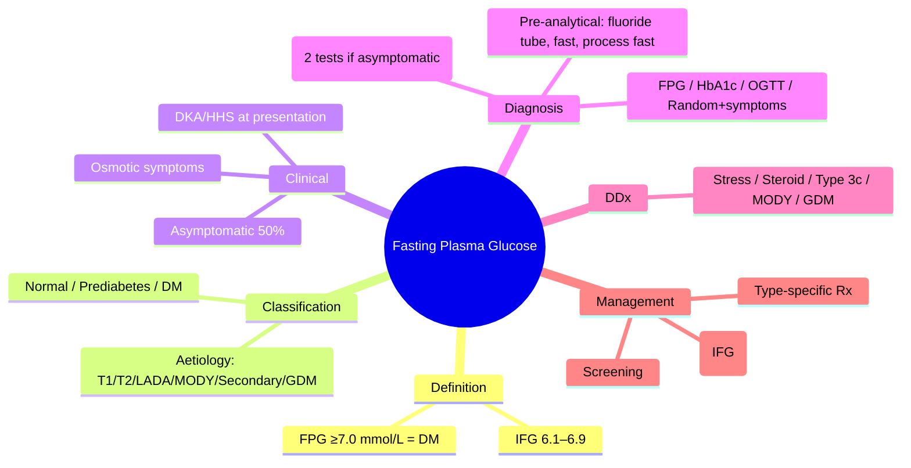

# Fasting Plasma Glucose

> [!info]
> **FPG ≥7.0 mmol/L (126 mg/dL) = Diabetes** — primary diagnostic test per ADA/WHO. Requires confirmatory repeat unless unequivocal hyperglycaemia with acute metabolic decompensation.

---

## 1. Learning Objectives
By the end of this note you should be able to:
- [ ] State FPG diagnostic cut-offs for diabetes and prediabetes
- [ ] Apply confirmatory testing rules (repeat on separate day)
- [ ] Interpret FPG in context of symptoms and other tests
- [ ] Recognise pre-analytical factors affecting FPG accuracy
- [ ] Counsel on screening intervals and populations

---

## 2. Definition & Epidemiology

| Feature | Detail |
|---------|--------|
| **Definition** | Fasting plasma glucose ≥7.0 mmol/L (126 mg/dL) after ≥8h caloric restriction |
| **Prediabetes (IFG)** | FPG 6.1–6.9 mmol/L (110–125 mg/dL) |
| **Normal** | FPG <6.1 mmol/L (<110 mg/dL) |
| **Global Prevalence** | 537M adults (2021) → 783M by 2045 (IDF); ~90% type 2 |
| **UK Prevalence** | ~4.9M diagnosed (2023); ~1M undiagnosed |
| **Peak Age** | Type 2: >40y; Type 1: bimodal (4–7y, 10–14y) |
| **Sex Ratio** | Slight male predominance in type 2 |
| **Risk Factors** | Obesity, family history, ethnicity (South Asian, African-Caribbean), gestational DM, PCOS, antipsychotics, steroids |

> **WHO 2006 / ADA 2024 alignment**: Identical FPG cut-offs. HbA1c ≥48 mmol/mol (6.5%) equally valid.

---

## 3. Clinical Features / Presentation

| Presentation | Frequency | Key Features |
|-------------|-----------|--------------|
| **Asymptomatic** | ~50% at diagnosis | Incidental finding on screening/health check |
| **Classic osmotic symptoms** | Common if marked hyperglycaemia | Polyuria, polydipsia, nocturia, weight loss, fatigue, blurred vision |
| **Infections** | Common | Recurrent candidiasis, UTIs, skin infections |
| **Acute metabolic decompensation** | Type 1: 25–30% at Dx | DKA (T1DM), HHS (T2DM elderly) |

> **Red Flags**: Ketosis at presentation → think Type 1 / LADA; rapid weight loss + osmotic symptoms in adult → LADA; pancreatic cancer (new-onset DM >50y + weight loss).

---

## 4. Classification / Staging / Grading

| System | Categories | Key Features / Prognosis |
|--------|------------|--------------------------|
| **ADA/WHO Diagnostic Criteria** | Normal: FPG <6.1 mmol/L | Low risk |
| | IFG (Prediabetes): FPG 6.1–6.9 mmol/L | 5–10%/yr progression to T2DM |
| | Diabetes: FPG ≥7.0 mmol/L | Confirm on separate day unless symptomatic + random ≥11.1 |
| **Aetiological Classification** | Type 1 | Autoimmune β-cell destruction |
| | Type 2 | Insulin resistance + β-cell failure |
| | Hybrid (LADA) | Adult-onset, GAD65+, slow progression |
| | Monogenic (MODY) | Autosomal dominant, <25y, non-obese |
| | Secondary (Type 3c, endocrine, drug) | Pancreatic, Cushing, steroids, etc. |
| | GDM | Hyperglycaemia first detected in pregnancy |

> **Diagnostic Algorithm**: Symptomatic → Random glucose ≥11.1 = DM (no repeat needed). Asymptomatic → **Two abnormal tests required** (same test on different day, or two different tests e.g., FPG + HbA1c).

---

## 5. Diagnosis & Investigations

| Investigation | Role | Key Details / Findings |
|---------------|------|------------------------|
| **FPG** | Primary diagnostic / screening | ≥7.0 mmol/L = DM; 6.1–6.9 = IFG; <6.1 = normal. **Pre-analytical**: True fasting ≥8h; avoid stress/illness; sample in fluoride tube (grey top); process ≤1h or centrifuge promptly (glycolysis ↓glucose 5–7%/hr at room temp). |
| **HbA1c** | Alternative diagnostic / monitoring | ≥48 mmol/mol (6.5%) = DM; 39–47 = prediabetes. NGSP/DCCT standardised. **Limitations**: Haemoglobinopathies, anaemia, CKD, pregnancy, recent transfusion. |
| **OGTT (75g)** | Gold standard (research/GDM) | 2h ≥11.1 mmol/L = DM; 7.8–11.0 = IGT. Rarely used for routine T2DM diagnosis. |
| **Random glucose + symptoms** | Acute presentation | ≥11.1 mmol/L with polyuria/polydipsia = DM (no confirm needed). |
| **Autoantibodies (GAD65, IA-2, ZnT8, IAA)** | Aetiological classification | ≥1 positive = autoimmune (Type 1/LADA). |
| **C-peptide** | Residual β-cell function | Low/undetectable = Type 1; preserved = Type 2/MODY. |

```mermaid
flowchart TD
    A[Clinical Suspicion / Screening] --> B{Asymptomatic?}
    B -->|Yes| C[FPG ≥7.0 OR HbA1c ≥48]
    C --> D{Confirmatory test same/different day}
    D -->|Abnormal| E[Diagnosis: Diabetes]
    D -->|Normal| F[Repeat in 3-6 months]
    B -->|No (symptomatic)| G[Random glucose ≥11.1 + symptoms]
    G --> E
    E --> H[Aetiological classification: autoantibodies, C-peptide, clinical context]
```

---

## 6. Differential Diagnosis

| Condition | Distinguishing Features |
|-----------|-------------------------|
| **Stress hyperglycaemia** | Acute illness, MI, stroke, surgery → resolves; no prior dysglycaemia; HbA1c normal |
| **Steroid-induced hyperglycaemia** | Known steroid use; post-prandial predominance; resolves with taper |
| **Pancreatic diabetes (Type 3c)** | Exocrine insufficiency (low faecal elastase), chronic pancreatitis/CT changes, no autoantibodies |
| **MODY** | Age <25, non-obese, strong FH (3 generations), negative autoantibodies, C-peptide preserved |
| **Gestational diabetes** | First detected in pregnancy; OGTT diagnostic; resolves postpartum (but 50% lifetime T2DM risk) |
| **Renal glycosuria** | Normal FPG, glycosuria at low glucose threshold (SGLT2 mutation) — benign |

---

## 7. Management

### Acute / Inpatient Management
| Step | Intervention | Dose / Details |
|------|--------------|----------------|
| 1 | If symptomatic + random ≥11.1 → **diagnose immediately** | No confirmatory test needed; start treatment per type |
| 2 | If DKA/HHS → **emergency protocol** | See DKA/HHS notes |
| 3 | New diagnosis without ketosis → **outpatient workup** | FPG/HbA1c confirm, autoantibodies, C-peptide, education |

### Chronic / Outpatient Management
| Setting | Intervention | Dose / Monitoring |
|---------|--------------|-------------------|
| **Prediabetes (IFG/IGT)** | Intensive lifestyle (7% wt loss, 150min/wk) | FPG/HbA1c annually; metformin if BMI ≥35, age <60, GDM hx |
| **Type 2 DM** | Metformin + lifestyle 1st line | HbA1c 3-monthly till target, then 6-monthly |
| **Type 1 DM** | Basal-bolus insulin + carb counting | HbA1c 3-monthly; CGM if available |
| **Screening** | ADA: age ≥35 or BMI ≥25 + risk factor | Repeat q3y if normal |

> **Screening Algorithm**: ADA: ≥35y OR BMI ≥25 (23 Asian) + risk factor → FPG/HbA1c/OGTT. NICE: Risk score (age, ethnicity, BMI, FH) → if high risk → HbA1c/FPG.

---

## 8. FCPS/MRCP High-Yield Summary

| Topic | Key Points |
|-------|------------|
| **FPG cut-offs** | Normal <6.1; IFG 6.1–6.9; DM ≥7.0 mmol/L |
| **Confirmatory rule** | Asymptomatic: **two abnormal tests** (same test different day, or two different tests). Symptomatic + random ≥11.1: **single test sufficient**. |
| **Pre-analytical** | Fluoride tube, ≥8h fast, process ≤1h (glycolysis artefact) |
| **HbA1c equivalent** | ≥48 mmol/mol (6.5%) = DM; 39–47 = prediabetes |
| **OGTT** | 2h ≥11.1 = DM; 7.8–11.0 = IGT (rarely used for T2DM dx) |
| **Screening age** | ADA: ≥35y; NICE: risk score → test if high |
| **IFG vs IGT** | IFG = hepatic IR; IGT = muscle IR; both = higher risk |

---

## 9. Viva Questions (MRCP PACES / FCPS)

| Question | Expected Answer |
|----------|-----------------|
| **What is the diagnostic FPG for diabetes?** | ≥7.0 mmol/L (126 mg/dL) after ≥8h fast |
| **What is impaired fasting glucose (IFG)?** | FPG 6.1–6.9 mmol/L (110–125 mg/dL) |
| **When do you need a confirmatory test?** | Asymptomatic patient — require two abnormal results (same test on different day, or FPG + HbA1c). Symptomatic + random ≥11.1 = single test sufficient. |
| **What are pre-analytical requirements for FPG?** | True fast ≥8h (water only), fluoride-oxalate tube (grey top), process ≤1h or centrifuge immediately (glycolysis lowers glucose 5–7%/hr at room temp). |
| **Diagnostic criteria for diabetes (ADA/WHO)?** | 1) FPG ≥7.0, 2) 2h-OGTT ≥11.1, 3) HbA1c ≥48 mmol/mol (6.5%), 4) Random ≥11.1 + symptoms. Any one confirmed = DM. |
| **How does IFG differ from IGT pathophysiologically?** | IFG = hepatic insulin resistance (excess HGP); IGT = peripheral/muscle insulin resistance; combined IFG+IGT = highest progression risk (~15–20%/yr). |
| **Screening recommendations for asymptomatic adults?** | ADA: age ≥35 OR BMI ≥25 (23 Asian) + ≥1 risk factor. NICE: validated risk score (e.g., Leicester, QDiabetes) → if high risk, test HbA1c/FPG. Repeat q3y if normal. |
| **Red flags for secondary/monogenic diabetes?** | Age <25 + non-obese + strong FH + negative autoantibodies → MODY; new-onset >50y + weight loss → pancreatic cancer; steroid use → drug-induced; Cushing/acromegaly features → endocrine. |

---

## 10. Confusions & Mnemonics

| Confusion | Clarification |
|-----------|---------------|
| **FPG vs HbA1c for diagnosis** | Both valid; HbA1c = convenience (no fast), but invalid in anaemia/haemoglobinopathy/CKD/pregnancy. FPG = gold standard in those conditions. |
| **One test vs two tests** | Symptomatic = one test. Asymptomatic = two tests (per ADA/WHO). |
| **IFG vs IGT** | IFG = fasting hepatic IR; IGT = post-load muscle IR. Different pathophysiology, same prediabetes category. |

**Mnemonic: FASTING**
- **F**asting ≥8h (water only)
- **A**nalyte: Plasma glucose (not whole blood)
- **S**ample: Fluoride-oxalate (grey top)
- **T**iming: Process ≤1h (glycolysis)
- **I**nterpret: <6.1 normal, 6.1–6.9 IFG, ≥7.0 DM
- **N**eeds confirm if asymptomatic
- **G**lucose random + symptoms = single test dx

---

## 11. Mind Map



---

## 12. One-Page Revision Card

| Domain | Key Points |
|--------|------------|
| **Definition** | FPG ≥7.0 mmol/L (126 mg/dL) after ≥8h fast = Diabetes |
| **Key Test** | FPG (fluoride tube, true fast, process ≤1h) |
| **Classification** | Normal <6.1; IFG 6.1–6.9; DM ≥7.0 mmol/L |
| **Acute Mgmt** | Symptomatic + random ≥11.1 → diagnose & treat immediately |
| **Chronic Mgmt** | IFG: lifestyle ± metformin; DM: type-specific algorithm |
| **Key Score** | ADA screening: age ≥35 or BMI ≥25 + risk factor |
| **Complications** | Missed diagnosis → DKA/HHS; overdiagnosis (stress hyperglycaemia) → unnecessary treatment |
| **Prognosis** | IFG → 5–10%/yr progression to T2DM; lifestyle halves risk |

---

## 13. Spaced Repetition Trackers

| Review Interval | Date Completed | Confidence (1-5) | Notes |
|-----------------|----------------|------------------|-------|
| 24 hours | | | |
| 7 days | | | |
| 15 days | | | |
| 30 days | | | |
| 90 days | | | |

---

## 14. Self-Test Scorecard

| Section | Score /5 | Last Attempt |
|---------|----------|--------------|
| Definition & Epidemiology | | |
| Classification & Staging | | |
| Clinical Features | | |
| Diagnosis & Investigations | | |
| Management (Acute) | | |
| Management (Chronic) | | |
| Complications | | |
| Viva Questions | | |
| DDx Distinctions | | |
| Mnemonics/Algorithms | | |

---

## Local Navigation (for Dashboard UI)
> **Parent**: [[../Classification and Diagnosis of Diabetes Mellitus/Diagnostic criteria|Diagnostic criteria]]  
> **Hierarchy**: [[../../Davidson Chapter 25 - Diabetes Hierarchy|Diabetes Hierarchy]]  
> **Template**: [[../../../Templates/Diabetes Topic Template|Diabetes Topic Template]]  
> **See also**: [[HbA1c diagnosis]], [[Oral glucose tolerance test (OGTT)]], [[Impaired fasting glucose (IFG)]]

---

## Tags
#medicine #diabetes #davidson #fcps #mrcp #full-fcps-mrcp-note