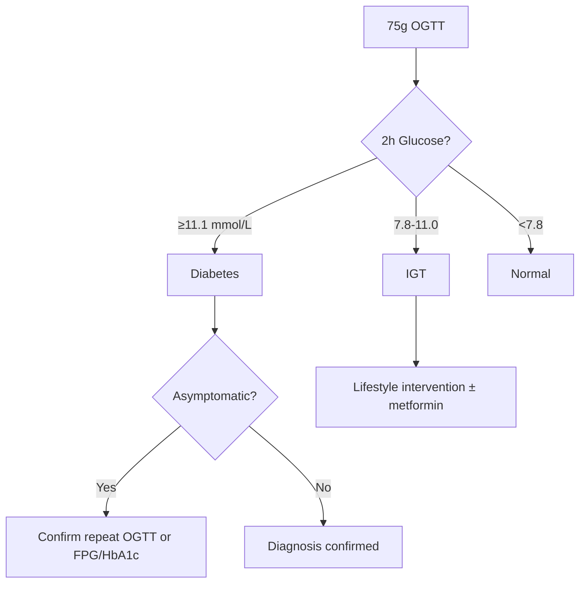

# Oral glucose tolerance test (OGTT)

---
tags: [medicine, diabetes, davidson, oral-glucose-tolerance-test-(ogtt), fcps, mrcp]
davidson_part: Part 3: Clinical Medicine
davidson_chapter: Chapter 25: Endocrinology and Diabetes
status: full-fcps-mrcp-note
priority: HIGH
exam_relevance: "FCPS/MRCP High Yield - Core diabetes topic"
see_also: ["Oral glucose tolerance test (OGTT)"]
created: 2026-06-13
modified: 2026-06-13
---

# Oral glucose tolerance test (OGTT)

## 1. Learning Objectives
- [ ] State OGTT protocol (75g anhydrous glucose, fasting, 2h sample)
- [ ] Interpret OGTT results for diabetes, IGT, IFG
- [ ] Know indications for OGTT (GDM, Discordant FPG/HbA1c, Research)
- [ ] Recognise limitations (variability, poor reproducibility)
- [ ] Apply IADPSG/NICE/ADA GDM diagnostic criteria

## 2. Definition & Epidemiology
| Feature | Detail |
|--------|--------|
| **Definition** | 75g OGTT: Fasting + 2h post-load glucose; Gold standard for glucose tolerance |
| **Protocol** | ≥8h fast → baseline FPG → 75g anhydrous glucose in 250–300ml water over 5min → 2h sample (patient seated, no smoking) |
| **Diagnostic Cut-offs (WHO/ADA)** | 2h ≥11.1 mmol/L = Diabetes; 2h 7.8–11.0 = IGT; FPG 6.1–6.9 = IFG |
| **GDM Criteria (IADPSG)** | FBG ≥5.1, 1h ≥10.0, 2h ≥8.5 mmol/L (one abnormal = GDM) |
| **GDM Criteria (NICE)** | FBG ≥5.6 OR 2h ≥7.8 mmol/L (if risk factors present) |

## 3. Clinical Features / Presentation
| Presentation | Frequency | Key Features |
|-------------|-----------|--------------|
| **Screening T2DM** | Rare | Only if FPG/HbA1c discordant |
| **GDM screening** | Universal (IADPSG) / Risk-based (NICE) | 24–28 weeks gestation |
| **Research/epidemiology** | Standard | WHO criteria |

## 4. Classification / Staging / Grading
| System | Categories | Key Features |
|--------|------------|--------------|
| **WHO/ADA 2h Glucose** | Normal: <7.8 mmol/L | Low risk |
| | IGT: 7.8–11.0 mmol/L | ↑T2DM risk (5–10%/yr); CVD risk |
| | Diabetes: ≥11.1 mmol/L | Confirm if asymptomatic |
| **Combined IFG/IGT** | Isolated IFG | Hepatic IR |
| | Isolated IGT | Muscle IR |
| | IFG + IGT | Highest progression risk (15–20%/yr) |

## 5. Diagnosis & Investigations
| Investigation | Role | Key Details |
|---------------|------|-------------|
| **FPG** | Part of OGTT / alternative dx | ≥7.0 = DM; 6.1–6.9 = IFG |
| **2h Glucose** | Primary OGTT outcome | ≥11.1 = DM; 7.8–11.0 = IGT |
| **HbA1c** | Alternative dx | ≥48 mmol/mol = DM; 39–47 = prediabetes |
| **GDM OGTT** | 75g, 3 timepoints | IADPSG: FBG≥5.1, 1h≥10.0, 2h≥8.5 (one value) |

## 6. Differential Diagnosis
| Condition | Distinguishing Features |
|-----------|-------------------------|
| **Physiological glucose intolerance of pregnancy** | Normal OGTT outside pregnancy; resolves postpartum |
| **Dumping syndrome** | Early peak (30–60min), then reactive hypoglycaemia; post-gastrectomy |
| **Acromegaly** | Paradoxical GH rise on OGTT; IGF-1 elevated |
| **Phaeochromocytoma** | Catecholamine-induced hyperglycaemia; plasma metanephrines |
| **Renal glycosuria** | Normal FPG/2h, glycosuria at low threshold (SGLT2 mutation) |

## 7. Management
| Setting | Intervention | Details |
|---------|--------------|---------|
| **IGT** | Intensive lifestyle (DPP: 7% wt loss, 150min/wk) ± metformin (if BMI≥35, age<60, GDM hx) | Annual OGTT/FPG/HbA1c |
| **GDM** | Diet → Metformin (if FBG>5.5 or 1h>7.0) → Insulin; Targets: FBG<5.3, 1h<7.8, 2h<6.4 | Postpartum OGTT 6–13 weeks |
| **Discordant FPG/HbA1c** | OGTT as tie-breaker | Use if HbA1c unreliable |

## 8. FCPS/MRCP High-Yield Summary
| Topic | Key Points |
|-------|------------|
| **OGTT protocol** | 75g anhydrous glucose, fasting ≥8h, 2h sample, patient seated |
| **Cut-offs** | 2h ≥11.1 = DM; 7.8–11.0 = IGT; <7.8 = normal |
| **GDM (IADPSG)** | FBG≥5.1, 1h≥10.0, 2h≥8.5 mmol/L — ONE abnormal = GDM |
| **GDM (NICE)** | Risk factors → OGTT; FBG≥5.6 OR 2h≥7.8 |
| **When to use OGTT** | GDM; discordant FPG/HbA1c; research; equivocal HbA1c |
| **Reproducibility** | Poor (CV ~15%) — less reproducible than FPG/HbA1c |

## 9. Viva Questions
| Question | Expected Answer |
|----------|-----------------|
| **OGTT protocol for diabetes diagnosis?** | 75g anhydrous glucose in 250–300ml water over 5min after ≥8h fast; measure FPG and 2h glucose; patient seated, no smoking |
| **2h glucose cut-offs?** | Normal <7.8; IGT 7.8–11.0; DM ≥11.1 mmol/L |
| **GDM diagnostic criteria (IADPSG)?** | FBG ≥5.1, 1h ≥10.0, 2h ≥8.5 mmol/L — ONE abnormal value sufficient |
| **GDM diagnostic criteria (NICE)?** | Risk factors (BMI>30, prev GDM, FH, ethnicity) → OGTT; FBG ≥5.6 OR 2h ≥7.8 |
| **When is OGTT preferred over FPG/HbA1c?** | GDM; discordant FPG/HbA1c; HbA1c unreliable (haemoglobinopathy, anaemia, CKD, pregnancy) |
| **Difference between IFG and IGT?** | IFG = hepatic IR (↑HGP); IGT = peripheral/muscle IR; IFG+IGT = highest risk |
| **What is the reproducibility of OGTT?** | Poor — CV ~15%; less reproducible than FPG or HbA1c |

## 10. Confusions & Mnemonics
| Confusion | Clarification |
|-----------|---------------|
| **OGTT vs FPG for T2DM dx** | FPG/HbA1c preferred (convenience, reproducibility); OGTT reserved for GDM, discordance, research |
| **IADPSG vs NICE GDM** | IADPSG: universal, 1 abnormal value, lower thresholds, more diagnoses; NICE: risk-based, 2 thresholds |
| **IGT vs IFG** | Different pathophysiology: IGT = muscle IR; IFG = hepatic IR |

**Mnemonic: OGTT-2HR**
- **O**ral 75g anhydrous glucose
- **G**lucose measured at fasting and 2h
- **T**wo-hour ≥11.1 = DM
- **T**wo-hour 7.8–11.0 = IGT
- **2**h sample critical (not 1h for non-GDM)
- **H**bA1c/FPG preferred for routine T2DM
- **R**eserved for GDM, discordance, research

## Local Navigation (for Dashboard UI)
> **Parent**: [[../Diagnostic criteria|Diagnostic criteria]]  
> **Hierarchy**: [[../../Davidson Chapter 25 - Diabetes Hierarchy|Diabetes Hierarchy]]  
> **Template**: [[../../../Templates/Diabetes Topic Template|Diabetes Topic Template]]  
> **See also**: [[Fasting plasma glucose]], [[HbA1c diagnosis]], [[Gestational diabetes mellitus (GDM)]]

---
## Tags
#medicine #diabetes #davidson #fcps #mrcp #full-fcps-mrcp-note
