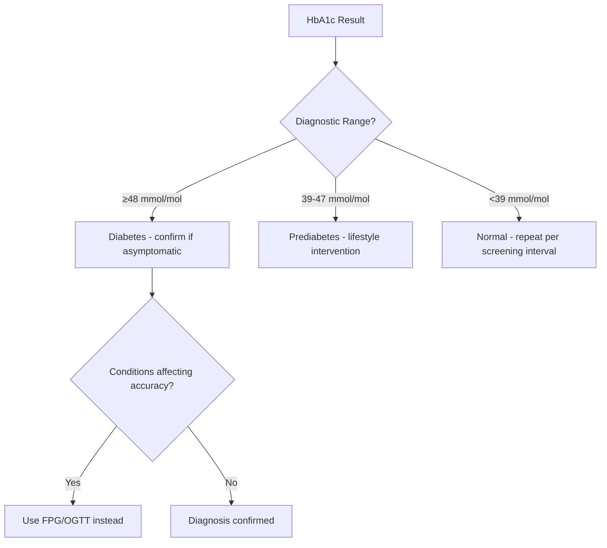

# HbA1c diagnosis

---
tags: [medicine, diabetes, davidson, hba1c-diagnosis, fcps, mrcp]
davidson_part: Part 3: Clinical Medicine
davidson_chapter: Chapter 25: Endocrinology and Diabetes
status: full-fcps-mrcp-note
priority: HIGH
exam_relevance: "FCPS/MRCP High Yield - Core diabetes topic"
see_also: ["HbA1c diagnosis"]
created: 2026-06-13
modified: 2026-06-13
---

# HbA1c diagnosis

## 1. Learning Objectives
- [ ] State HbA1c diagnostic cut-offs for diabetes and prediabetes
- [ ] Identify conditions where HbA1c is unreliable (haemoglobinopathies, anaemia, CKD, pregnancy)
- [ ] Choose alternative tests when HbA1c invalid
- [ ] Interpret HbA1c vs FPG/OGTT discordance
- [ ] Apply screening and monitoring intervals

## 2. Definition & Epidemiology
| Feature | Detail |
|--------|--------|
| **Definition** | HbA1c ≥48 mmol/mol (6.5%) = Diabetes; 39–47 mmol/mol (5.7–6.4%) = Prediabetes |
| **Principle** | Non-enzymatic glycation of haemoglobin β-chain; reflects mean glucose over ~120 days (RBC lifespan) |
| **Units** | IFCC: mmol/mol; NGSP/DCCT: % (DCCT = IFCC × 0.0915 + 2.15) |
| **Global Standardisation** | NGSP certified, traceable to DCCT |

## 3. Clinical Features / Presentation
| Presentation | Frequency | Key Features |
|-------------|-----------|--------------|
| **Asymptomatic screening** | Common | Incidental finding |
| **Symptomatic hyperglycaemia** | If marked | Osmotic symptoms, weight loss |
| **Falsely elevated** | In conditions below | Anaemia (iron/B12/folate deficiency), asplenia, haemoglobinopathies (HbF, HbS trait) |
| **Falsely lowered** | In conditions below | Haemolytic anaemia, blood loss, CKD/ESRD (↓RBC lifespan), ESA therapy, pregnancy (2nd/3rd trim), recent transfusion |

## 4. Classification / Staging / Grading
| System | Categories | Key Features |
|--------|------------|--------------|
| **ADA/WHO Diagnostic** | Normal: <39 mmol/mol (<5.7%) | Low risk |
| | Prediabetes: 39–47 mmol/mol (5.7–6.4%) | 5–10%/yr progression |
| | Diabetes: ≥48 mmol/mol (≥6.5%) | Confirm on separate day unless symptomatic |
| **Monitoring Targets** | Standard: <53 mmol/mol (7.0%) | Most adults |
| | Tighter: <48 mmol/mol (6.5%) | If achievable without hypo, short duration |
| | Looser: <58–64 mmol/mol (7.5–8.0%) | Elderly, frail, comorbidities, hypo unawareness |

## 5. Diagnosis & Investigations
| Investigation | Role | Key Details |
|---------------|------|-------------|
| **HbA1c** | Primary dm dx / monitoring | ≥48 mmol/mol = DM; 39-47 = prediabetes. **No fasting needed**. Standardised (NGSP/DCCT). |
| **FPG** | Alternative dx / when HbA1c invalid | ≥7.0 mmol/L = DM. Use if haemoglobinopathy, anaemia, CKD, pregnancy, recent transfusion. |
| **OGTT** | Gold standard / GDM | 75g, 2h ≥11.1 = DM. Use if HbA1c/FPG discordant. |
| **Fructosamine / Glycated Albumin** | Alternative in CKD/haemoglobinopathy | Reflects 2–3 week glucose; no DCCT standardisation. |

## 6. Differential Diagnosis (Conditions Affecting HbA1c)
| Condition | Effect on HbA1c | Mechanism |
|-----------|-----------------|-----------|
| **Iron/B12/folate deficiency anaemia** | ↑ Falsely high | ↓Erythropoiesis → older RBCs → more glycation |
| **Haemolytic anaemia / blood loss** | ↓ Falsely low | ↓RBC lifespan → less time for glycation |
| **CKD / ESRD / ESA therapy** | ↓ Falsely low | ↓RBC lifespan, ESA stimulates young RBCs |
| **Pregnancy (2nd/3rd tri)** | ↓ Falsely low | ↑Erythropoiesis, ↓RBC lifespan |
| **Haemoglobinopathies (HbS, HbC, HbF, HbE)** | Variable | Altered glycation kinetics, assay interference |
| **Recent transfusion** | ↓ Falsely low | Donor RBCs with normal glucose exposure |
| **Vitamin E / C high dose** | ↓ Falsely low | Antioxidant inhibits glycation |
| **Opioids / Salicylates** | ↑ Falsely high | Chemical modification of Hb |

## 7. Management
| Setting | Intervention | Details |
|---------|--------------|---------|
| **Diabetes dx** | HbA1c ≥48 on two occasions (or one if symptomatic) | Use FPG/OGTT if HbA1c unreliable |
| **Prediabetes** | Intensive lifestyle (DPP protocol) ± metformin | Repeat HbA1c annually |
| **Monitoring established DM** | Individualised target (see table) | 3-monthly till target, then 6-monthly |
| **CKD/haemoglobinopathy** | Use FPG + fructosamine/GA | HbA1c not recommended |

## 8. FCPS/MRCP High-Yield Summary
| Topic | Key Points |
|-------|------------|
| **Diagnostic cut-offs** | DM ≥48 mmol/mol (6.5%); Prediabetes 39–47 (5.7–6.4%) |
| **When HbA1c unreliable** | Anaemia, haemoglobinopathy, CKD/ESRD, pregnancy, recent transfusion, haemolysis, ESA |
| **Alternative in CKD** | Fructosamine (2–3 wk avg) or glycated albumin (3 wk); FPG/OGTT |
| **Conversion** | IFCC (mmol/mol) = (NGSP% - 2.15) × 10.93; NGSP% = IFCC × 0.0915 + 2.15 |
| **Monitoring frequency** | 3-monthly if changing therapy/not at target; 6-monthly if stable |
| **Individualised targets** | Standard <53 (7.0%); Tight <48 (6.5%); Loose <58–64 (7.5–8.0%) |

## 9. Viva Questions
| Question | Expected Answer |
|----------|-----------------|
| **HbA1c diagnostic threshold for diabetes?** | ≥48 mmol/mol (6.5%) per ADA/WHO |
| **When is HbA1c unreliable for diagnosis?** | Haemoglobinopathies, anaemia (iron/B12/folate), CKD/ESRD, pregnancy 2nd/3rd tri, recent transfusion, haemolysis, ESA therapy |
| **What alternative tests in CKD?** | FPG, OGTT, fructosamine, glycated albumin |
| **What does HbA1c reflect?** | Mean glucose over ~120 days (RBC lifespan); weighted to recent 30 days (50%) |
| **Why falsely low in CKD?** | ↓RBC lifespan + ESA → younger RBC population → less glycation time |
| **Difference between IFCC and NGSP units?** | NGSP% = DCCT aligned; IFCC mmol/mol = SI unit; Conversion: NGSP = IFCC × 0.0915 + 2.15 |

## 10. Confusions & Mnemonics
| Confusion | Clarification |
|-----------|---------------|
| **HbA1c vs FPG discordance** | If both available and discordant → repeat abnormal test; if still discordant → 3rd test (OGTT) |
| **HbA1c in pregnancy** | Not recommended for diagnosis/monitoring; use OGTT (GDM) or FPG/CGM (pre-existing DM) |
| **Fructosamine vs HbA1c** | Fructosamine = 2–3 week avg; no DCCT standardisation; use when HbA1c invalid |

**Mnemonic: HBA1C FAILS**
- **H**aemoglobinopathies (HbS, HbC, HbF, HbE)
- **B**lood loss / haemolysis
- **A**naemia (iron, B12, folate deficiency) → falsely HIGH
- **1** (CKD/ESRD/ESA) → falsely LOW
- **C**KD / pregnancy / transfusion → falsely LOW
- **F**ructosamine/GA alternative
- **A**ssay interference (vit E/C, opioids, salicylates)
- **I**ron deficiency → falsely HIGH
- **L**ow RBC lifespan → falsely LOW
- **S**creening: not in pregnancy

## Local Navigation (for Dashboard UI)
> **Parent**: [[../Diagnostic criteria|Diagnostic criteria]]  
> **Hierarchy**: [[../../Davidson Chapter 25 - Diabetes Hierarchy|Diabetes Hierarchy]]  
> **Template**: [[../../../Templates/Diabetes Topic Template|Diabetes Topic Template]]  
> **See also**: [[Fasting plasma glucose]], [[Oral glucose tolerance test (OGTT)]]

---
## Tags
#medicine #diabetes #davidson #fcps #mrcp #full-fcps-mrcp-note
---

> Auto-generated study sections for "Diagnostic criteria" — Ch 21: Diabetes Mellitus.

## Flashcards (3 generated)

- Q: What is the definition of Diagnostic criteria?
  A: HbA1c ≥48 mmol/mol (6.5%) = Diabetes; 39–47 mmol/mol (5.7–6.4%) = Prediabetes
- Q: What is Principle of Diagnostic criteria?
  A: Non-enzymatic glycation of haemoglobin β-chain; reflects mean glucose over ~120 days (RBC lifespan)
- Q: What is Units of Diagnostic criteria?
  A: IFCC: mmol/mol; NGSP/DCCT: % (DCCT = IFCC × 0.0915 + 2.15)

## MCQs (1 generated)

1. **Which of the following best describes Diagnostic criteria?**
   A. **| Definition | HbA1c ≥48 mmol/mol (6.5%) = Diabetes; 39–47 mmol/mol (5.7–6.4%) = Prediabetes |**
   B. An unrelated condition not matching the clinical picture of Diagnostic criteria
   C. A complication seen late in the disease course of Diagnostic criteria
   D. A condition that mimics Diagnostic criteria but has a different underlying cause

## SBA Questions (1 generated)

1. A patient with suspected Diagnostic criteria presents with: Definition — HbA1c ≥48 mmol/mol (6.5%) = Diabetes; 39–47 mmol/mol (5.7–6.4%) = Prediabetes; Principle — Non-enzymatic glycation of haemoglobin β-chain; reflects mean glucose over ~120 days (RBC lifespan); Units — IFCC: mmol/mol; NGSP/DCCT: % (DCCT = IFCC × 0.0915 + 2.15). What is the most likely diagnosis?
   A. **Diagnostic criteria**
   B. A condition that mimics Diagnostic criteria but is not the same entity
   C. A complication of Diagnostic criteria rather than the primary diagnosis
   D. An unrelated condition in the same clinical category as Diagnostic criteria

