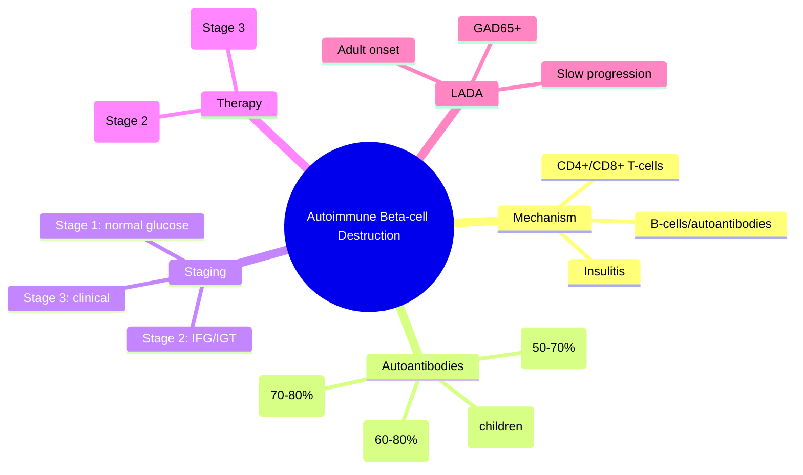

# Autoimmune beta-cell destruction

---
tags: [medicine, diabetes, davidson, pathophysiology, fcps, mrcp]
davidson_part: Part 3: Clinical Medicine
davidson_chapter: Chapter 25: Endocrinology and Diabetes
status: full-fcps-mrcp-note
priority: HIGH
exam_relevance: "FCPS/MRCP High Yield - Core pathophysiology topic"
see_also: ["Autoimmune beta-cell destruction", "Genetic susceptibility (HLA, INS, PTPN22)", "Environmental triggers", "Stages of type 1 diabetes (pre-symptomatic, symptomatic)"]
created: 2026-06-13
modified: 2026-06-13
---

# Autoimmune beta-cell destruction

## 1. Learning Objectives
By the end of this note you should be able to:
- [ ] Describe the autoimmune mechanism of beta-cell destruction in T1DM
- [ ] Identify the roles of CD4+/CD8+ T-cells, B-cells, and autoantibodies
- [ ] Explain the concept of insulitis
- [ ] Stage T1DM (pre-symptomatic to clinical)
- [ ] Recognise LADA as slow-progressing autoimmune diabetes

---

## 2. Definition & Epidemiology

| Feature | Detail |
|--------|--------|
| **Process** | T-cell mediated autoimmune destruction of pancreatic beta-cells |
| **Timeline** | Months to years from autoimmunity onset to clinical diabetes |
| **Incidence** | Rising 3-5% annually; peak age 10-14 years |
| **Genetics** | HLA-DR3/DR4-DQ2/DQ8 (40-50% heritability); 50+ non-HLA loci |

---

## 3. Clinical Features / Presentation
(N/A - pathophysiology)

---

## 4. Classification / Staging / Grading

### Stages of T1DM (ADA/JDRF/Endocrine Society)
| Stage | Definition | Glucose | Autoantibodies | Risk of Clinical T1DM |
|-------|------------|---------|----------------|----------------------|
| **Stage 1** | Pre-symptomatic autoimmunity | Normal | 2+ | ~100% lifetime |
| **Stage 2** | Dysglycaemia (pre-diabetes) | IFG/IGT | 2+ | ~75% at 5 years |
| **Stage 3** | Clinical T1DM | Hyperglycaemia | 2+ | 100% |

### Autoantibodies
| Antibody | Target | Sensitivity (T1DM) | Clinical Use |
|----------|--------|-------------------|--------------|
| **GAD65** | Glutamic acid decarboxylase 65 | 70-80% | Most common; LADA marker |
| **IA-2** | Insulinoma-associated antigen 2 | 50-70% | Predicts rapid progression |
| **ZnT8** | Zinc transporter 8 | 60-80% | Complements GAD65/IA-2 |
| **IAA** | Insulin autoantibodies | 40-60% (children) | More common in young children |

---

## 5. Diagnosis & Investigations
| Investigation | Role |
|---------------|------|
| **Autoantibodies** | 1+ positive = autoimmune; 2+ = high risk |
| **C-peptide** | Low/undetectable = T1DM; preserved = T2DM/MODY |
| **HLA typing** | Research/family screening; not routine |

---

## 6. Differential Diagnosis
| Condition | Distinguishing Features |
|-----------|-------------------------|
| **Type 2 DM** | Insulin resistance, not autoimmune; autoantibodies negative |
| **MODY** | Monogenic, autosomal dominant, non-insulin requiring, negative autoantibodies |
| **Secondary DM** | Pancreatic, endocrine, drug-induced; context-dependent |

---

## 7. Management Implications
| Stage | Intervention |
|-------|--------------|
| **Stage 1** | Monitoring (autoantibodies, glucose); clinical trial enrolment (teplizumab) |
| **Stage 2** | **Teplizumab** (FDA approved): delays Stage 3 by ~2 years; glucose monitoring |
| **Stage 3** | Insulin therapy initiated; DKA prevention; education |

---

## 8. FCPS/MRCP High-Yield Summary
| Topic | Key Points |
|-------|------------|
| **Autoimmunity** | CD4+/CD8+ T-cell mediated beta-cell destruction; insulitis |
| **Autoantibodies** | GAD65 (70-80%), IA-2 (50-70%), ZnT8 (60-80%), IAA (children) |
| **Staging** | Stage 1: 2+ Ab + normal glucose; Stage 2: 2+ Ab + IFG/IGT; Stage 3: clinical |
| **Teplizumab** | Anti-CD3 mAb; delays Stage 3 by ~2 years in Stage 2 |
| **LADA** | Adult-onset, GAD65+, slow progression, initial non-insulin response |

---

## 9. Viva Questions
| Question | Expected Answer |
|----------|-----------------|
| **What is the mechanism of beta-cell destruction in T1DM?** | T-cell mediated autoimmune destruction (CD4+/CD8+); insulitis |
| **What are the stages of T1DM?** | Stage 1: 2+ Ab, normoglycaemia; Stage 2: 2+ Ab, dysglycaemia; Stage 3: clinical |
| **Which autoantibodies are tested in T1DM?** | GAD65, IA-2, ZnT8, IAA; 2+ = high risk |
| **What is teplizumab?** | Anti-CD3 monoclonal antibody; FDA approved for Stage 2 T1DM; delays onset by ~2 years |

---

## 10. Confusions & Mnemonics
| Confusion | Clarification |
|-----------|---------------|
| **T1DM = only children?** | NO - can occur at any age; LADA = adult-onset T1DM |
| **Autoantibodies = diagnosis?** | Support diagnosis; clinical context essential |

**Mnemonic: T1DM-AUTO**
- **T**1DM: T-cell mediated beta-cell destruction
- **1**mmune: autoimmune (not metabolic like T2DM)
- **D**estruction: insulitis -> beta-cell loss
- **M**arkers: GAD65, IA-2, ZnT8, IAA
- **A**ntibodies: 2+ = high risk
- **U**nstoppable: Stage 1-2-3 progression
- **T**eplizumab: delays Stage 3 in Stage 2
- **O**ver time: months to years from autoimmunity to clinical

---

## 11. Mind Map

---

## 12. One-Page Revision Card

| Domain | Key Points |
|--------|------------|
| **Definition** | T-cell mediated autoimmune destruction of pancreatic beta-cells |
| **Key Test** | Autoantibodies (GAD65, IA-2, ZnT8, IAA); 2+ = high risk |
| **Classification** | Stage 1: normal glucose; Stage 2: IFG/IGT; Stage 3: clinical |
| **Acute Mgmt** | Teplizumab (Stage 2): delays Stage 3 by ~2 years |
| **Chronic Mgmt** | Insulin therapy (Stage 3); DKA prevention; education |
| **Key Score** | 2+ autoantibodies = high risk; C-peptide low |
| **Complications** | DKA at presentation (25-30%); long-term micro/macrovascular |
| **Prognosis** | Lifelong insulin; microvascular complications if poorly controlled |

---

## 13. Spaced Repetition Trackers

| Review Interval | Date Completed | Confidence (1-5) | Notes |
|-----------------|----------------|------------------|-------|
| 24 hours | | | |
| 7 days | | | |
| 15 days | | | |
| 30 days | | | |
| 90 days | | | |

---

## 14. Self-Test Scorecard

| Section | Score /5 | Last Attempt |
|---------|----------|--------------|
| Definition & Epidemiology | | |
| Classification & Staging | | |
| Diagnosis & Investigations | | |
| Management (Acute) | | |
| Management (Chronic) | | |
| Complications | | |
| Viva Questions | | |
| DDx Distinctions | | |
| Mnemonics/Algorithms | | |

---

### Local Navigation
- **Parent Heading**: [[../Pathophysiology of Diabetes|Pathophysiology of Diabetes]]
- **Chapter Map": [[../../Davidson Chapter 25 - Diabetes Hierarchy|Diabetes Hierarchy]]
- **Chapter MOC": [[../../Diabetes MOC|Diabetes MOC]]
- **Drug Reference": [[../../../Clinical Therapeutics and Good Prescribing|Drugs]]
- **Related": [[Genetic susceptibility (HLA, INS, PTPN22)], [[Environmental triggers]], [[Stages of type 1 diabetes (pre-symptomatic, symptomatic)]]

---
## Tags
#medicine #diabetes #davidson #fcps #mrcp #full-fcps-mrcp-note