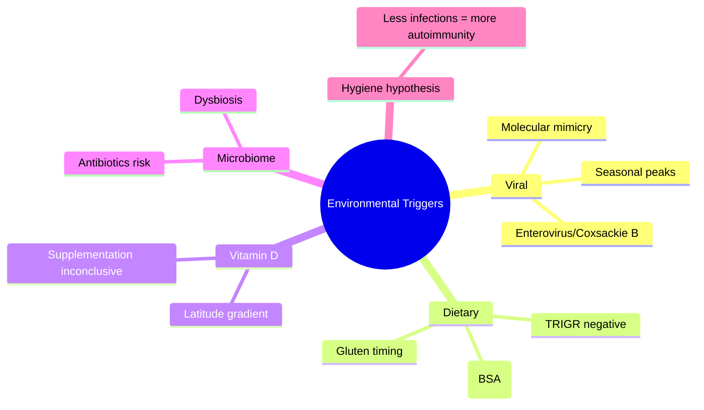

# Environmental triggers

---
tags: [medicine, diabetes, davidson, pathophysiology, fcps, mrcp]
davidson_part: Part 3: Clinical Medicine
davidson_chapter: Chapter 25: Endocrinology and Diabetes
status: full-fcps-mrcp-note
priority: HIGH
exam_relevance: "FCPS/MRCP High Yield - Core pathophysiology topic"
see_also: ["Autoimmune beta-cell destruction", "Genetic susceptibility (HLA, INS, PTPN22)", "Stages of type 1 diabetes (pre-symptomatic, symptomatic)"]
created: 2026-06-13
modified: 2026-06-13
---

# Environmental triggers

## 1. Learning Objectives
By the end of this note you should be able to:
- [ ] Identify proposed environmental triggers for T1DM
- [ ] Explain the hygiene hypothesis and viral trigger theories
- [ ] Evaluate evidence for dietary factors (cow's milk, gluten, vitamin D)
- [ ] Understand microbiome role in autoimmunity

---

## 2. Definition & Epidemiology

| Feature | Detail |
|--------|--------|
| **Trigger Hypothesis** | Environmental factors initiate autoimmunity in genetically susceptible |
| **Evidence** | Migrant studies (risk follows destination); seasonal variation; twin discordance |

---

## 3. Clinical Features / Presentation
(N/A)

---

## 4. Classification / Staging / Grading

### Proposed Environmental Triggers

| Category | Factor | Evidence |
|----------|--------|----------|
| **Viral** | Enterovirus (Coxsackie B), Rotavirus, Rubella, CMV, EBV | Molecular mimicry; seasonal peaks; viral RNA in pancreas |
| **Dietary (early life)** | Cow's milk protein (BSA), gluten, early cereal introduction | TRIGR study: hydrolysed formula no benefit; mixed evidence |
| **Vitamin D** | Low 25(OH)D, low sunlight exposure | Ecological: latitude gradient; supplementation trials mixed |
| **Microbiome** | Dysbiosis, low diversity, antibiotic use | Animal models strong; human: correlational |
| **Hygiene hypothesis** | Reduced infections, caesarean section, urban living | Inverse association with infections/helminths |
| **Toxins** | Nitrosamines (cured meat), heavy metals | Weak/conflicting evidence |

### Timing of Exposure
| Period | Hypothesis |
|--------|------------|
| **Prenatal** | Maternal infections, diet, vitamin D |
| **Perinatal** | Mode of delivery, breastfeeding, early antibiotics |
| **Early childhood** | Diet introduction, infections, microbiome establishment |

---

## 5. Diagnosis & Investigations
(N/A)

---

## 6. Differential Diagnosis
(N/A)

---

## 7. Management / Prevention
| Strategy | Evidence |
|----------|----------|
| **Vitamin D supplementation** | Mixed trials; no clear prevention benefit |
| **Hydrolysed formula** | TRIGR: no reduction in T1DM autoantibodies |
| **Avoidance of early gluten** | No consistent benefit |
| **Probiotics/prebiotics** | Experimental; microbiome modulation |
| **Enterovirus vaccines** | In development (Coxsackie B) |

---

## 8. FCPS/MRCP High-Yield Summary
| Topic | Key Points |
|-------|------------|
| **Viral triggers** | Enterovirus (Coxsackie B) strongest; molecular mimicry; seasonal peaks |
| **Dietary** | Cow's milk (BSA) controversial; TRIGR negative; gluten timing unclear |
| **Vitamin D** | Latitude gradient; low 25(OH)D association; supplementation not proven preventive |
| **Microbiome** | Dysbiosis, low diversity; antibiotic use risk factor |
| **Hygiene hypothesis** | Reduced early infections -> increased autoimmunity |

---

## 9. Viva Questions
| Question | Expected Answer |
|----------|-----------------|
| **What is the strongest viral trigger for T1DM?** | Enterovirus (Coxsackie B) - molecular mimicry; seasonal variation |
| **Does cow's milk cause T1DM?** | TRIGR trial: hydrolysed formula no benefit; evidence inconclusive |
| **What is the hygiene hypothesis in T1DM?** | Reduced early-life infections -> immune dysregulation -> increased autoimmunity |
| **Is vitamin D supplementation preventive?** | No RCT evidence for prevention; observational association only |

---

## 10. Confusions & Mnemonics
| Confusion | Clarification |
|-----------|---------------|
| **Triggers = cause?** | Triggers initiate in genetically susceptible; not sufficient alone |
| **One trigger for all?** | Heterogeneous; multiple pathways to autoimmunity |

**Mnemonic: T1DM-TRIGGERS**
- **T**1DM: environmental triggers in susceptible
- **1** Viral: enterovirus (Coxsackie B) strongest
- **D**iet: cow's milk (BSA), gluten - inconclusive
- **M**icrobiome: dysbiosis, antibiotics risk
- **T**iming: prenatal, perinatal, early childhood
- **R**egional: latitude gradient (vitamin D)
- **I**nhygiene hypothesis: less infections -> more autoimmunity
- **G**luten: timing unclear
- **G**ene-environment interaction essential
- **E**pidemiology: migrant studies prove environmental role
- **R**otavirus, rubella, CMV also implicated
- **S**easonal peaks: winter onset common

---

## 11. Mind Map

---

## 12. One-Page Revision Card

| Domain | Key Points |
|--------|------------|
| **Definition** | Environmental factors initiate autoimmunity in genetically susceptible |
| **Key Test** | N/A (epidemiological) |
| **Classification** | Viral, dietary, microbiome, hygiene, vitamin D |
| **Acute Mgmt** | N/A |
| **Chronic Mgmt** | Vitamin D optimization; breastfeeding; avoid early cow's milk? (inconclusive) |
| **Key Score** | Migrant studies prove environmental role |
| **Complications** | N/A |
| **Prognosis** | Triggers initiate but not sufficient alone |

---

## 13. Spaced Repetition Trackers

| Review Interval | Date Completed | Confidence (1-5) | Notes |
|-----------------|----------------|------------------|-------|
| 24 hours | | | |
| 7 days | | | |
| 15 days | | | |
| 30 days | | | |
| 90 days | | | |

---

## 14. Self-Test Scorecard

| Section | Score /5 | Last Attempt |
|---------|----------|--------------|
| Definition & Epidemiology | | |
| Classification & Staging | | |
| Diagnosis & Investigations | | |
| Management (Acute) | | |
| Management (Chronic) | | |
| Complications | | |
| Viva Questions | | |
| DDx Distinctions | | |
| Mnemonics/Algorithms | | |

---

### Local Navigation
- **Parent Heading**: [[../Pathophysiology of Diabetes|Pathophysiology of Diabetes]]
- **Chapter Map": [[../../Davidson Chapter 25 - Diabetes Hierarchy|Diabetes Hierarchy]]
- **Chapter MOC": [[../../Diabetes MOC|Diabetes MOC]]
- **Drug Reference": [[../../../Clinical Therapeutics and Good Prescribing|Drugs]]
- **Related": [[Autoimmune beta-cell destruction]], [[Genetic susceptibility (HLA, INS, PTPN22)], [[Stages of type 1 diabetes (pre-symptomatic, symptomatic)]]

---
## Tags
#medicine #diabetes #davidson #fcps #mrcp #full-fcps-mrcp-note