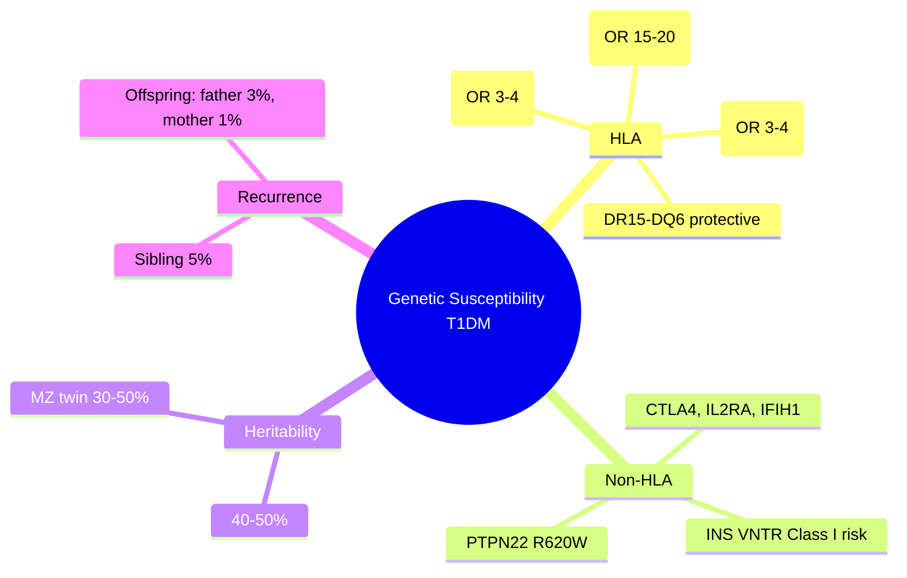

# Genetic susceptibility (HLA, INS, PTPN22)

---
tags: [medicine, diabetes, davidson, pathophysiology, fcps, mrcp]
davidson_part: Part 3: Clinical Medicine
davidson_chapter: Chapter 25: Endocrinology and Diabetes
status: full-fcps-mrcp-note
priority: HIGH
exam_relevance: "FCPS/MRCP High Yield - Core pathophysiology topic"
see_also: ["Autoimmune beta-cell destruction", "Environmental triggers", "Stages of type 1 diabetes (pre-symptomatic, symptomatic)"]
created: 2026-06-13
modified: 2026-06-13
---

# Genetic susceptibility (HLA, INS, PTPN22)

## 1. Learning Objectives
By the end of this note you should be able to:
- [ ] State HLA associations with T1DM (DR3/DR4-DQ2/DQ8)
- [ ] Explain non-HLA genetic susceptibility loci (INS, PTPN22, CTLA4, IL2RA)
- [ ] Calculate genetic risk scores for T1DM
- [ ] Apply genetic testing indications in clinical practice

---

## 2. Definition & Epidemiology

| Feature | Detail |
|--------|--------|
| **Heritability** | 40-50% (concordance: MZ twins 30-50%, DZ twins 6-10%) |
| **HLA Contribution** | ~40% of familial risk |
| **Non-HLA Loci** | 50+ identified (GWAS); each small effect (OR 1.1-1.3) |

---

## 3. Clinical Features / Presentation
(N/A)

---

## 4. Classification / Staging / Grading

### HLA Associations
| Haplotype | Risk | Population Frequency | Notes |
|-----------|------|---------------------|-------|
| **DR3-DQ2** | OR ~3-4 | ~15-20% | DRB1*03:01-DQA1*05:01-DQB1*02:01 |
| **DR4-DQ8** | OR ~3-4 | ~20-25% | DRB1*04:01/04/05-DQA1*03:01-DQB1*03:02 |
| **DR3/DR4 heterozygous** | OR ~15-20 | Highest risk | ~30-40% of T1DM patients |
| **DR15-DQ6 (06:02)** | **Protective** | ~10-15% | Dominant protection |

### Key Non-HLA Genes
| Gene | Function | Odds Ratio | Clinical Relevance |
|------|----------|------------|-------------------|
| **INS** | Insulin gene (VNTR) | 1.5-2.0 | Class I VNTR = risk; Class III = protective |
| **PTPN22** | Lymphoid phosphatase | 1.8-2.0 | R620W variant; autoimmunity risk |
| **CTLA4** | T-cell regulation | 1.2-1.5 | Immune checkpoint |
| **IL2RA** | CD25 (IL-2 receptor alpha) | 1.2-1.5 | Treg function |
| **IFIH1** | Viral RNA sensor (MDA5) | 1.1-1.3 | Viral trigger link |

### Polygenic Risk Score (PRS)
| Application | Status |
|-------------|--------|
| **Population screening** | Research only; not routine |
| **Newborn screening** | Pilot studies (e.g., TEDDY, Fr1da) |
| **Family risk stratification** | Limited clinical use currently |

---

## 5. Diagnosis & Investigations
| Test | Indication |
|------|------------|
| **HLA typing** | Research; family studies; not routine diagnosis |
| **Autoantibodies** | Clinical diagnosis (GAD65, IA-2, ZnT8, IAA) |
| **PRS** | Research stratification |

---

## 6. Differential Diagnosis
(N/A)

---

## 7. Management
| Context | Action |
|---------|--------|
| **Family screening** | Autoantibodies (not HLA); TrialNet, Fr1da, TEDDY |
| **Genetic counselling** | Empiric recurrence risk: 5% (sibling), 3% (offspring if father), 1% (offspring if mother) |
| **Prevention trials** | Teplizumab (Stage 2); abatacept, verapamil, IL-2, ATG/G-CSF trials |

---

## 8. FCPS/MRCP High-Yield Summary
| Topic | Key Points |
|-------|------------|
| **HLA** | DR3/DR4-DQ2/DQ8 = 40-50% risk; DR3/DR4 het = highest; DR15-DQ6 = protective |
| **Non-HLA** | INS VNTR, PTPN22, CTLA4, IL2RA, IFIH1; 50+ loci total |
| **Heritability** | 40-50%; MZ twin concordance 30-50% |
| **Recurrence risk** | Sibling 5%; Offspring: father 3%, mother 1% |
| **PRS** | Research only; not clinical |

---

## 9. Viva Questions
| Question | Expected Answer |
|----------|-----------------|
| **What is the primary HLA association with T1DM?** | HLA-DR3/DR4-DQ2/DQ8; DR3/DR4 heterozygous = highest risk (OR 15-20) |
| **Which HLA haplotype is protective?** | DR15-DQ6 (DQB1*06:02) |
| **What is the recurrence risk for siblings of T1DM patients?** | ~5% |
| **Name key non-HLA genes in T1DM.** | INS (VNTR), PTPN22, CTLA4, IL2RA, IFIH1 |

---

## 10. Confusions & Mnemonics
| Confusion | Clarification |
|-----------|---------------|
| **HLA = diagnostic?** | NO - risk stratification only; autoantibodies for diagnosis |
| **All DR4 = risk?** | Specific alleles: DRB1*04:01, *04:02, *04:05 = risk; *04:03, *04:07 = neutral/protective |

**Mnemonic: T1DM-GENES**
- **T**1DM: 40-50% heritable
- **1** HLA: DR3/DR4-DQ2/DQ8 (40% risk)
- **D**R3/DR4 het: highest risk
- **M**HC Class II: DQ/DR
- **G**enes non-HLA: INS, PTPN22, CTLA4, IL2RA
- **E**mpiric risk: sib 5%, offsp father 3%, mother 1%
- **N**o routine HLA typing
- **E**xclusion: DR15-DQ6 protective
- **S**core: PRS research only

---

## 11. Mind Map

---

## 12. One-Page Revision Card

| Domain | Key Points |
|--------|------------|
| **Definition** | Genetic susceptibility to T1DM: HLA + non-HLA loci |
| **Key Test** | Autoantibodies (clinical); HLA typing (research only) |
| **Classification** | HLA Class II (DR/DQ); non-HLA loci (INS, PTPN22, etc.) |
| **Acute Mgmt** | N/A |
| **Chronic Mgmt** | Family screening (autoantibodies); prevention trials |
| **Key Score** | Empiric recurrence: sib 5%, offspring: father 3%, mother 1% |
| **Complications** | N/A |
| **Prognosis** | 40-50% heritable; prevention trials targeting high-risk |

---

## 13. Spaced Repetition Trackers

| Review Interval | Date Completed | Confidence (1-5) | Notes |
|-----------------|----------------|------------------|-------|
| 24 hours | | | |
| 7 days | | | |
| 15 days | | | |
| 30 days | | | |
| 90 days | | | |

---

## 14. Self-Test Scorecard

| Section | Score /5 | Last Attempt |
|---------|----------|--------------|
| Definition & Epidemiology | | |
| Classification & Staging | | |
| Diagnosis & Investigations | | |
| Management (Acute) | | |
| Management (Chronic) | | |
| Complications | | |
| Viva Questions | | |
| DDx Distinctions | | |
| Mnemonics/Algorithms | | |

---

### Local Navigation
- **Parent Heading**: [[../Pathophysiology of Diabetes|Pathophysiology of Diabetes]]
- **Chapter Map": [[../../Davidson Chapter 25 - Diabetes Hierarchy|Diabetes Hierarchy]]
- **Chapter MOC": [[../../Diabetes MOC|Diabetes MOC]]
- **Drug Reference": [[../../../Clinical Therapeutics and Good Prescribing|Drugs]]
- **Related": [[Autoimmune beta-cell destruction]], [[Environmental triggers]], [[Stages of type 1 diabetes (pre-symptomatic, symptomatic)]]

---
## Tags
#medicine #diabetes #davidson #fcps #mrcp #full-fcps-mrcp-note