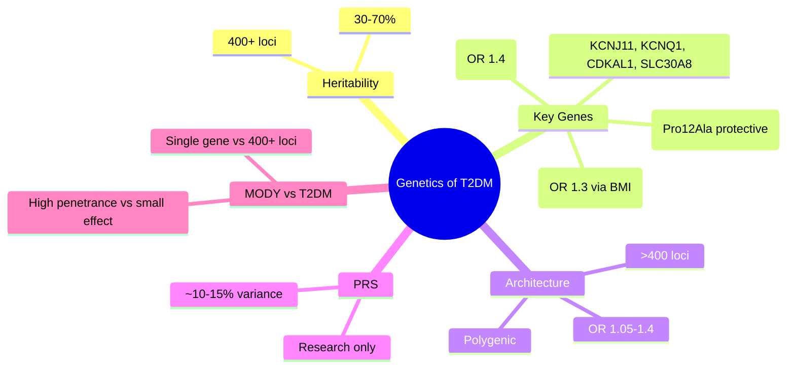

# Genetics of type 2 diabetes (polygenic risk)

---
tags: [medicine, diabetes, davidson, pathophysiology, fcps, mrcp]
davidson_part: Part 3: Clinical Medicine
davidson_chapter: Chapter 25: Endocrinology and Diabetes
status: full-fcps-mrcp-note
priority: HIGH
exam_relevance: "FCPS/MRCP High Yield - Core pathophysiology topic"
see_also: ["Insulin resistance", "Beta-cell dysfunction and failure", "Incretin defect and glucagon dysregulation", "Lipotoxicity and glucotoxicity"]
created: 2026-06-13
modified: 2026-06-13
---

# Genetics of type 2 diabetes (polygenic risk)

## 1. Learning Objectives
By the end of this note you should be able to:
- [ ] State the heritability and genetic architecture of T2DM
- [ ] Identify key susceptibility genes (TCF7L2, KCNJ11, PPARG, FTO)
- [ ] Explain polygenic risk scores and their clinical utility
- [ ] Contrast monogenic (MODY) vs polygenic (T2DM) genetics

---

## 2. Definition & Epidemiology

| Feature | Detail |
|--------|--------|
| **Heritability** | 30-70% (family studies); higher than T1DM |
| **Architecture** | Polygenic: 400+ loci identified (GWAS); each small effect (OR 1.05-1.3) |
| **TCF7L2** | Strongest signal (OR ~1.4); Wnt signalling, proinsulin processing |

---

## 3. Clinical Features / Presentation
(N/A)

---

## 4. Classification / Staging / Grading

### Major T2DM Susceptibility Genes

| Gene | Function | Odds Ratio | Mechanism |
|------|----------|------------|-----------|
| **TCF7L2** | Transcription factor (Wnt) | 1.4 | down Proinsulin processing, down GLP-1 secretion |
| **KCNJ11** | Kir6.2 (KATP channel) | 1.15 | up Insulin secretion (activating variants cause neonatal DM) |
| **PPARG** | PPAR-gamma (adipogenesis) | 1.14 | Pro12Ala variant protective; regulates adipocyte differentiation |
| **FTO** | Fat mass/obesity | 1.3 (via BMI) | up Appetite, up food intake; obesity-mediated |
| **KCNQ1** | Potassium channel | 1.1-1.2 | Beta-cell function |
| **CDKAL1** | tRNA modification | 1.1-1.2 | Beta-cell function |
| **IGF2BP2** | mRNA binding | 1.1-1.2 | Beta-cell development |
| **SLC30A8** | ZnT8 (zinc transporter) | 1.1-1.2 | Insulin crystallisation/secretion |

### Genetic Risk Score (GRS / PRS)
| Type | Composition | Utility |
|------|-------------|---------|
| **Unweighted** | Count of risk alleles | Simple; research |
| **Weighted** | sum beta x allele count | Better prediction; research |
| **Clinical GRS** | ~100 SNPs | Explains ~10-15% variance; not diagnostic |

### Monogenic vs Polygenic
| Feature | MODY (Monogenic) | T2DM (Polygenic) |
|---------|------------------|------------------|
| **Inheritance** | Autosomal dominant | Complex |
| **Genes** | Single (HNF1A, GCK, HNF4A, etc.) | 400+ loci |
| **Effect size** | High (penetrance >90%) | Small (OR 1.05-1.4) |
| **Age of onset** | Usually <25 years | Usually >40 years |
| **Genetic testing** | Diagnostic (causal) | Risk stratification only |

---

## 5. Diagnosis & Investigations
| Test | Role |
|------|------|
| **PRS** | Research stratification; not clinical |
| **Family history** | Best clinical predictor (empiric) |
| **Monogenic gene panel** | If MODY suspected |

---

## 6. Differential Diagnosis
| Feature | MODY | T2DM |
|---------|------|------|
| **Family history** | 3 generations, autosomal dominant | Polygenic clustering |
| **Age** | <25 | >40 (usually) |
| **BMI** | Non-obese | Obese |
| **Autoantibodies** | Negative | Negative |
| **C-peptide** | Preserved | Variable |

---

## 7. Management Implications
| Context | Action |
|---------|--------|
| **Family risk** | Empiric: 40% lifetime if both parents; 20-30% if one parent |
| **PRS screening** | Not recommended for general population |
| **Pharmacogenomics** | TCF7L2: sulfonylurea response?; PPARG: TZD response? |

---

## 8. FCPS/MRCP High-Yield Summary
| Topic | Key Points |
|-------|------------|
| **Heritability** | 30-70%; 400+ loci (GWAS) |
| **Strongest gene** | **TCF7L2** (OR 1.4) -> Wnt signalling, proinsulin processing |
| **Obesity gene** | **FTO** (OR 1.3 via BMI) |
| **PPARG** | Pro12Ala protective; TZD target |
| **KCNJ11** | Kir6.2; activating -> neonatal DM; common variant -> T2DM risk |
| **GRS/PRS** | Explains ~10-15% variance; not diagnostic; research only |
| **Monogenic vs polygenic** | MODY: single gene, dominant, high penetrance; T2DM: 400+ loci, small effects |

---

## 9. Viva Questions
| Question | Expected Answer |
|----------|-----------------|
| **What is the strongest genetic risk factor for T2DM?** | **TCF7L2** (OR 1.4); transcription factor in Wnt signalling |
| **How does FTO contribute to T2DM?** | Via obesity (OR 1.3); up appetite, up food intake |
| **What is a polygenic risk score?** | Weighted sum of risk alleles across ~100-400 SNPs; explains ~10-15% variance |
| **How does TCF7L2 affect diabetes risk?** | down Proinsulin processing, down GLP-1 secretion -> impaired insulin secretion |

---

## 10. Confusions & Mnemonics
| Confusion | Clarification |
|-----------|---------------|
| **Genetics = destiny?** | NO - lifestyle modifies risk; DPP showed lifestyle > metformin even in high genetic risk |
| **PRS = diagnostic?** | NO - risk stratification only; explains small fraction of variance |

**Mnemonic: T2DM-GENES**
- **T**2DM: polygenic, 400+ loci
- **2** (heritability) 30-70%
- **D**M genes: TCF7L2 (strongest), FTO, PPARG, KCNJ11
- **M**onogenic vs polygenic: MODY single gene; T2DM 400+ SNPs
- **G**RS: explains 10-15% variance
- **E**mpiric risk: 40% if both parents, 20-30% if one
- **N**o clinical PRS use yet
- **E**ffect sizes small: OR 1.05-1.4
- **S**NP variants: common, not rare mutations
- **T**CF7L2: Wnt, proinsulin processing
- **Y**ou: lifestyle modifies genetic risk (DPP)

---

## 11. Mind Map

---

## 12. One-Page Revision Card

| Domain | Key Points |
|--------|------------|
| **Definition** | Polygenic architecture: 400+ loci, small effects; TCF7L2 strongest |
| **Key Test" | Family history (empiric); PRS research only |
| **Classification" | Polygenic (T2DM) vs Monogenic (MODY) |
| **Acute Mgmt" | N/A |
| **Chronic Mgmt" | Lifestyle modifies genetic risk (DPP) |
| **Key Score" | PRS explains ~10-15% variance; not diagnostic |
| **Complications" | N/A |
| **Prognosis" | Lifestyle > genetics for prevention (DPP) |

---

## 13. Spaced Repetition Trackers

| Review Interval | Date Completed | Confidence (1-5) | Notes |
|-----------------|----------------|------------------|-------|
| 24 hours | | | |
| 7 days | | | |
| 15 days | | | |
| 30 days | | | |
| 90 days | | | |

---

## 14. Self-Test Scorecard

| Section | Score /5 | Last Attempt |
|---------|----------|--------------|
| Definition & Epidemiology | | |
| Classification & Staging | | |
| Diagnosis & Investigations | | |
| Management (Acute) | | |
| Management (Chronic) | | |
| Complications | | |
| Viva Questions | | |
| DDx Distinctions | | |
| Mnemonics/Algorithms | | |

---

### Local Navigation
- **Parent Heading**: [[../Pathophysiology of Diabetes|Pathophysiology of Diabetes]]
- **Chapter Map": [[../../Davidson Chapter 25 - Diabetes Hierarchy|Diabetes Hierarchy]]
- **Chapter MOC": [[../../Diabetes MOC|Diabetes MOC]]
- **Drug Reference": [[../../../Clinical Therapeutics and Good Prescribing|Drugs]]
- **Related": [[Insulin resistance]], [[Beta-cell dysfunction and failure]], [[Incretin defect and glucagon dysregulation]], [[Lipotoxicity and glucotoxicity]]

---
## Tags
#medicine #diabetes #davidson #fcps #mrcp #full-fcps-mrcp-note