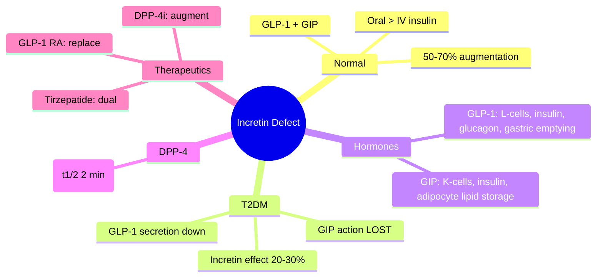

# Incretin defect and glucagon dysregulation

---
tags: [medicine, diabetes, davidson, pathophysiology, fcps, mrcp]
davidson_part: Part 3: Clinical Medicine
davidson_chapter: Chapter 25: Endocrinology and Diabetes
status: full-fcps-mrcp-note
priority: HIGH
exam_relevance: "FCPS/MRCP High Yield - Core pathophysiology topic"
see_also: ["Insulin resistance", "Beta-cell dysfunction and failure", "Lipotoxicity and glucotoxicity", "Genetics of type 2 diabetes (polygenic risk)"]
created: 2026-06-13
modified: 2026-06-13
---

# Incretin defect and glucagon dysregulation

## 1. Learning Objectives
By the end of this note you should be able to:
- [ ] Define the incretin effect and its loss in T2DM
- [ ] Contrast GIP and GLP-1 physiology
- [ ] Explain the role of DPP-4 in incretin degradation
- [ ] Apply this to rationale for GLP-1 RA and DPP-4i therapy

---

## 2. Definition & Epidemiology

| Feature | Detail |
|--------|--------|
| **Incretin Effect** | Oral glucose -> 50-70% greater insulin vs IV glucose |
| **Loss in T2DM** | Decreased 50-70% of incretin effect; GIP action severely impaired |
| **DPP-4** | Degrades GLP-1/GIP (t-half ~2 min) |

---

## 3. Clinical Features / Presentation
(N/A)

---

## 4. Classification / Staging / Grading

### Incretin Hormones

| Hormone | Source | Primary Action | T2DM Defect |
|---------|--------|----------------|-------------|
| **GLP-1** | L-cells (distal ileum/colon) | up Insulin, down glucagon, down gastric emptying, up satiety | Reduced secretion; effect relatively preserved |
| **GIP** | K-cells (duodenum/jejunum) | up Insulin (glucose-dependent), up adipocyte lipid storage | **Severely impaired** insulinotropic effect |
| **DPP-4** | Ubiquitous (endothelium, T-cells) | Degrades GLP-1/GIP | up Activity in T2DM? |

### Incretin Effect Quantification
| Measure | Normal | T2DM |
|---------|--------|------|
| **Incretin Effect (%)** | 50-70% | down 20-30% |
| **GLP-1 AUC** | Normal/low | down 30-50% |
| **GIP AUC** | Normal | Normal/low but **action lost** |

---

## 5. Diagnosis & Investigations
| Test | Role |
|------|------|
| **IVGTT vs OGTT** | Incretin effect = (AUCinsulin_OGTT - AUCinsulin_IVGTT) / AUCinsulin_OGTT |
| **GLP-1/GIP assays** | Research; not routine |
| **DPP-4 activity** | Not clinically measured |

---

## 6. Differential Diagnosis
(N/A)

---

## 7. Therapeutic Implications
| Drug Class | Mechanism | Effect on Incretin Axis |
|------------|-----------|-------------------------|
| **GLP-1 RA** | Replaces/augments GLP-1 | Bypasses DPP-4; supraphysiological |
| **DPP-4i** | Inhibits DPP-4 | up Endogenous GLP-1/GIP 2-3x |
| **Tirzepatide** | Dual GIP/GLP-1 RA | Restores GIP action + GLP-1 |

---

## 8. FCPS/MRCP High-Yield Summary
| Topic | Key Points |
|-------|------------|
| **Incretin effect** | Oral > IV glucose insulin response (50-70%); lost in T2DM |
| **GLP-1** | Reduced secretion; effect relatively preserved |
| **GIP** | **Severe insulinotropic defect** in T2DM (despite normal levels) |
| **DPP-4** | Degrades both (t-half 2 min); target for DPP-4i |
| **Therapeutics** | GLP-1 RA (replace), DPP-4i (preserve), Tirzepatide (dual) |

---

## 9. Viva Questions
| Question | Expected Answer |
|----------|-----------------|
| **What is the incretin effect?** | Oral glucose elicits 50-70% greater insulin response than IV glucose at same glycaemia |
| **How does the incretin effect differ in T2DM?** | Reduced to 20-30%; GIP insulinotropic effect severely impaired; GLP-1 secretion reduced |
| **Why does GIP lose effect in T2DM?** | Post-receptor defect in beta-cells; GIP receptor signalling impaired; mechanism unclear |
| **How do GLP-1 RA and DPP-4i address the incretin defect?** | GLP-1 RA: supraphysiological GLP-1R agonism; DPP-4i: up endogenous GLP-1/GIP 2-3x |

---

## 10. Confusions & Mnemonics
| Confusion | Clarification |
|-----------|---------------|
| **GIP = no role in T2DM?** | GIP levels normal but action lost; tirzepatide restores GIP action |
| **GLP-1 secretion = normal in T2DM?** | Reduced by 30-50%; GLP-1 RA provides supraphysiological levels |

**Mnemonic: INCRETIN-LOSS**
- **I**ncretin effect: oral > IV glucose insulin (50-70%)
- **N**ormal: 50-70% augmentation
- **C**reases: T2DM -> 20-30%
- **R**eason: GIP action lost, GLP-1 reduced
- **E**nttin: GLP-1 + GIP
- **T**2DM: GIP action severely impaired
- **I**nsulinotropic: GIP > GLP-1 normally
- **N**eutral: DPP-4 degrades both (t-half 2 min)
- **L**oss: GIP > GLP-1 in T2DM
- **O**ral vs IV: incretin effect quantified
- **S**GLT2i/GLP-1 RA: bypass/restore
- **S**tory: tirzepatide dual agonist

---

## 11. Mind Map

---

## 12. One-Page Revision Card

| Domain | Key Points |
|--------|------------|
| **Definition** | Incretin effect (oral > IV insulin) reduced from 50-70% to 20-30% in T2DM |
| **Key Test" | IVGTT vs OGTT comparison; not routine clinically |
| **Classification" | GLP-1 (reduced secretion, preserved effect) vs GIP (normal levels, LOST effect) |
| **Acute Mgmt" | N/A |
| **Chronic Mgmt" | GLP-1 RA (replace), DPP-4i (augment), Tirzepatide (dual restore) |
| **Key Score" | Incretin effect: normal 50-70%, T2DM 20-30% |
| **Complications" | Beta-cell workload increased; post-prandial hyperglycaemia |
| **Prognosis" | Incretin defect contributes to beta-cell exhaustion; target for therapy |

---

## 13. Spaced Repetition Trackers

| Review Interval | Date Completed | Confidence (1-5) | Notes |
|-----------------|----------------|------------------|-------|
| 24 hours | | | |
| 7 days | | | |
| 15 days | | | |
| 30 days | | | |
| 90 days | | | |

---

## 14. Self-Test Scorecard

| Section | Score /5 | Last Attempt |
|---------|----------|--------------|
| Definition & Epidemiology | | |
| Classification & Staging | | |
| Diagnosis & Investigations | | |
| Management (Acute) | | |
| Management (Chronic) | | |
| Complications | | |
| Viva Questions | | |
| DDx Distinctions | | |
| Mnemonics/Algorithms | | |

---

### Local Navigation
- **Parent Heading**: [[../Pathophysiology of Diabetes|Pathophysiology of Diabetes]]
- **Chapter Map": [[../../Davidson Chapter 25 - Diabetes Hierarchy|Diabetes Hierarchy]]
- **Chapter MOC": [[../../Diabetes MOC|Diabetes MOC]]
- **Drug Reference": [[../../../Clinical Therapeutics and Good Prescribing|Drugs]]
- **Related": [[Insulin resistance]], [[Beta-cell dysfunction and failure]], [[Lipotoxicity and glucotoxicity]], [[Genetics of type 2 diabetes (polygenic risk)]]

---
## Tags
#medicine #diabetes #davidson #fcps #mrcp #full-fcps-mrcp-note