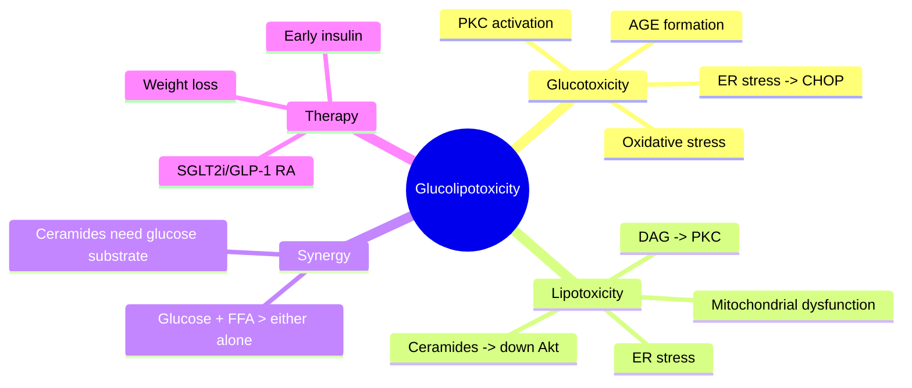

# Lipotoxicity and glucotoxicity

---
tags: [medicine, diabetes, davidson, pathophysiology, fcps, mrcp]
davidson_part: Part 3: Clinical Medicine
davidson_chapter: Chapter 25: Endocrinology and Diabetes
status: full-fcps-mrcp-note
priority: HIGH
exam_relevance: "FCPS/MRCP High Yield - Core pathophysiology topic"
see_also: ["Insulin resistance", "Beta-cell dysfunction and failure", "Incretin defect and glucagon dysregulation", "Genetics of type 2 diabetes (polygenic risk)"]
created: 2026-06-13
modified: 2026-06-13
---

# Lipotoxicity and glucotoxicity

## 1. Learning Objectives
By the end of this note you should be able to:
- [ ] Define glucotoxicity and lipotoxicity in beta-cell failure
- [ ] Explain molecular mechanisms: oxidative stress, ER stress, mitochondrial dysfunction
- [ ] Apply concepts to therapeutic targets (SGLT2i, GLP-1 RA, early insulin)
- [ ] Contrast acute vs chronic lipid/glucose toxicity

---

## 2. Definition & Epidemiology

| Feature | Detail |
|--------|--------|
| **Glucotoxicity** | Chronic hyperglycaemia -> beta-cell dysfunction |
| **Lipotoxicity** | Chronic FFA excess -> beta-cell dysfunction |
| **Glucolipotoxicity** | Synergistic; both required for full beta-cell failure |

---

## 3. Clinical Features / Presentation
(N/A)

---

## 4. Classification / Staging / Grading

### Glucotoxicity Mechanisms
| Mechanism | Details |
|---------|---------|
| **Oxidative stress** | Mitochondrial ROS -> DNA damage, protein/lipid oxidation |
| **ER stress** | Misfolded proinsulin -> UPR -> CHOP -> apoptosis |
| **PKC activation** | DAG -> PKC -> NF-kappaB -> inflammation |
| **AGE formation** | Non-enzymatic glycation -> RAGE -> inflammation |
| **Hexosamine pathway** | GFAT -> O-GlcNAc modification of proteins |

### Lipotoxicity Mechanisms
| Mechanism | Details |
|---------|---------|
| **Ceramides** | De novo synthesis -> down Akt, up PP2A -> apoptosis |
| **DAG/PKC** | PKC-theta -> IRS-1 serine phosphorylation |
| **Mitochondrial dysfunction** | Incomplete fatty acid oxidation -> ROS |
| **ER stress** | Saturated FFA -> UPR -> CHOP |
| **Inflammation** | FFA -> TLR4 -> NF-kappaB -> cytokines |

### Synergistic Glucolipotoxicity
| Feature | Effect |
|---------|--------|
| **Glucose + FFA** | up Ceramide synthesis (glucose provides substrate) |
| **Glucose + FFA** | up ER stress, up oxidative stress beyond either alone |
| **Beta-cell specificity** | High glucokinase -> glucose metabolism; low FFA oxidation -> lipid accumulation |

---

## 5. Diagnosis & Investigations
| Marker | Significance |
|--------|--------------|
| **Proinsulin/Insulin** | up = ER stress/glucolipotoxicity |
| **Ceramides** | Plasma ceramides predict T2DM |
| **Oxidative stress markers** | 8-OHdG, MDA, F2-isoprostanes |
| **CHOP** | ER stress apoptosis marker |

---

## 6. Differential Diagnosis
(N/A)

---

## 7. Therapeutic Targets
| Intervention | Targets |
|--------------|---------|
| **SGLT2i** | down Glucotoxicity (glycosuria), weight loss -> down lipotoxicity |
| **GLP-1 RA** | Weight loss -> down lipotoxicity; direct anti-apoptotic |
| **Early insulin** | "Beta-cell rest" -> down glucotoxicity |
| **TZDs** | up Adiponectin, down FFA, down ectopic fat |
| **Antioxidants** | Experimental (ALA, NAC) |

---

## 8. FCPS/MRCP High-Yield Summary
| Topic | Key Points |
|-------|------------|
| **Glucotoxicity** | Chronic hyperglycaemia -> oxidative stress, ER stress, AGE, PKC |
| **Lipotoxicity** | FFA/ceramides/DAG -> PKC, mitochondrial dysfunction, ER stress |
| **Glucolipotoxicity** | Synergistic: glucose + FFA > either alone; ceramides need glucose substrate |
| **Ceramides** | Key lipotoxic mediator; down Akt, up PP2A, apoptosis |
| **Reversibility** | Early intervention can reverse; chronic -> irreversible loss |

---

## 9. Viva Questions
| Question | Expected Answer |
|----------|-----------------|
| **What is glucolipotoxicity?** | Synergistic beta-cell toxicity from chronic hyperglycaemia + elevated FFA; both required for full effect |
| **How do ceramides cause beta-cell apoptosis?** | Ceramides -> down Akt, up PP2A -> dephosphorylate Bad -> apoptosis; also down PDX-1 |
| **What is the role of ER stress in beta-cell failure?** | Misfolded proinsulin -> UPR -> CHOP -> apoptosis; both glucose and FFA induce ER stress |
| **Can glucolipotoxicity be reversed?** | Early intervention (weight loss, GLP-1 RA, SGLT2i, insulin) can reverse; chronic -> irreversible loss |

---

## 10. Confusions & Mnemonics
| Confusion | Clarification |
|-----------|---------------|
| **Glucotoxicity = lipotoxicity?** | Distinct but synergistic; both use overlapping pathways (ER stress, oxidative stress) |
| **All FFA toxic?** | Saturated FFA (palmitate) toxic; unsaturated (oleate) protective |

**Mnemonic: GLUCO-LIPO-TOXIC**
- **G**lucotoxicity: chronic hyperglycaemia -> ROS, ER stress, AGEs, PKC
- **L**ipotoxicity: FFA -> ceramides, DAG, ER stress, mitochondrial dysfunction
- **U**nitary: **synergistic** - glucose + FFA > either alone
- **C**eramides: key mediator -> down Akt, apoptosis
- **O**xidative stress: mitochondria, NADPH oxidase
- **L**ow-grade inflammation: NF-kappaB, cytokines
- **I**nsulin resistance worsened: vicious cycle
- **P**revention: early weight loss, SGLT2i, GLP-1 RA, insulin
- **T**reatment: reverse if early; chronic -> irreversible
- **O**verlap: ER stress, oxidative stress, inflammation common
- **X**AGEs: AGE-RAGE axis
- **I**nsulin rest: early intensive control
- **C**HOPS: ER stress apoptosis

---

## 11. Mind Map

---

## 12. One-Page Revision Card

| Domain | Key Points |
|--------|------------|
| **Definition** | Synergistic beta-cell toxicity from chronic hyperglycaemia + elevated FFA |
| **Key Test" | Proinsulin/Insulin ratio (up = ER stress); plasma ceramides |
| **Classification" | Glucotoxicity + Lipotoxicity -> Glucolipotoxicity (synergistic) |
| **Acute Mgmt" | Early insulin -> beta-cell rest |
| **Chronic Mgmt" | SGLT2i (glycosuria), GLP-1 RA (weight loss), weight loss |
| **Key Score" | Proinsulin/Insulin ratio up; plasma ceramides |
| **Complications" | Irreversible beta-cell loss; progression to insulin requirement |
| **Prognosis" | Early reversible; chronic -> permanent loss |

---

## 13. Spaced Repetition Trackers

| Review Interval | Date Completed | Confidence (1-5) | Notes |
|-----------------|----------------|------------------|-------|
| 24 hours | | | |
| 7 days | | | |
| 15 days | | | |
| 30 days | | | |
| 90 days | | | |

---

## 14. Self-Test Scorecard

| Section | Score /5 | Last Attempt |
|---------|----------|--------------|
| Definition & Epidemiology | | |
| Classification & Staging | | |
| Diagnosis & Investigations | | |
| Management (Acute) | | |
| Management (Chronic) | | |
| Complications | | |
| Viva Questions | | |
| DDx Distinctions | | |
| Mnemonics/Algorithms | | |

---

### Local Navigation
- **Parent Heading**: [[../Pathophysiology of Diabetes|Pathophysiology of Diabetes]]
- **Chapter Map": [[../../Davidson Chapter 25 - Diabetes Hierarchy|Diabetes Hierarchy]]
- **Chapter MOC": [[../../Diabetes MOC|Diabetes MOC]]
- **Drug Reference": [[../../../Clinical Therapeutics and Good Prescribing|Drugs]]
- **Related": [[Insulin resistance]], [[Beta-cell dysfunction and failure]], [[Incretin defect and glucagon dysregulation]], [[Genetics of type 2 diabetes (polygenic risk)]]

---
## Tags
#medicine #diabetes #davidson #fcps #mrcp #full-fcps-mrcp-note
---

> Auto-generated study sections for "Type 2 diabetes pathogenesis" — Ch 21: Diabetes Mellitus.

## Flashcards (27 generated)

- Q: What is the definition of Type 2 diabetes pathogenesis?
  A: By the end of this note you should be able to:
- Q: What are the side effects of Type 2 diabetes pathogenesis?
  A: Chronic hyperglycaemia -> beta-cell dysfunction
- Q: What is Oxidative stress of Type 2 diabetes pathogenesis?
  A: Mitochondrial ROS -> DNA damage, protein/lipid oxidation
- Q: What is ER stress of Type 2 diabetes pathogenesis?
  A: Misfolded proinsulin -> UPR -> CHOP -> apoptosis
- Q: What is PKC activation of Type 2 diabetes pathogenesis?
  A: DAG -> PKC -> NF-kappaB -> inflammation
- Q: What is AGE formation of Type 2 diabetes pathogenesis?
  A: Non-enzymatic glycation -> RAGE -> inflammation
- Q: What is Hexosamine pathway of Type 2 diabetes pathogenesis?
  A: GFAT -> O-GlcNAc modification of proteins
- Q: What is Ceramides of Type 2 diabetes pathogenesis?
  A: De novo synthesis -> down Akt, up PP2A -> apoptosis
- Q: What is DAG/PKC of Type 2 diabetes pathogenesis?
  A: PKC-theta -> IRS-1 serine phosphorylation
- Q: What is Mitochondrial dysfunction of Type 2 diabetes pathogenesis?
  A: Incomplete fatty acid oxidation -> ROS
- Q: What is ER stress of Type 2 diabetes pathogenesis?
  A: Saturated FFA -> UPR -> CHOP
- Q: What is Inflammation of Type 2 diabetes pathogenesis?
  A: FFA -> TLR4 -> NF-kappaB -> cytokines
- Q: What is Glucose + FFA of Type 2 diabetes pathogenesis?
  A: up Ceramide synthesis (glucose provides substrate)
- Q: What is Beta-cell specificity of Type 2 diabetes pathogenesis?
  A: High glucokinase -> glucose metabolism; low FFA oxidation -> lipid accumulation
- Q: What is Oxidative stress of Type 2 diabetes pathogenesis?
  A: Mitochondrial ROS -> DNA damage, protein/lipid oxidation
- Q: What is ER stress of Type 2 diabetes pathogenesis?
  A: Misfolded proinsulin -> UPR -> CHOP -> apoptosis
- Q: What is PKC activation of Type 2 diabetes pathogenesis?
  A: DAG -> PKC -> NF-kappaB -> inflammation
- Q: What is AGE formation of Type 2 diabetes pathogenesis?
  A: Non-enzymatic glycation -> RAGE -> inflammation
- Q: What is Ceramides of Type 2 diabetes pathogenesis?
  A: De novo synthesis -> down Akt, up PP2A -> apoptosis
- Q: What is DAG/PKC of Type 2 diabetes pathogenesis?
  A: PKC-theta -> IRS-1 serine phosphorylation
- Q: What is Mitochondrial dysfunction of Type 2 diabetes pathogenesis?
  A: Incomplete fatty acid oxidation -> ROS
- Q: What is ER stress of Type 2 diabetes pathogenesis?
  A: Saturated FFA -> UPR -> CHOP
- Q: What is Glucose + FFA of Type 2 diabetes pathogenesis?
  A: up Ceramide synthesis (glucose provides substrate)
- Q: What is Beta-cell specificity of Type 2 diabetes pathogenesis?
  A: High glucokinase -> glucose metabolism; low FFA oxidation -> lipid accumulation
- Q: What are the side effects of Type 2 diabetes pathogenesis?
  A: Chronic hyperglycaemia -> oxidative stress, ER stress, AGE, PKC
- Q: What is Ceramides of Type 2 diabetes pathogenesis?
  A: Key lipotoxic mediator; down Akt, up PP2A, apoptosis
- Q: What is Reversibility of Type 2 diabetes pathogenesis?
  A: Early intervention can reverse; chronic -> irreversible loss

## MCQs (1 generated)

1. **Which of the following best describes Type 2 diabetes pathogenesis?**
   A. **By the end of this note you should be able to:**
   B. An unrelated condition not matching the clinical picture of Type 2 diabetes pathogenesis
   C. A complication seen late in the disease course of Type 2 diabetes pathogenesis
   D. A condition that mimics Type 2 diabetes pathogenesis but has a different underlying cause

## SBA Questions (1 generated)

1. A patient with suspected Type 2 diabetes pathogenesis presents with: Glucotoxicity — Chronic hyperglycaemia -> beta-cell dysfunction; Lipotoxicity — Chronic FFA excess -> beta-cell dysfunction; Glucolipotoxicity — Synergistic; both required for full beta-cell failure. What is the most likely diagnosis?
   A. **Type 2 diabetes pathogenesis**
   B. A condition that mimics Type 2 diabetes pathogenesis but is not the same entity
   C. A complication of Type 2 diabetes pathogenesis rather than the primary diagnosis
   D. An unrelated condition in the same clinical category as Type 2 diabetes pathogenesis

