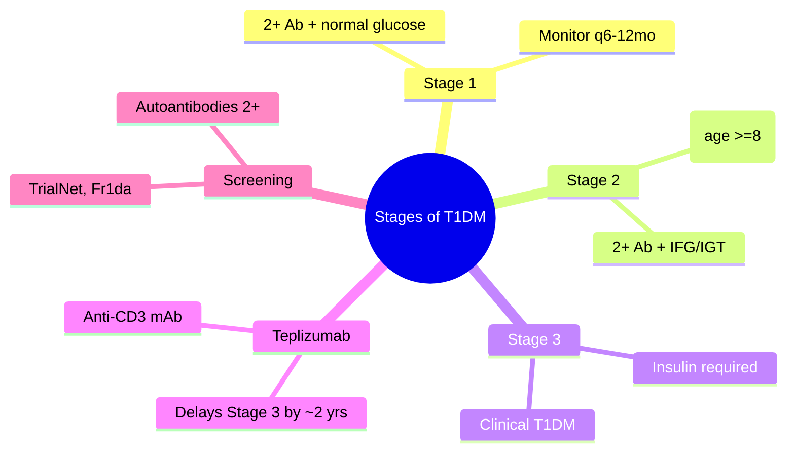

# Stages of type 1 diabetes (pre-symptomatic, symptomatic)

---
tags: [medicine, diabetes, davidson, pathophysiology, fcps, mrcp]
davidson_part: Part 3: Clinical Medicine
davidson_chapter: Chapter 25: Endocrinology and Diabetes
status: full-fcps-mrcp-note
priority: HIGH
exam_relevance: "FCPS/MRCP High Yield - Core pathophysiology topic"
see_also: ["Autoimmune beta-cell destruction", "Genetic susceptibility (HLA, INS, PTPN22)", "Environmental triggers"]
created: 2026-06-13
modified: 2026-06-13
---

# Stages of type 1 diabetes (pre-symptomatic, symptomatic)

## 1. Learning Objectives
By the end of this note you should be able to:
- [ ] Define the 3 stages of T1DM (ADA/JDRF/Endocrine Society)
- [ ] Apply staging to screening and monitoring protocols
- [ ] Identify criteria for teplizumab therapy (Stage 2)
- [ ] Counsel patients on progression risks

---

## 2. Definition & Epidemiology

| Feature | Detail |
|--------|--------|
| **Staging System** | ADA/JDRF/Endocrine Society 2015 (updated 2021) |
| **Purpose** | Standardise pre-clinical phases; enable prevention trials |

---

## 3. Clinical Features / Presentation
(N/A)

---

## 4. Classification / Staging / Grading

### Three Stages of T1DM

| Stage | Autoantibodies | Glucose Status | Clinical Features | Progression Risk |
|-------|----------------|----------------|-------------------|------------------|
| **Stage 1** | 2+ | **Normal** (FPG <6.1, 2h-OGTT <7.8, HbA1c <39) | Asymptomatic | ~100% lifetime |
| **Stage 2** | 2+ | **Dysglycaemia** (IFG 6.1-6.9, IGT 7.8-11.0, HbA1c 39-47) | Asymptomatic | ~75% at 5 years |
| **Stage 3** | 2+ (usually) | **Hyperglycaemia** (FPG >=7.0, 2h-OGTT >=11.1, HbA1c >=48) | **Symptomatic** (polyuria, polydipsia, weight loss) | Clinical T1DM |

### Autoantibody Requirements
| Requirement | Detail |
|-------------|--------|
| **Number** | 2+ of 4 (GAD65, IA-2, ZnT8, IAA) |
| **Persistence** | Confirmed on 2 occasions |
| **Age** | Any (peak childhood/adolescence) |

---

## 5. Diagnosis & Investigations

| Test | Stage 1 | Stage 2 | Stage 3 |
|------|---------|---------|---------|
| **Autoantibodies** | 2+ positive | 2+ positive | Usually 2+ |
| **FPG** | <6.1 | 6.1-6.9 (IFG) | >=7.0 |
| **2h-OGTT** | <7.8 | 7.8-11.0 (IGT) | >=11.1 |
| **HbA1c** | <39 | 39-47 | >=48 |

---

## 6. Differential Diagnosis
| Condition | Distinguishing Features |
|-----------|-------------------------|
| **LADA** | Adult-onset, single autoantibody often, slower progression |
| **MODY** | Monogenic, autosomal dominant, negative autoantibodies |
| **Stress hyperglycaemia** | Transient, no autoantibodies |

---

## 7. Management by Stage

| Stage | Intervention | Evidence |
|-------|--------------|----------|
| **Stage 1** | Monitoring q6-12mo (autoantibodies, OGTT/HbA1c); trial enrolment | Natural history studies |
| **Stage 2** | **Teplizumab** (FDA 2022): 14-day IV; delays Stage 3 by ~2 years (median 48 vs 24 mo) | TN-10 Trial |
| **Stage 3** | **Insulin therapy**; DKA prevention; education; CSII/CGM consideration | Standard care |

### Teplizumab Protocol
| Aspect | Detail |
|--------|--------|
| **Indication** | Stage 2 T1DM, age >=8 years |
| **Dose** | Weight-based IV daily x14 days |
| **Effect** | Median delay to Stage 3: 48.4 vs 24.4 months (HR 0.48) |
| **Adverse** | Lymphopenia (transient), rash, cytokine release |

---

## 8. FCPS/MRCP High-Yield Summary

| Topic | Key Points |
|-------|------------|
| **Stage 1** | 2+ Ab + normal glucose; monitoring q6-12mo |
| **Stage 2** | 2+ Ab + IFG/IGT; **Teplizumab indicated** (age >=8) |
| **Stage 3** | Clinical T1DM; insulin required |
| **Teplizumab** | Anti-CD3 mAb; 14-day IV; delays Stage 3 by ~2 years |
| **LADA** | Often Stage 2 equivalent but adult-onset, slower |

---

## 9. Viva Questions

| Question | Expected Answer |
|----------|-----------------|
| **What are the 3 stages of T1DM?** | Stage 1: 2+ Ab + normoglycaemia; Stage 2: 2+ Ab + dysglycaemia; Stage 3: clinical hyperglycaemia |
| **Who is eligible for teplizumab?** | Stage 2 T1DM (2+ Ab + IFG/IGT), age >=8 years |
| **What is the effect of teplizumab?** | Delays Stage 3 by median 2 years (HR 0.48; 48 vs 24 months) |

---

## 10. Confusions & Mnemonics

| Confusion | Clarification |
|-----------|---------------|
| **Stages = linear?** | Not all progress at same rate; Stage 2 -> 3 ~75% at 5 years |
| **Teplizumab = cure?** | NO - delays onset; not prevention |

**Mnemonic: T1DM-STAGES**
- **T**1DM staging: 1, 2, 3
- **1** Stage 1: 2+ Ab + normal glucose
- **2** Stage 2: 2+ Ab + IFG/IGT -> **Teplizumab**
- **3** Stage 3: Clinical T1DM -> Insulin
- **T**eplizumab: Anti-CD3, delays Stage 3 by 2 years
- **E**ligibility: Stage 2, age >=8
- **A**utoantibodies: 2+ of 4 (GAD65, IA-2, ZnT8, IAA)
- **G**lucose: Stage 1 normal, Stage 2 IFG/IGT, Stage 3 hyperglycaemia
- **E**ndpoint: Stage 3 = insulin requirement
- **S**creening: TrialNet, Fr1da, general population pilots

---

## 11. Mind Map

---

## 12. One-Page Revision Card

| Domain | Key Points |
|--------|------------|
| **Definition** | 3 stages: 1=autoimmunity+normoglycaemia; 2=+dysglycaemia; 3=clinical |
| **Key Test** | Autoantibodies (GAD65, IA-2, ZnT8, IAA): 2+ required |
| **Classification** | Stage 1: normal glucose; Stage 2: IFG/IGT; Stage 3: clinical |
| **Acute Mgmt** | Teplizumab (Stage 2): 14-day IV anti-CD3; delays Stage 3 |
| **Chronic Mgmt** | Insulin (Stage 3); DKA prevention; education; CSII/CGM |
| **Key Score** | 2+ autoantibodies; Stage 2 = teplizumab eligible |
| **Complications** | DKA at presentation if Stage 3 missed |
| **Prognosis** | Stage 2 -> 3 ~75% at 5 years without intervention |

---

## 13. Spaced Repetition Trackers

| Review Interval | Date Completed | Confidence (1-5) | Notes |
|-----------------|----------------|------------------|-------|
| 24 hours | | | |
| 7 days | | | |
| 15 days | | | |
| 30 days | | | |
| 90 days | | | |

---

## 14. Self-Test Scorecard

| Section | Score /5 | Last Attempt |
|---------|----------|--------------|
| Definition & Epidemiology | | |
| Classification & Staging | | |
| Diagnosis & Investigations | | |
| Management (Acute) | | |
| Management (Chronic) | | |
| Complications | | |
| Viva Questions | | |
| DDx Distinctions | | |
| Mnemonics/Algorithms | | |

---

### Local Navigation
- **Parent Heading**: [[../Pathophysiology of Diabetes|Pathophysiology of Diabetes]]
- **Chapter Map": [[../../Davidson Chapter 25 - Diabetes Hierarchy|Diabetes Hierarchy]]
- **Chapter MOC": [[../../Diabetes MOC|Diabetes MOC]]
- **Drug Reference": [[../../../Clinical Therapeutics and Good Prescribing|Drugs]]
- **Related": [[Autoimmune beta-cell destruction]], [[Genetic susceptibility (HLA, INS, PTPN22)], [[Environmental triggers]]

---
## Tags
#medicine #diabetes #davidson #fcps #mrcp #full-fcps-mrcp-note
---

> Auto-generated study sections for "Type 1 diabetes pathogenesis" — Ch 21: Diabetes Mellitus.

## Flashcards (14 generated)

- Q: What is the definition of Type 1 diabetes pathogenesis?
  A: # Stages of type 1 diabetes (pre-symptomatic, symptomatic)
- Q: What is Staging System of Type 1 diabetes pathogenesis?
  A: ADA/JDRF/Endocrine Society 2015 (updated 2021)
- Q: What is Purpose of Type 1 diabetes pathogenesis?
  A: Standardise pre-clinical phases; enable prevention trials
- Q: What is Type 1 diabetes pathogenesis indicated for?
  A: Stage 2 T1DM, age >=8 years
- Q: What is the dose of Type 1 diabetes pathogenesis?
  A: Weight-based IV daily x14 days
- Q: What is Effect of Type 1 diabetes pathogenesis?
  A: Median delay to Stage 3: 48.4 vs 24.4 months (HR 0.48)
- Q: What are the side effects of Type 1 diabetes pathogenesis?
  A: Lymphopenia (transient), rash, cytokine release
- Q: What is Type 1 diabetes pathogenesis indicated for?
  A: Stage 2 T1DM, age >=8 years
- Q: What is the dose of Type 1 diabetes pathogenesis?
  A: Weight-based IV daily x14 days
- Q: What is Effect of Type 1 diabetes pathogenesis?
  A: Median delay to Stage 3: 48.4 vs 24.4 months (HR 0.48)
- Q: What are the side effects of Type 1 diabetes pathogenesis?
  A: Lymphopenia (transient), rash, cytokine release
- Q: How is Type 1 diabetes pathogenesis classified?
  A: 2+ Ab + normal glucose; monitoring q6-12mo
- Q: What is Teplizumab of Type 1 diabetes pathogenesis?
  A: Anti-CD3 mAb; 14-day IV; delays Stage 3 by ~2 years
- Q: What is LADA of Type 1 diabetes pathogenesis?
  A: Often Stage 2 equivalent but adult-onset, slower

## MCQs (1 generated)

1. **Which of the following best describes Type 1 diabetes pathogenesis?**
   A. **# Stages of type 1 diabetes (pre-symptomatic, symptomatic)**
   B. An unrelated condition not matching the clinical picture of Type 1 diabetes pathogenesis
   C. A complication seen late in the disease course of Type 1 diabetes pathogenesis
   D. A condition that mimics Type 1 diabetes pathogenesis but has a different underlying cause

## SBA Questions (1 generated)

1. A patient with suspected Type 1 diabetes pathogenesis presents with: Staging System — ADA/JDRF/Endocrine Society 2015 (updated 2021); Purpose — Standardise pre-clinical phases; enable prevention trials. What is the most likely diagnosis?
   A. **Type 1 diabetes pathogenesis**
   B. A condition that mimics Type 1 diabetes pathogenesis but is not the same entity
   C. A complication of Type 1 diabetes pathogenesis rather than the primary diagnosis
   D. An unrelated condition in the same clinical category as Type 1 diabetes pathogenesis

