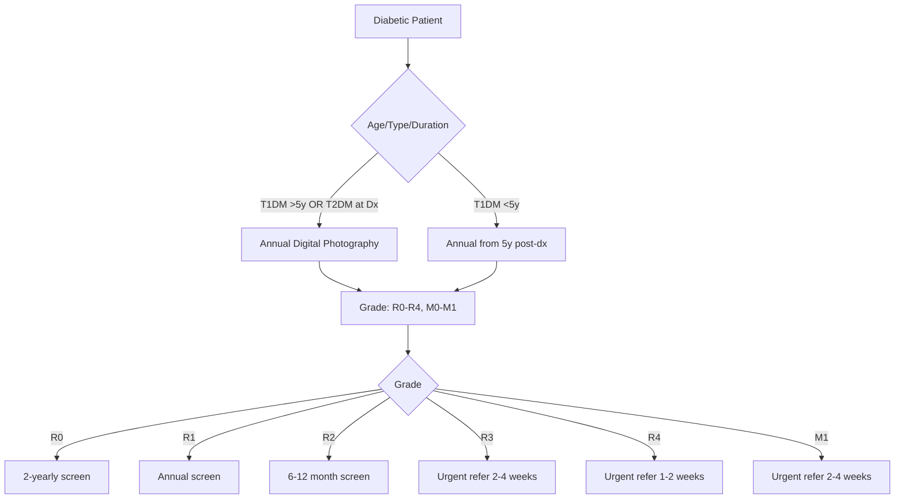

# Retinopathy screening

---
tags: [medicine, diabetes, davidson, retinopathy-screening, fcps, mrcp]
davidson_part: Part 3: Clinical Medicine
davidson_chapter: Chapter 25: Endocrinology and Diabetes
status: full-fcps-mrcp-note
priority: HIGH
exam_relevance: "FCPS/MRCP High Yield - Core diabetes topic"
see_also: ["Diabetic retinopathy", "Diabetic macular oedema (DMO)", "Retinopathy treatment (laser, anti-VEGF, vitrectomy)"]
created: 2026-06-13
modified: 2026-06-13
---

# Retinopathy screening

## 1. Learning Objectives
By the end of this note you should be able to:
- [ ] Apply UK National Screening Programme protocol
- [ ] Interpret ETDRS grading and referral thresholds
- [ ] Apply screening intervals by DR severity
- [ ] Recognise pregnancy-specific screening

## 2. Definition & Epidemiology
| Feature | Detail |
|--------|--------|
| **Programme** | UK National Diabetic Eye Screening Programme (NDESP) |
| **Method** | Digital retinal photography (mydriatic, 45°, 2-field) |
| **Coverage target** | >80% eligible population |
| **Interval** | Annual (2-yearly if no DR) |

## 3. Clinical Features / Presentation
(N/A - screening asymptomatic)

## 4. Classification / Staging / Grading

### ETDRS / UK NSC Grading Scale
| Grade | ETDRS Level | Description | Referral / Interval |
|-------|-------------|-------------|---------------------|
| **R0** | 10-12 | **No DR** | 2-yearly |
| **R1 (Mild NPDR)** | 20-35 | Microaneurysms only | Annual |
| **R2 (Moderate NPDR)** | 35-43 | Haemorrhages, exudates, cotton wool | 6-12 months |
| **R3 (Severe NPDR)** | 43-53 | **4:2:1 Rule**: 4 quad haem, 2 quad VB, 1 IRMA | **Urgent (2-4 weeks)** |
| **R4 (PDR)** | 61+ | NVD, NVE, VH, pre-retinal haem | **Urgent (1-2 weeks)** |
| **M1 (DMO)** | — | Thickening ≤1DD from fovea | **Urgent (2-4 weeks)** |

### 4:2:1 Rule (Severe NPDR / R3)
| Criterion | Threshold |
|-----------|-----------|
| **4** | Haemorrhages/microaneurysms in **4 quadrants** |
| **2** | Venous beading in **2 quadrants** |
| **1** | IRMA in **1 quadrant** |

> **Any ONE = Severe NPDR (R3)**

## 5. Diagnosis & Investigations
| Investigation | Role |
|---------------|------|
| **Digital photography** | Screening (mydriatic, 45°, 2-field) |
| **OCT** | DMO diagnosis (CST); not for DR grading |
| **Fluorescein angiography** | Pre-laser; NVE/NVD confirmation |
| **HbA1c, BP, lipids** | Systemic risk factor documentation |

## 5. Diagnosis & Investigations
| Investigation | Role |
|---------------|------|
| **Digital photography** | Screening (mydriatic, 45°, 2-field) |
| **OCT** | DMO diagnosis (CST); not for DR grading |
| **Fluorescein angiography** | Pre-laser; NVE/NVD confirmation |
| **HbA1c, BP, lipids** | Systemic risk factor documentation |

## 6. Differential Diagnosis
| Condition | Distinguishing Features |
|-----------|-------------------------|
| **Hypertensive retinopathy** | AV nicking, copper/silver wiring; no microaneurysms |
| **Retinal vein occlusion** | Sectoral haemorrhages, disc oedema; unilateral |
| **Radiation retinopathy** | Post-RT; capillary non-perfusion; no microaneurysms |
| **Ocular ischaemic syndrome** | Carotid stenosis; mid-peripheral haemorrhages, NVI/NVA |

## 7. Management

### Screening Protocol

### Referral Pathways
| Grade | Referral | Timeline |
|-------|----------|----------|
| **R3 (Severe NPDR)** | Ophthalmology (medical retina) | **2-4 weeks** |
| **R4 (PDR)** | Ophthalmology (vitreoretinal) | **1-2 weeks** |
| **M1 (DMO)** | Ophthalmology (medical retina) | **2-4 weeks** |
| **R0-R2** | Continue screening programme | Per interval |

### Quality Assurance
| Element | Standard |
|---------|----------|
| **Image quality** | Adequate focus, exposure, field (disc + macula) |
| **Grader certification** | Annual accreditation; kappa >0.85 |
| **Arbitration** | 2nd grader for discordant/ungradable |
| **Failsafe** | Track non-attenders; recall within 6 weeks |

## 8. FCPS/MRCP High-Yield Summary
| Topic | Key Points |
|-------|------------|
| **Screening method** | Digital photography, mydriatic, 45°, 2-field (macula + disc) |
| **Intervals** | No DR (R0): 2-yearly; Mild NPDR (R1): annual; Mod NPDR (R2): 6-12mo; Severe NPDR (R3): urgent 2-4wk; PDR (R4): urgent 1-2wk |
| **4:2:1 Rule** | Severe NPDR: 4 quad haem OR 2 quad venous beading OR 1 quad IRMA |
| **M1 (DMO)** | Thickening ≤1DD from fovea → urgent referral 2-4 weeks |
| **NVD vs NVE** | NVD on disc (high risk); NVE >1DD from disc |
| **High-risk PDR** | NVD ≥1/3 disc, NVE ≥1/2 disc, VH/pre-retinal haem |
| **Quality** | Certified graders; arbitration; failsafe for non-attenders |

## 9. Viva Questions
| Question | Expected Answer |
|----------|-----------------|
| **What is the 4:2:1 rule for severe NPDR?** | Haemorrhages in 4 quadrants OR Venous beading in 2 quadrants OR IRMA in 1 quadrant — any ONE = Severe NPDR (R3) |
| **What are the screening intervals by DR grade?** | R0: 2-yearly; R1: annual; R2: 6-12 months; R3: urgent 2-4 weeks; R4: urgent 1-2 weeks; M1: urgent 2-4 weeks |
| **What is the referral threshold for PDR?** | R4 (NVD, NVE, VH, pre-retinal haem) → **Urgent referral within 1-2 weeks** |
| **What is M1 grading?** | **Diabetic macular oedema** — retinal thickening ≤1 disc diameter from fovea → urgent referral 2-4 weeks |
| **How does NVD differ from NVE?** | NVD: new vessels on/within 1DD of disc (higher risk); NVE: new vessels >1DD from disc |
| **What constitutes high-risk PDR?** | NVD ≥1/3 disc area, NVE ≥1/2 disc area, vitreous haemorrhage, pre-retinal haemorrhage |

## 10. Confusions & Mnemonics
| Confusion | Clarification |
|-----------|---------------|
| **R2 vs R3?** | R2 = moderate (haemorrhages, exudates, cotton wool); R3 = severe (4:2:1 rule met) |
| **M1 = any maculopathy?** | M1 = thickening ≤1DD from fovea (centre-involving); non-centre = not M1 |
| **Screening in pregnancy?** | Pre-conception, each trimester, postpartum 6mo — rapid progression risk |

**Mnemonic: RETINA-SCREEN**
- **R**0: No DR → 2-yearly
- **E**TDRS: 10-12 none, 20-35 mild, 43-53 severe, 61+ PDR
- **T**wo-field: macula + disc (45°, mydriatic)
- **I**ntervals: R0=2yr, R1=1yr, R2=6-12mo, R3=2-4wk, R4=1-2wk
- **N**VD on disc; NVE elsewhere
- **A** 4:2:1 rule = Severe NPDR (R3)
- **S**creening: annual (T2DM at Dx, T1DM >5y)
- **C**entre-involving DMO = M1 → urgent
- **R**eferral: R3=2-4wk, R4=1-2wk, M1=2-4wk
- **E**xudates/cotton wool = R2 (moderate)
- **E**mergency: R4 (PDR) 1-2 weeks
- **E**nsure quality: certified graders, arbitration, failsafe
- **N**o DR = 2-yearly**</think>