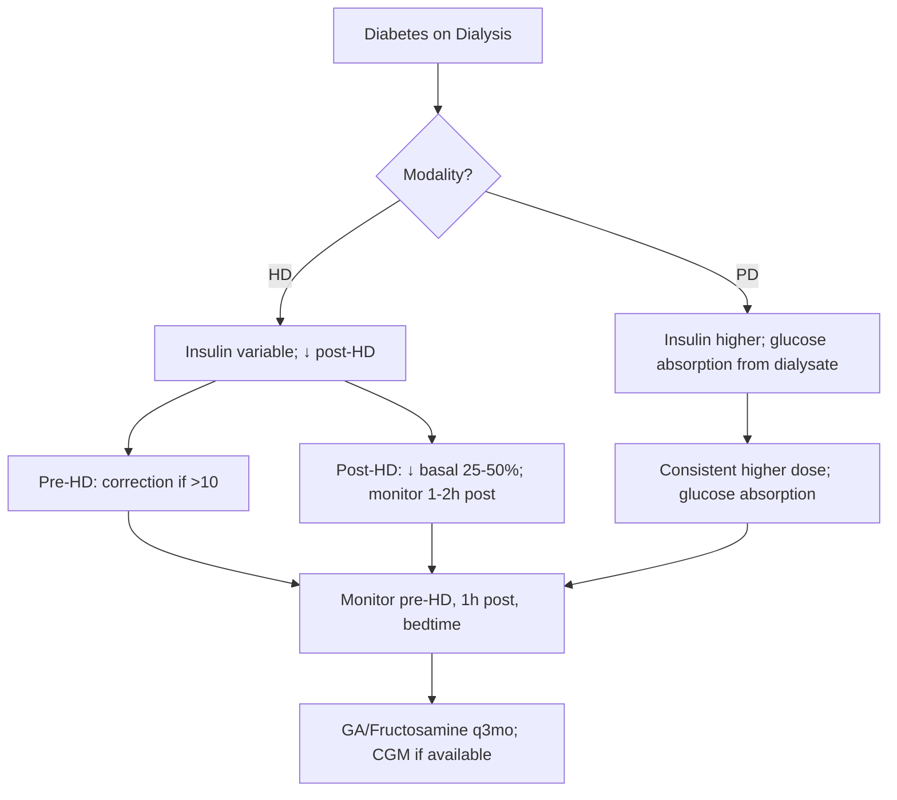

# Diabetes on dialysis

## 1. Learning Objectives
By the end of this note you should be able to:
- [ ] Manage glycaemic control in haemodialysis and peritoneal dialysis
- [ ] Apply insulin dosing adjustments for dialysis
- [ ] Use alternative glycaemic markers (GA, fructosamine, CGM)
- [ ] Manage hypoglycaemia risk in dialysis patients

## 1. Learning Objectives
By the end of this note you should be able to:
- [ ] Manage glycaemic control in haemodialysis and peritoneal dialysis
- [ ] Apply insulin dosing adjustments for dialysis
- [ ] Use alternative glycaemic markers (GA, fructosamine, CGM)
- [ ] Manage hypoglycaemia risk in dialysis patients

## 2. Definition & Epidemiology
| Feature | Detail |
|--------|--------|
| **Prevalence** | 20-30% dialysis patients have diabetes; leading cause of ESRD |
| **Mortality** | DM on dialysis: 2x mortality vs non-DM; CVD main cause |
| **HbA1c** | Unreliable in dialysis (falsely low); use GA/fructosamine/CGM |

## 2. Definition & Epidemiology
| Feature | Detail |
|--------|--------|
| **Prevalence** | 20-30% dialysis patients have diabetes |
| **Mortality** | DM on dialysis: 2x mortality vs non-DM; CVD main cause |
| **HbA1c** | Unreliable in dialysis (falsely low); use GA/fructosamine/CGM |

## 3. Clinical Features / Presentation
| Feature | Haemodialysis (HD) | Peritoneal Dialysis (PD) |
|---------|-------------------|-------------------------|
| **Glucose variability** | High (pre/post dialysis swings) | More stable; continuous glucose exposure |
| **Hypoglycaemia risk** | High (post-dialysis); glucose-free dialysate | Lower; but glucose absorption from dialysate |
| **Insulin requirement** | Variable; often ↓ post-HD | Often higher (glucose absorption from dialysate) |
| **HbA1c reliability** | Unreliable in both | Unreliable; GA/fructosamine essential |

## 3. Clinical Features / Presentation
| Feature | Haemodialysis (HD) | Peritoneal Dialysis (PD) |
|---------|-------------------|-------------------------|
| **Glucose variability** | High (pre/post dialysis swings) | More stable; continuous glucose exposure |
| **Hypoglycaemia risk** | High (post-dialysis); glucose-free dialysate | Lower; but glucose absorption from dialysate |
| **Insulin requirement** | Variable; often ↓ post-HD | Often higher (glucose absorption from dialysate) |
| **HbA1c reliability** | Unreliable in both | Unreliable; GA/fructosamine essential |

## 4. Classification / Staging / Grading

### Glycaemic Monitoring in Dialysis
| Marker | HD | PD | Notes |
|--------|----|----|-------|
| **HbA1c** | Unreliable | Unreliable | Falsely low (↓RBC lifespan, ESA) |
| **Glycated Albumin (GA)** | Preferred | Preferred | 2-3 wk mean; GA <20% target |
| **Fructosamine** | Alternative | Alternative | 2-3 wk; <320 umol/L target |
| **CGM** | Emerging | Emerging | Real-time; avoid hypo |

### Glycaemic Targets (Dialysis)
| Population | GA Target | Fructosamine Target | Pre-dialysis Glucose |
|------------|-----------|---------------------|----------------------|
| **HD** | <20-21% | <320 umol/L | 7-10 mmol/L |
| **PD** | <20-21% | <320 umol/L | 7-10 mmol/L |

## 4. Classification / Staging / Grading

### Glycaemic Monitoring in Dialysis
| Marker | HD | PD | Notes |
|--------|----|----|-------|
| **HbA1c** | Unreliable | Unreliable | Falsely low (↓RBC lifespan, ESA) |
| **Glycated Albumin (GA)** | Preferred | Preferred | 2-3 wk mean; GA <20% target |
| **Fructosamine** | Alternative | Alternative | 2-3 wk; <320 umol/L target |
| **CGM** | Emerging | Emerging | Real-time; avoid hypo |

### Glycaemic Targets (Dialysis)
| Population | GA Target | Fructosamine Target | Pre-dialysis Glucose |
|------------|-----------|---------------------|----------------------|
| **HD** | <20-21% | <320 umol/L | 7-10 mmol/L |
| **PD** | <20-21% | <320 umol/L | 7-10 mmol/L |

## 5. Diagnosis & Investigations

### Insulin Requirements by Modality
| Modality | Pattern | Insulin Adjustment |
|----------|---------|-------------------|
| **HD** | Pre-HD glucose high; post-HD rapid drop | ↓ dose post-HD; pre-HD correction |
| **PD** | Continuous glucose absorption from dialysate | Higher total daily dose; consistent |
| **Both** | Glucose-free dialysate -> hypo risk | Monitor pre/post; adjust basal |

## 6. Differential Diagnosis
| Condition | Distinguishing Features |
|-----------|-------------------------|
| **Hypoglycaemia** | Post-HD (glucose-free dialysate); post-prandial (PD) |
| **Hyperglycaemia** | Pre-HD (catabolic); pre-dialysis (PD glucose absorption) |
| **Glucose-free dialysate effect** | Rapid glucose drop during HD |

## 7. Management

### Insulin Management on Dialysis

### Insulin Dosing Principles
| Principle | HD | PD |
|-----------|----|----|
| **Basal insulin** | Degludec/U-300 preferred (stable) | Standard; consistent |
| **Bolus insulin** | Pre-meal; skip if pre-HD glucose <7 | Standard; match dialysate glucose |
| **Dose reduction** | 50-75% vs non-dialysis | 25-50% |
| **U-100 vs U-300/U-200** | U-100 preferred (predictable) | U-100 preferred |

### Hypoglycaemia Prevention
| Strategy | HD | PD |
|---------|----|----|
| **Pre-dialysis glucose** | Target 7-10 mmol/L | Target 7-10 mmol/L |
| **Post-dialysis** | Monitor 1-2h; ↓ basal if <5 | - |
| **Dialysis day** | ↓ basal 25-50% on HD days | Consistent |
| **CGM** | Real-time; predictive alerts | Real-time; predictive alerts |
| **Glucose-free dialysate** | Hypo risk -> monitor 1-2h post | - |

### Medication Adjustments (Dialysis)
| Drug | HD | PD | Notes |
|------|----|----|-------|
| **SGLT2i** | Continue (dapa/empa) | Continue | Initiate >=20; continue on dialysis |
| **Metformin** | CONTRAINDICATED (eGFR<15) | CONTRAINDICATED | Stop |
| **SU** | Avoid (hypo risk) | Avoid | Gliclazide MR if essential |
| **DPP-4i** | Linagliptin (no adjust) | Linagliptin | Others dose reduce |
| **GLP-1 RA** | No adjust | No adjust | Limited data |

## 8. FCPS/MRCP High-Yield Summary
| Topic | Key Points |
|-------|------------|
| **HbA1c** | Unreliable in dialysis; use GA <20% / fructosamine <320 |
| **Insulin** | Reduce 50-75%; U-100 preferred; variable needs |
| **HD vs PD** | HD: variable, post-HD hypo; PD: stable, ↑dose (dialysate glucose) |
| **Monitoring** | GA <20% / Fructosamine <320; CGM emerging |
| **Pre/post HD** | Pre-HD high; post-HD rapid drop -> monitor 1-2h post |
| **Medications** | SGLT2i continue; metformin STOP; SU avoid; linagliptin preferred DPP-4i |

## 9. Viva Questions
| Question | Expected Answer |
|----------|-----------------|
| **Why is HbA1c unreliable in dialysis?** | ↓RBC lifespan (uraemia, ESA, blood loss); carbamylation; falsely low |
| **What alternative markers do you use in dialysis?** | Glycated Albumin (GA) <20%, Fructosamine <320 umol/L, CGM |
| **How does insulin requirement differ between HD and PD?** | HD: variable, ↓post-HD; PD: stable, ↑dose (glucose absorption from dialysate) |
| **What is the insulin dose reduction on dialysis?** | 50-75% reduction vs non-dialysis |
| **Why is hypoglycaemia common post-haemodialysis?** | Glucose-free dialysate -> rapid glucose drop; ↓hepatic glucose production |
| **Which DPP-4i is preferred in dialysis?** | Linagliptin (no renal dose adjustment) |
| **Can SGLT2i be used on dialysis?** | Yes - dapagliflozin/empagliflozin continue on dialysis (initiated >=20) |

## 10. Confusions & Mnemonics
| Confusion | Clarification |
|-----------|---------------|
| **HbA1c useful in dialysis?** | NO - falsely low; use GA/Fructosamine/CGM |
| **Insulin same HD vs PD?** | NO - HD variable/post-dialysis drop; PD stable higher dose |
| **Metformin on dialysis?** | CONTRAINDICATED (eGFR <15) |
| **SGLT2i in dialysis?** | Dapa/Empa: continue on dialysis if initiated >=20 |

**Mnemonic: DIALYSIS-DM-INSULIN**
- **D**ialysis: HbA1c unreliable; use GA <20%, Fructosamine <320
- **I**nsulin: reduce 50-75% (U-100 preferred)
- **A**lternatives: GA <20%, Fructosamine <320 umol/L, CGM
- **L**ow glucose post-HD: glucose-free dialysate -> hypo risk
- **Y**ou monitor: pre-HD, 1-2h post-HD, bedtime
- **S**GLT2i: dapa/empa continue dialysis (if >=20)
- **I**nsulin dose: reduce 50-75% (U-100)
- **S**table PD: glucose absorption -> higher insulin needs
- **D**ialysis types: HD variable; PD stable higher
- **I**nsulin U-100: preferred (predictable vs U-300/U-200)
- **A**lternatives: GA <20%, Fructosamine <320, CGM
- **L**ow glucose post-HD: monitor 1-2h post
- **Y**ou use GA/Fructosamine: HbA1c unreliable
- **S**top metformin (eGFR<15); stop SU
- **U**nique PD: dialysate glucose -> insulin needs
- **S**top SU: hypo risk; glic MR if essential**</think>
---

> Auto-generated study sections for "Diabetes in CKD and dialysis" — Ch 21: Diabetes Mellitus.

## Flashcards (11 generated)

- Q: What is the definition of Diabetes in CKD and dialysis?
  A: By the end of this note you should be able to:
- Q: What is the epidemiology of Diabetes in CKD and dialysis?
  A: 20-30% dialysis patients have diabetes; leading cause of ESRD
- Q: What is Mortality of Diabetes in CKD and dialysis?
  A: DM on dialysis: 2x mortality vs non-DM; CVD main cause
- Q: What is the epidemiology of Diabetes in CKD and dialysis?
  A: 20-30% dialysis patients have diabetes
- Q: What is Mortality of Diabetes in CKD and dialysis?
  A: DM on dialysis: 2x mortality vs non-DM; CVD main cause
- Q: What is HbA1c of Diabetes in CKD and dialysis?
  A: Unreliable in dialysis; use GA <20% / fructosamine <320
- Q: What is Insulin of Diabetes in CKD and dialysis?
  A: Reduce 50-75%; U-100 preferred; variable needs
- Q: What is HD vs PD of Diabetes in CKD and dialysis?
  A: HD: variable, post-HD hypo; PD: stable, ↑dose (dialysate glucose)
- Q: How is Diabetes in CKD and dialysis monitored?
  A: GA <20% / Fructosamine <320; CGM emerging
- Q: What is Pre/post HD of Diabetes in CKD and dialysis?
  A: Pre-HD high; post-HD rapid drop -> monitor 1-2h post
- Q: What is Medications of Diabetes in CKD and dialysis?
  A: SGLT2i continue; metformin STOP; SU avoid; linagliptin preferred DPP-4i

## MCQs (1 generated)

1. **Which of the following best describes Diabetes in CKD and dialysis?**
   A. **By the end of this note you should be able to:**
   B. An unrelated condition not matching the clinical picture of Diabetes in CKD and dialysis
   C. A complication seen late in the disease course of Diabetes in CKD and dialysis
   D. A condition that mimics Diabetes in CKD and dialysis but has a different underlying cause

## SBA Questions (1 generated)

1. A patient with suspected Diabetes in CKD and dialysis presents with: Prevalence — 20-30% dialysis patients have diabetes; leading cause of ESRD; Mortality — DM on dialysis: 2x mortality vs non-DM; CVD main cause; HbA1c — Unreliable in dialysis (falsely low); use GA/fructosamine/CGM. What is the most likely diagnosis?
   A. **Diabetes in CKD and dialysis**
   B. A condition that mimics Diabetes in CKD and dialysis but is not the same entity
   C. A complication of Diabetes in CKD and dialysis rather than the primary diagnosis
   D. An unrelated condition in the same clinical category as Diabetes in CKD and dialysis

