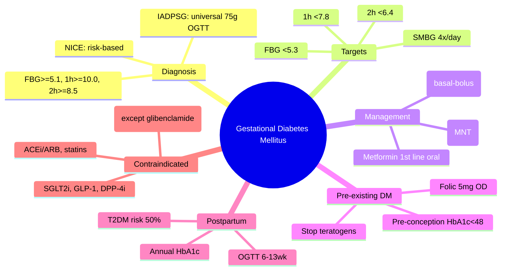

# Gestational diabetes mellitus (GDM)

## 1. Learning Objectives
By the end of this note you should be able to:
- [ ] Apply IADPSG (universal) and NICE (risk-based) GDM diagnostic criteria
- [ ] State GDM glycaemic targets and monitoring frequency
- [ ] Execute stepwise management: diet -> metformin -> insulin
- [ ] Manage pre-existing diabetes in pregnancy (pre-conception, targets, teratogenicity)
- [ ] Counsel on postpartum screening and lifetime T2DM risk

---

## 2. Definition & Epidemiology

| Feature | Detail |
|--------|--------|
| **Definition** | Glucose intolerance with onset or first recognition in pregnancy (excluding pre-existing diabetes) |
| **Incidence** | 2-14% pregnancies (varies by population, criteria); IADPSG criteria -> up diagnosis 2-3x vs older criteria |
| **Risk Factors** | BMI >=30, previous GDM, previous macrosomia (>4.5kg), family history T2DM, ethnicity (South Asian, African-Caribbean, Middle Eastern), age >40, PCOS, corticosteroid use |
| **Pathophysiology** | Placental hormones (hPL, progesterone, cortisol, oestrogen) -> insulin resistance up 2-3x by 3rd trimester; pancreatic beta-cells fail to compensate |
| **Complications** | **Fetal**: macrosomia, shoulder dystocia, neonatal hypoglycaemia, hyperbilirubinaemia, RDS, stillbirth; **Maternal**: pre-eclampsia, C-section, future T2DM (50% at 10y), future GDM (recurrence 30-50%) |

---

## 3. Clinical Features / Presentation

| Presentation | Frequency | Key Features |
|-------------|-----------|--------------|
| **Asymptomatic** | Most | Detected on screening OGTT |
| **Osmotic symptoms** | If marked hyperglycaemia | Polyuria, polydipsia (often masked by pregnancy) |
| **Recurrent infections** | Common | Candidiasis, UTIs |
| **Macrosomia (clinical)** | Late pregnancy | SFH >dates, large for dates on USS |

> **Red Flags**: Pre-existing diabetes (known before pregnancy); fasting glucose >=7.0 at booking -> likely pre-existing DM not GDM.

---

## 4. Classification / Staging / Grading

### GDM Diagnostic Criteria (24-28 weeks)

| Criteria | Approach | 75g OGTT Cut-offs (mmol/L) | Diagnosis |
|----------|----------|----------------------------|-----------|
| **IADPSG / WHO 2013 / ADA** | **Universal** (all pregnant) | FBG >=5.1 1h >=10.0 2h >=8.5 | **>=1 abnormal value = GDM** |
| **NICE (UK)** | **Risk-based** (if risk factors) | FBG >=5.6 **OR** 2h >=7.8 | **Either abnormal = GDM** |
| **ADA (alternative)** | Universal or risk-based | Same as IADPSG | >=1 abnormal = GDM |
| **Carpenter-Coustan (older)** | Universal | 100g OGTT: FBG>=5.3, 1h>=10.0, 2h>=8.6, 3h>=7.8 | >=2 abnormal = GDM |

> **IADPSG preferred internationally; NICE used in UK** -- IADPSG diagnoses more women, down adverse outcomes.

### Pre-existing Diabetes in Pregnancy
| Type | Pre-conception Targets | Pregnancy Targets |
|------|------------------------|-------------------|
| **T1DM** | HbA1c <48mmol/mol (6.5%) | FBG <5.3, 1h <7.8, 2h <6.4 mmol/L |
| **T2DM** | HbA1c <48mmol/mol (6.5%) | Same as T1DM |

---

## 5. Diagnosis & Investigations

| Investigation | Timing | Key Details |
|---------------|--------|-------------|
| **Booking HbA1c/FPG** | <10 weeks | Exclude pre-existing DM (HbA1c >=48 or FPG >=7.0 = pre-existing) |
| **75g OGTT** | 24-28 weeks | **IADPSG**: FBG>=5.1, 1h>=10.0, 2h>=8.5 (1 abnormal = GDM); **NICE**: risk factors first |
| **SMBG** | After diagnosis | FBG + 1h post-prandial x4/day minimum; target FBG<5.3, 1h<7.8, 2h<6.4 |
| **HbA1c** | Not for monitoring in GDM | Use in pre-existing DM (target <48mmol/mol); falsely low in 2nd/3rd tri |
| **USS (fetal)** | 28, 32, 36 weeks | Macrosomia (EFW >90th centile), polyhydramnios, growth |
| **Renal function** | Baseline | CKD affects metformin/insulin dosing |

---

## 6. Differential Diagnosis

| Condition | Distinguishing Features |
|-----------|-------------------------|
| **Pre-existing diabetes** | Known before pregnancy OR HbA1c >=48 / FPG >=7.0 at booking; requires pre-conception care |
| **Stress hyperglycaemia** | Acute illness, steroids; resolves; no prior dysglycaemia |
| **Type 1 diabetes presenting in pregnancy** | Ketosis, weight loss, young, lean; check autoantibodies (GAD65, IA-2), C-peptide |
| **MODY (GCK)** | Mild fasting hyperglycaemia, strong FH, non-progressive; genetic testing if suspected |
| **Renal glycosuria** | Normal glucose, glycosuria; benign |

---

## 7. Management

### GDM Stepwise Management
| Step | Intervention | Threshold to Escalate |
|------|--------------|----------------------|
| **1. Medical Nutrition Therapy (MNT)** | Individualised diet (1800-2000 kcal, 40-45% carb, 20% protein, 35% fat); 3 meals + 2-3 snacks; dietitian review | **FBG >5.5 OR 1h post-prandial >7.0 mmol/L** on 2+ occasions in 1-2 weeks |
| **2. Metformin** | 500mg OD -> 500mg BD -> 1000mg BD (max 2g/day); **crosses placenta but safe** (MiG trial); stop at delivery | FBG >6.0 OR 1h >7.8 OR failure to achieve targets in 1-2 weeks |
| **3. Insulin** | **Basal-bolus** (rapid analogue pre-meal + basal) or **Basal only** if fasting hyperglycaemia only; **TDD 0.7 U/kg** (higher in 3rd tri); **stop at delivery** | If metformin fails or contraindicated (eGFR<30, hepatic, patient choice) |

### Glycaemic Targets (ADA/NICE/IADPSG aligned)
| Measure | Target |
|---------|--------|
| **Fasting** | **<5.3 mmol/L** (95 mg/dL) |
| **1-hour post-prandial** | **<7.8 mmol/L** (140 mg/dL) |
| **2-hour post-prandial** | **<6.4 mmol/L** (115 mg/dL) |
| **HbA1c** | Not recommended for monitoring in GDM |

### Pre-existing Diabetes in Pregnancy
| Phase | Key Actions |
|-------|-------------|
| **Pre-conception** | HbA1c **<48mmol/mol (6.5%)**; **Folic acid 5mg OD** (start >=3mo pre-conception -> 12wks); **Stop teratogens**: ACEi/ARB, statins, SGLT2i, GLP-1 RA, sulfonylureas; baseline retinal/renal/CV assessment |
| **1st Trimester** | Intensive monitoring (SMBG 7x/day); insulin dose down then up; screen for complications |
| **2nd/3rd Trimester** | Insulin requirements up 2-3x (placental insulin resistance); basal-bolus; tight targets; USS surveillance |
| **Delivery** | 38-39 weeks if well-controlled; 37-38 if complications; **insulin infusion intrapartum** (target 4-7 mmol/L) |
| **Postpartum** | **Insulin requirements drop dramatically**; reduce to pre-pregnancy doses; **breastfeeding** -> adjust insulin/calories; **OGTT 6-13 weeks** postpartum |

### Medication Safety in Pregnancy
| Drug | Safety | Notes |
|------|--------|-------|
| **Insulin** | **Safe** (does not cross placenta) | Gold standard; human insulin/analogues |
| **Metformin** | **Safe** (MiG trial) | Crosses placenta but no teratogenicity; 1st line oral |
| **Glibenclamide** | Alternative | Crosses placenta; up neonatal hypoglycaemia; 2nd line if metformin failed |
| **SGLT2i / GLP-1 RA / DPP-4i / TZD / SU (except glibenclamide)** | **Contraindicated** | Teratogenicity / limited safety data |

---

## 8. FCPS/MRCP High-Yield Summary

| Topic | Key Points |
|-------|------------|
| **IADPSG GDM** | Universal 75g OGTT 24-28wk; FBG>=5.1, 1h>=10.0, 2h>=8.5; **1 abnormal = GDM** |
| **NICE GDM** | Risk factors (BMI>=30, prev GDM, macrosomia, FH, ethnicity, age>40) -> OGTT; FBG>=5.6 OR 2h>=7.8 |
| **GDM Targets** | FBG <5.3, 1h <7.8, 2h <6.4 mmol/L; SMBG 4x/day (FBG + 1h post-meal) |
| **Management** | Diet -> **Metformin** (if FBG>5.5 or 1h>7.0) -> **Insulin** (basal-bolus/basal) |
| **Pre-existing DM** | Pre-conception HbA1c <48; **Folic acid 5mg OD** -> 12wks; Stop ACEi/ARB/statin/SGLT2i/GLP-1 RA/SU |
| **Intrapartum** | Insulin IV infusion; target 4-7 mmol/L; reduce postpartum |
| **Postpartum** | OGTT 6-13 weeks; annual HbA1c; **lifetime T2DM risk 50%** |
| **Metformin in GDM** | MiG trial: safe, crosses placenta but no teratogenicity; 1st line oral; max 2g/day |
| **Glibenclamide** | 2nd line if metformin fails; crosses placenta; up neonatal hypoglycaemia |
| **Drugs to STOP** | ACEi/ARB, statins, SGLT2i, GLP-1 RA, sulfonylureas (except glibenclamide), TZDs |

---

## 9. Viva Questions

| Question | Expected Answer |
|----------|-----------------|
| **What are the IADPSG diagnostic criteria for GDM?** | 75g OGTT at 24-28 weeks: FBG >=5.1, 1h >=10.0, 2h >=8.5 mmol/L -- **one or more abnormal values = GDM** |
| **How does NICE GDM screening differ from IADPSG?** | NICE: risk-based (BMI>=30, prev GDM, macrosomia, FH, ethnicity, age>40) -> OGTT if risk factors; thresholds: FBG>=5.6 OR 2h>=7.8; IADPSG: universal, lower thresholds |
| **What are the glycaemic targets in GDM?** | FBG <5.3 mmol/L; 1h post-prandial <7.8 mmol/L; 2h post-prandial <6.4 mmol/L |
| **What is the stepwise management of GDM?** | 1) MNT + SMBG; 2) Metformin if FBG>5.5 or 1h>7.0 on 2+ occasions; 3) Insulin (basal-bolus or basal only) if metformin fails |
| **What is the pre-conception care for pre-existing diabetes?** | HbA1c <48mmol/mol (6.5%); **Folic acid 5mg OD** (>=3mo pre-conception -> 12wks); Stop ACEi/ARB, statins, SGLT2i, GLP-1 RA, sulfonylureas; baseline retinal/renal/CV screen |
| **Why is metformin preferred over glibenclamide in GDM?** | MiG trial: metformin safe, no teratogenicity; glibenclamide crosses placenta -> up neonatal hypoglycaemia; metformin 1st line |
| **What happens to insulin requirements postpartum?** | **Dramatic drop** (placental insulin resistance removed); reduce to pre-pregnancy doses; monitor for hypoglycaemia; breastfeeding -> may need further reduction |
| **When do you do postpartum OGTT after GDM?** | **6-13 weeks postpartum** (75g OGTT); annual HbA1c thereafter; lifetime T2DM risk ~50% |

---

## 10. Confusions & Mnemonics

| Confusion | Clarification |
|-----------|---------------|
| **GDM = pre-existing diabetes?** | NO -- GDM = first detected in pregnancy; if HbA1c>=48 or FPG>=7.0 at booking -> pre-existing |
| **HbA1c for GDM monitoring?** | NO -- falsely low in 2nd/3rd trimester (up RBC turnover); use SMBG |
| **Metformin teratogenic?** | NO -- MiG trial: crosses placenta but no teratogenicity; 1st line oral |
| **Insulin crosses placenta?** | NO -- large molecule; safe for fetus |
| **Postpartum OGTT timing?** | 6-13 weeks; not at 6 weeks (still placental hormones), not immediate |

**Mnemonic: GDM-IADPSG**
- **G**DM: hyperglycaemia 1st detected in pregnancy
- **D**iagnosis: IADPSG universal 75g OGTT 24-28wk
- **M**eans: FBG>=5.1, 1h>=10.0, 2h>=8.5 (1 abnormal = GDM)
- **I**ADPSG vs NICE: universal vs risk-based
- **A**DA: same as IADPSG
- **D**iet 1st (MNT), SMBG 4x/day
- **P**ost-prandial targets: FBG<5.3, 1h<7.8, 2h<6.4
- **S**tepped: Diet -> **Metformin** (FBG>5.5/1h>7.0) -> **Insulin**
- **G**libenclamide 2nd line (metformin fail)
- **P**re-existing: HbA1c>=48 at booking -> pre-conception care
- **R**econception: HbA1c<48, **Folic 5mg**, STOP teratogens (ACEi/ARB/statin/SGLT2i/GLP-1/SU)
- **O**GTT postpartum: 6-13wk
- **S**creening postpartum: annual HbA1c, lifetime T2DM risk 50%
- **G**estational: resolves delivery but recurrence 30-50%

---

## 11. Mind Map

---

## 12. One-Page Revision Card

| Domain | Key Points |
|--------|------------|
| **Definition** | Hyperglycaemia first detected in pregnancy (excl. pre-existing) |
| **Key Test" | 75g OGTT 24-28wk (IADPSG universal); SMBG 4x/day; not HbA1c |
| **Classification" | GDM vs pre-existing (HbA1c>=48/FPG>=7.0 at booking) |
| **Acute Mgmt" | Intrapartum: IV insulin infusion target 4-7 mmol/L |
| **Chronic Mgmt" | Diet -> Metformin (FBG>5.5/1h>7.0) -> Insulin; Pre-existing: folic 5mg, stop teratogens |
| **Key Score" | IADPSG: 1 abnormal = GDM; Targets FBG<5.3, 1h<7.8, 2h<6.4 |
| **Complications" | Macrosomia, shoulder dystocia, neonatal hypo, pre-eclampsia, C-section |
| **Prognosis" | Resolves delivery; postpartum OGTT 6-13wk; T2DM risk 50% lifetime |

---

## 13. Spaced Repetition Trackers

| Review Interval | Date Completed | Confidence (1-5) | Notes |
|-----------------|----------------|------------------|-------|
| 24 hours | | | |
| 7 days | | | |
| 15 days | | | |
| 30 days | | | |
| 90 days | | | |

---

## 14. Self-Test Scorecard

| Section | Score /5 | Last Attempt |
|---------|----------|--------------|
| Definition & Epidemiology | | |
| Classification & Staging | | |
| Diagnosis & Investigations | | |
| Management (Acute) | | |
| Management (Chronic) | | |
| Complications | | |
| Viva Questions | | |
| DDx Distinctions | | |
| Mnemonics/Algorithms | | |

---

### Local Navigation
- **Parent Heading": [[../../Diabetes in Special Populations|Diabetes in Special Populations]]
- **Chapter Map": [[../../../Davidson Chapter 25 - Diabetes Hierarchy|Diabetes Hierarchy]]
- **Chapter MOC": [[../../../Diabetes MOC|Diabetes MOC]]
- **Drug Reference": [[../../../../Clinical Therapeutics and Good Prescribing|Drugs]]
- **Related": [[Pre-existing diabetes in pregnancy (type 1, type 2)], [[GDM screening (IADPSG, NICE, ADA)], [[Postpartum follow-up and future risk]]

---
## Tags
#medicine #diabetes #davidson #fcps #mrcp #full-fcps-mrcp-note

## PasTest Scenario SBAs (Clinical Vignettes)

> **Auto-generated PasTest/Mediscope-style scenario SBAs** grounded in the authored source. Each scenario tests a real clinical fact (triad, specific sign, contraindication, trial, first-line Rx) extracted from the topic. *Source: Ch 21: Diabetes — Gestational diabetes mellitus (GDM)*

**Q1.** Which of the following features is most specific or characteristic of Gestational diabetes mellitus (GDM)?

  - **A.** Step 2
  - **B.** A feature common to many acute inflammatory conditions
  - **C.** A non-specific sign that does not localise the diagnosis
  - **D.** An investigation finding rather than a clinical feature

  > **Answer: A** — Step 2
  >
  > *Source:* DM** | Early OGTT at booking + repeat 24–28w if normal |
| **No risk factors** | No routine OGTT |

**Step 2**: 75g OGTT diagnostic thresholds (if offered):

| Time | Threshold |
|------|-----------|
---

> Auto-generated study sections for "Diabetes in Special Populations" — Ch 21: Diabetes Mellitus.

## Flashcards (15 generated)

- Q: What is the definition of Diabetes in Special Populations?
  A: Glucose intolerance with onset or first recognition in pregnancy (excluding pre-existing diabetes)
- Q: What is the epidemiology of Diabetes in Special Populations?
  A: 2-14% pregnancies (varies by population, criteria); IADPSG criteria -> up diagnosis 2-3x vs older criteria
- Q: What causes Diabetes in Special Populations?
  A: BMI >=30, previous GDM, previous macrosomia (>4.5kg), family history T2DM, ethnicity (South Asian, African-Caribbean, Middle Eastern), age >40, PCOS, corticosteroid use
- Q: What is the pathogenesis of Diabetes in Special Populations?
  A: Placental hormones (hPL, progesterone, cortisol, oestrogen) -> insulin resistance up 2-3x by 3rd trimester; pancreatic beta-cells fail to compensate
- Q: What are the complications of Diabetes in Special Populations?
  A: Fetal: macrosomia, shoulder dystocia, neonatal hypoglycaemia, hyperbilirubinaemia, RDS, stillbirth; Maternal: pre-eclampsia, C-section, future T2DM (50% at 10y), future GDM (recurrence 30-50%)
- Q: What is IADPSG GDM of Diabetes in Special Populations?
  A: Universal 75g OGTT 24-28wk; FBG>=5.1, 1h>=10.0, 2h>=8.5; 1 abnormal = GDM
- Q: What is NICE GDM of Diabetes in Special Populations?
  A: Risk factors (BMI>=30, prev GDM, macrosomia, FH, ethnicity, age>40) -> OGTT; FBG>=5.6 OR 2h>=7.8
- Q: What is GDM Targets of Diabetes in Special Populations?
  A: FBG <5.3, 1h <7.8, 2h <6.4 mmol/L; SMBG 4x/day (FBG + 1h post-meal)
- Q: How is Diabetes in Special Populations managed?
  A: Diet -> Metformin (if FBG>5.5 or 1h>7.0) -> Insulin (basal-bolus/basal)
- Q: What is Pre-existing DM of Diabetes in Special Populations?
  A: Pre-conception HbA1c <48; Folic acid 5mg OD -> 12wks; Stop ACEi/ARB/statin/SGLT2i/GLP-1 RA/SU
- Q: What is Intrapartum of Diabetes in Special Populations?
  A: Insulin IV infusion; target 4-7 mmol/L; reduce postpartum
- Q: What is Postpartum of Diabetes in Special Populations?
  A: OGTT 6-13 weeks; annual HbA1c; lifetime T2DM risk 50%
- Q: What is Metformin in GDM of Diabetes in Special Populations?
  A: MiG trial: safe, crosses placenta but no teratogenicity; 1st line oral; max 2g/day
- Q: What is Glibenclamide of Diabetes in Special Populations?
  A: 2nd line if metformin fails; crosses placenta; up neonatal hypoglycaemia
- Q: What is Drugs to STOP of Diabetes in Special Populations?
  A: ACEi/ARB, statins, SGLT2i, GLP-1 RA, sulfonylureas (except glibenclamide), TZDs

## MCQs (1 generated)

1. **Which of the following best describes Diabetes in Special Populations?**
   A. **By the end of this note you should be able to:**
   B. An unrelated condition not matching the clinical picture of Diabetes in Special Populations
   C. A complication seen late in the disease course of Diabetes in Special Populations
   D. A condition that mimics Diabetes in Special Populations but has a different underlying cause

## SBA Questions (1 generated)

1. A patient with suspected Diabetes in Special Populations presents with: Definition — Glucose intolerance with onset or first recognition in pregnancy (excluding pre-existing diabetes); Incidence — 2-14% pregnancies (varies by population, criteria); IADPSG criteria -> up diagnosis 2-3x vs older criteria; Risk Factors — BMI >=30, previous GDM, previous macrosomia (>4.5kg), family history T2DM, ethnicity (South Asian, African-Caribbean, Middle Eastern), age >40, PCOS, corticosteroid use. What is the most likely diagnosis?
   A. **Diabetes in Special Populations**
   B. A condition that mimics Diabetes in Special Populations but is not the same entity
   C. A complication of Diabetes in Special Populations rather than the primary diagnosis
   D. An unrelated condition in the same clinical category as Diabetes in Special Populations

