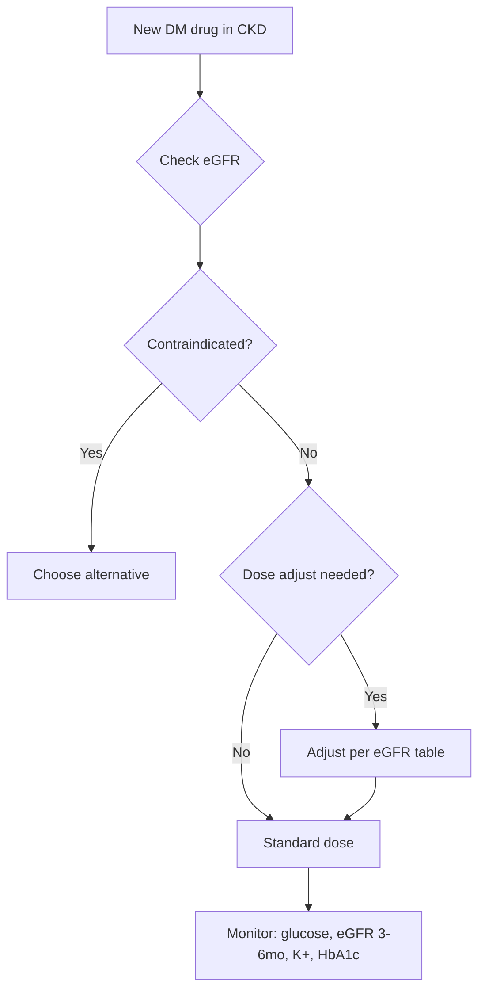

# Drug dosing in renal impairment

## 1. Learning Objectives
By the end of this note you should be able to:
- [ ] Apply eGFR-based dosing for all diabetes medications
- [ ] Identify contraindicated medications in CKD
- [ ] Apply renal adjustment for SGLT2i, GLP-1 RA, DPP-4i, insulin
- [ ] Manage medication changes during dialysis

## 1. Learning Objectives
By the end of this note you should be able to:
- [ ] Apply eGFR-based dosing for all diabetes medications
- [ ] Identify contraindicated medications in CKD
- [ ] Apply renal adjustment for SGLT2i, GLP-1 RA, DPP-4i, insulin
- [ ] Manage medication changes during dialysis

## 2. Definition & Epidemiology
| Feature | Detail |
|--------|--------|
| **eGFR estimation** | CKD-EPI 2021 (creatinine ± cystatin C) |
| **CKD Stages** | G1 >=90, G2 60-89, G3a 45-59, G3b 30-44, G4 15-29, G5 <15 |
| **Drug clearance** | ↓ renal excretion; ↑ half-life; ↑ hypoglycaemia risk |

## 2. Definition & Epidemiology
| Feature | Detail |
|--------|--------|
| **eGFR estimation** | CKD-EPI 2021 (creatinine ± cystatin C) |
| **CKD Stages** | G1 >=90, G2 60-89, G3a 45-59, G3b 30-44, G4 15-29, G5 <15 |
| **Drug clearance** | ↓ renal excretion; ↑ half-life; ↑ hypoglycaemia risk |

## 3. Clinical Features / Presentation
(N/A)

## 4. Classification / Staging / Grading

### eGFR-Based Dosing Table

| Drug Class | Agent | G3a (45-59) | G3b (30-44) | G4 (15-29) | G5 (<15/Dialysis) |
|------------|-------|-------------|-------------|------------|-------------------|
| **Biguanide** | Metformin | Full dose | **Half max dose** | **CONTRAINDICATED** | CONTRAINDICATED |
| **SGLT2i** | Dapagliflozin | Full | Full | Continue if initiated | Continue to dialysis |
| | Empagliflozin | Full | Full | Continue (initiate >=20) | Continue to dialysis |
| | Canagliflozin | Full | Full (initiate >=30) | Avoid | Avoid |
| **GLP-1 RA** | Semaglutide (SC) | No adjust | No adjust | No adjust | No adjust (limited data) |
| | Semaglutide (oral) | No adjust | No adjust | No data | No data |
| | Liraglutide | No adjust | No adjust | No adjust | No adjust |
| | Dulaglutide | No adjust | No adjust | No adjust | No adjust |
| **DPP-4i** | Linagliptin | **No adjust** | **No adjust** | **No adjust** | No adjust |
| | Sitagliptin | 50mg OD | 25mg OD | 25mg OD | 25mg OD |
| | Vildagliptin | 50mg BD | 50mg BD | 50mg OD | 50mg OD |
| | Alogliptin | 12.5mg OD | 6.25mg OD | 6.25mg OD | 6.25mg OD |
| | Saxagliptin | 2.5mg OD | 2.5mg OD | 2.5mg OD | Avoid (HF risk) |
| **Sulfonylureas** | Gliclazide MR | Standard | Standard | Reduce 50% | Avoid |
| | Glimepiride | Standard | Reduce 50% | Reduce 50% | Avoid |
| | Glipizide | Standard | Standard | Reduce 50% | Avoid |
| | Glibenclamide | **AVOID** | **AVOID** | **AVOID** | **AVOID** |
| **TZD** | Pioglitazone | Standard | Standard | Avoid | Avoid |
| **Insulin** | All types | Standard | Reduce 10-20% | Reduce 25-50% | Reduce 50-75% |

## 4. Classification / Staging / Grading

### eGFR-Based Dosing Table

| Drug Class | Agent | G3a (45-59) | G3b (30-44) | G4 (15-29) | G5 (<15/Dialysis) |
|------------|-------|-------------|-------------|------------|-------------------|
| **Biguanide** | Metformin | Full dose | **Half max dose** | **CONTRAINDICATED** | CONTRAINDICATED |
| **SGLT2i** | Dapagliflozin | Full | Full | Continue if initiated | Continue to dialysis |
| | Empagliflozin | Full | Full | Continue (initiate >=20) | Continue to dialysis |
| | Canagliflozin | Full | Full (initiate >=30) | Avoid | Avoid |
| **GLP-1 RA** | Semaglutide (SC) | No adjust | No adjust | No adjust | No adjust (limited data) |
| | Semaglutide (oral) | No adjust | No adjust | No data | No data |
| | Liraglutide | No adjust | No adjust | No adjust | No adjust |
| | Dulaglutide | No adjust | No adjust | No adjust | No adjust |
| **DPP-4i** | Linagliptin | **No adjust** | **No adjust** | **No adjust** | No adjust |
| | Sitagliptin | 50mg OD | 25mg OD | 25mg OD | 25mg OD |
| | Vildagliptin | 50mg BD | 50mg BD | 50mg OD | 50mg OD |
| | Alogliptin | 12.5mg OD | 6.25mg OD | 6.25mg OD | 6.25mg OD |
| | Saxagliptin | 2.5mg OD | 2.5mg OD | 2.5mg OD | Avoid (HF risk) |
| **Sulfonylureas** | Gliclazide MR | Standard | Standard | Reduce 50% | Avoid |
| | Glimepiride | Standard | Reduce 50% | Reduce 50% | Avoid |
| | Glipizide | Standard | Standard | Reduce 50% | Avoid |
| | Glibenclamide | **AVOID** | **AVOID** | **AVOID** | **AVOID** |
| **TZD** | Pioglitazone | Standard | Standard | Avoid | Avoid |
| **Insulin** | All types | Standard | Reduce 10-20% | Reduce 25-50% | Reduce 50-75% |

## 5. Diagnosis & Investigations
| Test | Role |
|------|------|
| **eGFR (CKD-EPI)** | Dosing guide; baseline, 3-6 monthly if <60 |
| **HbA1c** | Target per CKD stage (falsely low in G4-5) |
| **K+** | Monitor with SGLT2i, ACEi/ARB, K+-sparing diuretics |
| **Glucose** | SMBG/CGM; adjust insulin doses |

## 5. Diagnosis & Investigations
| Test | Role |
|------|------|
| **eGFR (CKD-EPI)** | Dosing guide; baseline, 3-6 monthly if <60 |
| **HbA1c** | Target per CKD stage (falsely low in G4-5) |
| **K+** | Monitor with SGLT2i, ACEi/ARB, K+-sparing diuretics |
| **Glucose** | SMBG/CGM; adjust insulin doses |

## 6. Differential Diagnosis
(N/A)

## 7. Management

### Key Principles

### Insulin Dose Reduction in CKD
| eGFR | Reduction | Notes |
|------|-----------|-------|
| **G3a (45-59)** | 10-20% | Monitor for hypo |
| **G3b (30-44)** | 20-30% | ↑ hypo risk |
| **G4 (15-29)** | 25-50% | ↑↑ hypo risk; simplify regimen |
| **G5 (<15)** | 50-75% | ↑↑↑ hypo risk; U-100 insulin; frequent monitoring |
| **Dialysis** | 50-75% | Variable needs; pre/post dialysis glucose |

### Medications to AVOID in CKD
| Drug | Reason |
|------|--------|
| **Metformin** | eGFR < 30 |
| **Glibenclamide** | All CKD (prolonged hypo) |
| **Saxagliptin** | HF risk (avoid if HF) |
| **Pioglitazone** | eGFR < 30 (HF, fracture) |
| **Canagliflozin** | eGFR < 30 (amputation risk) |
| **Exenatide XR** | eGFR < 30 (limited data) |

## 8. FCPS/MRCP High-Yield Summary
| Topic | Key Points |
|-------|------------|
| **Metformin** | eGFR >=45 full; 30-44 half; <30 CONTRAINDICATED |
| **SGLT2i** | Dapa/Empa: initiate >=20, continue to dialysis; Cana >=30 |
| **Linagliptin** | **NO renal adjustment** (biliary excretion) |
| **Sitagliptin** | 50mg (30-44), 25mg (<30) |
| **Sulfonylureas** | Gliclazide MR safe; glimepiride caution; glibenclamide AVOID |
| **GLP-1 RA** | No dose adjustment (all stages) |
| **Insulin** | Reduce 25-50% in G4-5; 50-75% in dialysis |

## 8. FCPS/MRCP High-Yield Summary
| Topic | Key Points |
|-------|------------|
| **Metformin** | eGFR >=45 full; 30-44 half; <30 CONTRAINDICATED |
| **SGLT2i** | Dapa/Empa: initiate >=20, continue to dialysis; Cana >=30 |
| **Linagliptin** | **NO renal adjustment** (biliary excretion) |
| **Sitagliptin** | 50mg (30-44), 25mg (<30) |
| **Sulfonylureas** | Gliclazide MR safe; glimepiride caution; glibenclamide AVOID |
| **GLP-1 RA** | No dose adjustment (all stages) |
| **Insulin** | Reduce 25-50% in G4-5; 50-75% in dialysis |

## 9. Viva Questions
| Question | Expected Answer |
|----------|-----------------|
| **How do you dose metformin in CKD?** | eGFR >=45: full; 30-44: half max; <30: CONTRAINDICATED |
| **Which SGLT2i can be used in eGFR < 30?** | Dapagliflozin/empagliflozin: initiate >=20, continue to dialysis; canagliflozin >=30 |
| **Which DPP-4i requires NO renal dose adjustment?** | **Linagliptin** (biliary excretion) |
| **Which sulfonylurea is preferred in CKD?** | **Gliclazide MR** (no active metabolites); glimepiride caution; glibenclamide AVOID |
| **How do you adjust insulin in dialysis?** | Reduce 50-75%; variable needs; monitor pre/post dialysis glucose; U-100 insulin |
| **Which GLP-1 RA needs dose adjustment in CKD?** | **None** - no dose adjustment for any GLP-1 RA |
| **What about saxagliptin in CKD with HF?** | Avoid (SAVOR: ↑HF hospitalisation) |

## 9. Viva Questions
| Question | Expected Answer |
|----------|-----------------|
| **How do you dose metformin in CKD?** | eGFR >=45: full; 30-44: half max; <30: CONTRAINDICATED |
| **Which SGLT2i can be used in eGFR < 30?** | Dapagliflozin/empagliflozin: initiate >=20, continue to dialysis; canagliflozin >=30 |
| **Which DPP-4i requires NO renal dose adjustment?** | **Linagliptin** (biliary excretion) |
| **Which sulfonylurea is preferred in CKD?** | **Gliclazide MR** (no active metabolites); glimepiride caution; glibenclamide AVOID |
| **How do you adjust insulin in dialysis?** | Reduce 50-75%; variable needs; monitor pre/post dialysis glucose; U-100 insulin |
| **Which GLP-1 RA needs dose adjustment in CKD?** | **None** - no dose adjustment for any GLP-1 RA |
| **What about saxagliptin in CKD with HF?** | Avoid (SAVOR: ↑HF hospitalisation) |

## 10. Confusions & Mnemonics
| Confusion | Clarification |
|-----------|---------------|
| **All SGLT2i same in CKD?** | NO - dapa/empa continue to dialysis; cana stops <30 |
| **All DPP-4i same renal dosing?** | NO - linagliptin unique (no adjust); others need reduction |
| **Metformin in all CKD?** | NO - only <30 contraindicated; 30-44 = half dose |
| **GLP-1 RA in dialysis?** | Safe; no dose adjust; limited data but used |

**Mnemonic: CKD-DOSING-DM**
- **C**KD: eGFR stages G1-5
- **K**ey: eGFR drives dosing
- **D**ose reductions: metformin (30-44 half, <30 stop)
- **O**ral agents: linagliptin NO adjust; sitagliptin 50/25
- **S**GLT2i: dapa/empa >=20 to dialysis; cana >=30
- **I**nsulin: G4-5 reduce 25-50%; dialysis 50-75%
- **N**o adjust: linagliptin, GLP-1 RA
- **G**libenclamide: AVOID all CKD
- **D**PP-4i: linagliptin unique (no adjust)
- **O**ral SU: glic MR safe; glime caution; gliben AVOID
- **S**GLT2i: dapa/empa to dialysis; cana >=30
- **I**nsulin: reduce 25-50% (G4), 50-75% (dialysis)
- **N**o adjust: GLP-1 RA (all stages)
- **M**etformin: <30 CONTRAINDICATED
- **E**zetimibe: no dose adjust
- **P**ioglitazone: avoid if eGFR<30 (HF)
- **R**enal: eGFR CKD-EPI
- **I**mpairment: dose per stage
- **N**ot all same: SGLT2i diff; DPP-4i diff; SU diff
- **G**FR: CKD-EPI equation**</think>

## PasTest Scenario SBAs (Clinical Vignettes)

> **Auto-generated PasTest/Mediscope-style scenario SBAs** grounded in the authored source. Each scenario tests a real clinical fact (triad, specific sign, contraindication, trial, first-line Rx) extracted from the topic. *Source: Ch 21: Diabetes — Drug dosing in renal impairment*

**Q1.** What is the most appropriate first-line therapy for Drug dosing in renal impairment?

  - **A.** G3a
  - **B.** An advanced/surgical therapy reserved for refractory disease
  - **C.** Symptomatic treatment only, no disease-modifying therapy
  - **D.** Empiric broad-spectrum therapy without specific indication

  > **Answer: A** — G3a
  >
  > *Source:* **G3a (45-59)**   10-20%   Monitor for hypo
---

> Auto-generated study sections for "Diabetes in CKD and dialysis" — Ch 21: Diabetes Mellitus.

## Flashcards (44 generated)

- Q: What is the definition of Diabetes in CKD and dialysis?
  A: By the end of this note you should be able to:
- Q: What is eGFR estimation of Diabetes in CKD and dialysis?
  A: CKD-EPI 2021 (creatinine ± cystatin C)
- Q: How is Diabetes in CKD and dialysis classified?
  A: G1 >=90, G2 60-89, G3a 45-59, G3b 30-44, G4 15-29, G5 <15
- Q: What is eGFR estimation of Diabetes in CKD and dialysis?
  A: CKD-EPI 2021 (creatinine ± cystatin C)
- Q: How is Diabetes in CKD and dialysis classified?
  A: G1 >=90, G2 60-89, G3a 45-59, G3b 30-44, G4 15-29, G5 <15
- Q: What is eGFR (CKD-EPI) of Diabetes in CKD and dialysis?
  A: Dosing guide; baseline, 3-6 monthly if <60
- Q: What is HbA1c of Diabetes in CKD and dialysis?
  A: Target per CKD stage (falsely low in G4-5)
- Q: What is K+ of Diabetes in CKD and dialysis?
  A: Monitor with SGLT2i, ACEi/ARB, K+-sparing diuretics
- Q: What is eGFR (CKD-EPI) of Diabetes in CKD and dialysis?
  A: Dosing guide; baseline, 3-6 monthly if <60
- Q: What is HbA1c of Diabetes in CKD and dialysis?
  A: Target per CKD stage (falsely low in G4-5)
- Q: What is K+ of Diabetes in CKD and dialysis?
  A: Monitor with SGLT2i, ACEi/ARB, K+-sparing diuretics
- Q: What is Metformin of Diabetes in CKD and dialysis?
  A: eGFR < 30
- Q: What is Glibenclamide of Diabetes in CKD and dialysis?
  A: All CKD (prolonged hypo)
- Q: What is Saxagliptin of Diabetes in CKD and dialysis?
  A: HF risk (avoid if HF)
- Q: What is Pioglitazone of Diabetes in CKD and dialysis?
  A: eGFR < 30 (HF, fracture)
- Q: What is Canagliflozin of Diabetes in CKD and dialysis?
  A: eGFR < 30 (amputation risk)
- Q: What is eGFR (CKD-EPI) of Diabetes in CKD and dialysis?
  A: Dosing guide; baseline, 3-6 monthly if <60
- Q: What is HbA1c of Diabetes in CKD and dialysis?
  A: Target per CKD stage (falsely low in G4-5)
- Q: What is K+ of Diabetes in CKD and dialysis?
  A: Monitor with SGLT2i, ACEi/ARB, K+-sparing diuretics
- Q: What is Glucose of Diabetes in CKD and dialysis?
  A: SMBG/CGM; adjust insulin doses
- Q: What is eGFR (CKD-EPI) of Diabetes in CKD and dialysis?
  A: Dosing guide; baseline, 3-6 monthly if <60
- Q: What is HbA1c of Diabetes in CKD and dialysis?
  A: Target per CKD stage (falsely low in G4-5)
- Q: What is K+ of Diabetes in CKD and dialysis?
  A: Monitor with SGLT2i, ACEi/ARB, K+-sparing diuretics
- Q: What is Glucose of Diabetes in CKD and dialysis?
  A: SMBG/CGM; adjust insulin doses
- Q: What is Metformin of Diabetes in CKD and dialysis?
  A: eGFR < 30
- Q: What is Glibenclamide of Diabetes in CKD and dialysis?
  A: All CKD (prolonged hypo)
- Q: What is Saxagliptin of Diabetes in CKD and dialysis?
  A: HF risk (avoid if HF)
- Q: What is Pioglitazone of Diabetes in CKD and dialysis?
  A: eGFR < 30 (HF, fracture)
- Q: What is Canagliflozin of Diabetes in CKD and dialysis?
  A: eGFR < 30 (amputation risk)
- Q: What is Exenatide XR of Diabetes in CKD and dialysis?
  A: eGFR < 30 (limited data)
- Q: What is Metformin of Diabetes in CKD and dialysis?
  A: eGFR >=45 full; 30-44 half; <30 CONTRAINDICATED
- Q: What is SGLT2i of Diabetes in CKD and dialysis?
  A: Dapa/Empa: initiate >=20, continue to dialysis; Cana >=30
- Q: What is Linagliptin of Diabetes in CKD and dialysis?
  A: NO renal adjustment (biliary excretion)
- Q: What is Sitagliptin of Diabetes in CKD and dialysis?
  A: 50mg (30-44), 25mg (<30)
- Q: What is Sulfonylureas of Diabetes in CKD and dialysis?
  A: Gliclazide MR safe; glimepiride caution; glibenclamide AVOID
- Q: What is GLP-1 RA of Diabetes in CKD and dialysis?
  A: No dose adjustment (all stages)
- Q: What is Insulin of Diabetes in CKD and dialysis?
  A: Reduce 25-50% in G4-5; 50-75% in dialysis
- Q: What is Metformin of Diabetes in CKD and dialysis?
  A: eGFR >=45 full; 30-44 half; <30 CONTRAINDICATED
- Q: What is SGLT2i of Diabetes in CKD and dialysis?
  A: Dapa/Empa: initiate >=20, continue to dialysis; Cana >=30
- Q: What is Linagliptin of Diabetes in CKD and dialysis?
  A: NO renal adjustment (biliary excretion)
- Q: What is Sitagliptin of Diabetes in CKD and dialysis?
  A: 50mg (30-44), 25mg (<30)
- Q: What is Sulfonylureas of Diabetes in CKD and dialysis?
  A: Gliclazide MR safe; glimepiride caution; glibenclamide AVOID
- Q: What is GLP-1 RA of Diabetes in CKD and dialysis?
  A: No dose adjustment (all stages)
- Q: What is Insulin of Diabetes in CKD and dialysis?
  A: Reduce 25-50% in G4-5; 50-75% in dialysis

## MCQs (1 generated)

1. **Which of the following best describes Diabetes in CKD and dialysis?**
   A. **By the end of this note you should be able to:**
   B. An unrelated condition not matching the clinical picture of Diabetes in CKD and dialysis
   C. A complication seen late in the disease course of Diabetes in CKD and dialysis
   D. A condition that mimics Diabetes in CKD and dialysis but has a different underlying cause

## SBA Questions (1 generated)

1. A patient with suspected Diabetes in CKD and dialysis presents with: eGFR estimation — CKD-EPI 2021 (creatinine ± cystatin C); CKD Stages — G1 >=90, G2 60-89, G3a 45-59, G3b 30-44, G4 15-29, G5 <15; Drug clearance — ↓ renal excretion; ↑ half-life; ↑ hypoglycaemia risk. What is the most likely diagnosis?
   A. **Diabetes in CKD and dialysis**
   B. A condition that mimics Diabetes in CKD and dialysis but is not the same entity
   C. A complication of Diabetes in CKD and dialysis rather than the primary diagnosis
   D. An unrelated condition in the same clinical category as Diabetes in CKD and dialysis

