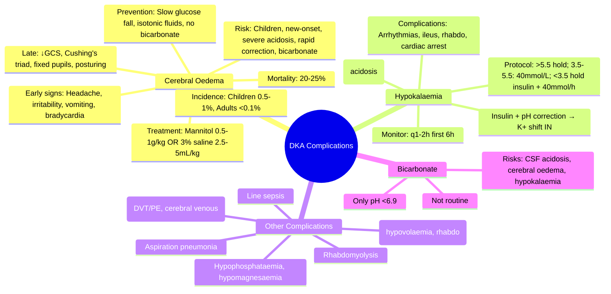

# DKA Complications (Cerebral Oedema, Hypokalaemia)

> [!info]
> **Cerebral oedema** = rare (0.5–1%) but devastating (20–25% mortality, neurological sequelae); **children > adults**, new-onset, severe acidosis, rapid fluid/insulin correction; **hypokalaemia** = lethal arrhythmia risk — intensive K+ replacement essential.

---

## 1. Learning Objectives
By the end of this note you should be able to:
- [ ] Identify risk factors for cerebral oedema in DKA
- [ ] Recognise early clinical signs of cerebral oedema
- [ ] Apply prevention strategies (fluids, insulin, bicarbonate)
- [ ] Manage hypokalaemia during DKA treatment
- [ ] Understand other DKA complications (AKI, thrombosis, rhabdomyolysis)

---

## 2. Cerebral Oedema

### Epidemiology & Risk
| Population | Incidence | Mortality | Sequelae |
|------------|-----------|-----------|----------|
| **Children** | **0.5–1%** | **20–25%** | 20–25% neuro deficit |
| **Adults** | <0.1% | High | Similar |

### Risk Factors
| Strongest | Significant |
|-----------|-------------|
| **Age <5y / new-onset T1DM** | Severe acidosis (pH <7.0) |
| **Low initial pCO2** (excessive hyperventilation) | High BUN (dehydration severity) |
| **Rapid fluid correction** (>IVF rate) | Rapid glucose fall (>5 mmol/L/h) |
| **Bicarbonate administration** | Low initial serum Na+ (pseudohyponatraemia) |
| **Delayed insulin start** | High initial glucose (>55 mmol/L) |

### Pathophysiology
| Theory | Mechanism |
|--------|-----------|
| **Vasogenic** | Blood-brain barrier disruption → fluid extravasation |
| **Cytotoxic** | Ischaemia-reperfusion → cellular oedema |
| **Osmotic** | Rapid glucose/osmolality fall → water shifts into brain |
| **Inflammatory** | Cytokine storm (IL-6, TNF-α) → BBB breakdown |

### Clinical Presentation (Early Recognition Critical)
| Early (Subtle) | Late (Ominous) |
|----------------|----------------|
| **Headache** (often severe, persistent) | **Decreased consciousness** (GCS drop) |
| **Irritability, restlessness** | **Cushing's triad**: Bradycardia, hypertension, irregular respiration |
| **Vomiting**(not just DKA nausea) | **Pupillary changes** (dilated, fixed, asymmetric) |
| **Inappropriate bradycardia** | **Decerebrate/decorticate posturing** |
| **Specific neurological signs** (cranial nerve palsies) | **Respiratory arrest** |

**Diagnosis**: Clinical — **CT head** if suspected (shows oedema, loss of grey-white differentiation, herniation).

### Management (Emergency)
| Step | Action |
|------|--------|
| **1. Recognise early** | Any neuro change in DKA → assume cerebral oedema |
| **2. Reduce fluids** | Limit IVF to **maintenance + insensible losses** (stop boluses) |
| **3. Mannitol** | **0.5–1g/kg IV over 15–20 min** (first-line) |
| **4. Hypertonic saline** | **3% NaCl 2.5–5mL/kg over 10–15 min** (alternative/addition) |
| **5. Elevate head** | 30 degrees |
| **6. Intubate** | If GCS ≤8 or respiratory compromise (avoid hyperventilation) |
| **7. ICU transfer** | Neurosurgical consultation; ICP monitoring |

**Do NOT**: Hyperventilate (↓ pCO2 → cerebral vasoconstriction → ischaemia); give bicarbonate (↑ risk).

### Prevention (Key)
| Strategy | Evidence |
|----------|----------|
| **Avoid rapid glucose fall** | Max **3–5 mmol/L/h**; if faster → increase dextrose concentration |
| **Avoid fluid overload** | Isotonic fluids (0.9% NaCl) initially; **no hypotonic**; monitor fluid balance |
| **Avoid bicarbonate** | **Contraindicated** in most DKA (↑ cerebral oedema risk, paradoxical CSF acidosis) |
| **Start insulin after initial fluids** | 1–2h after fluid resuscitation (not simultaneously with bolus) |
| **Monitor neuro status** | **Hourly GCS** in children; q2h adults |

---

## 3. Hypokalaemia — The Lethal Complication

### Physiology
- **Total body K+ depleted** (osmotic diuresis, aldosterone, vomiting)
- **Initial serum K+ often NORMAL/HIGH** (acidosis shifts K+ out of cells)
- **Insulin + pH correction → massive K+ shift INTO cells** → **severe hypokalaemia**

### K+ Replacement Protocol (DKA)
| Initial K+ | Action |
|------------|--------|
| **>5.5 mmol/L** | **Hold K+**; monitor 1h; restart when <5.5 |
| **3.5–5.5 mmol/L** | **Add 40mmol K+ per litre** IVF (20mmol KCl + 20mmol KPO4) |
| **<3.5 mmol/L** | **Hold insulin**; give **K+ 40mmol/h** (cardiac monitor) until ≥3.5; then start insulin with K+ in IVF |

**Monitoring**: **K+ every 1–2h** first 6h; then 2–4h; continuous cardiac monitoring.

### Complications of Hypokalaemia
- **Arrhythmias**: VT/VF, asystole (QT prolongation, U waves)
- **Ileus**, respiratory muscle weakness, rhabdomyolysis
- **Cardiac arrest** — leading cause of death in treated DKA

---

## 4. Other DKA Complications

| Complication | Mechanism | Management |
|--------------|-----------|------------|
| **Acute Kidney Injury** | Hypovolaemia, rhabdomyolysis, contrast | IVF resuscitation; avoid nephrotoxins; monitor Cr |
| **Rhabdomyolysis** | Dehydration, acidosis, hypokalaemia, hypophosphataemia | **Aggressive IVF** (target UO 200–300mL/h); bicarbonate if CK >5000 |
| **Thrombosis** (DVT/PE, cerebral venous) | Dehydration, hypercoagulability, inflammation | **Prophylactic LMWH** (all DKA admissions); therapeutic if confirmed |
| **Hypophosphataemia** | Osmotic diuresis, insulin-driven cellular uptake | Replace if <0.5 mmol/L or symptomatic (rhabdo, weakness) |
| **Hypomagnesaemia** | Common; worsens hypokalaemia | Replace if <0.7 mmol/L |
| **Aspiration pneumonia** | Altered consciousness, vomiting | NG tube if GCS <9; elevate head |
| **Line sepsis** | CVC for monitoring/pressors | Aseptic technique; review daily |

---

## 5. Bicarbonate Therapy — Controversial

| Position | Guideline |
|----------|-----------|
| **ADA / NICE / JBDS** | **Not routinely recommended** |
| **Indications (rare)** | pH **<6.9** (life-threatening acidosis); severe hyperkalaemia; cardiac arrest |
| **Dose** | **50–100 mmol** in 200mL 5% dextrose over 1h |
| **Risks** | Paradoxical CSF acidosis; ↑ cerebral oedema; hypokalaemia; ↓ ionised Ca2+; tissue hypoxia (left shift O2 curve) |

**Consensus**: Bicarbonate harms outweigh benefits in most DKA.

---

## 6. Exam Pearls (FCPS/MRCP)

| Topic | Key Point |
|-------|-----------|
| **Cerebral oedema incidence** | Children 0.5–1%; adults <0.1% |
| **Mortality cerebral oedema** | 20–25% |
| **Risk factors** | Children, new-onset, severe acidosis, rapid correction, bicarbonate |
| **Early signs** | Headache, irritability, vomiting, bradycardia |
| **Late signs** | ↓ GCS, Cushing's triad, fixed pupils, posturing |
| **Treatment cerebral oedema** | Mannitol 0.5–1g/kg OR 3% saline 2.5–5mL/kg; restrict fluids; ICU |
| **Hypokalaemia risk** | Insulin drives K+ into cells; initial K+ normal/high → rapid drop |
| **K+ protocol** | <3.5: hold insulin, replace K+ 40mmol/h; 3.5–5.5: 40mmol/L IVF; >5.5: hold |
| **Monitor K+** | **Every 1–2h** first 6h |
| **Bicarbonate** | **Not routine**; only pH <6.9; ↑ cerebral oedema risk |
| **AKI/rhabdo/thrombosis** | Other major complications; prophylactic LMWH for all |

---

## 8. Viva Questions (MRCP PACES / FCPS)

| Question | Expected Answer |
|----------|-----------------|
| **What is the incidence of cerebral oedema in DKA?** | Children 0.5–1%; adults <0.1% |
| **What are the main risk factors for cerebral oedema?** | Age <5y, new-onset T1DM, severe acidosis (pH <7.0), rapid fluid/insulin correction, bicarbonate use |
| **What are the early clinical signs of cerebral oedema?** | Headache, irritability, vomiting, inappropriate bradycardia |
| **What is the first-line treatment for cerebral oedema?** | Mannitol 0.5–1g/kg IV over 15–20 min OR 3% saline 2.5–5mL/kg over 10–15 min |
| **Why is bicarbonate contraindicated in most DKA?** | Paradoxical CSF acidosis; ↑ cerebral oedema risk; hypokalaemia; tissue hypoxia |
| **What is the K+ replacement protocol in DKA?** | K+ >5.5: hold; 3.5–5.5: 40mmol/L IVF; <3.5: hold insulin, give 40mmol/h K+ until ≥3.5 |
| **How often should K+ be monitored in DKA?** | Every 1–2h for first 6h, then 2–4h |
| **What are the other major DKA complications?** | AKI, rhabdomyolysis, thrombosis (DVT/PE/cerebral venous), hypoglycaemia, aspiration pneumonia |
| **Why is prophylactic LMWH given in all DKA admissions?** | Hypercoagulable state from dehydration, inflammation, immobility |

---

## 9. Confusions & Mnemonics

| Confusion | Clarification |
|-----------|---------------|
| **Cerebral oedema vs HHS** | Cerebral oedema is primarily a **DKA** complication (esp. children); HHS causes osmotic brain injury but not classic cerebral oedema |
| **Initial K+ high = no replacement needed** | **WRONG** — initial K+ is falsely high due to acidosis; total body K+ is depleted; replacement mandatory as pH corrects |
| **Bicarbonate in severe acidosis** | Only if pH <6.9; harms outweigh benefits in most DKA (↑ cerebral oedema, paradoxical CSF acidosis) |
| **Mannitol vs Hypertonic saline** | Both effective; mannitol traditional first-line; 3% saline equally effective, preferred if hypovolaemic |

**Mnemonic: DKA-COED** (Cerebral Oedema)
- **C**hildren (<5y, new-onset)
- **O**ver-rapid correction (glucose >5 mmol/L/h, fluids)
- **E**xcess bicarbonate
- **D**elayed insulin start / severe acidosis (pH <7.0)

---

## 10. Mind Map

---

## 11. One-Page Revision Card

| Domain | Key Points |
|--------|------------|
| **Cerebral Oedema** | Incidence 0.5–1% (children); mortality 20–25%; risk: children, severe acidosis, rapid correction |
| **Early Signs** | Headache, irritability, vomiting, inappropriate bradycardia |
| **Late Signs** | ↓ GCS, Cushing's triad, fixed pupils, posturing, respiratory arrest |
| **Treatment** | Mannitol 0.5–1g/kg IV OR 3% saline 2.5–5mL/kg; restrict fluids; elevate head 30°; ICU |
| **Hypokalaemia** | Total body K+ depleted; initial serum K+ normal/high → rapid drop with insulin |
| **K+ Protocol** | >5.5 hold; 3.5–5.5 → 40mmol/L IVF; <3.5 hold insulin + 40mmol/h K+ |
| **Monitor K+** | Every 1–2h first 6h; then 2–4h; continuous cardiac monitoring |
| **Bicarbonate** | NOT routine; only if pH <6.9; ↑ cerebral oedema risk |
| **Other Complications** | AKI, rhabdo, thrombosis (LMWH prophylaxis), hypoglycaemia, aspiration, line sepsis |
| **Key Scores** | GCS hourly (children); q2h (adults); pH <7.0 = high risk |

---

## 12. Spaced Repetition Trackers

| Review Interval | Date Completed | Confidence (1-5) | Notes |
|-----------------|----------------|------------------|-------|
| 24 hours | | | |
| 7 days | | | |
| 15 days | | | |
| 30 days | | | |
| 90 days | | | |

---

## 13. Self-Test Scorecard

| Section | Score /5 | Last Attempt |
|---------|----------|--------------|
| Cerebral Oedema (Epidemiology, Risk, Signs) | | |
| Cerebral Oedema (Treatment & Prevention) | | |
| Hypokalaemia (Physiology & Protocol) | | |
| Other Complications | | |
| Bicarbonate Controversy | | |
| Viva Questions | | |
| Mnemonics / Algorithms | | |

---

## 14. Local Navigation (for Dashboard UI)

> **Parent**: [[../Diabetic ketoacidosis (DKA)|Diabetic ketoacidosis (DKA)]]  
> **Hierarchy**: [[../../Davidson Chapter 25 - Diabetes Hierarchy|Diabetes Hierarchy]]  
> **Template**: [[../../../Templates/Diabetes Topic Template|Diabetes Topic Template]]  
> **See also**: [[Diabetic ketoacidosis (DKA)]], [[Euglycaemic DKA (SGLT2 inhibitor associated)]], [[Hyperosmolar hyperglycaemic state (HHS)]], [[Severe hypoglycaemia]]

## PasTest Scenario SBAs (Clinical Vignettes)

> **Auto-generated PasTest/Mediscope-style scenario SBAs** grounded in the authored source. Each scenario tests a real clinical fact (triad, specific sign, contraindication, trial, first-line Rx) extracted from the topic. *Source: Ch 21: Diabetes — dka-complications-cerebral-oedema,-hypokalaemia*

**Q1.** What is the most appropriate first-line therapy for dka-complications-cerebral-oedema,-hypokalaemia?

  - **A.** Prevention
  - **B.** An advanced/surgical therapy reserved for refractory disease
  - **C.** Symptomatic treatment only, no disease-modifying therapy
  - **D.** Empiric broad-spectrum therapy without specific indication

  > **Answer: A** — Prevention
  >
  > *Source:* Hypertonic saline**   3% NaCl 5ml/kg if mannitol contraindicated  

> **Prevention**: Osmolar decline <3 mOsm/kg/hr; avoid bicarbonate unless pH<7.0; careful fluid rate in children

### Hypokalaemia
---

> Auto-generated study sections for "Diabetic ketoacidosis (DKA)" — Ch 21: Diabetes Mellitus.

## Flashcards (1 generated)

- Q: What is the definition of Diabetic ketoacidosis (DKA)?
  A: Cerebral oedema = rare (0.5–1%) but devastating (20–25% mortality, neurological sequelae); children > adults, new-onset, severe acidosis, rapid fluid/insulin correction; hypokalaemia = lethal arrhythmia risk — intensive K+ replacement essential.

## MCQs (1 generated)

1. **Which of the following best describes Diabetic ketoacidosis (DKA)?**
   A. **Cerebral oedema = rare (0.5–1%) but devastating (20–25% mortality, neurological sequelae); children > adults, new-onset, severe acidosis, rapid fluid/insulin correction; hypokalaemia = lethal arrhythm**
   B. An unrelated condition not matching the clinical picture of Diabetic ketoacidosis (DKA)
   C. A complication seen late in the disease course of Diabetic ketoacidosis (DKA)
   D. A condition that mimics Diabetic ketoacidosis (DKA) but has a different underlying cause

## SBA Questions (1 generated)

1. A patient with suspected Diabetic ketoacidosis (DKA) presents with: Auto-generated PasTest/Mediscope-style scenario SBAs grounded in the authored source. Each scenario tests a real clinical fact (triad, specific sign, contraindication, trial, first-line Rx) extracted from the topic. Source: Ch 21: Diabetes — dka-complications-cerebral-oedema,-hypokalaemia; Q1. What is the most appropriate first-line therapy for dka-complications-cerebral-oedema,-hypokalaemia?; B. An advanced/surgical therapy reserved for refractory disease. What is the most likely diagnosis?
   A. **Diabetic ketoacidosis (DKA)**
   B. A condition that mimics Diabetic ketoacidosis (DKA) but is not the same entity
   C. A complication of Diabetic ketoacidosis (DKA) rather than the primary diagnosis
   D. An unrelated condition in the same clinical category as Diabetic ketoacidosis (DKA)

