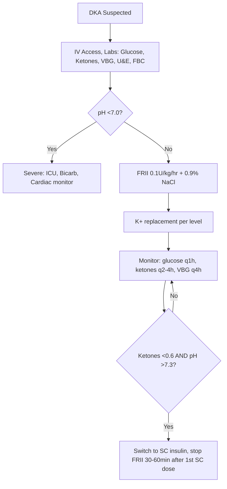

# DKA diagnosis criteria

## 1. Learning Objectives
- [ ] State DKA diagnostic criteria (glucose, ketones, pH, bicarbonate)
- [ ] Grade DKA severity (mild/moderate/severe)
- [ ] Differentiate DKA from HHS and euglycaemic DKA
- [ ] Identify precipitating factors
- [ ] Apply initial assessment scoring

## 2. Definition & Epidemiology
| Feature | Detail |
|--------|--------|
| **Definition** | Acute diabetic emergency: hyperglycaemia + ketonaemia + acidosis |
| **Diagnostic Triad** | 1) Glucose >11.1 mmol/L (200 mg/dL) 2) Ketonaemia >3 mmol/L (or significant ketonuria) 3) pH <7.3 and/or bicarbonate <15 mmol/L |
| **Incidence** | 4–8 per 1000 patient-years in T1DM; rising with SGLT2i use |
| **Mortality** | <1% (mild/moderate); 5–10% (severe); higher in elderly/comorbidities |
| **Precipitants** | Infection (pneumonia, UTI), insulin omission, MI, stroke, trauma, surgery, drugs (SGLT2i, steroids), pregnancy |

## 3. Clinical Features / Presentation
| Presentation | Frequency | Key Features |
|-------------|-----------|--------------|
| **Polyuria/polydipsia** | Universal | Precedes by days-weeks |
| **Nausea/vomiting/abdominal pain** | 75% | Abdominal pain mimics surgical abdomen |
| **Kussmaul breathing** | Moderate/severe | Deep, rapid respirations (compensatory) |
| **Dehydration** | Universal | Dry mucosa, poor skin turgor, tachycardia, hypotension |
| **Ketotic breath** | Common | Pear-drop/acetone smell |
| **Altered consciousness** | Severe | Confusion, drowsiness, coma (pH<7.0) |

## 4. Classification / Staging / Grading
| Severity | pH | Bicarbonate (mmol/L) | Ketonaemia (mmol/L) | Mental Status | K+ (mmol/L) |
|----------|-----|----------------------|---------------------|---------------|-------------|
| **Mild** | 7.25–7.30 | 15–18 | >3 | Alert | >3.5 |
| **Moderate** | 7.00–7.24 | 10–15 | >3 | Alert/drowsy | 3.0–3.5 |
| **Severe** | <7.00 | <10 | >3 | Drowsy/coma | <3.0 |

> **Euglycaemic DKA**: Glucose <13.9 mmol/L (250 mg/dL) + same ketone/pH criteria. Associated with SGLT2 inhibitors, pregnancy, starvation, alcohol.

## 5. Diagnosis & Investigations
| Investigation | Role | Key Details |
|---------------|------|-------------|
| **Blood glucose** | Confirm hyperglycaemia | Portal/venous >11.1 mmol/L |
| **Blood ketones (β-hydroxybutyrate)** | Confirm ketonaemia | >3 mmol/L diagnostic; superior to urine ketones (nitroprusside detects acetoacetate only) |
| **Venous blood gas (VBG)** | Assess acidosis | pH, bicarbonate, pCO2, base excess. VBG ≈ ABG for pH/HCO3 |
| **U&E, Creatinine** | Renal function, K+ | K+ critical for insulin safety |
| **FBC, CRP** | Infection screen | Leucocytosis common (stress + infection) |
| **ECG** | K+ effects, Ischaemia | Peaked T-waves (hyperK+), flat T/U-waves (hypoK+); silent MI |
| **CXR / Urine culture** | Precipitant identification | Pneumonia, UTI common |
| **Pregnancy test** | In women of childbearing age | Euglycaemic DKA risk |

## 6. Differential Diagnosis
| Condition | Distinguishing Features |
|-----------|-------------------------|
| **HHS** | Glucose >30 mmol/L, osmolality >320 mOsm/kg, pH >7.3, bicarbonate >18, minimal ketones |
| **Euglycaemic DKA** | Glucose <13.9 mmol/L, same ketone/pH criteria; SGLT2i, pregnancy, starvation |
| **Alcoholic ketoacidosis** | Normal/mildly elevated glucose, high ketones, metabolic acidosis; high anion gap; history alcohol binge |
| **Lactic acidosis** | Normal glucose/ketones, high lactate; metformin, sepsis, shock |
| **Renal tubular acidosis** | Normal glucose, non-anion gap acidosis, normal ketones |

## 7. Management (Immediate)
| Step | Intervention | Dose / Details |
|------|--------------|----------------|
| 1 | **Fluids**: 0.9% NaCl | 1L in 1st hour, then 500ml/hr ×2h, then 250ml/hr; adjust to correct deficit over 24–48h |
| 2 | **Insulin**: Fixed-rate IV insulin infusion (FRII) | 0.1 U/kg/hr (e.g., 50U in 50ml = 1 U/ml); continue until ketones <0.6, pH >7.3, bicarbonate >18 |
| 3 | **Potassium** | K+ <3.5: 60mmol/L in fluids; 3.5–5.5: 40mmol/L; >5.5: hold; target 4.0–5.0 |
| 4 | **Bicarbonate** | ONLY if pH <7.0 (severe): 100mmol in 400ml water + 20mmol KCl over 2h |
| 5 | **Monitoring** | Glucose q1h, ketones q2–4h, VBG q2–4h, K+ q1–2h, fluid balance, neurology (cerebral oedema in children) |

## 8. FCPS/MRCP High-Yield Summary
| Topic | Key Points |
|-------|------------|
| **Diagnostic criteria** | Glucose >11.1 + Ketones >3 mmol/L + pH <7.3 / HCO3 <15 |
| **Severity grading** | Mild: pH 7.25–7.30; Mod: 7.0–7.24; Severe: <7.0 |
| **Fluid deficit** | ~5–7L (100ml/kg); replace 50% in 12h, rest over 24–48h |
| **Insulin** | FRII 0.1 U/kg/hr; DO NOT BOLUS; continue till ketones clear |
| **K+ replacement** | <3.5: 60mmol/L; 3.5–5.5: 40mmol/L; >5.5: hold; cardiac monitor |
| **Bicarbonate** | Only if pH <7.0 |
| **Euglycaemic DKA** | Glucose <13.9; SGLT2i-associated; same management; STOP SGLT2i |
| **Cerebral oedema** | Children <20y; rapid osmolar drop; headache, bradycardia, hypertension, ↓GCS; mannitol 0.5–1g/kg |

## 9. Viva Questions
| Question | Expected Answer |
|----------|-----------------|
| **What are the diagnostic criteria for DKA?** | Glucose >11.1 mmol/L + blood ketones >3 mmol/L (or significant ketonuria) + venous pH <7.3 or bicarbonate <15 mmol/L |
| **How do you grade DKA severity?** | Mild: pH 7.25–7.30, K+ >3.5; Moderate: pH 7.00–7.24, K+ 3.0–3.5; Severe: pH <7.00, K+ <3.0 |
| **What is the initial fluid regimen?** | 0.9% NaCl 1L in 1st hour, then 500ml/hr ×2h, then 250ml/hr; total deficit ~5–7L over 24–48h |
| **What insulin regimen is used?** | Fixed-rate IV insulin infusion (FRII) 0.1 U/kg/hr (e.g., 50U Actrapid in 50ml 0.9% NaCl = 1U/ml); NO bolus |
| **How do you manage potassium?** | Replace in fluids: K+ <3.5 → 60mmol/L; 3.5–5.5 → 40mmol/L; >5.5 → hold. Target 4.0–5.0. Cardiac monitoring essential. |
| **When do you give bicarbonate?** | ONLY if pH <7.0 (severe DKA): 100mmol in 400ml water + 20mmol KCl over 2h |
| **What is euglycaemic DKA?** | DKA with glucose <13.9 mmol/L (250 mg/dL); associated with SGLT2 inhibitors, pregnancy, starvation; same ketone/pH criteria |
| **What are the complications of DKA management?** | Hypokalaemia (insulin drives K+ in), cerebral oedema (children, rapid osmolar drop), hypoglycaemia (if insulin not reduced when glucose <14), hypophosphataemia |

## 10. Confusions & Mnemonics
| Confusion | Clarification |
|-----------|---------------|
| **DKA vs HHS** | DKA: ketosis + acidosis; HHS: severe hyperosmolality, minimal ketosis, no acidosis. Mixed DKA-HHS exists. |
| **Euglycaemic DKA vs DKA** | Same ketone/pH criteria; glucose <13.9; SGLT2i is major cause; STOP SGLT2i |
| **Insulin bolus vs infusion** | NEVER bolus in DKA; FRII 0.1U/kg/hr only. Suboptimal bolus → cerebral oedema risk |

**Mnemonic: DKA-KUSS**
- **D**iagnosis: Glucose >11.1 + Ketones >3 + pH <7.3/HCO3 <15
- **K**etones: β-hydroxybutyrate >3 mmol/L (blood preferred over urine)
- **A**cidosis: pH <7.3, bicarbonate <15
- **K**+: replace aggressively (40–60mmol/L in fluids)
- **U**rine ketones: nitroprusside = acetoacetate only (misses β-OHB)
- **S**everity: Mild 7.25–7.30 / Mod 7.0–7.24 / Sev <7.0
- **S**top insulin only after ketones <0.6 + pH >7.3 (overlap 30–60min)

### Local Navigation
- **Parent Heading**: [[Diabetic Emergencies/Diabetic ketoacidosis (DKA)|Diabetic Emergencies/Diabetic ketoacidosis (DKA)]]
- **Chapter Map**: [[../../Davidson Chapter 25 - Diabetes Hierarchy|Diabetes Hierarchy]]
- **Chapter MOC": [[../../Diabetes MOC|Diabetes MOC]]
- **Drug Reference": [[../../../Clinical Therapeutics and Good Prescribing|Drugs]]
- **Related": [[]]

---
## Tags
#medicine #diabetes #davidson #fcps #mrcp #full-fcps-mrcp-note

## PasTest Scenario SBAs (Clinical Vignettes)

> **Auto-generated PasTest/Mediscope-style scenario SBAs** grounded in the authored source. Each scenario tests a real clinical fact (triad, specific sign, contraindication, trial, first-line Rx) extracted from the topic. *Source: Ch 21: Diabetes — DKA diagnosis criteria*

**Q1.** Which of the following features is most specific or characteristic of DKA diagnosis criteria?

  - **A.** Blood ketones
  - **B.** A feature common to many acute inflammatory conditions
  - **C.** A non-specific sign that does not localise the diagnosis
  - **D.** An investigation finding rather than a clinical feature

  > **Answer: A** — Blood ketones
  >
  > *Source:* ------|-------------|
| **Blood glucose** | Confirm hyperglycaemia | Portal/venous >11.1 mmol/L |
| **Blood ketones (β-hydroxybutyrate)** | Confirm ketonaemia | >3 mmol/L diagnostic; superior to urine
---

> Auto-generated study sections for "Diabetic ketoacidosis (DKA)" — Ch 21: Diabetes Mellitus.

## Flashcards (4 generated)

- Q: What is the definition of Diabetic ketoacidosis (DKA)?
  A: Acute diabetic emergency: hyperglycaemia + ketonaemia + acidosis
- Q: What is Diagnostic Triad of Diabetic ketoacidosis (DKA)?
  A: 1) Glucose >11.1 mmol/L (200 mg/dL) 2) Ketonaemia >3 mmol/L (or significant ketonuria) 3) pH <7.3 and/or bicarbonate <15 mmol/L
- Q: What is the epidemiology of Diabetic ketoacidosis (DKA)?
  A: 4–8 per 1000 patient-years in T1DM; rising with SGLT2i use
- Q: What is Mortality of Diabetic ketoacidosis (DKA)?
  A: <1% (mild/moderate); 5–10% (severe); higher in elderly/comorbidities

## MCQs (1 generated)

1. **Which of the following best describes Diabetic ketoacidosis (DKA)?**
   A. **| Definition | Acute diabetic emergency: hyperglycaemia + ketonaemia + acidosis |**
   B. An unrelated condition not matching the clinical picture of Diabetic ketoacidosis (DKA)
   C. A complication seen late in the disease course of Diabetic ketoacidosis (DKA)
   D. A condition that mimics Diabetic ketoacidosis (DKA) but has a different underlying cause

## SBA Questions (1 generated)

1. A patient with suspected Diabetic ketoacidosis (DKA) presents with: Diagnostic Triad — 1) Glucose >11.1 mmol/L (200 mg/dL) 2) Ketonaemia >3 mmol/L (or significant ketonuria) 3) pH <7.3 and/or bicarbonate <15 mmol/L; Incidence — 4–8 per 1000 patient-years in T1DM; rising with SGLT2i use; Mortality — <1% (mild/moderate); 5–10% (severe); higher in elderly/comorbidities. What is the most likely diagnosis?
   A. **Diabetic ketoacidosis (DKA)**
   B. A condition that mimics Diabetic ketoacidosis (DKA) but is not the same entity
   C. A complication of Diabetic ketoacidosis (DKA) rather than the primary diagnosis
   D. An unrelated condition in the same clinical category as Diabetic ketoacidosis (DKA)

