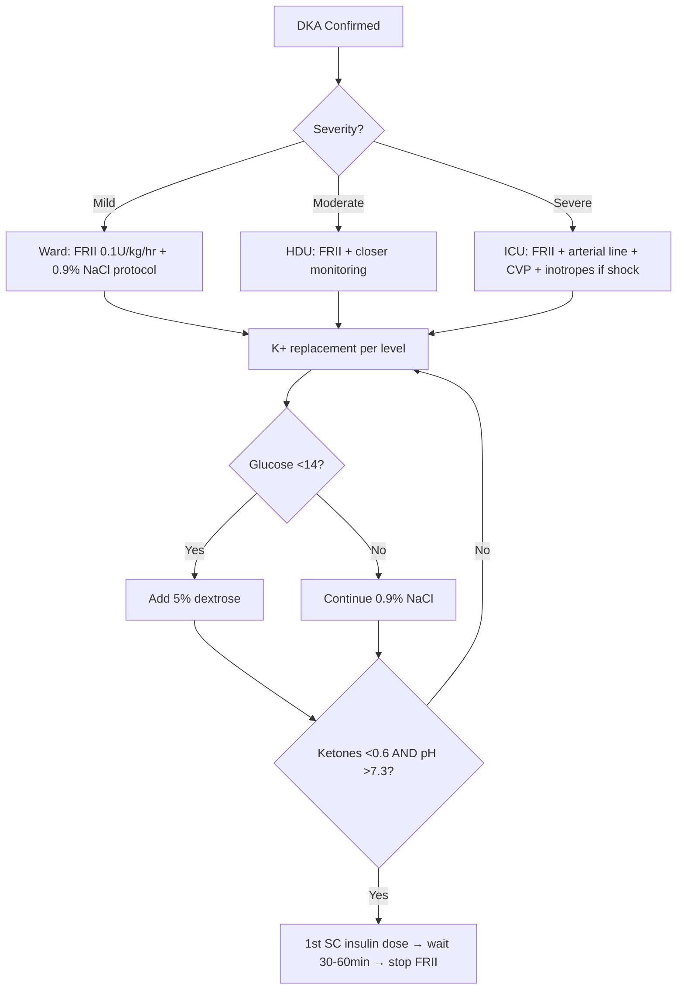

# DKA management protocol

## 1. Learning Objectives
- [ ] Execute DKA management protocol per JBDS/ADA guidelines
- [ ] Calculate fluid deficit and replacement rates
- [ ] Manage fixed-rate IV insulin infusion (FRII)
- [ ] Replace potassium safely with cardiac monitoring
- [ ] Monitor for and manage complications (cerebral oedema, hypoglycaemia, hypophosphataemia)
- [ ] Transition to subcutaneous insulin

## 2. Definition & Epidemiology
| Feature | Detail |
|--------|--------|
| **Guidelines** | JBDS (UK, 2023) / ADA (US, 2024) — broadly aligned |
| **Core Principles** | 1) Fluid resuscitation 2) Insulin infusion 3) K+ replacement 4) Bicarbonate only if pH<7.0 5) Monitoring 6) Precipitant treatment 7) Transition to SC insulin |

## 3. Clinical Features / Presentation
(See DKA diagnosis criteria — management applies after diagnosis)

## 4. Classification / Staging / Grading
(See DKA severity grading — protocol adjusts by severity)

## 5. Diagnosis & Investigations
| Investigation | Timing | Target/Action |
|---------------|--------|--------------|
| **Glucose** | q1h | ↓3–5 mmol/L/hr; if <14 → add 5% dextrose |
| **Blood ketones** | q2–4h | ↓0.5 mmol/L/hr; target clearance <0.6 |
| **VBG (pH, HCO3, pCO2)** | q2–4h | pH ↑, HCO3 ↑; severe: arterial line q1–2h |
| **K+** | q1–2h | Maintain 4.0–5.0; replace per level |
| **Fluid balance** | Hourly | Input/output, CVP if severe |
| **Neurology (GCS)** | q1–4h by severity | Cerebral oedema watch in children |

## 6. Differential Diagnosis
(N/A — management of confirmed DKA)

## 7. Management

### Fluid Resuscitation
| Phase | Fluid | Rate | Duration |
|-------|-------|------|----------|
| **1st hour** | 0.9% NaCl | 1L | 60 min |
| **Hours 2–3** | 0.9% NaCl | 500ml/hr | 2 hr |
| **Hours 4–24** | 0.9% NaCl | 250ml/hr | Adjust to replace deficit over 24–48h |
| **If Na+ ↑ >5 mmol/L** | Switch to 0.45% NaCl | Per protocol | Hypernatraemia prevention |
| **If glucose <14 mmol/L** | 5% Dextrose + 0.45%/0.9% NaCl | Match insulin infusion | Prevent hypoglycaemia |

> **Total deficit**: ~5–7L (100ml/kg). Replace 50% in 12h, rest over 24–48h.

### Insulin Therapy
| Parameter | Detail |
|-----------|--------|
| **Regimen** | Fixed-rate IV insulin infusion (FRII) |
| **Dose** | 0.1 U/kg/hr (e.g., 50U Actrapid/Humulin S in 50ml 0.9% NaCl = 1U/ml) |
| **Bolus?** | **NO IV bolus** — increases cerebral oedema risk |
| **Duration** | Until ketones <0.6 mmol/L AND pH >7.3 AND bicarbonate >18 |
| **Glucose <14** | Add 5% dextrose; **DO NOT STOP INSULIN** until ketone clearance |
| **Transition to SC** | Give 1st SC dose (basal/bolus) → continue FRII 30–60min → stop FRII |

### Potassium Replacement
| Serum K+ (mmol/L) | K+ in Fluids (mmol/L) | Notes |
|-------------------|----------------------|-------|
| **<3.0** | 60 (or 80 in severe) | **Hold insulin until K+ >3.3** — cardiac arrest risk |
| **3.0–3.5** | 60 | Cardiac monitor; replace aggressively |
| **3.5–5.5** | 40 | Standard replacement |
| **>5.5** | Hold (0) | Recheck q1h; usually falls with insulin |

> **Target**: 4.0–5.0 mmol/L. Total K+ requirement often 500–1000mmol over 24h.

### Bicarbonate
| Indication | Dose |
|------------|------|
| **pH <7.0 (severe)** | 100mmol NaHCO3 in 400ml water + 20mmol KCl over 2h |
| **pH 7.0–7.3** | **Do not give** — no outcome benefit, paradoxical CNS acidosis risk |

### Monitoring & Complications
| Complication | Prevention / Management |
|--------------|------------------------|
| **Cerebral oedema** | Children <20y: avoid rapid osmolar drop >3 mOsm/kg/hr; mannitol 0.5–1g/kg if suspected; hyperventilation; ICU |
| **Hypokalaemia** | K+ replacement per protocol; cardiac monitor; hold insulin if K+ <3.3 |
| **Hypoglycaemia** | Add 5% dextrose when glucose <14; don't stop insulin until ketones clear |
| **Hypophosphataemia** | If <0.3 mmol/L: IV phosphate (risk of hypocalcaemia) |
| **Hyperchloraemic acidosis** | From 0.9% NaCl; switch to 0.45% NaCl if Na+ rising rapidly |

## 8. FCPS/MRCP High-Yield Summary
| Topic | Key Points |
|-------|------------|
| **Fluids** | 1L 0.9% NaCl/hr ×1, then 500ml/hr ×2, then 250ml/hr; total 5–7L over 24–48h |
| **Insulin** | FRII 0.1U/kg/hr; NO bolus; continue till ketones <0.6, pH >7.3, HCO3 >18 |
| **K+** | <3.0: 60–80mmol/L (hold insulin till >3.3); 3.0–3.5: 60; 3.5–5.5: 40; >5.5: hold |
| **Bicarb** | ONLY pH <7.0: 100mmol/2h |
| **Dextrose** | Start 5% dextrose when glucose <14; DO NOT stop insulin |
| **Transition** | 1st SC dose → overlap FRII 30–60min → stop FRII |
| **Cerebral oedema** | Children: mannitol 0.5–1g/kg; ICU; avoid rapid osmolar drop |
| **Precipitant** | Treat infection (antibiotics), stop SGLT2i, etc. |

## 9. Viva Questions
| Question | Expected Answer |
|----------|-----------------|
| **What is the initial fluid regimen for DKA?** | 0.9% NaCl 1L in 1st hour, then 500ml/hr for 2h, then 250ml/hr; total deficit ~5–7L over 24–48h |
| **What insulin regimen is used?** | Fixed-rate IV insulin infusion (FRII) 0.1 U/kg/hr (e.g., 50U Actrapid in 50ml 0.9% NaCl); NO IV bolus |
| **How do you manage potassium in DKA?** | Replace in fluids: K+ <3.0 → 60–80mmol/L (hold insulin till K+>3.3); 3.0–3.5 → 60mmol/L; 3.5–5.5 → 40mmol/L; >5.5 → hold. Cardiac monitoring essential. |
| **When do you add dextrose?** | When glucose <14 mmol/L; switch to 5% dextrose + 0.45%/0.9% NaCl; continue insulin until ketones clear |
| **When do you give bicarbonate?** | ONLY if pH <7.0: 100mmol NaHCO3 in 400ml water + 20mmol KCl over 2h |
| **How do you transition to subcutaneous insulin?** | Give 1st SC dose (basal + bolus if eating) → continue FRII for 30–60min → stop FRII |
| **What are the complications of DKA treatment?** | Hypokalaemia, hypoglycaemia (if dextrose not added), cerebral oedema (children), hyperchloraemic acidosis (0.9% NaCl), hypophosphataemia |
| **What is the cereal oedema management?** | Mannitol 0.5–1g/kg IV stat; hyperventilation; ICU; avoid rapid osmolar drop >3 mOsm/kg/hr |

## 10. Confusions & Mnemonics
| Confusion | Clarification |
|-----------|---------------|
| **Stop insulin when glucose normal?** | NO — continue FRII until **ketones <0.6, pH >7.3, HCO3 >18**; glucose controlled with dextrose |
| **Bicarbonate for all acidosis?** | NO — only pH <7.0; paradoxical CNS acidosis, hypokalaemia risk |
| **Insulin bolus to start?** | NO — never bolus; FRII 0.1U/kg/hr only; bolus → cerebral oedema |

**Mnemonic: DKA-FLUIDS**
- **F**luids: 1L → 500 → 250 ml/hr (0.9% NaCl)
- **L**ow glucose <14 → 5% dextrose
- **U**nits insulin: 0.1U/kg/hr FRII (NO bolus)
- **I**nsulin continued until ketones <0.6 + pH >7.3
- **D**extrose + insulin overlap
- **S**top FRII 30-60min after 1st SC dose
- **K**+: <3.0→60-80, 3-3.5→60, 3.5-5.5→40, >5.5→hold
- **B**icarb: ONLY pH<7.0, 100mmol/2h
- **C**erebral oedema: kids, mannitol 0.5-1g/kg
- **T**ransition: SC dose → wait → stop FRII

### Local Navigation
- **Parent Heading**: [[Diabetic Emergencies/Diabetic ketoacidosis (DKA)|Diabetic Emergencies/Diabetic ketoacidosis (DKA)]]
- **Chapter Map**: [[../../Davidson Chapter 25 - Diabetes Hierarchy|Diabetes Hierarchy]]
- **Chapter MOC": [[../../Diabetes MOC|Diabetes MOC]]
- **Drug Reference": [[../../../Clinical Therapeutics and Good Prescribing|Drugs]]
- **Related": [[]]

---
## Tags
#medicine #diabetes #davidson #fcps #mrcp #full-fcps-mrcp-note

## PasTest Scenario SBAs (Clinical Vignettes)

> **Auto-generated PasTest/Mediscope-style scenario SBAs** grounded in the authored source. Each scenario tests a real clinical fact (triad, specific sign, contraindication, trial, first-line Rx) extracted from the topic. *Source: Ch 21: Diabetes — DKA management protocol*

**Q1.** What is the most appropriate first-line therapy for DKA management protocol?

  - **A.** Dose
  - **B.** An advanced/surgical therapy reserved for refractory disease
  - **C.** Symptomatic treatment only, no disease-modifying therapy
  - **D.** Empiric broad-spectrum therapy without specific indication

  > **Answer: A** — Dose
  >
  > *Source:* **Dose**   0.1 U/kg/hr (e.g., 50U Actrapid/Humulin S in 50ml 0.9% NaCl = 1U/ml)
---

> Auto-generated study sections for "Diabetic ketoacidosis (DKA)" — Ch 21: Diabetes Mellitus.

## Flashcards (32 generated)

- Q: What is the definition of Diabetic ketoacidosis (DKA)?
  A: | Guidelines | JBDS (UK, 2023) / ADA (US, 2024) — broadly aligned |
- Q: What is Regimen of Diabetic ketoacidosis (DKA)?
  A: Fixed-rate IV insulin infusion (FRII)
- Q: What is the dose of Diabetic ketoacidosis (DKA)?
  A: 0.1 U/kg/hr (e.g., 50U Actrapid/Humulin S in 50ml 0.9% NaCl = 1U/ml)
- Q: What is Bolus? of Diabetic ketoacidosis (DKA)?
  A: NO IV bolus — increases cerebral oedema risk
- Q: What is Duration of Diabetic ketoacidosis (DKA)?
  A: Until ketones <0.6 mmol/L AND pH >7.3 AND bicarbonate >18
- Q: What is Glucose <14 of Diabetic ketoacidosis (DKA)?
  A: Add 5% dextrose; DO NOT STOP INSULIN until ketone clearance
- Q: What is Transition to SC of Diabetic ketoacidosis (DKA)?
  A: Give 1st SC dose (basal/bolus) → continue FRII 30–60min → stop FRII
- Q: What is pH <7.0 (severe) of Diabetic ketoacidosis (DKA)?
  A: 100mmol NaHCO3 in 400ml water + 20mmol KCl over 2h
- Q: What is pH 7.0–7.3 of Diabetic ketoacidosis (DKA)?
  A: Do not give — no outcome benefit, paradoxical CNS acidosis risk
- Q: What is Cerebral oedema of Diabetic ketoacidosis (DKA)?
  A: Children <20y: avoid rapid osmolar drop >3 mOsm/kg/hr; mannitol 0.5–1g/kg if suspected; hyperventilation; ICU
- Q: What is Hypokalaemia of Diabetic ketoacidosis (DKA)?
  A: K+ replacement per protocol; cardiac monitor; hold insulin if K+ <3.3
- Q: What is Hypoglycaemia of Diabetic ketoacidosis (DKA)?
  A: Add 5% dextrose when glucose <14; don't stop insulin until ketones clear
- Q: What is Hypophosphataemia of Diabetic ketoacidosis (DKA)?
  A: If <0.3 mmol/L: IV phosphate (risk of hypocalcaemia)
- Q: What is Hyperchloraemic acidosis of Diabetic ketoacidosis (DKA)?
  A: From 0.9% NaCl; switch to 0.45% NaCl if Na+ rising rapidly
- Q: What is Regimen of Diabetic ketoacidosis (DKA)?
  A: Fixed-rate IV insulin infusion (FRII)
- Q: What is the dose of Diabetic ketoacidosis (DKA)?
  A: 0.1 U/kg/hr (e.g., 50U Actrapid/Humulin S in 50ml 0.9% NaCl = 1U/ml)
- Q: What is Bolus? of Diabetic ketoacidosis (DKA)?
  A: NO IV bolus — increases cerebral oedema risk
- Q: What is Duration of Diabetic ketoacidosis (DKA)?
  A: Until ketones <0.6 mmol/L AND pH >7.3 AND bicarbonate >18
- Q: What is Glucose <14 of Diabetic ketoacidosis (DKA)?
  A: Add 5% dextrose; DO NOT STOP INSULIN until ketone clearance
- Q: What is Cerebral oedema of Diabetic ketoacidosis (DKA)?
  A: Children <20y: avoid rapid osmolar drop >3 mOsm/kg/hr; mannitol 0.5–1g/kg if suspected; hyperventilation; ICU
- Q: What is Hypokalaemia of Diabetic ketoacidosis (DKA)?
  A: K+ replacement per protocol; cardiac monitor; hold insulin if K+ <3.3
- Q: What is Hypoglycaemia of Diabetic ketoacidosis (DKA)?
  A: Add 5% dextrose when glucose <14; don't stop insulin until ketones clear
- Q: What is Hypophosphataemia of Diabetic ketoacidosis (DKA)?
  A: If <0.3 mmol/L: IV phosphate (risk of hypocalcaemia)
- Q: What is Hyperchloraemic acidosis of Diabetic ketoacidosis (DKA)?
  A: From 0.9% NaCl; switch to 0.45% NaCl if Na+ rising rapidly
- Q: What is Fluids of Diabetic ketoacidosis (DKA)?
  A: 1L 0.9% NaCl/hr ×1, then 500ml/hr ×2, then 250ml/hr; total 5–7L over 24–48h
- Q: What is Insulin of Diabetic ketoacidosis (DKA)?
  A: FRII 0.1U/kg/hr; NO bolus; continue till ketones <0.6, pH >7.3, HCO3 >18
- Q: What is K+ of Diabetic ketoacidosis (DKA)?
  A: <3.0: 60–80mmol/L (hold insulin till >3.3); 3.0–3.5: 60; 3.5–5.5: 40; >5.5: hold
- Q: What is Bicarb of Diabetic ketoacidosis (DKA)?
  A: ONLY pH <7.0: 100mmol/2h
- Q: What is Dextrose of Diabetic ketoacidosis (DKA)?
  A: Start 5% dextrose when glucose <14; DO NOT stop insulin
- Q: What is Transition of Diabetic ketoacidosis (DKA)?
  A: 1st SC dose → overlap FRII 30–60min → stop FRII
- Q: What is Cerebral oedema of Diabetic ketoacidosis (DKA)?
  A: Children: mannitol 0.5–1g/kg; ICU; avoid rapid osmolar drop
- Q: What is Precipitant of Diabetic ketoacidosis (DKA)?
  A: Treat infection (antibiotics), stop SGLT2i, etc.

## MCQs (1 generated)

1. **Which of the following best describes Diabetic ketoacidosis (DKA)?**
   A. **| Guidelines | JBDS (UK, 2023) / ADA (US, 2024) — broadly aligned |**
   B. An unrelated condition not matching the clinical picture of Diabetic ketoacidosis (DKA)
   C. A complication seen late in the disease course of Diabetic ketoacidosis (DKA)
   D. A condition that mimics Diabetic ketoacidosis (DKA) but has a different underlying cause

## SBA Questions (1 generated)

1. A patient with suspected Diabetic ketoacidosis (DKA) presents with: Guidelines — JBDS (UK, 2023) / ADA (US, 2024) — broadly aligned; Core Principles — 1) Fluid resuscitation 2) Insulin infusion 3) K+ replacement 4) Bicarbonate only if pH<7.0 5) Monitoring 6) Precipitant treatment 7) Transition to SC insulin. What is the most likely diagnosis?
   A. **Diabetic ketoacidosis (DKA)**
   B. A condition that mimics Diabetic ketoacidosis (DKA) but is not the same entity
   C. A complication of Diabetic ketoacidosis (DKA) rather than the primary diagnosis
   D. An unrelated condition in the same clinical category as Diabetic ketoacidosis (DKA)

